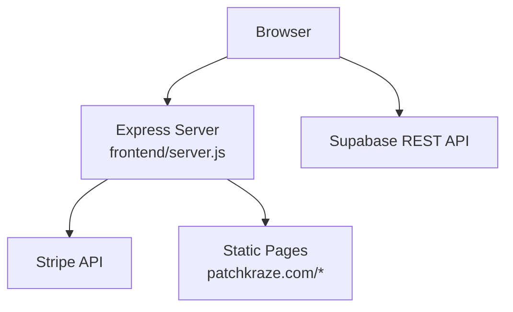
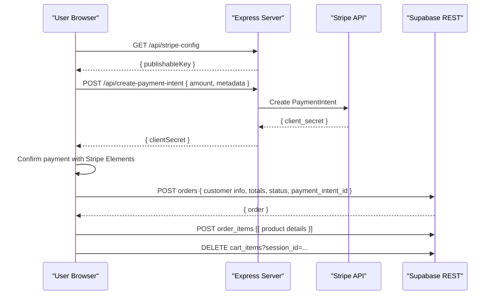
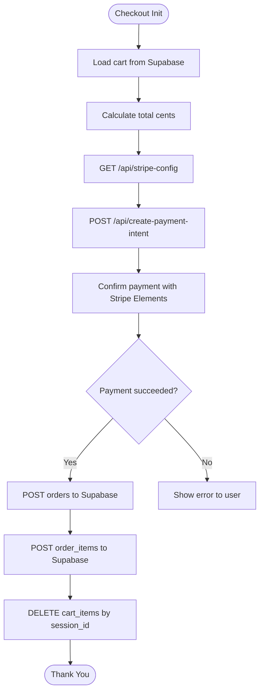
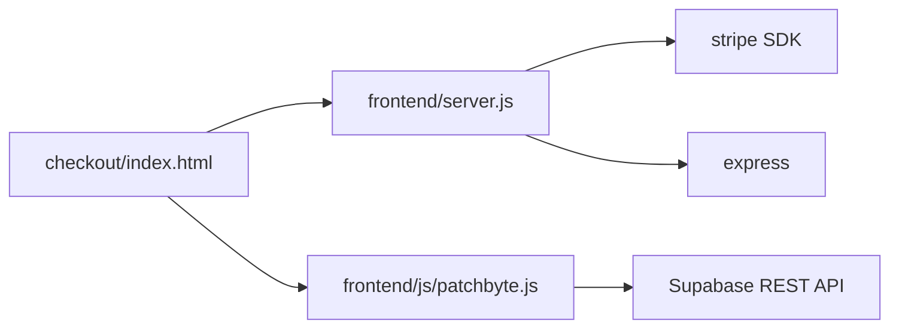

# API Reference

<cite>
**Referenced Files in This Document**
- [api/index.js](file://api/index.js)
- [frontend/server.js](file://frontend/server.js)
- [package.json](file://package.json)
- [frontend/js/patchbyte.js](file://frontend/js/patchbyte.js)
- [frontend/patchkraze.com/checkout/index.html](file://frontend/patchkraze.com/checkout/index.html)
- [migrate-tables.sql](file://migrate-tables.sql)
</cite>

## Table of Contents
1. [Introduction](#introduction)
2. [Project Structure](#project-structure)
3. [Core Components](#core-components)
4. [Architecture Overview](#architecture-overview)
5. [Detailed Component Analysis](#detailed-component-analysis)
6. [Dependency Analysis](#dependency-analysis)
7. [Performance Considerations](#performance-considerations)
8. [Troubleshooting Guide](#troubleshooting-guide)
9. [Conclusion](#conclusion)
10. [Appendices](#appendices)

## Introduction
This document provides a comprehensive API reference for the Patch-Byte backend services. It covers:
- REST endpoints exposed by the Node/Express server (Stripe payment intent creation and Stripe publishable key retrieval)
- Frontend-to-backend interactions for checkout flows
- Supabase REST API usage patterns for cart and order management from the browser
- Error response formats, status codes, and common error scenarios
- Security considerations and best practices for consuming these APIs
- The internal contract between frontend components and backend services

## Project Structure
The backend is a minimal Express application that serves static content and exposes a small set of API routes for payments. The frontend uses a client-side script to interact with Supabase’s REST API directly for cart and order persistence.

**Diagram sources**
- [frontend/server.js:1-123](file://frontend/server.js#L1-L123)
- [frontend/js/patchbyte.js:10-65](file://frontend/js/patchbyte.js#L10-L65)

**Section sources**
- [frontend/server.js:1-123](file://frontend/server.js#L1-L123)
- [package.json:1-14](file://package.json#L1-L14)

## Core Components
- Express server exposing:
  - POST /api/create-payment-intent: Creates a Stripe PaymentIntent
  - GET /api/stripe-config: Returns Stripe publishable key
- Frontend Supabase integration via patchbyte.js:
  - Direct calls to Supabase REST API for cart_items, orders, order_items, contact_submissions
- Checkout page orchestrating Stripe confirmation and order creation

**Section sources**
- [frontend/server.js:17-44](file://frontend/server.js#L17-L44)
- [frontend/js/patchbyte.js:33-65](file://frontend/js/patchbyte.js#L33-L65)
- [frontend/patchkraze.com/checkout/index.html:191-350](file://frontend/patchkraze.com/checkout/index.html#L191-L350)

## Architecture Overview
The checkout flow integrates three layers:
- Frontend UI collects user input and cart data
- Backend creates a Stripe PaymentIntent securely on the server
- Frontend confirms payment via Stripe Elements and then persists order data to Supabase

**Diagram sources**
- [frontend/server.js:17-44](file://frontend/server.js#L17-L44)
- [frontend/patchkraze.com/checkout/index.html:191-350](file://frontend/patchkraze.com/checkout/index.html#L191-L350)
- [frontend/js/patchbyte.js:43-65](file://frontend/js/patchbyte.js#L43-L65)

## Detailed Component Analysis

### REST Endpoints (Server)
- POST /api/create-payment-intent
  - Purpose: Create a Stripe PaymentIntent for checkout
  - Authentication: None at endpoint level; relies on server-side secret key environment variable
  - Request body:
    - amount: number (cents)
    - metadata: object (optional)
  - Success response:
    - 200 OK: { clientSecret: string }
  - Error responses:
    - 400 Bad Request: { error: string } (invalid amount or Stripe error)
    - 500 Internal Server Error: { error: string } (Stripe not configured)
  - Notes: Currency is fixed to USD; automatic payment methods enabled

- GET /api/stripe-config
  - Purpose: Provide Stripe publishable key to the frontend
  - Authentication: None
  - Success response:
    - 200 OK: { publishableKey: string }

- Static file serving and CDN proxy
  - Serves static pages under patchkraze.com/*
  - Proxies /cdn/* requests to Shopify CDN when not found locally

**Section sources**
- [frontend/server.js:17-44](file://frontend/server.js#L17-L44)
- [frontend/server.js:46-65](file://frontend/server.js#L46-L65)

### Stripe Integration Details
- PaymentIntent creation validates amount and returns a client secret used by Stripe Elements
- Errors are logged server-side and returned as JSON errors to the client
- No webhook handler is implemented in this repository; webhooks would typically be handled server-side to confirm payment completion and update order state

**Section sources**
- [frontend/server.js:17-39](file://frontend/server.js#L17-L39)

### Supabase REST API Usage Patterns (Frontend)
The frontend script patchbyte.js defines helpers to call Supabase REST API directly from the browser using an anon key.

- Base URL: https://hjnowvzxusjjyhxxgdji.supabase.co/rest/v1
- Headers:
  - apikey: <supabase-anon-key>
  - Authorization: Bearer <supabase-anon-key>
  - Content-Type: application/json

- Tables and operations:
  - cart_items
    - GET: Retrieve items for session_id
    - POST: Add item with fields: session_id, product_slug, product_name, unit_price, quantity, properties
    - PATCH: Update quantity by id
    - DELETE: Remove item by id or clear all by session_id
  - orders
    - POST: Create order with fields: session_id, customer_name, customer_email, customer_phone, shipping_address (JSON), notes, subtotal, total, status, payment_intent_id
  - order_items
    - POST: Create line items linked to order_id with fields: order_id, product_slug, product_name, unit_price, quantity, properties
  - contact_submissions
    - POST: Submit contact form with fields: name, email, phone, message

- Query examples used by the frontend:
  - Get cart: GET cart_items?session_id=eq.<id>&order=created_at.asc
  - Update item: PATCH cart_items?id=eq.<id> { quantity }
  - Clear cart: DELETE cart_items?session_id=eq.<id>

**Section sources**
- [frontend/js/patchbyte.js:10-65](file://frontend/js/patchbyte.js#L10-L65)
- [frontend/js/patchbyte.js:69-111](file://frontend/js/patchbyte.js#L69-L111)
- [frontend/patchkraze.com/checkout/index.html:309-337](file://frontend/patchkraze.com/checkout/index.html#L309-L337)
- [migrate-tables.sql:5-34](file://migrate-tables.sql#L5-L34)

### Checkout Flow (Frontend)
- Loads Stripe Elements and mounts payment component
- Calls /api/create-payment-intent with total cents and metadata including session_id
- Confirms payment via stripe.confirmPayment
- On success, posts order and order_items to Supabase and clears cart

**Diagram sources**
- [frontend/patchkraze.com/checkout/index.html:191-350](file://frontend/patchkraze.com/checkout/index.html#L191-L350)
- [frontend/server.js:17-44](file://frontend/server.js#L17-L44)
- [frontend/js/patchbyte.js:43-65](file://frontend/js/patchbyte.js#L43-L65)

### Database Schema and Row-Level Security
- Tables extended via migration:
  - cart_items: product_slug, product_name, unit_price, properties
  - orders: customer_name, customer_email, customer_phone, shipping_address (JSONB), notes, total, status
  - order_items: product_slug, product_name, unit_price, properties
  - contact_submissions: name, email, phone, message
- RLS policies allow anonymous inserts/reads for public-facing features

**Section sources**
- [migrate-tables.sql:5-56](file://migrate-tables.sql#L5-L56)

## Dependency Analysis
- Server dependencies:
  - express: HTTP server and routing
  - stripe: SDK for creating PaymentIntents
  - dotenv: Environment variable loading in local dev
- Frontend dependencies:
  - Stripe JS SDK loaded from js.stripe.com
  - Supabase REST accessed directly from browser using anon key

**Diagram sources**
- [package.json:9-13](file://package.json#L9-L13)
- [frontend/server.js:1-15](file://frontend/server.js#L1-L15)
- [frontend/js/patchbyte.js:10-17](file://frontend/js/patchbyte.js#L10-L17)

**Section sources**
- [package.json:1-14](file://package.json#L1-L14)
- [frontend/server.js:1-15](file://frontend/server.js#L1-L15)
- [frontend/js/patchbyte.js:10-17](file://frontend/js/patchbyte.js#L10-L17)

## Performance Considerations
- Static asset caching: CDN proxy sets Cache-Control headers for assets
- Minimal server logic: Only essential endpoints reduce latency
- Frontend caching: Session stored in localStorage to avoid repeated lookups
- Recommendations:
  - Implement rate limiting middleware on Express endpoints to protect against abuse
  - Use Supabase Edge Functions or server-side handlers for sensitive operations if needed
  - Add request validation and sanitization before persisting to database

[No sources needed since this section provides general guidance]

## Troubleshooting Guide
Common issues and resolutions:
- Stripe not configured on server
  - Symptom: 500 response with error indicating Stripe is not configured
  - Resolution: Ensure STRIPE_SECRET_KEY and STRIPE_PUBLISHABLE_KEY are set in environment variables
- Invalid amount
  - Symptom: 400 response with error “Invalid amount”
  - Resolution: Send amount in cents as a positive integer
- Payment not completed
  - Symptom: Frontend error stating payment not completed with status
  - Resolution: Check Stripe Elements confirmation and ensure return_url is correct
- Supabase access errors
  - Symptom: Network errors or empty results when calling Supabase REST
  - Resolution: Verify anon key and RLS policies; ensure tables exist and have required columns per migration

**Section sources**
- [frontend/server.js:17-39](file://frontend/server.js#L17-L39)
- [frontend/patchkraze.com/checkout/index.html:286-350](file://frontend/patchkraze.com/checkout/index.html#L286-L350)
- [migrate-tables.sql:5-56](file://migrate-tables.sql#L5-L56)

## Conclusion
Patch-Byte provides a lightweight backend for payment intent creation and a frontend-driven integration with Supabase for cart and order management. The architecture emphasizes simplicity and direct client-server interactions while maintaining secure handling of payment secrets on the server. For production readiness, consider adding rate limiting, robust error handling, webhook processing, and stricter security controls.

[No sources needed since this section summarizes without analyzing specific files]

## Appendices

### API Endpoints Summary
- POST /api/create-payment-intent
  - Request: { amount: number, metadata?: object }
  - Response: { clientSecret: string }
  - Status Codes: 200, 400, 500
- GET /api/stripe-config
  - Response: { publishableKey: string }
  - Status Code: 200

### Supabase Tables and Fields
- cart_items: session_id, product_slug, product_name, unit_price, quantity, properties
- orders: session_id, customer_name, customer_email, customer_phone, shipping_address (JSON), notes, subtotal, total, status, payment_intent_id
- order_items: order_id, product_slug, product_name, unit_price, quantity, properties
- contact_submissions: name, email, phone, message

**Section sources**
- [frontend/server.js:17-44](file://frontend/server.js#L17-L44)
- [frontend/js/patchbyte.js:69-111](file://frontend/js/patchbyte.js#L69-L111)
- [migrate-tables.sql:5-34](file://migrate-tables.sql#L5-L34)

### Security Considerations and Best Practices
- Keep STRIPE_SECRET_KEY server-side only; never expose it to the client
- Use HTTPS for all endpoints and ensure CORS is properly configured if serving cross-origin
- Validate and sanitize all inputs before persisting to Supabase
- Implement rate limiting and request throttling on server endpoints
- Rotate Supabase anon keys periodically and restrict permissions via RLS policies
- Avoid storing sensitive data in localStorage beyond session identifiers

[No sources needed since this section provides general guidance]