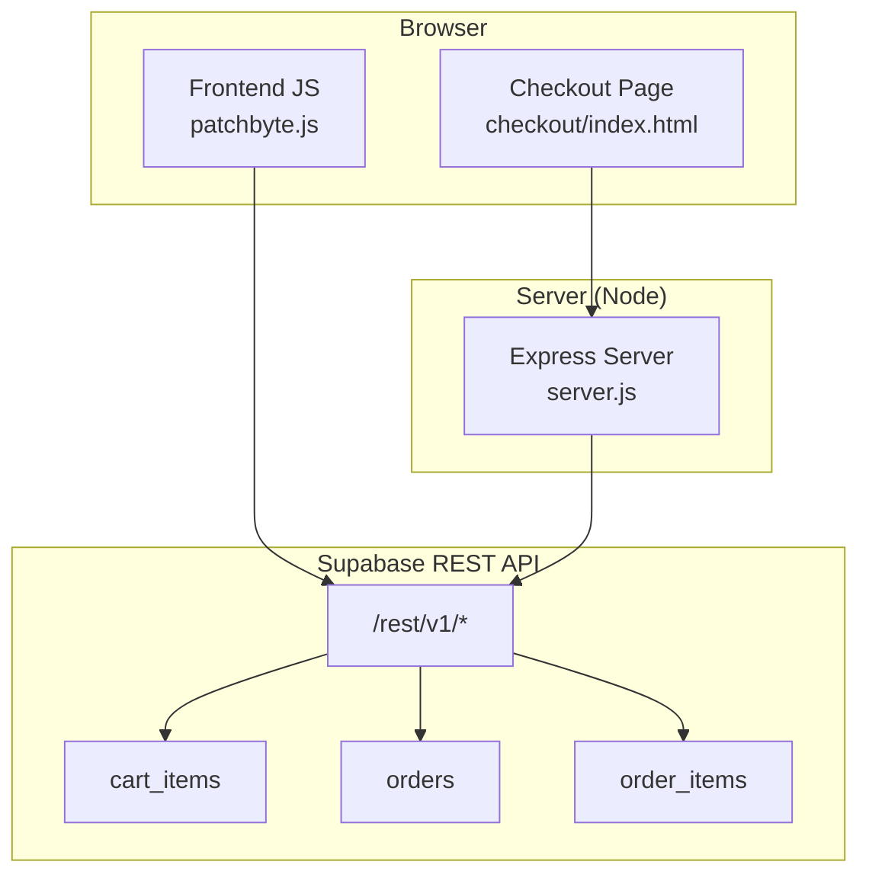
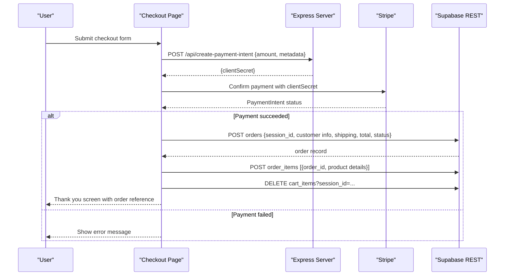
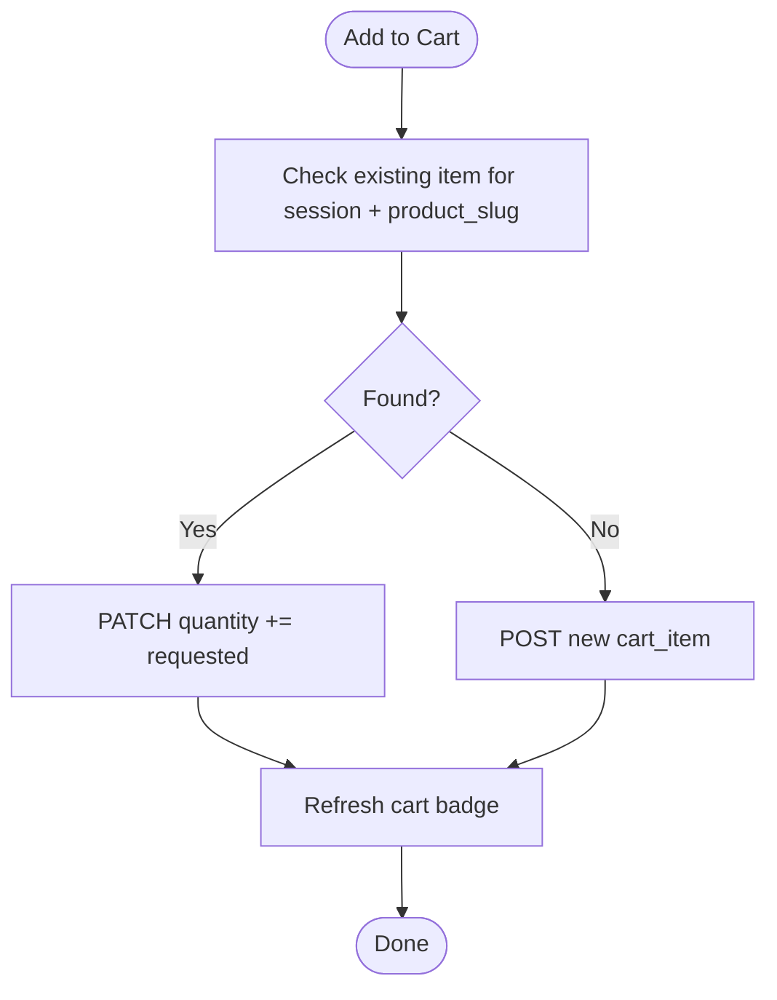
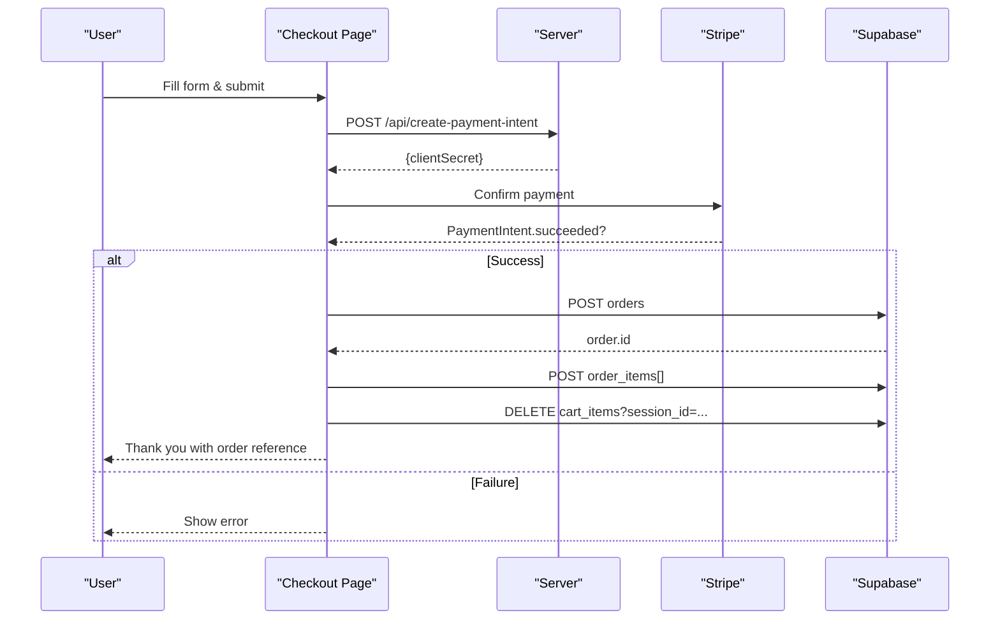
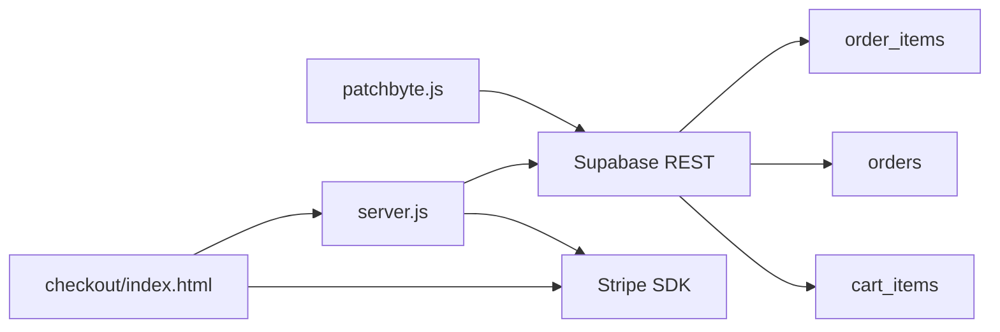

# Cart and Order Management APIs

<cite>
**Referenced Files in This Document**
- [patchbyte.js](file://frontend/js/patchbyte.js)
- [migrate-tables.sql](file://migrate-tables.sql)
- [index.html (checkout)](file://frontend/patchkraze.com/checkout/index.html)
- [server.js](file://frontend/server.js)
</cite>

## Table of Contents
1. Introduction
2. Project Structure
3. Core Components
4. Architecture Overview
5. Detailed Component Analysis
6. Dependency Analysis
7. Performance Considerations
8. Troubleshooting Guide
9. Conclusion
10. Appendices

## Introduction
This document provides comprehensive API documentation for cart and order management using the Supabase REST API as implemented in this project. It covers:
- CRUD operations for cart items (add, update, remove, clear)
- Order creation workflow, status handling, and order history retrieval patterns
- Data schemas for cart items and orders
- Authentication via Supabase anonymous JWT tokens
- Row-level security policies applied to tables
- Real-time subscription guidance
- Error handling, validation rules, and performance considerations for high-volume operations

## Project Structure
The implementation is primarily client-side JavaScript that calls the Supabase REST API directly from the browser. A small server exposes Stripe endpoints used during checkout.

**Diagram sources**
- [patchbyte.js:10-17](file://frontend/js/patchbyte.js#L10-L17)
- [patchbyte.js:33-65](file://frontend/js/patchbyte.js#L33-L65)
- [index.html (checkout):191-212](file://frontend/patchkraze.com/checkout/index.html#L191-L212)
- [server.js:17-44](file://frontend/server.js#L17-L44)

**Section sources**
- [patchbyte.js:10-17](file://frontend/js/patchbyte.js#L10-L17)
- [server.js:17-44](file://frontend/server.js#L17-L44)

## Core Components
- Supabase REST client helpers for GET, POST, PATCH, DELETE with headers including apikey and Authorization Bearer token
- Session management via a local session ID stored in localStorage
- Cart operations: get, add, update quantity, remove by id, clear by session
- Checkout flow: create payment intent via server, confirm payment with Stripe, persist order and order items, clear cart
- Row-level security policies enabling anonymous access to cart_items, orders, and order_items

**Section sources**
- [patchbyte.js:19-65](file://frontend/js/patchbyte.js#L19-L65)
- [patchbyte.js:67-111](file://frontend/js/patchbyte.js#L67-L111)
- [migrate-tables.sql:36-56](file://migrate-tables.sql#L36-L56)

## Architecture Overview
The system uses a lightweight client-side integration with Supabase REST API. The checkout page integrates Stripe for payments and persists orders to Supabase after successful payment confirmation.

**Diagram sources**
- [index.html (checkout):200-212](file://frontend/patchkraze.com/checkout/index.html#L200-L212)
- [index.html (checkout):286-338](file://frontend/patchkraze.com/checkout/index.html#L286-L338)
- [server.js:17-39](file://frontend/server.js#L17-L39)

## Detailed Component Analysis

### Authentication and Headers
- All requests include:
  - Header: apikey
  - Header: Authorization: Bearer <supabase-anon-key>
  - Header: Content-Type: application/json
- Requests are routed to https://<project>.supabase.co/rest/v1/<table>?filters

**Section sources**
- [patchbyte.js:10-17](file://frontend/js/patchbyte.js#L10-L17)
- [patchbyte.js:33-65](file://frontend/js/patchbyte.js#L33-L65)

### Session Management
- A persistent session_id is stored in localStorage and used to associate cart items and orders with a user session.
- Functions exposed publicly: getSession(), getCart(), addToCart(), updateCartItem(), clearCart()

**Section sources**
- [patchbyte.js:19-29](file://frontend/js/patchbyte.js#L19-L29)
- [patchbyte.js:331-342](file://frontend/js/patchbyte.js#L331-L342)

### Cart Items Schema
- table: cart_items
- Columns added by migration:
  - product_slug TEXT
  - product_name TEXT
  - unit_price DECIMAL(10,2) DEFAULT 0
  - properties JSONB DEFAULT '{}'
- Additional columns expected by usage:
  - session_id TEXT (used to group items per session)
  - quantity INTEGER (used in add/update/clear)
  - created_at TIMESTAMP (used for ordering)

Notes:
- The migration adds these columns; ensure they exist before running the frontend.
- Row-level security allows anonymous inserts/reads/writes for all rows.

**Section sources**
- [migrate-tables.sql:5-10](file://migrate-tables.sql#L5-L10)
- [patchbyte.js:69-96](file://frontend/js/patchbyte.js#L69-L96)
- [migrate-tables.sql:36-41](file://migrate-tables.sql#L36-L41)

### Orders Schema
- table: orders
- Columns added by migration:
  - customer_name TEXT
  - customer_email TEXT
  - customer_phone TEXT
  - shipping_address JSONB DEFAULT '{}'
  - notes TEXT DEFAULT ''
  - total DECIMAL(10,2) DEFAULT 0
  - status TEXT DEFAULT 'pending'
- Usage in checkout also includes:
  - session_id TEXT (to link order to session)
  - subtotal DECIMAL(10,2) (used in checkout)
  - payment_intent_id TEXT (optional, linked to Stripe)

Notes:
- Status values observed: pending, paid.
- Row-level security allows anonymous writes.

**Section sources**
- [migrate-tables.sql:12-20](file://migrate-tables.sql#L12-L20)
- [index.html (checkout):309-320](file://frontend/patchkraze.com/checkout/index.html#L309-L320)
- [migrate-tables.sql:43-46](file://migrate-tables.sql#L43-L46)

### Order Items Schema
- table: order_items
- Columns added by migration:
  - product_slug TEXT
  - product_name TEXT
  - unit_price DECIMAL(10,2) DEFAULT 0
  - properties JSONB DEFAULT '{}'
- Usage in checkout:
  - order_id INTEGER or UUID (foreign key to orders.id)
  - quantity INTEGER

Notes:
- Row-level security allows anonymous writes.

**Section sources**
- [migrate-tables.sql:22-27](file://migrate-tables.sql#L22-L27)
- [index.html (checkout):326-336](file://frontend/patchkraze.com/checkout/index.html#L326-L336)
- [migrate-tables.sql:48-51](file://migrate-tables.sql#L48-L51)

### Cart Operations (CRUD)
- Get cart:
  - GET /rest/v1/cart_items?session_id=eq.<sid>&order=created_at.asc
  - Returns array of cart items for the current session
- Add item:
  - If item exists for same product_slug in session, PATCH quantity increment
  - Else POST new cart_item with session_id, product_slug, product_name, unit_price, quantity, properties
- Update item:
  - PATCH cart_items?id=eq.<id> with new quantity
  - If quantity <= 0, DELETE item by id
- Clear cart:
  - DELETE cart_items?session_id=eq.<sid>

**Diagram sources**
- [patchbyte.js:74-96](file://frontend/js/patchbyte.js#L74-L96)
- [patchbyte.js:98-111](file://frontend/js/patchbyte.js#L98-L111)

**Section sources**
- [patchbyte.js:69-111](file://frontend/js/patchbyte.js#L69-L111)

### Order Creation Workflow
- Validate required fields on checkout form
- Create Stripe PaymentIntent via server endpoint
- Confirm payment with Stripe
- On success:
  - POST orders with session_id, customer info, shipping address, totals, status set to paid, optional payment_intent_id
  - POST order_items for each cart item with order_id, product details, quantities
  - Clear cart for the session
  - Show thank-you screen with order reference

**Diagram sources**
- [index.html (checkout):200-212](file://frontend/patchkraze.com/checkout/index.html#L200-L212)
- [index.html (checkout):286-338](file://frontend/patchkraze.com/checkout/index.html#L286-L338)
- [server.js:17-39](file://frontend/server.js#L17-L39)

**Section sources**
- [index.html (checkout):260-351](file://frontend/patchkraze.com/checkout/index.html#L260-L351)
- [server.js:17-44](file://frontend/server.js#L17-L44)

### Order History Retrieval
- Query orders by session_id or other filters using GET /rest/v1/orders?filters
- Example pattern: GET /rest/v1/orders?session_id=eq.<sid>&order=created_at.desc
- For detailed line items, query order_items with order_id filter

Note:
- Ensure appropriate RLS policies if restricting access to specific users later.

**Section sources**
- [migrate-tables.sql:12-20](file://migrate-tables.sql#L12-L20)
- [migrate-tables.sql:43-46](file://migrate-tables.sql#L43-L46)

### Row-Level Security Policies
- Tables enabled with RLS and permissive policies for anonymous access:
  - cart_items: anon_cart policy allowing all operations
  - orders: anon_orders policy allowing all operations
  - order_items: anon_order_items policy allowing all operations
  - contact_submissions: anon_contact policy allowing all operations

Recommendation:
- Tighten policies to restrict writes to authenticated users or admin roles when moving to production.

**Section sources**
- [migrate-tables.sql:36-56](file://migrate-tables.sql#L36-L56)

### Real-Time Subscriptions
- While not implemented in this codebase, Supabase supports real-time subscriptions over its REST/WebSocket layer.
- Typical pattern: subscribe to changes on cart_items or orders tables to reflect updates live in the UI.
- Use Supabase client libraries or WebSocket connections to listen to INSERT/UPDATE/DELETE events on relevant tables.

[No sources needed since this section provides general guidance]

## Dependency Analysis
- Frontend JS depends on:
  - Supabase REST API (/rest/v1/*)
  - LocalStorage for session persistence
  - Stripe SDK for payments (loaded dynamically)
- Server depends on:
  - Stripe Secret Key to create PaymentIntents
  - Environment variables for configuration

**Diagram sources**
- [patchbyte.js:10-17](file://frontend/js/patchbyte.js#L10-L17)
- [index.html (checkout):191-212](file://frontend/patchkraze.com/checkout/index.html#L191-L212)
- [server.js:17-44](file://frontend/server.js#L17-L44)

**Section sources**
- [patchbyte.js:10-17](file://frontend/js/patchbyte.js#L10-L17)
- [server.js:17-44](file://frontend/server.js#L17-L44)

## Performance Considerations
- Batch operations:
  - When creating order_items, send an array of items in a single POST request to reduce network overhead.
- Minimize redundant reads:
  - Cache cart items locally between interactions to avoid repeated GET calls.
- Efficient queries:
  - Use select filters to limit returned fields where possible.
  - Order results by created_at to optimize UI rendering.
- Avoid excessive DOM updates:
  - Debounce cart badge updates and toast notifications.
- Rate limiting and retries:
  - Implement retry logic for transient network errors when calling Supabase or Stripe.
- Database indexing:
  - Ensure indexes on frequently filtered columns such as session_id, order_id, created_at for better query performance.

[No sources needed since this section provides general guidance]

## Troubleshooting Guide
Common issues and resolutions:
- Missing columns:
  - Ensure migration has been run to add required columns to cart_items, orders, and order_items.
- RLS policy errors:
  - Verify RLS policies allow anonymous access or adjust to your authentication model.
- Stripe configuration:
  - Ensure publishable and secret keys are configured in environment variables; server must return a valid clientSecret.
- Checkout failures:
  - Validate required fields before submitting; handle Stripe confirmation errors gracefully.
- Cart not updating:
  - Confirm session_id matches across requests; verify fetch interception for /cart/add works correctly.

**Section sources**
- [migrate-tables.sql:5-27](file://migrate-tables.sql#L5-L27)
- [migrate-tables.sql:36-56](file://migrate-tables.sql#L36-L56)
- [server.js:17-44](file://frontend/server.js#L17-L44)
- [index.html (checkout):260-351](file://frontend/patchkraze.com/checkout/index.html#L260-L351)

## Conclusion
This implementation provides a practical, client-driven approach to managing carts and orders via Supabase REST API, integrated with Stripe for secure payments. It demonstrates robust cart CRUD operations, a complete checkout flow, and foundational data schemas. For production, consider tightening row-level security, adding server-side validations, and implementing real-time features for enhanced UX.

[No sources needed since this section summarizes without analyzing specific files]

## Appendices

### API Reference Summary
- Cart Items
  - GET /rest/v1/cart_items?session_id=eq.<sid>&order=created_at.asc
  - POST /rest/v1/cart_items {session_id, product_slug, product_name, unit_price, quantity, properties}
  - PATCH /rest/v1/cart_items?id=eq.<id> {quantity}
  - DELETE /rest/v1/cart_items?id=eq.<id>
  - DELETE /rest/v1/cart_items?session_id=eq.<sid>
- Orders
  - POST /rest/v1/orders {session_id, customer_name, customer_email, customer_phone, shipping_address, notes, subtotal, total, status, payment_intent_id}
  - GET /rest/v1/orders?session_id=eq.<sid>&order=created_at.desc
- Order Items
  - POST /rest/v1/order_items [{order_id, product_slug, product_name, unit_price, quantity, properties}]

**Section sources**
- [patchbyte.js:69-111](file://frontend/js/patchbyte.js#L69-L111)
- [index.html (checkout):309-336](file://frontend/patchkraze.com/checkout/index.html#L309-L336)