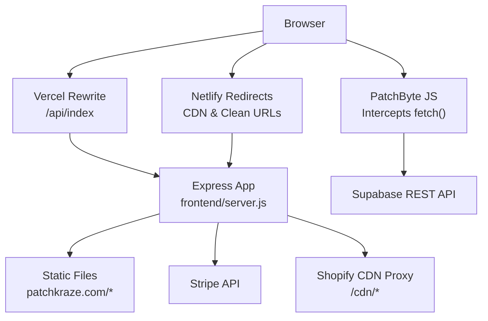
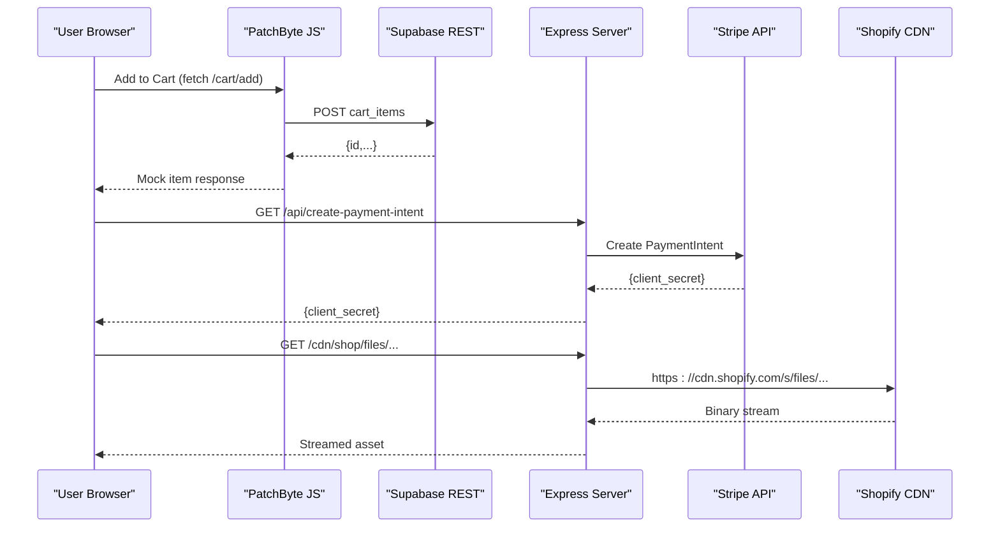
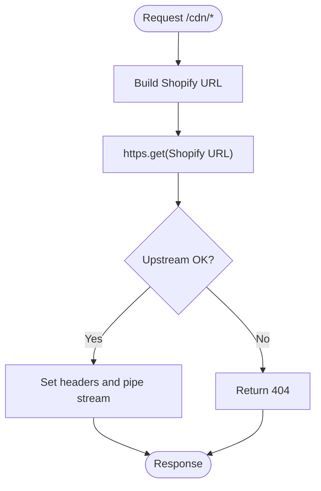
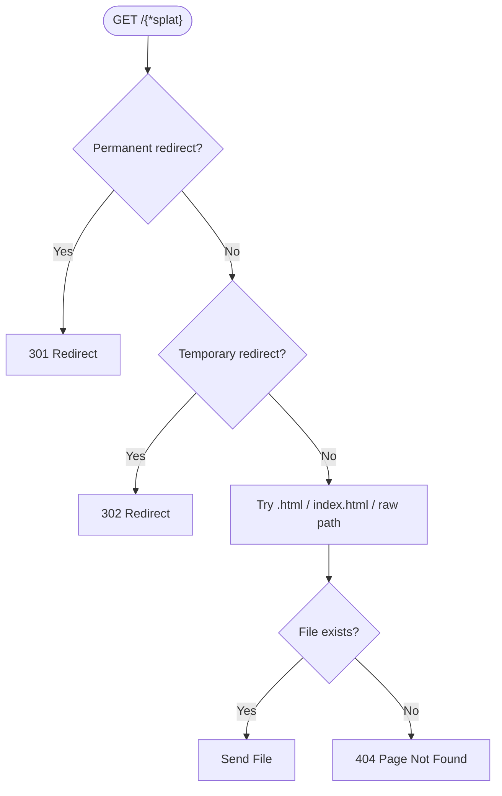
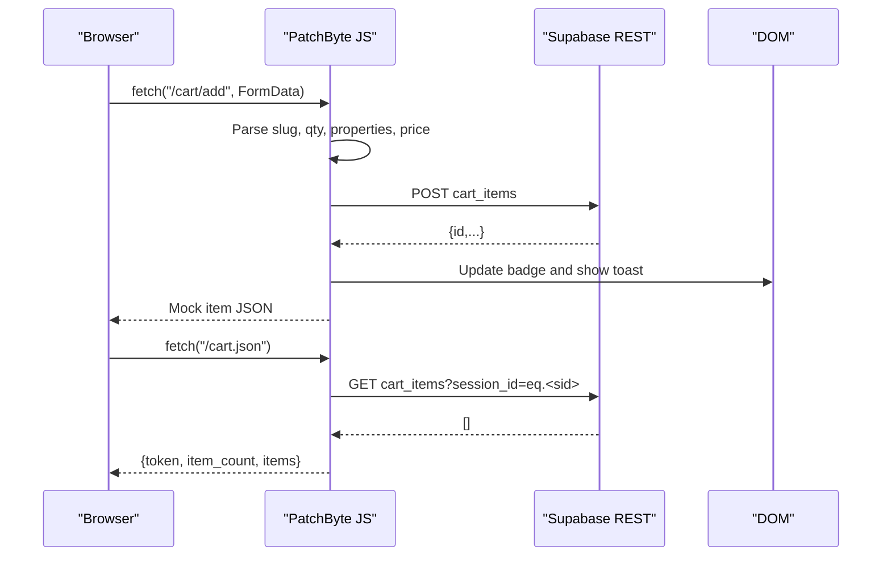
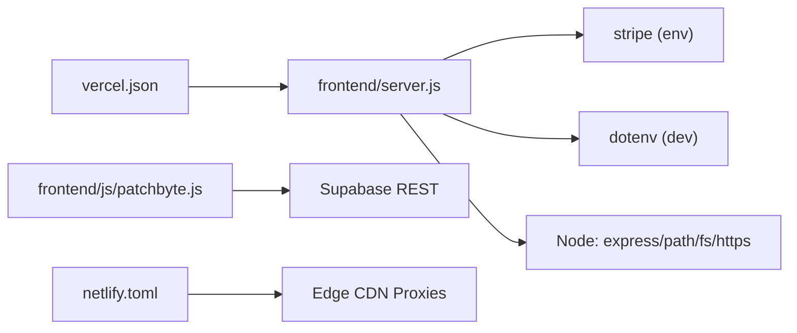

# Internal Service APIs

<cite>
**Referenced Files in This Document**
- [api/index.js](file://api/index.js)
- [frontend/server.js](file://frontend/server.js)
- [frontend/js/patchbyte.js](file://frontend/js/patchbyte.js)
- [vercel.json](file://vercel.json)
- [netlify.toml](file://netlify.toml)
- [frontend/package.json](file://frontend/package.json)
- [frontend/patchkraze.com/cart/index.html](file://frontend/patchkraze.com/cart/index.html)
- [frontend/patchkraze.com/checkout/index.html](file://frontend/patchkraze.com/checkout/index.html)
</cite>

## Table of Contents
1. Introduction
2. Project Structure
3. Core Components
4. Architecture Overview
5. Detailed Component Analysis
6. Dependency Analysis
7. Performance Considerations
8. Troubleshooting Guide
9. Conclusion

## Introduction
This document describes the internal service APIs that connect frontend components to backend services and external systems. It covers:
- CDN proxy endpoints for serving Shopify assets
- Redirect handling for SEO-friendly URLs
- Static file serving mechanisms
- PatchByte integration layer that intercepts fetch calls and routes them to Supabase
- Middleware functions, request/response transformations, and caching strategies
- Examples of how frontend JavaScript modules interact with these APIs
- Error handling patterns for service failures

## Project Structure
The runtime is an Express application that serves static HTML pages and provides server-side routing for API endpoints, CDN proxying, and clean URL resolution. Deployment platforms (Vercel, Netlify) rewrite or redirect requests to this service.

**Diagram sources**
- [vercel.json:1-12](file://vercel.json#L1-L12)
- [netlify.toml:119-165](file://netlify.toml#L119-L165)
- [frontend/server.js:46-65](file://frontend/server.js#L46-L65)
- [frontend/js/patchbyte.js:138-163](file://frontend/js/patchbyte.js#L138-L163)

**Section sources**
- [vercel.json:1-12](file://vercel.json#L1-L12)
- [netlify.toml:119-165](file://netlify.toml#L119-L165)
- [frontend/server.js:46-65](file://frontend/server.js#L46-L65)

## Core Components
- Express server entry point and middleware
  - JSON body parser
  - Static asset serving from site root and theme assets
  - Stripe payment intent endpoint and publishable key endpoint
  - CDN proxy for Shopify assets
  - Clean URL handler with permanent and temporary redirects
- PatchByte client library
  - Fetch interceptor for Shopify cart endpoints
  - Supabase REST helpers for cart, orders, and contact submissions
  - Session management via localStorage
  - UI updates for cart badge and toast notifications
- Deployment configuration
  - Vercel function rewrites to route all requests through the Express app
  - Netlify redirects for CDN proxies and clean URLs

**Section sources**
- [frontend/server.js:11-15](file://frontend/server.js#L11-L15)
- [frontend/server.js:17-44](file://frontend/server.js#L17-L44)
- [frontend/server.js:46-65](file://frontend/server.js#L46-L65)
- [frontend/server.js:67-111](file://frontend/server.js#L67-L111)
- [frontend/js/patchbyte.js:19-65](file://frontend/js/patchbyte.js#L19-L65)
- [frontend/js/patchbyte.js:138-163](file://frontend/js/patchbyte.js#L138-L163)
- [vercel.json:1-12](file://vercel.json#L1-L12)
- [netlify.toml:119-165](file://netlify.toml#L119-L165)

## Architecture Overview
The system combines server-side routing and client-side interception:
- The Express server handles API calls (Stripe), proxies CDN assets, and resolves clean URLs to static files.
- The PatchByte script runs in the browser, intercepts Shopify-style fetch calls, and persists cart state in Supabase.
- Deployment configurations ensure requests are routed correctly across environments.

**Diagram sources**
- [frontend/js/patchbyte.js:140-163](file://frontend/js/patchbyte.js#L140-L163)
- [frontend/js/patchbyte.js:74-96](file://frontend/js/patchbyte.js#L74-L96)
- [frontend/server.js:17-39](file://frontend/server.js#L17-L39)
- [frontend/server.js:50-65](file://frontend/server.js#L50-L65)

## Detailed Component Analysis

### CDN Proxy Endpoints
- Purpose: Serve Shopify assets under a local /cdn prefix without changing frontend references.
- Behavior:
  - Requests matching /cdn/* are proxied to Shopify CDN.
  - Special handling for /shop/files paths to map to the correct Shopify files URL.
  - Sets Content-Type from upstream and caches responses for one day.
  - Returns 404 if upstream fetch fails.

**Diagram sources**
- [frontend/server.js:50-65](file://frontend/server.js#L50-L65)

**Section sources**
- [frontend/server.js:50-65](file://frontend/server.js#L50-L65)

### Redirect Handling for SEO-Friendly URLs
- Permanent redirects (301): Moved or renamed product pages and collections.
- Temporary redirects (302): Placeholder pages pointing to content hubs or policies.
- Clean URL resolution: Maps /products/foo to /products/foo.html or index fallbacks.

**Diagram sources**
- [frontend/server.js:67-111](file://frontend/server.js#L67-L111)

**Section sources**
- [frontend/server.js:67-111](file://frontend/server.js#L67-L111)

### Static File Serving Mechanisms
- Serves static files from the site root directory first, then from the project root for theme assets like /cdn.
- Ensures clean URLs resolve to actual files on disk.

**Section sources**
- [frontend/server.js:46-48](file://frontend/server.js#L46-L48)
- [frontend/server.js:100-110](file://frontend/server.js#L100-L110)

### PatchByte Integration Layer
- Intercepts fetch calls to Shopify cart endpoints:
  - /cart/add: Parses form data, extracts product info and price, persists to Supabase, returns a mock item to keep Shopify UI happy.
  - /cart/change, /cart/update: Returns empty cart JSON to bypass server-side cart logic.
  - /cart.js and /cart.json: Returns current session’s cart items and count from Supabase.
- Supabase REST helpers:
  - sbGet, sbPost, sbPatch, sbDelete with API key and Authorization headers.
  - Uses Prefer: return=representation for mutations to get back updated records.
- Session management:
  - Generates or retrieves a session ID stored in localStorage.
- UI interactions:
  - Updates cart badge elements and shows a toast notification after adding items.
  - Wires contact forms to submit to Supabase and replaces form with success message.

**Diagram sources**
- [frontend/js/patchbyte.js:140-163](file://frontend/js/patchbyte.js#L140-L163)
- [frontend/js/patchbyte.js:74-96](file://frontend/js/patchbyte.js#L74-L96)
- [frontend/js/patchbyte.js:165-233](file://frontend/js/patchbyte.js#L165-L233)

**Section sources**
- [frontend/js/patchbyte.js:19-65](file://frontend/js/patchbyte.js#L19-L65)
- [frontend/js/patchbyte.js:138-163](file://frontend/js/patchbyte.js#L138-L163)
- [frontend/js/patchbyte.js:165-233](file://frontend/js/patchbyte.js#L165-L233)
- [frontend/js/patchbyte.js:237-263](file://frontend/js/patchbyte.js#L237-L263)

### Frontend Interaction Examples
- Cart page:
  - Loads cart items via window.PatchByte.getCart()
  - Updates quantities via window.PatchByte.updateCartItem()
- Checkout page:
  - Calls /api/create-payment-intent to obtain a Stripe client secret
  - Uses window.PatchByte.getSession() to attach session metadata
  - After successful payment, posts order and order items to Supabase via window.PatchByte.sbPost(), then clears the cart

**Section sources**
- [frontend/patchkraze.com/cart/index.html:139-161](file://frontend/patchkraze.com/cart/index.html#L139-L161)
- [frontend/patchkraze.com/checkout/index.html:200-211](file://frontend/patchkraze.com/checkout/index.html#L200-L211)
- [frontend/patchkraze.com/checkout/index.html:220-257](file://frontend/patchkraze.com/checkout/index.html#L220-L257)
- [frontend/patchkraze.com/checkout/index.html:309-337](file://frontend/patchkraze.com/checkout/index.html#L309-L337)

### Middleware Functions and Request/Response Transformations
- JSON parsing middleware for API endpoints
- Static file serving middleware for HTML and theme assets
- CDN proxy middleware transforms /cdn/* into Shopify CDN URLs and streams responses with appropriate headers and cache control
- Clean URL handler transforms user-friendly paths into file paths and serves corresponding HTML files

**Section sources**
- [frontend/server.js:15-15](file://frontend/server.js#L15-L15)
- [frontend/server.js:46-48](file://frontend/server.js#L46-L48)
- [frontend/server.js:50-65](file://frontend/server.js#L50-L65)
- [frontend/server.js:92-111](file://frontend/server.js#L92-L111)

### Caching Strategies
- CDN proxy sets Cache-Control: public, max-age=86400 for proxied assets
- Netlify CDN proxies also serve Shopify assets with force redirections for performance
- Static files served by Express benefit from platform-level caching when deployed on Vercel/Netlify

**Section sources**
- [frontend/server.js:60-63](file://frontend/server.js#L60-L63)
- [netlify.toml:135-165](file://netlify.toml#L135-L165)

## Dependency Analysis
- Express server depends on:
  - stripe (optional, based on environment variable)
  - dotenv (local development only)
  - Node built-ins: express, path, fs, https
- PatchByte JS depends on:
  - Native fetch and localStorage
  - Supabase REST API (public anon key configured in script)
- Deployment dependencies:
  - Vercel rewrites all routes to api/index which exports the Express app
  - Netlify redirects handle CDN proxies and clean URLs at the edge

**Diagram sources**
- [frontend/package.json:13-17](file://frontend/package.json#L13-L17)
- [frontend/server.js:1-11](file://frontend/server.js#L1-L11)
- [frontend/js/patchbyte.js:10-17](file://frontend/js/patchbyte.js#L10-L17)
- [vercel.json:1-12](file://vercel.json#L1-L12)
- [netlify.toml:119-165](file://netlify.toml#L119-L165)

**Section sources**
- [frontend/package.json:13-17](file://frontend/package.json#L13-L17)
- [frontend/server.js:1-11](file://frontend/server.js#L1-L11)
- [frontend/js/patchbyte.js:10-17](file://frontend/js/patchbyte.js#L10-L17)
- [vercel.json:1-12](file://vercel.json#L1-L12)
- [netlify.toml:119-165](file://netlify.toml#L119-L165)

## Performance Considerations
- Use platform-level CDN proxies (Netlify) for high-volume static assets to reduce origin load
- Keep server-side CDN proxy minimal; prefer edge redirects/proxies where possible
- Cache proxied assets with appropriate headers to improve repeat loads
- Avoid heavy synchronous operations in request handlers; streaming is used for CDN proxy
- Minimize client-side network calls by batching where feasible (e.g., order creation)

[No sources needed since this section provides general guidance]

## Troubleshooting Guide
- Stripe not configured:
  - Symptom: /api/create-payment-intent returns 500 with error indicating Stripe is not configured
  - Cause: Missing STRIPE_SECRET_KEY environment variable
  - Resolution: Configure environment variables on deployment platform
- CDN asset not found:
  - Symptom: 404 for /cdn/* paths
  - Cause: Upstream Shopify fetch failed or invalid path
  - Resolution: Verify path mapping and upstream availability
- PatchByte fetch interception issues:
  - Symptom: Cart add does not persist or UI does not update
  - Cause: Network errors or malformed payload
  - Resolution: Check console logs for “[PatchByte] Cart add error” and verify Supabase table access rules
- Contact form submission failure:
  - Symptom: Form submission fails and resets button state
  - Cause: Network or Supabase error
  - Resolution: Inspect console for “[PatchByte] Contact error” and validate form fields

**Section sources**
- [frontend/server.js:17-39](file://frontend/server.js#L17-L39)
- [frontend/server.js:60-65](file://frontend/server.js#L60-L65)
- [frontend/js/patchbyte.js:227-233](file://frontend/js/patchbyte.js#L227-L233)
- [frontend/js/patchbyte.js:251-261](file://frontend/js/patchbyte.js#L251-L261)

## Conclusion
The internal service APIs provide a cohesive bridge between the frontend and backend services:
- Express handles payments, CDN proxying, and clean URL resolution
- PatchByte integrates cart and checkout flows with Supabase while maintaining compatibility with Shopify’s frontend expectations
- Deployment configurations ensure efficient delivery and routing across platforms
Adhering to the documented patterns ensures reliable operation, maintainability, and scalability.

[No sources needed since this section summarizes without analyzing specific files]