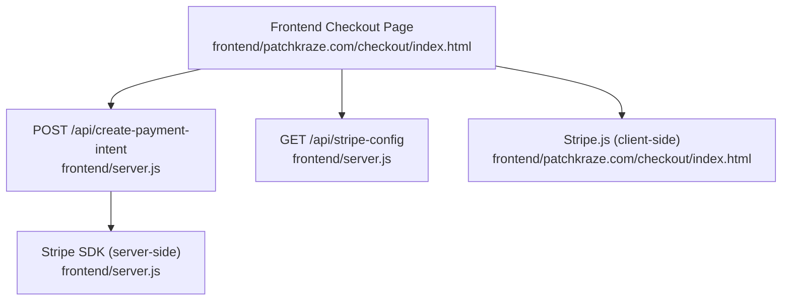
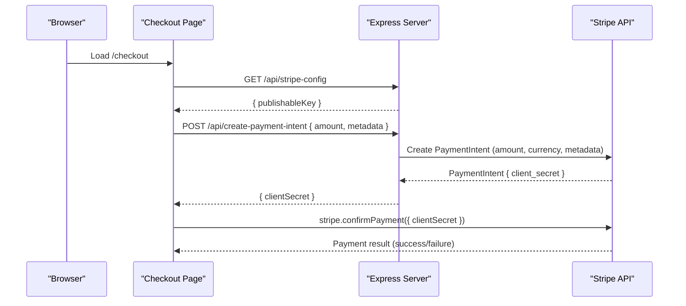
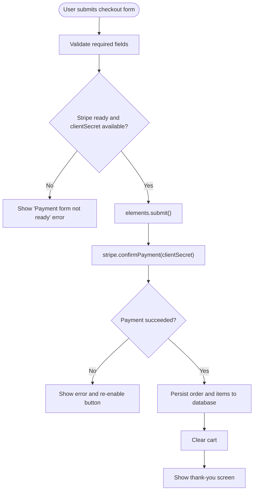
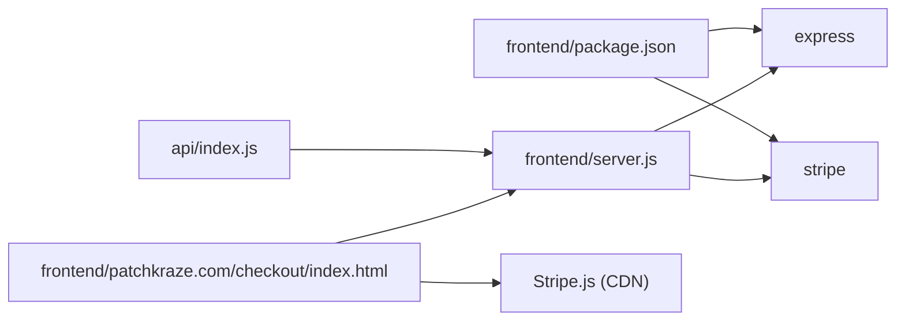

# Payment APIs

<cite>
**Referenced Files in This Document**
- [frontend/server.js](file://frontend/server.js)
- [api/index.js](file://api/index.js)
- [frontend/patchkraze.com/checkout/index.html](file://frontend/patchkraze.com/checkout/index.html)
- [frontend/js/patchbyte.js](file://frontend/js/patchbyte.js)
- [frontend/package.json](file://frontend/package.json)
</cite>

## Table of Contents
1. [Introduction](#introduction)
2. [Project Structure](#project-structure)
3. [Core Components](#core-components)
4. [Architecture Overview](#architecture-overview)
5. [Detailed Component Analysis](#detailed-component-analysis)
6. [Dependency Analysis](#dependency-analysis)
7. [Performance Considerations](#performance-considerations)
8. [Troubleshooting Guide](#troubleshooting-guide)
9. [Conclusion](#conclusion)

## Introduction
This document provides detailed API documentation for payment processing endpoints used by the checkout flow. It covers:
- POST /api/create-payment-intent: creating a Stripe PaymentIntent and returning a client secret to the frontend
- GET /api/stripe-config: retrieving the Stripe publishable key for initializing Stripe.js on the client
It also documents authentication requirements, security considerations, error handling, rate limiting guidance, and integration patterns with Stripe.js on the frontend.

## Project Structure
The payment-related server logic is implemented in an Express application that exposes two API routes and serves static assets. The checkout page integrates with these endpoints and uses Stripe.js to collect payment details and confirm payments.

**Diagram sources**
- [frontend/server.js:17-44](file://frontend/server.js#L17-L44)
- [frontend/patchkraze.com/checkout/index.html:191-212](file://frontend/patchkraze.com/checkout/index.html#L191-L212)

**Section sources**
- [frontend/server.js:1-48](file://frontend/server.js#L1-L48)
- [frontend/patchkraze.com/checkout/index.html:161-258](file://frontend/patchkraze.com/checkout/index.html#L161-L258)

## Core Components
- Server entry point and API routes are defined in the Express app.
- The create-payment-intent endpoint validates input, creates a Stripe PaymentIntent, and returns a client secret.
- The stripe-config endpoint returns the publishable key from environment variables.
- The checkout page initializes Stripe.js, fetches configuration, creates a PaymentIntent, mounts the Payment Element, and confirms payment.

Key responsibilities:
- Input validation and amount normalization on the server
- Secure creation of PaymentIntent using server-side secret key
- Client-side initialization and confirmation using Stripe.js
- Error propagation back to the UI

**Section sources**
- [frontend/server.js:17-44](file://frontend/server.js#L17-L44)
- [frontend/patchkraze.com/checkout/index.html:191-212](file://frontend/patchkraze.com/checkout/index.html#L191-L212)

## Architecture Overview
The payment flow follows a secure separation of concerns:
- The frontend never handles or stores the Stripe secret key.
- The backend uses the Stripe secret key to create PaymentIntents.
- The frontend receives only a short-lived client secret to confirm payments via Stripe.js.

**Diagram sources**
- [frontend/server.js:17-44](file://frontend/server.js#L17-L44)
- [frontend/patchkraze.com/checkout/index.html:191-212](file://frontend/patchkraze.com/checkout/index.html#L191-L212)
- [frontend/patchkraze.com/checkout/index.html:286-307](file://frontend/patchkraze.com/checkout/index.html#L286-L307)

## Detailed Component Analysis

### Endpoint: POST /api/create-payment-intent
Purpose:
- Create a Stripe PaymentIntent for the specified amount and return a client secret to the frontend.

Request:
- Method: POST
- Path: /api/create-payment-intent
- Content-Type: application/json
- Body schema:
  - amount: number (required). Amount in cents (e.g., 1234 for $12.34). Must be a positive integer.
  - metadata: object (optional). Arbitrary key-value pairs attached to the PaymentIntent. In this implementation, the frontend includes a session_id.

Response:
- Success (200):
  - clientSecret: string. A one-time secret used by the frontend to confirm the payment via Stripe.js.
- Errors:
  - 400 Bad Request: Invalid amount or Stripe API error. Response body contains an error message.
  - 500 Internal Server Error: Stripe not configured on the server.

Validation and behavior:
- The server converts the amount to cents using rounding and rejects non-positive values.
- Currency is fixed to USD.
- Automatic payment methods are enabled on the PaymentIntent.
- Metadata is forwarded to Stripe if provided.

Security notes:
- The endpoint requires the Stripe secret key to be set in the server environment. If missing, it returns a 500 error indicating misconfiguration.
- Never expose the secret key to the client.

Example request:
- POST /api/create-payment-intent
- Body: { "amount": 1234, "metadata": { "session_id": "abc123" } }

Example success response:
- Status: 200
- Body: { "clientSecret": "pi_xxx_secret_yyy" }

Example error responses:
- 400: { "error": "Invalid amount." }
- 400: { "error": "<Stripe API error message>" }
- 500: { "error": "Stripe is not configured on the server." }

Integration notes:
- The frontend calls this endpoint after computing the total cart amount in cents and attaches metadata such as session_id.

**Section sources**
- [frontend/server.js:17-39](file://frontend/server.js#L17-L39)
- [frontend/patchkraze.com/checkout/index.html:200-212](file://frontend/patchkraze.com/checkout/index.html#L200-L212)

### Endpoint: GET /api/stripe-config
Purpose:
- Provide the Stripe publishable key to the frontend so it can initialize Stripe.js safely without hardcoding keys.

Request:
- Method: GET
- Path: /api/stripe-config

Response:
- 200 OK:
  - publishableKey: string. The Stripe publishable key from environment variables.

Behavior:
- Returns an empty string if the publishable key is not configured.

Security notes:
- Only the publishable key is exposed; the secret key remains server-side.

Example response:
- Status: 200
- Body: { "publishableKey": "pk_test_..." }

**Section sources**
- [frontend/server.js:41-44](file://frontend/server.js#L41-L44)

### Frontend Integration with Stripe.js
Initialization:
- The checkout page loads Stripe.js from the CDN.
- It fetches the publishable key from /api/stripe-config and initializes Stripe with that key.
- It requests a PaymentIntent via /api/create-payment-intent with the total amount in cents and optional metadata.

Payment confirmation:
- The frontend mounts the Stripe Payment Element and calls stripe.confirmPayment with the client secret obtained from the server.
- It sets billing details and a return URL, and uses redirect mode when required.

Error handling:
- The frontend displays user-friendly errors if Stripe.js is not ready, if the configuration fails, or if payment confirmation fails.
- On success, it persists order data to the backend’s Supabase layer and clears the cart.

**Section sources**
- [frontend/patchkraze.com/checkout/index.html:191-258](file://frontend/patchkraze.com/checkout/index.html#L191-L258)
- [frontend/patchkraze.com/checkout/index.html:286-350](file://frontend/patchkraze.com/checkout/index.html#L286-L350)

### Data Flow and State Transitions

**Diagram sources**
- [frontend/patchkraze.com/checkout/index.html:260-350](file://frontend/patchkraze.com/checkout/index.html#L260-L350)

## Dependency Analysis
- The server depends on Express and the Stripe SDK.
- The API module re-exports the Express app for deployment platforms.
- The checkout page depends on Stripe.js and the server’s API endpoints.

**Diagram sources**
- [frontend/package.json:13-16](file://frontend/package.json#L13-L16)
- [frontend/server.js:1-15](file://frontend/server.js#L1-L15)
- [api/index.js:1](file://api/index.js#L1)
- [frontend/patchkraze.com/checkout/index.html:9-10](file://frontend/patchkraze.com/checkout/index.html#L9-L10)

**Section sources**
- [frontend/package.json:13-16](file://frontend/package.json#L13-L16)
- [frontend/server.js:1-15](file://frontend/server.js#L1-L15)
- [api/index.js:1](file://api/index.js#L1)

## Performance Considerations
- Keep PaymentIntent creation lightweight; avoid unnecessary retries.
- Cache the publishable key retrieval if appropriate (the endpoint is fast and stateless).
- Ensure network timeouts are handled gracefully on the frontend.
- Use server-side logging to monitor Stripe API latency and errors.

[No sources needed since this section provides general guidance]

## Troubleshooting Guide
Common issues and resolutions:
- “Stripe is not configured on the server.”
  - Cause: Missing STRIPE_SECRET_KEY environment variable.
  - Resolution: Set STRIPE_SECRET_KEY in your deployment environment.
- “Invalid amount.”
  - Cause: Non-positive or non-numeric amount sent to the server.
  - Resolution: Send a positive integer representing cents.
- “Could not initialize payment” or similar client errors.
  - Cause: Missing publishable key or Stripe.js not loaded.
  - Resolution: Ensure /api/stripe-config returns a valid key and Stripe.js script is loaded before use.
- Payment confirmation failures.
  - Cause: Insufficient funds, card declined, or 3D Secure required.
  - Resolution: Display Stripe-provided error messages and guide users to retry or use another payment method.

Operational tips:
- Log server-side errors from the create-payment-intent handler to diagnose Stripe API issues.
- Verify CORS and network policies if running behind proxies or CDNs.
- Test with Stripe test cards and sandbox mode before going live.

**Section sources**
- [frontend/server.js:17-39](file://frontend/server.js#L17-L39)
- [frontend/patchkraze.com/checkout/index.html:200-212](file://frontend/patchkraze.com/checkout/index.html#L200-L212)
- [frontend/patchkraze.com/checkout/index.html:286-350](file://frontend/patchkraze.com/checkout/index.html#L286-L350)

## Conclusion
The payment system separates sensitive operations to the server while keeping the frontend focused on user experience and Stripe.js interactions. The POST /api/create-payment-intent endpoint securely creates PaymentIntents and returns client secrets, and GET /api/stripe-config provides the publishable key for client initialization. Proper error handling, environment configuration, and adherence to Stripe best practices ensure a robust and secure checkout experience.

[No sources needed since this section summarizes without analyzing specific files]