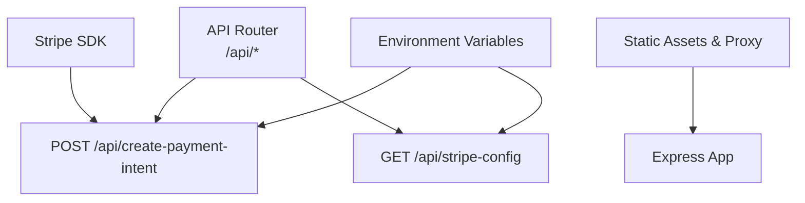
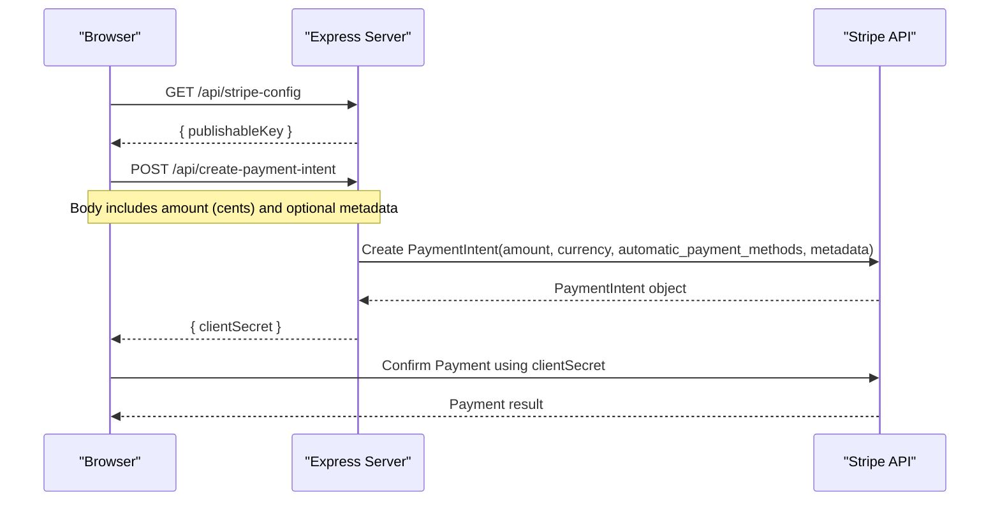
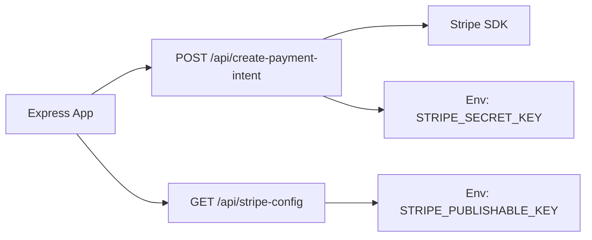

# API Endpoints

<cite>
**Referenced Files in This Document**
- [server.js](file://frontend/server.js)
- [index.js](file://api/index.js)
- [package.json](file://package.json)
</cite>

## Table of Contents
1. [Introduction](#introduction)
2. [Project Structure](#project-structure)
3. [Core Components](#core-components)
4. [Architecture Overview](#architecture-overview)
5. [Detailed Component Analysis](#detailed-component-analysis)
6. [Dependency Analysis](#dependency-analysis)
7. [Performance Considerations](#performance-considerations)
8. [Troubleshooting Guide](#troubleshooting-guide)
9. [Conclusion](#conclusion)

## Introduction
This document provides comprehensive API documentation for the backend endpoints that power payment flows and Stripe configuration retrieval. It focuses on:
- POST /api/create-payment-intent: Creates a Stripe PaymentIntent and returns a client secret to the frontend.
- GET /api/stripe-config: Returns the Stripe publishable key to the frontend.

It also covers authentication requirements, rate limiting considerations, error response codes, request/response examples, integration guidelines, CORS configuration, and security headers.

## Project Structure
The backend is an Express application that serves static content and exposes two API routes. The entry point for serverless platforms re-exports the Express app.

**Diagram sources**
- [server.js:17-44](file://frontend/server.js#L17-L44)
- [index.js:1](file://api/index.js#L1)

**Section sources**
- [server.js:1-48](file://frontend/server.js#L1-L48)
- [index.js:1](file://api/index.js#L1)

## Core Components
- Express server with JSON body parsing enabled.
- Stripe SDK initialized from environment variables.
- Two API endpoints:
  - POST /api/create-payment-intent
  - GET /api/stripe-config

Key behaviors:
- Amount validation and conversion to cents.
- Creation of a Stripe PaymentIntent with automatic payment methods enabled.
- Returning only the client secret to the client.
- Exposing the Stripe publishable key via a dedicated endpoint.

**Section sources**
- [server.js:15-44](file://frontend/server.js#L15-L44)

## Architecture Overview
The checkout flow integrates with Stripe Elements on the client side. The server creates a PaymentIntent and returns a client secret used by the client to confirm payment.

**Diagram sources**
- [server.js:17-44](file://frontend/server.js#L17-L44)

## Detailed Component Analysis

### Endpoint: POST /api/create-payment-intent
Purpose:
- Create a Stripe PaymentIntent for a given amount and return a client secret to the frontend for confirmation.

Request:
- Method: POST
- Path: /api/create-payment-intend
- Content-Type: application/json
- Body schema:
  - amount: number (required). Must be a positive integer representing total amount in cents.
  - metadata: object (optional). Arbitrary key-value pairs attached to the PaymentIntent.

Validation rules:
- amount must be present and convertible to a number.
- amount must be greater than zero after rounding to cents.
- If Stripe is not configured on the server, the endpoint returns a 500 error.

Response:
- Success (200):
  - Body: { clientSecret: string }
- Error responses:
  - 400 Bad Request: Invalid or missing amount; or Stripe API error message returned.
  - 500 Internal Server Error: Stripe not configured.

Example requests and responses:
- Request example:
  - POST /api/create-payment-intent
  - Headers: Content-Type: application/json
  - Body:
    - { "amount": 1999, "metadata": { "order_id": "12345" } }
- Success response example:
  - Status: 200
  - Body:
    - { "clientSecret": "pi_abc123secret..." }
- Error response examples:
  - Status: 400
  - Body:
    - { "error": "Invalid amount." }
  - Status: 400
  - Body:
    - { "error": "<Stripe error message>" }
  - Status: 500
  - Body:
    - { "error": "Stripe is not configured on the server." }

Integration notes:
- Ensure the amount is provided in cents and is a positive integer.
- Use the returned clientSecret with Stripe Elements to confirm the payment on the client.
- Keep metadata minimal and non-sensitive.

Security considerations:
- Never expose your Stripe secret key to the client.
- Validate amounts server-side to prevent tampering.

Rate limiting:
- No built-in rate limiting is implemented in this endpoint. Consider adding rate limiting at the platform level (e.g., Vercel/Netlify) or via middleware if needed.

CORS and security headers:
- No explicit CORS or security headers are set for these endpoints. If cross-origin requests are required, configure CORS at the hosting platform or add middleware.

**Section sources**
- [server.js:17-39](file://frontend/server.js#L17-L39)

### Endpoint: GET /api/stripe-config
Purpose:
- Return the Stripe publishable key to the frontend so it can initialize Stripe.js without hardcoding secrets.

Request:
- Method: GET
- Path: /api/stripe-config

Response:
- Success (200):
  - Body: { publishableKey: string }
- If the publishable key is not set, returns an empty string value.

Example request and response:
- Request example:
  - GET /api/stripe-config
- Success response example:
  - Status: 200
  - Body:
    - { "publishableKey": "pk_test_..." }

Security considerations:
- Only the publishable key is exposed. Do not expose secret keys via any endpoint.

Rate limiting:
- Not implemented. Consider rate limiting if abused.

CORS and security headers:
- No explicit CORS or security headers are set. Configure as needed at the hosting layer.

**Section sources**
- [server.js:41-44](file://frontend/server.js#L41-L44)

## Dependency Analysis
The backend depends on:
- Express for routing and serving static assets.
- Stripe SDK for creating PaymentIntents.
- Environment variables for configuration.

**Diagram sources**
- [server.js:1-15](file://frontend/server.js#L1-L15)
- [server.js:17-44](file://frontend/server.js#L17-L44)

**Section sources**
- [package.json:9-13](file://package.json#L9-L13)
- [server.js:1-15](file://frontend/server.js#L1-L15)

## Performance Considerations
- The create-payment-intent endpoint performs a network call to Stripe; ensure timeouts and retries are handled appropriately on the client.
- Avoid sending large metadata payloads to keep requests small.
- Cache the publishable key on the client after the first successful fetch to reduce repeated calls.

[No sources needed since this section provides general guidance]

## Troubleshooting Guide
Common issues and resolutions:
- 500 error with “Stripe is not configured”:
  - Ensure STRIPE_SECRET_KEY is set in the environment where the server runs.
- 400 error with “Invalid amount”:
  - Verify that amount is a positive integer representing cents.
- 400 error with Stripe error message:
  - Check Stripe dashboard for details; validate card details and billing information on the client.
- CORS errors when calling from another origin:
  - Configure CORS at the hosting platform or add middleware to allow your frontend domain.

Operational tips:
- Log server errors for Stripe API failures to aid debugging.
- Validate inputs on the client before sending to reduce unnecessary server calls.

**Section sources**
- [server.js:17-39](file://frontend/server.js#L17-L39)

## Conclusion
The backend exposes two essential endpoints for payment processing:
- POST /api/create-payment-intent: Creates a PaymentIntent and returns a client secret.
- GET /api/stripe-config: Provides the Stripe publishable key to the frontend.

Ensure proper environment configuration, input validation, and error handling. Add rate limiting and CORS/security headers at the hosting layer if required. Integrate with Stripe Elements on the client using the returned client secret to complete payments securely.