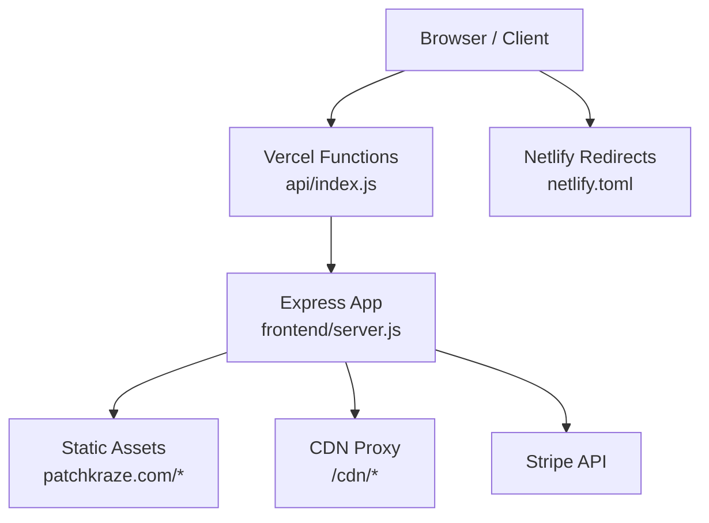
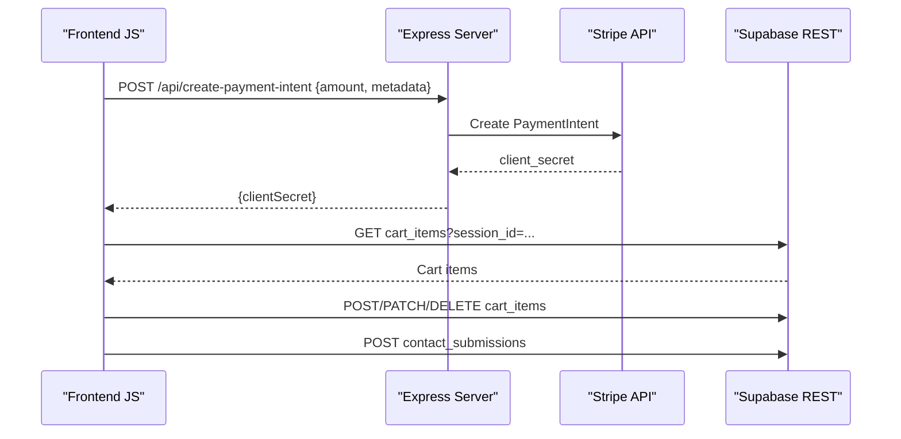

# Backend Services

<cite>
**Referenced Files in This Document**
- [api/index.js](file://api/index.js)
- [frontend/server.js](file://frontend/server.js)
- [package.json](file://package.json)
- [vercel.json](file://vercel.json)
- [netlify.toml](file://netlify.toml)
- [frontend/js/patchbyte.js](file://frontend/js/patchbyte.js)
</cite>

## Table of Contents
1. [Introduction](#introduction)
2. [Project Structure](#project-structure)
3. [Core Components](#core-components)
4. [Architecture Overview](#architecture-overview)
5. [Detailed Component Analysis](#detailed-component-analysis)
6. [Dependency Analysis](#dependency-analysis)
7. [Performance Considerations](#performance-considerations)
8. [Troubleshooting Guide](#troubleshooting-guide)
9. [Conclusion](#conclusion)
10. [Appendices](#appendices)

## Introduction
This document describes the backend services for the Patch-Byte application. It covers the Express.js server configuration, middleware setup, routing structure, API endpoints (payment processing and Stripe integration), static asset serving, CDN proxying, redirects, and serverless deployment patterns. It also explains how frontend cart management and contact form handling integrate with external services via Supabase REST APIs, including environment variable usage, request validation, error handling patterns, and security considerations such as input sanitization and sensitive data protection.

## Project Structure
The backend is a minimal Express.js application that:
- Serves static HTML assets from a site directory
- Proxies Shopify CDN assets when not present locally
- Exposes payment-related API endpoints
- Supports clean URL routing and redirects
- Is packaged for serverless deployment on Vercel and Netlify

**Diagram sources**
- [vercel.json:1-12](file://vercel.json#L1-L12)
- [api/index.js:1-1](file://api/index.js#L1-L1)
- [frontend/server.js:1-123](file://frontend/server.js#L1-L123)
- [netlify.toml:1-165](file://netlify.toml#L1-L165)

**Section sources**
- [vercel.json:1-12](file://vercel.json#L1-L12)
- [api/index.js:1-1](file://api/index.js#L1-L1)
- [frontend/server.js:1-123](file://frontend/server.js#L1-L123)
- [netlify.toml:1-165](file://netlify.toml#L1-L165)

## Core Components
- Express server initialization and JSON parsing middleware
- Payment endpoints for Stripe integration
- Static file serving and CDN proxy
- Clean URL handler and redirect maps
- Serverless export for Vercel functions
- Frontend cart and contact integrations via Supabase REST

Key responsibilities:
- Provide a secure, minimal server surface area
- Validate inputs for payment intents
- Serve static content efficiently
- Proxy third-party assets to avoid CORS issues
- Support both local development and serverless environments

**Section sources**
- [frontend/server.js:11-15](file://frontend/server.js#L11-L15)
- [frontend/server.js:17-44](file://frontend/server.js#L17-L44)
- [frontend/server.js:46-65](file://frontend/server.js#L46-L65)
- [frontend/server.js:67-111](file://frontend/server.js#L67-L111)
- [frontend/server.js:113-123](file://frontend/server.js#L113-L123)

## Architecture Overview
The system integrates three main layers:
- Frontend: Browser-based UI with JavaScript that intercepts Shopify-style fetch calls and routes them to Supabase REST APIs for cart and contact submissions.
- Backend: Express server that serves static pages, proxies CDN assets, and exposes payment endpoints.
- External services: Stripe for payments and Supabase for persistent cart/contact data.

**Diagram sources**
- [frontend/server.js:17-44](file://frontend/server.js#L17-L44)
- [frontend/js/patchbyte.js:67-111](file://frontend/js/patchbyte.js#L67-L111)
- [frontend/js/patchbyte.js:237-263](file://frontend/js/patchbyte.js#L237-L263)

## Detailed Component Analysis

### Express Server Configuration and Middleware
- Initializes an Express app and loads environment variables for local development
- Parses JSON bodies for API requests
- Uses conditional Stripe SDK initialization based on environment variables
- Serves static files from the site root and the frontend directory
- Proxies missing CDN assets back to Shopify CDN with caching headers
- Implements clean URL routing and redirect maps for SEO and migration support
- Exports the app for serverless platforms and listens locally when run directly

Security notes:
- No explicit CORS middleware is configured; consider adding strict origin allowlist if cross-origin access is required
- Input validation is performed for payment amounts; additional sanitization can be added for future endpoints
- Environment variables are used to keep secrets out of source code

**Section sources**
- [frontend/server.js:1-15](file://frontend/server.js#L1-L15)
- [frontend/server.js:17-44](file://frontend/server.js#L17-L44)
- [frontend/server.js:46-65](file://frontend/server.js#L46-L65)
- [frontend/server.js:67-111](file://frontend/server.js#L67-L111)
- [frontend/server.js:113-123](file://frontend/server.js#L113-L123)

### Payment Processing Endpoints
- POST /api/create-payment-intent
  - Validates amount and metadata from request body
  - Creates a Stripe PaymentIntent with USD currency and automatic payment methods enabled
  - Returns a client secret to the frontend for checkout
  - Handles errors by logging and returning a 400 response with error details
- GET /api/stripe-config
  - Returns the publishable key to the frontend so it can initialize the payment UI without exposing secrets

Request validation:
- Ensures amount is a positive number in cents
- Guards against missing or invalid inputs

Error handling:
- Logs server-side errors
- Returns structured error responses to clients

**Section sources**
- [frontend/server.js:17-44](file://frontend/server.js#L17-L44)

### Static Asset Serving and CDN Proxy
- Serves static HTML/CSS/JS from patchkraze.com and frontend directories
- Proxies /cdn/* paths to Shopify CDN when not found locally
- Sets appropriate Content-Type and Cache-Control headers for performance

Performance considerations:
- Caching headers improve load times for CDN assets
- Local fallback reduces latency for frequently accessed assets

**Section sources**
- [frontend/server.js:46-65](file://frontend/server.js#L46-L65)

### Routing and Redirects
- Permanent redirects (301) for renamed product pages and policies
- Temporary redirects (302) for content pages not yet built
- Clean URL handler resolves .html files and index.html variants
- Returns a friendly 404 page for missing resources

SEO and maintenance:
- Centralized redirect maps simplify migrations
- Clean URLs improve user experience and search indexing

**Section sources**
- [frontend/server.js:67-111](file://frontend/server.js#L67-L111)

### Serverless Function Wrapper
- api/index.js re-exports the Express app for Vercel functions
- vercel.json configures function inclusion and rewrites all routes to the function
- netlify.toml provides build settings and extensive redirects/proxy rules for static hosting

Deployment notes:
- Ensure environment variables are set in platform dashboards (e.g., STRIPE_SECRET_KEY, STRIPE_PUBLISHABLE_KEY)
- Include necessary static assets in function bundles per vercel.json

**Section sources**
- [api/index.js:1-1](file://api/index.js#L1-L1)
- [vercel.json:1-12](file://vercel.json#L1-L12)
- [netlify.toml:1-165](file://netlify.toml#L1-L165)

### Frontend Cart Management and Contact Form Handling
- Maintains a session ID in localStorage to associate cart items with users
- Intercepts Shopify-style fetch calls to /cart/add, /cart/change, /cart/update, and cart manifests
- Persists cart state to Supabase REST API using session-scoped queries
- Updates cart badge counts dynamically
- Submits contact form data to Supabase and shows success feedback

Data flow:
- Fetch interception captures add-to-cart actions and transforms them into Supabase operations
- Session isolation ensures carts are per-user
- Error handling returns user-friendly messages and logs

Security considerations:
- Supabase anonymous key is embedded in frontend code; ensure Row Level Security (RLS) policies restrict access appropriately
- Avoid storing sensitive data in localStorage beyond session identifiers

**Section sources**
- [frontend/js/patchbyte.js:1-17](file://frontend/js/patchbyte.js#L1-L17)
- [frontend/js/patchbyte.js:19-65](file://frontend/js/patchbyte.js#L19-L65)
- [frontend/js/patchbyte.js:67-111](file://frontend/js/patchbyte.js#L67-L111)
- [frontend/js/patchbyte.js:138-163](file://frontend/js/patchbyte.js#L138-L163)
- [frontend/js/patchbyte.js:165-233](file://frontend/js/patchbyte.js#L165-L233)
- [frontend/js/patchbyte.js:237-263](file://frontend/js/patchbyte.js#L237-L263)

## Dependency Analysis
External dependencies:
- express: Web framework for routing and middleware
- stripe: Official SDK for payment processing
- dotenv: Loads environment variables during local development

Platform configurations:
- vercel.json: Configures serverless function entry point and includes static assets
- netlify.toml: Defines build command, publish directory, redirects, and CDN proxies

Runtime requirements:
- Node.js engine version >= 18

**Section sources**
- [package.json:1-14](file://package.json#L1-L14)
- [vercel.json:1-12](file://vercel.json#L1-L12)
- [netlify.toml:1-165](file://netlify.toml#L1-L165)

## Performance Considerations
- Use CDN proxy with cache headers to reduce bandwidth and improve load times
- Keep server logic minimal; offload heavy operations to external services (Stripe, Supabase)
- Leverage static asset serving for fast delivery of HTML/CSS/JS
- Consider adding compression middleware for production deployments
- Monitor Stripe API latency and implement retries/backoff where appropriate

[No sources needed since this section provides general guidance]

## Troubleshooting Guide
Common issues and resolutions:
- Stripe not configured: If STRIPE_SECRET_KEY is missing, payment intent creation will return a 500 error indicating Stripe is not configured. Ensure environment variables are set in your deployment platform.
- Invalid amount: Requests with non-positive or non-numeric amounts will return a 400 error. Validate client-side before sending.
- CDN assets not loading: Verify /cdn/* proxy rules and ensure Shopify CDN URLs are correctly constructed. Check network tab for 404 responses.
- Cart not updating: Confirm Supabase REST endpoint is reachable and RLS policies allow anonymous writes/reads. Inspect browser console for errors.
- Contact form submission fails: Check network requests to Supabase and verify table permissions. The frontend shows an alert on failure.

Operational tips:
- Log server-side errors for Stripe calls to diagnose issues
- Use browser developer tools to inspect fetch interception and Supabase requests
- Validate environment variables across local and deployed environments

**Section sources**
- [frontend/server.js:17-44](file://frontend/server.js#L17-L44)
- [frontend/js/patchbyte.js:237-263](file://frontend/js/patchbyte.js#L237-L263)

## Conclusion
The Patch-Byte backend provides a lightweight Express server focused on static asset serving, CDN proxying, and payment processing via Stripe. It integrates seamlessly with Supabase for cart persistence and contact form submissions through frontend interception. The project supports serverless deployment on Vercel and Netlify with clear configuration files. For enhanced security, consider adding CORS middleware, stricter input validation, and robust Row Level Security policies for Supabase.

[No sources needed since this section summarizes without analyzing specific files]

## Appendices

### API Endpoints Summary
- POST /api/create-payment-intent
  - Purpose: Create a Stripe PaymentIntent for checkout
  - Request body: amount (cents), metadata (optional)
  - Response: { clientSecret }
  - Errors: 400 for invalid input, 500 if Stripe not configured
- GET /api/stripe-config
  - Purpose: Return publishable key to frontend
  - Response: { publishableKey }

**Section sources**
- [frontend/server.js:17-44](file://frontend/server.js#L17-L44)

### Environment Variables
- STRIPE_SECRET_KEY: Required for payment processing
- STRIPE_PUBLISHABLE_KEY: Used to configure frontend payment UI
- PORT: Optional; defaults to 3000 for local development

**Section sources**
- [frontend/server.js:6-13](file://frontend/server.js#L6-L13)

### Security Considerations
- Input validation: Amount validation implemented for payment intents; extend to other endpoints
- CORS: Not explicitly configured; add middleware to restrict origins if needed
- Sensitive data protection: Secrets stored in environment variables; avoid logging sensitive values
- Frontend Supabase key: Embedded in client code; enforce Row Level Security to limit access

**Section sources**
- [frontend/server.js:17-44](file://frontend/server.js#L17-L44)
- [frontend/js/patchbyte.js:1-17](file://frontend/js/patchbyte.js#L1-L17)