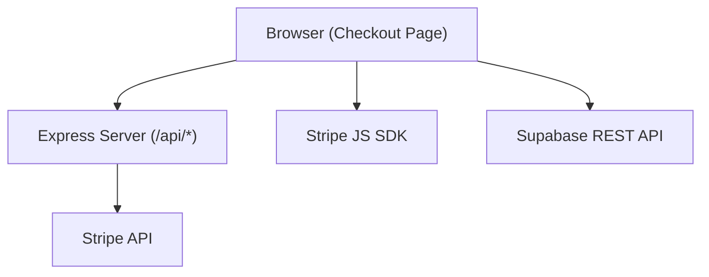
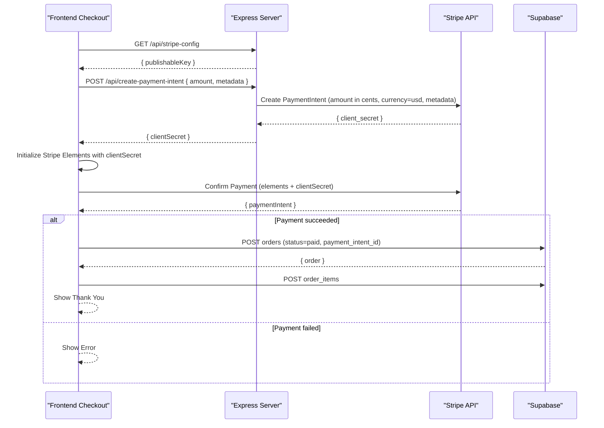
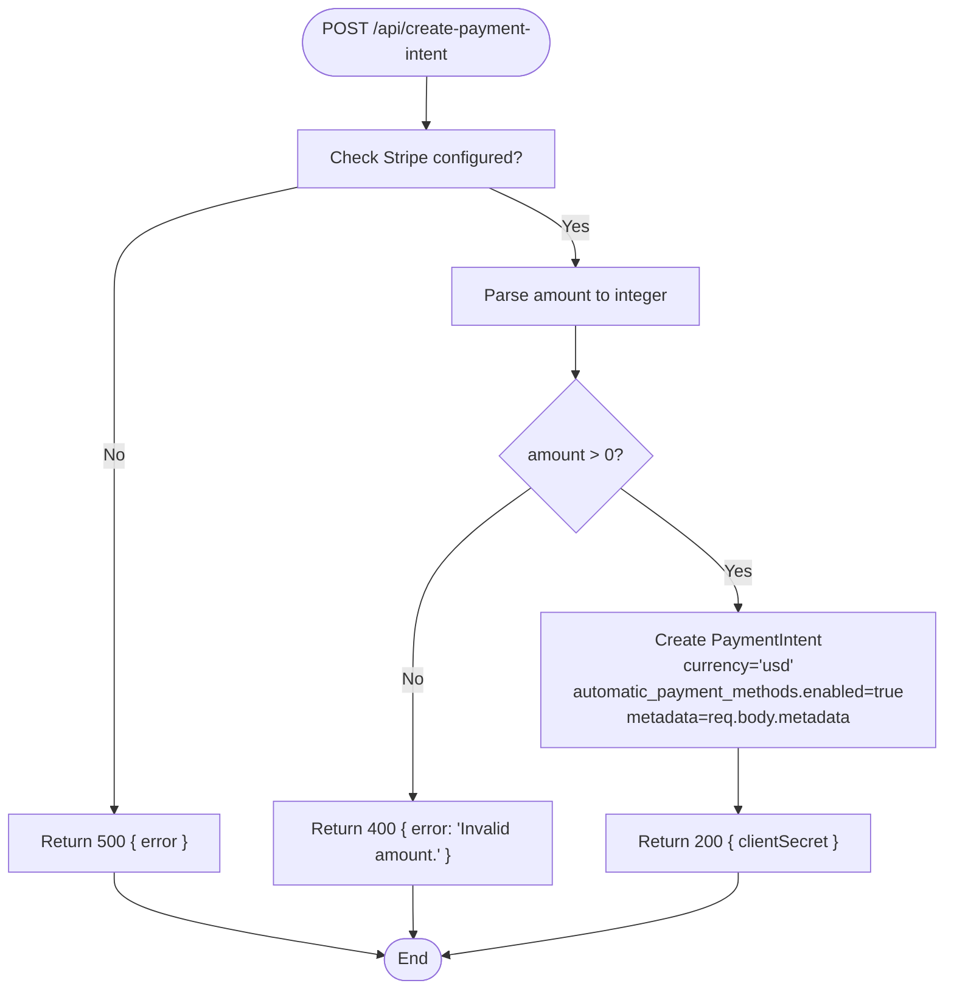
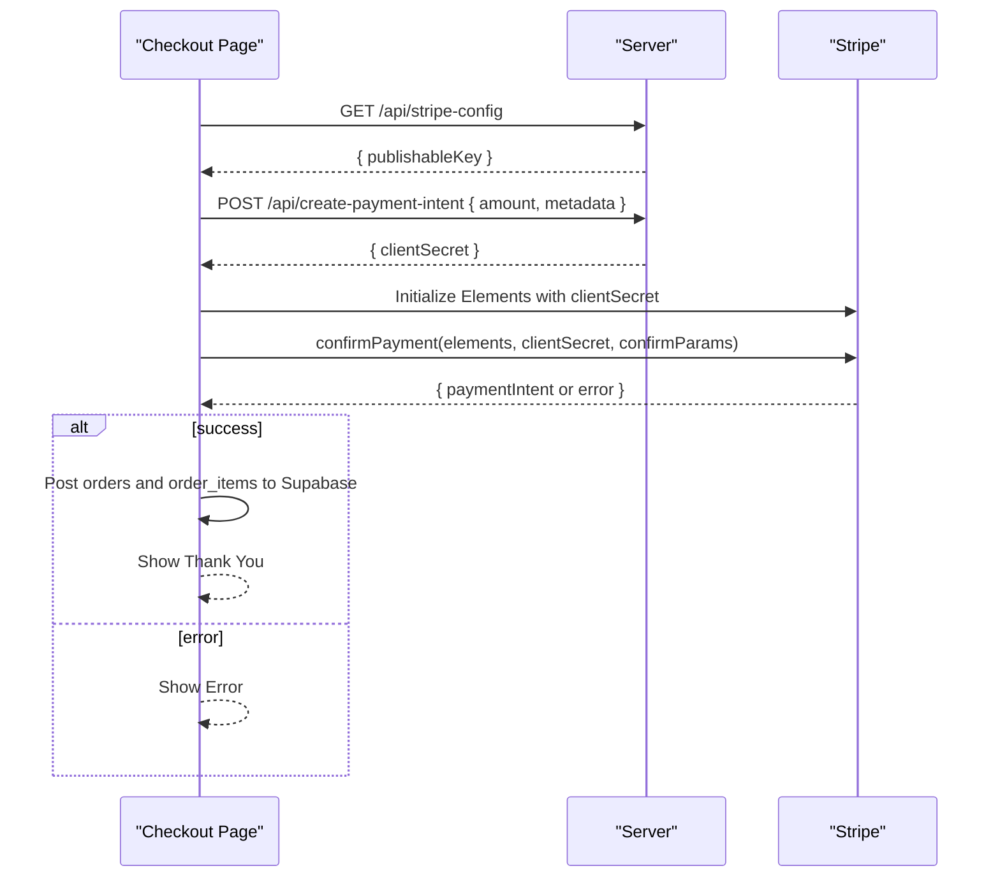
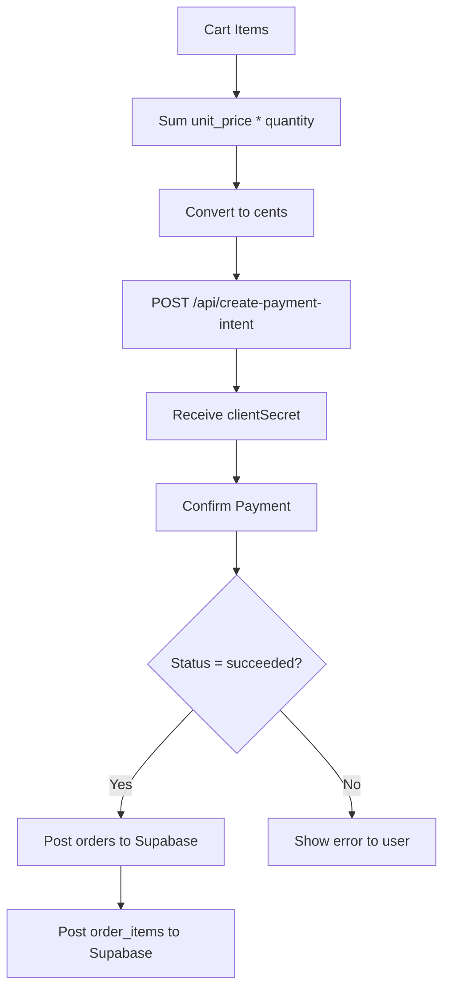
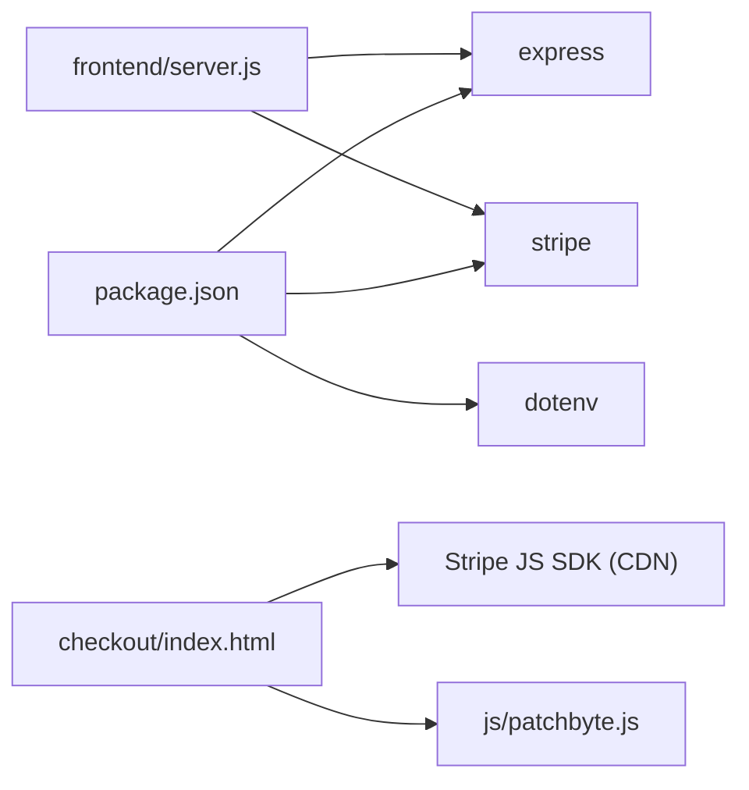

# Payment Processing

<cite>
**Referenced Files in This Document**
- [frontend/server.js](file://frontend/server.js)
- [api/index.js](file://api/index.js)
- [frontend/patchkraze.com/checkout/index.html](file://frontend/patchkraze.com/checkout/index.html)
- [frontend/js/patchbyte.js](file://frontend/js/patchbyte.js)
- [package.json](file://package.json)
</cite>

## Table of Contents
1. [Introduction](#introduction)
2. [Project Structure](#project-structure)
3. [Core Components](#core-components)
4. [Architecture Overview](#architecture-overview)
5. [Detailed Component Analysis](#detailed-component-analysis)
6. [Dependency Analysis](#dependency-analysis)
7. [Performance Considerations](#performance-considerations)
8. [Troubleshooting Guide](#troubleshooting-guide)
9. [Conclusion](#conclusion)

## Introduction
This document explains the Stripe payment processing implementation for the checkout flow. It focuses on the server-side endpoint that creates a Stripe Payment Intent, how amounts and currency are handled, metadata usage, error handling patterns, security considerations, and the frontend integration with Stripe Elements. It also provides examples of successful and failed requests, debugging techniques, and troubleshooting guidance.

## Project Structure
The payment system spans a small Express server and a checkout page:
- Server routes handle creating Payment Intents and exposing Stripe configuration to the client.
- The checkout page initializes Stripe Elements, calls the server to create a Payment Intent, and confirms payment using the returned client secret.
- A shared utility script manages cart operations and integrates with Supabase; it is used by the checkout page to persist orders after successful payments.

**Diagram sources**
- [frontend/server.js:17-44](file://frontend/server.js#L17-L44)
- [frontend/patchkraze.com/checkout/index.html:191-212](file://frontend/patchkraze.com/checkout/index.html#L191-L212)
- [frontend/patchkraze.com/checkout/index.html:286-320](file://frontend/patchkraze.com/checkout/index.html#L286-L320)
- [frontend/js/patchbyte.js:33-51](file://frontend/js/patchbyte.js#L33-L51)

**Section sources**
- [frontend/server.js:1-48](file://frontend/server.js#L1-L48)
- [frontend/patchkraze.com/checkout/index.html:161-258](file://frontend/patchkraze.com/checkout/index.html#L161-L258)
- [frontend/js/patchbyte.js:1-51](file://frontend/js/patchbyte.js#L1-L51)

## Core Components
- Server route /api/create-payment-intent: Validates input, converts amount to cents, creates a Stripe Payment Intent with USD currency and automatic payment methods, attaches metadata, and returns a client secret.
- Server route /api/stripe-config: Returns the Stripe publishable key to the frontend.
- Checkout page: Initializes Stripe Elements, fetches the publishable key, creates a Payment Intent with the order total in cents, mounts the payment element, and confirms payment upon form submission.
- Order persistence: After a successful payment confirmation, the checkout page posts order data to Supabase via the shared utility.

Key responsibilities:
- Amount conversion to cents occurs on the server side to ensure accurate charges.
- Currency is fixed to USD in the Payment Intent creation.
- Metadata is attached from the request body and includes session information.
- Errors are validated and returned as JSON with appropriate HTTP status codes.

**Section sources**
- [frontend/server.js:17-44](file://frontend/server.js#L17-L44)
- [frontend/patchkraze.com/checkout/index.html:191-212](file://frontend/patchkraze.com/checkout/index.html#L191-L212)
- [frontend/patchkraze.com/checkout/index.html:286-320](file://frontend/patchkraze.com/checkout/index.html#L286-L320)
- [frontend/js/patchbyte.js:33-51](file://frontend/js/patchbyte.js#L33-L51)

## Architecture Overview
The payment flow uses a secure server-side intent creation pattern:
1. Frontend loads the checkout page and initializes Stripe Elements with a client secret obtained from the server.
2. Frontend calls /api/create-payment-intent with the order total in cents and optional metadata.
3. Server validates the amount, creates a Payment Intent with USD currency and automatic payment methods enabled, and returns the client secret.
4. Frontend mounts the Stripe payment element and confirms payment when the user submits the form.
5. On success, the frontend persists order details to Supabase and shows a thank-you screen.

**Diagram sources**
- [frontend/server.js:17-44](file://frontend/server.js#L17-L44)
- [frontend/patchkraze.com/checkout/index.html:191-212](file://frontend/patchkraze.com/checkout/index.html#L191-L212)
- [frontend/patchkraze.com/checkout/index.html:286-320](file://frontend/patchkraze.com/checkout/index.html#L286-L320)
- [frontend/js/patchbyte.js:33-51](file://frontend/js/patchbyte.js#L33-L51)

## Detailed Component Analysis

### Endpoint: /api/create-payment-intent
- Method: POST
- Purpose: Create a Stripe Payment Intent for the checkout total and return a client secret to the frontend.
- Request body:
  - amount: number representing the total in cents (e.g., 1234 for $12.34). Must be a positive integer.
  - metadata: object; typically includes session_id for tracking.
- Validation logic:
  - Ensures Stripe is configured on the server; otherwise returns 500 with an error message.
  - Converts amount to a rounded integer and rejects non-positive values with 400.
- Response:
  - Success: 200 with JSON containing clientSecret.
  - Failure: 400 with JSON containing error details.
- Behavior:
  - Creates a Payment Intent with currency set to USD.
  - Enables automatic payment methods to support cards and digital wallets.
  - Attaches metadata provided in the request.

**Diagram sources**
- [frontend/server.js:17-39](file://frontend/server.js#L17-L39)

**Section sources**
- [frontend/server.js:17-39](file://frontend/server.js#L17-L39)

### Endpoint: /api/stripe-config
- Method: GET
- Purpose: Provide the Stripe publishable key to the frontend so it can initialize the Stripe SDK securely without hardcoding keys.
- Response:
  - JSON with publishableKey string.

**Section sources**
- [frontend/server.js:41-44](file://frontend/server.js#L41-L44)

### Frontend Checkout Flow
- Initialization:
  - Loads Stripe SDK asynchronously.
  - Fetches publishable key from /api/stripe-config.
  - Computes order total in cents from the cart and calls /api/create-payment-intent with amount and metadata including session_id.
  - Initializes Stripe Elements with the returned client secret and mounts the payment element.
- Submission:
  - Validates required fields.
  - Submits payment via elements.submit() and stripe.confirmPayment with billing details and redirect behavior if required.
  - On success, posts order and order items to Supabase and displays a thank-you screen.
  - On failure, shows errors and re-enables the submit button.

**Diagram sources**
- [frontend/patchkraze.com/checkout/index.html:191-212](file://frontend/patchkraze.com/checkout/index.html#L191-L212)
- [frontend/patchkraze.com/checkout/index.html:286-320](file://frontend/patchkraze.com/checkout/index.html#L286-L320)

**Section sources**
- [frontend/patchkraze.com/checkout/index.html:161-258](file://frontend/patchkraze.com/checkout/index.html#L161-L258)
- [frontend/patchkraze.com/checkout/index.html:260-351](file://frontend/patchkraze.com/checkout/index.html#L260-L351)

### Data Models and Flows
- Cart totals: Computed on the frontend by summing unit_price times quantity across cart items; converted to cents before sending to the server.
- Order persistence: After successful payment confirmation, the frontend posts order data (including customer info, shipping address, notes, subtotal, total, status, and payment_intent_id) to Supabase, then posts line items.

**Diagram sources**
- [frontend/patchkraze.com/checkout/index.html:225-227](file://frontend/patchkraze.com/checkout/index.html#L225-L227)
- [frontend/patchkraze.com/checkout/index.html:200-212](file://frontend/patchkraze.com/checkout/index.html#L200-L212)
- [frontend/patchkraze.com/checkout/index.html:286-320](file://frontend/patchkraze.com/checkout/index.html#L286-L320)

**Section sources**
- [frontend/patchkraze.com/checkout/index.html:225-227](file://frontend/patchkraze.com/checkout/index.html#L225-L227)
- [frontend/patchkraze.com/checkout/index.html:286-320](file://frontend/patchkraze.com/checkout/index.html#L286-L320)

## Dependency Analysis
- Server dependencies:
  - Express for routing and serving static assets.
  - Stripe SDK for creating Payment Intents.
  - Dotenv for loading environment variables during local development.
- Frontend dependencies:
  - Stripe JS SDK loaded from CDN for Elements and confirmPayment.
  - Shared utility script for cart and Supabase interactions.

**Diagram sources**
- [package.json:9-13](file://package.json#L9-L13)
- [frontend/server.js:1-15](file://frontend/server.js#L1-L15)
- [frontend/patchkraze.com/checkout/index.html:9-10](file://frontend/patchkraze.com/checkout/index.html#L9-L10)
- [frontend/js/patchbyte.js:1-17](file://frontend/js/patchbyte.js#L1-L17)

**Section sources**
- [package.json:9-13](file://package.json#L9-L13)
- [frontend/server.js:1-15](file://frontend/server.js#L1-L15)
- [frontend/patchkraze.com/checkout/index.html:9-10](file://frontend/patchkraze.com/checkout/index.html#L9-L10)
- [frontend/js/patchbyte.js:1-17](file://frontend/js/patchbyte.js#L1-L17)

## Performance Considerations
- Amount validation and rounding occur server-side to avoid client-side manipulation and ensure consistent charges.
- Using Stripe Elements offloads sensitive card data handling to Stripe, reducing PCI scope and improving performance by leveraging their optimized UI components.
- The server returns only the minimal necessary client secret to the frontend, minimizing payload size.
- Static asset serving and CDN proxying reduce load times for theme assets.

[No sources needed since this section provides general guidance]

## Troubleshooting Guide
Common issues and debugging steps:
- Missing or invalid amount:
  - Symptom: 400 response with error indicating invalid amount.
  - Cause: Non-positive or non-numeric amount sent to the server.
  - Fix: Ensure the frontend sends the total in cents as a positive integer.
- Stripe not configured on server:
  - Symptom: 500 response with error stating Stripe is not configured.
  - Cause: Missing STRIPE_SECRET_KEY environment variable.
  - Fix: Set STRIPE_SECRET_KEY in your deployment environment.
- Publishable key missing:
  - Symptom: Frontend cannot initialize Stripe Elements.
  - Cause: Missing STRIPE_PUBLISHABLE_KEY environment variable.
  - Fix: Set STRIPE_PUBLISHABLE_KEY in your deployment environment.
- Payment confirmation errors:
  - Symptom: Frontend shows error messages from Stripe.
  - Causes: Insufficient funds, card declined, 3D Secure required, network issues.
  - Debugging: Check browser console logs and Stripe dashboard for detailed error reasons.
- Order not persisted:
  - Symptom: Payment succeeds but no order appears.
  - Cause: Supabase write failures or incorrect payload.
  - Debugging: Verify Supabase credentials and permissions in patchbyte.js and check network responses.

Examples:
- Successful request:
  - Request: POST /api/create-payment-intent with { amount: 1234, metadata: { session_id: "abc123" } }
  - Response: 200 { clientSecret: "pi_xxx..." }
- Failed request (invalid amount):
  - Request: POST /api/create-payment-intent with { amount: -100 }
  - Response: 400 { error: "Invalid amount." }
- Failed request (server misconfiguration):
  - Request: POST /api/create-payment-intent with valid amount
  - Response: 500 { error: "Stripe is not configured on the server." }

Debugging techniques:
- Use browser DevTools Network tab to inspect requests/responses to /api/create-payment-intent and /api/stripe-config.
- Check server logs for Stripe errors logged by the endpoint handler.
- Review Stripe Dashboard for Payment Intent events and statuses.
- Validate environment variables are correctly set in production environments.

**Section sources**
- [frontend/server.js:17-44](file://frontend/server.js#L17-L44)
- [frontend/patchkraze.com/checkout/index.html:200-212](file://frontend/patchkraze.com/checkout/index.html#L200-L212)
- [frontend/patchkraze.com/checkout/index.html:286-320](file://frontend/patchkraze.com/checkout/index.html#L286-L320)
- [frontend/js/patchbyte.js:33-51](file://frontend/js/patchbyte.js#L33-L51)

## Conclusion
The payment processing implementation follows best practices by creating Payment Intents server-side, validating amounts, fixing currency to USD, enabling automatic payment methods, and attaching metadata for traceability. The frontend integrates Stripe Elements securely and persists orders to Supabase upon successful payment. Proper environment configuration and error handling ensure a robust checkout experience. For ongoing reliability, monitor Stripe events, validate inputs, and keep environment variables secure.

[No sources needed since this section summarizes without analyzing specific files]