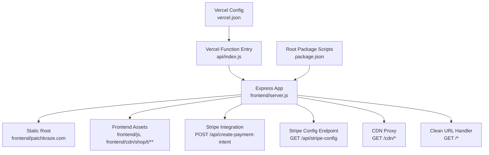
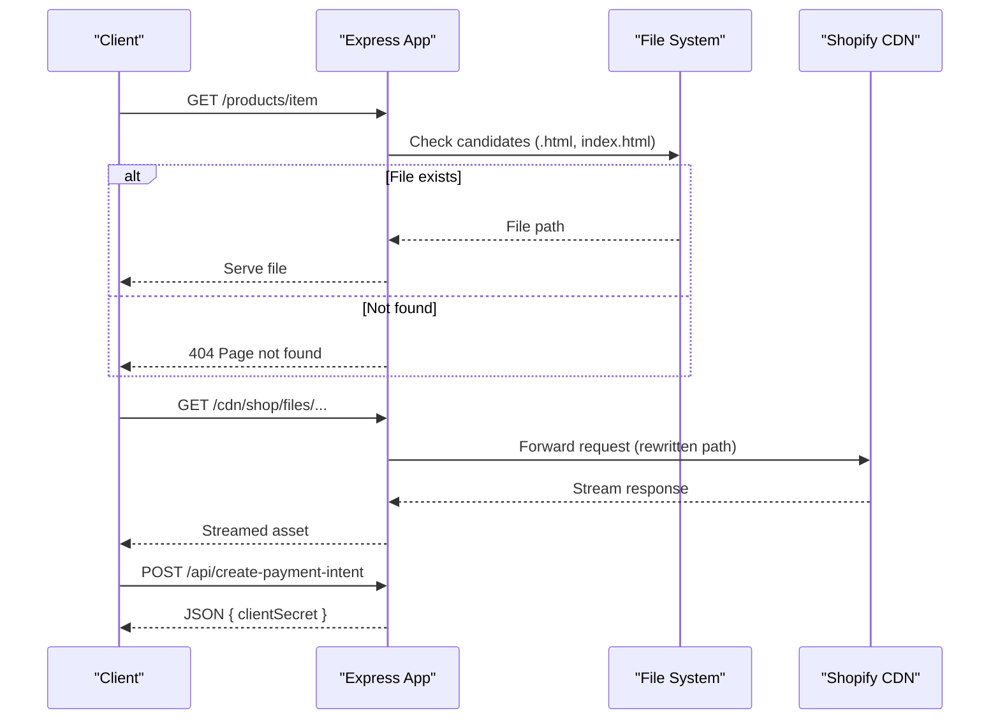
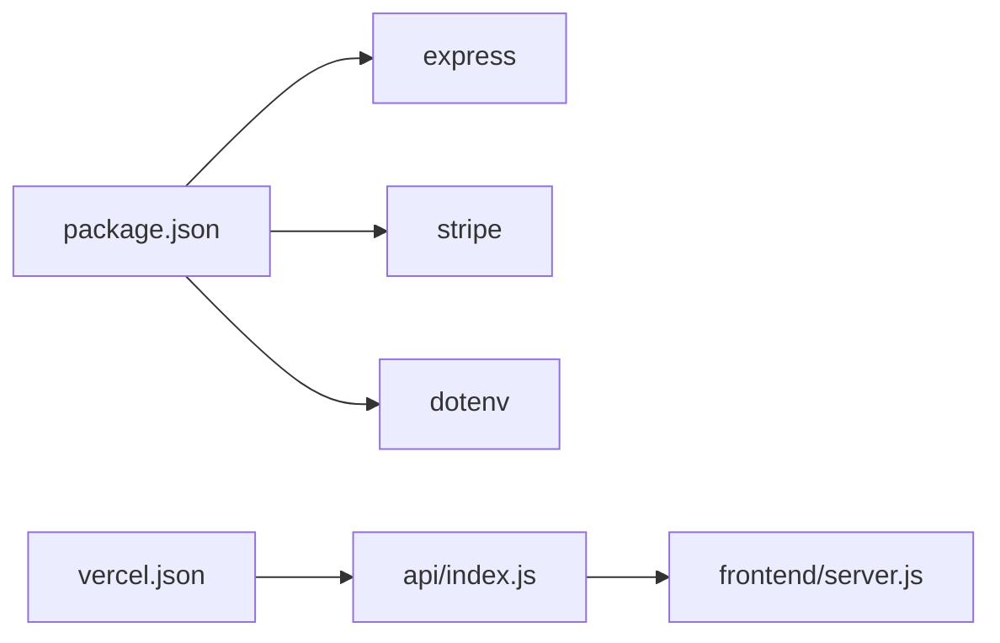

# Server Configuration

<cite>
**Referenced Files in This Document**
- [frontend/server.js](file://frontend/server.js)
- [api/index.js](file://api/index.js)
- [vercel.json](file://vercel.json)
- [frontend/vercel.json](file://frontend/vercel.json)
- [package.json](file://package.json)
- [frontend/package.json](file://frontend/package.json)
- [frontend/start-server.bat](file://frontend/start-server.bat)
</cite>

## Table of Contents
1. [Introduction](#introduction)
2. [Project Structure](#project-structure)
3. [Core Components](#core-components)
4. [Architecture Overview](#architecture-overview)
5. [Detailed Component Analysis](#detailed-component-analysis)
6. [Dependency Analysis](#dependency-analysis)
7. [Performance Considerations](#performance-considerations)
8. [Troubleshooting Guide](#troubleshooting-guide)
9. [Conclusion](#conclusion)
10. [Appendices](#appendices)

## Introduction
This document explains the Express.js server configuration for the Patch-Byte application. It covers how the server initializes, handles environment variables, sets up middleware (JSON parsing and static file serving), configures ports and root directories, supports development versus production behavior, and exports the app for Vercel serverless deployment. It also includes local startup procedures and example environment variable configurations.

## Project Structure
The server is implemented as a single Express application with a small API surface for payments and asset proxying. Static site content is served from a dedicated directory, and routes handle redirects and clean URL resolution. The project provides both a top-level entry point for Vercel functions and a direct Node script for local development.

**Diagram sources**
- [frontend/server.js:1-123](file://frontend/server.js#L1-L123)
- [api/index.js:1-1](file://api/index.js#L1-L1)
- [vercel.json:1-12](file://vercel.json#L1-L12)
- [package.json:1-14](file://package.json#L1-L14)

**Section sources**
- [frontend/server.js:1-123](file://frontend/server.js#L1-L123)
- [api/index.js:1-1](file://api/index.js#L1-L1)
- [vercel.json:1-12](file://vercel.json#L1-L12)
- [package.json:1-14](file://package.json#L1-L14)

## Core Components
- Express application initialization and port configuration
- Environment variable loading for local development
- Middleware setup: JSON body parsing and static file serving
- API endpoints: Stripe payment intent creation and Stripe publishable key exposure
- CDN proxy to forward missing assets to Shopify CDN
- Clean URL routing with permanent and temporary redirects
- Vercel serverless export pattern and local-only listening guard

Key behaviors:
- Port defaults to an environment variable or 3000
- Root directory for static files is set to a specific subdirectory under frontend
- JSON parsing is enabled globally via middleware
- Static assets are served from both the root and the static directory
- CDN proxy rewrites paths and forwards requests to Shopify CDN
- Routes map clean URLs to .html files or index.html fallbacks
- The app is exported for Vercel; it only listens when executed directly

**Section sources**
- [frontend/server.js:11-14](file://frontend/server.js#L11-L14)
- [frontend/server.js:15-15](file://frontend/server.js#L15-L15)
- [frontend/server.js:46-48](file://frontend/server.js#L46-L48)
- [frontend/server.js:52-65](file://frontend/server.js#L52-L65)
- [frontend/server.js:68-111](file://frontend/server.js#L68-L111)
- [frontend/server.js:113-122](file://frontend/server.js#L113-L122)

## Architecture Overview
The server exposes a minimal API and serves a static site. Requests flow through middleware for JSON parsing, then hit route handlers that either respond with JSON or serve static files. For missing CDN assets, the server proxies to Shopify’s CDN. Clean URLs are resolved by mapping to actual files on disk.

**Diagram sources**
- [frontend/server.js:52-65](file://frontend/server.js#L52-L65)
- [frontend/server.js:92-111](file://frontend/server.js#L92-L111)
- [frontend/server.js:17-39](file://frontend/server.js#L17-L39)

## Detailed Component Analysis

### Server Initialization and Environment Variables
- Loads environment variables from a parent .env file during local development
- Initializes Stripe conditionally based on presence of secret key
- Creates Express app and defines PORT with a default fallback
- Sets ROOT to the static site directory

Environment variable handling:
- STRIPE_SECRET_KEY: Enables Stripe integration if present
- STRIPE_PUBLISHABLE_KEY: Exposed to clients via a config endpoint
- PORT: Determines listening port; defaults to 3000

Local vs production:
- Local: dotenv loads .env; server listens on PORT
- Production (Vercel): env vars are injected at runtime; server is exported without starting a listener

**Section sources**
- [frontend/server.js:6-9](file://frontend/server.js#L6-L9)
- [frontend/server.js:11-13](file://frontend/server.js#L11-L13)
- [frontend/server.js:113-122](file://frontend/server.js#L113-L122)

### Middleware Setup
- JSON parsing: Global middleware parses JSON request bodies
- Static file serving: Serves files from the static root and the frontend directory
- CDN proxy: Rewrites /cdn/* paths and streams responses from Shopify CDN

Notes:
- Static root is explicitly set to ensure correct routing for clean URLs
- CDN proxy sets appropriate headers and caching

**Section sources**
- [frontend/server.js:15-15](file://frontend/server.js#L15-L15)
- [frontend/server.js:46-48](file://frontend/server.js#L46-L48)
- [frontend/server.js:52-65](file://frontend/server.js#L52-L65)

### API Endpoints
- POST /api/create-payment-intent
  - Validates amount and creates a Stripe PaymentIntent
  - Returns clientSecret to the client
  - Handles errors with appropriate status codes
- GET /api/stripe-config
  - Returns the publishable key for client-side Stripe usage

Error handling:
- Missing Stripe configuration returns a 500 error
- Invalid input returns 400
- Stripe errors are logged and returned as 400

**Section sources**
- [frontend/server.js:17-39](file://frontend/server.js#L17-L39)
- [frontend/server.js:41-44](file://frontend/server.js#L41-L44)

### Static File Serving and Clean URL Routing
- Serves static files from the configured root and frontend directory
- Maps clean URLs to .html files or index.html fallbacks
- Implements permanent (301) and temporary (302) redirects for moved or missing pages
- Returns a friendly 404 page when no matching file is found

Redirect strategy:
- Permanent redirects for renamed/moved resources
- Temporary redirects for placeholder pages pointing to relevant content

**Section sources**
- [frontend/server.js:46-48](file://frontend/server.js#L46-L48)
- [frontend/server.js:68-90](file://frontend/server.js#L68-L90)
- [frontend/server.js:92-111](file://frontend/server.js#L92-L111)

### Vercel Serverless Export Pattern
- Top-level api/index.js re-exports the Express app for Vercel Functions
- vercel.json configures function includeFiles and rewrites all routes to the function
- Alternative frontend/vercel.json demonstrates a Node-based build with @vercel/node

Deployment notes:
- All incoming requests are routed to the function handler
- IncludeFiles ensures necessary static assets are bundled with the function
- No explicit server.listen() call in production; Vercel manages lifecycle

**Section sources**
- [api/index.js:1-1](file://api/index.js#L1-L1)
- [vercel.json:1-12](file://vercel.json#L1-L12)
- [frontend/vercel.json:1-20](file://frontend/vercel.json#L1-L20)

### Local Development Startup Procedures
- Use package scripts to start the server locally
- Windows users can use the provided batch script to launch the server
- Ensure environment variables are available via .env in the repository root

Startup commands:
- npm start from the repository root
- node frontend/server.js directly
- Windows: frontend/start-server.bat

Port and root:
- Defaults to port 3000 unless overridden by environment
- Serves static content from the configured root directory

**Section sources**
- [package.json:4-7](file://package.json#L4-L7)
- [frontend/package.json:5-8](file://frontend/package.json#L5-L8)
- [frontend/start-server.bat:1-9](file://frontend/start-server.bat#L1-L9)
- [frontend/server.js:11-13](file://frontend/server.js#L11-L13)

## Dependency Analysis
The server depends on Express for routing and middleware, Stripe for payment processing, and dotenv for local environment loading. Vercel configuration wires the function entry point and routes.

**Diagram sources**
- [package.json:9-13](file://package.json#L9-L13)
- [api/index.js:1-1](file://api/index.js#L1-L1)
- [vercel.json:4-11](file://vercel.json#L4-L11)

**Section sources**
- [package.json:9-13](file://package.json#L9-L13)
- [api/index.js:1-1](file://api/index.js#L1-L1)
- [vercel.json:4-11](file://vercel.json#L4-L11)

## Performance Considerations
- Static file serving is efficient for HTML and assets; consider enabling compression in production if supported by your hosting platform
- CDN proxy adds latency; prefer pre-bundling required assets where possible
- Redirect maps reduce 404s and improve SEO by preserving link equity
- Avoid heavy synchronous operations in request handlers; current implementation uses async Stripe calls appropriately

[No sources needed since this section provides general guidance]

## Troubleshooting Guide
Common issues and resolutions:
- Stripe not configured: Ensure STRIPE_SECRET_KEY is set; otherwise payment endpoints will return an error
- 404 on clean URLs: Verify that the corresponding .html or index.html exists under the static root
- CDN assets not loading: Confirm /cdn/* proxy rules and network access to Shopify CDN
- Port conflicts: Change PORT environment variable if 3000 is already in use
- Local environment variables: Place .env in the repository root so dotenv can load them during local runs

Relevant behaviors:
- Error responses for invalid amounts and missing Stripe configuration
- Friendly 404 page for unmatched routes
- Logging of Stripe errors for debugging

**Section sources**
- [frontend/server.js:17-39](file://frontend/server.js#L17-L39)
- [frontend/server.js:92-111](file://frontend/server.js#L92-L111)

## Conclusion
The Patch-Byte server is a lightweight Express application that serves a static site, proxies CDN assets, and exposes a minimal Stripe API. It supports local development with environment variables and integrates seamlessly with Vercel using a serverless export pattern. Proper configuration of environment variables and static roots ensures consistent behavior across environments.

[No sources needed since this section summarizes without analyzing specific files]

## Appendices

### Environment Variable Examples
- STRIPE_SECRET_KEY: Set to your Stripe secret key to enable payment intents
- STRIPE_PUBLISHABLE_KEY: Set to your Stripe publishable key for client-side usage
- PORT: Optional; defaults to 3000 if not set

Example .env (place in repository root for local development):
- STRIPE_SECRET_KEY=sk_test_...
- STRIPE_PUBLISHABLE_KEY=pk_test_...
- PORT=3000

**Section sources**
- [frontend/server.js:6-9](file://frontend/server.js#L6-L9)
- [frontend/server.js:41-44](file://frontend/server.js#L41-L44)
- [frontend/server.js:11-13](file://frontend/server.js#L11-L13)

### Server Startup Commands
- Start via npm:
  - npm start
- Direct Node execution:
  - node frontend/server.js
- Windows batch:
  - frontend/start-server.bat

**Section sources**
- [package.json:4-7](file://package.json#L4-L7)
- [frontend/package.json:5-8](file://frontend/package.json#L5-L8)
- [frontend/start-server.bat:1-9](file://frontend/start-server.bat#L1-L9)