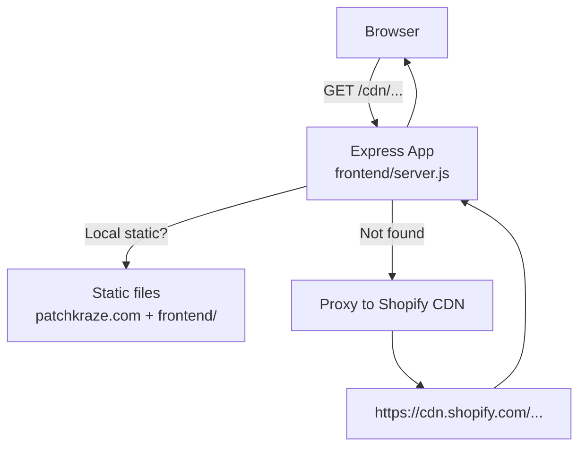
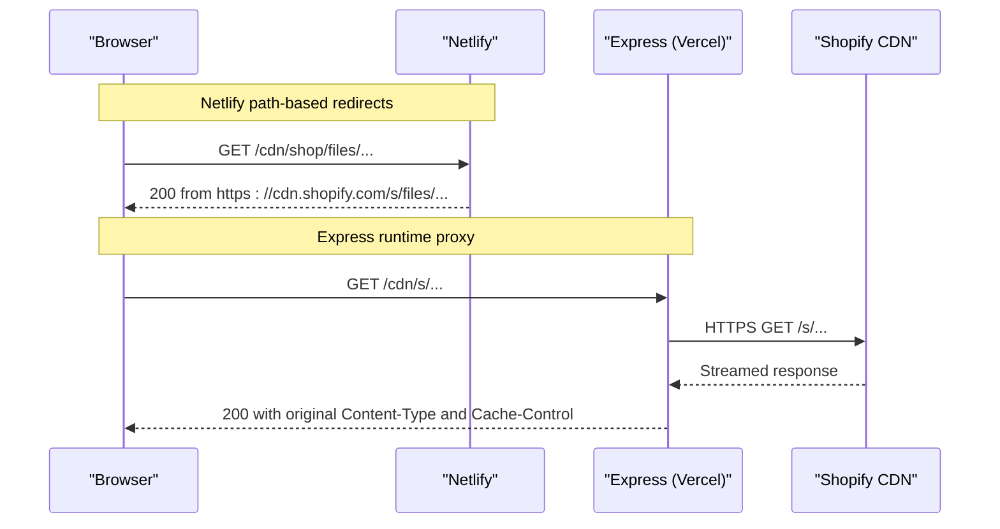
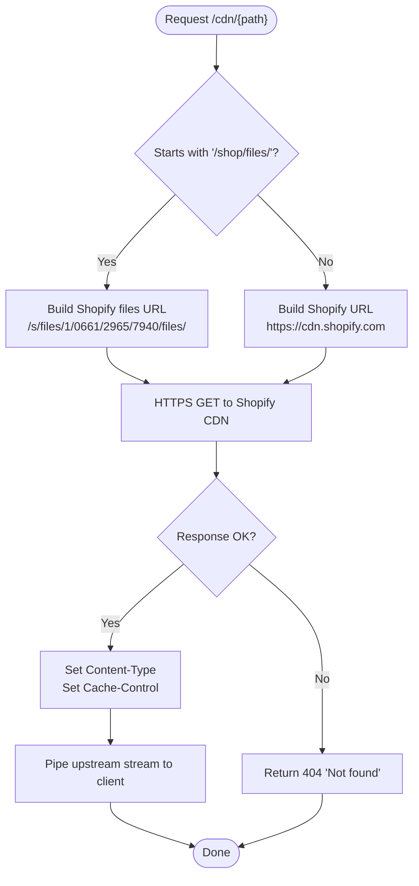
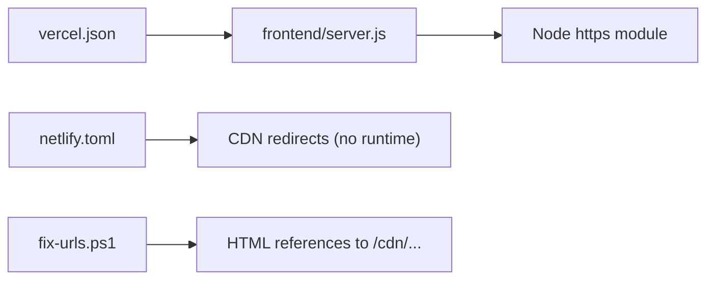

# CDN Proxy Implementation

<cite>
**Referenced Files in This Document**
- [frontend/server.js](file://frontend/server.js)
- [api/index.js](file://api/index.js)
- [vercel.json](file://vercel.json)
- [netlify.toml](file://netlify.toml)
- [fix-urls.ps1](file://fix-urls.ps1)
- [frontend/js/patchbyte.js](file://frontend/js/patchbyte.js)
</cite>

## Table of Contents
1. [Introduction](#introduction)
2. [Project Structure](#project-structure)
3. [Core Components](#core-components)
4. [Architecture Overview](#architecture-overview)
5. [Detailed Component Analysis](#detailed-component-analysis)
6. [Dependency Analysis](#dependency-analysis)
7. [Performance Considerations](#performance-considerations)
8. [Troubleshooting Guide](#troubleshooting-guide)
9. [Conclusion](#conclusion)

## Introduction
This document explains how the application intercepts /cdn/ requests and proxies them to Shopify’s CDN endpoints. It covers path transformation rules for shop/files assets and general CDN resources, header management (Content-Type preservation and Cache-Control), error handling and fallback behavior, common usage patterns, and troubleshooting steps.

## Project Structure
The CDN proxy is implemented as a server-side Express route that forwards requests to Shopify CDN when assets are not served locally. The same paths can also be proxied at the platform level (Netlify redirects) or via Vercel rewrites to the same Express handler.

**Diagram sources**
- [frontend/server.js:46-65](file://frontend/server.js#L46-L65)
- [vercel.json:9-11](file://vercel.json#L9-L11)
- [netlify.toml:135-165](file://netlify.toml#L135-L165)

**Section sources**
- [frontend/server.js:46-65](file://frontend/server.js#L46-L65)
- [vercel.json:9-11](file://vercel.json#L9-L11)
- [netlify.toml:135-165](file://netlify.toml#L135-L165)

## Core Components
- Express route that intercepts /cdn/{*} and proxies to Shopify CDN with Content-Type and Cache-Control headers set.
- Platform-level redirects on Netlify for specific /cdn subpaths.
- Vercel rewrite routing all requests to the Express handler.
- Build-time URL normalization script to ensure HTML references use /cdn/ paths.
- Frontend fetch interception for cart operations (not directly related to CDN but part of the runtime).

Key responsibilities:
- Path rewriting for shop/files vs other CDN paths.
- Header forwarding and caching policy.
- Error handling for failed CDN requests.

**Section sources**
- [frontend/server.js:50-65](file://frontend/server.js#L50-L65)
- [netlify.toml:135-165](file://netlify.toml#L135-L165)
- [vercel.json:9-11](file://vercel.json#L9-L11)
- [fix-urls.ps1:13-22](file://fix-urls.ps1#L13-L22)

## Architecture Overview
The system supports two deployment strategies:

- Node/Express runtime (local or Vercel functions):
  - All requests are rewritten to api/index.js which exports the Express app from frontend/server.js.
  - The Express app serves static files first, then proxies unmatched /cdn/ paths to Shopify CDN.

- Netlify static hosting:
  - Redirect rules map /cdn/* segments directly to Shopify CDN without a Node runtime.

**Diagram sources**
- [netlify.toml:135-165](file://netlify.toml#L135-L165)
- [frontend/server.js:50-65](file://frontend/server.js#L50-L65)
- [vercel.json:9-11](file://vercel.json#L9-L11)

## Detailed Component Analysis

### CDN Interception and Rewriting (Express)
- Route pattern: GET /cdn/{*cdnPath}
- Path transformation:
  - If cdnPath starts with /shop/files/, the target becomes https://cdn.shopify.com/s/files/1/0661/2965/7940/files/<remaining path>.
  - Otherwise, the target is https://cdn.shopify.com<original cdnPath>.
- Headers:
  - Content-Type is copied from the upstream response; defaults to application/octet-stream if missing.
  - Cache-Control is set to public, max-age=86400.
- Error handling:
  - On network errors, returns 404 with a simple message.

**Diagram sources**
- [frontend/server.js:50-65](file://frontend/server.js#L50-L65)

**Section sources**
- [frontend/server.js:50-65](file://frontend/server.js#L50-L65)

### CDN Interception and Rewriting (Netlify)
- Direct redirects map /cdn subpaths to Shopify CDN without a runtime:
  - /cdn/shop/files/* → https://cdn.shopify.com/s/files/1/0661/2965/7940/files/:splat
  - /cdn/s/* → https://cdn.shopify.com/s/:splat
  - /cdn/shopifycloud/* → https://cdn.shopify.com/shopifycloud/:splat
  - /cdn/wpm/* → https://cdn.shopify.com/wpm/:splat
  - /cdn/fonts/* → https://cdn.shopify.com/fonts/:splat
- These rules bypass the Express proxy and serve directly from Shopify CDN.

**Section sources**
- [netlify.toml:135-165](file://netlify.toml#L135-L165)

### Vercel Rewrite to Express Handler
- All routes are rewritten to /api/index, which exports the Express app from frontend/server.js.
- This ensures the /cdn/ proxy logic runs under Vercel Functions.

**Section sources**
- [vercel.json:9-11](file://vercel.json#L9-L11)
- [api/index.js:1](file://api/index.js#L1-L1)

### Build-Time URL Normalization
- A PowerShell script normalizes HTML references to use relative /cdn/ paths and strips query strings from CDN URLs.
- This ensures consistent asset loading across environments.

**Section sources**
- [fix-urls.ps1:13-22](file://fix-urls.ps1#L13-L22)

### Frontend Fetch Interception (Contextual)
- The frontend patchbyte script intercepts certain fetch calls for cart operations and returns mock or Supabase-backed responses.
- While not part of the CDN proxy, it demonstrates runtime request interception patterns used elsewhere in the app.

**Section sources**
- [frontend/js/patchbyte.js:138-163](file://frontend/js/patchbyte.js#L138-L163)

## Dependency Analysis
- The Express server depends on Node’s built-in https module to forward requests to Shopify CDN.
- Platform configuration files (vercel.json, netlify.toml) define routing/rewrites that influence how /cdn/ requests are handled before reaching the Express app.
- The build script influences how HTML references CDN assets, ensuring they resolve through the configured proxy strategy.

**Diagram sources**
- [frontend/server.js:50-65](file://frontend/server.js#L50-L65)
- [vercel.json:9-11](file://vercel.json#L9-L11)
- [netlify.toml:135-165](file://netlify.toml#L135-L165)
- [fix-urls.ps1:13-22](file://fix-urls.ps1#L13-L22)

**Section sources**
- [frontend/server.js:50-65](file://frontend/server.js#L50-L65)
- [vercel.json:9-11](file://vercel.json#L9-L11)
- [netlify.toml:135-165](file://netlify.toml#L135-L165)
- [fix-urls.ps1:13-22](file://fix-urls.ps1#L13-L22)

## Performance Considerations
- Streaming: The Express proxy streams the upstream response directly to the client, minimizing memory usage and latency.
- Caching: Cache-Control is set to one day for proxied assets to improve repeat load performance.
- Platform routing: Netlify redirects avoid Node overhead by serving directly from Shopify CDN.
- Asset types: Ensure correct Content-Type is preserved to avoid misinterpretation by browsers.

[No sources needed since this section provides general guidance]

## Troubleshooting Guide
Common issues and resolutions:

- 404 Not Found on /cdn/ assets:
  - In Express, network errors result in a 404 response. Verify the upstream Shopify URL constructed by the path transformation logic.
  - Confirm whether you are running on Netlify (redirects) or Vercel/Express (proxy).

- Incorrect Content-Type:
  - The proxy sets Content-Type from the upstream response; if missing, it defaults to application/octet-stream.
  - Inspect the upstream response headers to confirm the source type.

- Stale or missing cache:
  - Proxied assets are cached for one day. Clear browser cache or force reload to verify updates.
  - On Netlify, redirects do not modify Cache-Control; rely on Shopify CDN caching policies.

- Broken image links after export:
  - Use the provided URL normalization script to ensure HTML references use /cdn/ paths consistently.

- Environment differences:
  - On Netlify, /cdn/ paths are redirected at the edge; on Vercel, all requests go through the Express function.
  - Validate the active routing strategy based on your deployment target.

**Section sources**
- [frontend/server.js:50-65](file://frontend/server.js#L50-L65)
- [netlify.toml:135-165](file://netlify.toml#L135-L165)
- [fix-urls.ps1:13-22](file://fix-urls.ps1#L13-L22)

## Conclusion
The CDN proxy system uses a dual approach: platform-level redirects on Netlify for direct CDN access and an Express-based proxy on Vercel/local environments for flexible control. Path transformation distinguishes shop/files assets from general CDN resources, preserving content types and applying a one-day cache policy. Build-time normalization ensures consistent asset references. For robust operation, validate the active routing strategy, monitor upstream responses, and leverage the provided scripts to maintain consistent CDN paths.