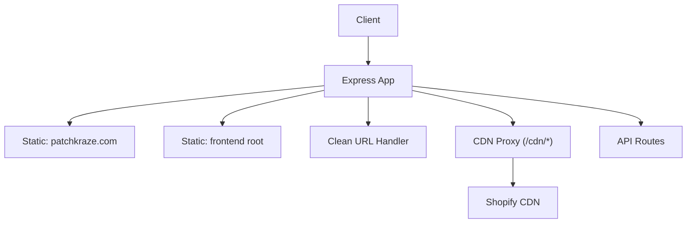
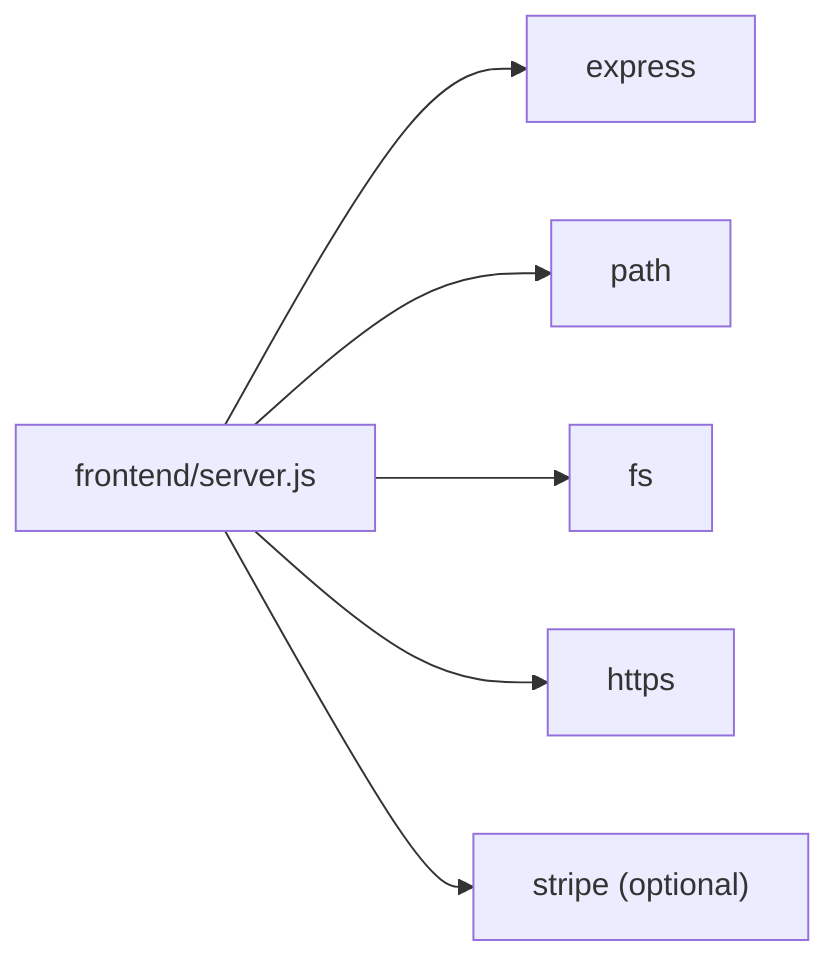

# Direct File Serving

<cite>
**Referenced Files in This Document**
- [server.js](file://frontend/server.js)
- [index.js](file://api/index.js)
- [package.json](file://frontend/package.json)
</cite>

## Table of Contents
1. [Introduction](#introduction)
2. [Project Structure](#project-structure)
3. [Core Components](#core-components)
4. [Architecture Overview](#architecture-overview)
5. [Detailed Component Analysis](#detailed-component-analysis)
6. [Dependency Analysis](#dependency-analysis)
7. [Performance Considerations](#performance-considerations)
8. [Troubleshooting Guide](#troubleshooting-guide)
9. [Conclusion](#conclusion)

## Introduction
This document explains how the application serves static files directly using Express. The server prioritizes files from the patchkraze.com directory as the primary source and falls back to the frontend root for additional assets (notably /cdn/ theme assets). It also covers clean URL mapping to .html pages, MIME type handling via Express’s built-in mechanisms, caching strategies for proxied CDN content, and error handling for missing resources including 404 responses. Guidance is provided for organizing static assets and optimizing performance.

## Project Structure
The server is implemented in a single Node.js file that configures Express middleware and routes:
- Static serving is configured with two roots:
  - Primary: patchkraze.com directory
  - Fallback: frontend root directory (for /cdn/ theme assets)
- A custom route handles clean URLs by mapping paths to .html files or index.html within the patchkraze.com directory.
- A proxy route forwards /cdn/* requests not found locally to Shopify CDN with appropriate headers.
- API endpoints handle Stripe integration and configuration exposure.

**Diagram sources**
- [server.js:46-65](file://frontend/server.js#L46-L65)
- [server.js:92-111](file://frontend/server.js#L92-L111)

**Section sources**
- [server.js:1-123](file://frontend/server.js#L1-L123)
- [package.json:1-19](file://frontend/package.json#L1-L19)

## Core Components
- Express app initialization and JSON parsing middleware.
- Two static file servers:
  - Primary root: patchkraze.com
  - Fallback root: frontend directory
- Clean URL handler that maps routes to .html or index.html files under patchkraze.com.
- CDN proxy for /cdn/* paths not served locally, forwarding to Shopify CDN with caching headers.
- API endpoints for Stripe payment intent creation and publishing key exposure.

Key behaviors:
- File resolution order for clean URLs:
  1) <path>.html
  2) <path>/index.html
  3) <path> (directory listing if enabled; otherwise 404)
- MIME types are determined automatically by Express based on file extensions.
- Caching for proxied CDN content uses a public cache-control header.

**Section sources**
- [server.js:15-48](file://frontend/server.js#L15-L48)
- [server.js:50-65](file://frontend/server.js#L50-L65)
- [server.js:92-111](file://frontend/server.js#L92-L111)

## Architecture Overview
The request flow for static assets and clean URLs:

```mermaid
sequenceDiagram
participant C as "Client"
participant E as "Express"
participant S1 as "Static : patchkraze.com"
participant S2 as "Static : frontend root"
participant H as "Clean URL Handler"
participant P as "CDN Proxy"
participant SC as "Shopify CDN"
C->>E : GET /products/foo
E->>S1 : Try serve "/products/foo"
alt Found in primary
S1-->>C : 200 + HTML
else Not found
E->>H : Route to clean URL handler
H->>H : Check permanent/temporary redirects
H->>H : Try "/products/foo.html"
alt Found
H-->>C : 200 + HTML
else Not found
H->>H : Try "/products/foo/index.html"
alt Found
H-->>C : 200 + HTML
else Not found
H->>H : Try "/products/foo"
alt Found
H-->>C : 200 + HTML
else Not found
H-->>C : 404 Page not found
end
end
end
end
C->>E : GET /cdn/shop/t/38/assets/base.css
E->>S1 : Try serve "/cdn/..."
alt Found locally
S1-->>C : 200 + CSS
else Not found
E->>P : Proxy "/cdn/..."
P->>SC : GET https : //cdn.shopify.com/...
SC-->>P : 200 + Content-Type
P-->>C : 200 + Content-Type + Cache-Control
end
```

**Diagram sources**
- [server.js:46-65](file://frontend/server.js#L46-L65)
- [server.js:92-111](file://frontend/server.js#L92-L111)

## Detailed Component Analysis

### Static File Serving Configuration
- Primary static root: patchkraze.com
- Fallback static root: frontend directory
- Order matters: requests first attempt to serve from patchkraze.com; if not found, Express continues to the next middleware/route, including the fallback static root and subsequent handlers.

Implications:
- All site pages and assets under patchkraze.com take precedence.
- Theme assets referenced via /cdn/ may be served from the frontend root when present locally; otherwise, they are proxied to Shopify CDN.

**Section sources**
- [server.js:46-48](file://frontend/server.js#L46-L48)

### Clean URL Mapping to .html and index.html
- The catch-all route matches any path and attempts to serve:
  1) <path>.html
  2) <path>/index.html
  3) <path> (if it exists as a file)
- Redirect maps support permanent (301) and temporary (302) rewrites for moved or renamed content.

Examples:
- Request to /products/foo resolves to patchkraze.com/products/foo.html if it exists.
- Request to /collections/all resolves to patchkraze.com/collections/all.html or patchkraze.com/collections/all/index.html.

Error handling:
- If none of the candidates exist, a 404 response is sent with a simple HTML page indicating “Page not found” and a link to the home page.

**Section sources**
- [server.js:67-111](file://frontend/server.js#L67-L111)

### MIME Type Handling
- Express determines the Content-Type based on file extensions using its internal mime-types mapping.
- For example:
  - .html → text/html
  - .css → text/css
  - .js → application/javascript
  - .json → application/json
- When proxying CDN content, the original Content-Type from Shopify CDN is forwarded to the client.

Best practices:
- Ensure correct file extensions for all static assets to guarantee proper MIME types.
- Avoid ambiguous filenames without extensions.

**Section sources**
- [server.js:46-48](file://frontend/server.js#L46-L48)
- [server.js:60-63](file://frontend/server.js#L60-L63)

### Caching Strategies
- Local static files served by Express use default caching behavior controlled by the underlying send module. No explicit cache headers are set here.
- Proxied CDN assets under /cdn/* include a public cache-control header with a max-age of one day to encourage browser caching.

Recommendations:
- Consider adding explicit cache headers for long-lived assets (e.g., hashed filenames) to improve caching efficiency.
- Use versioned asset names to leverage strong caching while enabling updates.

**Section sources**
- [server.js:60-63](file://frontend/server.js#L60-L63)

### Error Handling and 404 Responses
- Missing local assets under /cdn/* result in a 404 response when the proxy cannot fetch from Shopify CDN.
- Clean URL requests that do not match any file return a 404 with a minimal HTML page containing a link back to the homepage.

Operational notes:
- Log errors during proxying to aid debugging.
- Keep 404 pages user-friendly and consistent with site branding.

**Section sources**
- [server.js:60-65](file://frontend/server.js#L60-L65)
- [server.js:110-111](file://frontend/server.js#L110-L111)

### API Endpoints (Contextual)
- POST /api/create-payment-intent: Creates a Stripe PaymentIntent with amount validation and metadata support.
- GET /api/stripe-config: Returns the publishable key for client-side initialization.

These endpoints are unrelated to static file serving but coexist in the same Express app.

**Section sources**
- [server.js:17-44](file://frontend/server.js#L17-L44)

## Dependency Analysis
- Express is used for routing, middleware, and static file serving.
- Path and filesystem utilities are used to resolve clean URL candidates.
- HTTPS module is used to proxy CDN requests.
- Optional Stripe SDK is loaded conditionally based on environment variables.

**Diagram sources**
- [server.js:1-9](file://frontend/server.js#L1-L9)
- [package.json:13-17](file://frontend/package.json#L13-L17)

**Section sources**
- [server.js:1-9](file://frontend/server.js#L1-L9)
- [package.json:13-17](file://frontend/package.json#L13-L17)

## Performance Considerations
- Prefer serving assets from patchkraze.com to minimize network hops.
- Use versioned filenames for CSS/JS to enable aggressive caching without invalidation issues.
- Leverage CDN caching for /cdn/* assets; consider increasing max-age for stable assets.
- Minimize dynamic processing for static content; keep Express middleware lean.
- Compress responses at the reverse proxy or hosting layer (e.g., gzip/brotli) if supported.
- Organize assets logically:
  - Site pages and templates under patchkraze.com
  - Theme assets under frontend root (referenced via /cdn/)
  - Shared libraries and third-party assets in dedicated subdirectories

[No sources needed since this section provides general guidance]

## Troubleshooting Guide
Common issues and resolutions:
- 404 for clean URLs:
  - Verify the existence of the corresponding .html or index.html under patchkraze.com.
  - Check redirect mappings for moved or renamed pages.
- Missing /cdn/* assets:
  - Confirm whether the asset exists locally in the frontend root.
  - If not present, ensure Shopify CDN is reachable and returns the expected resource.
- Incorrect MIME types:
  - Ensure files have correct extensions.
  - For proxied assets, verify the upstream Content-Type is preserved.
- Caching problems:
  - Inspect Cache-Control headers on proxied assets.
  - Clear browser cache or use hard refresh to validate updates.

**Section sources**
- [server.js:60-65](file://frontend/server.js#L60-L65)
- [server.js:92-111](file://frontend/server.js#L92-L111)

## Conclusion
The application uses a straightforward and effective approach to serve static files:
- Prioritize patchkraze.com as the primary source for all site content.
- Fall back to the frontend root for theme assets and other resources.
- Map clean URLs to .html files and index.html pages with robust fallback logic.
- Handle MIME types automatically and set appropriate cache headers for proxied CDN content.
- Provide clear 404 responses for missing resources.

By organizing assets thoughtfully and following best practices for caching and compression, the site can deliver fast, reliable performance across environments.

[No sources needed since this section summarizes without analyzing specific files]