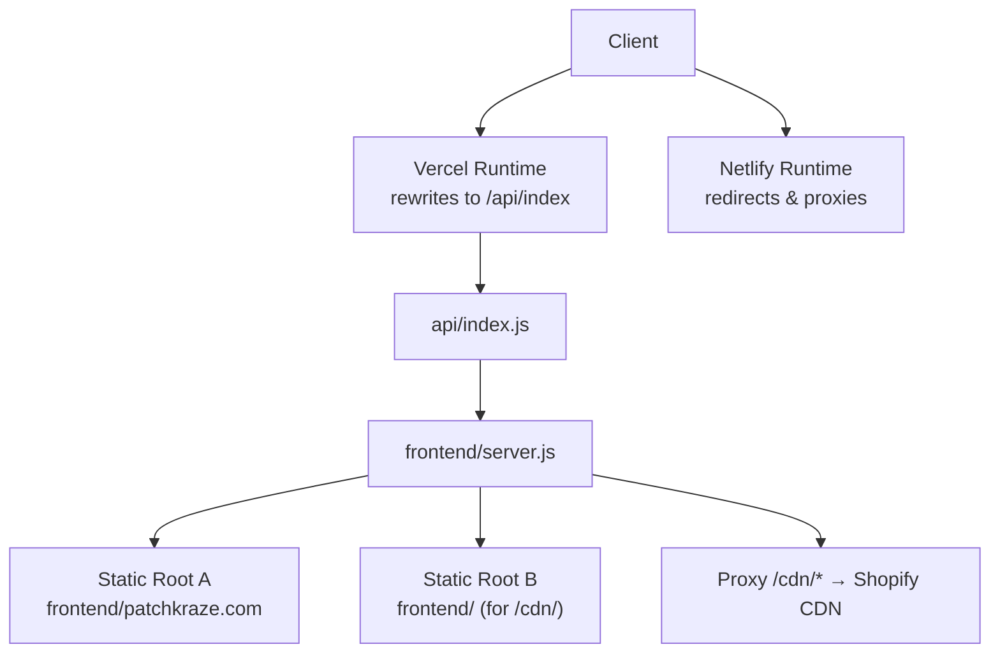
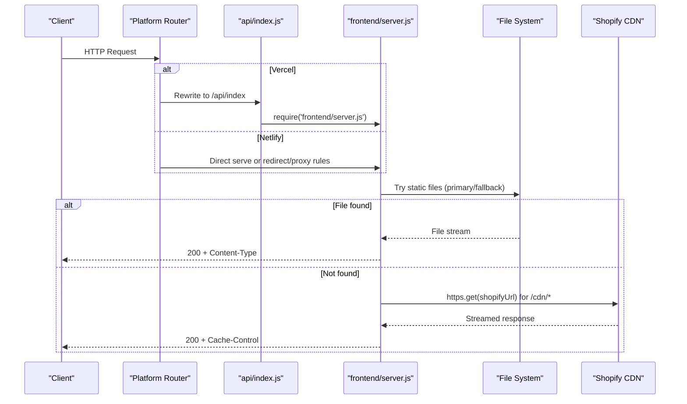
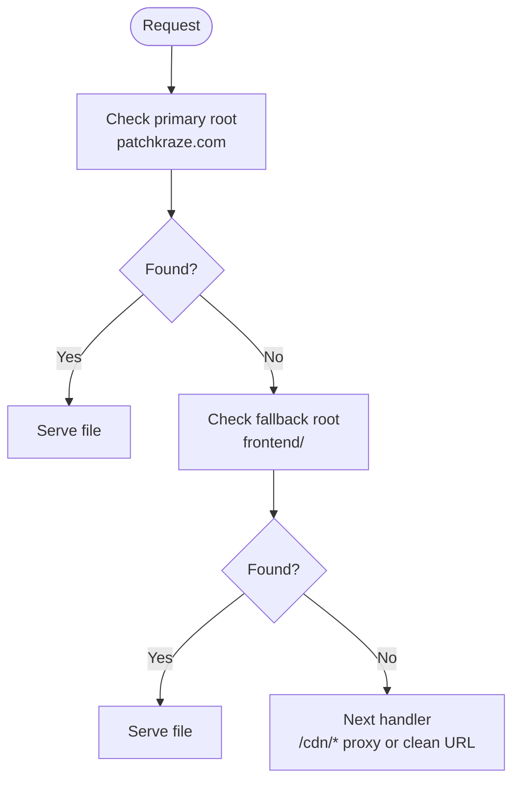
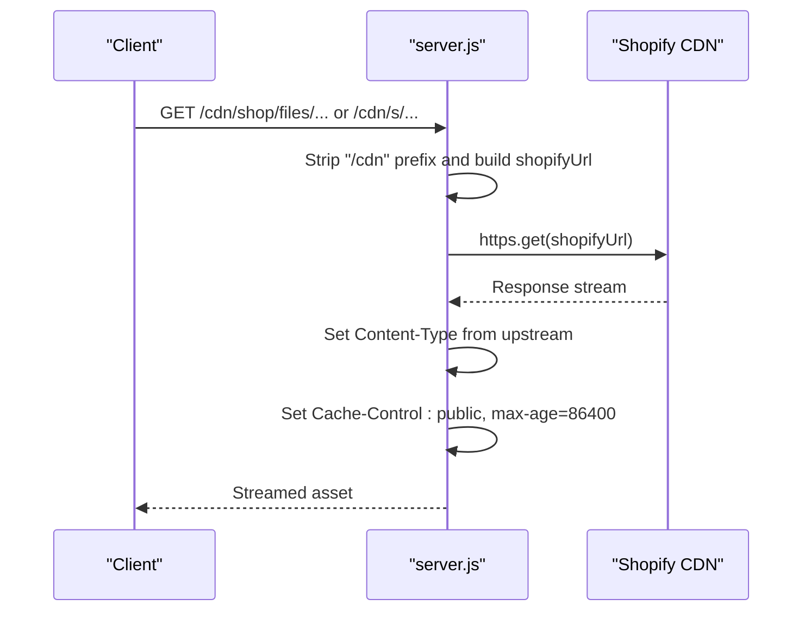
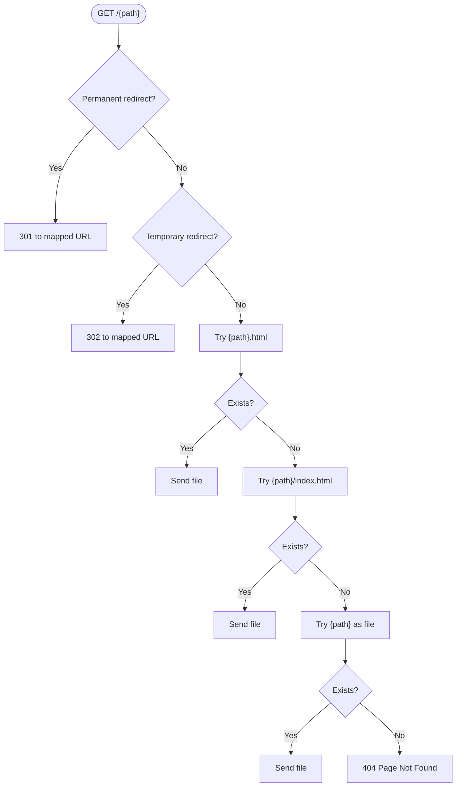
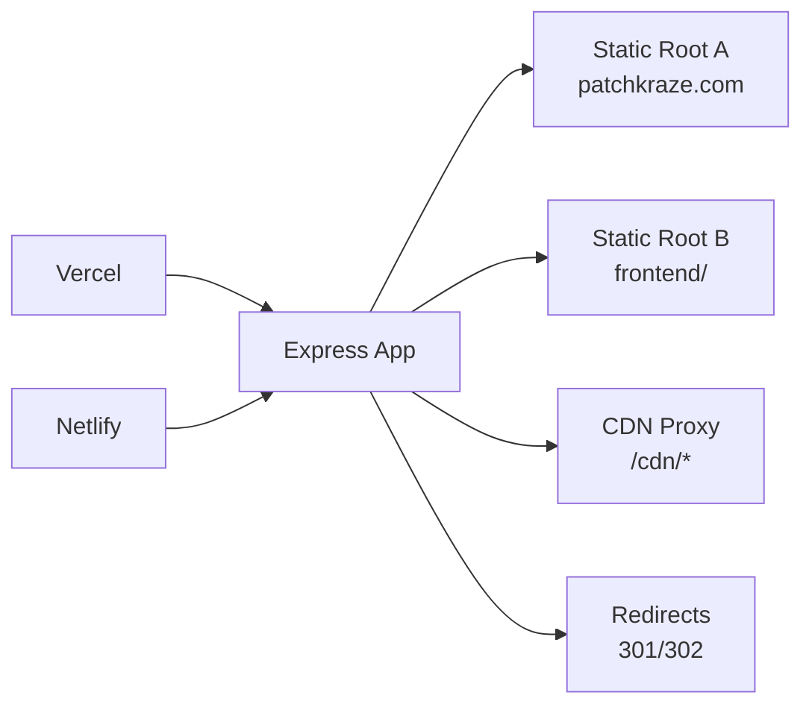

# Static File Serving

<cite>
**Referenced Files in This Document**
- [server.js](file://frontend/server.js)
- [index.js](file://api/index.js)
- [vercel.json](file://vercel.json)
- [netlify.toml](file://netlify.toml)
- [robots.txt](file://frontend/patchkraze.com/robots.txt)
- [package.json](file://frontend/package.json)
</cite>

## Table of Contents
1. [Introduction](#introduction)
2. [Project Structure](#project-structure)
3. [Core Components](#core-components)
4. [Architecture Overview](#architecture-overview)
5. [Detailed Component Analysis](#detailed-component-analysis)
6. [Dependency Analysis](#dependency-analysis)
7. [Performance Considerations](#performance-considerations)
8. [Troubleshooting Guide](#troubleshooting-guide)
9. [Conclusion](#conclusion)

## Introduction
This document explains the static file serving architecture for the site, focusing on:
- Dual static file serving strategy using the patchkraze.com directory as primary and the frontend root as fallback (for CDN assets).
- CDN proxy implementation for Shopify assets with path rewriting and header management.
- URL routing system that serves clean URLs by mapping to .html files and index.html pages.
- Redirect handling for permanent (301) and temporary (302) redirects, SEO considerations, and performance optimization strategies.

## Project Structure
The application is a Node.js Express server that serves static content from two roots:
- Primary: frontend/patchkraze.com (contains HTML pages, robots.txt, and local CDN mirrors).
- Fallback: frontend root (used for /cdn/ theme assets when not present under patchkraze.com).

Routing and configuration are provided by:
- Express middleware and handlers in server.js.
- Platform-specific rewrites and redirects in vercel.json and netlify.toml.
- API entrypoint aliasing via api/index.js.

**Diagram sources**
- [vercel.json:1-12](file://vercel.json#L1-L12)
- [netlify.toml:1-165](file://netlify.toml#L1-L165)
- [index.js:1-1](file://api/index.js#L1-L1)
- [server.js:46-65](file://frontend/server.js#L46-L65)

**Section sources**
- [server.js:1-123](file://frontend/server.js#L1-L123)
- [vercel.json:1-12](file://vercel.json#L1-L12)
- [netlify.toml:1-165](file://netlify.toml#L1-L165)
- [index.js:1-1](file://api/index.js#L1-L1)

## Core Components
- Dual static roots: The server first serves from patchkraze.com, then falls back to the frontend root for /cdn/ assets.
- CDN proxy: Requests to /cdn/* are proxied to Shopify CDN with path rewriting and cache headers.
- Clean URL routing: A catch-all route maps clean URLs to .html or index.html files.
- Redirects: Permanent (301) and temporary (302) redirects are handled both in code and platform configs.
- SEO: robots.txt controls crawler access; sitemaps are referenced.

**Section sources**
- [server.js:46-111](file://frontend/server.js#L46-L111)
- [netlify.toml:8-165](file://netlify.toml#L8-L165)
- [robots.txt:1-190](file://frontend/patchkraze.com/robots.txt#L1-L190)

## Architecture Overview
The request flow differs by deployment platform but converges on the same Express app.

**Diagram sources**
- [vercel.json:9-11](file://vercel.json#L9-L11)
- [index.js:1-1](file://api/index.js#L1-L1)
- [server.js:46-65](file://frontend/server.js#L46-L65)
- [server.js:92-111](file://frontend/server.js#L92-L111)

## Detailed Component Analysis

### Dual Static File Serving Strategy
- Primary root: frontend/patchkraze.com is served first for all paths.
- Fallback root: frontend root is served next, enabling /cdn/ theme assets to be resolved from the project’s cdn folder when present locally.

Behavior:
- express.static(ROOT) runs before express.static(__dirname), ensuring patchkraze.com takes precedence.
- If a path exists under the primary root, it is served directly.
- Otherwise, the fallback root is checked (useful for /cdn/shop/t/... theme assets).

**Diagram sources**
- [server.js:46-48](file://frontend/server.js#L46-L48)

**Section sources**
- [server.js:46-48](file://frontend/server.js#L46-L48)

### CDN Proxy Implementation for Shopify Assets
- Path: /cdn/*
- Rewriting:
  - For /cdn/shop/files/*, the path is rewritten to Shopify’s files endpoint with shop ID embedded.
  - For other /cdn/* paths, the remainder is appended to https://cdn.shopify.com.
- Headers:
  - Content-Type is forwarded from Shopify’s response.
  - Cache-Control is set to public with a one-day max-age for caching.
- Error handling:
  - On proxy errors, returns 404.

**Diagram sources**
- [server.js:50-65](file://frontend/server.js#L50-L65)

**Section sources**
- [server.js:50-65](file://frontend/server.js#L50-L65)

### URL Routing System for Clean URLs
- Catch-all route handles /{*splat}.
- Redirect checks:
  - Permanent redirects (301) for moved/renamed resources.
  - Temporary redirects (302) for placeholder or transitional pages.
- File resolution order:
  1) <path>.html
  2) <path>/index.html
  3) <path> (if it is a file)
- If none match, returns a simple 404 page.

**Diagram sources**
- [server.js:67-111](file://frontend/server.js#L67-L111)

**Section sources**
- [server.js:67-111](file://frontend/server.js#L67-L111)

### Redirect Handling (301 and 302)
- In-code redirects:
  - Permanent (301): Moved products, collections, policies.
  - Temporary (302): Placeholder pages pointing to blog posts or contact/policies.
- Platform-level redirects:
  - Netlify defines explicit 301/302 rules for product/collection/page moves and clean URL mappings.
  - Vercel rewrites all requests to the function, where the same logic applies.

SEO implications:
- Use 301 for permanent moves to preserve link equity.
- Use 302 for temporary transitions to avoid passing full ranking signals.

**Section sources**
- [server.js:67-99](file://frontend/server.js#L67-L99)
- [netlify.toml:8-122](file://netlify.toml#L8-L122)
- [vercel.json:9-11](file://vercel.json#L9-L11)

### SEO Considerations
- robots.txt:
  - Disallows sensitive areas (checkout, carts, orders, admin-like paths).
  - Disallows parameterized collection/blog URLs to prevent duplicate content.
  - Points to sitemap at https://patchkraze.com/sitemap.xml.
- Clean URLs:
  - Ensures canonical, crawlable URLs without query parameters.
- Redirects:
  - Consolidate duplicate or legacy URLs via 301 to maintain SEO value.

**Section sources**
- [robots.txt:17-63](file://frontend/patchkraze.com/robots.txt#L17-L63)
- [server.js:92-111](file://frontend/server.js#L92-L111)

## Dependency Analysis
- Runtime dependencies:
  - express: HTTP server and middleware.
  - stripe: Payment intent creation (not part of static serving but included).
  - dotenv: Optional environment loading for local development.
- Platform integrations:
  - Vercel: Rewrites all routes to /api/index, which requires the Express app.
  - Netlify: Uses declarative redirects and proxies for CDN and clean URLs.

**Diagram sources**
- [package.json:13-17](file://frontend/package.json#L13-L17)
- [vercel.json:4-11](file://vercel.json#L4-L11)
- [netlify.toml:93-165](file://netlify.toml#L93-L165)
- [server.js:46-111](file://frontend/server.js#L46-L111)

**Section sources**
- [package.json:1-19](file://frontend/package.json#L1-L19)
- [vercel.json:1-12](file://vercel.json#L1-L12)
- [netlify.toml:1-165](file://netlify.toml#L1-L165)
- [server.js:1-123](file://frontend/server.js#L1-L123)

## Performance Considerations
- Caching:
  - CDN proxy sets Cache-Control: public, max-age=86400 for Shopify assets to enable browser and edge caching.
- Static serving:
  - Using two static roots reduces network calls by serving local copies when available.
- Platform optimizations:
  - Netlify/Vercel provide edge caching and fast static delivery.
  - Netlify’s force=true ensures CDN proxies bypass local files when needed.
- Asset organization:
  - Keeping frequently accessed assets (e.g., theme JS/CSS) under frontend/cdn minimizes latency.
- Avoid unnecessary processing:
  - Keep middleware minimal; rely on platform rewrites for routing efficiency.

[No sources needed since this section provides general guidance]

## Troubleshooting Guide
Common issues and resolutions:
- 404 on clean URLs:
  - Ensure the corresponding .html or index.html exists under patchkraze.com.
  - Verify redirect mappings if the URL has changed.
- CDN assets returning 404:
  - Confirm the path rewrite matches Shopify’s expected structure.
  - Check network logs for upstream errors from Shopify CDN.
- Redirect loops:
  - Review both in-code and platform-level redirect rules to ensure they do not conflict.
- Environment variables:
  - Stripe keys are optional; missing keys will cause payment endpoints to return errors.

**Section sources**
- [server.js:50-65](file://frontend/server.js#L50-L65)
- [server.js:92-111](file://frontend/server.js#L92-L111)
- [netlify.toml:135-165](file://netlify.toml#L135-L165)

## Conclusion
The static file serving architecture combines a dual-root strategy, a robust CDN proxy, and flexible routing to deliver clean URLs and reliable asset delivery across platforms. Redirects are implemented consistently in code and platform configurations to support SEO and user experience. With appropriate caching and platform features, the setup achieves efficient, scalable delivery of static content while maintaining flexibility for future changes.