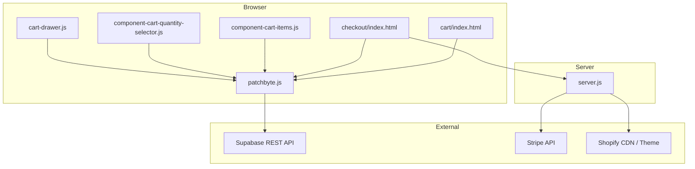
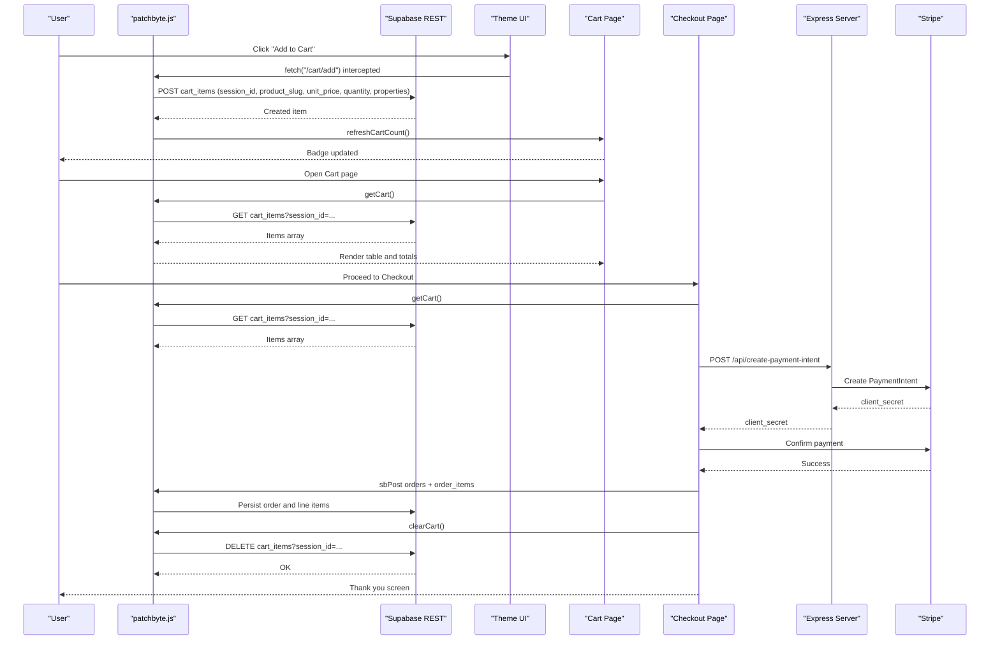
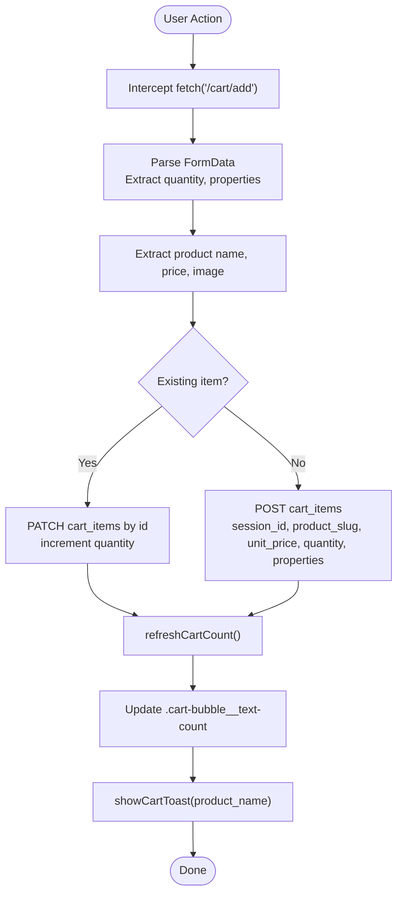
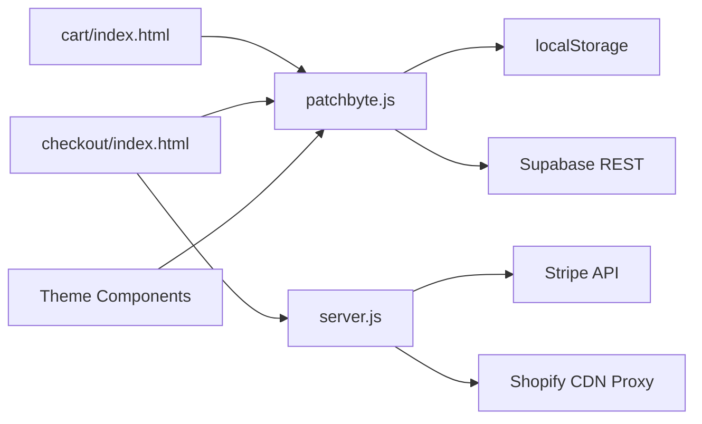

# Cart System Implementation

<cite>
**Referenced Files in This Document**
- [patchbyte.js](file://frontend/js/patchbyte.js)
- [cart/index.html](file://frontend/patchkraze.com/cart/index.html)
- [checkout/index.html](file://frontend/patchkraze.com/checkout/index.html)
- [server.js](file://frontend/server.js)
- [index.js](file://api/index.js)
- [component-cart-items.js](file://frontend/cdn/shop/t/38/assets/component-cart-items.js)
- [component-cart-quantity-selector.js](file://frontend/cdn/shop/t/38/assets/component-cart-quantity-selector.js)
- [cart-drawer.js](file://frontend/cdn/shop/t/38/assets/cart-drawer.js)
</cite>

## Table of Contents
1. [Introduction](#introduction)
2. [Project Structure](#project-structure)
3. [Core Components](#core-components)
4. [Architecture Overview](#architecture-overview)
5. [Detailed Component Analysis](#detailed-component-analysis)
6. [Dependency Analysis](#dependency-analysis)
7. [Performance Considerations](#performance-considerations)
8. [Troubleshooting Guide](#troubleshooting-guide)
9. [Conclusion](#conclusion)
10. [Appendices](#appendices)

## Introduction
This document explains the Patch-Byte cart system that provides session-based cart management with localStorage persistence and Supabase for cross-device synchronization. It covers how Shopify-style interactions are intercepted, how cart items are created, updated, and removed, and how UI components react to state changes. It also documents integration with Shopify product data, handling of custom properties, real-time-like synchronization via REST calls, and error handling for network failures and data conflicts.

## Project Structure
The cart system spans a small set of focused files:
- A client-side script intercepts Shopify fetch calls and routes them to Supabase for cart operations.
- Custom cart and checkout pages render the cart using the patched API surface.
- The Express server serves static pages and proxies CDN assets; it also exposes Stripe endpoints used during checkout.
- Theme components handle UI events and partial updates within the Shopify theme context.

**Diagram sources**
- [patchbyte.js:1-345](file://frontend/js/patchbyte.js#L1-L345)
- [cart/index.html:1-186](file://frontend/patchkraze.com/cart/index.html#L1-L186)
- [checkout/index.html:1-358](file://frontend/patchkraze.com/checkout/index.html#L1-L358)
- [server.js:1-123](file://frontend/server.js#L1-L123)
- [component-cart-items.js:1-342](file://frontend/cdn/shop/t/38/assets/component-cart-items.js#L1-L342)
- [component-cart-quantity-selector.js:1-48](file://frontend/cdn/shop/t/38/assets/component-cart-quantity-selector.js#L1-L48)
- [cart-drawer.js:1-53](file://frontend/cdn/shop/t/38/assets/cart-drawer.js#L1-L53)

**Section sources**
- [patchbyte.js:1-345](file://frontend/js/patchbyte.js#L1-L345)
- [server.js:1-123](file://frontend/server.js#L1-L123)

## Core Components
- Session and persistence:
  - A stable session ID is stored in localStorage and used to associate cart items across devices via Supabase.
- Supabase REST helpers:
  - Generic GET, POST, PATCH, DELETE wrappers call Supabase’s REST endpoint with appropriate headers.
- Cart CRUD:
  - Add-to-cart merges quantities when the same product slug exists in the session.
  - Update quantity supports increment/decrement and removal (zero quantity).
  - Clear cart deletes all items for the current session.
- Fetch interception:
  - Shopify-style add-to-cart requests are intercepted, parsed, and persisted to Supabase.
  - Requests for cart.json or cart.js return a minimal structure including the session token and item count.
- UI badge and toast:
  - After mutations, the cart badge is refreshed by counting items from Supabase.
  - A toast notification confirms successful adds.
- Checkout flow:
  - Loads cart items, computes totals, creates a Stripe PaymentIntent via the server, and on success persists order and order items to Supabase, then clears the cart.

**Section sources**
- [patchbyte.js:19-136](file://frontend/js/patchbyte.js#L19-L136)
- [patchbyte.js:138-233](file://frontend/js/patchbyte.js#L138-L233)
- [patchbyte.js:235-342](file://frontend/js/patchbyte.js#L235-L342)
- [checkout/index.html:161-354](file://frontend/patchkraze.com/checkout/index.html#L161-L354)

## Architecture Overview
The system uses a lightweight client-side interceptor to bridge Shopify’s expected cart behavior with a Supabase-backed store. The server hosts static pages and proxies CDN assets, while exposing Stripe endpoints for payment processing.

**Diagram sources**
- [patchbyte.js:74-111](file://frontend/js/patchbyte.js#L74-L111)
- [patchbyte.js:142-163](file://frontend/js/patchbyte.js#L142-L163)
- [patchbyte.js:165-233](file://frontend/js/patchbyte.js#L165-L233)
- [checkout/index.html:200-354](file://frontend/patchkraze.com/checkout/index.html#L200-L354)
- [server.js:17-44](file://frontend/server.js#L17-L44)

## Detailed Component Analysis

### Client-Side Cart Engine (patchbyte.js)
Responsibilities:
- Session management via localStorage.
- Supabase REST helpers for GET, POST, PATCH, DELETE.
- Cart CRUD functions: getCart, addToCart, updateCartItem, clearCart.
- Fetch interception to translate Shopify-style requests into Supabase operations.
- UI updates: badge refresh, toast notifications, and cart icon redirection.
- Public API exposed as window.PatchByte for use by cart and checkout pages.

Key behaviors:
- Adding an item checks for existing session+product_slug and increments quantity if found; otherwise inserts a new row with properties.
- Updating quantity removes the item when quantity becomes zero.
- Cart JSON responses include a token equal to the session ID and computed item_count.
- Product image is captured from DOM or meta tags and stored in properties under a reserved key.

Error handling:
- Network errors during add-to-cart return a 422 response with an error message.
- Badge refresh silently catches errors to avoid breaking UI.

**Section sources**
- [patchbyte.js:19-65](file://frontend/js/patchbyte.js#L19-L65)
- [patchbyte.js:67-136](file://frontend/js/patchbyte.js#L67-L136)
- [patchbyte.js:138-233](file://frontend/js/patchbyte.js#L138-L233)
- [patchbyte.js:265-342](file://frontend/js/patchbyte.js#L265-L342)

#### Class and Data Flow Diagram

**Diagram sources**
- [patchbyte.js:142-163](file://frontend/js/patchbyte.js#L142-L163)
- [patchbyte.js:165-233](file://frontend/js/patchbyte.js#L165-L233)
- [patchbyte.js:115-136](file://frontend/js/patchbyte.js#L115-L136)

### Cart Page (cart/index.html)
Responsibilities:
- Load cart items via window.PatchByte.getCart().
- Render items with images, properties, prices, and totals.
- Handle quantity changes (+/-) and remove actions by calling window.PatchByte.updateCartItem(id, newQty).
- Display empty state and total summary.

Event-driven updates:
- On any mutation, re-renders the cart table and recalculates totals.

**Section sources**
- [cart/index.html:95-182](file://frontend/patchkraze.com/cart/index.html#L95-L182)

### Checkout Page (checkout/index.html)
Responsibilities:
- Load cart items and compute order total.
- Initialize Stripe Elements using a publishable key from the server and a client secret from a PaymentIntent.
- Validate form fields and submit payment.
- On success, persist order and order_items to Supabase via window.PatchByte.sbPost, then clear the cart.

Error handling:
- Displays user-friendly errors for missing fields, payment issues, or configuration problems.
- Disables submit button during processing and restores it on failure.

**Section sources**
- [checkout/index.html:161-354](file://frontend/patchkraze.com/checkout/index.html#L161-L354)

### Express Server (server.js)
Responsibilities:
- Serve static site files from patchkraze.com.
- Proxy Shopify CDN assets via /cdn/* to ensure theme assets load correctly.
- Provide Stripe endpoints:
  - POST /api/create-payment-intent to create a PaymentIntent with metadata including session_id.
  - GET /api/stripe-config to expose the publishable key to the frontend.

Redirects:
- Permanent and temporary redirects for moved or missing content.

**Section sources**
- [server.js:1-123](file://frontend/server.js#L1-L123)

### Theme Integration (component-cart-items.js, component-cart-quantity-selector.js, cart-drawer.js)
- component-cart-items.js listens for cart and discount events, debounces quantity changes, and triggers section morphing to update UI after server responses.
- component-cart-quantity-selector.js adapts max limits for cart contexts and manages button states dynamically.
- cart-drawer.js opens automatically on add-to-cart events when configured.

These components integrate with the PatchByte interception layer because they rely on standard Shopify endpoints that are overridden by patchbyte.js.

**Section sources**
- [component-cart-items.js:1-342](file://frontend/cdn/shop/t/38/assets/component-cart-items.js#L1-L342)
- [component-cart-quantity-selector.js:1-48](file://frontend/cdn/shop/t/38/assets/component-cart-quantity-selector.js#L1-L48)
- [cart-drawer.js:1-53](file://frontend/cdn/shop/t/38/assets/cart-drawer.js#L1-L53)

## Dependency Analysis
- patchbyte.js depends on:
  - localStorage for session persistence.
  - Supabase REST API for all cart operations.
  - DOM APIs to extract product metadata and update UI elements.
- cart/index.html and checkout/index.html depend on window.PatchByte public API.
- server.js depends on:
  - Stripe SDK (optional, guarded by environment variable).
  - File system for serving static pages.
  - HTTPS module for proxying Shopify CDN assets.
- Theme components depend on Shopify theme utilities and event system; their behavior is preserved but underlying data source is replaced by Supabase via fetch interception.

**Diagram sources**
- [patchbyte.js:19-65](file://frontend/js/patchbyte.js#L19-L65)
- [server.js:17-65](file://frontend/server.js#L17-L65)
- [component-cart-items.js:1-342](file://frontend/cdn/shop/t/38/assets/component-cart-items.js#L1-L342)

**Section sources**
- [patchbyte.js:19-65](file://frontend/js/patchbyte.js#L19-L65)
- [server.js:1-123](file://frontend/server.js#L1-L123)

## Performance Considerations
- Minimize redundant reads:
  - Badge refresh aggregates item counts from a single getCart call.
- Debounced updates:
  - Theme components debounce quantity changes to reduce network chatter.
- Efficient rendering:
  - Cart page renders only necessary rows and calculates totals in a single pass.
- CDN proxy caching:
  - Server sets cache headers when proxying Shopify assets to improve load times.

[No sources needed since this section provides general guidance]

## Troubleshooting Guide
Common issues and remedies:
- Add-to-cart fails:
  - Check browser console for errors returned by Supabase or network failures.
  - Ensure the product page contains required metadata (title, price, image).
- Cart not updating:
  - Verify that fetch interception is active and not blocked by ad blockers or CSP.
  - Confirm that session ID exists in localStorage.
- Checkout payment errors:
  - Ensure Stripe keys are configured on the server and that the PaymentIntent creation succeeds.
  - Validate that required shipping and contact fields are filled before submission.
- Data conflicts:
  - If multiple tabs modify the same cart, last-write-wins applies due to direct REST calls; consider adding optimistic UI and conflict resolution if needed.

**Section sources**
- [patchbyte.js:227-233](file://frontend/js/patchbyte.js#L227-L233)
- [checkout/index.html:260-350](file://frontend/patchkraze.com/checkout/index.html#L260-L350)

## Conclusion
Patch-Byte’s cart system replaces Shopify’s default cart backend with a Supabase-backed store while preserving the familiar Shopify interaction model through fetch interception. It provides robust session-based persistence, cross-device synchronization, and a clean separation between UI and data. The design enables easy extension for additional features such as discounts, coupons, or advanced analytics without altering the theme significantly.

[No sources needed since this section summarizes without analyzing specific files]

## Appendices

### Cart Item Data Model
- Fields commonly used:
  - session_id: string (from localStorage)
  - product_slug: string
  - product_name: string
  - unit_price: number
  - quantity: integer
  - properties: object (includes custom properties plus reserved keys like _image)

[No sources needed since this section describes conceptual schema derived from usage]

### Example Operations
- Add product:
  - Triggered by clicking “Add to Cart” on a product page; intercepted by patchbyte.js and persisted to Supabase.
- Update quantity:
  - In the cart page, clicking +/- calls updateCartItem with the new quantity; zero removes the item.
- Remove item:
  - Same as setting quantity to zero; handled by updateCartItem.
- Clear cart:
  - Called after successful checkout to delete all items for the session.

**Section sources**
- [patchbyte.js:74-111](file://frontend/js/patchbyte.js#L74-L111)
- [cart/index.html:159-182](file://frontend/patchkraze.com/cart/index.html#L159-L182)
- [checkout/index.html:309-338](file://frontend/patchkraze.com/checkout/index.html#L309-L338)