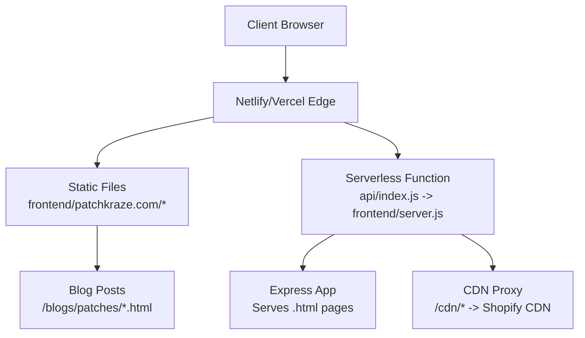
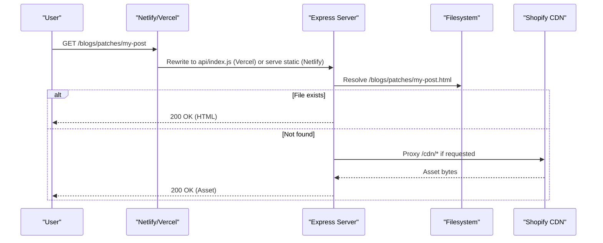
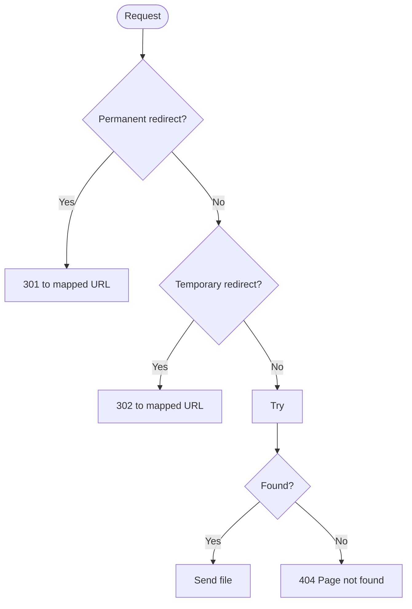
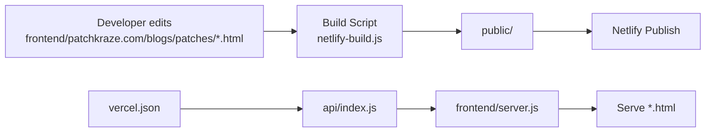
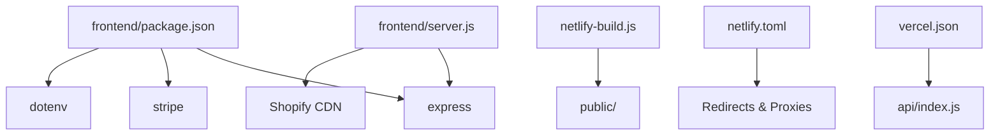

# Blog System

<cite>
**Referenced Files in This Document**
- [server.js](file://frontend/server.js)
- [netlify-build.js](file://netlify-build.js)
- [netlify.toml](file://netlify.toml)
- [vercel.json](file://vercel.json)
- [index.js](file://api/index.js)
- [package.json](file://frontend/package.json)
- [custom-embroidered-patches-vs-pvc-patches-which-type-is-right-for-your-needs.html](file://frontend/patchkraze.com/blogs/patches/custom-embroidered-patches-vs-pvc-patches-which-type-is-right-for-your-needs.html)
- [how-to-design-custom-patches-complete-guide-from-concept-to-production.html](file://frontend/patchkraze.com/blogs/patches/how-to-design-custom-patches-complete-guide-from-concept-to-production.html)
- [the-complete-guide-to-heat-pressing-custom-patches-temperature-time-techniques.html](file://frontend/patchkraze.com/blogs/patches/the-complete-guide-to-heat-pressing-custom-patches-temperature-time-techniques.html)
</cite>

## Table of Contents
1. [Introduction](#introduction)
2. [Project Structure](#project-structure)
3. [Core Components](#core-components)
4. [Architecture Overview](#architecture-overview)
5. [Detailed Component Analysis](#detailed-component-analysis)
6. [Dependency Analysis](#dependency-analysis)
7. [Performance Considerations](#performance-considerations)
8. [Troubleshooting Guide](#troubleshooting-guide)
9. [Conclusion](#conclusion)
10. [Appendices](#appendices)

## Introduction
This document explains how the Patch-Byte blog system is structured and deployed as a static site. It focuses on educational content about patches and manufacturing processes, the blog post format, SEO optimization (meta tags and canonical URLs), and how content under /blogs/patches/ integrates with the build and deployment pipeline. It also outlines the content creation workflow from Shopify to deployed pages and provides examples of existing posts covering custom patch design, heat pressing techniques, and material comparisons.

## Project Structure
The blog content is delivered as prebuilt HTML files under frontend/patchkraze.com/blogs/patches/. A Node server serves these files locally and proxies CDN assets back to Shopify when needed. Build scripts copy the necessary assets into a public folder for Netlify, while Vercel rewrites requests through a minimal API entry that delegates to the same server.

**Diagram sources**
- [netlify-build.js:1-28](file://netlify-build.js#L1-L28)
- [netlify.toml:1-165](file://netlify.toml#L1-L165)
- [vercel.json:1-12](file://vercel.json#L1-L12)
- [index.js:1-1](file://api/index.js#L1-L1)
- [server.js:46-65](file://frontend/server.js#L46-L65)
- [server.js:92-111](file://frontend/server.js#L92-L111)

**Section sources**
- [netlify-build.js:1-28](file://netlify-build.js#L1-L28)
- [netlify.toml:1-165](file://netlify.toml#L1-L165)
- [vercel.json:1-12](file://vercel.json#L1-L12)
- [server.js:46-65](file://frontend/server.js#L46-L65)
- [server.js:92-111](file://frontend/server.js#L92-L111)

## Core Components
- Static blog posts: Each article is a self-contained HTML file under /blogs/patches/, including meta tags, canonical links, and theme assets.
- Local server: Express app serves static files and proxies missing CDN assets to Shopify.
- Build script: Copies site assets into a deployable public directory for Netlify.
- Deployment configs: Netlify and Vercel configurations define redirects, clean URL handling, and function routing.

Key responsibilities:
- Serve /blogs/patches/<slug>.html via clean URLs (/blogs/patches/<slug>).
- Ensure SEO metadata is present in each post.
- Provide reliable asset delivery by proxying Shopify CDN paths.

**Section sources**
- [server.js:46-65](file://frontend/server.js#L46-L65)
- [server.js:92-111](file://frontend/server.js#L92-L111)
- [netlify-build.js:16-27](file://netlify-build.js#L16-L27)
- [netlify.toml:93-122](file://netlify.toml#L93-L122)
- [vercel.json:1-12](file://vercel.json#L1-L12)

## Architecture Overview
The blog system is a static site generator output served by a lightweight server. Content authors create or update HTML posts in the blogs directory; the build process copies them into the publishable output. The server resolves clean URLs to .html files and proxies any missing CDN resources to Shopify.

**Diagram sources**
- [vercel.json:4-11](file://vercel.json#L4-L11)
- [index.js:1-1](file://api/index.js#L1-L1)
- [server.js:46-65](file://frontend/server.js#L46-L65)
- [server.js:92-111](file://frontend/server.js#L92-L111)

## Detailed Component Analysis

### Blog Post Format and SEO
Each blog post is a complete HTML document with:
- Language and viewport settings
- Open Graph and Twitter card meta tags for social sharing
- Canonical link pointing to the clean URL path
- Theme styles and fonts loaded from Shopify CDN or local cache
- Minimal inline theme configuration indicating an “article” template

SEO highlights:
- og:title, og:description, og:url set per post
- twitter:card, twitter:title, twitter:description set per post
- rel=canonical points to the slug-based URL under /blogs/patches/

Example posts:
- Material comparison: embroidered vs PVC
- Design guide: concept to production
- Heat pressing guide: temperature, time, techniques

These posts demonstrate consistent structure and SEO markup across topics.

**Section sources**
- [custom-embroidered-patches-vs-pvc-patches-which-type-is-right-for-your-needs.html:1-80](file://frontend/patchkraze.com/blogs/patches/custom-embroidered-patches-vs-pvc-patches-which-type-is-right-for-your-needs.html#L1-L80)
- [how-to-design-custom-patches-complete-guide-from-concept-to-production.html:1-80](file://frontend/patchkraze.com/blogs/patches/how-to-design-custom-patches-complete-guide-from-concept-to-production.html#L1-L80)
- [the-complete-guide-to-heat-pressing-custom-patches-temperature-time-techniques.html:1-80](file://frontend/patchkraze.com/blogs/patches/the-complete-guide-to-heat-pressing-custom-patches-temperature-time-techniques.html#L1-L80)

### Clean URL Routing and Redirects
The server maps clean URLs to actual .html files and supports temporary redirects for legacy page paths to new blog posts.

Routing behavior:
- Requests to /blogs/patches/<slug> resolve to /blogs/patches/<slug>.html
- Legacy /pages/* paths are redirected to the appropriate blog post or policy page
- Permanent redirects handle renamed product pages

**Diagram sources**
- [server.js:67-111](file://frontend/server.js#L67-L111)

**Section sources**
- [server.js:67-111](file://frontend/server.js#L67-L111)
- [netlify.toml:8-122](file://netlify.toml#L8-L122)

### CDN Asset Proxying
When a requested asset is not available locally, the server proxies it from Shopify’s CDN. This ensures images, fonts, and theme scripts load correctly even if only a subset of assets is published.

Proxy rules:
- /cdn/shop/files/* maps to Shopify files CDN
- Other /cdn/* paths map to corresponding Shopify CDN endpoints
- Cache headers are set for performance

**Section sources**
- [server.js:46-65](file://frontend/server.js#L46-L65)
- [netlify.toml:135-165](file://netlify.toml#L135-L165)

### Build and Deployment Pipeline
- Netlify: Runs a Node script to copy site assets into public/ and publishes that folder. Includes clean URL redirects and CDN proxies.
- Vercel: Rewrites all routes to a serverless function that exports the Express app, serving the same static files and logic.

**Diagram sources**
- [netlify-build.js:16-27](file://netlify-build.js#L16-L27)
- [netlify.toml:1-3](file://netlify.toml#L1-L3)
- [vercel.json:4-11](file://vercel.json#L4-L11)
- [index.js:1-1](file://api/index.js#L1-L1)
- [server.js:46-65](file://frontend/server.js#L46-L65)

**Section sources**
- [netlify-build.js:16-27](file://netlify-build.js#L16-L27)
- [netlify.toml:1-3](file://netlify.toml#L1-L3)
- [vercel.json:4-11](file://vercel.json#L4-L11)
- [index.js:1-1](file://api/index.js#L1-L1)

### Content Creation Workflow (Shopify to Deployed Pages)
While the repository contains the final static outputs, the observed pattern indicates:
- Content originates from Shopify (theme templates and assets referenced in posts).
- Posts are authored or exported as HTML files under /blogs/patches/.
- The build step copies these files into the publishable output.
- Deployment platforms serve the static files and apply redirects/proxies.

Practical steps inferred from the codebase:
- Create or update HTML files in frontend/patchkraze.com/blogs/patches/.
- Ensure each post includes proper meta tags and canonical URLs.
- Run the build script (or rely on platform CI) to generate the public folder.
- Deploy to Netlify or Vercel using the provided configurations.

Note: No explicit Shopify export tool is present in this repository; the presence of Shopify CDN references and redirects suggests integration at the platform level or via external tooling.

**Section sources**
- [netlify-build.js:16-27](file://netlify-build.js#L16-L27)
- [netlify.toml:93-122](file://netlify.toml#L93-L122)
- [server.js:46-65](file://frontend/server.js#L46-L65)

## Dependency Analysis
- Runtime dependencies: Express, Stripe (for payments), dotenv (local dev).
- Platform integrations: Netlify build script and redirects; Vercel serverless function routing.
- External dependencies: Shopify CDN for assets and theme scripts.

**Diagram sources**
- [package.json:13-17](file://frontend/package.json#L13-L17)
- [server.js:46-65](file://frontend/server.js#L46-L65)
- [netlify-build.js:16-27](file://netlify-build.js#L16-L27)
- [netlify.toml:93-165](file://netlify.toml#L93-L165)
- [vercel.json:4-11](file://vercel.json#L4-L11)

**Section sources**
- [package.json:13-17](file://frontend/package.json#L13-L17)
- [server.js:46-65](file://frontend/server.js#L46-L65)
- [netlify-build.js:16-27](file://netlify-build.js#L16-L27)
- [netlify.toml:93-165](file://netlify.toml#L93-L165)
- [vercel.json:4-11](file://vercel.json#L4-L11)

## Performance Considerations
- Static HTML delivery reduces server load and improves Time to First Byte.
- CDN proxying centralizes asset caching with Shopify’s global network.
- Preload hints for critical CSS and fonts improve perceived performance.
- Clean URLs avoid duplicate content and help search engines index the correct version.

[No sources needed since this section provides general guidance]

## Troubleshooting Guide
Common issues and resolutions:
- 404 on blog post: Ensure the file exists as <slug>.html under /blogs/patches/ and that clean URL redirects are configured.
- Missing images or fonts: Verify CDN proxy rules and that Shopify CDN is reachable; check Netlify/Vercel redirects for /cdn/* paths.
- Old page links broken: Use the temporary/permanent redirect mappings to route legacy URLs to updated blog posts or policies.

Validation tips:
- Confirm canonical URLs match the intended slug.
- Inspect meta tags for og:title, og:description, and twitter:card.
- Test both clean URLs and .html variants to ensure routing works on your platform.

**Section sources**
- [server.js:67-111](file://frontend/server.js#L67-L111)
- [netlify.toml:8-122](file://netlify.toml#L8-L122)
- [netlify.toml:135-165](file://netlify.toml#L135-L165)

## Conclusion
Patch-Byte’s blog system delivers high-quality educational content as static HTML with robust SEO and reliable asset delivery. The combination of a simple Express server, platform-specific build and redirect configurations, and consistent post formatting ensures fast, maintainable, and discoverable content under /blogs/patches/. Existing posts cover practical topics such as material comparisons, design workflows, and heat pressing techniques, demonstrating a clear and repeatable content model.

[No sources needed since this section summarizes without analyzing specific files]

## Appendices

### Example Blog Posts
- Material comparison: Custom Embroidered Patches vs PVC Patches
  - Path: [custom-embroidered-patches-vs-pvc-patches-which-type-is-right-for-your-needs.html](file://frontend/patchkraze.com/blogs/patches/custom-embroidered-patches-vs-pvc-patches-which-type-is-right-for-your-needs.html)
- Design guide: How to Design Custom Patches (Concept to Production)
  - Path: [how-to-design-custom-patches-complete-guide-from-concept-to-production.html](file://frontend/patchkraze.com/blogs/patches/how-to-design-custom-patches-complete-guide-from-concept-to-production.html)
- Heat pressing guide: Temperature, Time, Techniques
  - Path: [the-complete-guide-to-heat-pressing-custom-patches-temperature-time-techniques.html](file://frontend/patchkraze.com/blogs/patches/the-complete-guide-to-heat-pressing-custom-patches-temperature-time-techniques.html)

[No sources needed since this section lists existing files already referenced above]