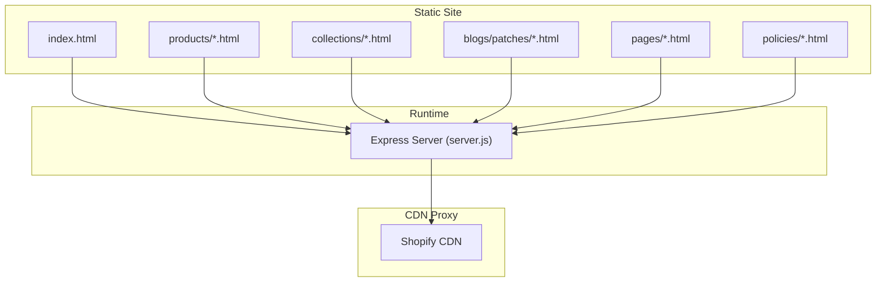
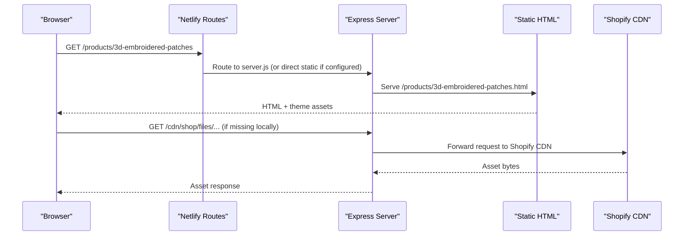
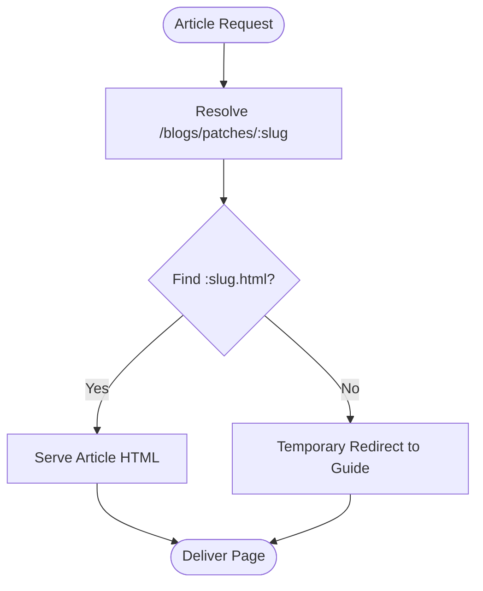
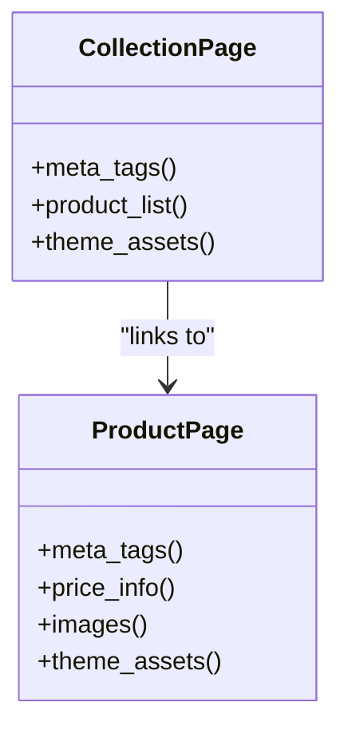
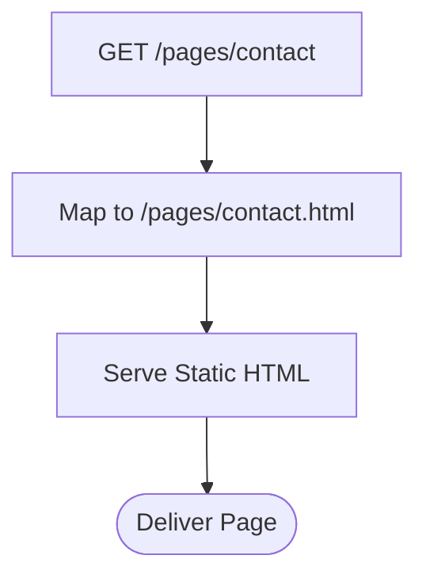
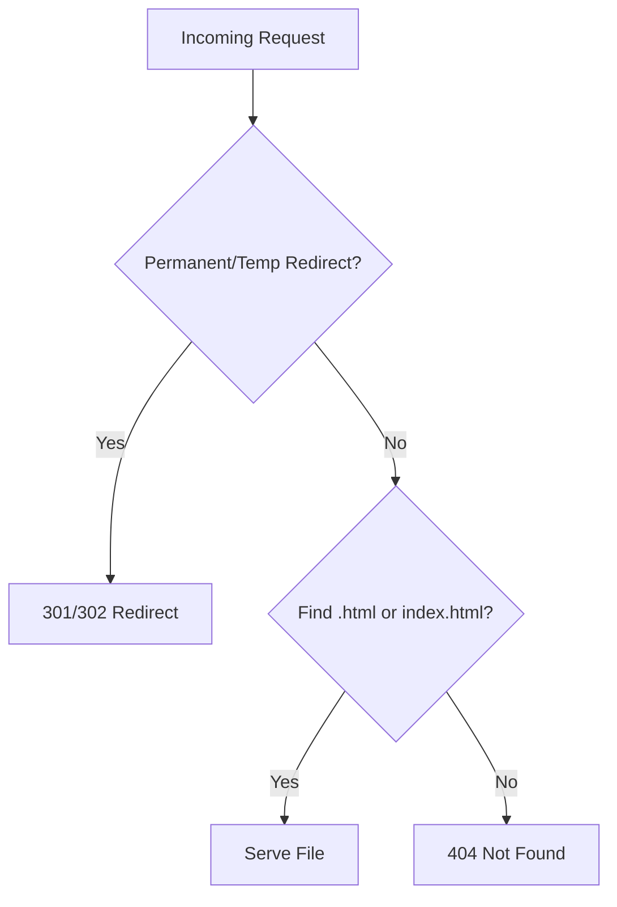
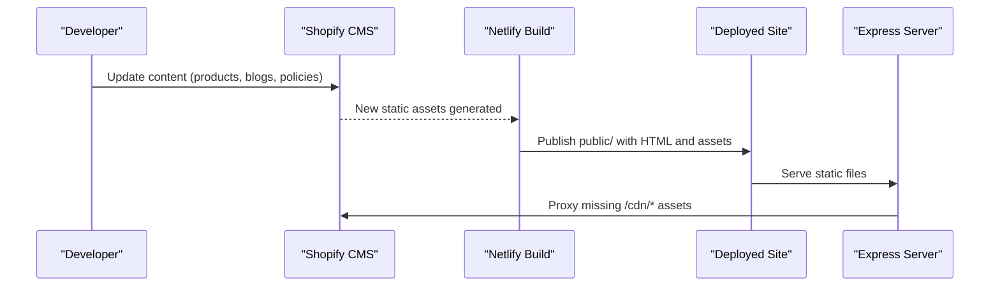
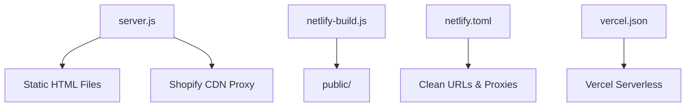

# Content Management

<cite>
**Referenced Files in This Document**
- [server.js](file://frontend/server.js)
- [index.html](file://frontend/patchkraze.com/index.html)
- [all.html](file://frontend/patchkraze.com/collections/all.html)
- [3d-embroidered-patches.html](file://frontend/patchkraze.com/products/3d-embroidered-patches.html)
- [contact.html](file://frontend/patchkraze.com/pages/contact.html)
- [privacy-policy.html](file://frontend/patchkraze.com/policies/privacy-policy.html)
- [custom-embroidered-patches-vs-pvc-patches-which-type-is-right-for-your-needs.html](file://frontend/patchkraze.com/blogs/patches/custom-embroidered-patches-vs-pvc-patches-which-type-is-right-for-your-needs.html)
- [vercel.json](file://frontend/vercel.json)
- [netlify.toml](file://netlify.toml)
- [netlify-build.js](file://netlify-build.js)
- [inject-patchbyte.ps1](file://inject-patchbyte.ps1)
- [fix-urls.ps1](file://fix-urls.ps1)
- [seed-products.ps1](file://seed-products.ps1)
</cite>

## Table of Contents
1. [Introduction](#introduction)
2. [Project Structure](#project-structure)
3. [Core Components](#core-components)
4. [Architecture Overview](#architecture-overview)
5. [Detailed Component Analysis](#detailed-component-analysis)
6. [Dependency Analysis](#dependency-analysis)
7. [Performance Considerations](#performance-considerations)
8. [Troubleshooting Guide](#troubleshooting-guide)
9. [Conclusion](#conclusion)
10. [Appendices](#appendices)

## Introduction
This document explains the Patch-Byte platform’s hybrid content management approach that combines Shopify as the content and commerce source with a static site generation workflow to deliver a fast, SEO-friendly frontend. The system renders static HTML for products, collections, blog posts, policies, and informational pages. A lightweight Node server serves these files locally or on Vercel, while Netlify handles build-time asset preparation and CDN proxying. The result is a stable, cacheable site where content originates from Shopify but is served as prebuilt HTML for performance and reliability.

## Project Structure
The repository organizes content as static HTML under a dedicated folder, with a small runtime server and build scripts to prepare assets for deployment. Key areas:
- Static site root: contains index, products, collections, blogs, pages, and policies folders with .html files
- Server: Express-based server serving static files, handling clean URLs, redirects, and Stripe endpoints
- Build and deploy: Netlify build script copies assets; Netlify routes handle clean URLs and CDN proxies; Vercel config exports the server for serverless hosting

**Diagram sources**
- [server.js:46-65](file://frontend/server.js#L46-L65)
- [index.html:1-80](file://frontend/patchkraze.com/index.html#L1-L80)

**Section sources**
- [server.js:1-123](file://frontend/server.js#L1-L123)
- [index.html:1-80](file://frontend/patchkraze.com/index.html#L1-L80)

## Core Components
- Static HTML pages: Each product, collection, blog post, policy, and page is a self-contained HTML file with meta tags, canonical links, and theme assets.
- Express server: Serves static files, maps clean URLs to .html files, proxies missing CDN assets back to Shopify, and exposes payment-related endpoints.
- Build and routing configuration: Netlify build script prepares the public directory; Netlify routes implement clean URL mapping and CDN proxies; Vercel config exports the server for serverless environments.

Key responsibilities:
- Clean URL resolution: /products/foo → serve foo.html or foo/index.html
- Redirects: permanent and temporary mappings for moved or renamed content
- CDN proxy: /cdn/* requests are forwarded to Shopify CDN when not present locally
- Payment integration: Stripe endpoint creates payment intents and exposes publishable key

**Section sources**
- [server.js:17-44](file://frontend/server.js#L17-L44)
- [server.js:67-111](file://frontend/server.js#L67-L111)
- [netlify.toml:94-165](file://netlify.toml#L94-L165)
- [vercel.json:1-20](file://frontend/vercel.json#L1-L20)

## Architecture Overview
The hybrid architecture uses Shopify as the content and commerce backend. A build process generates static HTML pages that include meta tags, Open Graph data, and theme assets. The runtime server serves these files directly and proxies any missing CDN resources to Shopify. Netlify performs build-time asset copying and provides routing rules for clean URLs and CDN proxies. Vercel can host the same server for serverless deployments.

**Diagram sources**
- [server.js:46-65](file://frontend/server.js#L46-L65)
- [server.js:92-111](file://frontend/server.js#L92-L111)
- [netlify.toml:94-165](file://netlify.toml#L94-L165)

## Detailed Component Analysis

### Blog System Structure
The blog section hosts educational content about patches and manufacturing processes. Each article is a standalone HTML file under blogs/patches with complete metadata, canonical URLs, and theme assets.

- Example article: custom-embroidered-patches-vs-pvc-patches-which-type-is-right-for-your-needs.html
  - Contains Open Graph and Twitter card meta tags
  - Sets canonical URL to the blog path
  - Includes theme styles and scripts via CDN references

**Diagram sources**
- [server.js:79-90](file://frontend/server.js#L79-L90)
- [custom-embroidered-patches-vs-pvc-patches-which-type-is-right-for-your-needs.html:1-80](file://frontend/patchkraze.com/blogs/patches/custom-embroidered-patches-vs-pvc-patches-which-type-is-right-for-your-needs.html#L1-L80)

**Section sources**
- [custom-embroidered-patches-vs-pvc-patches-which-type-is-right-for-your-needs.html:1-80](file://frontend/patchkraze.com/blogs/patches/custom-embroidered-patches-vs-pvc-patches-which-type-is-right-for-your-needs.html#L1-L80)
- [server.js:79-90](file://frontend/server.js#L79-L90)

### Product Catalog Organization and Display
Products are organized into collections and individual product pages. Collections aggregate related items; each product page includes rich metadata and pricing information.

- Collection listing: all.html demonstrates the main product catalog view with meta tags and theme assets
- Product detail: 3d-embroidered-patches.html includes Open Graph product type, price metadata, and canonical URL

**Diagram sources**
- [all.html:1-80](file://frontend/patchkraze.com/collections/all.html#L1-L80)
- [3d-embroidered-patches.html:1-100](file://frontend/patchkraze.com/products/3d-embroidered-patches.html#L1-L100)

**Section sources**
- [all.html:1-80](file://frontend/patchkraze.com/collections/all.html#L1-L80)
- [3d-embroidered-patches.html:1-100](file://frontend/patchkraze.com/products/3d-embroidered-patches.html#L1-L100)

### Policy Pages and Informational Content
Policy and informational pages are static HTML files with proper meta tags and canonical URLs. Contact and privacy policy pages follow the same structure as other content types.

- Contact page: contact.html includes meta tags and canonical link
- Privacy policy: privacy-policy.html includes meta tags and canonical link

**Diagram sources**
- [contact.html:1-80](file://frontend/patchkraze.com/pages/contact.html#L1-L80)
- [privacy-policy.html:1-80](file://frontend/patchkraze.com/policies/privacy-policy.html#L1-L80)

**Section sources**
- [contact.html:1-80](file://frontend/patchkraze.com/pages/contact.html#L1-L80)
- [privacy-policy.html:1-80](file://frontend/patchkraze.com/policies/privacy-policy.html#L1-L80)

### SEO Optimization Techniques
SEO is implemented through consistent use of meta tags, canonical URLs, and structured Open Graph/Twitter cards across all pages.

- Meta tags: description, og:title, og:description, twitter:title, twitter:description
- Canonical links: set per page to avoid duplicate content issues
- Open Graph and Twitter cards: provide rich previews on social platforms

Examples:
- Index page meta and OG tags
- Product page OG product type and price metadata
- Blog article OG article type and description

**Section sources**
- [index.html:1-80](file://frontend/patchkraze.com/index.html#L1-L80)
- [3d-embroidered-patches.html:1-100](file://frontend/patchkraze.com/products/3d-embroidered-patches.html#L1-L100)
- [custom-embroidered-patches-vs-pvc-patches-which-type-is-right-for-your-needs.html:1-80](file://frontend/patchkraze.com/blogs/patches/custom-embroidered-patches-vs-pvc-patches-which-type-is-right-for-your-needs.html#L1-L80)

### URL Routing and Clean URLs
The server and Netlify routes ensure clean URLs map to static HTML files and handle redirects for moved or renamed content.

- Clean URL handler: resolves /products/foo to foo.html or foo/index.html
- Permanent redirects: for renamed products and collections
- Temporary redirects: for migrated or placeholder pages
- Netlify clean URL rules: map slugs to .html files for products, collections, pages, blogs, and policies

**Diagram sources**
- [server.js:67-111](file://frontend/server.js#L67-L111)
- [netlify.toml:94-123](file://netlify.toml#L94-L123)

**Section sources**
- [server.js:67-111](file://frontend/server.js#L67-L111)
- [netlify.toml:94-123](file://netlify.toml#L94-L123)

### Content Update Workflow
Content updates originate from Shopify and are reflected in the static site through a build and deployment process.

- Build step: Netlify executes netlify-build.js to copy HTML pages, theme assets, fonts, and scripts into the public directory
- CDN proxying: Netlify routes proxy /cdn/* paths to Shopify CDN for assets not included locally
- Local development: Express server serves static files and proxies missing CDN assets to Shopify
- Post-processing scripts: PowerShell utilities inject scripts, fix URLs, and seed product data to external systems

**Diagram sources**
- [netlify-build.js:1-28](file://netlify-build.js#L1-L28)
- [netlify.toml:135-165](file://netlify.toml#L135-L165)
- [server.js:46-65](file://frontend/server.js#L46-L65)

**Section sources**
- [netlify-build.js:1-28](file://netlify-build.js#L1-L28)
- [netlify.toml:135-165](file://netlify.toml#L135-L165)
- [server.js:46-65](file://frontend/server.js#L46-L65)

## Dependency Analysis
The runtime depends on static HTML files and optional CDN assets. Build-time dependencies include Node.js and file system operations to prepare the public directory. Deployment configurations define how routes and assets are handled.

**Diagram sources**
- [server.js:46-65](file://frontend/server.js#L46-L65)
- [netlify-build.js:16-27](file://netlify-build.js#L16-L27)
- [netlify.toml:94-165](file://netlify.toml#L94-L165)
- [vercel.json:1-20](file://frontend/vercel.json#L1-L20)

**Section sources**
- [server.js:46-65](file://frontend/server.js#L46-L65)
- [netlify-build.js:16-27](file://netlify-build.js#L16-L27)
- [netlify.toml:94-165](file://netlify.toml#L94-L165)
- [vercel.json:1-20](file://frontend/vercel.json#L1-L20)

## Performance Considerations
- Static HTML delivery reduces server load and improves Time to First Byte
- Preloading critical CSS and fonts accelerates rendering
- CDN proxying ensures assets are cached at edge locations
- Clean URLs and redirects prevent unnecessary requests and improve crawl efficiency
- Avoiding dynamic rendering keeps pages cacheable and fast

[No sources needed since this section provides general guidance]

## Troubleshooting Guide
Common issues and resolutions:
- Missing CDN assets: Ensure /cdn/* proxy routes are active in Netlify or server-side proxy is enabled
- Clean URL errors: Verify Netlify routes map slugs to .html files and server fallback logic is correct
- Redirect loops: Check permanent and temporary redirect mappings for conflicts
- Build failures: Confirm netlify-build.js copies required directories and excludes nested cdn folders appropriately
- Script injection: Use provided PowerShell script to inject analytics or tracking scripts into HTML files

**Section sources**
- [server.js:46-65](file://frontend/server.js#L46-L65)
- [server.js:67-111](file://frontend/server.js#L67-L111)
- [netlify.toml:94-165](file://netlify.toml#L94-L165)
- [netlify-build.js:16-27](file://netlify-build.js#L16-L27)
- [inject-patchbyte.ps1:1-23](file://inject-patchbyte.ps1#L1-L23)
- [fix-urls.ps1:1-24](file://fix-urls.ps1#L1-L24)

## Conclusion
Patch-Byte’s hybrid content management leverages Shopify as the content source while delivering a high-performance static frontend. The combination of prebuilt HTML, clean URL routing, CDN proxying, and robust build/deploy configuration ensures reliable, SEO-optimized pages for products, collections, blogs, policies, and informational content. The workflow supports efficient updates and maintains fast load times through caching and edge distribution.

[No sources needed since this section summarizes without analyzing specific files]

## Appendices

### Content Types and Examples
- Products: Individual HTML pages with product-specific metadata and pricing
- Collections: Aggregated listings with shared theme assets
- Blogs: Educational articles with structured metadata
- Policies: Legal and informational pages with canonical URLs
- Pages: Contact and other informational content

**Section sources**
- [3d-embroidered-patches.html:1-100](file://frontend/patchkraze.com/products/3d-embroidered-patches.html#L1-L100)
- [all.html:1-80](file://frontend/patchkraze.com/collections/all.html#L1-L80)
- [custom-embroidered-patches-vs-pvc-patches-which-type-is-right-for-your-needs.html:1-80](file://frontend/patchkraze.com/blogs/patches/custom-embroidered-patches-vs-pvc-patches-which-type-is-right-for-your-needs.html#L1-L80)
- [contact.html:1-80](file://frontend/patchkraze.com/pages/contact.html#L1-L80)
- [privacy-policy.html:1-80](file://frontend/patchkraze.com/policies/privacy-policy.html#L1-L80)

### Utility Scripts
- Inject scripts into HTML files for analytics or tracking
- Fix absolute URLs to relative paths for local development
- Seed product data to external databases for search or inventory systems

**Section sources**
- [inject-patchbyte.ps1:1-23](file://inject-patchbyte.ps1#L1-L23)
- [fix-urls.ps1:1-24](file://fix-urls.ps1#L1-L24)
- [seed-products.ps1:1-87](file://seed-products.ps1#L1-L87)