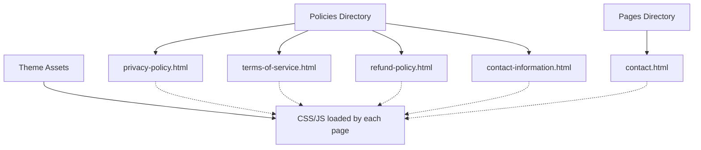
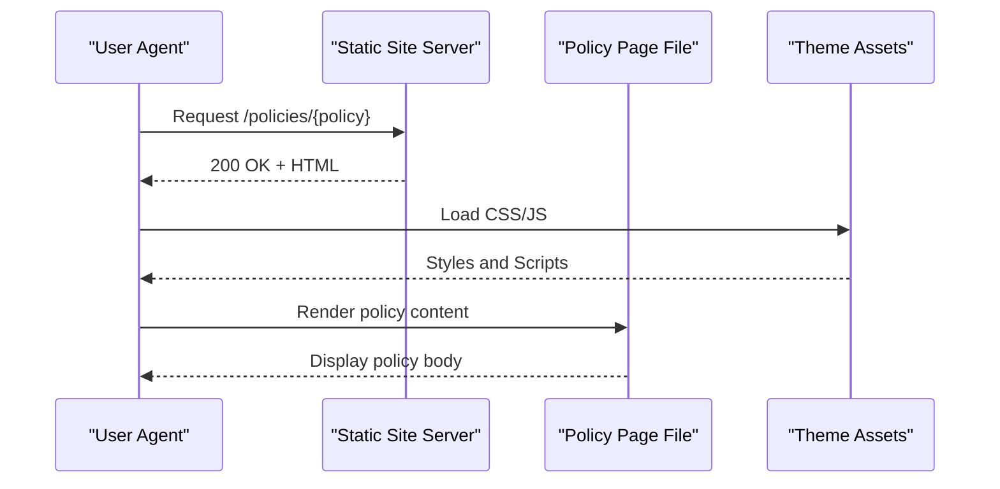
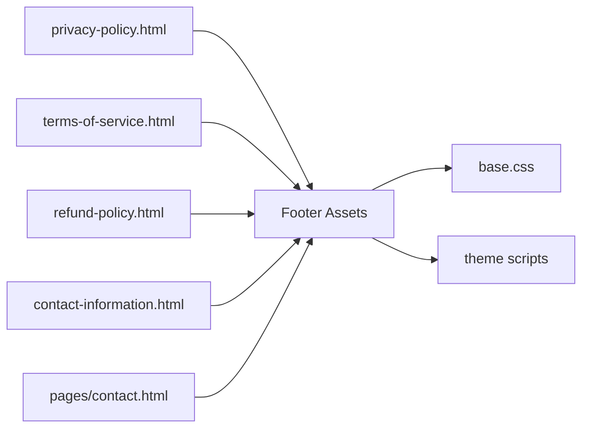
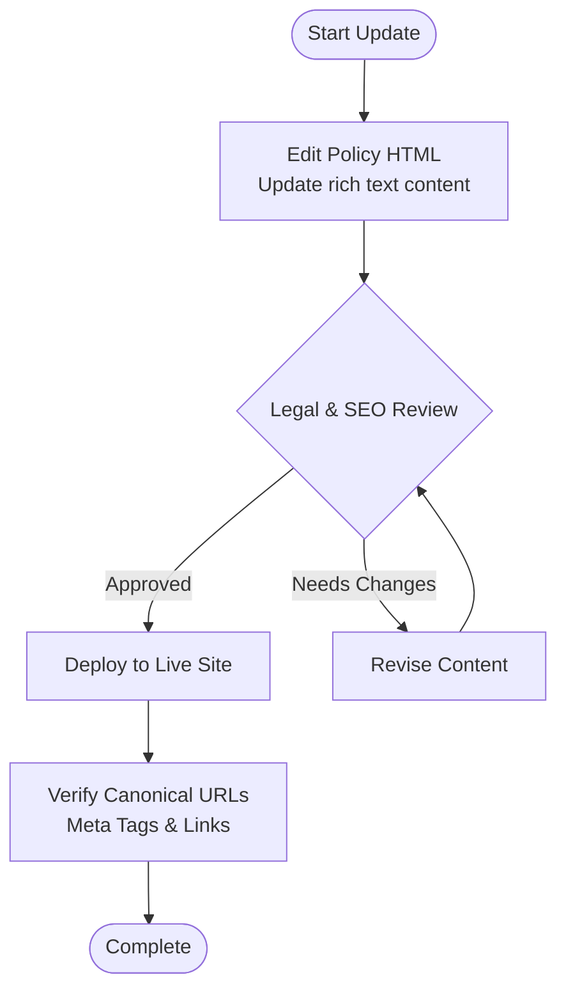

# Policy Pages Management

<cite>
**Referenced Files in This Document**
- [privacy-policy.html](file://frontend/patchkraze.com/policies/privacy-policy.html)
- [terms-of-service.html](file://frontend/patchkraze.com/policies/terms-of-service.html)
- [refund-policy.html](file://frontend/patchkraze.com/policies/refund-policy.html)
- [contact-information.html](file://frontend/patchkraze.com/policies/contact-information.html)
- [contact.html](file://frontend/patchkraze.com/pages/contact.html)
</cite>

## Table of Contents
1. Introduction
2. Project Structure
3. Core Components
4. Architecture Overview
5. Detailed Component Analysis
6. Dependency Analysis
7. Performance Considerations
8. Troubleshooting Guide
9. Conclusion
10. Appendices

## Introduction
This document explains how legal and informational policy pages are structured and maintained on the Patch-Byte platform (Patch Kraft). It covers standard policy templates, content management workflow, SEO considerations for legal content, deployment to the live site, and best practices for keeping policies accurate and compliant.

## Project Structure
Policy pages are implemented as static HTML files under a dedicated policies directory. Each policy has its own file with consistent structure:
- Standardized head section with meta tags, canonical URL, Open Graph/Twitter cards, and theme assets
- A main content area that renders the policy body using a rich text container
- Shared header and footer sections across all pages

**Diagram sources**
- [privacy-policy.html:1-120](file://frontend/patchkraze.com/policies/privacy-policy.html#L1-L120)
- [terms-of-service.html:1-120](file://frontend/patchkraze.com/policies/terms-of-service.html#L1-L120)
- [refund-policy.html:1-120](file://frontend/patchkraze.com/policies/refund-policy.html#L1-L120)
- [contact-information.html:1-120](file://frontend/patchkraze.com/policies/contact-information.html#L1-L120)
- [contact.html:1-120](file://frontend/patchkraze.com/pages/contact.html#L1-L120)

**Section sources**
- [privacy-policy.html:1-120](file://frontend/patchkraze.com/policies/privacy-policy.html#L1-L120)
- [terms-of-service.html:1-120](file://frontend/patchkraze.com/policies/terms-of-service.html#L1-L120)
- [refund-policy.html:1-120](file://frontend/patchkraze.com/policies/refund-policy.html#L1-L120)
- [contact-information.html:1-120](file://frontend/patchkraze.com/policies/contact-information.html#L1-L120)
- [contact.html:1-120](file://frontend/patchkraze.com/pages/contact.html#L1-L120)

## Core Components
- Policy template shell: Each policy file includes a consistent head block with SEO metadata, canonical link, and theme resources. The main content is rendered inside a policy-specific container and rich text area.
- Rich text content area: The policy body is placed within a rich text container, enabling structured headings, lists, links, and paragraphs.
- Footer navigation: All policy pages share a footer that includes links to other policies and store info, ensuring discoverability and cross-linking.

Key structural elements observed:
- Canonical URLs set per policy page
- Open Graph and Twitter card metadata for social sharing
- Theme styles and scripts preloaded for performance
- Main content wrapped in a policy container with title and body regions

**Section sources**
- [privacy-policy.html:34-73](file://frontend/patchkraze.com/policies/privacy-policy.html#L34-L73)
- [terms-of-service.html:34-73](file://frontend/patchkraze.com/policies/terms-of-service.html#L34-L73)
- [refund-policy.html:34-73](file://frontend/patchkraze.com/policies/refund-policy.html#L34-L73)
- [contact-information.html:34-73](file://frontend/patchkraze.com/policies/contact-information.html#L34-L73)
- [privacy-policy.html:2244-2352](file://frontend/patchkraze.com/policies/privacy-policy.html#L2244-L2352)
- [terms-of-service.html:2244-2256](file://frontend/patchkraze.com/policies/terms-of-service.html#L2244-L2256)
- [refund-policy.html:2244-2352](file://frontend/patchkraze.com/policies/refund-policy.html#L2244-L2352)
- [contact-information.html:2244-2352](file://frontend/patchkraze.com/policies/contact-information.html#L2244-L2352)

## Architecture Overview
The policy pages follow a simple, static architecture:
- Each policy is a self-contained HTML file served from the policies directory
- They share common theme assets (CSS/JS) loaded via the theme’s asset pipeline
- Content is authored directly in the HTML within a rich text container
- Footer provides consistent navigation to related policies and support pages

[No sources needed since this diagram shows conceptual workflow, not actual code structure]

## Detailed Component Analysis

### Privacy Policy
- Purpose: Describes data collection, usage, disclosure, rights, and contact information.
- Structure: Title section followed by a rich text body containing sections such as personal information categories, sources, uses, disclosures, Shopify relationship, third-party sites, children’s data, security/retention, user rights, complaints, international transfers, changes, and contact details.
- SEO: Includes canonical URL and social media meta tags; title reflects “Privacy policy”.

Best practices applied:
- Clear section headings for readability and compliance
- Explicit last-updated date
- Links to opt-out and privacy portals where applicable

**Section sources**
- [privacy-policy.html:2244-2352](file://frontend/patchkraze.com/policies/privacy-policy.html#L2244-L2352)
- [privacy-policy.html:34-73](file://frontend/patchkraze.com/policies/privacy-policy.html#L34-L73)

### Terms of Service
- Purpose: Defines user obligations, account access, product descriptions, orders, pricing/shipping, intellectual property, third-party tools/links, Shopify relationship, privacy policy reference, feedback terms, errors/omissions, prohibited uses, termination, warranties/liability disclaimers, indemnification, severability, governing law, and contact information.
- Structure: Numbered sections with clear headings and comprehensive coverage of legal aspects.
- SEO: Canonical URL and social media meta tags present; title reflects “Terms of service”.

Best practices applied:
- Comprehensive legal coverage with explicit sections
- Cross-references to privacy policy and refund policy
- Contact information included at the end

**Section sources**
- [terms-of-service.html:2244-2256](file://frontend/patchkraze.com/policies/terms-of-service.html#L2244-L2256)
- [terms-of-service.html:34-73](file://frontend/patchkraze.com/policies/terms-of-service.html#L34-L73)

### Refund Policy
- Purpose: Outlines return/exchange eligibility, timeframes, conditions, shipping responsibilities, and contact instructions.
- Structure: Title and rich text body organized into logical sections covering policy scope, eligible items, non-returnable items, process steps, and contact details.
- SEO: Canonical URL and social media meta tags present; title reflects “Refund policy”.

Best practices applied:
- Clear eligibility criteria and step-by-step instructions
- Consistent formatting for readability and compliance

**Section sources**
- [refund-policy.html:2244-2352](file://frontend/patchkraze.com/policies/refund-policy.html#L2244-L2352)
- [refund-policy.html:34-73](file://frontend/patchkraze.com/policies/refund-policy.html#L34-L73)

### Contact Information
- Purpose: Provides official contact channels, addresses, hours, and support options.
- Structure: Title and rich text body listing contact methods and locations.
- SEO: Canonical URL and social media meta tags present; title reflects “Contact information”.

Best practices applied:
- Centralized contact details for consistency across policies
- Clear presentation of multiple contact channels

**Section sources**
- [contact-information.html:2244-2352](file://frontend/patchkraze.com/policies/contact-information.html#L2244-L2352)
- [contact-information.html:34-73](file://frontend/patchkraze.com/policies/contact-information.html#L34-L73)

### Contact Page (Support)
- Purpose: Customer-facing support page distinct from policy pages, used for inquiries and assistance.
- Structure: Similar head/meta setup and shared theme assets; content area tailored for support interactions.
- SEO: Canonical URL and social media meta tags present; title reflects “Contact”.

**Section sources**
- [contact.html:34-73](file://frontend/patchkraze.com/pages/contact.html#L34-L73)

## Dependency Analysis
- Shared dependencies: All policy pages load the same theme assets (CSS/JS) for consistent styling and behavior.
- Navigation dependency: Footer links connect policy pages to each other and to support pages, improving discoverability.
- Content dependency: Policies may reference each other (e.g., Terms referencing Privacy Policy), requiring coordinated updates.

**Diagram sources**
- [privacy-policy.html:76-120](file://frontend/patchkraze.com/policies/privacy-policy.html#L76-L120)
- [terms-of-service.html:76-120](file://frontend/patchkraze.com/policies/terms-of-service.html#L76-L120)
- [refund-policy.html:76-120](file://frontend/patchkraze.com/policies/refund-policy.html#L76-L120)
- [contact-information.html:76-120](file://frontend/patchkraze.com/policies/contact-information.html#L76-L120)
- [contact.html:76-120](file://frontend/patchkraze.com/pages/contact.html#L76-L120)

**Section sources**
- [privacy-policy.html:76-120](file://frontend/patchkraze.com/policies/privacy-policy.html#L76-L120)
- [terms-of-service.html:76-120](file://frontend/patchkraze.com/policies/terms-of-service.html#L76-L120)
- [refund-policy.html:76-120](file://frontend/patchkraze.com/policies/refund-policy.html#L76-L120)
- [contact-information.html:76-120](file://frontend/patchkraze.com/policies/contact-information.html#L76-L120)
- [contact.html:76-120](file://frontend/patchkraze.com/pages/contact.html#L76-L120)

## Performance Considerations
- Preloading critical assets: Policy pages preload fonts and key scripts to reduce layout shifts and improve rendering speed.
- Module preloads: Essential modules are preloaded to ensure fast interactivity once the page loads.
- Minimal inline logic: Policy pages primarily render static content, reducing client-side processing overhead.

Recommendations:
- Keep policy content concise and well-structured to minimize payload size
- Avoid heavy images or embedded media in policy bodies
- Ensure canonical URLs and meta tags remain accurate to prevent duplicate content issues

[No sources needed since this section provides general guidance]

## Troubleshooting Guide
Common issues and resolutions:
- Incorrect canonical URL: Verify the canonical link matches the intended policy path to avoid SEO penalties.
- Missing or outdated last-updated date: Ensure the date is updated whenever policy content changes to maintain transparency.
- Broken internal links: Check references between policies (e.g., Terms linking to Privacy Policy) after updates.
- Inconsistent footer links: Confirm footer navigation points to current policy paths.

Validation checklist:
- Validate meta tags (title, description, OG, Twitter)
- Confirm rich text sections render correctly (headings, lists, links)
- Test cross-links between policies and support pages
- Review accessibility basics (semantic headings, readable contrast)

**Section sources**
- [privacy-policy.html:34-73](file://frontend/patchkraze.com/policies/privacy-policy.html#L34-L73)
- [terms-of-service.html:34-73](file://frontend/patchkraze.com/policies/terms-of-service.html#L34-L73)
- [refund-policy.html:34-73](file://frontend/patchkraze.com/policies/refund-policy.html#L34-L73)
- [contact-information.html:34-73](file://frontend/patchkraze.com/policies/contact-information.html#L34-L73)

## Conclusion
The Patch-Byte platform manages policy pages through a consistent, static HTML approach with shared theme assets and a standardized structure. Each policy includes robust SEO metadata, a rich text content area, and unified footer navigation. By following the outlined workflows and best practices—regular updates, careful cross-linking, and adherence to legal standards—you can maintain accurate, compliant, and user-friendly policy pages.

[No sources needed since this section summarizes without analyzing specific files]

## Appendices

### Content Management Workflow
- Authoring: Edit policy content within the rich text container of the corresponding HTML file.
- Review: Validate headings, links, dates, and cross-references against legal requirements.
- QA: Test rendering, accessibility, and cross-page links.
- Deployment: Commit and deploy the updated HTML file to the live site.

[No sources needed since this diagram shows conceptual workflow, not actual code structure]

### SEO Considerations for Legal Content
- Use descriptive titles and meta descriptions aligned with policy purpose
- Set canonical URLs to prevent duplicate content
- Include Open Graph and Twitter card metadata for consistent social previews
- Maintain semantic heading hierarchy for readability and indexing
- Keep last-updated dates visible to signal freshness

**Section sources**
- [privacy-policy.html:34-73](file://frontend/patchkraze.com/policies/privacy-policy.html#L34-L73)
- [terms-of-service.html:34-73](file://frontend/patchkraze.com/policies/terms-of-service.html#L34-L73)
- [refund-policy.html:34-73](file://frontend/patchkraze.com/policies/refund-policy.html#L34-L73)
- [contact-information.html:34-73](file://frontend/patchkraze.com/policies/contact-information.html#L34-L73)

### Best Practices for Maintaining Accurate and Up-to-Date Policy Content
- Establish a review cadence aligned with legal/regulatory changes
- Track versioning via last-updated dates and change logs
- Coordinate updates across related policies to maintain consistency
- Audit internal links and footer navigation regularly
- Perform accessibility checks to ensure inclusive reading experiences

[No sources needed since this section provides general guidance]