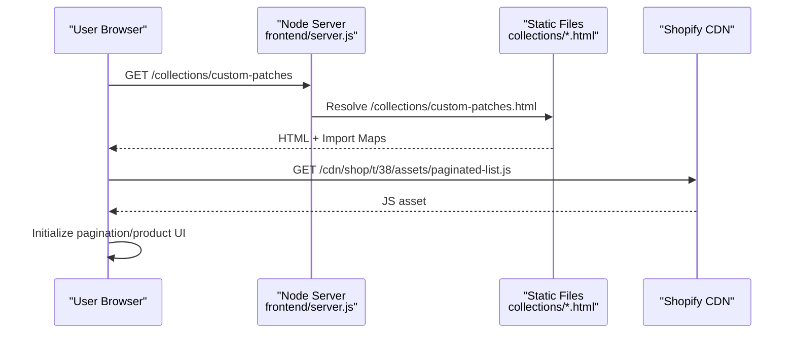
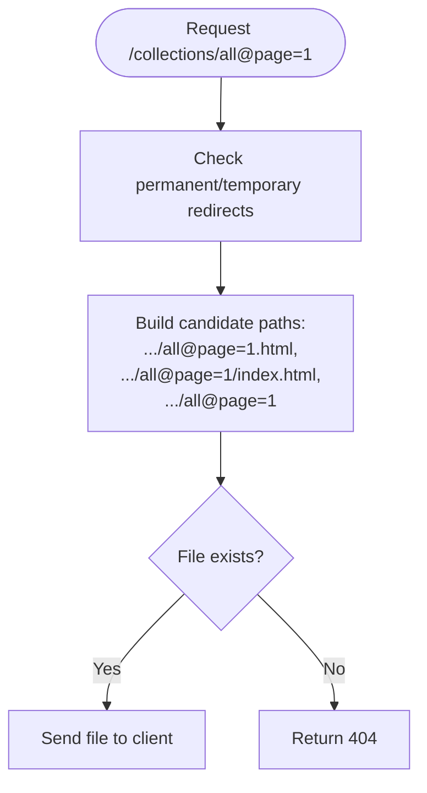
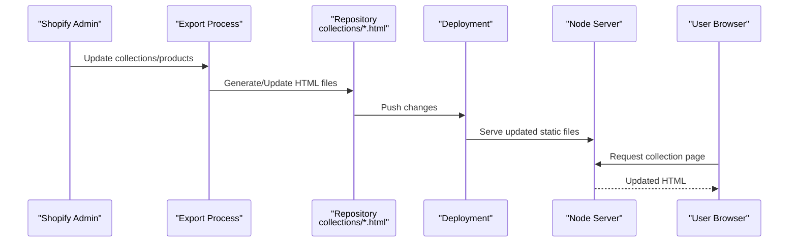
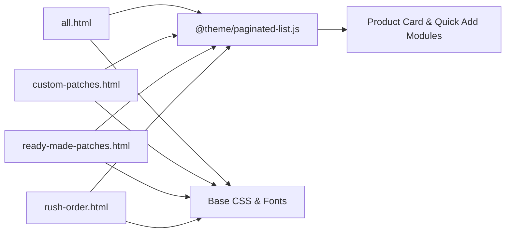

# Collections Management

<cite>
**Referenced Files in This Document**
- [all.html](file://frontend/patchkraze.com/collections/all.html)
- [custom-patches.html](file://frontend/patchkraze.com/collections/custom-patches.html)
- [ready-made-patches.html](file://frontend/patchkraze.com/collections/ready-made-patches.html)
- [rush-order.html](file://frontend/patchkraze.com/collections/rush-order.html)
- [all@page=1.html](file://frontend/patchkraze.com/collections/all@page=1.html)
- [rush-order@page=1.html](file://frontend/patchkraze.com/collections/rush-order@page=1.html)
- [server.js](file://frontend/server.js)
</cite>

## Table of Contents
1. [Introduction](#introduction)
2. [Project Structure](#project-structure)
3. [Core Components](#core-components)
4. [Architecture Overview](#architecture-overview)
5. [Detailed Component Analysis](#detailed-component-analysis)
6. [Dependency Analysis](#dependency-analysis)
7. [Performance Considerations](#performance-considerations)
8. [Troubleshooting Guide](#troubleshooting-guide)
9. [Conclusion](#conclusion)

## Introduction
This document explains how the Patch-Byte platform organizes products into collections and serves them as static pages. It covers collection types (such as custom patches, ready-made patches, and rush orders), page structure, filtering and pagination behavior, SEO setup, and how updates made in Shopify propagate to the live site through a prebuilt static export served by a lightweight Node server.

## Project Structure
Collections are implemented as static HTML files under the collections directory. Each collection has:
- A base page file for the main listing
- Optional paginated variants using a @page=N suffix
- Open Graph and Twitter metadata for social sharing
- Canonical URLs pointing to the canonical collection path

The local server serves these static files directly and proxies theme assets from Shopify’s CDN when needed.

```mermaid
graph TB
Client["Browser"] --> Server["Static Site Server<br/>frontend/server.js"]
Server --> FS["File System<br/>frontend/patchkraze.com/collections/*.html"]
Server --> CDN["Shopify CDN<br/>Theme assets & media"]
Client --> |Requests| "/collections/all"
Client --> |Requests| "/collections/custom-patches"
Client --> |Requests| "/collections/ready-made-patches"
Client --> |Requests| "/collections/rush-order"
Client --> |Pagination| "/collections/all@page=1"
Client --> |Pagination| "/collections/rush-order@page=1"
```

**Diagram sources**
- [server.js:46-111](file://frontend/server.js#L46-L111)
- [all.html:66-73](file://frontend/patchkraze.com/collections/all.html#L66-L73)
- [custom-patches.html:66-73](file://frontend/patchkraze.com/collections/custom-patches.html#L66-L73)
- [ready-made-patches.html:81-88](file://frontend/patchkraze.com/collections/ready-made-patches.html#L81-L88)
- [rush-order.html:66-73](file://frontend/patchkraze.com/collections/rush-order.html#L66-L73)
- [all@page=1.html:66-73](file://frontend/patchkraze.com/collections/all@page=1.html#L66-L73)
- [rush-order@page=1.html:66-73](file://frontend/patchkraze.com/collections/rush-order@page=1.html#L66-L73)

**Section sources**
- [server.js:46-111](file://frontend/server.js#L46-L111)
- [all.html:66-73](file://frontend/patchkraze.com/collections/all.html#L66-L73)
- [custom-patches.html:66-73](file://frontend/patchkraze.com/collections/custom-patches.html#L66-L73)
- [ready-made-patches.html:81-88](file://frontend/patchkraze.com/collections/ready-made-patches.html#L81-L88)
- [rush-order.html:66-73](file://frontend/patchkraze.com/collections/rush-order.html#L66-L73)
- [all@page=1.html:66-73](file://frontend/patchkraze.com/collections/all@page=1.html#L66-L73)
- [rush-order@page=1.html:66-73](file://frontend/patchkraze.com/collections/rush-order@page=1.html#L66-L73)

## Core Components
- Collection pages: Static HTML files that render product listings per collection. Examples include all, custom-patches, ready-made-patches, and rush-order.
- Pagination: Separate HTML files with @page=N suffixes for additional pages within a collection.
- Theme assets: JavaScript modules for pagination, product cards, quick add, and other UI features loaded via import maps.
- Local server: Express-based static server that resolves clean URLs to .html files and proxies missing /cdn resources to Shopify.

Key responsibilities:
- Serve collection pages and their paginated variants
- Provide canonical URLs and SEO metadata
- Load theme scripts for interactive behaviors like pagination and product interactions
- Proxy theme assets from Shopify CDN during local development

**Section sources**
- [all.html:108-137](file://frontend/patchkraze.com/collections/all.html#L108-L137)
- [custom-patches.html:108-137](file://frontend/patchkraze.com/collections/custom-patches.html#L108-L137)
- [ready-made-patches.html:124-152](file://frontend/patchkraze.com/collections/ready-made-patches.html#L124-L152)
- [rush-order.html:108-137](file://frontend/patchkraze.com/collections/rush-order.html#L108-L137)
- [server.js:46-111](file://frontend/server.js#L46-L111)

## Architecture Overview
The system uses a static-site approach powered by Shopify’s storefront export. Collections are generated as HTML and served by a small Node server. The server resolves clean URLs to corresponding .html files and proxies theme assets from Shopify’s CDN.



**Diagram sources**
- [server.js:92-111](file://frontend/server.js#L92-L111)
- [custom-patches.html:108-137](file://frontend/patchkraze.com/collections/custom-patches.html#L108-L137)

## Detailed Component Analysis

### Collection Pages and Types
- All Products: Base listing for all items in the store.
- Custom Patches: Curated collection for custom patch offerings.
- Ready-Made Patches: Pre-designed patches available for immediate purchase.
- Rush Order: Specialized collection highlighting expedited fulfillment options.

Each page includes:
- Title and canonical URL
- Open Graph and Twitter meta tags for social previews
- Import map referencing theme modules such as pagination and product card components

**Section sources**
- [all.html:66-73](file://frontend/patchkraze.com/collections/all.html#L66-L73)
- [custom-patches.html:66-73](file://frontend/patchkraze.com/collections/custom-patches.html#L66-L73)
- [ready-made-patches.html:81-88](file://frontend/patchkraze.com/collections/ready-made-patches.html#L81-L88)
- [rush-order.html:66-73](file://frontend/patchkraze.com/collections/rush-order.html#L66-L73)

### Page Structure and Theme Integration
Collection pages load a consistent set of theme assets via an import map. These include:
- Paginated list handling
- Product card rendering
- Quick add to cart
- Media gallery and variant pickers
- Performance utilities and view transitions

This ensures consistent UX across all collection pages while keeping the HTML minimal and focused on content and metadata.

**Section sources**
- [all.html:108-137](file://frontend/patchkraze.com/collections/all.html#L108-L137)
- [custom-patches.html:108-137](file://frontend/patchkraze.com/collections/custom-patches.html#L108-L137)
- [ready-made-patches.html:124-152](file://frontend/patchkraze.com/collections/ready-made-patches.html#L124-L152)
- [rush-order.html:108-137](file://frontend/patchkraze.com/collections/rush-order.html#L108-L137)

### Filtering Capabilities
Filtering is provided by the theme’s client-side components referenced in the import map (e.g., paginated-list). Since this repository contains static HTML exports, filters are typically rendered and managed by Shopify’s storefront layer and reflected in the exported pages. Any filter state changes would be handled by the theme’s JavaScript modules loaded on each collection page.

Note: No custom filter logic was found in this repository; filtering relies on the theme assets included via import maps.

**Section sources**
- [all.html:108-137](file://frontend/patchkraze.com/collections/all.html#L108-L137)
- [custom-patches.html:108-137](file://frontend/patchkraze.com/collections/custom-patches.html#L108-L137)
- [ready-made-patches.html:124-152](file://frontend/patchkraze.com/collections/ready-made-patches.html#L124-L152)
- [rush-order.html:108-137](file://frontend/patchkraze.com/collections/rush-order.html#L108-L137)

### Pagination Implementation
Pagination is implemented as separate static files with a @page=N suffix. For example:
- /collections/all@page=1.html
- /collections/rush-order@page=1.html

These files contain the same structure and metadata as the base collection pages but represent specific pages of results. The server resolves clean URLs to these files automatically.



**Diagram sources**
- [server.js:92-111](file://frontend/server.js#L92-L111)
- [all@page=1.html:66-73](file://frontend/patchkraze.com/collections/all@page=1.html#L66-L73)
- [rush-order@page=1.html:66-73](file://frontend/patchkraze.com/collections/rush-order@page=1.html#L66-L73)

**Section sources**
- [server.js:92-111](file://frontend/server.js#L92-L111)
- [all@page=1.html:66-73](file://frontend/patchkraze.com/collections/all@page=1.html#L66-L73)
- [rush-order@page=1.html:66-73](file://frontend/patchkraze.com/collections/rush-order@page=1.html#L66-L73)

### SEO Optimization for Collection Pages
Each collection page includes:
- A descriptive <title> tag
- A canonical link element pointing to the preferred URL
- Open Graph properties (site name, URL, title, type, description)
- Twitter card metadata (card type, title, description)

These elements help search engines and social platforms understand and display collection pages accurately.

**Section sources**
- [all.html:34-73](file://frontend/patchkraze.com/collections/all.html#L34-L73)
- [custom-patches.html:34-73](file://frontend/patchkraze.com/collections/custom-patches.html#L34-L73)
- [ready-made-patches.html:34-88](file://frontend/patchkraze.com/collections/ready-made-patches.html#L34-L88)
- [rush-order.html:34-73](file://frontend/patchkraze.com/collections/rush-order.html#L34-L73)

### How Updates Propagate to the Live Site
- Data source: Shopify backend manages collections and products.
- Export: Storefront content is exported as static HTML files under frontend/patchkraze.com/collections.
- Serving: The Node server serves these static files and proxies theme assets from Shopify’s CDN.
- Deployment: Updating the exported files (or re-exporting from Shopify) and redeploying the static site updates the live pages.



[No diagram sources since this diagram shows conceptual workflow, not actual code structure]

## Dependency Analysis
Collection pages depend on:
- Theme JavaScript modules loaded via import maps (pagination, product cards, quick add, etc.)
- Static assets served locally or proxied from Shopify CDN
- Clean URL resolution handled by the Node server



**Diagram sources**
- [all.html:108-137](file://frontend/patchkraze.com/collections/all.html#L108-L137)
- [custom-patches.html:108-137](file://frontend/patchkraze.com/collections/custom-patches.html#L108-L137)
- [ready-made-patches.html:124-152](file://frontend/patchkraze.com/collections/ready-made-patches.html#L124-L152)
- [rush-order.html:108-137](file://frontend/patchkraze.com/collections/rush-order.html#L108-L137)

**Section sources**
- [all.html:108-137](file://frontend/patchkraze.com/collections/all.html#L108-L137)
- [custom-patches.html:108-137](file://frontend/patchkraze.com/collections/custom-patches.html#L108-L137)
- [ready-made-patches.html:124-152](file://frontend/patchkraze.com/collections/ready-made-patches.html#L124-L152)
- [rush-order.html:108-137](file://frontend/patchkraze.com/collections/rush-order.html#L108-L137)

## Performance Considerations
- Static HTML reduces server processing time and improves Time to First Byte.
- Import maps preload critical modules to reduce layout shifts and improve interactivity.
- CDN proxying ensures theme assets are cached efficiently.
- Pagination splits large catalogs into manageable pages, reducing initial payload size.

[No sources needed since this section provides general guidance]

## Troubleshooting Guide
Common issues and resolutions:
- 404 on collection pages: Ensure the corresponding .html file exists and is reachable via clean URL mapping.
- Missing theme assets: Verify CDN proxying is active and Shopify CDN paths are correct.
- Pagination links not working: Confirm @page=N files exist and match the expected naming convention.

Relevant server logic handles clean URL resolution and fallbacks.

**Section sources**
- [server.js:92-111](file://frontend/server.js#L92-L111)

## Conclusion
Patch-Byte’s collection management leverages Shopify’s backend for data and a static frontend for fast, reliable delivery. Collections are organized into dedicated pages with clear SEO signals and pagination support. The lightweight Node server ensures smooth local development and production serving of static content while integrating seamlessly with Shopify’s CDN for theme assets.

[No sources needed since this section summarizes without analyzing specific files]