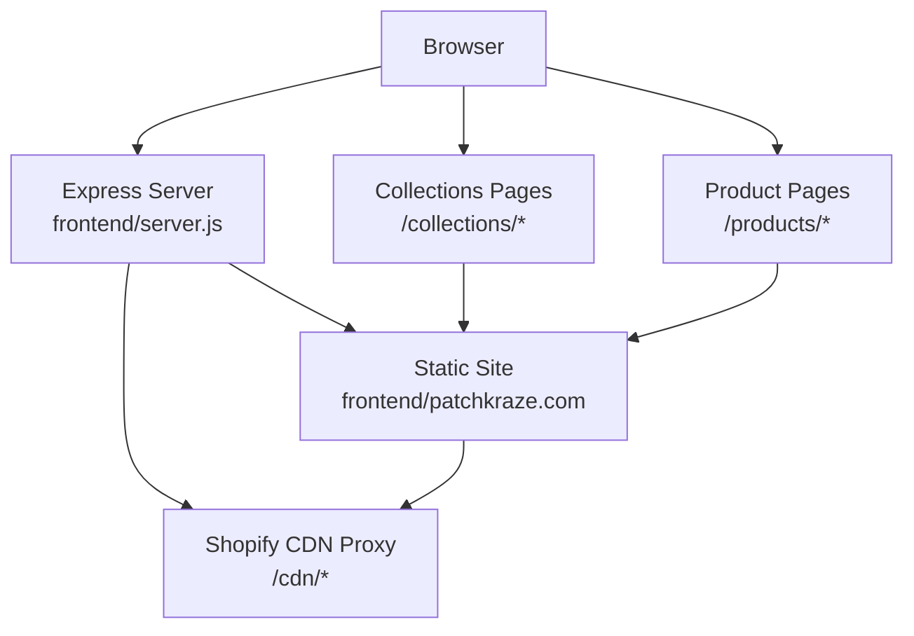
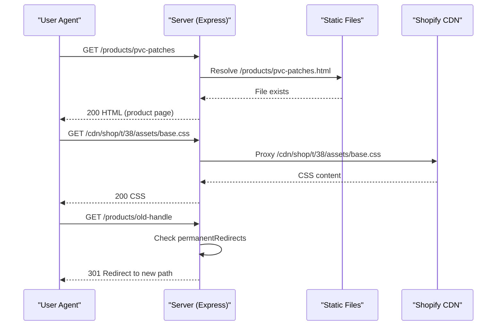
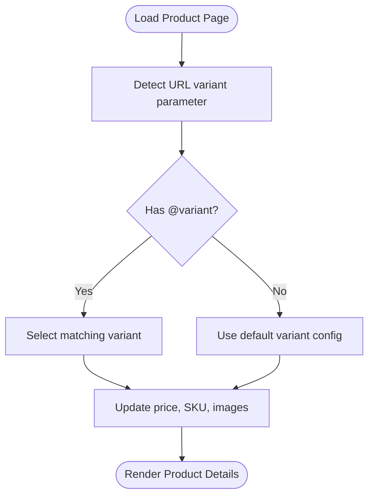
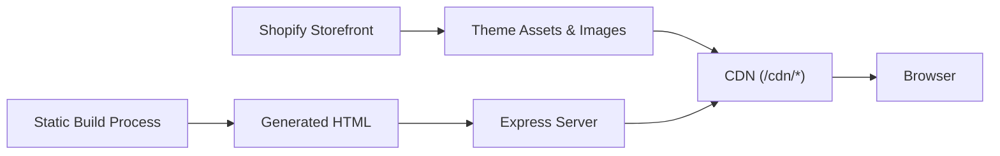
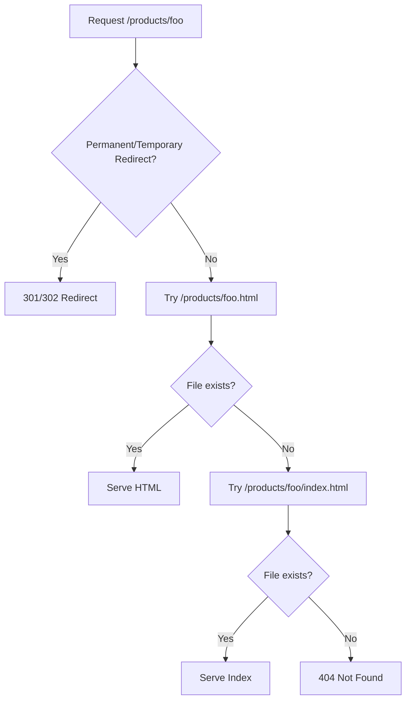
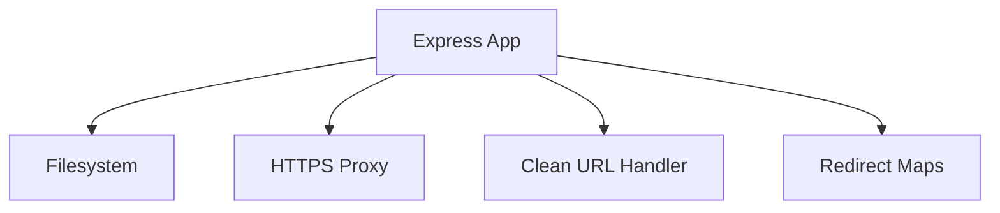

# Product Catalog Management

<cite>
**Referenced Files in This Document**
- [server.js](file://frontend/server.js)
- [index.html](file://frontend/patchkraze.com/index.html)
- [custom-patches.html](file://frontend/patchkraze.com/collections/custom-patches.html)
- [ready-made-patches.html](file://frontend/patchkraze.com/collections/ready-made-patches.html)
- [rush-order.html](file://frontend/patchkraze.com/collections/rush-order.html)
- [pvc-patches.html](file://frontend/patchkraze.com/products/pvc-patches.html)
- [embroidered-patches.html](file://frontend/patchkraze.com/products/embroidered-patches.html)
- [leather-patches-for-jackets.html](file://frontend/patchkraze.com/products/leather-patches-for-jackets.html)
- [patches-for-shirts.html](file://frontend/patchkraze.com/products/patches-for-shirts.html)
</cite>

## Table of Contents
1. [Introduction](#introduction)
2. [Project Structure](#project-structure)
3. [Core Components](#core-components)
4. [Architecture Overview](#architecture-overview)
5. [Detailed Component Analysis](#detailed-component-analysis)
6. [Dependency Analysis](#dependency-analysis)
7. [Performance Considerations](#performance-considerations)
8. [Troubleshooting Guide](#troubleshooting-guide)
9. [Conclusion](#conclusion)

## Introduction
This document explains how the Patch-Byte platform manages its product catalog and renders it as a static site. Products are organized via Shopify collections and served through a static frontend with clean URL routing. The system supports three main collection categories: custom patches, ready-made patches, and rush orders. Each product page is generated statically with SEO metadata, variant handling, and rich media galleries. Updates made in Shopify propagate to the live site by regenerating these static files; the server then serves them directly or proxies theme assets from Shopify’s CDN.

## Project Structure
The site is a static build rooted under frontend/patchkraze.com with:
- Collections pages for browsing products by category
- Individual product pages with embedded metadata and interactive scripts
- A lightweight Express server that serves static files, proxies CDN assets, and handles clean URLs and redirects
- An API endpoint for payment intent creation used by checkout flows

**Diagram sources**
- [server.js:46-65](file://frontend/server.js#L46-L65)
- [server.js:92-111](file://frontend/server.js#L92-L111)

**Section sources**
- [server.js:1-123](file://frontend/server.js#L1-L123)

## Core Components
- Collection pages: /collections/custom-patches, /collections/ready-made-patches, /collections/rush-order
- Product pages: /products/<handle>, including variant-specific URLs like @variant=<id>
- Static asset serving and CDN proxying for theme assets and images
- Clean URL routing mapping /products/foo to /products/foo.html
- Redirects for moved or renamed content

Key responsibilities:
- Serve prebuilt HTML for collections and products
- Provide SEO-friendly URLs and canonical tags
- Proxy missing local assets back to Shopify CDN
- Route requests to correct static files or return 404

**Section sources**
- [custom-patches.html:1-100](file://frontend/patchkraze.com/collections/custom-patches.html#L1-L100)
- [ready-made-patches.html:1-100](file://frontend/patchkraze.com/collections/ready-made-patches.html#L1-L100)
- [rush-order.html:1-100](file://frontend/patchkraze.com/collections/rush-order.html#L1-L100)
- [server.js:46-111](file://frontend/server.js#L46-L111)

## Architecture Overview
The platform uses a static site generation approach backed by Shopify content. During build time, collection and product pages are generated with embedded metadata and links to Shopify-hosted assets. At runtime:
- The Express server serves static HTML files from the patchkraze.com directory
- Requests to /cdn/* are proxied to Shopify’s CDN when not found locally
- Clean URLs are resolved to .html files or index.html fallbacks
- Permanent and temporary redirects handle legacy or moved paths

**Diagram sources**
- [server.js:46-65](file://frontend/server.js#L46-L65)
- [server.js:67-111](file://frontend/server.js#L67-L111)

## Detailed Component Analysis

### Collection Categorization
The site exposes three primary collection pages:
- Custom Patches: /collections/custom-patches
- Ready Made Patches: /collections/ready-made-patches
- Rush Order: /collections/rush-order

Each collection page includes:
- Open Graph and Twitter meta tags for social sharing
- Canonical link pointing to the collection URL
- Theme configuration indicating template name “collection”
- Preloaded theme assets and JavaScript modules for interactivity

These pages act as entry points to browse products within each category.

**Section sources**
- [custom-patches.html:34-73](file://frontend/patchkraze.com/collections/custom-patches.html#L34-L73)
- [ready-made-patches.html:34-88](file://frontend/patchkraze.com/collections/ready-made-patches.html#L34-L88)
- [rush-order.html:34-73](file://frontend/patchkraze.com/collections/rush-order.html#L34-L73)

### Product Page Structure
Product pages follow a consistent structure:
- Head section with SEO metadata (title, description, canonical, OG/Twitter cards)
- Import map referencing theme assets (product form, gallery, variant picker, etc.)
- Body containing a product container with image gallery, details, and interactive components

Example product pages:
- PVC Patches: /products/pvc-patches
- Embroidered Patches: /products/embroidered-patches

These pages embed structured data for prices and images and rely on client-side scripts for dynamic behavior such as variant selection and gallery navigation.

**Section sources**
- [pvc-patches.html:34-101](file://frontend/patchkraze.com/products/pvc-patches.html#L34-L101)
- [embroidered-patches.html:34-101](file://frontend/patchkraze.com/products/embroidered-patches.html#L34-L101)

### Variant Handling
Variants are supported both at the URL level and via client-side logic:
- Variant-specific URLs use the pattern /products/<handle>@variant=<id>
- Product pages include per-product configuration objects defining size ranges and steps for different patch types
- Client-side scripts manage variant selection, pricing updates, and inventory display

Examples:
- Leather patches for jackets: /products/leather-patches-for-jackets.html and variant page
- Patches for shirts: /products/patches-for-shirts.html and variant page

The configuration maps product handles to min/max/default sizes and step increments, enabling consistent UX across patch types.

**Diagram sources**
- [leather-patches-for-jackets.html:3129-3149](file://frontend/patchkraze.com/products/leather-patches-for-jackets.html#L3129-L3149)
- [patches-for-shirts.html:3129-3149](file://frontend/patchkraze.com/products/patches-for-shirts.html#L3129-L3149)

**Section sources**
- [leather-patches-for-jackets.html:3129-3149](file://frontend/patchkraze.com/products/leather-patches-for-jackets.html#L3129-L3149)
- [patches-for-shirts.html:3129-3149](file://frontend/patchkraze.com/products/patches-for-shirts.html#L3129-L3149)

### Integration Between Shopify and Static Site Generation
- Static pages reference Shopify CDN for theme assets and images via /cdn/* paths
- The server proxies /cdn/* requests to Shopify’s CDN when local files are missing
- Build-time generation produces HTML with canonical URLs and meta tags aligned to Shopify content
- Changes in Shopify (products, collections, images) should be reflected by regenerating the static site

**Diagram sources**
- [server.js:46-65](file://frontend/server.js#L46-L65)

**Section sources**
- [server.js:46-65](file://frontend/server.js#L46-L65)

### Examples of Product Types
- Embroidered patches: /products/embroidered-patches.html
- PVC patches: /products/pvc-patches.html
- Accessories (e.g., caps): multiple product pages under /products/...

These examples demonstrate consistent page structure, SEO metadata, and variant handling across product categories.

**Section sources**
- [embroidered-patches.html:34-101](file://frontend/patchkraze.com/products/embroidered-patches.html#L34-L101)
- [pvc-patches.html:34-101](file://frontend/patchkraze.com/products/pvc-patches.html#L34-L101)

### SEO Optimization for Product Pages
Each product page includes:
- Title tag with product name and brand suffix
- Meta description summarizing product features
- Open Graph tags (og:title, og:description, og:image, og:price)
- Twitter card tags (twitter:title, twitter:description)
- Canonical link pointing to the product URL

This ensures accurate indexing and rich previews on search engines and social platforms.

**Section sources**
- [pvc-patches.html:34-101](file://frontend/patchkraze.com/products/pvc-patches.html#L34-L101)
- [embroidered-patches.html:34-101](file://frontend/patchkraze.com/products/embroidered-patches.html#L34-L101)

### URL Routing Patterns
- Clean URLs: /products/<handle> resolve to /products/<handle>.html
- Collections: /collections/<handle> serve corresponding collection pages
- Redirects: permanent (301) and temporary (302) redirects for moved or renamed content
- Fallback: if no file matches, returns a 404 with a home link

**Diagram sources**
- [server.js:67-111](file://frontend/server.js#L67-L111)

**Section sources**
- [server.js:67-111](file://frontend/server.js#L67-L111)

### How Product Updates Propagate to the Live Site
- When products or collections change in Shopify, regenerate the static site to produce updated HTML files
- Deploy the regenerated files to the hosting environment where the Express server serves them
- Asset changes (images, theme JS/CSS) are fetched from Shopify CDN via /cdn/* proxy
- Ensure canonical URLs and meta tags reflect current product information

[No sources needed since this section provides general guidance]

## Dependency Analysis
The runtime dependencies are minimal:
- Express server for static file serving and routing
- Node.js filesystem operations to locate static files
- HTTPS module to proxy CDN requests
- Optional Stripe integration for payment intents (not part of product catalog rendering)

**Diagram sources**
- [server.js:1-15](file://frontend/server.js#L1-L15)
- [server.js:46-111](file://frontend/server.js#L46-L111)

**Section sources**
- [server.js:1-123](file://frontend/server.js#L1-L123)

## Performance Considerations
- Preload critical fonts and CSS to reduce layout shifts
- Use import maps to load only necessary theme modules
- Leverage browser caching for CDN assets
- Keep product pages lean by avoiding heavy inline scripts beyond essential interactions
- Prefer lazy loading for non-critical images and media

[No sources needed since this section provides general guidance]

## Troubleshooting Guide
Common issues and resolutions:
- 404 errors for product or collection pages: ensure the corresponding .html file exists in the static root and that clean URL routing is enabled
- Missing assets: verify /cdn/* proxy configuration and that Shopify CDN paths match expected formats
- Redirect loops: check permanent and temporary redirect maps for conflicting entries
- Variant selection not updating: confirm per-product configuration objects include correct min/max/default values and that variant IDs match Shopify variants

**Section sources**
- [server.js:67-111](file://frontend/server.js#L67-L111)
- [server.js:46-65](file://frontend/server.js#L46-L65)

## Conclusion
The Patch-Byte platform delivers a fast, SEO-optimized product catalog using static site generation with Shopify-backed content. Collections categorize products into custom patches, ready-made patches, and rush orders. Product pages provide rich metadata, variant handling, and interactive galleries. The Express server ensures clean URLs, efficient asset delivery via CDN proxying, and robust routing with redirects. To keep the site current, regenerate static files whenever Shopify content changes and redeploy the updated assets.