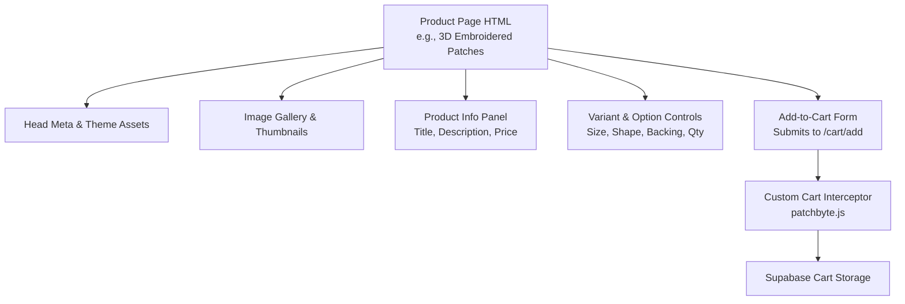
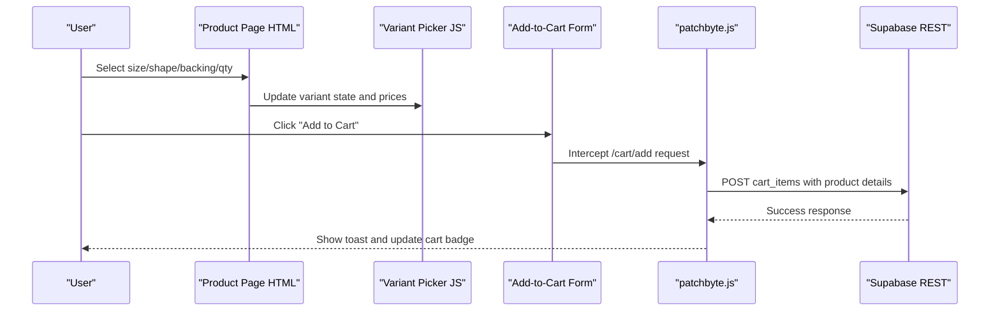
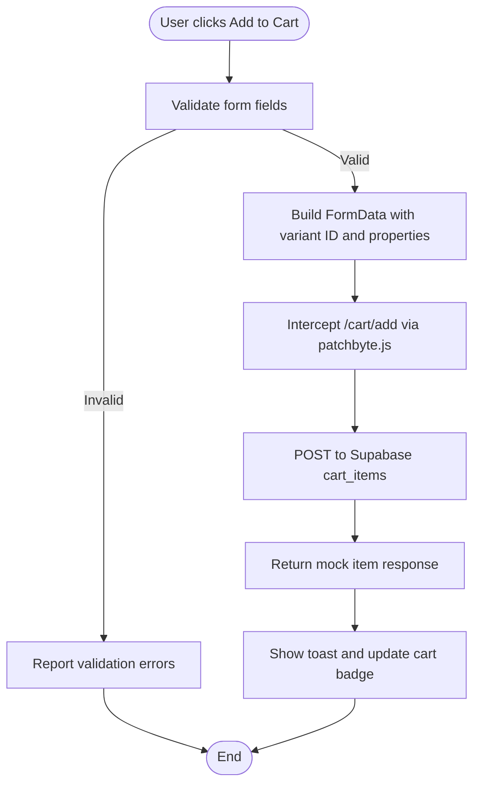
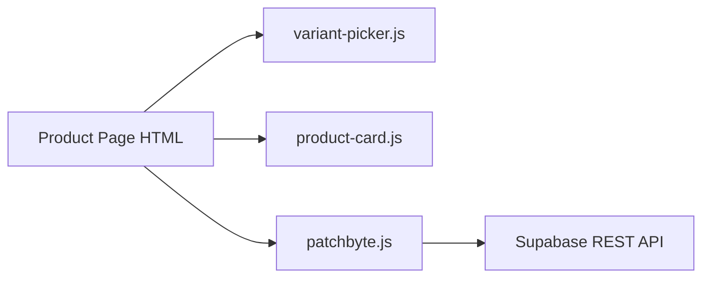

# Product Pages

<cite>
**Referenced Files in This Document**
- [3d-embroidered-patches.html](file://frontend/patchkraze.com/products/3d-embroidered-patches.html)
- [pvc-patches.html](file://frontend/patchkraze.com/products/pvc-patches.html)
- [custom-stickers.html](file://frontend/patchkraze.com/products/custom-stickers.html)
- [patchbyte.js](file://frontend/js/patchbyte.js)
- [variant-picker.js](file://frontend/cdn/shop/t/38/assets/variant-picker.js)
- [product-card.js](file://frontend/cdn/shop/t/38/assets/product-card.js)
</cite>

## Table of Contents
1. [Introduction](#introduction)
2. [Project Structure](#project-structure)
3. [Core Components](#core-components)
4. [Architecture Overview](#architecture-overview)
5. [Detailed Component Analysis](#detailed-component-analysis)
6. [Dependency Analysis](#dependency-analysis)
7. [Performance Considerations](#performance-considerations)
8. [Troubleshooting Guide](#troubleshooting-guide)
9. [Conclusion](#conclusion)

## Introduction
This document explains how individual product pages are structured and rendered on the Patch-Byte platform. It covers HTML templates, dynamic content from Shopify via Liquid (as reflected in the generated HTML), SEO metadata, Open Graph and Twitter cards, and how product variants and options are handled. It also provides examples for different product types such as embroidered patches, PVC patches, and accessories like stickers.

## Project Structure
Product pages are static HTML files generated by Shopify’s templating system. Each file includes:
- A head section with meta tags, canonical URLs, and theme assets
- A gallery and media area for product images
- A product information panel with title, description, pricing, and variant selection
- A form that submits to Shopify’s cart endpoints (intercepted by a custom script)

**Diagram sources**
- [3d-embroidered-patches.html:2614-2957](file://frontend/patchkraze.com/products/3d-embroidered-patches.html#L2614-L2957)
- [patchbyte.js:140-233](file://frontend/js/patchbyte.js#L140-L233)

**Section sources**
- [3d-embroidered-patches.html:1-120](file://frontend/patchkraze.com/products/3d-embroidered-patches.html#L1-L120)
- [3d-embroidered-patches.html:2614-2957](file://frontend/patchkraze.com/products/3d-embroidered-patches.html#L2614-L2957)

## Core Components
- Head metadata: canonical URL, page title, meta description, Open Graph, and Twitter card fields are present per product page.
- Media gallery: main image and thumbnails with navigation and zoom controls.
- Product info panel: title, short description, feature highlights, and price display.
- Variant and option controls: size inputs, shape selection, backing selection, quantity input, and total price calculation.
- Add-to-cart form: hidden variant ID and properties; submission is intercepted to store items in Supabase and update UI.

Examples across product types:
- Embroidered patches: include shape, backing, and size controls with tiered pricing.
- PVC patches: similar structure with product-specific descriptions and images.
- Accessories (stickers): simpler configuration but same head/meta and add-to-cart flow.

**Section sources**
- [3d-embroidered-patches.html:2614-2957](file://frontend/patchkraze.com/products/3d-embroidered-patches.html#L2614-L2957)
- [pvc-patches.html:1-120](file://frontend/patchkraze.com/products/pvc-patches.html#L1-L120)
- [custom-stickers.html:1-120](file://frontend/patchkraze.com/products/custom-stickers.html#L1-L120)

## Architecture Overview
The product page architecture combines server-rendered HTML (from Shopify Liquid) with client-side scripts for interactivity and cart integration.

**Diagram sources**
- [3d-embroidered-patches.html:2768-2952](file://frontend/patchkraze.com/products/3d-embroidered-patches.html#L2768-L2952)
- [patchbyte.js:140-233](file://frontend/js/patchbyte.js#L140-L233)

## Detailed Component Analysis

### HTML Template Structure and Dynamic Rendering
- The head contains:
  - Canonical link pointing to the product URL
  - Title and meta description derived from product data
  - Open Graph tags including site name, URL, title, type, description, image dimensions, and price amount/currency
  - Twitter card metadata for rich social sharing
- The body includes:
  - A responsive gallery with main image and thumbnail navigation
  - Product info panel with title, reviews row, price block, and description
  - A multi-stage customization form for certain products (upload, customize, options)
  - An add-to-cart form with hidden variant ID and property fields

Dynamic rendering is evident through:
- Product-specific titles, descriptions, and images set in the HTML
- Prices and currency embedded in Open Graph meta
- JavaScript modules preloaded for variant picking, media galleries, and form handling

**Section sources**
- [3d-embroidered-patches.html:1-120](file://frontend/patchkraze.com/products/3d-embroidered-patches.html#L1-L120)
- [3d-embroidered-patches.html:2614-2957](file://frontend/patchkraze.com/products/3d-embroidered-patches.html#L2614-L2957)

### SEO Optimization Elements
- Meta tags:
  - Canonical URL ensures a single source of truth per product
  - Title and meta description provide concise, searchable summaries
- Open Graph protocol:
  - og:site_name, og:url, og:title, og:type, og:description, og:image with width/height, and og:price:amount/currency
- Twitter Card:
  - twitter:card set to summary_large_image with matching title and description

These elements improve search visibility and social sharing previews.

**Section sources**
- [3d-embroidered-patches.html:34-101](file://frontend/patchkraze.com/products/3d-embroidered-patches.html#L34-L101)
- [pvc-patches.html:34-101](file://frontend/patchkraze.com/products/pvc-patches.html#L34-L101)
- [custom-stickers.html:34-101](file://frontend/patchkraze.com/products/custom-stickers.html#L34-L101)

### Product Images and Galleries
- Main image and multiple thumbnails are included with lazy loading for performance
- Navigation arrows and zoom icon enhance user experience
- Thumbnails sync with the main image index

**Section sources**
- [3d-embroidered-patches.html:2617-2743](file://frontend/patchkraze.com/products/3d-embroidered-patches.html#L2617-L2743)

### Descriptions and Pricing Display
- Product title and description are prominently displayed
- Feature bar highlights key selling points (minimum quantity, shipping, fees)
- Price block shows unit price and quantity thresholds; total price updates based on quantity and selected options

**Section sources**
- [3d-embroidered-patches.html:2745-2766](file://frontend/patchkraze.com/products/3d-embroidered-patches.html#L2745-L2766)
- [3d-embroidered-patches.html:2795-2851](file://frontend/patchkraze.com/products/3d-embroidered-patches.html#L2795-L2851)

### Variant Selection and Options
- Size selection uses stepper inputs for width and height with min/max constraints
- Shape selection offers visual cards for Circle, Square, Rectangle, Oval, Custom
- Backing selection includes Heat Applied, Velcro (with surcharge), and Peel & Stick
- Quantity input enforces minimums and updates total price dynamically
- Hidden fields carry variant ID and properties to the cart

Variant picker behavior is supported by theme scripts that re-render options and update related images when selections change.

**Section sources**
- [3d-embroidered-patches.html:2806-2923](file://frontend/patchkraze.com/products/3d-embroidered-patches.html#L2806-L2923)
- [variant-picker.js:300-340](file://frontend/cdn/shop/t/38/assets/variant-picker.js#L300-L340)
- [product-card.js:271-315](file://frontend/cdn/shop/t/38/assets/product-card.js#L271-L315)

### Add-to-Cart Flow and Integration
- The form includes a hidden variant ID and property fields for design file, dimensions, shape, backing, and notes
- On submit, a custom interceptor captures the request, extracts product details, and stores them in Supabase
- The UI shows a toast notification and updates the cart badge count

**Diagram sources**
- [3d-embroidered-patches.html:2961-3000](file://frontend/patchkraze.com/products/3d-embroidered-patches.html#L2961-L3000)
- [patchbyte.js:140-233](file://frontend/js/patchbyte.js#L140-L233)

**Section sources**
- [3d-embroidered-patches.html:2768-2952](file://frontend/patchkraze.com/products/3d-embroidered-patches.html#L2768-L2952)
- [patchbyte.js:140-233](file://frontend/js/patchbyte.js#L140-L233)

### Examples by Product Type
- Embroidered patches: Multi-step customization with upload, size steppers, shape grid, backing options, and tiered pricing
- PVC patches: Similar structure with product-specific imagery and descriptions
- Accessories (stickers): Simplified configuration but consistent head/meta and add-to-cart flow

**Section sources**
- [3d-embroidered-patches.html:2614-2957](file://frontend/patchkraze.com/products/3d-embroidered-patches.html#L2614-L2957)
- [pvc-patches.html:1-120](file://frontend/patchkraze.com/products/pvc-patches.html#L1-L120)
- [custom-stickers.html:1-120](file://frontend/patchkraze.com/products/custom-stickers.html#L1-L120)

## Dependency Analysis
- Product pages depend on theme assets for variant picking, media galleries, and form interactions
- The custom cart interceptor relies on DOM selectors to extract product name, price, and image
- Variant picker and product card scripts coordinate to update images and enable/disable buttons based on variant availability

**Diagram sources**
- [3d-embroidered-patches.html:136-165](file://frontend/patchkraze.com/products/3d-embroidered-patches.html#L136-L165)
- [patchbyte.js:140-233](file://frontend/js/patchbyte.js#L140-L233)
- [variant-picker.js:300-340](file://frontend/cdn/shop/t/38/assets/variant-picker.js#L300-L340)
- [product-card.js:271-315](file://frontend/cdn/shop/t/38/assets/product-card.js#L271-L315)

**Section sources**
- [3d-embroidered-patches.html:136-165](file://frontend/patchkraze.com/products/3d-embroidered-patches.html#L136-L165)
- [patchbyte.js:140-233](file://frontend/js/patchbyte.js#L140-L233)

## Performance Considerations
- Lazy loading of images improves initial page load
- Preloading fonts and critical CSS reduces layout shifts
- Module preloads ensure essential scripts are available early
- Thumbnail navigation avoids heavy operations until needed

[No sources needed since this section provides general guidance]

## Troubleshooting Guide
- If add-to-cart does not work:
  - Ensure the form has a hidden variant ID and required properties
  - Check that the interceptor is active and not blocked by other scripts
  - Verify network requests to Supabase succeed and return expected responses
- If variant images do not update:
  - Confirm variant picker scripts are loaded and morphing works correctly
  - Check that selected option carries media IDs linked to slides
- If social previews are incorrect:
  - Validate Open Graph and Twitter card meta tags for correct URLs, images, and dimensions
  - Ensure canonical URL matches the intended product page

**Section sources**
- [patchbyte.js:140-233](file://frontend/js/patchbyte.js#L140-L233)
- [variant-picker.js:300-340](file://frontend/cdn/shop/t/38/assets/variant-picker.js#L300-L340)
- [3d-embroidered-patches.html:34-101](file://frontend/patchkraze.com/products/3d-embroidered-patches.html#L34-L101)

## Conclusion
Patch-Byte product pages combine robust HTML templates with dynamic Liquid-rendered content and interactive scripts to deliver a seamless shopping experience. SEO-friendly metadata, comprehensive media galleries, and flexible variant selection support diverse product types. The custom cart integration ensures reliable order capture while maintaining a modern, responsive interface.