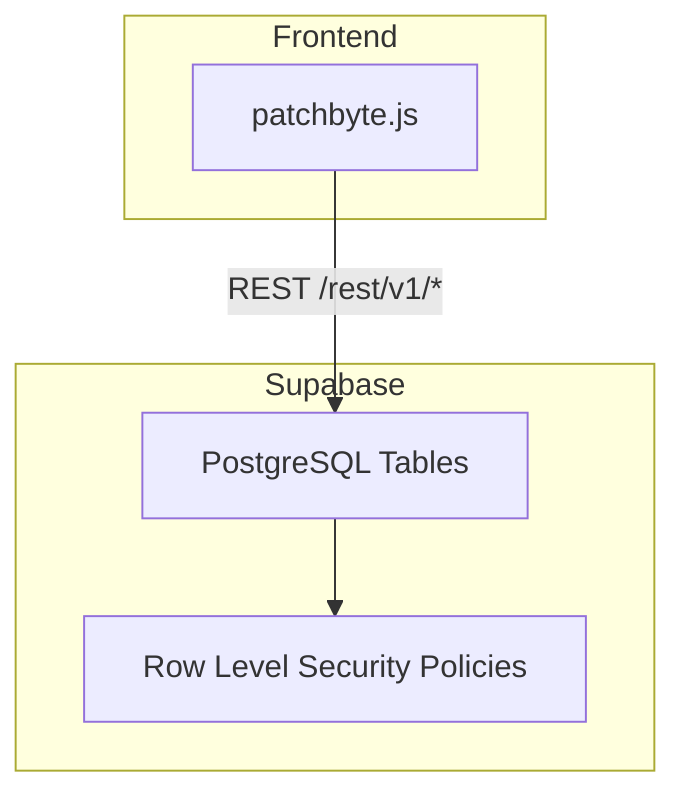
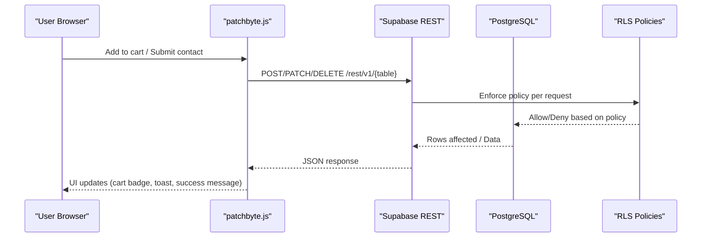
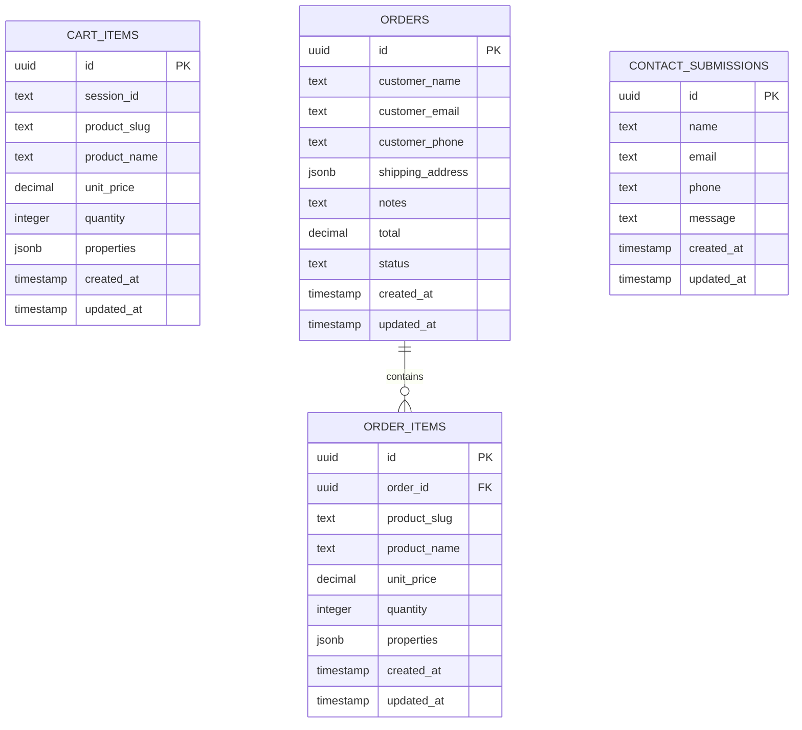
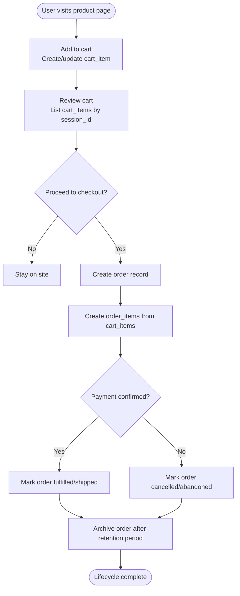
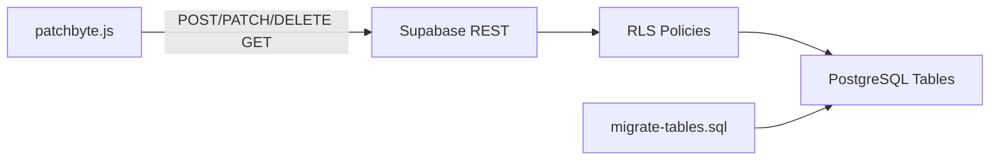

# Database Design

<cite>
**Referenced Files in This Document**
- [migrate-tables.sql](file://migrate-tables.sql)
- [patchbyte.js](file://frontend/js/patchbyte.js)
- [package.json](file://package.json)
</cite>

## Table of Contents
1. [Introduction](#introduction)
2. [Project Structure](#project-structure)
3. [Core Components](#core-components)
4. [Architecture Overview](#architecture-overview)
5. [Detailed Component Analysis](#detailed-component-analysis)
6. [Dependency Analysis](#dependency-analysis)
7. [Performance Considerations](#performance-considerations)
8. [Troubleshooting Guide](#troubleshooting-guide)
9. [Conclusion](#conclusion)
10. [Appendices](#appendices)

## Introduction
This document describes the Patch-Byte database design used to support cart, order, and contact submission features on a Shopify-based storefront integrated with Supabase. It explains the entity relationships between carts (cart items), orders, order items, and contact submissions; documents table structures, field definitions, data types, and constraints inferred from the migration and frontend usage; outlines row-level security policies implemented in Supabase; provides sample queries for common operations; and discusses data lifecycle, retention considerations, and backup strategies.

## Project Structure
The database schema is extended via a single migration file that adds columns to existing tables and enables Row Level Security (RLS) policies. The frontend JavaScript integrates with Supabase’s REST API to perform cart and contact operations. A small Node server is present but not directly involved in this documentation.

**Diagram sources**
- [patchbyte.js:1-345](file://frontend/js/patchbyte.js#L1-L345)
- [migrate-tables.sql:36-56](file://migrate-tables.sql#L36-L56)

**Section sources**
- [migrate-tables.sql:1-56](file://migrate-tables.sql#L1-L56)
- [patchbyte.js:1-345](file://frontend/js/patchbyte.js#L1-L345)

## Core Components
The system centers around four entities:
- Cart Items: represent products added by an anonymous session before checkout.
- Orders: capture customer details, totals, shipping address, notes, and status at checkout.
- Order Items: snapshot of each product line within an order.
- Contact Submissions: store messages submitted via the contact form.

Key observations from the codebase:
- Columns added include identifiers for products, names, prices, quantities (for cart), JSONB properties, customer fields, shipping address, notes, totals, statuses, and contact fields.
- Session-based scoping is used for cart items via a session_id column referenced by the frontend.
- Row Level Security is enabled on all four tables with permissive policies allowing public access using the anon role.

**Section sources**
- [migrate-tables.sql:5-34](file://migrate-tables.sql#L5-L34)
- [patchbyte.js:69-111](file://frontend/js/patchbyte.js#L69-L111)

## Architecture Overview
The data flow spans the browser, Supabase REST API, and PostgreSQL with RLS policies controlling access.

**Diagram sources**
- [patchbyte.js:33-65](file://frontend/js/patchbyte.js#L33-L65)
- [patchbyte.js:69-111](file://frontend/js/patchbyte.js#L69-L111)
- [patchbyte.js:237-263](file://frontend/js/patchbyte.js#L237-L263)
- [migrate-tables.sql:36-56](file://migrate-tables.sql#L36-L56)

## Detailed Component Analysis

### Entity Relationships
- Carts to Orders: An order is created from one or more cart items. In practice, the frontend persists cart items by session and then creates an order with corresponding order items. There is no explicit foreign key constraint defined in the provided files; logical linkage is maintained by copying product identifiers and prices into order_items when an order is placed.
- Orders to Order Items: One-to-many relationship where each order can contain multiple order items. Again, no explicit foreign keys are defined in the migration; referential integrity is enforced logically by application logic.
- Contact Submissions: Standalone table capturing user messages; no relational links to other entities.

Notes:
- The ER diagram shows conceptual relationships. The actual presence of primary keys, foreign keys, and timestamps is inferred from typical Supabase defaults and frontend usage patterns (e.g., created_at ordering). Explicit definitions beyond the migration are not present in the repository.

**Diagram sources**
- [migrate-tables.sql:5-34](file://migrate-tables.sql#L5-L34)
- [patchbyte.js:69-111](file://frontend/js/patchbyte.js#L69-L111)

**Section sources**
- [migrate-tables.sql:5-34](file://migrate-tables.sql#L5-L34)
- [patchbyte.js:69-111](file://frontend/js/patchbyte.js#L69-L111)

### Table Structures and Field Definitions
- cart_items
  - session_id: Used to group items by anonymous session; queried via eq filter in the frontend.
  - product_slug, product_name: Identify the product being added.
  - unit_price: Decimal price captured at add time.
  - quantity: Number of units; incremented if same product exists in the same session.
  - properties: JSONB for flexible attributes (e.g., image URL).
  - created_at: Used for ordering results.
- orders
  - customer_name, customer_email, customer_phone: Customer contact info.
  - shipping_address: JSONB for structured address data.
  - notes: Free-form text.
  - total: Decimal sum of line items.
  - status: Text state (default pending).
- order_items
  - product_slug, product_name, unit_price: Snapshot of product details at order time.
  - quantity: Units ordered.
  - properties: JSONB for variant or custom attributes.
- contact_submissions
  - name, email, phone, message: Fields populated from the contact form.

Constraints and Defaults:
- Defaults are applied for numeric and text fields (e.g., unit_price defaulting to zero, status defaulting to pending).
- JSONB fields default to empty objects or null depending on definition.

Indexes:
- No explicit indexes are defined in the migration.
- Query performance relies on natural keys and filters used by the frontend (e.g., session_id equality).

**Section sources**
- [migrate-tables.sql:5-34](file://migrate-tables.sql#L5-L34)
- [patchbyte.js:69-111](file://frontend/js/patchbyte.js#L69-L111)

### Primary and Foreign Key Relationships
- Primary Keys: Not explicitly defined in the migration; typically auto-generated UUIDs in Supabase tables.
- Foreign Keys: Not explicitly defined in the migration; relationships are logical and enforced by application logic during order creation.

Recommendation:
- Define explicit foreign keys from order_items.order_id to orders.id to enforce referential integrity.
- Add unique constraints where appropriate (e.g., prevent duplicate cart items per session+product).

**Section sources**
- [migrate-tables.sql:5-34](file://migrate-tables.sql#L5-L34)

### Row-Level Security Policies
All four tables have RLS enabled with permissive policies for the anon role:
- cart_items: Allows all operations for any authenticated or anonymous user under the anon role.
- orders: Allows all operations for anon.
- order_items: Allows all operations for anon.
- contact_submissions: Allows all operations for anon.

Implications:
- Public write access is allowed; ensure backend validation and rate limiting are in place.
- For production, tighten policies to restrict writes to specific roles or conditions (e.g., only allow inserts for contact_submissions from the client, restrict reads/writes to orders by admin role).

**Section sources**
- [migrate-tables.sql:36-56](file://migrate-tables.sql#L36-L56)

### Data Validation Rules and Business Logic
- Cart item duplication: If a cart item with the same product_slug exists for the current session, quantity is incremented rather than creating a new row.
- Quantity handling: Setting quantity to zero triggers deletion of the cart item.
- Contact form: Validates presence of fields client-side and posts to contact_submissions; displays success feedback.
- Totals and status: Orders include a total and status fields; business logic should compute totals from order items and update status through workflows.

Note: These rules are enforced in the frontend; consider moving critical validations to database-level checks (e.g., CHECK constraints, triggers) for robustness.

**Section sources**
- [patchbyte.js:74-111](file://frontend/js/patchbyte.js#L74-L111)
- [patchbyte.js:237-263](file://frontend/js/patchbyte.js#L237-L263)

### Sample Queries
Common operations derived from frontend usage:

- Get cart items for a session:
  - SELECT * FROM cart_items WHERE session_id = '<session_id>' ORDER BY created_at ASC;

- Add or update a cart item:
  - INSERT INTO cart_items (session_id, product_slug, product_name, unit_price, quantity, properties) VALUES (...) ON CONFLICT DO NOTHING;
  - UPDATE cart_items SET quantity = quantity + <increment> WHERE session_id = '<session_id>' AND product_slug = '<slug>';

- Update or remove a cart item:
  - UPDATE cart_items SET quantity = <new_quantity> WHERE id = <id>;
  - DELETE FROM cart_items WHERE id = <id>;

- Clear cart for a session:
  - DELETE FROM cart_items WHERE session_id = '<session_id>';

- Create an order and order items:
  - INSERT INTO orders (customer_name, customer_email, customer_phone, shipping_address, notes, total, status) VALUES (...);
  - INSERT INTO order_items (order_id, product_slug, product_name, unit_price, quantity, properties) VALUES (...);

- Submit a contact message:
  - INSERT INTO contact_submissions (name, email, phone, message) VALUES (...);

**Section sources**
- [patchbyte.js:69-111](file://frontend/js/patchbyte.js#L69-L111)
- [migrate-tables.sql:5-34](file://migrate-tables.sql#L5-L34)

### Data Lifecycle: From Cart Creation to Order Completion

Operational notes:
- Ensure order totals match the sum of order_items at confirmation time.
- Use status transitions to reflect fulfillment stages.
- Clean up abandoned carts periodically based on session age.

[No sources needed since this section provides conceptual workflow]

## Dependency Analysis
The frontend depends on Supabase’s REST API endpoints for each table. The migration ensures required columns exist and RLS policies are in place.

**Diagram sources**
- [patchbyte.js:33-65](file://frontend/js/patchbyte.js#L33-L65)
- [migrate-tables.sql:36-56](file://migrate-tables.sql#L36-L56)

**Section sources**
- [patchbyte.js:33-65](file://frontend/js/patchbyte.js#L33-L65)
- [migrate-tables.sql:36-56](file://migrate-tables.sql#L36-L56)

## Performance Considerations
- Indexes:
  - Add indexes on frequently filtered columns:
    - cart_items(session_id), cart_items(product_slug)
    - orders(status), orders(customer_email)
    - order_items(order_id), order_items(product_slug)
- Query Optimization:
  - Use selective filters (e.g., session_id equality) to reduce scan costs.
  - Avoid SELECT * in high-volume paths; project only needed columns.
- JSONB:
  - ConsiderGIN indexes on properties if querying nested fields frequently.
- RLS:
  - Tighten policies to minimize unnecessary scans and improve security posture.

[No sources needed since this section provides general guidance]

## Troubleshooting Guide
Common issues and resolutions:
- Cart not updating:
  - Verify session_id is consistent across requests; check localStorage for pb_session.
  - Ensure RLS allows anon role operations on cart_items.
- Duplicate cart items:
  - Confirm frontend logic increments quantity instead of inserting duplicates for the same product_slug and session_id.
- Contact form failures:
  - Check network errors and RLS policies on contact_submissions.
  - Validate required fields before submission.

**Section sources**
- [patchbyte.js:21-29](file://frontend/js/patchbyte.js#L21-L29)
- [patchbyte.js:74-111](file://frontend/js/patchbyte.js#L74-L111)
- [patchbyte.js:237-263](file://frontend/js/patchbyte.js#L237-L263)
- [migrate-tables.sql:36-56](file://migrate-tables.sql#L36-L56)

## Conclusion
The Patch-Byte database schema supports a lightweight e-commerce flow with cart persistence by session, order capture, and contact submissions. While the migration adds essential columns and enables RLS, additional schema hardening (explicit keys, constraints, indexes) and stricter RLS policies are recommended for production. Frontend logic currently enforces key business rules; migrating critical validations to the database layer will improve reliability and security.

[No sources needed since this section summarizes without analyzing specific files]

## Appendices

### Environment and Integration Notes
- Supabase REST endpoint base URL and anon key are configured in the frontend script.
- Node server dependencies include Express and Stripe, indicating potential payment integration points.

**Section sources**
- [patchbyte.js:10-17](file://frontend/js/patchbyte.js#L10-L17)
- [package.json:1-14](file://package.json#L1-L14)