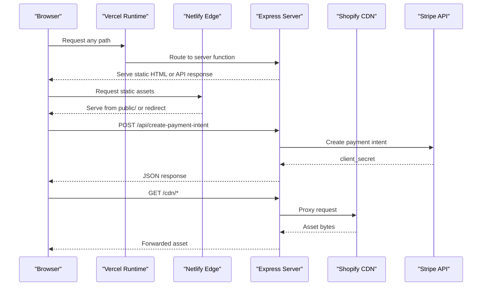
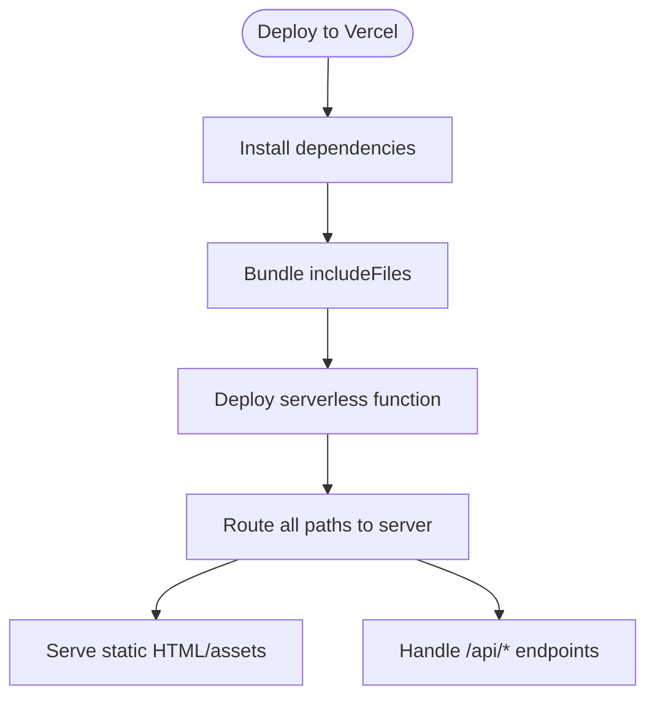
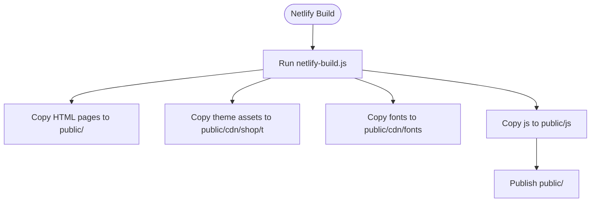
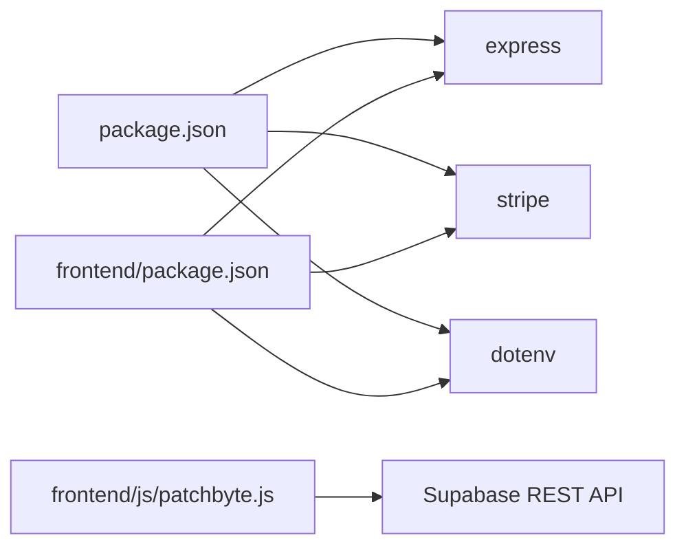

# Deployment Configuration

<cite>
**Referenced Files in This Document**
- [vercel.json](file://vercel.json)
- [frontend/vercel.json](file://frontend/vercel.json)
- [netlify.toml](file://netlify.toml)
- [netlify-build.js](file://netlify-build.js)
- [package.json](file://package.json)
- [api/index.js](file://api/index.js)
- [frontend/server.js](file://frontend/server.js)
- [frontend/package.json](file://frontend/package.json)
- [frontend/js/patchbyte.js](file://frontend/js/patchbyte.js)
</cite>

## Table of Contents
1. Introduction
2. Project Structure
3. Core Components
4. Architecture Overview
5. Detailed Component Analysis
6. Dependency Analysis
7. Performance Considerations
8. Troubleshooting Guide
9. Conclusion
10. Appendices

## Introduction
This document provides deployment configuration guidance for the Patch-Byte application across Vercel and Netlify, including environment variables, build processes, redirects, domain and SSL setup, CI/CD recommendations, monitoring/logging, and troubleshooting. The application serves static HTML pages with a Node.js server that handles Stripe payments and proxies CDN assets to Shopify.

## Project Structure
The repository contains:
- A Node.js Express server that serves static files from frontend/patchkraze.com and handles API routes (Stripe).
- Build scripts and configuration for Netlify to assemble a public/ folder for hosting.
- Vercel configuration to run the server as a serverless function or route all requests to it.
- Frontend JavaScript that integrates cart and contact features via Supabase.

```mermaid
graph TB
subgraph "Frontend"
A["frontend/patchkraze.com/*.html"]
B["frontend/js/patchbyte.js"]
C["frontend/cdn/shop/t/**"]
end
subgraph "Server"
S["frontend/server.js"]
end
subgraph "API"
API["api/index.js"]
end
subgraph "Hosting"
V["Vercel"]
N["Netlify"]
end
A --> S
B --> S
C --> S
S --> V
S --> N
API --> V
```

**Diagram sources**
- [frontend/server.js:46-65](file://frontend/server.js#L46-L65)
- [api/index.js:1-1](file://api/index.js#L1-L1)
- [frontend/vercel.json:1-20](file://frontend/vercel.json#L1-L20)
- [netlify.toml:1-3](file://netlify.toml#L1-L3)

**Section sources**
- [frontend/server.js:1-123](file://frontend/server.js#L1-L123)
- [netlify-build.js:1-28](file://netlify-build.js#L1-L28)
- [frontend/vercel.json:1-20](file://frontend/vercel.json#L1-L20)
- [netlify.toml:1-165](file://netlify.toml#L1-L165)

## Core Components
- Express server: Serves static content, proxies /cdn/* to Shopify, handles Stripe endpoints, and implements clean URL routing with redirects.
- Vercel config: Routes all requests to the server and includes required static assets for serverless functions.
- Netlify config: Defines build command, publish directory, redirects, and CDN proxy rules.
- Build script: Copies necessary assets into public/ for Netlify hosting.
- Environment variables: Stripe keys and runtime port are used by the server.

Key responsibilities:
- Static file serving and clean URL resolution.
- Redirects for moved or missing pages.
- CDN asset proxying to Shopify.
- Payment intent creation and Stripe configuration exposure.

**Section sources**
- [frontend/server.js:17-44](file://frontend/server.js#L17-L44)
- [frontend/server.js:46-111](file://frontend/server.js#L46-L111)
- [vercel.json:1-12](file://vercel.json#L1-L12)
- [frontend/vercel.json:1-20](file://frontend/vercel.json#L1-L20)
- [netlify.toml:1-165](file://netlify.toml#L1-L165)
- [netlify-build.js:16-28](file://netlify-build.js#L16-L28)

## Architecture Overview
The deployment architecture uses a Node.js server to serve static HTML and handle API calls. Vercel runs the server as a serverless function; Netlify builds a static site and serves it through its edge network with redirects and CDN proxies.



**Diagram sources**
- [frontend/server.js:17-44](file://frontend/server.js#L17-L44)
- [frontend/server.js:46-65](file://frontend/server.js#L46-L65)
- [frontend/vercel.json:17-19](file://frontend/vercel.json#L17-L19)
- [netlify.toml:1-3](file://netlify.toml#L1-L3)

## Detailed Component Analysis

### Vercel Deployment
- Function entry: api/index.js re-exports the Express app from frontend/server.js.
- Routing: All paths are routed to the server function.
- IncludeFiles: Ensures static assets (HTML, JS, theme assets) are bundled with the function.
- Alternative: frontend/vercel.json defines a Node build targeting server.js with includeFiles and routes.

Environment variables:
- STRIPE_SECRET_KEY: Required for creating payment intents.
- STRIPE_PUBLISHABLE_KEY: Exposed to clients via /api/stripe-config.
- PORT: Used locally; Vercel injects runtime port automatically.

Build process:
- No explicit build step is required; dependencies are installed at runtime on Vercel.



**Diagram sources**
- [api/index.js:1-1](file://api/index.js#L1-L1)
- [vercel.json:1-12](file://vercel.json#L1-L12)
- [frontend/vercel.json:1-20](file://frontend/vercel.json#L1-L20)
- [frontend/server.js:17-44](file://frontend/server.js#L17-L44)

**Section sources**
- [api/index.js:1-1](file://api/index.js#L1-L1)
- [vercel.json:1-12](file://vercel.json#L1-L12)
- [frontend/vercel.json:1-20](file://frontend/vercel.json#L1-L20)
- [frontend/server.js:17-44](file://frontend/server.js#L17-L44)

### Netlify Deployment
- Build command: Executes netlify-build.js to copy assets into public/.
- Publish directory: public/.
- Node version: Set to 18 in build.environment.
- Redirects: Permanent (301) and temporary (302) redirects for products, collections, pages, policies, and clean URLs.
- CDN proxies: Forwards /cdn/* paths to Shopify CDN.

Build process:
- Copies HTML pages, theme assets, fonts, and patchbyte.js into public/.
- Skips nested cdn/ inside patchkraze.com during copy to avoid duplication.



**Diagram sources**
- [netlify.toml:1-7](file://netlify.toml#L1-L7)
- [netlify-build.js:16-28](file://netlify-build.js#L16-L28)

**Section sources**
- [netlify.toml:1-165](file://netlify.toml#L1-L165)
- [netlify-build.js:1-28](file://netlify-build.js#L1-L28)

### Environment Variables
- STRIPE_SECRET_KEY: Enables server-side payment intent creation.
- STRIPE_PUBLISHABLE_KEY: Returned by /api/stripe-config for client usage.
- PORT: Used when running locally; platform-specific for deployments.

Where they are used:
- Server reads Stripe keys and sets up the Stripe client.
- Server exposes publishable key to clients.
- Local development uses dotenv to load .env from the project root.

**Section sources**
- [frontend/server.js:6-9](file://frontend/server.js#L6-L9)
- [frontend/server.js:17-44](file://frontend/server.js#L17-L44)

### Domain Configuration, SSL, and CDN
- Domains: Configure custom domains in Vercel and Netlify dashboards. Both platforms provide automatic HTTPS/SSL.
- CDN: Netlify serves assets via its global CDN. Vercel also uses a CDN for static assets and serverless responses.
- Shopify CDN: The server proxies /cdn/* to Shopify CDN; Netlify also includes redirects to proxy specific CDN paths.

Best practices:
- Use platform-native SSL (no need to manage certificates manually).
- Ensure canonical URLs and redirects are consistent across environments.

[No sources needed since this section provides general guidance]

### Continuous Integration and Deployment
- Vercel: Connect your repository; Vercel auto-detects Node.js and deploys based on vercel.json. Add environment variables in the Vercel dashboard per project and branch.
- Netlify: Connect your repository; Netlify will run the configured build command and publish the public/ directory. Add environment variables in the Netlify dashboard.
- Branch-based deployments: Use preview deployments for feature branches to validate changes before merging.
- Rollbacks: Use platform history to revert to previous deployments.

[No sources needed since this section provides general guidance]

### Monitoring and Logging
- Server logs: Console output from the Express server is captured by Vercel and Netlify. Review logs in their respective dashboards.
- Error tracking: Add error handling middleware and integrate an external service (e.g., Sentry) for production monitoring.
- Metrics: Enable platform analytics and consider adding uptime checks and performance monitoring.

[No sources needed since this section provides general guidance]

## Dependency Analysis
The server depends on Express, Stripe SDK, and dotenv. The frontend includes patchbyte.js which interacts with Supabase REST API for cart and contact submissions.



**Diagram sources**
- [package.json:9-13](file://package.json#L9-L13)
- [frontend/package.json:13-17](file://frontend/package.json#L13-L17)
- [frontend/js/patchbyte.js:10-17](file://frontend/js/patchbyte.js#L10-L17)

**Section sources**
- [package.json:1-14](file://package.json#L1-L14)
- [frontend/package.json:1-19](file://frontend/package.json#L1-L19)
- [frontend/js/patchbyte.js:1-345](file://frontend/js/patchbyte.js#L1-L345)

## Performance Considerations
- Prefer Netlify’s edge caching for static assets; ensure appropriate cache headers for images and fonts.
- Minimize payload sizes by excluding unnecessary files from builds (the build script already skips nested cdn/).
- Use platform CDNs for global distribution.
- Keep serverless functions small; offload heavy processing to external services where possible.

[No sources needed since this section provides general guidance]

## Troubleshooting Guide
Common issues and resolutions:
- Missing Stripe keys: If STRIPE_SECRET_KEY is not set, payment intent creation returns an error. Verify environment variables in the platform dashboard.
- 404 on clean URLs: Ensure redirects and static file resolution are correct; the server tries .html and index.html variants.
- CDN assets not loading: Confirm /cdn/* proxying works; check Shopify CDN availability and CORS if applicable.
- Build failures on Netlify: Validate netlify-build.js copies required assets; ensure Node version matches configured value.
- Vercel function bundling: Confirm includeFiles lists all necessary static assets so they are available at runtime.

Rollback procedures:
- Vercel: Revert to a previous deployment using the dashboard or CLI.
- Netlify: Use deploy history to rollback to a known good state.

**Section sources**
- [frontend/server.js:17-44](file://frontend/server.js#L17-L44)
- [frontend/server.js:92-111](file://frontend/server.js#L92-L111)
- [netlify.toml:8-165](file://netlify.toml#L8-L165)
- [netlify-build.js:16-28](file://netlify-build.js#L16-L28)

## Conclusion
Patch-Byte can be deployed on Vercel and Netlify with minimal configuration. Vercel routes all requests to a Node.js server that serves static content and handles Stripe payments. Netlify builds a static site with robust redirects and CDN proxies. Ensure environment variables are correctly set, monitor logs, and use platform tools for rollbacks and performance optimization.

[No sources needed since this section summarizes without analyzing specific files]

## Appendices

### API Endpoints
- POST /api/create-payment-intent: Creates a Stripe payment intent; requires STRIPE_SECRET_KEY.
- GET /api/stripe-config: Returns STRIPE_PUBLISHABLE_KEY for client initialization.

**Section sources**
- [frontend/server.js:17-44](file://frontend/server.js#L17-L44)

### Redirects Summary
- Permanent redirects (301): Product and collection renames, policy fallbacks.
- Temporary redirects (302): Content pages not yet built.
- Clean URLs: Map slug paths to .html files.
- CDN proxies: Forward /cdn/* to Shopify CDN.

**Section sources**
- [netlify.toml:8-165](file://netlify.toml#L8-L165)
- [frontend/server.js:67-90](file://frontend/server.js#L67-L90)