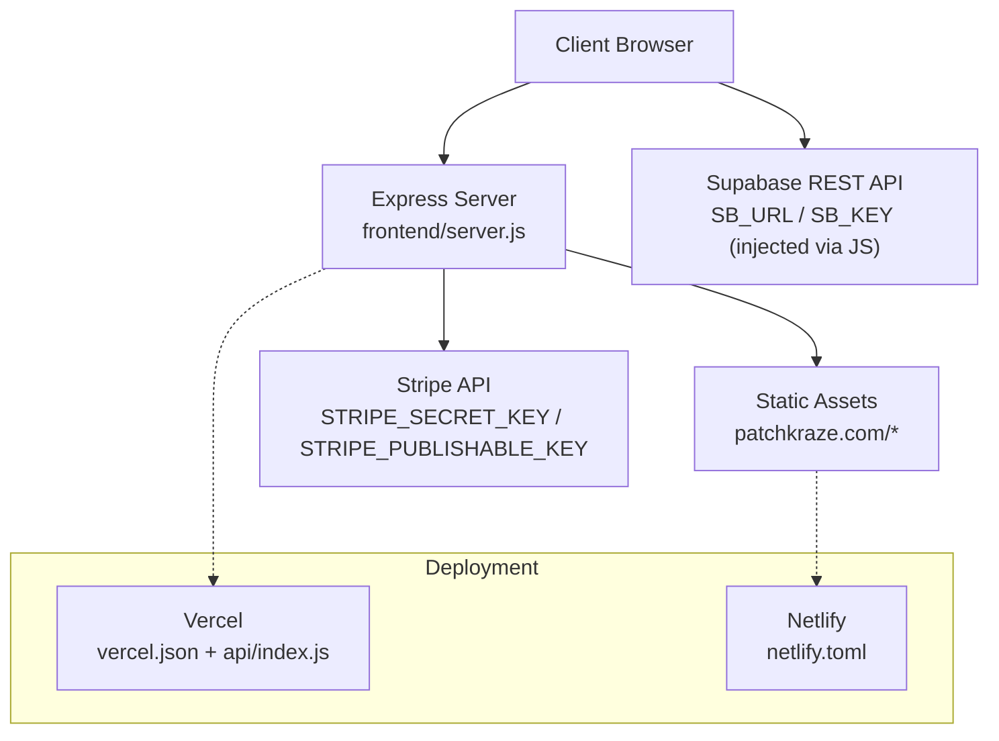
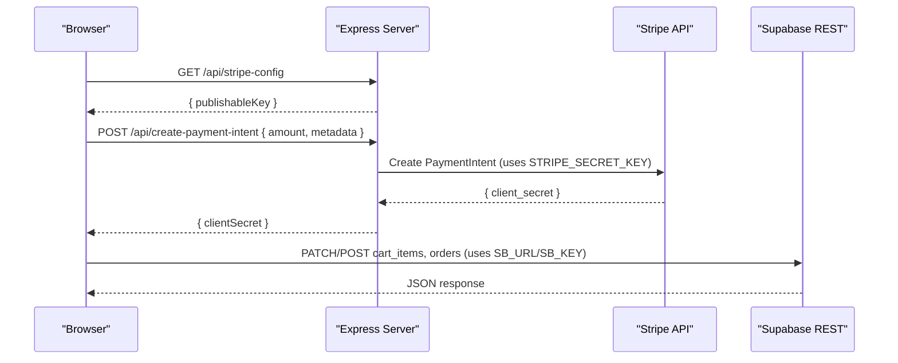
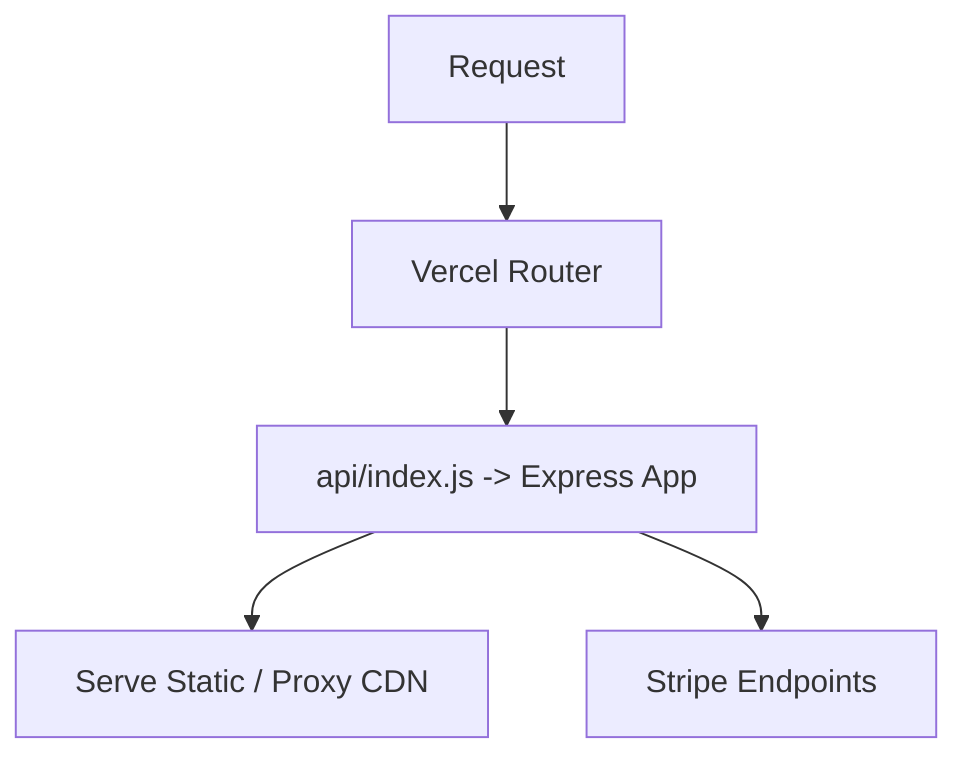
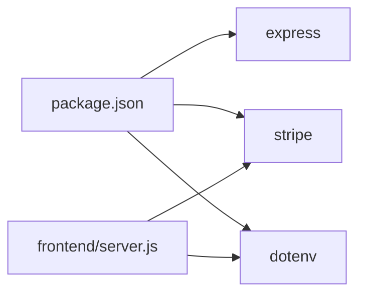

# Environment Configuration

<cite>
**Referenced Files in This Document**
- [package.json](file://package.json)
- [frontend/server.js](file://frontend/server.js)
- [api/index.js](file://api/index.js)
- [vercel.json](file://vercel.json)
- [frontend/vercel.json](file://frontend/vercel.json)
- [netlify.toml](file://netlify.toml)
- [frontend/js/patchbyte.js](file://frontend/js/patchbyte.js)
- [migrate-tables.sql](file://migrate-tables.sql)
- [seed-products.ps1](file://seed-products.ps1)
</cite>

## Table of Contents
1. Introduction
2. Project Structure
3. Core Components
4. Architecture Overview
5. Detailed Component Analysis
6. Dependency Analysis
7. Performance Considerations
8. Troubleshooting Guide
9. Conclusion
10. Appendices

## Introduction
This document explains how to configure the Patch-Byte application across development, staging, and production environments. It covers environment variable management for database connections (Supabase), payment processing (Stripe), and third-party integrations. It also details environment-specific configurations for Vercel and Netlify, configuration loading and precedence, secure practices, credential rotation, testing strategies, debugging, and monitoring/logging guidance.

## Project Structure
Patch-Byte is a Node.js Express server that serves static site assets and provides API endpoints for payments. The frontend includes JavaScript that integrates with Supabase for cart and checkout operations. Deployment targets include Vercel (serverless functions) and Netlify (static hosting with redirects).

**Diagram sources**
- [frontend/server.js:1-48](file://frontend/server.js#L1-L48)
- [vercel.json:1-12](file://vercel.json#L1-L12)
- [frontend/vercel.json:1-20](file://frontend/vercel.json#L1-L20)
- [netlify.toml:1-165](file://netlify.toml#L1-L165)
- [frontend/js/patchbyte.js:1-35](file://frontend/js/patchbyte.js#L1-L35)

**Section sources**
- [frontend/server.js:1-48](file://frontend/server.js#L1-L48)
- [vercel.json:1-12](file://vercel.json#L1-L12)
- [frontend/vercel.json:1-20](file://frontend/vercel.json#L1-L20)
- [netlify.toml:1-165](file://netlify.toml#L1-L165)
- [frontend/js/patchbyte.js:1-35](file://frontend/js/patchbyte.js#L1-L35)

## Core Components
- Express server: Loads environment variables, initializes Stripe, serves static files, proxies CDN assets, and exposes payment endpoints.
- Payment integration: Creates Stripe PaymentIntents and exposes publishable key to the client.
- Frontend Supabase integration: Hardcoded Supabase URL and anon key are used by the injected script to manage cart and orders.
- Deployment configs: Vercel routes all requests to the serverless function; Netlify uses build/publish and redirects/proxies.

Key environment variables observed or implied:
- STRIPE_SECRET_KEY: Used on the server to initialize Stripe SDK.
- STRIPE_PUBLISHABLE_KEY: Exposed to the client via an API endpoint.
- PORT: Server listen port (defaults to 3000).
- Supabase URL and anon key: Currently embedded in the frontend script; should be externalized per environment.

Security notes:
- Never commit secrets to version control.
- Use platform secret managers (Vercel/Netlify environment variables).
- Restrict Supabase anon key permissions using Row Level Security policies.

**Section sources**
- [frontend/server.js:6-44](file://frontend/server.js#L6-L44)
- [frontend/js/patchbyte.js:10-17](file://frontend/js/patchbyte.js#L10-L17)
- [migrate-tables.sql:36-56](file://migrate-tables.sql#L36-L56)

## Architecture Overview
The runtime loads environment variables at startup. On local development, dotenv loads from a .env file in the project root. In hosted environments, the platform injects environment variables at runtime. The server then configures Stripe and serves static content. The frontend calls backend APIs for payments and directly calls Supabase for cart/order data.

**Diagram sources**
- [frontend/server.js:17-44](file://frontend/server.js#L17-L44)
- [frontend/js/patchbyte.js:31-65](file://frontend/js/patchbyte.js#L31-L65)

## Detailed Component Analysis

### Environment Variable Loading and Precedence
- Local development: dotenv attempts to load a .env file located one level above the server directory. If missing, it fails silently and continues.
- Production (Vercel/Netlify): Platform injects environment variables at runtime; no .env file is required.
- Priority: Runtime environment variables override any values loaded from .env.

Recommendation:
- Keep a .env.example in the repository with placeholder keys.
- Configure actual secrets in the deployment platform’s environment settings.

**Section sources**
- [frontend/server.js:6-7](file://frontend/server.js#L6-L7)

### Stripe Integration
- Server-side secret: Initialized only when STRIPE_SECRET_KEY is present.
- Client-side public key: Provided via /api/stripe-config so the client never needs to guess.
- Payment flow: Client requests a PaymentIntent, confirms payment, then persists order data to Supabase.

Operational notes:
- Validate amounts on the server before creating intents.
- Log errors centrally and avoid leaking sensitive details to clients.

**Section sources**
- [frontend/server.js:9-44](file://frontend/server.js#L9-L44)

### Supabase Integration (Frontend)
- Current state: Supabase URL and anon key are hardcoded in the frontend script.
- Risk: Keys are exposed in client code; ensure RLS policies restrict access appropriately.
- Improvement: Externalize SB_URL and SB_KEY via a build-time or runtime mechanism and inject them into the page.

Database schema and policies:
- Migration adds fields to cart_items, orders, order_items, contact_submissions.
- RLS policies allow anonymous inserts/reads for these tables (suitable for guest carts but review for production sensitivity).

**Section sources**
- [frontend/js/patchbyte.js:10-17](file://frontend/js/patchbyte.js#L10-L17)
- [migrate-tables.sql:1-56](file://migrate-tables.sql#L1-L56)

### Deployment Configurations

#### Vercel
- All routes rewrite to the serverless function at api/index.js, which re-exports the Express app.
- Function includes necessary static assets and scripts.
- Environment variables must be set in Vercel project settings.

**Diagram sources**
- [vercel.json:1-12](file://vercel.json#L1-L12)
- [api/index.js:1-1](file://api/index.js#L1-L1)
- [frontend/server.js:1-48](file://frontend/server.js#L1-L48)

**Section sources**
- [vercel.json:1-12](file://vercel.json#L1-L12)
- [api/index.js:1-1](file://api/index.js#L1-L1)
- [frontend/vercel.json:1-20](file://frontend/vercel.json#L1-L20)

#### Netlify
- Build command runs a custom script; publishes to a public folder.
- Redirects handle clean URLs and proxy Shopify CDN assets.
- Environment variables configured in Netlify UI.

**Section sources**
- [netlify.toml:1-165](file://netlify.toml#L1-L165)

### Configuration Hierarchy and Prioritization
- Order of precedence (highest to lowest):
  1) Platform runtime environment variables (Vercel/Netlify)
  2) Process environment variables (OS-level)
  3) .env file (local dev only, loaded by dotenv)
- Best practice: Always define critical variables in the deployment platform; use .env only locally.

**Section sources**
- [frontend/server.js:6-7](file://frontend/server.js#L6-L7)

### Security Implications
- Stripe:
  - STRIPE_SECRET_KEY must remain server-only.
  - STRIPE_PUBLISHABLE_KEY can be exposed to the client via a safe endpoint.
- Supabase:
  - Anon key is visible in client code; enforce strict RLS policies.
  - Limit table access to only what is needed.
- Secrets management:
  - Use platform secret stores.
  - Rotate keys regularly and audit access logs.

**Section sources**
- [frontend/server.js:9-44](file://frontend/server.js#L9-L44)
- [migrate-tables.sql:36-56](file://migrate-tables.sql#L36-L56)

## Dependency Analysis
Runtime dependencies relevant to configuration:
- express: HTTP server.
- stripe: Payment processing SDK.
- dotenv: Optional local env loader.

These are declared in the package manifests and consumed at runtime.

**Diagram sources**
- [package.json:1-14](file://package.json#L1-L14)
- [frontend/server.js:1-15](file://frontend/server.js#L1-L15)

**Section sources**
- [package.json:1-14](file://package.json#L1-L14)
- [frontend/server.js:1-15](file://frontend/server.js#L1-L15)

## Performance Considerations
- Cache CDN assets: The server sets cache headers for proxied CDN responses.
- Minimize server work: Prefer static serving and platform-level redirects (Netlify) where possible.
- Avoid unnecessary DB calls: Cache cart counts client-side and refresh sparingly.

[No sources needed since this section provides general guidance]

## Troubleshooting Guide
Common issues and checks:
- Stripe not configured:
  - Symptom: Payment endpoint returns an error indicating Stripe is not configured.
  - Fix: Ensure STRIPE_SECRET_KEY is set in the runtime environment.
- Invalid amount:
  - Symptom: 400 error on payment intent creation.
  - Fix: Send positive integer cents from the client.
- Supabase connectivity:
  - Symptom: Cart/orders fail to save.
  - Fix: Verify SB_URL and SB_KEY in the frontend script and confirm RLS policies allow the intended operations.
- CDN assets 404:
  - Symptom: Missing images/styles.
  - Fix: Confirm proxy rules in server or Netlify redirects are correct.

Logging:
- Server logs Stripe errors to console; integrate a structured logger in production.
- Frontend logs errors to console; capture via your analytics/logging pipeline.

**Section sources**
- [frontend/server.js:17-44](file://frontend/server.js#L17-L44)
- [frontend/js/patchbyte.js:227-232](file://frontend/js/patchbyte.js#L227-L232)

## Conclusion
Patch-Byte relies on a small set of environment variables for Stripe and optionally for Supabase. For robust multi-environment support, externalize all secrets through your deployment platform, enforce strict RLS for Supabase, and centralize logging. Use the provided deployment configs as a baseline and tailor them to your security and performance requirements.

[No sources needed since this section summarizes without analyzing specific files]

## Appendices

### Environment Variables Reference
- STRIPE_SECRET_KEY: Server-side secret for Stripe initialization.
- STRIPE_PUBLISHABLE_KEY: Public key exposed to the client via /api/stripe-config.
- PORT: Server listen port (default 3000).
- Supabase URL and anon key: Currently embedded in the frontend script; recommend moving to a configurable injection point.

**Section sources**
- [frontend/server.js:9-44](file://frontend/server.js#L9-L44)
- [frontend/js/patchbyte.js:10-17](file://frontend/js/patchbyte.js#L10-L17)

### Example .env (Local Development Only)
Create a .env file in the project root for local development. Do not commit real secrets.

- STRIPE_SECRET_KEY=sk_test_...
- STRIPE_PUBLISHABLE_KEY=pk_test_...
- PORT=3000

Note: Replace placeholders with your test credentials.

**Section sources**
- [frontend/server.js:6-7](file://frontend/server.js#L6-L7)

### Credential Rotation Procedures
- Stripe:
  - Generate new keys in the Stripe dashboard.
  - Update runtime environment variables in Vercel/Netlify.
  - Roll out changes and verify payment flows.
  - Revoke old keys after validation.
- Supabase:
  - Regenerate anon key if compromised.
  - Update the frontend script or injection mechanism.
  - Review and tighten RLS policies as needed.
  - Monitor logs for authentication failures during rotation.

**Section sources**
- [frontend/server.js:9-44](file://frontend/server.js#L9-L44)
- [migrate-tables.sql:36-56](file://migrate-tables.sql#L36-L56)

### Testing Configurations Across Environments
- Local:
  - Run the server with dotenv; validate endpoints and static asset serving.
- Staging:
  - Mirror production environment variables.
  - Use Stripe test mode; verify RLS policies with sample data.
- Production:
  - Use Stripe live mode keys.
  - Enable comprehensive logging and error tracking.

**Section sources**
- [frontend/server.js:17-44](file://frontend/server.js#L17-L44)
- [migrate-tables.sql:1-56](file://migrate-tables.sql#L1-L56)

### Monitoring and Logging Setup
- Server:
  - Add structured logging for requests, errors, and Stripe events.
  - Export metrics (e.g., request latency, error rates) to your observability platform.
- Frontend:
  - Capture JS errors and user interactions via your analytics/logging service.
- Database:
  - Monitor Supabase query performance and RLS policy hits.

[No sources needed since this section provides general guidance]

### Data Model Notes (Supabase)
Tables involved in cart and orders:
- cart_items: session-scoped items with product details and properties.
- orders: customer info, shipping address, totals, status.
- order_items: line items linked to orders.
- contact_submissions: contact form entries.

Policies:
- RLS allows anonymous access for these tables; adjust for stricter security in production.

**Section sources**
- [migrate-tables.sql:1-56](file://migrate-tables.sql#L1-L56)

### Seed Script Usage
A PowerShell script exists to seed products into Supabase from local HTML files. It uses Supabase URL and anon key. Update credentials before running in non-local environments.

**Section sources**
- [seed-products.ps1:1-87](file://seed-products.ps1#L1-L87)