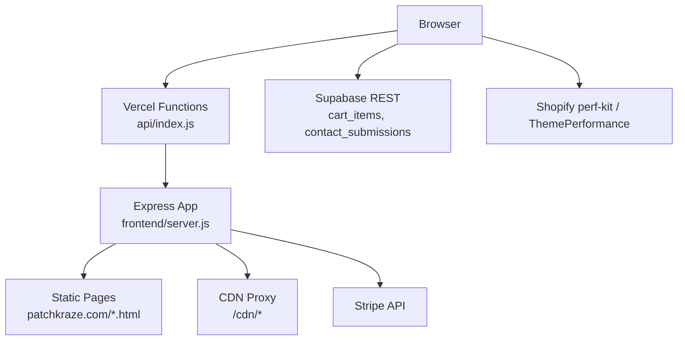
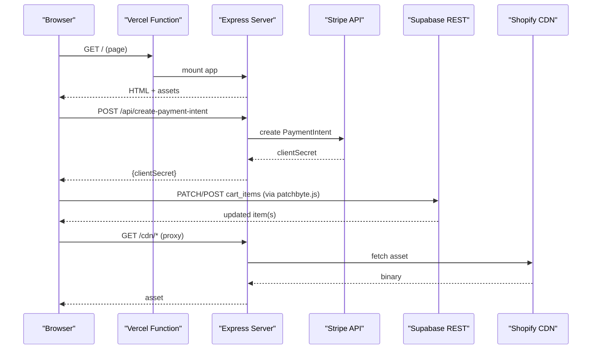
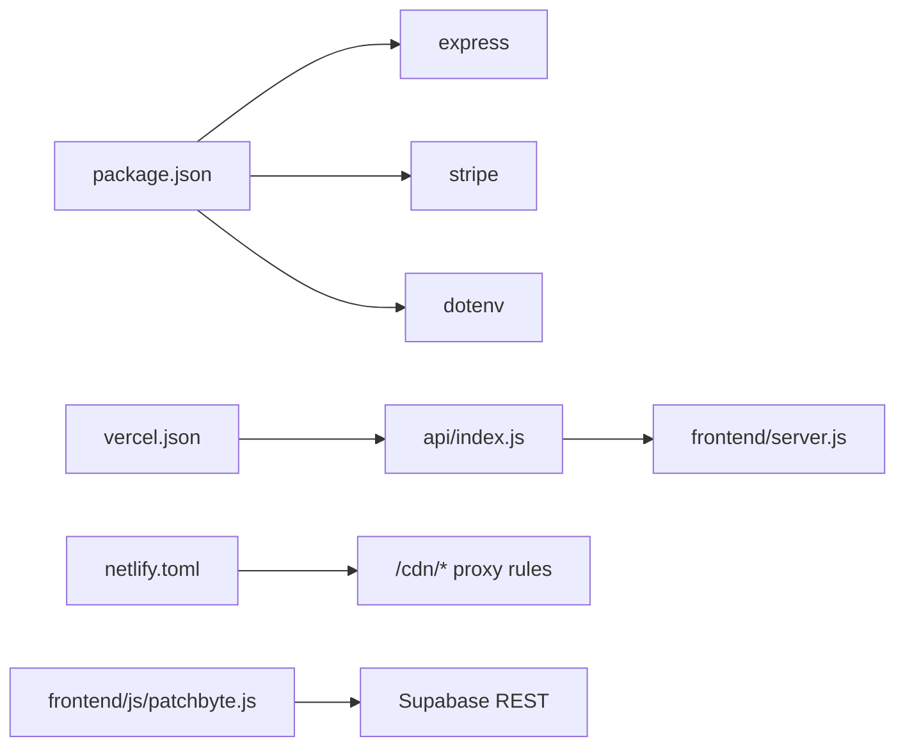

# Monitoring and Logging

<cite>
**Referenced Files in This Document**
- [frontend/server.js](file://frontend/server.js)
- [api/index.js](file://api/index.js)
- [package.json](file://package.json)
- [vercel.json](file://vercel.json)
- [netlify.toml](file://netlify.toml)
- [frontend/js/patchbyte.js](file://frontend/js/patchbyte.js)
- [frontend/cdn/shop/t/38/assets/performance.js](file://frontend/cdn/shop/t/38/assets/performance.js)
</cite>

## Table of Contents
1. [Introduction](#introduction)
2. [Project Structure](#project-structure)
3. [Core Components](#core-components)
4. [Architecture Overview](#architecture-overview)
5. [Detailed Component Analysis](#detailed-component-analysis)
6. [Dependency Analysis](#dependency-analysis)
7. [Performance Considerations](#performance-considerations)
8. [Troubleshooting Guide](#troubleshooting-guide)
9. [Conclusion](#conclusion)
10. [Appendices](#appendices)

## Introduction
This document provides production-grade monitoring and logging guidance for the Patch-Byte application. It covers error tracking, structured logging, performance monitoring, alerting, log aggregation, metrics collection for business KPIs, observability dashboards, incident response procedures, and security monitoring. The guidance is tailored to the current codebase, which uses an Express server with a Stripe integration and a client-side cart/checkout overlay that communicates with Supabase.

## Project Structure
The backend is a minimal Express app serving static pages and handling payment intents. The frontend includes a custom script that intercepts Shopify-style cart interactions and persists data to Supabase. Performance measurement utilities exist on the client side.

**Diagram sources**
- [api/index.js:1-1](file://api/index.js#L1-L1)
- [frontend/server.js:1-123](file://frontend/server.js#L1-L123)
- [frontend/js/patchbyte.js:1-345](file://frontend/js/patchbyte.js#L1-L345)
- [frontend/cdn/shop/t/38/assets/performance.js:1-62](file://frontend/cdn/shop/t/38/assets/performance.js#L1-L62)

**Section sources**
- [frontend/server.js:1-123](file://frontend/server.js#L1-L123)
- [api/index.js:1-1](file://api/index.js#L1-L1)
- [vercel.json:1-12](file://vercel.json#L1-L12)
- [netlify.toml:1-165](file://netlify.toml#L1-L165)

## Core Components
- Express server: serves static content, proxies CDN assets, handles Stripe PaymentIntent creation and exposes publishable key.
- Client overlay (PatchByte): intercepts cart add/change requests, syncs cart to Supabase, updates UI badges/toasts, and wires contact form submission.
- Frontend performance utilities: ThemePerformance class and Shopify perf-kit integration capture navigation and interaction metrics.

Key responsibilities:
- Error handling: Stripe errors are caught and returned as JSON; client-side errors are logged via console.error.
- Structured logging: currently minimal; recommendations provided below.
- Performance monitoring: client-side timing exists; server-side request/response timing not yet implemented.
- Business metrics: no explicit analytics pipeline; recommendations provided below.

**Section sources**
- [frontend/server.js:17-44](file://frontend/server.js#L17-L44)
- [frontend/js/patchbyte.js:67-163](file://frontend/js/patchbyte.js#L67-L163)
- [frontend/cdn/shop/t/38/assets/performance.js:1-62](file://frontend/cdn/shop/t/38/assets/performance.js#L1-L62)

## Architecture Overview
The runtime flow spans browser, serverless functions, Express, external APIs (Stripe, Supabase), and CDN proxying. Observability should be added at each boundary.

**Diagram sources**
- [frontend/server.js:17-65](file://frontend/server.js#L17-L65)
- [frontend/js/patchbyte.js:67-163](file://frontend/js/patchbyte.js#L67-L163)

## Detailed Component Analysis

### Express Server: Request Handling and Errors
- JSON parsing middleware is enabled.
- Payment intent endpoint validates amount and calls Stripe; errors are caught and returned as JSON with status 400; unhandled exceptions will propagate to framework-level error handling.
- CDN proxy forwards responses and sets cache headers; network errors return 404.
- Static file serving and clean URL routing handle page resolution; missing pages return 404.

Recommendations for production:
- Add request logging middleware that records method, path, user agent, IP, and response time.
- Centralize error handling with a global error handler that logs stack traces and correlates by request ID.
- Add health check endpoint (/health) for uptime monitors.
- Add rate limiting for sensitive endpoints like /api/create-payment-intent.

**Section sources**
- [frontend/server.js:15-111](file://frontend/server.js#L15-L111)

### Stripe Integration: Error Tracking
- Validates input and returns structured errors when invalid.
- Logs Stripe errors to console; in production, forward to a centralized logging service.

Recommendations:
- Correlate Stripe events with request IDs.
- Track success/failure rates and latency percentiles for payment intent creation.
- Alert on repeated Stripe errors or configuration issues.

**Section sources**
- [frontend/server.js:17-39](file://frontend/server.js#L17-L39)

### Client-Side Cart Overlay: Logging and Metrics
- Intercepts Shopify-style cart calls and routes to Supabase.
- Updates cart badge and shows toast notifications.
- Logs errors to console.error for cart add and contact form failures.

Recommendations:
- Emit structured events for user actions (add-to-cart, update quantity, clear cart, submit contact).
- Capture timing for Supabase calls and UI updates.
- Report errors to a centralized error tracker with context (session ID, product slug, quantities).

**Section sources**
- [frontend/js/patchbyte.js:67-163](file://frontend/js/patchbyte.js#L67-L163)
- [frontend/js/patchbyte.js:165-233](file://frontend/js/patchbyte.js#L165-L233)
- [frontend/js/patchbyte.js:237-263](file://frontend/js/patchbyte.js#L237-L263)

### Frontend Performance Utilities
- ThemePerformance class provides markers/measures for custom benchmarks.
- Shopify perf-kit captures navigation and interaction metrics and sends them via Monorail/Trekkie.

Recommendations:
- Use ThemePerformance to measure critical user journeys (e.g., add-to-cart flow, checkout initiation).
- Ensure perf-kit is initialized and sending metrics; monitor event emission and failure paths.

**Section sources**
- [frontend/cdn/shop/t/38/assets/performance.js:1-62](file://frontend/cdn/shop/t/38/assets/performance.js#L1-L62)

## Dependency Analysis
- Backend depends on Express, Stripe, and dotenv.
- Deployment targets:
  - Vercel: rewrites all routes to api/index.js, which mounts the Express app.
  - Netlify: build command and redirects/proxies for CDN assets.
- Client depends on Supabase REST and Shopify’s built-in analytics/perf-kit.

**Diagram sources**
- [package.json:1-14](file://package.json#L1-L14)
- [vercel.json:1-12](file://vercel.json#L1-L12)
- [netlify.toml:135-165](file://netlify.toml#L135-L165)
- [api/index.js:1-1](file://api/index.js#L1-L1)
- [frontend/server.js:1-123](file://frontend/server.js#L1-L123)
- [frontend/js/patchbyte.js:1-345](file://frontend/js/patchbyte.js#L1-L345)

**Section sources**
- [package.json:1-14](file://package.json#L1-L14)
- [vercel.json:1-12](file://vercel.json#L1-L12)
- [netlify.toml:1-165](file://netlify.toml#L1-L165)

## Performance Considerations
- Server-side:
  - Add request duration metrics per route and aggregate p50/p95/p99 latencies.
  - Instrument Stripe API call durations and error rates.
  - Cache CDN-proxied assets appropriately; ensure upstream caching headers are respected.
- Client-side:
  - Use ThemePerformance to mark start/end points for key flows.
  - Leverage Shopify perf-kit metrics already present; verify they are being emitted.
  - Monitor long tasks and slow interactions using existing perf-kit hooks.

[No sources needed since this section provides general guidance]

## Troubleshooting Guide
Common issues and where to look:
- Stripe errors: Check server logs around /api/create-payment-intent; validate amount and environment variables.
- CDN proxy failures: Inspect 404 responses from /cdn/* and upstream Shopify CDN availability.
- Client cart errors: Console errors tagged with [PatchByte]; verify Supabase connectivity and RLS policies.
- Contact form failures: Check console errors and Supabase table writes.

Operational steps:
- Add correlation IDs to requests and include them in all logs.
- Centralize error reporting for both server and client.
- Implement health checks and readiness probes.

**Section sources**
- [frontend/server.js:17-65](file://frontend/server.js#L17-L65)
- [frontend/js/patchbyte.js:227-263](file://frontend/js/patchbyte.js#L227-L263)

## Conclusion
The Patch-Byte application has a lightweight Express server and a robust client-side cart overlay. To achieve production-grade observability, implement structured request/response logging, centralize error tracking, instrument performance metrics on both sides, and set up alerting and dashboards for critical signals. Integrate business KPIs and security monitoring to maintain visibility into conversion funnels and threats.

[No sources needed since this section summarizes without analyzing specific files]

## Appendices

### A. Structured Logging Implementation Plan
- Server:
  - Middleware to parse and attach request ID, timestamp, method, path, userAgent, ip.
  - Log before/after each request with duration and status code.
  - Global error handler to log stack traces and context.
- Client:
  - Wrap fetch and Supabase calls to emit structured events with timing and result codes.
  - Capture user actions: add-to-cart, update quantity, clear cart, submit contact.
  - Send errors to a centralized error tracker with session ID and product context.

[No sources needed since this section provides implementation guidance]

### B. Performance Monitoring Setup
- Server:
  - Measure route-level latency; track Stripe API latency separately.
  - Export metrics to a time-series database; create dashboards for error rates and latency percentiles.
- Client:
  - Use ThemePerformance for custom benchmarks.
  - Ensure Shopify perf-kit emits navigation and interaction metrics; monitor event emission and failures.

[No sources needed since this section provides implementation guidance]

### C. Alerting Configuration
- Critical errors: Stripe API failures, 5xx server errors, Supabase connection errors.
- High latency: p95/p99 thresholds for key endpoints and user journeys.
- Resource exhaustion: memory/CPU spikes, process restarts, function cold starts.
- Channels: PagerDuty/Slack/email based on severity.

[No sources needed since this section provides implementation guidance]

### D. Log Aggregation and Analysis
- Aggregate server logs to a centralized system (e.g., cloud logging service).
- Ingest client errors and performance events into the same platform.
- Create queries for:
  - Top error stacks and their frequencies.
  - Slowest endpoints and users.
  - Conversion funnel drop-offs.

[No sources needed since this section provides implementation guidance]

### E. Business Metrics Collection
- Define events:
  - add_to_cart, update_cart_quantity, clear_cart, begin_checkout, purchase_completed.
- Enrich with:
  - Product identifiers, quantities, unit prices, currency, session ID.
- Pipeline:
  - Client emits events -> analytics ingestion -> warehouse -> BI dashboards.
- KPIs:
  - Conversion rate, cart abandonment rate, revenue per session, average order value.

[No sources needed since this section provides implementation guidance]

### F. Observability Dashboards
- Suggested panels:
  - Request volume, error rate, latency percentiles.
  - Stripe success/failure rate and latency.
  - Supabase read/write throughput and errors.
  - Client-side performance: TTFB, LCP, INP, long tasks.
  - Business KPIs: conversions, abandonment, revenue.

[No sources needed since this section provides implementation guidance]

### G. Incident Response Procedures
- Detection:
  - Alerts on error rate spikes, latency breaches, and resource exhaustion.
- Triage:
  - Use correlation IDs to trace affected requests across services.
  - Check recent deployments and configuration changes.
- Mitigation:
  - Rollback if necessary; enable circuit breakers or fallbacks.
- Postmortem:
  - Document root cause, impact, and remediation steps.

[No sources needed since this section provides implementation guidance]

### H. Security Monitoring
- Suspicious activities:
  - Unusual spikes in /api/create-payment-intent calls.
  - Repeated failed attempts indicating credential stuffing or abuse.
- Controls:
  - Rate limiting on sensitive endpoints.
  - Input validation and sanitization.
  - Monitor for anomalous user agents and IPs.
- Alerts:
  - Threshold-based alerts for abnormal traffic patterns.

[No sources needed since this section provides implementation guidance]