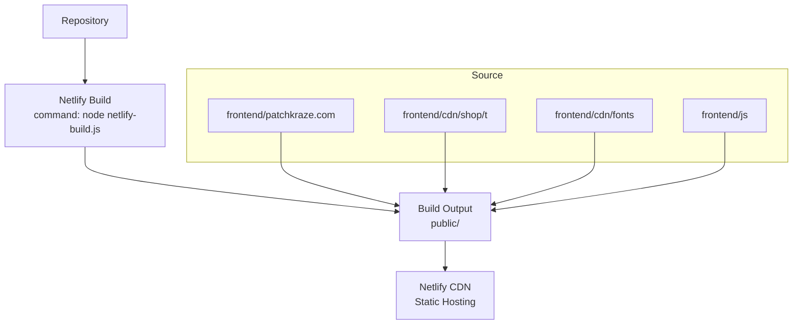
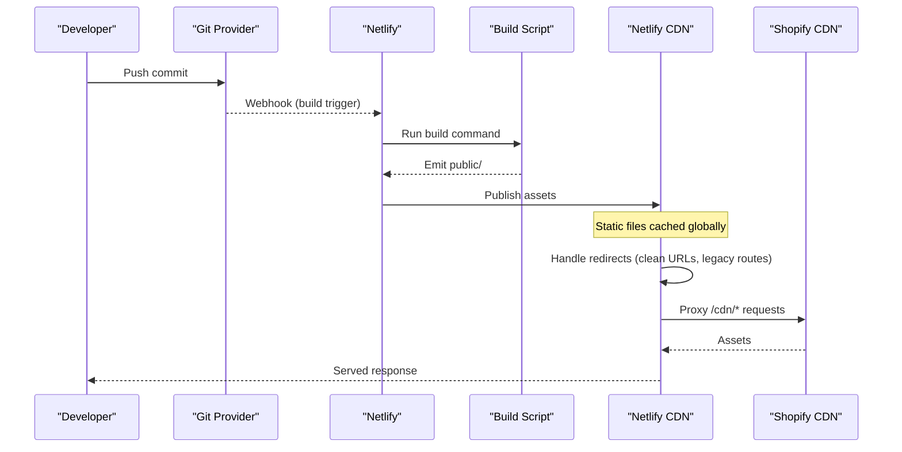
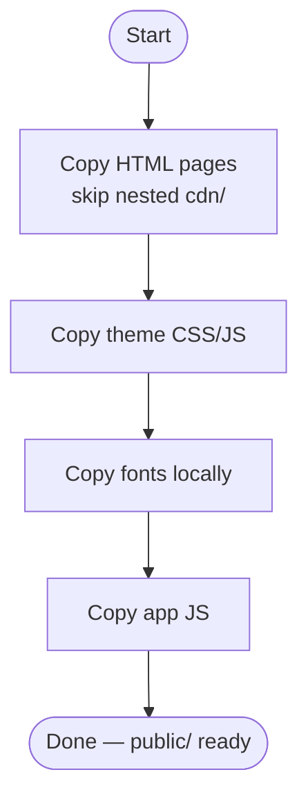
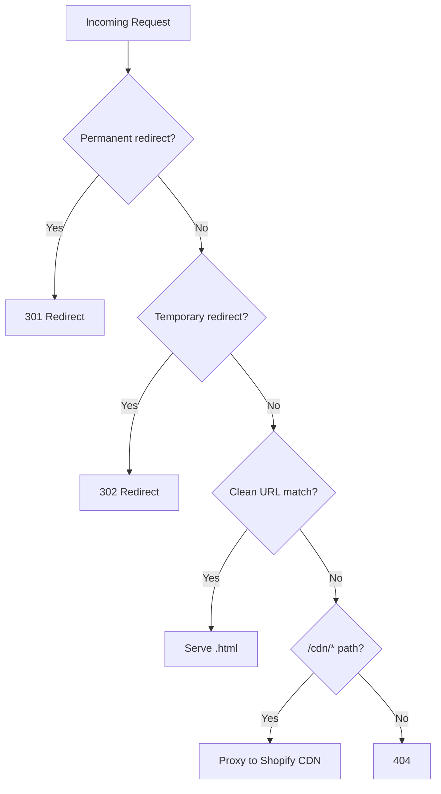
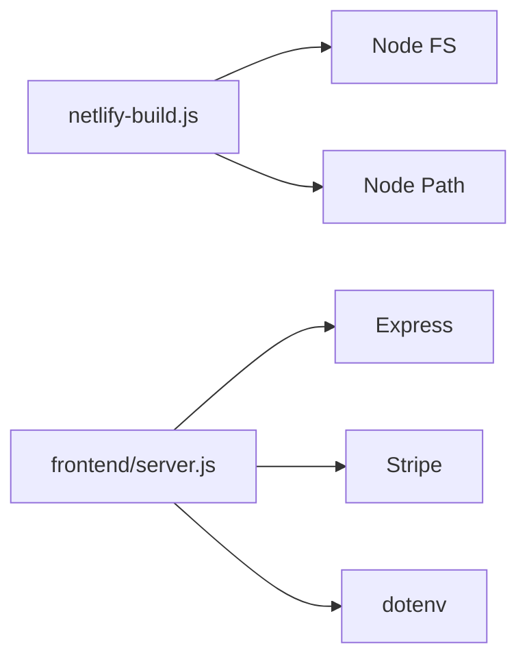

# Netlify Deployment

<cite>
**Referenced Files in This Document**
- [netlify.toml](file://netlify.toml)
- [netlify-build.js](file://netlify-build.js)
- [package.json](file://package.json)
- [frontend/server.js](file://frontend/server.js)
- [frontend/vercel.json](file://frontend/vercel.json)
- [.gitignore](file://.gitignore)
</cite>

## Table of Contents
1. [Introduction](#introduction)
2. [Project Structure](#project-structure)
3. [Core Components](#core-components)
4. [Architecture Overview](#architecture-overview)
5. [Detailed Component Analysis](#detailed-component-analysis)
6. [Dependency Analysis](#dependency-analysis)
7. [Performance Considerations](#performance-considerations)
8. [Troubleshooting Guide](#troubleshooting-guide)
9. [Conclusion](#conclusion)
10. [Appendices](#appendices)

## Introduction
This document provides a complete Netlify deployment guide for the Patch-Byte application. It explains how the site is built and served on Netlify, including the build configuration, custom build script behavior, redirect rules for SEO-friendly URLs and legacy routes, environment variables for production secrets, continuous deployment via Git integration, caching and CDN strategies, and a step-by-step workflow from repository connection to live site activation. It also includes troubleshooting guidance for common Netlify-specific issues such as build errors, redirect conflicts, and asset loading problems.

## Project Structure
The project deploys a static site generated into a public folder by a Node-based build script. The Netlify configuration defines the build command, publish directory, environment settings, redirects, and CDN proxies. A local Express server exists for development and optional serverless usage elsewhere, but Netlify serves the static output directly.

**Diagram sources**
- [netlify.toml:1-6](file://netlify.toml#L1-L6)
- [netlify-build.js:16-27](file://netlify-build.js#L16-L27)

**Section sources**
- [netlify.toml:1-6](file://netlify.toml#L1-L6)
- [netlify-build.js:16-27](file://netlify-build.js#L16-L27)

## Core Components
- Build configuration: Defines the Node version, build command, and publish directory.
- Custom build script: Copies selected source assets into the public directory while skipping large or unnecessary folders.
- Redirects: Implements permanent and temporary redirects, clean URL handling, and Shopify CDN proxies.
- Environment variables: Required keys for payment processing are consumed at runtime by the server code; Netlify injects these during builds and deployments.
- Continuous deployment: Triggered by Git pushes with branch-based deploy previews.

**Section sources**
- [netlify.toml:1-6](file://netlify.toml#L1-L6)
- [netlify.toml:8-165](file://netlify.toml#L8-L165)
- [netlify-build.js:1-28](file://netlify-build.js#L1-L28)
- [frontend/server.js:6-44](file://frontend/server.js#L6-L44)

## Architecture Overview
At deploy time, Netlify runs the configured build command to assemble the static site into the publish directory. Netlify then serves the resulting files from its global CDN. Redirects defined in the configuration handle routing, clean URLs, and proxying certain paths to Shopify’s CDN.

**Diagram sources**
- [netlify.toml:1-6](file://netlify.toml#L1-L6)
- [netlify.toml:8-165](file://netlify.toml#L8-L165)
- [netlify-build.js:16-27](file://netlify-build.js#L16-L27)

## Detailed Component Analysis

### Build Configuration (netlify.toml)
- Build command: Executes the custom build script to prepare the static site.
- Publish directory: The output folder that Netlify serves.
- Environment: Sets the Node runtime version used during builds.

Key behaviors:
- Ensures consistent Node version across environments.
- Keeps the build step simple and deterministic by delegating file copying to a script.

**Section sources**
- [netlify.toml:1-6](file://netlify.toml#L1-L6)

### Custom Build Script (netlify-build.js)
The build script performs targeted copying of assets into the publish directory:
- Copies HTML pages from the site root while excluding nested CDN content to reduce build size.
- Copies theme CSS/JS assets required by the storefront.
- Copies fonts locally so they do not depend on external CDNs.
- Copies the application JavaScript bundle.

**Diagram sources**
- [netlify-build.js:4-14](file://netlify-build.js#L4-L14)
- [netlify-build.js:16-27](file://netlify-build.js#L16-L27)

**Section sources**
- [netlify-build.js:1-28](file://netlify-build.js#L1-L28)

### Redirect Rules
Redirects are organized into several categories:

- Permanent redirects (301):
  - Legacy product page slugs to new locations.
  - Collection renames.
  - Missing policy mapping.

- Temporary redirects (302):
  - Content pages not yet built or moved to blog/policy pages.
  - Pages that should route to contact or home.

- Clean URLs (200):
  - Map slug-only URLs to their corresponding .html files for SEO-friendly routing.
  - Support cart and checkout index resolution.

- Shopify CDN proxies:
  - Proxy product images and other CDN resources to Shopify’s CDN using splat patterns.

**Diagram sources**
- [netlify.toml:8-165](file://netlify.toml#L8-L165)

**Section sources**
- [netlify.toml:8-165](file://netlify.toml#L8-L165)

### Environment Variables
Production secrets and API keys are consumed at runtime by the server code:
- STRIPE_SECRET_KEY: Used to initialize the Stripe client for creating payment intents.
- STRIPE_PUBLISHABLE_KEY: Exposed to the frontend via an API endpoint for client-side initialization.

Notes:
- These values are injected by Netlify at build/deploy time and must be configured in the Netlify dashboard under Site settings > Environment variables.
- Secrets are never committed to the repository; the .gitignore excludes .env files.

**Section sources**
- [frontend/server.js:6-44](file://frontend/server.js#L6-L44)
- [.gitignore:18-19](file://.gitignore#L18-L19)

### Continuous Deployment Setup
- Connect your Git repository to Netlify.
- Configure the build settings:
  - Build command: Use the configured command to run the custom build script.
  - Publish directory: Set to the output folder produced by the build script.
  - Node version: Ensure it matches the configured version.
- Enable branch-based deployments:
  - Deploy previews for feature branches.
  - Production deployments for the main branch.
- Add environment variables in the Netlify dashboard for production secrets.

Best practices:
- Keep build commands minimal and deterministic.
- Pin Node version to ensure consistency across builds.
- Use branch aliases to map specific branches to preview or production environments.

[No sources needed since this section provides general guidance]

### Caching Strategies and CDN Configuration
- Netlify automatically caches static assets globally.
- Redirects proxy certain paths to Shopify’s CDN, leveraging their caching and distribution.
- Fonts are copied locally to avoid external dependencies and improve reliability.
- For optimal performance:
  - Prefer clean URLs to reduce redirect chains.
  - Avoid unnecessary large assets in the build output.
  - Leverage browser caching headers provided by Netlify for static assets.

[No sources needed since this section provides general guidance]

## Dependency Analysis
The build process depends on Node and uses only built-in modules to copy files. The runtime server (for development or alternative hosting) depends on Express, Stripe, and dotenv. Netlify does not require installing dependencies for the static build because the build script uses Node core modules.

**Diagram sources**
- [netlify-build.js:1-2](file://netlify-build.js#L1-L2)
- [frontend/server.js:1-7](file://frontend/server.js#L1-L7)
- [package.json:9-13](file://package.json#L9-L13)

**Section sources**
- [package.json:9-13](file://package.json#L9-L13)
- [frontend/package.json:13-17](file://frontend/package.json#L13-L17)

## Performance Considerations
- Keep the build output lean by excluding large or redundant directories during copying.
- Use permanent redirects where possible to minimize redirect overhead.
- Proxy heavy CDN assets to Shopify’s CDN to leverage their edge network.
- Serve fonts locally to reduce external requests and potential latency.
- Monitor build times and asset sizes; consider splitting or lazy-loading non-critical assets if needed.

[No sources needed since this section provides general guidance]

## Troubleshooting Guide

Common issues and resolutions:

- Build fails due to missing Node version:
  - Ensure the Node version in the build configuration matches the configured engine requirement.
  - Verify the build command executes successfully locally before pushing.

- Redirect conflicts:
  - Confirm that permanent redirects take precedence over clean URL rules.
  - Remove or adjust overlapping redirects to prevent unexpected behavior.

- Asset loading problems:
  - Verify that CDN proxy rules correctly target Shopify’s CDN paths.
  - Ensure fonts and theme assets are included in the build output.
  - Check that large binary assets are excluded from the repository and downloaded or proxied appropriately.

- Environment variables not available:
  - Confirm that secrets are set in the Netlify dashboard for the correct site and environment.
  - Avoid committing secrets; rely on environment injection at deploy time.

- Checkout or payments not working:
  - Validate that Stripe keys are configured and accessible at runtime.
  - Ensure the payment intent endpoint is reachable and returns expected responses.

**Section sources**
- [netlify.toml:1-6](file://netlify.toml#L1-L6)
- [netlify.toml:8-165](file://netlify.toml#L8-L165)
- [netlify-build.js:16-27](file://netlify-build.js#L16-L27)
- [frontend/server.js:6-44](file://frontend/server.js#L6-L44)
- [.gitignore:18-19](file://.gitignore#L18-L19)

## Conclusion
The Patch-Byte application uses a straightforward Netlify setup: a Node-based build script prepares a static site, which Netlify publishes and serves via its global CDN. Redirects manage SEO-friendly URLs, legacy routes, and CDN proxies. Environment variables secure production secrets, and Git integration enables continuous deployment with branch-based previews. Following the guidelines in this document ensures reliable builds, optimal performance, and smooth operations in production.

[No sources needed since this section summarizes without analyzing specific files]

## Appendices

### Step-by-Step Deployment Workflow
1. Connect your Git repository to Netlify.
2. Configure build settings:
   - Build command: Execute the custom build script.
   - Publish directory: Set to the output folder created by the build script.
   - Node version: Match the configured version.
3. Add environment variables in the Netlify dashboard for production secrets.
4. Commit and push changes to trigger a build.
5. Verify the deploy preview and production site.
6. Update redirects or build script as needed and redeploy.

[No sources needed since this section provides general guidance]