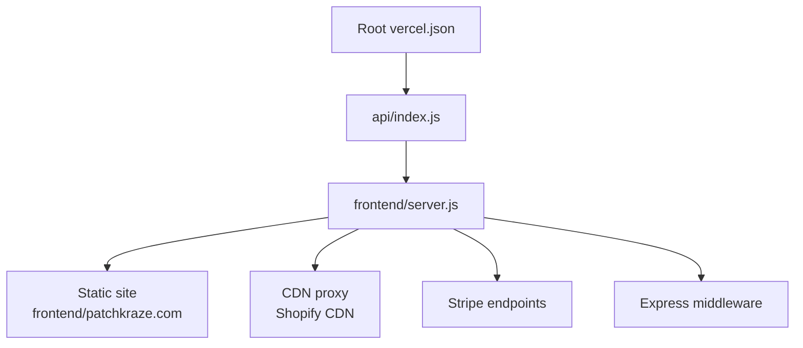
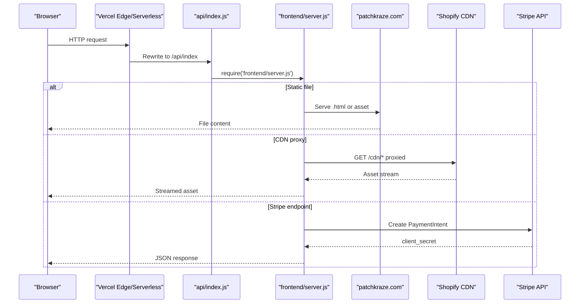
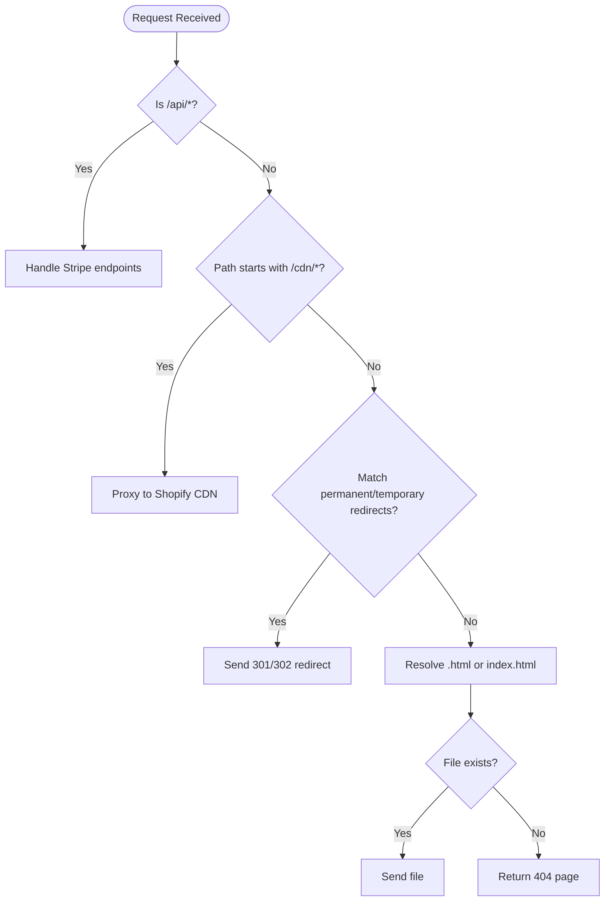
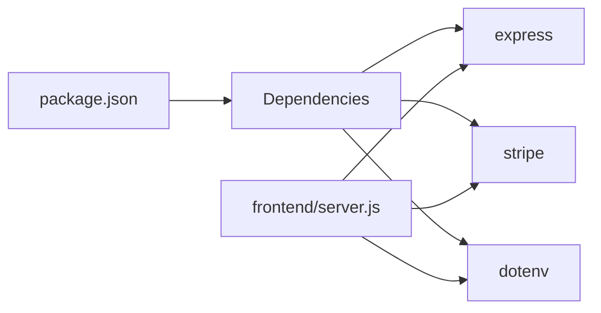

# Vercel Deployment

<cite>
**Referenced Files in This Document**
- [vercel.json](file://vercel.json)
- [api/index.js](file://api/index.js)
- [frontend/server.js](file://frontend/server.js)
- [frontend/vercel.json](file://frontend/vercel.json)
- [package.json](file://package.json)
- [frontend/package.json](file://frontend/package.json)
- [netlify.toml](file://netlify.toml)
- [netlify-build.js](file://netlify-build.js)
- [frontend/js/patchbyte.js](file://frontend/js/patchbyte.js)
</cite>

## Table of Contents
1. [Introduction](#introduction)
2. [Project Structure](#project-structure)
3. [Core Components](#core-components)
4. [Architecture Overview](#architecture-overview)
5. [Detailed Component Analysis](#detailed-component-analysis)
6. [Dependency Analysis](#dependency-analysis)
7. [Performance Considerations](#performance-considerations)
8. [Troubleshooting Guide](#troubleshooting-guide)
9. [Conclusion](#conclusion)
10. [Appendices](#appendices)

## Introduction
This document provides a comprehensive guide to deploying the Patch-Byte application on Vercel. It explains how the project is structured for serverless deployment, how the API routes integrate with Vercel’s runtime, and how static assets are served. It also covers environment variables for Stripe and Supabase, domain configuration, SSL, and step-by-step instructions from initial setup to production release. Finally, it includes troubleshooting guidance for common issues such as build failures, environment variable problems, and performance optimization.

## Project Structure
The repository contains both root-level and frontend-level Vercel configurations. The root vercel.json defines a single serverless function that proxies requests to the Express server located in the frontend directory. The frontend directory also includes its own vercel.json which demonstrates an alternative approach using @vercel/node builds and route rewrites.

**Diagram sources**
- [vercel.json:1-12](file://vercel.json#L1-L12)
- [api/index.js:1-1](file://api/index.js#L1-L1)
- [frontend/server.js:1-123](file://frontend/server.js#L1-L123)

**Section sources**
- [vercel.json:1-12](file://vercel.json#L1-L12)
- [frontend/vercel.json:1-20](file://frontend/vercel.json#L1-L20)
- [package.json:1-14](file://package.json#L1-L14)
- [frontend/package.json:1-19](file://frontend/package.json#L1-L19)

## Core Components
- Root Vercel configuration:
  - Build command: empty (no build step required).
  - Output directory: root of the repo.
  - Functions: api/index.js configured to include specific static assets needed by the server.
  - Rewrites: all paths rewritten to /api/index so the server handles routing.
- Serverless function entry:
  - api/index.js simply exports the Express app from frontend/server.js.
- Express server:
  - Loads environment variables for local development via dotenv.
  - Initializes Stripe client conditionally based on environment variables.
  - Serves static files from patchkraze.com and the frontend root.
  - Proxies Shopify CDN assets under /cdn/* to the Shopify CDN.
  - Implements permanent and temporary redirects for legacy URLs.
  - Exposes Stripe-related endpoints (/api/create-payment-intent and /api/stripe-config).
  - Handles clean URL resolution for .html pages.
  - Exports the Express app for Vercel serverless execution.

**Section sources**
- [vercel.json:1-12](file://vercel.json#L1-L12)
- [api/index.js:1-1](file://api/index.js#L1-L1)
- [frontend/server.js:1-123](file://frontend/server.js#L1-L123)

## Architecture Overview
The deployment uses Vercel serverless functions to run the Express server. All incoming requests are rewritten to the function, which serves static HTML/CSS/JS and proxies certain paths to external services like Shopify CDN and Stripe.

**Diagram sources**
- [vercel.json:1-12](file://vercel.json#L1-L12)
- [api/index.js:1-1](file://api/index.js#L1-L1)
- [frontend/server.js:1-123](file://frontend/server.js#L1-L123)

## Detailed Component Analysis

### Vercel Configuration (root)
- Build command: none; the project does not require a build step.
- Output directory: root directory.
- Functions:
  - api/index.js includes selected static assets to be bundled with the function.
- Rewrites:
  - All routes rewrite to /api/index, allowing the Express server to handle routing logic.

Recommendation:
- If you prefer explicit builds and routes at the frontend level, use the existing frontend/vercel.json configuration pattern with @vercel/node and route rewrites to server.js.

**Section sources**
- [vercel.json:1-12](file://vercel.json#L1-L12)
- [frontend/vercel.json:1-20](file://frontend/vercel.json#L1-L20)

### Serverless Function Entry
- api/index.js re-exports the Express app from frontend/server.js, enabling Vercel to treat it as a Node.js serverless function.

**Section sources**
- [api/index.js:1-1](file://api/index.js#L1-L1)

### Express Server (frontend/server.js)
Key responsibilities:
- Environment loading: dotenv used only for local development; Vercel injects env vars at runtime.
- Stripe integration:
  - Creates a Stripe client if STRIPE_SECRET_KEY is present.
  - Provides /api/create-payment-intend to create payment intents.
  - Provides /api/stripe-config to expose publishable key to the frontend.
- Static serving:
  - Serves patchkraze.com first, then the frontend root for additional assets.
- CDN proxy:
  - Proxies /cdn/* to Shopify CDN with appropriate headers and caching.
- Redirects:
  - Permanent (301) and temporary (302) redirects for moved or missing pages.
- Clean URLs:
  - Resolves /products/:slug to corresponding .html files.
- Export:
  - Exports the Express app for Vercel serverless execution.

**Diagram sources**
- [frontend/server.js:17-111](file://frontend/server.js#L17-L111)

**Section sources**
- [frontend/server.js:1-123](file://frontend/server.js#L1-L123)

### Frontend Integration (Supabase Cart and Checkout)
- patchbyte.js intercepts Shopify-style fetch calls to integrate cart operations with Supabase REST API.
- It maintains a session ID in localStorage and performs CRUD operations on cart_items and contact_submissions tables.
- It updates UI elements like cart badge counts and shows toast notifications.
- For checkout, the frontend uses Stripe Elements and confirms payments via the server-created PaymentIntent.

Important note:
- The current patchbyte.js contains hardcoded Supabase URL and key. For secure deployments, move these values to environment variables and inject them into the frontend at build time or serve them via a secure endpoint.

**Section sources**
- [frontend/js/patchbyte.js:1-345](file://frontend/js/patchbyte.js#L1-L345)

### Alternative Frontend-Level Vercel Configuration
- frontend/vercel.json demonstrates building server.js with @vercel/node and including necessary files.
- Routes rewrite all paths to server.js, enabling the same Express-based routing behavior.

Use this configuration if you want to isolate the serverless function within the frontend directory.

**Section sources**
- [frontend/vercel.json:1-20](file://frontend/vercel.json#L1-L20)

## Dependency Analysis
The project depends on Express for routing and serving static assets, Stripe for payments, and dotenv for local environment variable loading. Vercel will execute the serverless function with Node.js runtime.

**Diagram sources**
- [package.json:1-14](file://package.json#L1-L14)
- [frontend/package.json:1-19](file://frontend/package.json#L1-L19)
- [frontend/server.js:1-15](file://frontend/server.js#L1-L15)

**Section sources**
- [package.json:1-14](file://package.json#L1-L14)
- [frontend/package.json:1-19](file://frontend/package.json#L1-L19)

## Performance Considerations
- Static assets:
  - Ensure large assets are cached appropriately; the CDN proxy sets cache headers for Shopify assets.
- Function size:
  - Use includeFiles in vercel.json to limit bundled assets to only what is necessary.
- Routing efficiency:
  - Prefer permanent redirects for moved pages to reduce unnecessary processing.
- External dependencies:
  - Minimize network calls in hot paths; consider caching frequently accessed data where possible.
- Runtime selection:
  - For low-latency edge responses, consider moving lightweight routing to Vercel Edge Functions if applicable.

[No sources needed since this section provides general guidance]

## Troubleshooting Guide

Common issues and resolutions:
- Build failures:
  - The project has no build step; ensure your Vercel project settings do not override the default behavior.
  - If using frontend/vercel.json, confirm Node version compatibility and that includeFiles lists are correct.
- Environment variables:
  - Verify STRIPE_SECRET_KEY and STRIPE_PUBLISHABLE_KEY are set in Vercel project settings.
  - For Supabase credentials used by the frontend, avoid hardcoding keys; inject them securely via environment variables or a backend endpoint.
- Missing assets:
  - Confirm includeFiles in vercel.json includes all required static assets for the serverless function.
- CDN proxy errors:
  - Check network access to Shopify CDN; ensure the proxy path mapping is correct.
- Redirects not working:
  - Validate that permanent and temporary redirect mappings exist for legacy URLs.
- Stripe errors:
  - Ensure amount is positive and currency is supported; check error messages returned by Stripe.

**Section sources**
- [vercel.json:1-12](file://vercel.json#L1-L12)
- [frontend/server.js:17-111](file://frontend/server.js#L1-L111)
- [frontend/js/patchbyte.js:1-345](file://frontend/js/patchbyte.js#L1-L345)

## Conclusion
Patch-Byte deploys cleanly on Vercel using a serverless function that runs an Express server. Static assets are served directly, while dynamic features like payments are handled through Stripe endpoints. Environment variables should be managed securely, especially for Stripe and Supabase. Follow the provided configuration patterns and troubleshooting steps to ensure a smooth deployment process.

[No sources needed since this section summarizes without analyzing specific files]

## Appendices

### Step-by-Step Deployment Instructions
1. Connect your repository to Vercel.
2. Configure environment variables:
   - STRIPE_SECRET_KEY
   - STRIPE_PUBLISHABLE_KEY
   - Any other secrets required by your application.
3. Choose deployment mode:
   - Root vercel.json: Uses api/index.js to proxy to frontend/server.js.
   - Frontend vercel.json: Builds server.js with @vercel/node and rewrites routes to server.js.
4. Deploy:
   - Push changes to your main branch or deploy manually from the Vercel dashboard.
5. Verify:
   - Test static pages, CDN proxy, redirects, and Stripe endpoints.
6. Domain configuration:
   - Add custom domains in Vercel dashboard.
   - Enable automatic HTTPS/SSL certificates.
7. Production release:
   - Promote preview deployments to production after validation.

[No sources needed since this section provides general guidance]

### Netlify Build Reference
Although this guide focuses on Vercel, the repository includes a Netlify build script and configuration for reference. These demonstrate how to copy static assets and configure redirects for alternative hosting platforms.

**Section sources**
- [netlify.toml:1-165](file://netlify.toml#L1-L165)
- [netlify-build.js:1-28](file://netlify-build.js#L1-L28)