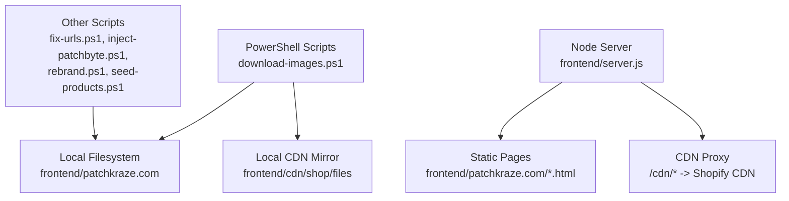
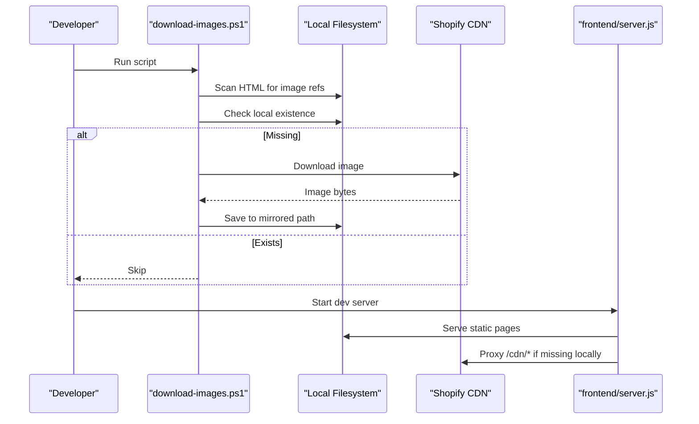
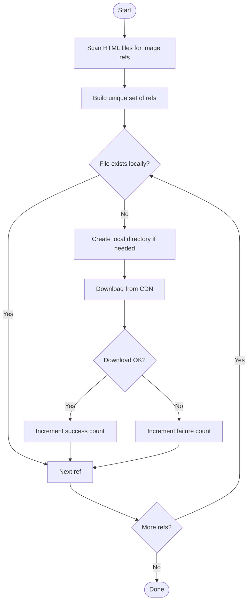
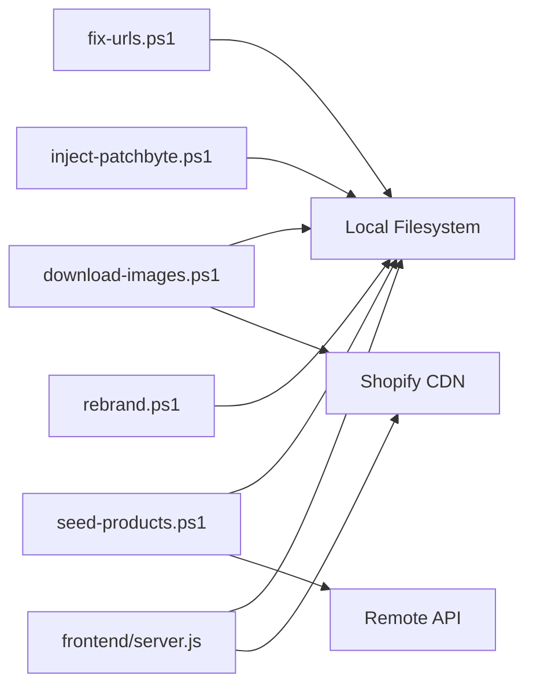

# Asset Management Tools

<cite>
**Referenced Files in This Document**
- [download-images.ps1](file://download-images.ps1)
- [fix-urls.ps1](file://fix-urls.ps1)
- [inject-patchbyte.ps1](file://inject-patchbyte.ps1)
- [rebrand.ps1](file://rebrand.ps1)
- [seed-products.ps1](file://seed-products.ps1)
- [server.js](file://frontend/server.js)
</cite>

## Table of Contents
1. [Introduction](#introduction)
2. [Project Structure](#project-structure)
3. [Core Components](#core-components)
4. [Architecture Overview](#architecture-overview)
5. [Detailed Component Analysis](#detailed-component-analysis)
6. [Dependency Analysis](#dependency-analysis)
7. [Performance Considerations](#performance-considerations)
8. [Troubleshooting Guide](#troubleshooting-guide)
9. [Conclusion](#conclusion)
10. [Appendices](#appendices)

## Introduction
This document explains the asset management tools in the Patch-Byte project, with a focus on the PowerShell script that automates downloading images from Shopify CDN to a local development environment. It covers how HTML files are scanned for image references, supported file formats, directory structure mapping, missing asset handling, configuration steps, usage examples, error handling, and optimization tips. It also documents related scripts that fix URLs, inject assets, rebrand content, and seed product metadata.

## Project Structure
The asset tooling is centered around PowerShell scripts at the repository root and a Node/Express server that serves static pages and proxies CDN requests during local development.

**Diagram sources**
- [download-images.ps1:1-69](file://download-images.ps1#L1-L69)
- [server.js:46-65](file://frontend/server.js#L46-L65)

**Section sources**
- [download-images.ps1:1-69](file://download-images.ps1#L1-L69)
- [server.js:46-65](file://frontend/server.js#L46-L65)

## Core Components
- download-images.ps1: Scans HTML files for Shopify CDN image references, identifies missing local assets, and downloads them while preserving directory structure.
- fix-urls.ps1: Normalizes absolute and relative CDN paths in HTML to local-friendly paths.
- inject-patchbyte.ps1: Injects a client-side script tag into all HTML pages.
- rebrand.ps1: Performs site-wide text replacements (e.g., brand name changes).
- seed-products.ps1: Extracts product metadata from HTML and seeds a remote database via API.
- frontend/server.js: Serves static pages and proxies /cdn/* requests to Shopify CDN when local files are missing.

**Section sources**
- [download-images.ps1:1-69](file://download-images.ps1#L1-L69)
- [fix-urls.ps1:1-24](file://fix-urls.ps1#L1-L24)
- [inject-patchbyte.ps1:1-23](file://inject-patchbyte.ps1#L1-L23)
- [rebrand.ps1:1-27](file://rebrand.ps1#L1-L27)
- [seed-products.ps1:1-87](file://seed-products.ps1#L1-L87)
- [server.js:46-65](file://frontend/server.js#L46-L65)

## Architecture Overview
The asset pipeline ensures local development mirrors production CDN behavior:

- Static pages under frontend/patchkraze.com reference assets via /cdn/... paths.
- During development, the Express server proxies /cdn/* to Shopify CDN if the file is not present locally.
- The download script pre-caches frequently used images by scanning HTML for /cdn/shop/files/... references and downloading them into frontend/cdn/shop/files, preserving subdirectories.
- URL normalization ensures consistent path formats across pages.

**Diagram sources**
- [download-images.ps1:8-65](file://download-images.ps1#L8-L65)
- [server.js:46-65](file://frontend/server.js#L46-L65)

## Detailed Component Analysis

### download-images.ps1
Purpose: Automate discovery and download of Shopify CDN images referenced by HTML pages into a local mirror that preserves directory structure.

Key behaviors:
- Scans product HTML files and additional pages (index and collections) for image references matching Shopify’s /cdn/shop/files/... pattern.
- Supports common image formats: jpg, jpeg, png, webp, gif.
- Builds a unique set of references to avoid duplicate downloads.
- Computes local destination paths based on the original CDN path and creates directories as needed.
- Downloads missing assets using HTTP GET with timeouts and basic parsing; tracks success/failure counts.

Configuration:
- Base HTML directory: Set $base to the products folder containing HTML files.
- Local CDN mirror root: Set $cdnLocal to the target directory where images will be saved (mirrors Shopify’s files structure).
- Remote CDN base URL: Set $cdnUrl to the Shopify CDN base for files.

Regex patterns:
- Image detection uses a case-insensitive regex that matches paths starting with /cdn/shop/files/ followed by a filename ending in one of the supported extensions. Query strings and whitespace delimiters are excluded to capture clean filenames.

Directory strategy:
- Subdirectories within /cdn/shop/files/ are preserved. For example, preview_images/file.jpg maps to the same subfolder under the local mirror.

Error handling:
- Network or permission errors are caught per file; failures are counted without aborting the process.
- Directory creation is guarded and forced to ensure nested paths exist before writing.

Usage example:
- Open PowerShell in the repository root and run the script. Ensure the configured paths point to your local workspace. Review console output for totals and any failures.

Optimization tips:
- Run after URL normalization so paths are consistent.
- Re-run periodically to fetch newly added images.
- If many downloads fail due to rate limits or network issues, consider running in batches or adding retries.

**Diagram sources**
- [download-images.ps1:8-65](file://download-images.ps1#L8-L65)

**Section sources**
- [download-images.ps1:1-69](file://download-images.ps1#L1-L69)

### fix-urls.ps1
Purpose: Normalize CDN and site URLs in HTML to use local-friendly relative paths.

Key behaviors:
- Scans specified directories (pages, policies, collections, products, blogs) for HTML files.
- Replaces absolute CDN URLs with relative paths under /cdn/.
- Removes query parameters from CDN asset URLs to simplify caching and local resolution.
- Rewrites absolute site URLs to relative paths for core sections like products, collections, pages, blogs, policies, cart, account.

Usage example:
- Run the script from the repository root. It updates HTML files in place. Verify changes by opening pages locally.

**Section sources**
- [fix-urls.ps1:1-24](file://fix-urls.ps1#L1-L24)

### inject-patchbyte.ps1
Purpose: Inject a client-side script tag into all HTML pages to enable runtime features.

Key behaviors:
- Recursively finds all HTML files under the site root.
- Skips pages that already contain the target script tag.
- Inserts the script just before the closing head tag.

Usage example:
- Run the script once after building or updating pages. Confirm injection by inspecting page source.

**Section sources**
- [inject-patchbyte.ps1:1-23](file://inject-patchbyte.ps1#L1-L23)

### rebrand.ps1
Purpose: Perform site-wide text replacements for branding consistency.

Key behaviors:
- Scans all HTML files and replaces brand-related strings (e.g., “Patch Kraze” to “PatchByte”).
- Uses regex to avoid replacing domain names unintentionally.
- Reports number of replacements per file and total.

Usage example:
- Run the script before publishing to ensure consistent branding across pages.

**Section sources**
- [rebrand.ps1:1-27](file://rebrand.ps1#L1-L27)

### seed-products.ps1
Purpose: Extract product metadata from HTML and seed a remote database via API.

Key behaviors:
- Reads product HTML files and extracts title, price, description, first few images, and category inferred from slug keywords.
- Sends JSON payloads to a remote API endpoint with appropriate headers.
- Tracks success and failure counts and prints detailed messages.

Usage example:
- Configure remote API URL and credentials in the script. Run to populate the database with product data derived from static HTML.

**Section sources**
- [seed-products.ps1:1-87](file://seed-products.ps1#L1-L87)

### frontend/server.js
Purpose: Serve static pages and proxy CDN requests during local development.

Key behaviors:
- Serves static files from the site root and the frontend root.
- Proxies /cdn/* requests to Shopify CDN when local files are missing, setting cache headers appropriately.
- Provides redirect mappings for moved or temporary content.

Usage example:
- Start the server locally to serve the site. Requests to /cdn/* will automatically fall back to Shopify CDN if the file is not cached locally.

**Section sources**
- [server.js:46-65](file://frontend/server.js#L46-L65)

## Dependency Analysis
- download-images.ps1 depends on:
  - Local filesystem access to read HTML and write images.
  - Network access to Shopify CDN for downloading missing assets.
- fix-urls.ps1 depends on:
  - Local filesystem access to read/write HTML files.
- inject-patchbyte.ps1 depends on:
  - Local filesystem access to read/write HTML files.
- rebrand.ps1 depends on:
  - Local filesystem access to read/write HTML files.
- seed-products.ps1 depends on:
  - Local filesystem access to read HTML.
  - Network access to remote API for seeding data.
- frontend/server.js depends on:
  - Node.js runtime and Express.
  - Local filesystem for serving static files.
  - Network access to Shopify CDN for proxying /cdn/* requests.

**Diagram sources**
- [download-images.ps1:8-65](file://download-images.ps1#L8-L65)
- [fix-urls.ps1:1-24](file://fix-urls.ps1#L1-L24)
- [inject-patchbyte.ps1:1-23](file://inject-patchbyte.ps1#L1-L23)
- [rebrand.ps1:1-27](file://rebrand.ps1#L1-L27)
- [seed-products.ps1:1-87](file://seed-products.ps1#L1-L87)
- [server.js:46-65](file://frontend/server.js#L46-L65)

**Section sources**
- [download-images.ps1:8-65](file://download-images.ps1#L8-L65)
- [server.js:46-65](file://frontend/server.js#L46-L65)

## Performance Considerations
- Batch processing: The download script processes files sequentially but logs progress every 25 items. For large catalogs, consider splitting runs or limiting scope to specific directories.
- Network timeouts: A timeout is applied per request to prevent hanging on slow or unreachable endpoints.
- Duplicate prevention: Using a hash map of unique references avoids redundant downloads.
- Local caching: Once downloaded, the Express server serves local files directly, reducing CDN calls during development.
- Regex efficiency: Patterns are constrained to known prefixes and extensions to minimize false positives and improve matching speed.

[No sources needed since this section provides general guidance]

## Troubleshooting Guide
Common issues and resolutions:
- Paths misconfigured: Ensure $base, $cdnLocal, and $cdnUrl in download-images.ps1 point to correct locations in your workspace.
- Permission errors: Run PowerShell with appropriate permissions to create directories and write files.
- Network errors: Check internet connectivity and firewall settings; verify Shopify CDN accessibility.
- Missing images: Re-run download-images.ps1 after adding new HTML content or updating URLs.
- URL inconsistencies: Run fix-urls.ps1 to normalize paths before scanning or serving.
- Script injection conflicts: Use inject-patchbyte.ps1 only once per page to avoid duplicate script tags.
- Branding mismatches: Run rebrand.ps1 to standardize brand text across pages.
- Database seeding failures: Validate API credentials and payload format in seed-products.ps1; check error messages printed for each failed item.

**Section sources**
- [download-images.ps1:30-65](file://download-images.ps1#L30-L65)
- [fix-urls.ps1:13-22](file://fix-urls.ps1#L13-L22)
- [inject-patchbyte.ps1:11-20](file://inject-patchbyte.ps1#L11-L20)
- [rebrand.ps1:7-22](file://rebrand.ps1#L7-L22)
- [seed-products.ps1:70-83](file://seed-products.ps1#L70-L83)

## Conclusion
The asset management tools streamline local development by mirroring Shopify CDN assets, normalizing URLs, injecting runtime scripts, standardizing branding, and seeding product metadata. Together, they reduce manual effort, improve consistency, and accelerate iteration cycles. Use the provided scripts in combination with the local server to maintain a reliable development environment that closely matches production behavior.

[No sources needed since this section summarizes without analyzing specific files]

## Appendices

### Configuration Steps
- Set base HTML directory ($base) to the products folder containing HTML files.
- Set local CDN mirror root ($cdnLocal) to the target directory for downloaded images.
- Set remote CDN base URL ($cdnUrl) to the Shopify CDN base for files.
- Ensure TLS 1.2 is enabled in PowerShell for secure downloads.

**Section sources**
- [download-images.ps1:2-6](file://download-images.ps1#L2-L6)

### Usage Examples
- Run download-images.ps1 to scan and download missing images.
- Run fix-urls.ps1 to normalize CDN and site URLs in HTML.
- Run inject-patchbyte.ps1 to add the client-side script to all pages.
- Run rebrand.ps1 to update brand text across pages.
- Run seed-products.ps1 to populate product data in the remote database.
- Start the Node server to serve pages and proxy CDN requests.

**Section sources**
- [download-images.ps1:8-65](file://download-images.ps1#L8-L65)
- [fix-urls.ps1:13-22](file://fix-urls.ps1#L13-L22)
- [inject-patchbyte.ps1:11-20](file://inject-patchbyte.ps1#L11-L20)
- [rebrand.ps1:7-22](file://rebrand.ps1#L7-L22)
- [seed-products.ps1:70-83](file://seed-products.ps1#L70-L83)
- [server.js:117-121](file://frontend/server.js#L117-L121)

### Regex Patterns for Image Detection
- Pattern targets paths beginning with /cdn/shop/files/ and captures filenames ending in jpg, jpeg, png, webp, or gif.
- Case-insensitive matching ensures robust detection across varied casing.
- Query strings and whitespace are excluded to isolate clean filenames.

**Section sources**
- [download-images.ps1:12-15](file://download-images.ps1#L12-L15)
- [download-images.ps1:22-26](file://download-images.ps1#L22-L26)

### File Organization Strategy
- Images are stored under frontend/cdn/shop/files mirroring Shopify’s structure.
- Subdirectories are preserved to maintain consistency with CDN organization.
- The Express server proxies /cdn/* to Shopify CDN when local files are absent, ensuring seamless fallback during development.

**Section sources**
- [download-images.ps1:30-56](file://download-images.ps1#L30-L56)
- [server.js:50-65](file://frontend/server.js#L50-L65)