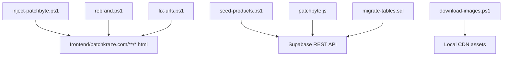
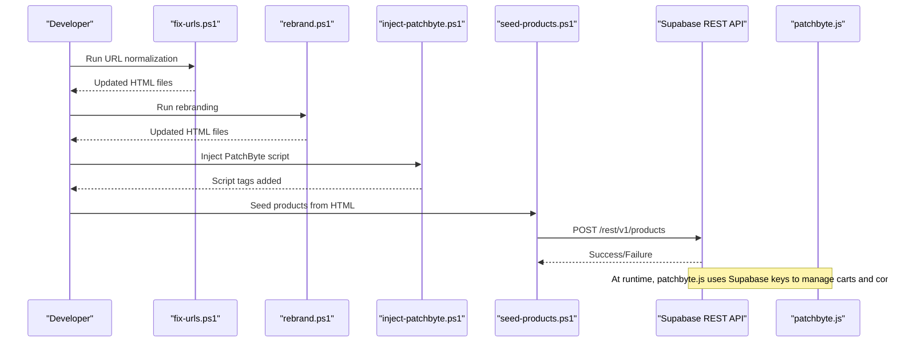
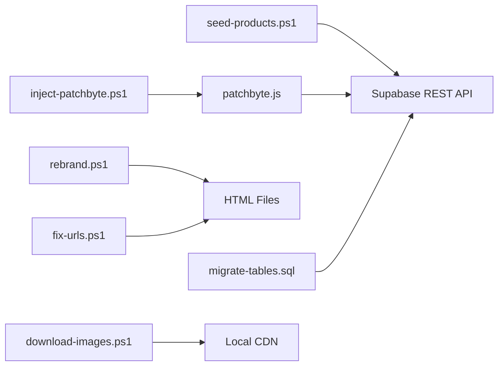

# Automation Scripts

<cite>
**Referenced Files in This Document**
- [inject-patchbyte.ps1](file://inject-patchbyte.ps1)
- [seed-products.ps1](file://seed-products.ps1)
- [rebrand.ps1](file://rebrand.ps1)
- [patchbyte.js](file://frontend/js/patchbyte.js)
- [migrate-tables.sql](file://migrate-tables.sql)
- [download-images.ps1](file://download-images.ps1)
- [fix-urls.ps1](file://fix-urls.ps1)
</cite>

## Table of Contents
1. [Introduction](#introduction)
2. [Project Structure](#project-structure)
3. [Core Components](#core-components)
4. [Architecture Overview](#architecture-overview)
5. [Detailed Component Analysis](#detailed-component-analysis)
6. [Dependency Analysis](#dependency-analysis)
7. [Performance Considerations](#performance-considerations)
8. [Troubleshooting Guide](#troubleshooting-guide)
9. [Conclusion](#conclusion)
10. [Appendices](#appendices)

## Introduction
This document explains the automation scripts that streamline development workflows for the Patch-Byte project. It focuses on:
- Automatically injecting PatchByte integration into HTML files
- Populating a Supabase database with sample product data extracted from static HTML pages
- Rebranding application content across HTML files
It also provides step-by-step usage instructions, parameter guidance, error handling strategies, and recommendations for extending or creating new workflow utilities.

## Project Structure
The automation scripts operate primarily against a local export of a Shopify-style storefront located under a base directory. The key directories and files involved are:
- frontend/patchkraze.com: Static HTML export containing products, collections, blogs, policies, and pages
- frontend/js/patchbyte.js: Client-side integration script injected into pages to intercept cart actions and persist them to Supabase
- migrate-tables.sql: Database migration to add fields and enable Row Level Security for tables used by PatchByte
- Additional helpers: download-images.ps1 and fix-urls.ps1 support asset preparation and URL normalization

**Diagram sources**
- [inject-patchbyte.ps1:1-23](file://inject-patchbyte.ps1#L1-L23)
- [seed-products.ps1:1-87](file://seed-products.ps1#L1-L87)
- [rebrand.ps1:1-27](file://rebrand.ps1#L1-L27)
- [patchbyte.js:1-345](file://frontend/js/patchbyte.js#L1-L345)
- [migrate-tables.sql:1-57](file://migrate-tables.sql#L1-L57)
- [download-images.ps1:1-69](file://download-images.ps1#L1-L69)
- [fix-urls.ps1:1-24](file://fix-urls.ps1#L1-L24)

**Section sources**
- [inject-patchbyte.ps1:1-23](file://inject-patchbyte.ps1#L1-L23)
- [seed-products.ps1:1-87](file://seed-products.ps1#L1-L87)
- [rebrand.ps1:1-27](file://rebrand.ps1#L1-L27)
- [patchbyte.js:1-345](file://frontend/js/patchbyte.js#L1-L345)
- [migrate-tables.sql:1-57](file://migrate-tables.sql#L1-L57)
- [download-images.ps1:1-69](file://download-images.ps1#L1-L69)
- [fix-urls.ps1:1-24](file://fix-urls.ps1#L1-L24)

## Core Components
- inject-patchbyte.ps1: Scans all HTML files under a base path and injects a script tag referencing frontend/js/patchbyte.js just before </head>. Skips files that already contain the tag.
- seed-products.ps1: Reads product HTML files, extracts metadata (name, price, description, images), infers category from slugs, and posts each product to a Supabase REST endpoint.
- rebrand.ps1: Performs global text replacements across all HTML files to replace brand references with a new brand name.
- patchbyte.js: Client-side integration that intercepts Shopify-style cart requests and persists cart items to Supabase; also handles contact form submissions and UI updates.
- migrate-tables.sql: Adds necessary columns to existing tables and enables permissive Row Level Security policies for anonymous access during development.

**Section sources**
- [inject-patchbyte.ps1:1-23](file://inject-patchbyte.ps1#L1-L23)
- [seed-products.ps1:1-87](file://seed-products.ps1#L1-L87)
- [rebrand.ps1:1-27](file://rebrand.ps1#L1-L27)
- [patchbyte.js:1-345](file://frontend/js/patchbyte.js#L1-L345)
- [migrate-tables.sql:1-57](file://migrate-tables.sql#L1-L57)

## Architecture Overview
The automation pipeline integrates static site exports with a Supabase backend:
- Preprocessing: fix-urls.ps1 normalizes URLs and paths in HTML files.
- Branding: rebrand.ps1 replaces brand strings across HTML files.
- Integration injection: inject-patchbyte.ps1 adds the PatchByte client script to every page.
- Data seeding: seed-products.ps1 reads product pages and seeds product records into Supabase.
- Runtime behavior: patchbyte.js intercepts cart interactions and persists them to Supabase using configured credentials.

**Diagram sources**
- [fix-urls.ps1:1-24](file://fix-urls.ps1#L1-L24)
- [rebrand.ps1:1-27](file://rebrand.ps1#L1-L27)
- [inject-patchbyte.ps1:1-23](file://inject-patchbyte.ps1#L1-L23)
- [seed-products.ps1:1-87](file://seed-products.ps1#L1-L87)
- [patchbyte.js:1-345](file://frontend/js/patchbyte.js#L1-L345)

## Detailed Component Analysis

### inject-patchbyte.ps1
Purpose:
- Injects a script tag pointing to frontend/js/patchbyte.js into all HTML files under a configurable base directory.
- Ensures the script is inserted just before the closing head tag.
- Skips files that already include the target script tag to avoid duplication.

Key behaviors:
- Base path configuration at the top of the script determines which folder to scan.
- Uses UTF-8 encoding when reading/writing files to preserve special characters.
- Counts patched and skipped files and prints summary output.

Usage steps:
1. Open PowerShell in the project root.
2. Edit the base path variable to point to your exported storefront directory.
3. Run the script.
4. Verify that each HTML file contains the script tag before </head>.

Error handling:
- If a file does not contain </head>, it will be skipped silently.
- File read/write errors will surface as PowerShell exceptions; ensure proper permissions and valid paths.

Extensibility tips:
- Add additional checks to skip specific directories or files.
- Support multiple script injections or conditional injection based on page type.

**Section sources**
- [inject-patchbyte.ps1:1-23](file://inject-patchbyte.ps1#L1-L23)

### seed-products.ps1
Purpose:
- Extracts product information from static HTML product pages and seeds them into a Supabase database via REST API.

Data extraction logic:
- Name: Extracted from the page title; falls back to slug if missing; cleans up trailing brand suffixes.
- Price: Extracted from the first occurrence of a currency-formatted price string; defaults to zero if not found.
- Description: Extracted from meta description tag; defaults to empty string if absent.
- Images: Collects up to three unique local image references from src attributes matching expected patterns.
- Category: Inferred from slug keywords such as leather, chenille, pvc/rubber/silicone, woven, sticker/dtf/transfer, velcro, hat/cap/beanie/bucket; defaults to patches.

API interaction:
- Sends POST requests to Supabase REST endpoint with headers including apikey, Authorization, Content-Type, and Prefer return=minimal.
- Uses TLS 1.2 for secure connections.
- Tracks success and failure counts and prints per-file results.

Usage steps:
1. Configure the base path to point to the products directory within your exported storefront.
2. Set Supabase URL and anon key variables at the top of the script.
3. Ensure the products table exists and accepts the required fields.
4. Run the script and review the console output for successes and failures.

Error handling:
- Network or authentication errors are caught and printed with detailed messages.
- Invalid HTML or missing fields result in default values rather than failing the entire run.

Database requirements:
- The products table should accept fields like slug, name, description, price, category, images (array), and in_stock (boolean).
- If needed, adjust the payload structure to match your schema.

Extensibility tips:
- Add more category rules or extract additional fields (e.g., SKU, tags).
- Implement retry logic for transient network failures.
- Export a log file for auditability.

**Section sources**
- [seed-products.ps1:1-87](file://seed-products.ps1#L1-L87)

### rebrand.ps1
Purpose:
- Performs global text replacement across all HTML files to update branding elements.

Replacement rules:
- Replaces “Patch Kraze” with “PatchByte”.
- Replaces standalone occurrences of “patchkraze” that are not followed by “.com” with “PatchByte”.

Usage steps:
1. Set the base path to your storefront directory.
2. Run the script to perform replacements.
3. Review the count of total replacements and verify changes in representative files.

Error handling:
- Skips files that cannot be read due to permissions or path issues.
- Writes back only when changes are detected to minimize disk writes.

Extensibility tips:
- Add additional brand terms or handle case-insensitive matches explicitly.
- Introduce dry-run mode to preview changes without writing files.

**Section sources**
- [rebrand.ps1:1-27](file://rebrand.ps1#L1-L27)

### patchbyte.js (Runtime Integration)
Purpose:
- Intercepts Shopify-style fetch calls related to cart operations and routes them to Supabase.
- Manages session IDs stored in localStorage.
- Provides functions to get, add, update, and clear cart items.
- Updates cart badge UI and shows toast notifications.
- Wires contact forms to submit to Supabase.

Key runtime flows:
- Fetch interception: Rewrites /cart/add and related endpoints to use Supabase REST API.
- Cart persistence: Stores items with session_id, product_slug, product_name, unit_price, quantity, and properties.
- UI updates: Refreshes cart bubble counts and redirects cart icon clicks to /cart.
- Contact submission: Submits form fields to contact_submissions and displays confirmation.

Integration notes:
- Requires Supabase URL and anon key configured in the script.
- Works best when injected early in <head> so it can intercept fetch calls before other handlers.

**Section sources**
- [patchbyte.js:1-345](file://frontend/js/patchbyte.js#L1-L345)

### migrate-tables.sql (Database Schema)
Purpose:
- Adds necessary columns to existing tables used by PatchByte.
- Enables Row Level Security policies allowing anonymous inserts and reads for development convenience.

Tables affected:
- cart_items: Adds product_slug, product_name, unit_price, properties.
- orders: Adds customer details, shipping_address, notes, total, status.
- order_items: Adds product details and pricing.
- contact_submissions: Adds name, email, phone, message.

Security considerations:
- Policies currently allow open access for development; restrict policies in production environments.

**Section sources**
- [migrate-tables.sql:1-57](file://migrate-tables.sql#L1-L57)

## Dependency Analysis
- inject-patchbyte.ps1 depends on:
  - frontend/js/patchbyte.js being present and accessible from the web root
  - HTML files containing a head section for safe injection
- seed-products.ps1 depends on:
  - Supabase REST API availability and correct credentials
  - Products table schema compatible with the payload
- rebrand.ps1 depends on:
  - Consistent brand strings in HTML files
- patchbyte.js depends on:
  - Supabase credentials and enabled RLS policies
  - DOM elements for cart badges and contact forms
- Supporting scripts:
  - download-images.ps1 ensures local CDN assets exist for offline testing
  - fix-urls.ps1 normalizes URLs to relative paths for consistent rendering

**Diagram sources**
- [inject-patchbyte.ps1:1-23](file://inject-patchbyte.ps1#L1-L23)
- [seed-products.ps1:1-87](file://seed-products.ps1#L1-L87)
- [rebrand.ps1:1-27](file://rebrand.ps1#L1-L27)
- [patchbyte.js:1-345](file://frontend/js/patchbyte.js#L1-L345)
- [migrate-tables.sql:1-57](file://migrate-tables.sql#L1-L57)
- [fix-urls.ps1:1-24](file://fix-urls.ps1#L1-L24)
- [download-images.ps1:1-69](file://download-images.ps1#L1-L69)

**Section sources**
- [inject-patchbyte.ps1:1-23](file://inject-patchbyte.ps1#L1-L23)
- [seed-products.ps1:1-87](file://seed-products.ps1#L1-L87)
- [rebrand.ps1:1-27](file://rebrand.ps1#L1-L27)
- [patchbyte.js:1-345](file://frontend/js/patchbyte.js#L1-L345)
- [migrate-tables.sql:1-57](file://migrate-tables.sql#L1-L57)
- [fix-urls.ps1:1-24](file://fix-urls.ps1#L1-L24)
- [download-images.ps1:1-69](file://download-images.ps1#L1-L69)

## Performance Considerations
- Batch processing: All scripts process files sequentially; for large sites, consider parallelization where safe.
- Encoding: UTF-8 is used consistently to prevent character corruption.
- Network calls: seed-products.ps1 performs one request per product; rate limiting or retries may be needed for large catalogs.
- Disk I/O: rebrand.ps1 writes only when changes occur; still, batch writes can be optimized for very large sets.
- TLS: Enforced TLS 1.2 for secure connections in network-bound scripts.

[No sources needed since this section provides general guidance]

## Troubleshooting Guide
Common issues and resolutions:
- Incorrect base path: Ensure the base path points to the correct exported storefront directory.
- Missing </head>: Pages without a head section will be skipped by inject-patchbyte.ps1; add a proper head element.
- Authentication failures: Verify Supabase URL and anon key in seed-products.ps1 and patchbyte.js.
- Schema mismatch: Confirm that the products table supports the fields sent by seed-products.ps1; adjust payload or schema accordingly.
- RLS restrictions: If production policies restrict anonymous access, update policies to allow intended operations.
- Asset loading: Use download-images.ps1 to ensure local CDN assets exist; use fix-urls.ps1 to normalize URLs for consistent rendering.

**Section sources**
- [inject-patchbyte.ps1:1-23](file://inject-patchbyte.ps1#L1-L23)
- [seed-products.ps1:1-87](file://seed-products.ps1#L1-L87)
- [patchbyte.js:1-345](file://frontend/js/patchbyte.js#L1-L345)
- [migrate-tables.sql:1-57](file://migrate-tables.sql#L1-L57)
- [download-images.ps1:1-69](file://download-images.ps1#L1-L69)
- [fix-urls.ps1:1-24](file://fix-urls.ps1#L1-L24)

## Conclusion
These automation scripts provide a streamlined workflow for integrating PatchByte into a static storefront export:
- Inject PatchByte client code into all pages
- Seed product data from HTML into Supabase
- Rebrand content across the site
- Support asset preparation and URL normalization
By following the usage instructions, understanding data structures, and applying the troubleshooting guidance, you can reliably automate common development tasks and extend the toolset with new utilities tailored to your workflow.

[No sources needed since this section summarizes without analyzing specific files]

## Appendices

### Step-by-Step Usage Instructions

- Inject PatchByte into HTML files:
  1. Set the base path to your storefront directory.
  2. Run the script to inject the script tag before </head>.
  3. Verify injection in a few files.

- Seed products into Supabase:
  1. Configure base path to the products directory.
  2. Set Supabase URL and anon key.
  3. Ensure the products table exists and accepts required fields.
  4. Run the script and check success/failure counts.

- Rebrand application appearance:
  1. Set the base path to your storefront directory.
  2. Run the script to replace brand strings.
  3. Review replacement counts and spot-check files.

- Prepare assets and URLs:
  1. Run fix-urls.ps1 to normalize URLs.
  2. Run download-images.ps1 to fetch missing images locally.

**Section sources**
- [inject-patchbyte.ps1:1-23](file://inject-patchbyte.ps1#L1-L23)
- [seed-products.ps1:1-87](file://seed-products.ps1#L1-L87)
- [rebrand.ps1:1-27](file://rebrand.ps1#L1-L27)
- [fix-urls.ps1:1-24](file://fix-urls.ps1#L1-L24)
- [download-images.ps1:1-69](file://download-images.ps1#L1-L69)

### Extending Existing Automation Scripts
Guidelines:
- Keep configurations at the top of scripts for easy modification.
- Use robust parsing with regex but validate inputs to avoid false positives.
- Implement logging and counters to track progress and failures.
- Add dry-run modes to preview changes before applying them.
- Handle errors gracefully and continue processing remaining files.
- Consider adding command-line parameters for flexibility.

[No sources needed since this section provides general guidance]