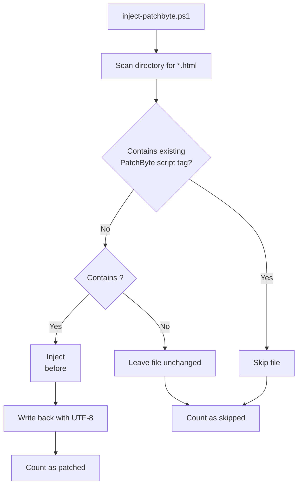
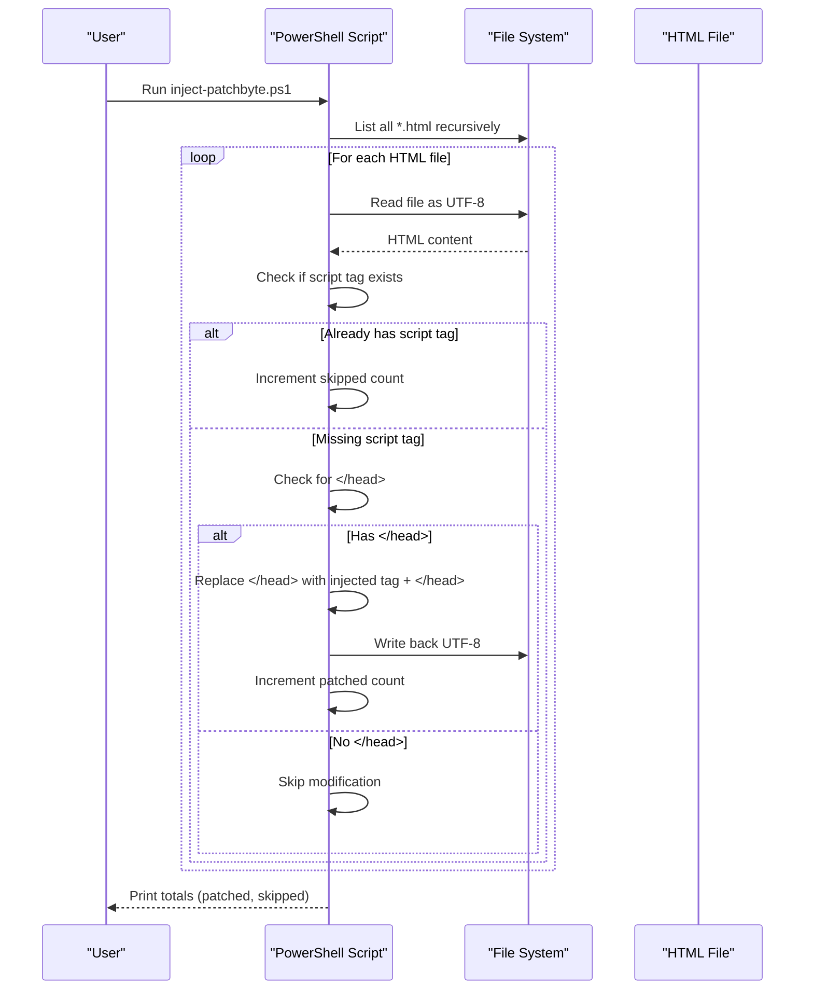
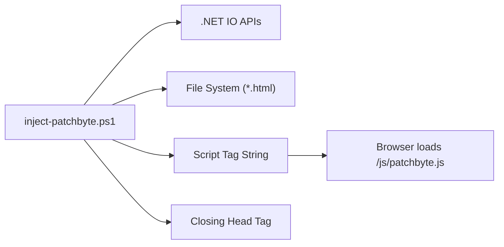

# PatchByte Injection Script

<cite>
**Referenced Files in This Document**
- [inject-patchbyte.ps1](file://inject-patchbyte.ps1)
- [patchbyte.js](file://frontend/js/patchbyte.js)
- [index.html](file://frontend/patchkraze.com/index.html)
</cite>

## Table of Contents
1. [Introduction](#introduction)
2. [Project Structure](#project-structure)
3. [Core Components](#core-components)
4. [Architecture Overview](#architecture-overview)
5. [Detailed Component Analysis](#detailed-component-analysis)
6. [Dependency Analysis](#dependency-analysis)
7. [Performance Considerations](#performance-considerations)
8. [Troubleshooting Guide](#troubleshooting-guide)
9. [Conclusion](#conclusion)
10. [Appendices](#appendices)

## Introduction
This document explains the inject-patchbyte.ps1 PowerShell script that automates integrating the PatchByte client into HTML pages. The script scans a configured directory for HTML files, detects whether each page already includes the PatchByte script tag to avoid duplication, and injects the script reference just before the closing head tag. It also documents base path configuration, file scanning behavior, encoding handling, usage examples, output statistics, customization options, and troubleshooting guidance.

## Project Structure
The relevant parts of the project for this script are:
- The PowerShell script that performs injection: inject-patchbyte.ps1
- The PatchByte client library injected into pages: frontend/js/patchbyte.js
- Example target HTML pages under the site root (e.g., frontend/patchkraze.com/*.html)

**Diagram sources**
- [inject-patchbyte.ps1:1-23](file://inject-patchbyte.ps1#L1-L23)

**Section sources**
- [inject-patchbyte.ps1:1-23](file://inject-patchbyte.ps1#L1-L23)

## Core Components
- Base path configuration: The script defines a base directory to scan for HTML files. Update this variable to point at your site’s root folder.
- Tag to inject: The script defines the exact script tag string it looks for and injects.
- File scanning: Recursively finds all .html files under the base path.
- Duplication detection: Skips any file that already contains the exact script tag string.
- Injection point: Inserts the script tag immediately before the closing head tag.
- Encoding: Reads and writes files using UTF-8 encoding to preserve content integrity.
- Statistics: Reports how many files were patched and how many were skipped due to an existing script tag.

Key behaviors and locations:
- Base path and tag definition: [inject-patchbyte.ps1:2-3]
- Recursive HTML discovery: [inject-patchbyte.ps1:4]
- Read/Write with UTF-8: [inject-patchbyte.ps1:12], [inject-patchbyte.ps1:17]
- Duplication check and skip logic: [inject-patchbyte.ps1:13]
- Injection before closing head: [inject-patchbyte.ps1:15-16]
- Output counts: [inject-patchbyte.ps1:22]

**Section sources**
- [inject-patchbyte.ps1:2-22](file://inject-patchbyte.ps1#L2-L22)

## Architecture Overview
At a high level, the script is a simple batch processor:
- Input: A directory tree containing HTML files.
- Processing: For each file, read content, detect duplication, optionally inject, write back.
- Output: Updated HTML files and console statistics.

**Diagram sources**
- [inject-patchbyte.ps1:4-22](file://inject-patchbyte.ps1#L4-L22)

## Detailed Component Analysis

### Script Configuration
- Base path: Set the directory root where the script will search for HTML files. Change this to match your project layout.
  - Reference: [inject-patchbyte.ps1:2]
- Injected tag: The exact script tag string used for both detection and injection. Ensure this matches your deployment path for patchbyte.js.
  - Reference: [inject-patchbyte.ps1:3]

### File Scanning and Targeting
- Discovery: Recursively enumerates all .html files under the base path.
  - Reference: [inject-patchbyte.ps1:4]
- Target pattern: Only .html files are considered. To change patterns, modify the search filter accordingly.

### Duplication Detection
- Strategy: If the file content already contains the exact script tag string, the file is skipped and counted as “already had script.”
  - Reference: [inject-patchbyte.ps1:13]
- Benefit: Prevents duplicate script tags on re-runs.

### Injection Logic
- Injection point: The script inserts the tag immediately before the closing head tag.
  - Reference: [inject-patchbyte.ps1:15-16]
- Condition: Only modifies files that contain a closing head tag.

### Encoding Handling
- Read/Write encoding: Uses UTF-8 for both reading and writing to preserve special characters and meta charset declarations.
  - References: [inject-patchbyte.ps1:12], [inject-patchbyte.ps1:17]

### Output Statistics
- Counts: Tracks and prints the number of patched files and skipped files.
  - Reference: [inject-patchbyte.ps1:22]

### Integration with PatchByte Client
- The injected script tag references /js/patchbyte.js. Ensure that file exists at that relative path from your site root so browsers can load it.
  - Reference: [patchbyte.js:1-6]

**Section sources**
- [inject-patchbyte.ps1:2-22](file://inject-patchbyte.ps1#L2-L22)
- [patchbyte.js:1-6](file://frontend/js/patchbyte.js#L1-L6)

## Dependency Analysis
- The script depends on:
  - PowerShell runtime and .NET IO APIs for directory traversal and file I/O.
  - The presence of HTML files with standard structure (including a closing head tag).
  - The availability of the PatchByte client at the expected URL path (/js/patchbyte.js).

**Diagram sources**
- [inject-patchbyte.ps1:2-17](file://inject-patchbyte.ps1#L2-L17)

**Section sources**
- [inject-patchbyte.ps1:2-17](file://inject-patchbyte.ps1#L2-L17)

## Performance Considerations
- Directory size: Large sites with many HTML files may take longer; consider running during off-peak times or limiting scope by adjusting the base path.
- I/O operations: Each file is read once and written only when modified. Avoid unnecessary re-runs by relying on duplication detection.
- Memory: Content is loaded into memory per file; very large HTML files could increase memory usage temporarily.

[No sources needed since this section provides general guidance]

## Troubleshooting Guide

Common issues and resolutions:
- Incorrect base path:
  - Symptom: No files found or wrong files processed.
  - Fix: Update the base path variable to point to your site root.
  - Reference: [inject-patchbyte.ps1:2]
- Missing closing head tag:
  - Symptom: Some files are not patched.
  - Explanation: The script only injects when it finds a closing head tag.
  - Reference: [inject-patchbyte.ps1:15-16]
- Duplicate script tag not detected:
  - Symptom: Repeated injections or unexpected behavior.
  - Cause: The exact string must match what the script checks.
  - Fix: Ensure the injected tag string remains consistent.
  - Reference: [inject-patchbyte.ps1:3, L13]
- Encoding problems:
  - Symptom: Characters appear garbled after injection.
  - Cause: Files not read/written with correct encoding.
  - Resolution: The script uses UTF-8; ensure no other tool changes encoding afterward.
  - Reference: [inject-patchbyte.ps1:12, L17]
- File permissions:
  - Symptom: Write errors when saving files.
  - Resolution: Run the script with sufficient privileges to read/write the target directory.
- PatchByte client not loading:
  - Symptom: Console errors about missing script.
  - Cause: /js/patchbyte.js not available at runtime.
  - Resolution: Verify the file exists at the expected path relative to your site root.
  - Reference: [patchbyte.js:1-6]

**Section sources**
- [inject-patchbyte.ps1:2-17](file://inject-patchbyte.ps1#L2-L17)
- [patchbyte.js:1-6](file://frontend/js/patchbyte.js#L1-L6)

## Conclusion
The inject-patchbyte.ps1 script provides a straightforward, idempotent way to integrate the PatchByte client across an entire static site. By configuring the base path and ensuring the PatchByte client is served at the expected URL, you can reliably inject the script into all HTML pages while avoiding duplicates and preserving encoding integrity. Use the troubleshooting tips above to resolve common setup issues quickly.

[No sources needed since this section summarizes without analyzing specific files]

## Appendices

### Usage Examples

- Basic run against a local site root:
  - Edit the base path in the script to point to your site root directory.
  - Run the script from PowerShell.
  - Review console output for counts of patched and skipped files.
  - References: [inject-patchbyte.ps1:2-6, L22]

- Targeting a subdirectory:
  - Set the base path to a specific folder (e.g., products or collections) to limit scope.
  - Reference: [inject-patchbyte.ps1:2]

- Verifying injection:
  - Open a sample HTML file and confirm the script tag appears just before the closing head tag.
  - Reference: [inject-patchbyte.ps1:15-16]

- Ensuring runtime availability:
  - Confirm that /js/patchbyte.js is accessible from your web server or local preview environment.
  - Reference: [patchbyte.js:1-6]

### Customization Options

- Change injection point:
  - Modify the replacement logic to insert the script tag at a different location (e.g., after a specific marker).
  - Current behavior targets the closing head tag.
  - Reference: [inject-patchbyte.ps1:15-16]

- Adjust target file patterns:
  - Change the file search filter to include additional extensions or exclude certain directories.
  - Reference: [inject-patchbyte.ps1:4]

- Modify the injected tag:
  - Update the tag string to use absolute URLs, add attributes (e.g., defer), or switch to a CDN path.
  - Reference: [inject-patchbyte.ps1:3]

- Control duplication detection:
  - If you need more robust detection (e.g., ignoring whitespace differences), extend the check beyond exact string matching.
  - Reference: [inject-patchbyte.ps1:13]

[No sources needed since this section provides general guidance]