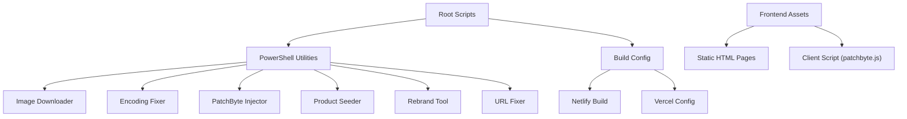
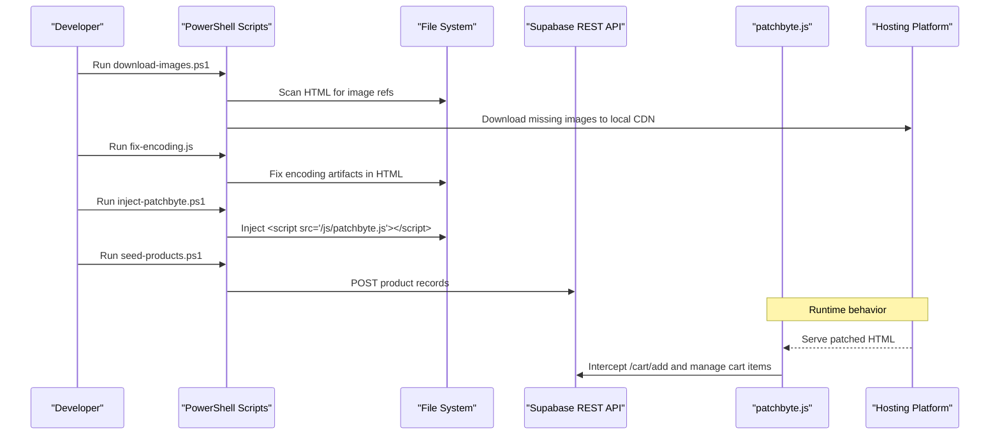
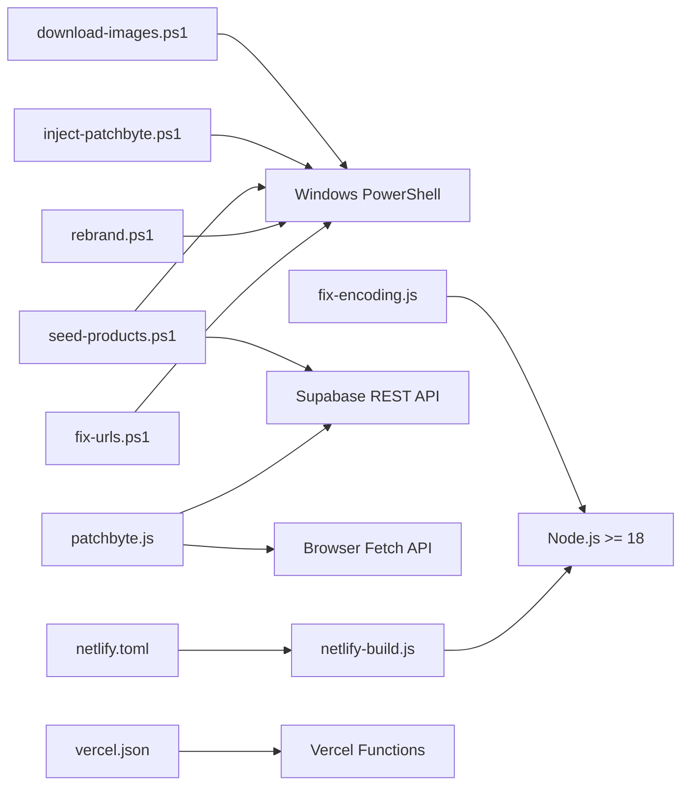

# Development Tools

<cite>
**Referenced Files in This Document**
- [download-images.ps1](file://download-images.ps1)
- [fix-encoding.js](file://fix-encoding.js)
- [inject-patchbyte.ps1](file://inject-patchbyte.ps1)
- [seed-products.ps1](file://seed-products.ps1)
- [rebrand.ps1](file://rebrand.ps1)
- [fix-urls.ps1](file://fix-urls.ps1)
- [patchbyte.js](file://frontend/js/patchbyte.js)
- [package.json](file://package.json)
- [frontend/package.json](file://frontend/package.json)
- [netlify-build.js](file://netlify-build.js)
- [migrate-tables.sql](file://migrate-tables.sql)
- [netlify.toml](file://netlify.toml)
- [vercel.json](file://vercel.json)
</cite>

## Table of Contents
1. [Introduction](#introduction)
2. [Project Structure](#project-structure)
3. [Core Components](#core-components)
4. [Architecture Overview](#architecture-overview)
5. [Detailed Component Analysis](#detailed-component-analysis)
6. [Dependency Analysis](#dependency-analysis)
7. [Performance Considerations](#performance-considerations)
8. [Troubleshooting Guide](#troubleshooting-guide)
9. [Conclusion](#conclusion)
10. [Appendices](#appendices)

## Introduction
This document explains the development tools and utilities in the Patch-Byte project. It covers PowerShell scripts for downloading images, fixing encoding issues, injecting the PatchByte client, seeding products into a database, rebranding content, and cleaning URLs. It also documents JavaScript utilities for file processing and automation, build processes for static hosting platforms, asset optimization considerations, testing utilities, and guidance for extending or creating new development tools. Environment requirements and tool dependencies are included to help you run scripts reliably.

## Project Structure
The repository includes:
- PowerShell scripts at the root for site preparation and data seeding
- A frontend directory with static HTML assets and a small Node server
- Build configuration files for Netlify and Vercel
- A migration script for database schema updates
- The PatchByte client injected into pages to integrate cart and contact features

[No sources needed since this diagram shows conceptual structure]

## Core Components
- Image downloader: Scans product and collection pages to find missing CDN images and downloads them locally.
- Encoding fixer: Fixes common character encoding artifacts across HTML files.
- PatchByte injector: Injects the PatchByte client script into all HTML pages before </head>.
- Product seeder: Parses product HTML to extract metadata and posts it to a Supabase endpoint.
- Rebrand tool: Replaces brand names and references across HTML files.
- URL fixer: Normalizes absolute URLs to relative paths and strips query strings from CDN links.
- PatchByte client: Intercepts Shopify-style fetch calls to route cart operations to Supabase and enhances UX.
- Build process: Copies assets to a public folder and configures redirects/proxies for static hosting.
- Database migrations: Adds required columns and enables permissive Row Level Security policies.

**Section sources**
- [download-images.ps1:1-69](file://download-images.ps1#L1-L69)
- [fix-encoding.js:1-87](file://fix-encoding.js#L1-L87)
- [inject-patchbyte.ps1:1-23](file://inject-patchbyte.ps1#L1-L23)
- [seed-products.ps1:1-87](file://seed-products.ps1#L1-L87)
- [rebrand.ps1:1-27](file://rebrand.ps1#L1-L27)
- [fix-urls.ps1:1-24](file://fix-urls.ps1#L1-L24)
- [patchbyte.js:1-345](file://frontend/js/patchbyte.js#L1-L345)
- [netlify-build.js:1-28](file://netlify-build.js#L1-L28)
- [migrate-tables.sql:1-57](file://migrate-tables.sql#L1-L57)

## Architecture Overview
The development workflow combines static site preparation with runtime integration via a client-side script and backend services.

**Diagram sources**
- [download-images.ps1:8-69](file://download-images.ps1#L8-L69)
- [fix-encoding.js:7-87](file://fix-encoding.js#L7-L87)
- [inject-patchbyte.ps1:1-23](file://inject-patchbyte.ps1#L1-L23)
- [seed-products.ps1:20-83](file://seed-products.ps1#L20-L83)
- [patchbyte.js:138-163](file://frontend/js/patchbyte.js#L138-L163)

## Detailed Component Analysis

### Image Downloader (download-images.ps1)
Purpose:
- Collect unique image references from product pages and selected index/collection pages
- Identify missing local copies under the CDN directory
- Download missing images from the Shopify CDN to the local filesystem

Key behaviors:
- Enforces TLS 1.2 for secure connections
- Uses regex to match image paths ending in common image extensions
- Creates subdirectories as needed and writes files locally
- Reports counts of downloaded and failed files

Usage example:
- Ensure base paths point to your local checkout of the site
- Run the script from PowerShell; it will scan and download missing images

Parameters:
- $base: Path to the products directory containing HTML files
- $cdnLocal: Local path where CDN files should be stored
- $cdnUrl: Remote CDN base URL for fetching images

Error handling:
- Network errors are caught per file and counted as failures
- Progress is printed every 25 attempts

Extending:
- Add additional directories to scan by updating the extraBase list
- Extend supported image extensions in the regex pattern

Environment requirements:
- Windows PowerShell
- Internet access to the CDN

**Section sources**
- [download-images.ps1:1-69](file://download-images.ps1#L1-L69)

### Encoding Fixer (fix-encoding.js)
Purpose:
- Traverse HTML files under a root directory and fix common encoding artifacts such as curly quotes, ellipses, dashes, and malformed JSON fragments

Key behaviors:
- Recursively walks the directory tree to collect .html files
- Applies targeted replacements to correct text and attributes
- Writes back only when changes are detected

Usage example:
- Set the root path to your site’s HTML directory
- Run with Node.js; it prints the number of fixed files

Parameters:
- root: Root directory to scan

Error handling:
- File read/write errors are not explicitly handled; ensure proper permissions

Extending:
- Add new replacement rules for other encoding issues
- Filter specific directories or file patterns if needed

Environment requirements:
- Node.js >= 18

**Section sources**
- [fix-encoding.js:1-87](file://fix-encoding.js#L1-L87)

### PatchByte Injector (inject-patchbyte.ps1)
Purpose:
- Inject the PatchByte client script tag into all HTML pages just before the closing head tag

Key behaviors:
- Scans recursively for .html files
- Skips pages that already contain the script tag
- Writes UTF-8 encoded content back to disk

Usage example:
- Set base to your site root
- Run the script; it reports how many pages were patched and how many were skipped

Parameters:
- $base: Site root directory
- $tag: Script tag to inject

Error handling:
- Missing </head> tags result in skipping the page

Extending:
- Change the script source or add additional inline scripts
- Add logic to skip specific directories or files

Environment requirements:
- Windows PowerShell

**Section sources**
- [inject-patchbyte.ps1:1-23](file://inject-patchbyte.ps1#L1-L23)

### Product Seeder (seed-products.ps1)
Purpose:
- Parse product HTML files to extract name, price, description, images, and category
- Post structured product data to a Supabase REST endpoint

Key behaviors:
- Filters out variant and pagination pages
- Extracts title, first price occurrence, meta description, and up to three images
- Infers category from slug keywords
- Sends JSON payload using HTTP headers for authentication

Usage example:
- Configure Supabase URL and key
- Run the script; it prints success/failure per product

Parameters:
- $base: Products directory path
- $supabaseUrl: Base URL of Supabase instance
- $supabaseKey: Anonymous key for REST access

Error handling:
- Catches network errors and prints detailed error messages
- Continues processing remaining files

Extending:
- Add more category heuristics
- Include additional fields like SKU or inventory count

Environment requirements:
- Windows PowerShell
- TLS 1.2 enabled
- Internet access to Supabase

**Section sources**
- [seed-products.ps1:1-87](file://seed-products.ps1#L1-L87)

### Rebrand Tool (rebrand.ps1)
Purpose:
- Replace brand names and references across all HTML files to customize appearance

Key behaviors:
- Replaces “Patch Kraze” and lowercase “patchkraze” (excluding domain suffix) with “PatchByte”
- Counts total replacements and logs modified files

Usage example:
- Set base to your site root
- Run the script; it reports total replacements

Parameters:
- $base: Site root directory

Error handling:
- No explicit error handling; ensure write permissions

Extending:
- Add more replacement rules for other brand terms
- Exclude specific directories or file patterns

Environment requirements:
- Windows PowerShell

**Section sources**
- [rebrand.ps1:1-27](file://rebrand.ps1#L1-L27)

### URL Fixer (fix-urls.ps1)
Purpose:
- Normalize absolute URLs to relative paths and remove query strings from CDN links

Key behaviors:
- Scans multiple directories for HTML files excluding variant/page/oembed/atom variants
- Replaces full CDN URLs with relative paths
- Removes query parameters from CDN resource URLs

Usage example:
- Set base to your site root
- Run the script; it reports completion

Parameters:
- $base: Site root directory

Error handling:
- No explicit error handling; ensure write permissions

Extending:
- Add more URL patterns to normalize
- Support additional domains or protocols

Environment requirements:
- Windows PowerShell

**Section sources**
- [fix-urls.ps1:1-24](file://fix-urls.ps1#L1-L24)

### PatchByte Client (frontend/js/patchbyte.js)
Purpose:
- Integrate cart and contact functionality by intercepting Shopify-style fetch calls and routing them to Supabase
- Provide a consistent cart experience without modifying theme code extensively

Key behaviors:
- Maintains a session ID in localStorage
- Wraps fetch to handle /cart/add, /cart/change, /cart/update, and cart JSON endpoints
- Manages cart items via Supabase REST API
- Updates UI badges and displays toast notifications
- Wires contact forms to submit to Supabase
- Exposes a public API for custom integrations

Usage example:
- Ensure the script is injected into pages before DOMContentLoaded
- Use window.PatchByte methods for advanced interactions

Parameters:
- SB_URL and SB_KEY: Supabase instance and anonymous key
- HEADERS: Authentication and content type headers

Error handling:
- Silent failures for badge refresh
- Alerts on contact form submission errors
- Logs cart operation errors

Extending:
- Add support for additional cart properties
- Customize toast styling or behavior
- Add analytics hooks around cart actions

Environment requirements:
- Modern browser with fetch and localStorage
- Access to Supabase REST API

**Section sources**
- [patchbyte.js:1-345](file://frontend/js/patchbyte.js#L1-L345)

### Build Process (netlify-build.js)
Purpose:
- Prepare static assets for deployment by copying HTML, theme assets, fonts, and the client script into a public folder

Key behaviors:
- Copies patchkraze.com while skipping nested cdn folders
- Copies theme CSS/JS from a dedicated source
- Copies fonts locally to avoid external CDN dependencies
- Copies patchbyte.js to the public js directory

Usage example:
- Run via Netlify build command configured in netlify.toml
- Output is published from the public directory

Parameters:
- Source and destination paths are hardcoded within the script

Error handling:
- Skips missing source directories gracefully

Extending:
- Add additional asset categories to copy
- Implement minification or bundling steps

Environment requirements:
- Node.js >= 18

**Section sources**
- [netlify-build.js:1-28](file://netlify-build.js#L1-L28)

### Database Migration (migrate-tables.sql)
Purpose:
- Add required columns to existing tables and enable permissive Row Level Security policies for anonymous users

Key behaviors:
- Adds product-related fields to cart_items, orders, and order_items
- Adds contact fields to contact_submissions
- Enables RLS and creates policies allowing anonymous inserts and reads

Usage example:
- Run in Supabase SQL Editor as instructed in comments

Parameters:
- None; executed directly against the database

Error handling:
- Uses IF NOT EXISTS and DROP POLICY IF EXISTS for idempotency

Extending:
- Add indexes for performance
- Define stricter policies as needed

Environment requirements:
- Supabase SQL Editor access

**Section sources**
- [migrate-tables.sql:1-57](file://migrate-tables.sql#L1-L57)

## Dependency Analysis
Tools and their dependencies:

**Diagram sources**
- [download-images.ps1:1-69](file://download-images.ps1#L1-L69)
- [fix-encoding.js:1-87](file://fix-encoding.js#L1-L87)
- [inject-patchbyte.ps1:1-23](file://inject-patchbyte.ps1#L1-L23)
- [seed-products.ps1:1-87](file://seed-products.ps1#L1-L87)
- [rebrand.ps1:1-27](file://rebrand.ps1#L1-L27)
- [fix-urls.ps1:1-24](file://fix-urls.ps1#L1-L24)
- [patchbyte.js:1-345](file://frontend/js/patchbyte.js#L1-L345)
- [netlify-build.js:1-28](file://netlify-build.js#L1-L28)
- [netlify.toml:1-165](file://netlify.toml#L1-L165)
- [vercel.json:1-12](file://vercel.json#L1-L12)

**Section sources**
- [package.json:1-14](file://package.json#L1-L14)
- [frontend/package.json:1-19](file://frontend/package.json#L1-L19)
- [netlify.toml:1-165](file://netlify.toml#L1-L165)
- [vercel.json:1-12](file://vercel.json#L1-L12)

## Performance Considerations
- Image downloader: Limits timeout per request and batches progress output; consider adding concurrency controls for large catalogs.
- Encoding fixer: Processes files sequentially; for very large sites, consider parallelization or streaming writes.
- PatchByte client: Minimizes network calls by caching session and batching badge updates; avoid excessive DOM queries in tight loops.
- Build process: Copies assets efficiently; consider adding compression or asset hashing for production.
- Database: Ensure appropriate indexes on frequently queried fields like product_slug and session_id.

[No sources needed since this section provides general guidance]

## Troubleshooting Guide
Common issues and resolutions:
- Images fail to download: Verify TLS 1.2 is enabled and CDN URL is accessible; check network timeouts and retry logic.
- Encoding fixes not applied: Confirm file encoding is UTF-8 and paths are correct; validate regex patterns for target artifacts.
- PatchByte injection fails: Ensure </head> exists; verify script path is correct and accessible after deployment.
- Product seeding errors: Check Supabase key validity, CORS settings, and table existence; inspect error responses for details.
- Rebrand tool misses targets: Adjust regex to exclude false positives like domain names; verify base path.
- URL normalization breaks links: Test after running; ensure relative paths resolve correctly in hosting environment.
- Build fails on platform: Confirm Node version matches engines requirement; verify source directories exist.

**Section sources**
- [download-images.ps1:58-65](file://download-images.ps1#L58-L65)
- [fix-encoding.js:17-83](file://fix-encoding.js#L17-L83)
- [inject-patchbyte.ps1:11-20](file://inject-patchbyte.ps1#L11-L20)
- [seed-products.ps1:70-82](file://seed-products.ps1#L70-L82)
- [rebrand.ps1:7-22](file://rebrand.ps1#L7-L22)
- [fix-urls.ps1:14-22](file://fix-urls.ps1#L14-L22)
- [netlify-build.js:4-14](file://netlify-build.js#L4-L14)

## Conclusion
The Patch-Byte development toolkit streamlines site preparation, data synchronization, and runtime integration. PowerShell scripts automate repetitive tasks like image management, content fixes, and branding, while the PatchByte client bridges static pages with a dynamic backend. Build configurations ensure reliable deployments across hosting platforms. By following the usage examples and extension guidelines, teams can maintain consistency and scale the toolset as needs evolve.

[No sources needed since this section summarizes without analyzing specific files]

## Appendices

### Environment Requirements
- Node.js >= 18 for JavaScript utilities and build scripts
- Windows PowerShell for PowerShell-based tools
- Internet access for CDN downloads and Supabase API calls
- Appropriate file system permissions for writing HTML and asset files

**Section sources**
- [package.json:8-13](file://package.json#L8-L13)
- [frontend/package.json:9-17](file://frontend/package.json#L9-L17)

### Extending Existing Tools
- Add new replacement rules in encoding fixer for emerging artifacts
- Expand image downloader to support additional formats or sources
- Enhance PatchByte client with new UI components or analytics events
- Update build process to include asset optimization steps like minification or caching strategies

[No sources needed since this section provides general guidance]

### Testing Utilities
- Validate image downloads by checking file counts and sizes
- Verify encoding fixes by spot-checking affected pages
- Confirm PatchByte injection by inspecting page source for the script tag
- Test product seeding by querying Supabase for expected records
- Rebrand verification by searching for replaced terms in output files
- URL normalization checks by ensuring links resolve correctly in the deployed site

[No sources needed since this section provides general guidance]