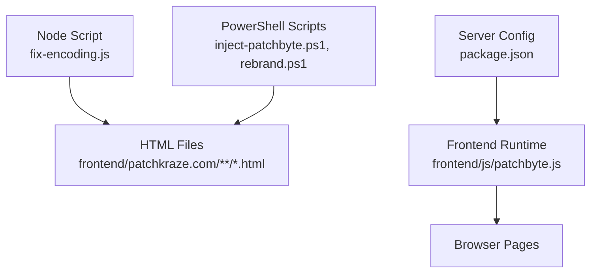
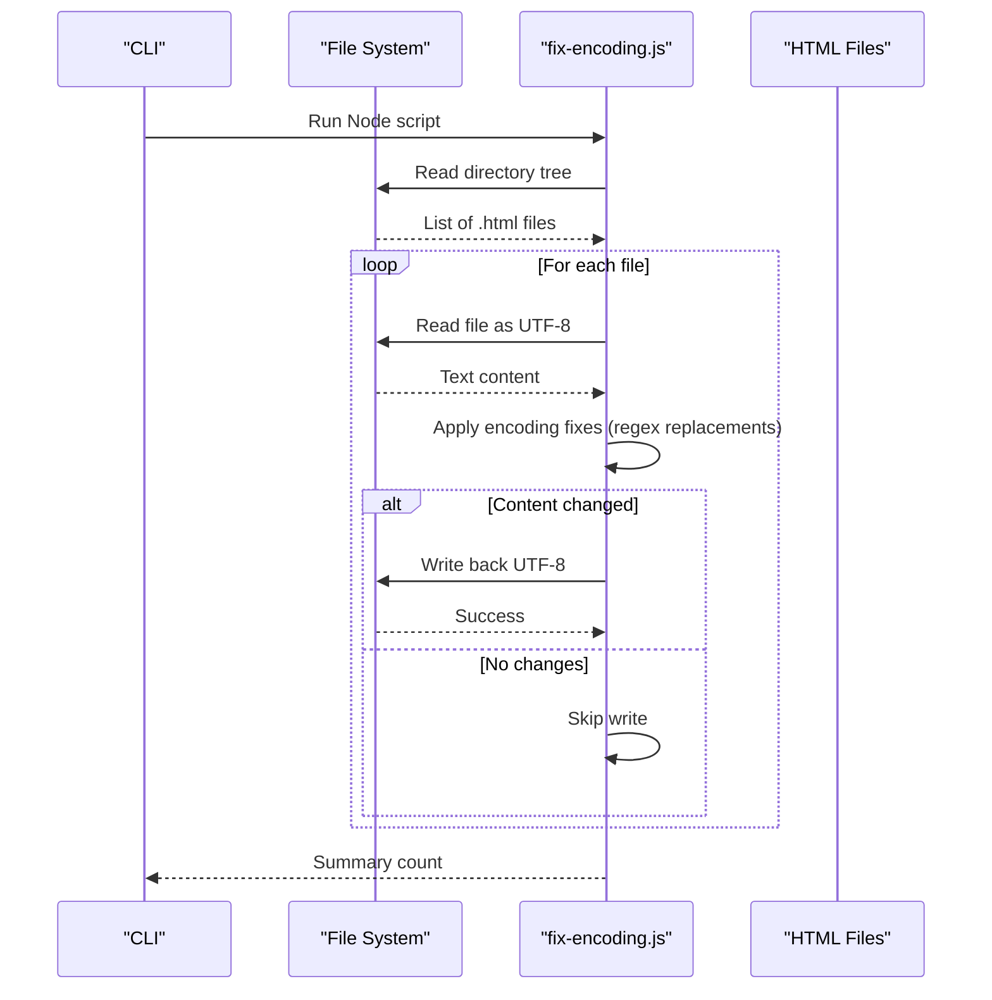
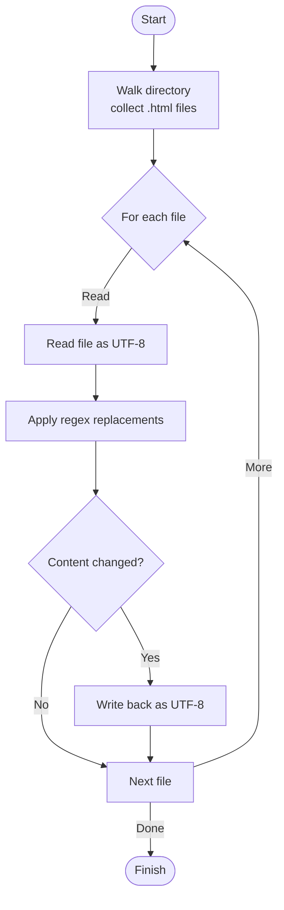
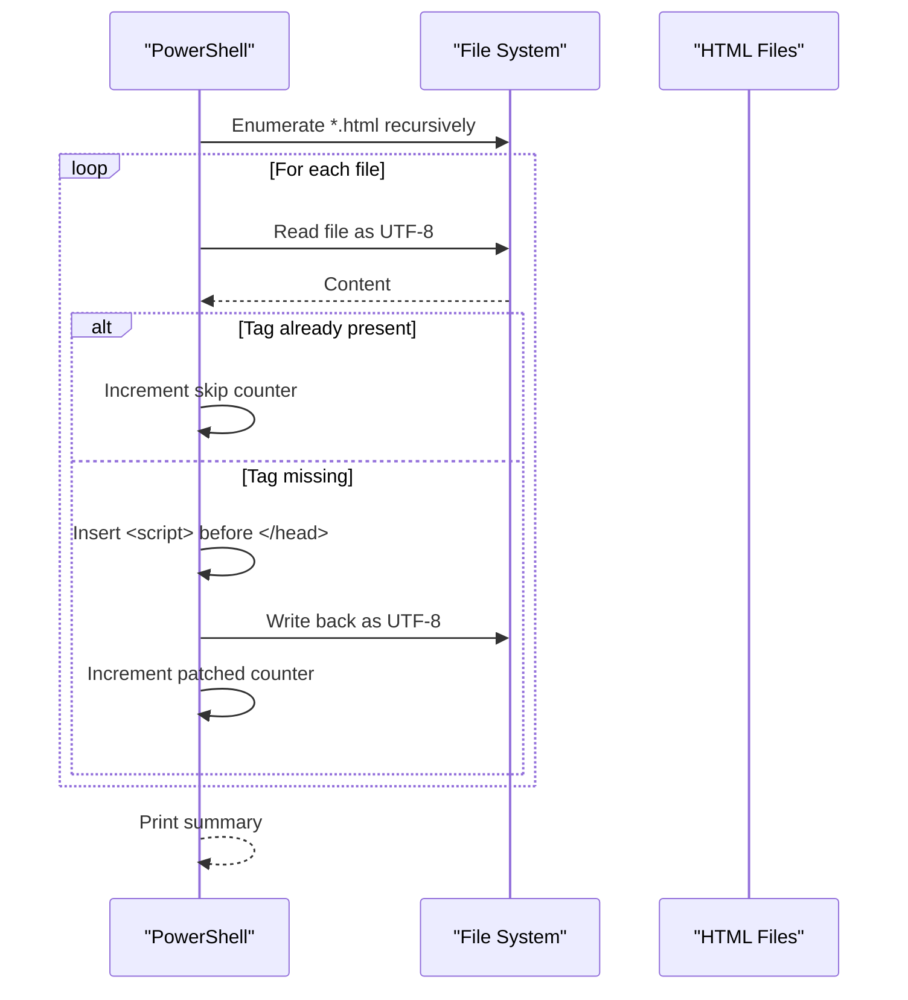
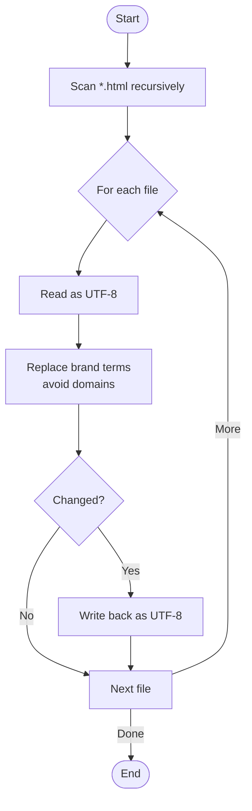
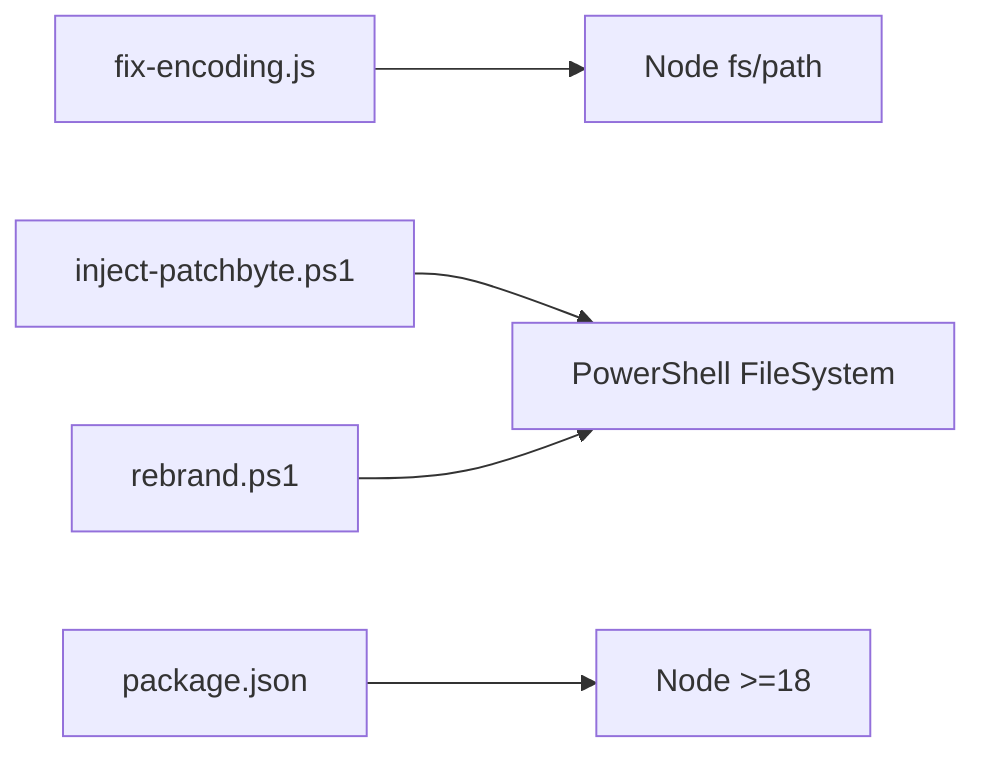

# File Processing Utilities

<cite>
**Referenced Files in This Document**
- [fix-encoding.js](file://fix-encoding.js)
- [package.json](file://package.json)
- [inject-patchbyte.ps1](file://inject-patchbyte.ps1)
- [rebrand.ps1](file://rebrand.ps1)
- [patchbyte.js](file://frontend/js/patchbyte.js)
- [index.html](file://frontend/patchkraze.com/index.html)
</cite>

## Table of Contents
1. [Introduction](#introduction)
2. [Project Structure](#project-structure)
3. [Core Components](#core-components)
4. [Architecture Overview](#architecture-overview)
5. [Detailed Component Analysis](#detailed-component-analysis)
6. [Dependency Analysis](#dependency-analysis)
7. [Performance Considerations](#performance-considerations)
8. [Troubleshooting Guide](#troubleshooting-guide)
9. [Conclusion](#conclusion)
10. [Appendices](#appendices)

## Introduction
This document provides detailed documentation for file processing utilities that handle text encoding and file manipulation tasks, with a focus on the fix-encoding.js JavaScript utility. The utility scans HTML files under a specified directory, detects common character encoding artifacts (mojibake), and replaces them with correct Unicode characters. It is designed to be run as part of build or development workflows to ensure consistent rendering across e-commerce pages.

The scope includes:
- Encoding detection strategies used by the utility
- Supported character sets and replacement patterns
- Conversion processes and data flow
- Integration examples into build pipelines
- Common encoding problems in e-commerce applications and how they are addressed
- Guidance for extending support to additional encodings or file types
- Performance considerations and batch processing capabilities

## Project Structure
The repository contains a Node-based project with frontend assets and several automation scripts. The key elements relevant to this document include:
- A Node script for fixing encoding issues in HTML files
- PowerShell scripts for injecting runtime scripts and performing bulk rebranding
- Frontend assets including a client-side integration script
- An example HTML page declaring UTF-8 metadata

**Diagram sources**
- [fix-encoding.js:1-14](file://fix-encoding.js#L1-L14)
- [inject-patchbyte.ps1:1-23](file://inject-patchbyte.ps1#L1-L23)
- [rebrand.ps1:1-27](file://rebrand.ps1#L1-L27)
- [patchbyte.js:1-10](file://frontend/js/patchbyte.js#L1-L10)
- [package.json:1-14](file://package.json#L1-L14)

**Section sources**
- [fix-encoding.js:1-14](file://fix-encoding.js#L1-L14)
- [package.json:1-14](file://package.json#L1-L14)

## Core Components
- fix-encoding.js: Scans HTML files recursively and applies targeted replacements to correct encoding artifacts.
- inject-patchbyte.ps1: Injects a client-side script tag into HTML pages to enable runtime features.
- rebrand.ps1: Performs bulk text replacements across HTML files for branding updates.
- patchbyte.js: Client-side script integrated into pages for cart/contact functionality.
- index.html: Example page with proper meta charset declaration.

Key responsibilities:
- Detect and replace mojibake sequences caused by incorrect encoding assumptions during export or transfer.
- Ensure consistent UI text such as ellipses, quotes, separators, and ornaments render correctly.
- Provide reusable automation for content maintenance tasks.

**Section sources**
- [fix-encoding.js:16-88](file://fix-encoding.js#L16-L88)
- [inject-patchbyte.ps1:1-23](file://inject-patchbyte.ps1#L1-L23)
- [rebrand.ps1:1-27](file://rebrand.ps1#L1-L27)
- [patchbyte.js:1-10](file://frontend/js/patchbyte.js#L1-L10)
- [index.html:16-16](file://frontend/patchkraze.com/index.html#L16-L16)

## Architecture Overview
The encoding fixer operates as a standalone Node script that:
- Traverses a target directory to collect all HTML files
- Reads each file as UTF-8 text
- Applies a series of regex-based replacements to normalize problematic characters
- Writes back only if changes were detected

**Diagram sources**
- [fix-encoding.js:1-14](file://fix-encoding.js#L1-L14)
- [fix-encoding.js:16-88](file://fix-encoding.js#L16-L88)

## Detailed Component Analysis

### fix-encoding.js: Encoding Detection and Replacement
The utility implements a pragmatic approach to encoding normalization by targeting known mojibake patterns rather than attempting full encoding detection. It reads files as UTF-8 and uses string replacement to correct common issues observed in exported HTML content.

Supported replacements include:
- Copyright symbol corruption
- Smart apostrophes and curly quotes
- Minus sign vs en-dash confusion
- Ellipsis rendering issues
- Ornament symbols misrendered as question marks or placeholders
- JSON attribute values containing special characters
- Missing punctuation after links

**Diagram sources**
- [fix-encoding.js:7-14](file://fix-encoding.js#L7-L14)
- [fix-encoding.js:16-88](file://fix-encoding.js#L16-L88)

Implementation notes:
- Directory traversal is recursive and limited to HTML files.
- Each replacement targets specific mojibake patterns found in the site’s content.
- Only modified files are written back, minimizing I/O overhead.
- Output reports the number of fixed files.

Common categories of fixes:
- Typography normalization: curly quotes, smart apostrophes, ellipses, bullet points
- Separator correction: en-dashes and em-dashes
- Symbol restoration: copyright symbol, star ornament
- JSON attribute cleanup: escaped quotes and special characters within attributes
- Minor punctuation corrections: missing periods after email links

**Section sources**
- [fix-encoding.js:7-14](file://fix-encoding.js#L7-L14)
- [fix-encoding.js:16-88](file://fix-encoding.js#L16-L88)

### inject-patchbyte.ps1: Script Injection Utility
This PowerShell script scans HTML files under a base path and injects a script tag before the closing head element if not already present. It reads and writes using UTF-8 encoding to preserve content integrity.

Key behaviors:
- Recursively finds HTML files
- Skips files that already contain the target script tag
- Injects the script tag just before </head>
- Reports counts of patched and skipped files

**Diagram sources**
- [inject-patchbyte.ps1:1-23](file://inject-patchbyte.ps1#L1-L23)

**Section sources**
- [inject-patchbyte.ps1:1-23](file://inject-patchbyte.ps1#L1-L23)

### rebrand.ps1: Bulk Rebranding Utility
This script performs global text replacements across HTML files to update brand names and references. It uses case-insensitive matching where appropriate and avoids changing domain names unintentionally.

Key behaviors:
- Recursively scans HTML files
- Replaces brand strings while preserving URLs
- Tracks total replacements and logs affected files
- Writes back only when content changes

**Diagram sources**
- [rebrand.ps1:1-27](file://rebrand.ps1#L1-L27)

**Section sources**
- [rebrand.ps1:1-27](file://rebrand.ps1#L1-L27)

### patchbyte.js: Client-Side Integration
While not an encoding tool, this script demonstrates how runtime behavior can be injected into pages via the PowerShell utility. It intercepts fetch calls, manages cart state, and enhances user experience.

Highlights:
- Intercepts Shopify-style cart endpoints
- Persists session identifiers locally
- Updates UI badges and notifications
- Provides a public API for other scripts

**Section sources**
- [patchbyte.js:1-10](file://frontend/js/patchbyte.js#L1-L10)
- [patchbyte.js:138-163](file://frontend/js/patchbyte.js#L138-L163)
- [patchbyte.js:237-263](file://frontend/js/patchbyte.js#L237-L263)

### index.html: Page Metadata
The example page declares UTF-8 encoding in its meta tag, ensuring browsers interpret content consistently.

**Section sources**
- [index.html:16-16](file://frontend/patchkraze.com/index.html#L16-L16)

## Dependency Analysis
The utilities have minimal external dependencies:
- fix-encoding.js relies on Node’s built-in fs and path modules
- PowerShell scripts rely on native filesystem operations
- package.json defines Node engine requirements and server dependencies unrelated to encoding fixes

**Diagram sources**
- [fix-encoding.js:1-2](file://fix-encoding.js#L1-L2)
- [inject-patchbyte.ps1:1-23](file://inject-patchbyte.ps1#L1-L23)
- [rebrand.ps1:1-27](file://rebrand.ps1#L1-L27)
- [package.json:8-8](file://package.json#L8-L8)

**Section sources**
- [fix-encoding.js:1-2](file://fix-encoding.js#L1-L2)
- [package.json:1-14](file://package.json#L1-L14)

## Performance Considerations
- Batch processing: The script walks directories recursively and processes files sequentially. For large sites, consider parallelization or streaming to reduce memory usage.
- Selective writes: Only modified files are written back, reducing disk I/O.
- Regex efficiency: Targeted patterns minimize unnecessary scanning; avoid overly broad matches to prevent performance degradation.
- Encoding handling: Reading and writing as UTF-8 ensures consistent behavior; avoid repeated conversions.
- Scalability tips:
  - Use glob patterns or async iteration to process files concurrently where safe
  - Add logging to track progress and errors
  - Implement dry-run mode to preview changes without writing

[No sources needed since this section provides general guidance]

## Troubleshooting Guide
Common issues and resolutions:
- Incorrect root path: Ensure the configured root directory exists and contains HTML files.
- Permission errors: Verify read/write permissions for the target directory.
- Unexpected replacements: Review regex patterns to ensure they match intended mojibake sequences only.
- Large file sizes: Monitor memory usage; consider chunked processing for very large files.
- Mixed encodings: If files are not truly UTF-8, reading as UTF-8 may produce unexpected results; validate source encoding prior to running the fixer.

Operational checks:
- Confirm Node version meets minimum requirements
- Validate that the script runs from the repository root or adjust paths accordingly
- Inspect console output for the number of fixed files

**Section sources**
- [fix-encoding.js:4-4](file://fix-encoding.js#L4-L4)
- [fix-encoding.js:82-88](file://fix-encoding.js#L82-L88)
- [package.json:8-8](file://package.json#L8-L8)

## Conclusion
The fix-encoding.js utility provides a practical solution for normalizing encoding artifacts in e-commerce HTML content. By focusing on known mojibake patterns and applying targeted replacements, it ensures consistent rendering of typography, symbols, and structured content. Combined with complementary PowerShell utilities for script injection and bulk rebranding, the repository offers a cohesive set of tools for maintaining content quality and consistency across large static sites.

[No sources needed since this section summarizes without analyzing specific files]

## Appendices

### Usage Examples
- Run the encoding fixer:
  - Execute the Node script to scan and fix HTML files under the configured root directory.
  - Review console output for the number of files fixed.
- Integrate into build workflows:
  - Add a step in your CI/CD pipeline to run the encoding fixer before deployment.
  - Combine with other asset processing steps to ensure content correctness.
- Inject runtime scripts:
  - Use the PowerShell script to inject client-side scripts into HTML pages.
  - Verify that the script tag appears once per page and is placed before </head>.
- Perform bulk rebranding:
  - Run the rebranding script to update brand names and references across pages.
  - Validate changes in a staging environment before production deployment.

[No sources needed since this section provides general guidance]

### Extending the Utility
To support additional encodings or file types:
- Expand file type filters:
  - Modify the directory walker to include other text-based formats (e.g., .css, .js, .json).
- Enhance detection logic:
  - Add new regex patterns for observed mojibake sequences.
  - Consider implementing basic encoding sniffing for non-UTF-8 inputs.
- Improve robustness:
  - Add error handling for unreadable files or permission issues.
  - Implement dry-run mode and verbose logging for auditing.
- Optimize performance:
  - Parallelize file processing where concurrency is safe.
  - Cache file lists and reuse transformations across runs.

[No sources needed since this section provides general guidance]