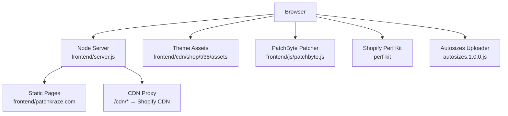
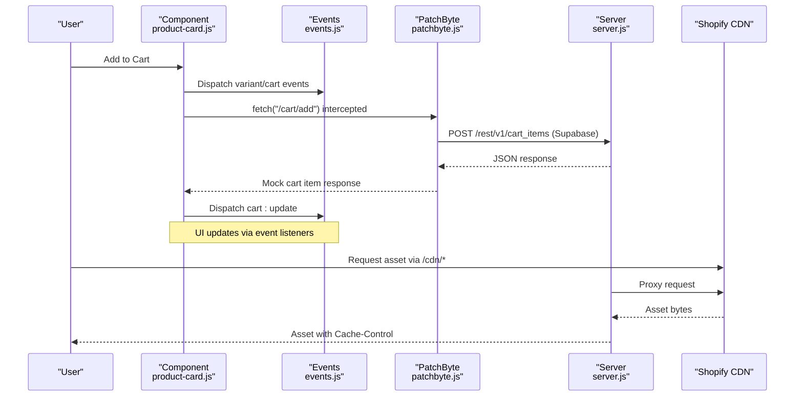
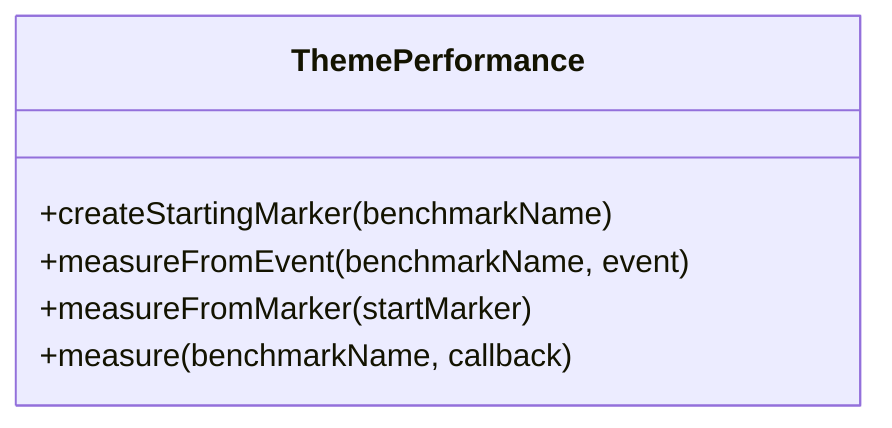
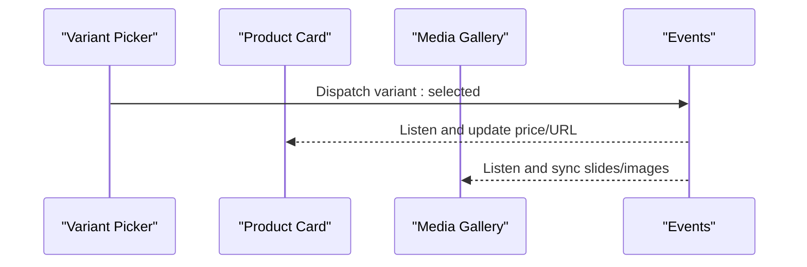
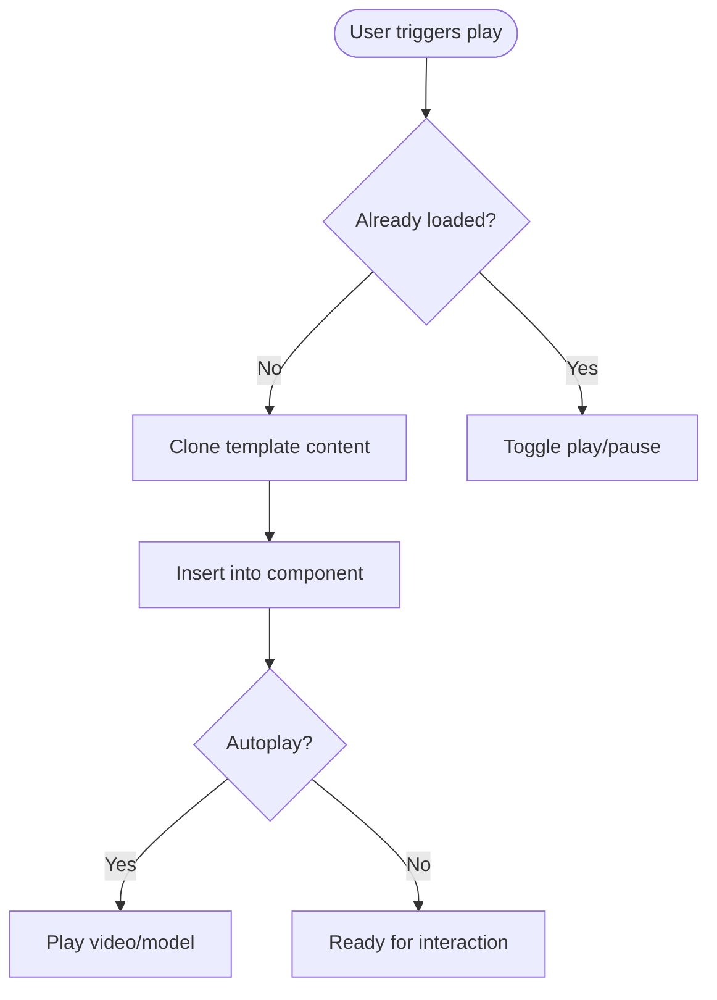
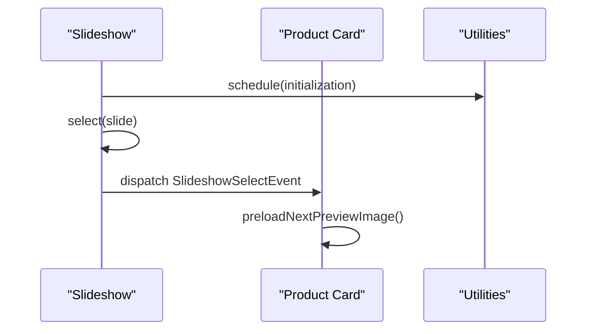
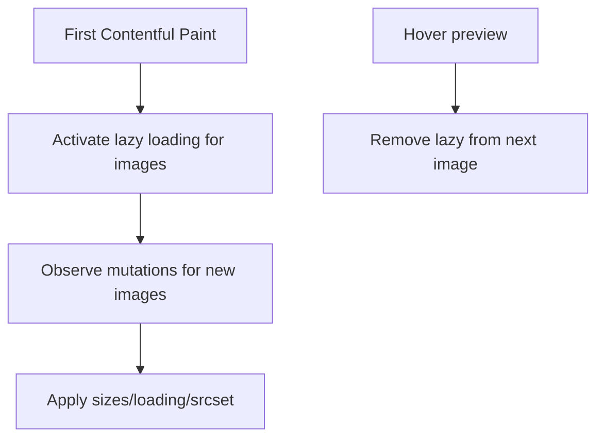
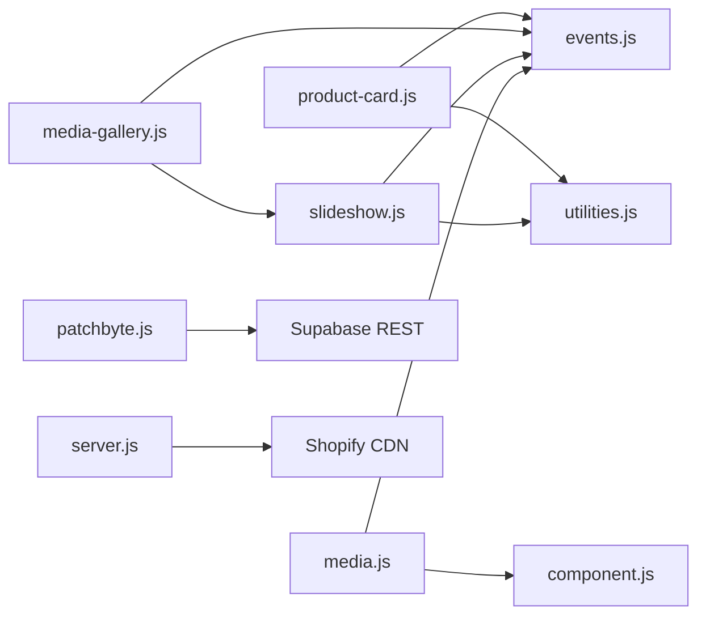

# Asset Management and Performance

<cite>
**Referenced Files in This Document**
- [performance.js](file://frontend/cdn/shop/t/38/assets/performance.js)
- [utilities.js](file://frontend/cdn/shop/t/38/assets/utilities.js)
- [events.js](file://frontend/cdn/shop/t/38/assets/events.js)
- [component.js](file://frontend/cdn/shop/t/38/assets/component.js)
- [media.js](file://frontend/cdn/shop/t/38/assets/media.js)
- [slideshow.js](file://frontend/cdn/shop/t/38/assets/slideshow.js)
- [product-card.js](file://frontend/cdn/shop/t/38/assets/product-card.js)
- [media-gallery.js](file://frontend/cdn/shop/t/38/assets/media-gallery.js)
- [patchbyte.js](file://frontend/js/patchbyte.js)
- [server.js](file://frontend/server.js)
- [netlify-build.js](file://netlify-build.js)
- [autosizes.1.0.0.js](file://frontend/patchkraze.com/cdn/cdn/shopifycloud/autosizes-uploader/autosizes.1.0.0.js)
- [shopify-perf-kit-3.3.1.min.js](file://frontend/patchkraze.com/cdn/cdn/shopifycloud/perf-kit/shopify-perf-kit-3.3.1.min.js)
</cite>

## Table of Contents
1. Introduction
2. Project Structure
3. Core Components
4. Architecture Overview
5. Detailed Component Analysis
6. Dependency Analysis
7. Performance Considerations
8. Troubleshooting Guide
9. Conclusion
10. Appendices

## Introduction
This document explains how the application manages assets and optimizes performance across a Shopify-hosted storefront with a custom Node server for local development and static hosting. It covers CDN integration, lazy loading, resource prioritization, utility functions, event handling patterns, performance monitoring, image optimization, font loading, bundle size minimization, caching, compression, and measurement/improvement of Core Web Vitals.

## Project Structure
The project separates theme assets (JS/CSS) under the Shopify theme directory, a small Node server for local/static serving and CDN proxying, and build scripts that prepare assets for deployment. Key areas:
- Theme assets: modular JS components and utilities under frontend/cdn/shop/t/38/assets
- Frontend runtime patcher: frontend/js/patchbyte.js intercepts cart interactions and integrates with Supabase
- Server: frontend/server.js serves static pages and proxies /cdn to Shopify CDN
- Build script: netlify-build.js copies theme assets and fonts into a deployable public folder
- Third-party performance tooling: Shopify perf kit and autosizes uploader under patchkraze.com/cdn/cdn/shopifycloud

**Diagram sources**
- [server.js:46-65](file://frontend/server.js#L46-L65)
- [netlify-build.js:16-26](file://netlify-build.js#L16-L26)
- [autosizes.1.0.0.js:30-60](file://frontend/patchkraze.com/cdn/cdn/shopifycloud/autosizes-uploader/autosizes.1.0.0.js#L30-L60)
- [shopify-perf-kit-3.3.1.min.js:2006-2061](file://frontend/patchkraze.com/cdn/cdn/shopifycloud/perf-kit/shopify-perf-kit-3.3.1.min.js#L2006-L2061)

**Section sources**
- [server.js:46-65](file://frontend/server.js#L46-L65)
- [netlify-build.js:16-26](file://netlify-build.js#L16-L26)

## Core Components
- Performance measurement: A lightweight class to mark and measure timings around user actions and callbacks.
- Utilities: Debounce/throttle, idle scheduling, media queries, visibility helpers, image preloading, header height calculations, and scheduler for batching DOM work.
- Events: Centralized event names and typed events for variant selection, cart updates, media playback, and more.
- Components: Declarative shadow DOM base component, deferred media, slideshow, product card, and media gallery.
- PatchByte: Intercepts fetch calls to integrate cart operations with Supabase and update UI accordingly.
- Server: Serves static content and proxies /cdn to Shopify CDN; sets cache headers for proxied assets.

**Section sources**
- [performance.js:1-62](file://frontend/cdn/shop/t/38/assets/performance.js#L1-L62)
- [utilities.js:1-324](file://frontend/cdn/shop/t/38/assets/utilities.js#L1-L324)
- [events.js:1-142](file://frontend/cdn/shop/t/38/assets/events.js#L1-L142)
- [component.js:1-139](file://frontend/cdn/shop/t/38/assets/component.js#L1-L139)
- [media.js:1-260](file://frontend/cdn/shop/t/38/assets/media.js#L1-L260)
- [slideshow.js:1-912](file://frontend/cdn/shop/t/38/assets/slideshow.js#L1-L912)
- [product-card.js:1-608](file://frontend/cdn/shop/t/38/assets/product-card.js#L1-L608)
- [media-gallery.js:1-99](file://frontend/cdn/shop/t/38/assets/media-gallery.js#L1-L99)
- [patchbyte.js:1-345](file://frontend/js/patchbyte.js#L1-L345)
- [server.js:1-123](file://frontend/server.js#L1-L123)

## Architecture Overview
The runtime architecture centers on modular theme components that communicate via a centralized event system and shared utilities. The server provides static file serving and a CDN proxy to Shopify’s content delivery network. PatchByte intercepts cart-related fetch requests to route them to Supabase while preserving expected Shopify responses for UI compatibility.

**Diagram sources**
- [product-card.js:87-118](file://frontend/cdn/shop/t/38/assets/product-card.js#L87-L118)
- [events.js:1-142](file://frontend/cdn/shop/t/38/assets/events.js#L1-L142)
- [patchbyte.js:138-163](file://frontend/js/patchbyte.js#L138-L163)
- [server.js:50-65](file://frontend/server.js#L50-L65)

## Detailed Component Analysis

### Performance Measurement
A small class creates named marks and measures durations around callbacks or events, enabling targeted profiling of cart interactions and other critical paths.

**Diagram sources**
- [performance.js:1-62](file://frontend/cdn/shop/t/38/assets/performance.js#L1-L62)

**Section sources**
- [performance.js:1-62](file://frontend/cdn/shop/t/38/assets/performance.js#L1-L62)

### Utilities Library
Provides cross-cutting helpers used by components:
- Scheduling and yielding: requestIdleCallback fallback, requestYieldCallback, Scheduler for batching tasks after view transitions.
- Device and feature detection: low-power device check, view transition support, reduced motion preference.
- DOM and layout helpers: getVisibleElements, center/start, closest, clamp, resize observer wrapper, header height calculations.
- Network helpers: standardized fetchConfig for JSON/JSXHR requests.
- Preload helpers: preloadImage for eager fetching when needed.

These utilities reduce duplication and centralize performance-conscious behaviors like debouncing, throttling, and idle scheduling.

**Section sources**
- [utilities.js:1-324](file://frontend/cdn/shop/t/38/assets/utilities.js#L1-L324)

### Event Handling Patterns
Centralized event constants and typed events decouple components:
- Variant selection/update events drive UI changes without tight coupling.
- Cart events standardize add/update/error flows.
- Media and zoom events coordinate galleries and dialogs.
Components listen for these events to react to state changes initiated elsewhere.

**Diagram sources**
- [events.js:1-142](file://frontend/cdn/shop/t/38/assets/events.js#L1-L142)
- [product-card.js:87-118](file://frontend/cdn/shop/t/38/assets/product-card.js#L87-L118)
- [media-gallery.js:21-35](file://frontend/cdn/shop/t/38/assets/media-gallery.js#L21-L35)

**Section sources**
- [events.js:1-142](file://frontend/cdn/shop/t/38/assets/events.js#L1-L142)
- [product-card.js:87-118](file://frontend/cdn/shop/t/38/assets/product-card.js#L87-L118)
- [media-gallery.js:21-35](file://frontend/cdn/shop/t/38/assets/media-gallery.js#L21-L35)

### Deferred Media and Lazy Loading
Deferred media loads heavy content only when needed:
- Content is stored in templates and cloned into the DOM on demand.
- Plays/pauses videos and iframes consistently.
- Emits media started playing events to pause other media instances.
- Integrates with model-viewer features where applicable.

**Diagram sources**
- [media.js:62-94](file://frontend/cdn/shop/t/38/assets/media.js#L62-L94)
- [media.js:96-147](file://frontend/cdn/shop/t/38/assets/media.js#L96-L147)

**Section sources**
- [media.js:1-260](file://frontend/cdn/shop/t/38/assets/media.js#L1-L260)

### Slideshow and Resource Prioritization
The slideshow coordinates slide navigation, visibility thresholds, and scroll synchronization:
- Uses visibility thresholds to determine visible slides.
- Batches initial setup and resize updates via the scheduler to avoid jank.
- Respects reduced motion preferences and pauses autoplay on hover/focus loss.
- Coordinates with product cards to preload next images and avoid white flashes.

**Diagram sources**
- [slideshow.js:531-569](file://frontend/cdn/shop/t/38/assets/slideshow.js#L531-L569)
- [product-card.js:101-118](file://frontend/cdn/shop/t/38/assets/product-card.js#L101-L118)

**Section sources**
- [slideshow.js:1-912](file://frontend/cdn/shop/t/38/assets/slideshow.js#L1-L912)
- [product-card.js:101-118](file://frontend/cdn/shop/t/38/assets/product-card.js#L101-L118)

### Image Optimization Strategies
- Lazy loading: Images use native lazy loading attributes; the autosizes uploader dynamically activates lazy loading after first paint to avoid blocking initial rendering.
- Preloading: Product cards proactively remove lazy attribute from next slide images to prevent flash during hover previews.
- Aspect ratio and sizing: Autosizes uploader handles dynamic sizes based on container width and viewport changes.

**Diagram sources**
- [autosizes.1.0.0.js:30-60](file://frontend/patchkraze.com/cdn/cdn/shopifycloud/autosizes-uploader/autosizes.1.0.0.js#L30-L60)
- [product-card.js:101-118](file://frontend/cdn/shop/t/38/assets/product-card.js#L101-L118)

**Section sources**
- [autosizes.1.0.0.js:30-60](file://frontend/patchkraze.com/cdn/cdn/shopifycloud/autosizes-uploader/autosizes.1.0.0.js#L30-L60)
- [product-card.js:101-118](file://frontend/cdn/shop/t/38/assets/product-card.js#L101-L118)

### Font Loading Techniques
Fonts are copied locally during build and served from the same domain to avoid external dependencies and enable caching control. The build script ensures fonts are included in the public directory for consistent delivery.

**Section sources**
- [netlify-build.js:22-23](file://netlify-build.js#L22-L23)

### Bundle Size Minimization
- Modular components: Each feature is split into focused modules (e.g., media, slideshow, product-card), reducing code reuse overhead.
- No heavy frameworks: Components rely on vanilla JS and web standards, minimizing runtime footprint.
- Selective imports: Utilities and events are imported only where needed.
- Build-time copying: Only necessary assets are copied to the public directory, avoiding unnecessary files.

[No sources needed since this section provides general guidance]

### Caching Strategies
- CDN proxy caching: The server sets Cache-Control for proxied assets to leverage browser and CDN caches.
- Local static assets: Theme CSS/JS and fonts are served directly from the static root, benefiting from long-lived caching strategies configured at the host level.

**Section sources**
- [server.js:50-65](file://frontend/server.js#L50-L65)

### Compression Techniques
- The server preserves upstream content types and relies on platform-level compression (e.g., gzip/brotli) typically enabled by hosting environments. For further control, configure compression at the reverse proxy or hosting layer.

[No sources needed since this section provides general guidance]

### Core Web Vitals Monitoring and Improvement
- Shopify Perf Kit: Integrated to capture metrics such as LCP, FCP, TTFB, CLS, and interaction timing, providing detailed attribution and resource timing data.
- Custom measurements: Use the performance module to mark and measure specific interactions (e.g., cart add flow).
- Improvements:
  - Defer non-critical work using requestIdleCallback and scheduler.
  - Avoid layout thrashing by batching reads/writes and using ResizeObserver efficiently.
  - Prefer passive listeners and throttle expensive events.
  - Use lazy loading and preloading strategically to improve LCP and INP.

**Section sources**
- [shopify-perf-kit-3.3.1.min.js:2006-2061](file://frontend/patchkraze.com/cdn/cdn/shopifycloud/perf-kit/shopify-perf-kit-3.3.1.min.js#L2006-L2061)
- [performance.js:1-62](file://frontend/cdn/shop/t/38/assets/performance.js#L1-L62)
- [utilities.js:1-324](file://frontend/cdn/shop/t/38/assets/utilities.js#L1-L324)

## Dependency Analysis
Key relationships between components and utilities:

**Diagram sources**
- [product-card.js:1-23](file://frontend/cdn/shop/t/38/assets/product-card.js#L1-L23)
- [media-gallery.js:1-9](file://frontend/cdn/shop/t/38/assets/media-gallery.js#L1-L9)
- [slideshow.js:1-21](file://frontend/cdn/shop/t/38/assets/slideshow.js#L1-L21)
- [media.js:1-11](file://frontend/cdn/shop/t/38/assets/media.js#L1-L11)
- [patchbyte.js:31-65](file://frontend/js/patchbyte.js#L31-L65)
- [server.js:50-65](file://frontend/server.js#L50-L65)

**Section sources**
- [product-card.js:1-23](file://frontend/cdn/shop/t/38/assets/product-card.js#L1-L23)
- [media-gallery.js:1-9](file://frontend/cdn/shop/t/38/assets/media-gallery.js#L1-L9)
- [slideshow.js:1-21](file://frontend/cdn/shop/t/38/assets/slideshow.js#L1-L21)
- [media.js:1-11](file://frontend/cdn/shop/t/38/assets/media.js#L1-L11)
- [patchbyte.js:31-65](file://frontend/js/patchbyte.js#L31-L65)
- [server.js:50-65](file://frontend/server.js#L50-L65)

## Performance Considerations
- Use requestIdleCallback and scheduler to defer non-essential work off the critical path.
- Throttle/debounce high-frequency events (scroll, pointermove) to reduce main thread contention.
- Leverage lazy loading for images and deferred media to improve initial load and interactivity.
- Batch DOM updates and avoid forced reflows; use ResizeObserver and requestAnimationFrame judiciously.
- Monitor Core Web Vitals with Shopify Perf Kit and custom markers to identify regressions quickly.
- Keep assets cached via CDN and set appropriate Cache-Control headers for long-term caching.

[No sources needed since this section provides general guidance]

## Troubleshooting Guide
- Cart not updating: Verify PatchByte intercepts /cart/add and returns expected mock responses; ensure Supabase endpoints are reachable and session ID is persisted.
- Images flashing: Ensure next images are preloaded before hover transitions; confirm lazy attributes are removed appropriately.
- Slideshow jank: Check that initial setup is scheduled and that visibility thresholds are respected; verify reduced motion settings.
- Fonts not loading: Confirm fonts are copied to public during build and served from the correct path.

**Section sources**
- [patchbyte.js:138-163](file://frontend/js/patchbyte.js#L138-L163)
- [product-card.js:101-118](file://frontend/cdn/shop/t/38/assets/product-card.js#L101-L118)
- [slideshow.js:531-569](file://frontend/cdn/shop/t/38/assets/slideshow.js#L531-L569)
- [netlify-build.js:22-23](file://netlify-build.js#L22-L23)

## Conclusion
The application combines modular, vanilla JS components with robust utilities and a centralized event system to deliver a performant shopping experience. CDN integration via a simple proxy ensures reliable asset delivery, while lazy loading, deferred media, and careful scheduling minimize main thread work. Shopify Perf Kit and custom measurements provide actionable insights to continuously optimize Core Web Vitals.

[No sources needed since this section summarizes without analyzing specific files]

## Appendices

### CDN Integration Details
- Local development proxies /cdn/* to Shopify CDN, preserving content types and setting cache headers.
- Build process copies theme assets and fonts into a public directory for static hosting.

**Section sources**
- [server.js:50-65](file://frontend/server.js#L50-L65)
- [netlify-build.js:16-26](file://netlify-build.js#L16-L26)

### Event Reference Summary
- Variant events: selected, update
- Cart events: update, error
- Media events: started-playing
- Zoom and filter events: zoom-media:selected, filter:update

**Section sources**
- [events.js:1-142](file://frontend/cdn/shop/t/38/assets/events.js#L1-L142)