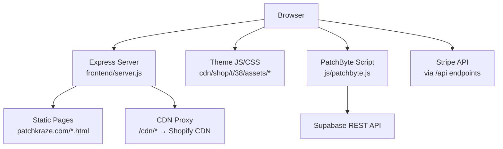
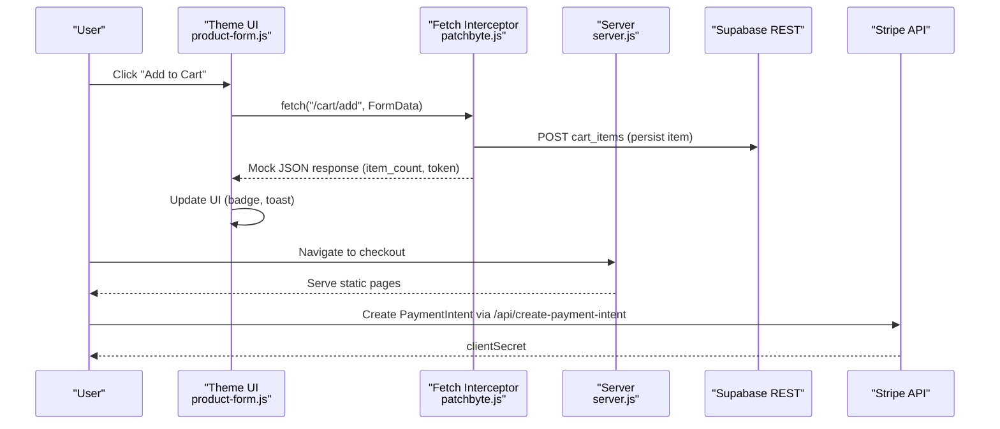
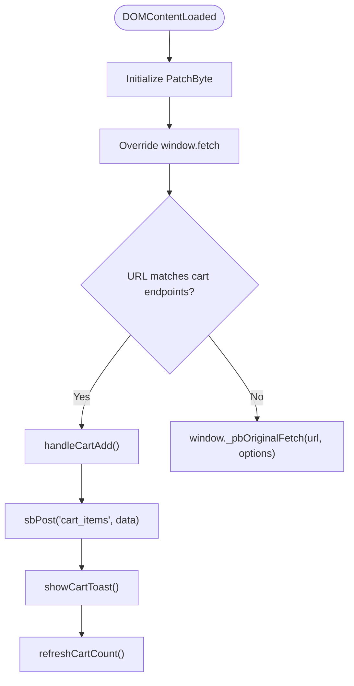
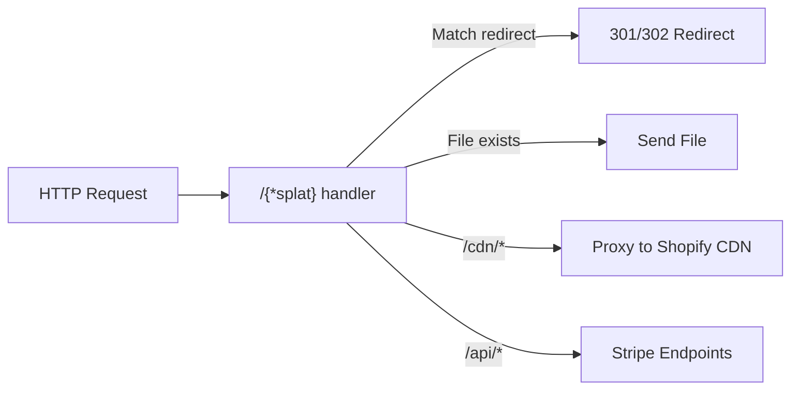
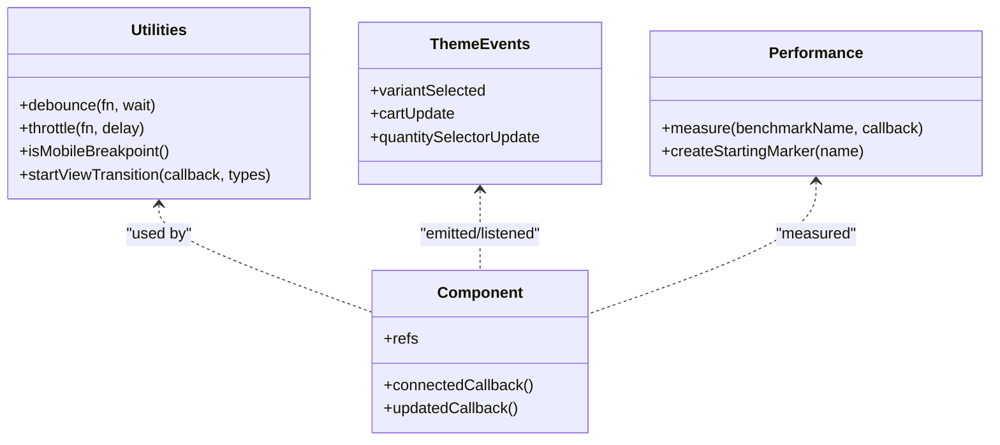
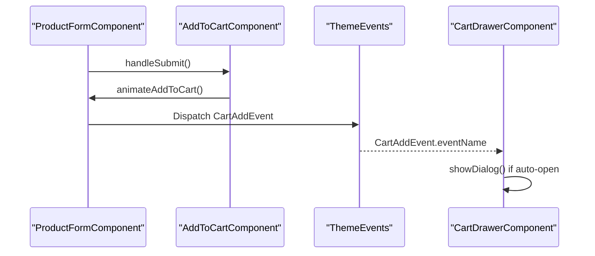
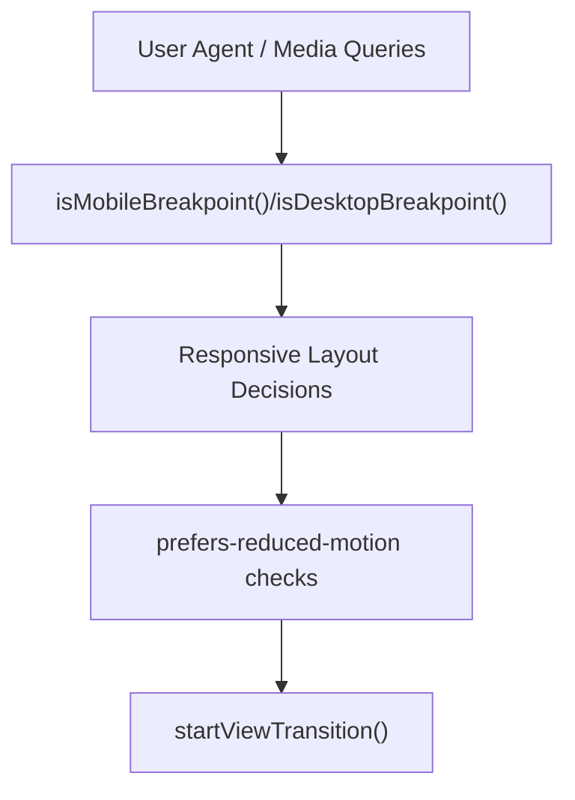
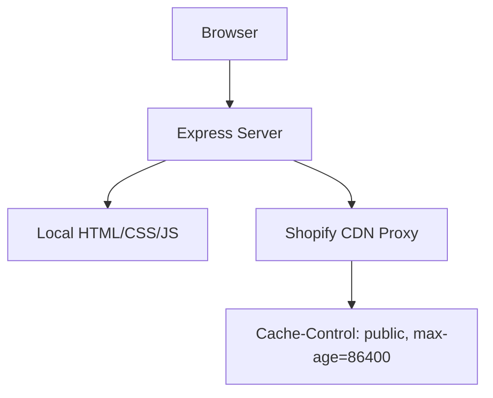
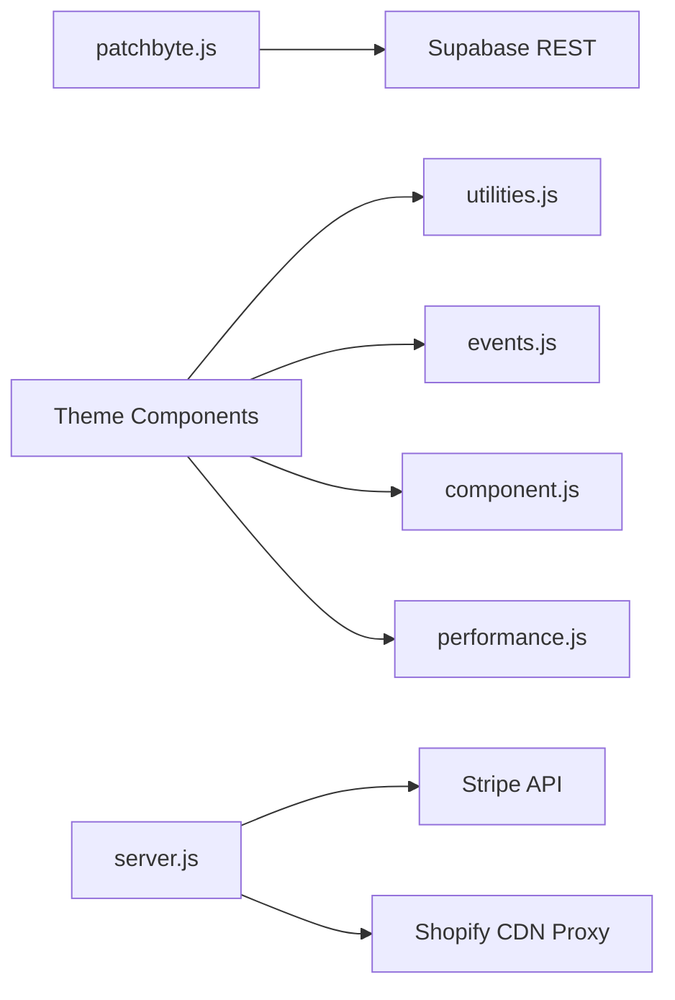

# Frontend Architecture

<cite>
**Referenced Files in This Document**
- [patchbyte.js](file://frontend/js/patchbyte.js)
- [server.js](file://frontend/server.js)
- [index.js](file://api/index.js)
- [package.json](file://frontend/package.json)
- [utilities.js](file://frontend/cdn/shop/t/38/assets/utilities.js)
- [events.js](file://frontend/cdn/shop/t/38/assets/events.js)
- [component.js](file://frontend/cdn/shop/t/38/assets/component.js)
- [performance.js](file://frontend/cdn/shop/t/38/assets/performance.js)
- [product-form.js](file://frontend/cdn/shop/t/38/assets/product-form.js)
- [cart-drawer.js](file://frontend/cdn/shop/t/38/assets/cart-drawer.js)
- [base.css](file://frontend/cdn/shop/t/38/assets/base.css)
</cite>

## Table of Contents
1. [Introduction](#introduction)
2. [Project Structure](#project-structure)
3. [Core Components](#core-components)
4. [Architecture Overview](#architecture-overview)
5. [Detailed Component Analysis](#detailed-component-analysis)
6. [Dependency Analysis](#dependency-analysis)
7. [Performance Considerations](#performance-considerations)
8. [Troubleshooting Guide](#troubleshooting-guide)
9. [Conclusion](#conclusion)

## Introduction
This document explains the Patch-Byte frontend architecture built on Shopify’s theme system with custom JavaScript enhancements. It covers:
- Static site structure served by a lightweight Node server that proxies CDN assets and routes clean URLs to static HTML pages.
- The PatchByte integration layer that intercepts Shopify-style fetch calls to route cart operations to a Supabase backend while preserving the theme’s UI behavior.
- Modular JavaScript architecture using utilities, events, components, and performance helpers.
- Responsive design approach and mobile-first considerations.
- Asset organization strategy leveraging CDN caching and proxying for performance.
- Integration points with Shopify storefront APIs and how custom functionality extends base theme capabilities.

## Project Structure
The frontend is organized as a static site with a small Node server for development and deployment (e.g., Vercel). Theme assets live under a Shopify-style path and are served directly or proxied from Shopify’s CDN. A dedicated script injects PatchByte logic into every page.

**Diagram sources**
- [server.js:46-65](file://frontend/server.js#L46-L65)
- [server.js:92-111](file://frontend/server.js#L92-L111)
- [patchbyte.js:31-65](file://frontend/js/patchbyte.js#L31-L65)

**Section sources**
- [server.js:1-123](file://frontend/server.js#L1-L123)
- [package.json:1-19](file://frontend/package.json#L1-L19)

## Core Components
- PatchByte integration layer: Intercepts Shopify-style fetch calls for cart add/update and returns mock responses while persisting items to Supabase. Exposes a public API for custom pages.
- Express server: Serves static pages, proxies CDN assets, handles redirects, and provides Stripe payment intent endpoints.
- Modular JS modules: Utilities, events, component base class, performance metrics, product form handling, and cart drawer interactions.

Key responsibilities:
- Intercept and route cart operations to Supabase without changing theme markup.
- Provide consistent UI feedback (toast, badge updates).
- Maintain responsive UX via utility functions and CSS variables.
- Optimize performance through lazy scheduling, throttling/debouncing, and view transitions.

**Section sources**
- [patchbyte.js:1-345](file://frontend/js/patchbyte.js#L1-L345)
- [server.js:17-44](file://frontend/server.js#L17-L44)
- [utilities.js:1-124](file://frontend/cdn/shop/t/38/assets/utilities.js#L1-L124)
- [events.js:1-142](file://frontend/cdn/shop/t/38/assets/events.js#L1-L142)
- [component.js:1-139](file://frontend/cdn/shop/t/38/assets/component.js#L1-L139)
- [performance.js:1-62](file://frontend/cdn/shop/t/38/assets/performance.js#L1-L62)

## Architecture Overview
The runtime flow integrates theme components with PatchByte and the backend:

**Diagram sources**
- [patchbyte.js:138-163](file://frontend/js/patchbyte.js#L138-L163)
- [patchbyte.js:165-233](file://frontend/js/patchbyte.js#L165-L233)
- [server.js:17-44](file://frontend/server.js#L17-L44)

## Detailed Component Analysis

### PatchByte Integration Layer
- Fetch interception: Wraps window.fetch to detect Shopify-style cart endpoints (/cart/add, /cart/change, /cart/update, /cart.js, /cart.json) and respond accordingly.
- Session management: Uses localStorage to maintain a session ID for cart persistence across visits.
- Supabase REST helpers: Provides sbGet/sbPost/sbPatch/sbDelete with proper headers and error handling.
- Cart CRUD: Adds items, updates quantities, clears cart, and refreshes the cart badge.
- UI enhancements: Shows a toast notification after adding an item and fixes cart icon navigation to /cart.
- Contact form: Submits contact submissions to Supabase and replaces the form with a success message.

**Diagram sources**
- [patchbyte.js:19-65](file://frontend/js/patchbyte.js#L19-L65)
- [patchbyte.js:138-163](file://frontend/js/patchbyte.js#L138-L163)
- [patchbyte.js:165-233](file://frontend/js/patchbyte.js#L165-L233)
- [patchbyte.js:235-288](file://frontend/js/patchbyte.js#L235-L288)

**Section sources**
- [patchbyte.js:1-345](file://frontend/js/patchbyte.js#L1-L345)

### Express Server and CDN Proxy
- Static serving: Serves HTML pages from patchkraze.com directory with clean URL routing.
- CDN proxy: Proxies /cdn/* requests to Shopify CDN, setting cache headers for performance.
- Redirects: Permanent and temporary redirects for moved/renamed content.
- Stripe endpoints: Creates PaymentIntents and exposes publishable key configuration.

**Diagram sources**
- [server.js:46-65](file://frontend/server.js#L46-L65)
- [server.js:67-111](file://frontend/server.js#L67-L111)
- [server.js:17-44](file://frontend/server.js#L17-L44)

**Section sources**
- [server.js:1-123](file://frontend/server.js#L1-L123)

### Modular JavaScript Architecture
- Utilities: Debounce/throttle, idle callbacks, media queries, view transitions, and DOM helpers.
- Events: Centralized event types and custom events for variant selection, cart updates, quantity changes, and discounts.
- Component Base: Declarative shadow DOM support, ref management, and global event delegation for on:* attributes.
- Performance: Benchmarking helper for measuring user actions and rendering paths.

**Diagram sources**
- [utilities.js:1-124](file://frontend/cdn/shop/t/38/assets/utilities.js#L1-L124)
- [events.js:1-142](file://frontend/cdn/shop/t/38/assets/events.js#L1-L142)
- [component.js:1-139](file://frontend/cdn/shop/t/38/assets/component.js#L1-L139)
- [performance.js:1-62](file://frontend/cdn/shop/t/38/assets/performance.js#L1-L62)

**Section sources**
- [utilities.js:1-324](file://frontend/cdn/shop/t/38/assets/utilities.js#L1-L324)
- [events.js:1-142](file://frontend/cdn/shop/t/38/assets/events.js#L1-L142)
- [component.js:1-139](file://frontend/cdn/shop/t/38/assets/component.js#L1-L139)
- [performance.js:1-62](file://frontend/cdn/shop/t/38/assets/performance.js#L1-L62)

### Product Form and Cart Drawer
- ProductFormComponent: Validates forms, coordinates add-to-cart flows, updates UI based on variant changes, and dispatches cart events.
- AddToCartComponent: Handles button states, animations, and accessibility announcements.
- CartDrawerComponent: Opens automatically on cart add when configured and manages dialog lifecycle.

**Diagram sources**
- [product-form.js:304-479](file://frontend/cdn/shop/t/38/assets/product-form.js#L304-L479)
- [product-form.js:39-180](file://frontend/cdn/shop/t/38/assets/product-form.js#L39-L180)
- [cart-drawer.js:13-53](file://frontend/cdn/shop/t/38/assets/cart-drawer.js#L13-L53)
- [events.js:37-61](file://frontend/cdn/shop/t/38/assets/events.js#L37-L61)

**Section sources**
- [product-form.js:1-678](file://frontend/cdn/shop/t/38/assets/product-form.js#L1-L678)
- [cart-drawer.js:1-53](file://frontend/cdn/shop/t/38/assets/cart-drawer.js#L1-L53)

### Responsive Design and Mobile-First Considerations
- CSS variables and hover effects tuned for fine pointers and reduced motion preferences.
- Utility functions expose breakpoint detection and viewport-aware behaviors.
- View transitions and scheduler optimize perceived performance during content updates.

**Diagram sources**
- [utilities.js:83-124](file://frontend/cdn/shop/t/38/assets/utilities.js#L83-L124)
- [base.css:105-176](file://frontend/cdn/shop/t/38/assets/base.css#L105-L176)

**Section sources**
- [base.css:1-200](file://frontend/cdn/shop/t/38/assets/base.css#L1-200)
- [utilities.js:1-124](file://frontend/cdn/shop/t/38/assets/utilities.js#L1-L124)

### Asset Organization and CDN Caching Strategy
- Static pages under patchkraze.com are served directly; missing files return 404.
- /cdn/* requests are proxied to Shopify CDN with cache headers to leverage browser caching.
- Clean URL routing maps to .html files or index.html fallbacks.

**Diagram sources**
- [server.js:46-65](file://frontend/server.js#L46-L65)
- [server.js:92-111](file://frontend/server.js#L92-L111)

**Section sources**
- [server.js:46-65](file://frontend/server.js#L46-L65)
- [server.js:92-111](file://frontend/server.js#L92-L111)

## Dependency Analysis
- PatchByte depends on window.fetch and localStorage; it does not modify theme markup but augments behavior via interception and DOM updates.
- Theme components depend on utilities, events, and component base classes for consistent behavior and performance.
- Server depends on express, dotenv (optional), stripe (optional), and serves static assets plus API endpoints.

**Diagram sources**
- [patchbyte.js:31-65](file://frontend/js/patchbyte.js#L31-L65)
- [utilities.js:1-124](file://frontend/cdn/shop/t/38/assets/utilities.js#L1-L124)
- [events.js:1-142](file://frontend/cdn/shop/t/38/assets/events.js#L1-L142)
- [component.js:1-139](file://frontend/cdn/shop/t/38/assets/component.js#L1-L139)
- [performance.js:1-62](file://frontend/cdn/shop/t/38/assets/performance.js#L1-L62)
- [server.js:17-44](file://frontend/server.js#L17-L44)
- [server.js:46-65](file://frontend/server.js#L46-L65)

**Section sources**
- [patchbyte.js:1-345](file://frontend/js/patchbyte.js#L1-L345)
- [server.js:1-123](file://frontend/server.js#L1-L123)

## Performance Considerations
- Use requestIdleCallback and scheduler to defer non-critical work until main thread is free.
- Debounce and throttle frequent events (scroll, input) to reduce reflows and network calls.
- Leverage view transitions for smooth content updates where supported.
- Prefer CSS variables and minimal layout shifts; use morphing to update parts of the DOM efficiently.
- CDN proxy sets cache headers to improve repeat load times.

[No sources needed since this section provides general guidance]

## Troubleshooting Guide
Common issues and resolutions:
- Cart not updating: Ensure PatchByte script is injected before DOMContentLoaded and that fetch interception is active. Check console for errors in handleCartAdd and Supabase responses.
- Contact form fails: Verify Supabase table permissions and headers; check alert messages and console logs.
- CDN assets 404: Confirm /cdn/* proxy path mapping and Shopify CDN availability; verify asset existence in Shopify store.
- Stripe errors: Validate environment variables for Stripe keys; ensure amount is positive and currency is set.

**Section sources**
- [patchbyte.js:165-233](file://frontend/js/patchbyte.js#L165-L233)
- [patchbyte.js:235-288](file://frontend/js/patchbyte.js#L235-L288)
- [server.js:17-44](file://frontend/server.js#L17-L44)
- [server.js:46-65](file://frontend/server.js#L46-L65)

## Conclusion
Patch-Byte enhances Shopify’s theme with a robust, modular frontend architecture:
- Non-invasive integration via fetch interception keeps theme markup intact while routing cart operations to Supabase.
- A lightweight server provides clean URLs, CDN proxying, and Stripe payment flows.
- Modular JS improves maintainability, performance, and responsiveness.
- Responsive design and performance optimizations ensure a smooth user experience across devices.

[No sources needed since this section summarizes without analyzing specific files]