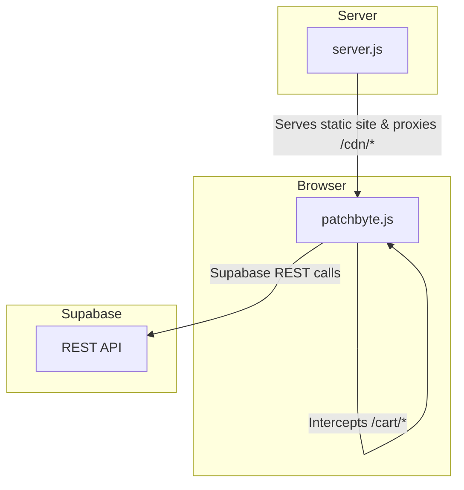
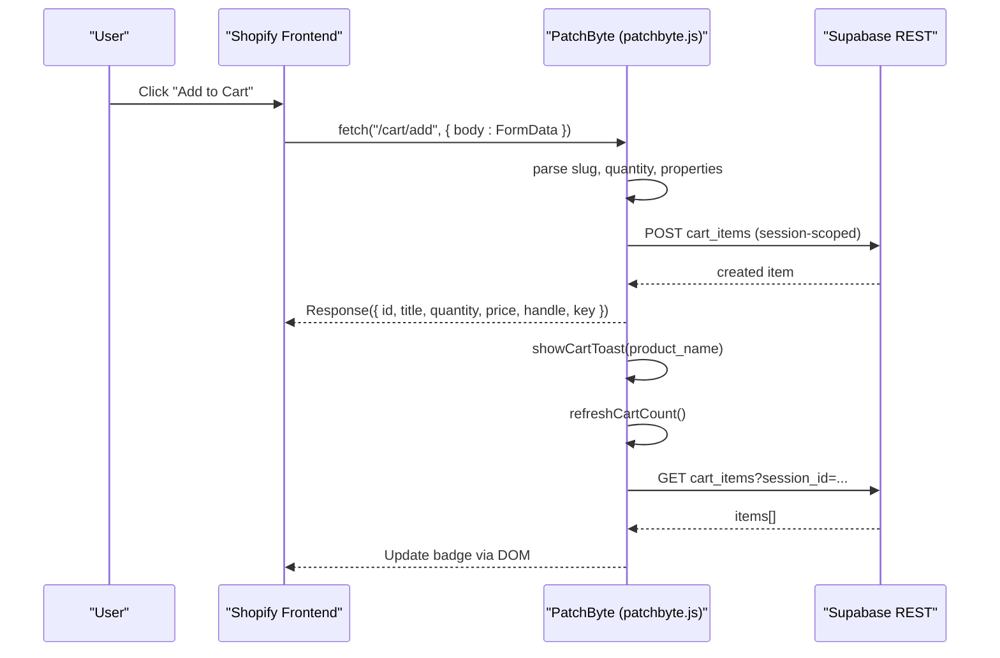
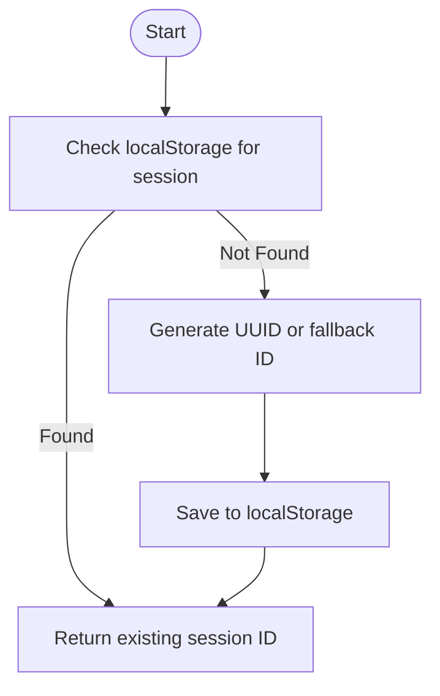
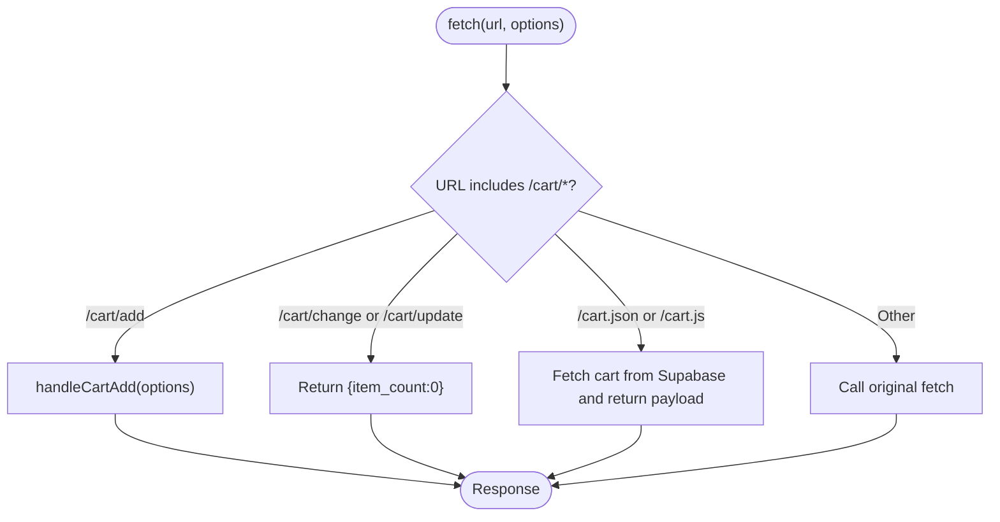
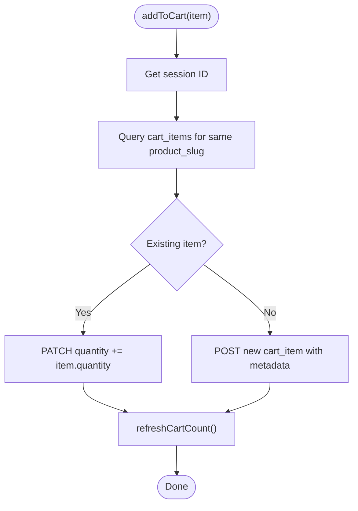
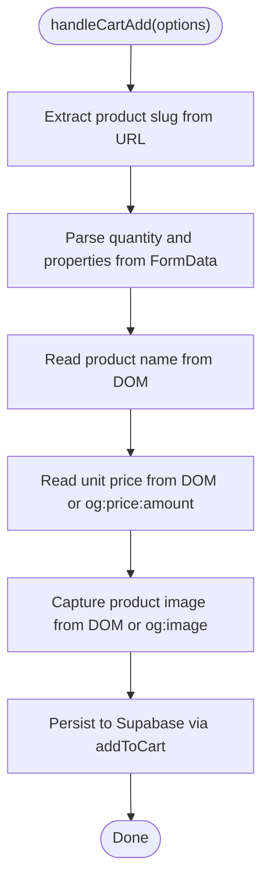
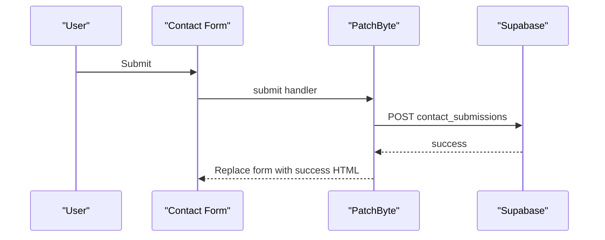
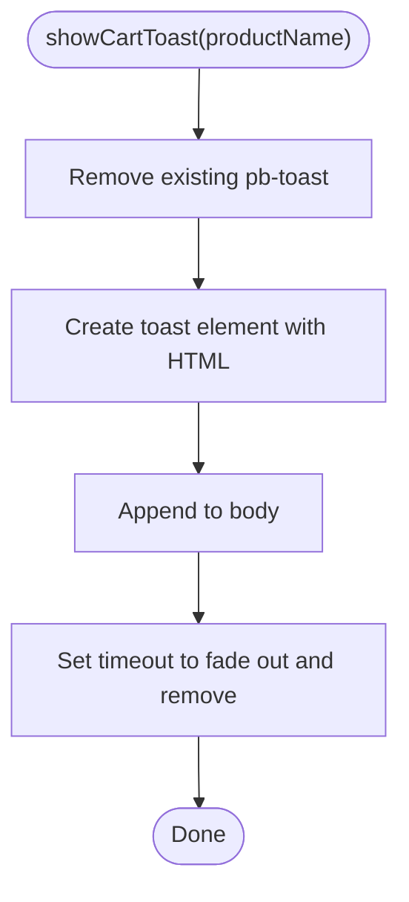
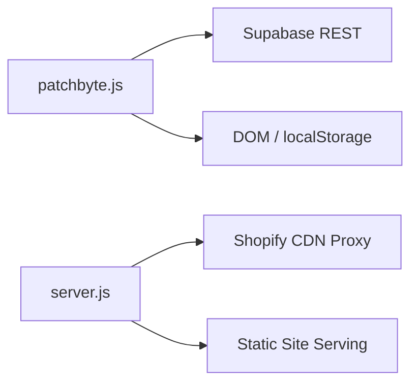

# PatchByte Integration Layer

<cite>
**Referenced Files in This Document**
- [patchbyte.js](file://frontend/js/patchbyte.js)
- [server.js](file://frontend/server.js)
- [index.js](file://api/index.js)
- [migrate-tables.sql](file://migrate-tables.sql)
</cite>

## Table of Contents
1. [Introduction](#introduction)
2. [Project Structure](#project-structure)
3. [Core Components](#core-components)
4. [Architecture Overview](#architecture-overview)
5. [Detailed Component Analysis](#detailed-component-analysis)
6. [Dependency Analysis](#dependency-analysis)
7. [Performance Considerations](#performance-considerations)
8. [Troubleshooting Guide](#troubleshooting-guide)
9. [Conclusion](#conclusion)
10. [Appendices](#appendices)

## Introduction
PatchByte is a client-side integration layer that bridges Shopify’s frontend cart and checkout flows to a custom backend powered by Supabase. It intercepts native fetch calls for cart operations, redirects them to Supabase REST endpoints, manages user sessions via localStorage with UUID generation, and exposes a public API through window.PatchByte. It also handles product data extraction (price, image, properties), contact form submissions, and provides toast notifications for user feedback.

## Project Structure
The integration spans a small set of focused files:
- Client-side script that performs interception, session management, cart CRUD, and UI enhancements.
- A lightweight Node/Express server used locally or on platforms like Vercel/Netlify to serve static pages and proxy CDN assets.
- Database migration scripts defining the schema and Row Level Security policies for Supabase tables.
- An API entrypoint that re-exports the Express app for deployment targets.

**Diagram sources**
- [patchbyte.js:138-163](file://frontend/js/patchbyte.js#L138-L163)
- [server.js:46-65](file://frontend/server.js#L46-L65)

**Section sources**
- [patchbyte.js:1-345](file://frontend/js/patchbyte.js#L1-L345)
- [server.js:1-123](file://frontend/server.js#L1-L123)
- [index.js:1-1](file://api/index.js#L1-L1)
- [migrate-tables.sql:1-57](file://migrate-tables.sql#L1-L57)

## Core Components
- Session Management: Persistent per-browser session ID stored in localStorage, generated as a UUID when available, otherwise a fallback random string.
- Fetch Interception: Overrides window.fetch to redirect Shopify-style cart endpoints to Supabase and return compatible responses.
- Cart CRUD: Add, update, delete, and clear cart items persisted to Supabase under a session-scoped table.
- Product Data Extraction: Parses product name, price, and image from DOM elements and meta tags; captures custom properties from FormData.
- Contact Form Submission: Submits contact forms to Supabase and replaces the form with a success message.
- Toast Notification System: Displays a temporary “added to cart” notification with a link to the cart page.
- Public API: Exposes methods via window.PatchByte for external scripts to interact with cart and Supabase.

**Section sources**
- [patchbyte.js:19-35](file://frontend/js/patchbyte.js#L19-L35)
- [patchbyte.js:67-111](file://frontend/js/patchbyte.js#L67-L111)
- [patchbyte.js:138-233](file://frontend/js/patchbyte.js#L138-L233)
- [patchbyte.js:237-288](file://frontend/js/patchbyte.js#L237-L288)
- [patchbyte.js:331-342](file://frontend/js/patchbyte.js#L331-L342)

## Architecture Overview
PatchByte runs in the browser before any DOMContentLoaded handlers. It wraps fetch to intercept Shopify cart requests, reads product context from the current page, persists cart state to Supabase using a session ID, and returns mock responses that keep Shopify’s UI happy while the real state lives in Supabase.

**Diagram sources**
- [patchbyte.js:138-163](file://frontend/js/patchbyte.js#L138-L163)
- [patchbyte.js:165-233](file://frontend/js/patchbyte.js#L165-L233)
- [patchbyte.js:67-121](file://frontend/js/patchbyte.js#L67-L121)

## Detailed Component Analysis

### Session Management
- Stores a unique session ID in localStorage under a fixed key.
- Generates a UUID if crypto.randomUUID is supported; otherwise falls back to a time-based + random string.
- Used to scope cart items to a single browser session.

**Diagram sources**
- [patchbyte.js:19-29](file://frontend/js/patchbyte.js#L19-L29)

**Section sources**
- [patchbyte.js:19-29](file://frontend/js/patchbyte.js#L19-L29)

### Fetch Interception Mechanism
- Saves original fetch to a global variable.
- Overrides window.fetch to detect Shopify-style cart endpoints:
  - /cart/add: intercepted to add items to Supabase and return a mock response matching Shopify’s expected shape.
  - /cart/change and /cart/update: intercepted to return a minimal success response.
  - /cart.json and /cart.js: intercepted to return a payload including token and item_count derived from Supabase.
- All other requests pass through to the original fetch.

**Diagram sources**
- [patchbyte.js:138-163](file://frontend/js/patchbyte.js#L138-L163)
- [patchbyte.js:165-233](file://frontend/js/patchbyte.js#L165-L233)

**Section sources**
- [patchbyte.js:138-163](file://frontend/js/patchbyte.js#L138-L163)
- [patchbyte.js:165-233](file://frontend/js/patchbyte.js#L165-L233)

### Cart CRUD Operations
- getCart: Retrieves items for the current session, ordered by creation time.
- addToCart: Checks for an existing item with the same product_slug in the session; updates quantity if found, otherwise creates a new row with product details and properties.
- updateCartItem: Updates quantity or deletes the item if quantity is zero or less.
- clearCart: Deletes all items for the current session.
- refreshCartCount: Computes total quantity across items and updates UI badges.

**Diagram sources**
- [patchbyte.js:67-111](file://frontend/js/patchbyte.js#L67-L111)

**Section sources**
- [patchbyte.js:67-111](file://frontend/js/patchbyte.js#L67-L111)

### Product Data Extraction Logic
- Product slug: Extracted from the current page path (/products/{slug}).
- Quantity: Parsed from FormData if present; defaults to 1.
- Properties: Extracted from FormData fields prefixed with properties[...], excluding file uploads.
- Product name: Read from common product title selectors; sanitized whitespace.
- Unit price: Prefers a live element showing unit price; falls back to Open Graph meta tag for price amount.
- Image capture: Tries multiple selectors for product images; if not found, uses Open Graph image meta and normalizes malformed URLs.

**Diagram sources**
- [patchbyte.js:165-216](file://frontend/js/patchbyte.js#L165-L216)

**Section sources**
- [patchbyte.js:165-216](file://frontend/js/patchbyte.js#L165-L216)

### Contact Form Submission
- Wires into contact forms by selector patterns.
- Prevents default submission, collects fields (name, email, phone, message).
- Submits to Supabase contact_submissions table.
- Replaces form content with a styled success message on success; shows alert and restores button state on error.

**Diagram sources**
- [patchbyte.js:237-263](file://frontend/js/patchbyte.js#L237-L263)

**Section sources**
- [patchbyte.js:237-263](file://frontend/js/patchbyte.js#L237-L263)

### Toast Notification System
- Creates a floating toast with a checkmark, product name, and a link to the cart.
- Appends to document body, auto-removes after a timeout with fade-out transition.
- Ensures only one toast exists at a time by removing any prior instance.

**Diagram sources**
- [patchbyte.js:267-288](file://frontend/js/patchbyte.js#L267-L288)

**Section sources**
- [patchbyte.js:267-288](file://frontend/js/patchbyte.js#L267-L288)

### Public API (window.PatchByte)
Exposes the following methods for use by cart.html and checkout.html:
- getSession(): Returns the current session ID.
- getCart(): Returns cart items for the current session.
- addToCart(item): Adds or updates an item in the cart.
- updateCartItem(id, quantity): Updates or removes a cart item.
- clearCart(): Clears all items for the current session.
- refreshCartCount(): Recalculates and updates the cart badge.
- sbPost(table, data): Posts data to a Supabase table.
- sbGet(path): Gets data from a Supabase table path.
- sbPatch(table, match, data): Updates records matching a query.
- sbDelete(table, match): Deletes records matching a query.

Usage example paths:
- [Public API definition:331-342](file://frontend/js/patchbyte.js#L331-L342)

**Section sources**
- [patchbyte.js:331-342](file://frontend/js/patchbyte.js#L331-L342)

## Dependency Analysis
- patchbyte.js depends on:
  - Browser APIs: localStorage, crypto.randomUUID, fetch, DOM APIs.
  - Supabase REST API endpoint base URL and anonymous key configured in the script.
  - Shopify page structure assumptions (selectors for product title, price, images).
- server.js serves static content and proxies /cdn/* to Shopify CDN; it also exposes Stripe-related endpoints but is not required for PatchByte’s core functionality.
- migrate-tables.sql defines schema additions and RLS policies enabling anonymous access for cart, orders, order items, and contact submissions.

**Diagram sources**
- [patchbyte.js:10-17](file://frontend/js/patchbyte.js#L10-L17)
- [server.js:46-65](file://frontend/server.js#L46-L65)
- [migrate-tables.sql:36-57](file://migrate-tables.sql#L36-L57)

**Section sources**
- [patchbyte.js:10-17](file://frontend/js/patchbyte.js#L10-L17)
- [server.js:46-65](file://frontend/server.js#L46-L65)
- [migrate-tables.sql:36-57](file://migrate-tables.sql#L36-L57)

## Performance Considerations
- Minimize network calls: The interception avoids unnecessary requests by returning mock responses for change/update and cart queries.
- Batch UI updates: Badge updates are consolidated in refreshCartCount to reduce DOM thrashing.
- Graceful degradation: If Supabase calls fail, the script continues without breaking the UI flow.
- Avoid heavy parsing: Product data extraction uses targeted selectors and simple regex to minimize overhead.

[No sources needed since this section provides general guidance]

## Troubleshooting Guide
Common issues and strategies:
- Fetch interception not triggering:
  - Ensure the script is injected early (in <head>) so it overrides fetch before Shopify handlers run.
  - Verify that the URL matches expected patterns for /cart/add, /cart/change, /cart/update, /cart.json, or /cart.js.
- Cart not updating:
  - Confirm Supabase RLS policies allow anonymous inserts/reads for cart_items.
  - Check that the session ID exists in localStorage and matches the request context.
- Product data missing:
  - Validate that product title, price, and image selectors exist on the page; consider adding fallbacks or adjusting selectors.
- Contact form errors:
  - Inspect console for errors; ensure contact_submissions table has the required columns and RLS policies.
- Toast not appearing:
  - Ensure no conflicting CSS hides the toast; verify that the element is appended to the document body.

Error handling specifics:
- Cart add errors return a 422 response with an error message to keep Shopify’s UI consistent.
- Contact form submission errors restore the submit button state and show an alert.
- Network failures in badge refresh are silently ignored to avoid disrupting UX.

**Section sources**
- [patchbyte.js:227-233](file://frontend/js/patchbyte.js#L227-L233)
- [patchbyte.js:257-261](file://frontend/js/patchbyte.js#L257-L261)
- [patchbyte.js:115-121](file://frontend/js/patchbyte.js#L115-L121)
- [migrate-tables.sql:36-57](file://migrate-tables.sql#L36-L57)

## Conclusion
PatchByte provides a robust, low-friction bridge between Shopify’s frontend and a custom Supabase-backed backend. By intercepting fetch calls, managing sessions, persisting cart state, extracting product data, and offering a clean public API, it enables seamless cart operations, contact submissions, and user feedback without modifying Shopify’s core templates. Its design prioritizes resilience, performance, and ease of integration.

[No sources needed since this section summarizes without analyzing specific files]

## Appendices

### Database Schema Notes
- cart_items: Includes session_id, product_slug, product_name, unit_price, quantity, and properties JSONB.
- orders and order_items: Extended with customer details, shipping address JSONB, notes, totals, and status.
- contact_submissions: Stores name, email, phone, and message.
- RLS policies: Allow anonymous access for all listed tables to support unauthenticated users.

**Section sources**
- [migrate-tables.sql:5-35](file://migrate-tables.sql#L5-L35)
- [migrate-tables.sql:36-57](file://migrate-tables.sql#L36-L57)

### Server Configuration Notes
- Static site serving: Serves pages from patchkraze.com directory.
- CDN proxy: Proxies /cdn/* to Shopify CDN, fixing asset paths as needed.
- Redirects: Handles permanent and temporary redirects for moved or missing pages.

**Section sources**
- [server.js:46-111](file://frontend/server.js#L46-L111)