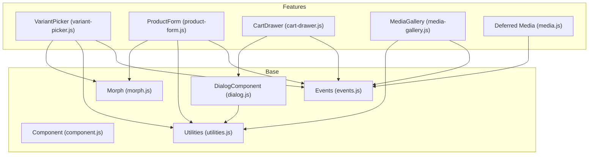
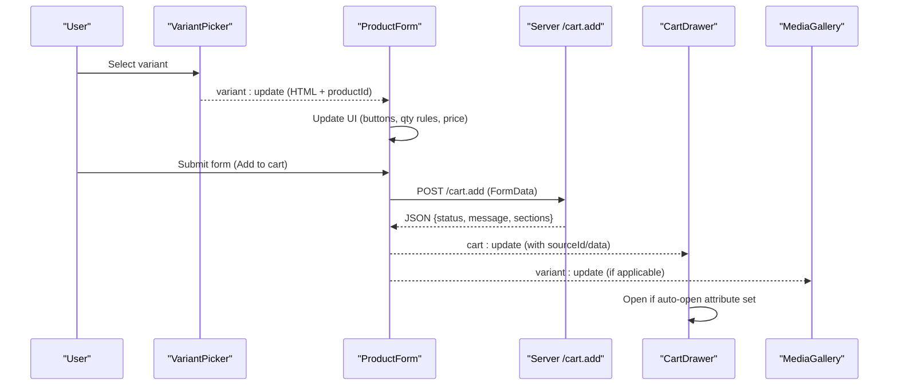
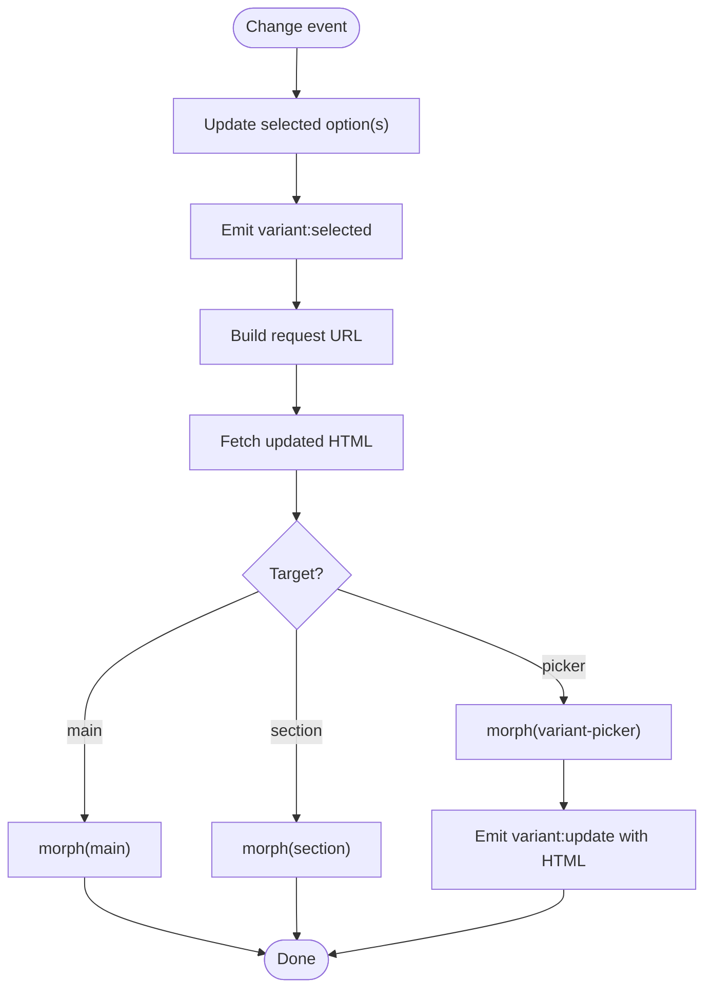
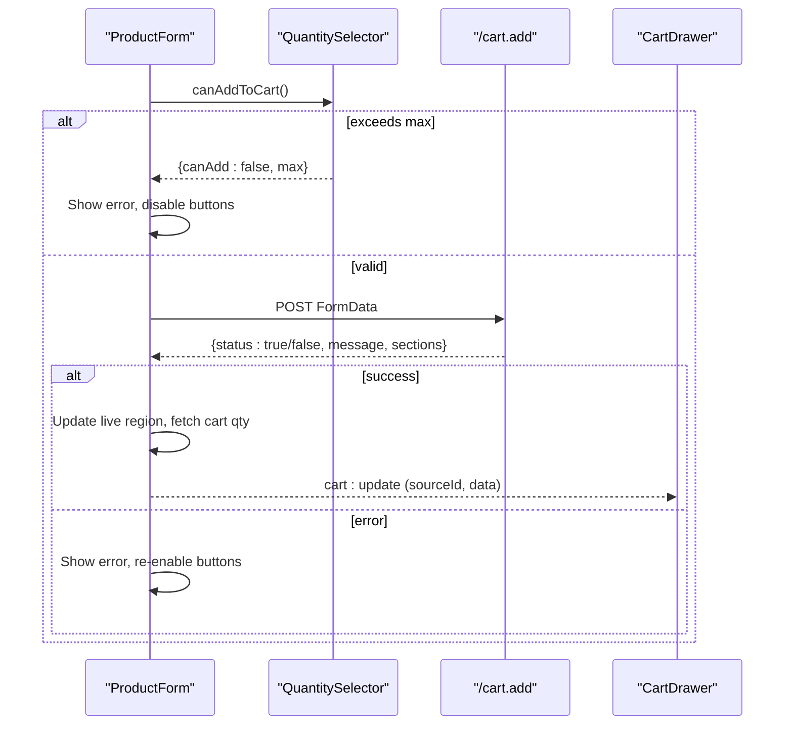
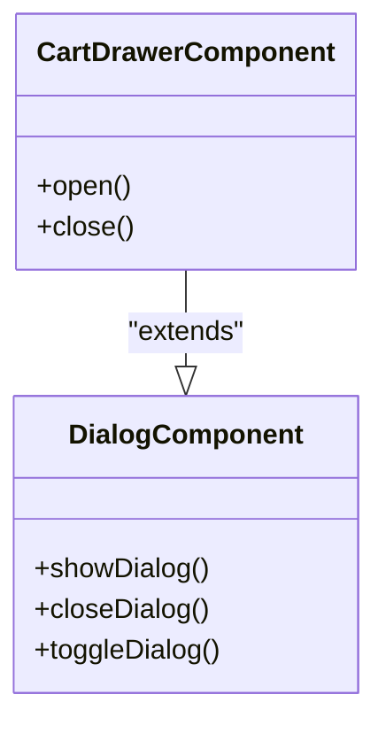
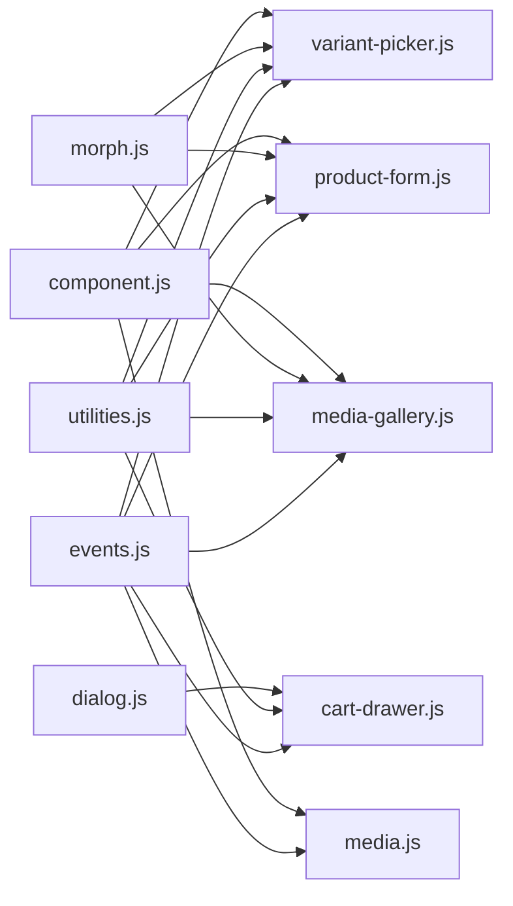

# JavaScript Components

<cite>
**Referenced Files in This Document**
- [cart-drawer.js](file://frontend/cdn/shop/t/38/assets/cart-drawer.js)
- [product-form.js](file://frontend/cdn/shop/t/38/assets/product-form.js)
- [variant-picker.js](file://frontend/cdn/shop/t/38/assets/variant-picker.js)
- [media-gallery.js](file://frontend/cdn/shop/t/38/assets/media-gallery.js)
- [events.js](file://frontend/cdn/shop/t/38/assets/events.js)
- [component.js](file://frontend/cdn/shop/t/38/assets/component.js)
- [dialog.js](file://frontend/cdn/shop/t/38/assets/dialog.js)
- [utilities.js](file://frontend/cdn/shop/t/38/assets/utilities.js)
- [morph.js](file://frontend/cdn/shop/t/38/assets/morph.js)
- [media.js](file://frontend/cdn/shop/t/38/assets/media.js)
</cite>

## Table of Contents
1. [Introduction](#introduction)
2. [Project Structure](#project-structure)
3. [Core Components](#core-components)
4. [Architecture Overview](#architecture-overview)
5. [Detailed Component Analysis](#detailed-component-analysis)
6. [Dependency Analysis](#dependency-analysis)
7. [Performance Considerations](#performance-considerations)
8. [Troubleshooting Guide](#troubleshooting-guide)
9. [Conclusion](#conclusion)

## Introduction
This document explains the JavaScript component architecture for cart drawer functionality, product form interactions, variant selection handling, and media gallery features. It focuses on event-driven programming patterns, DOM manipulation strategies, state management approaches, initialization flows, configuration options, and inter-component communication across the theme’s frontend assets.

## Project Structure
The relevant components are implemented as custom elements that extend a shared base class and communicate via a centralized event system. Key files:
- Base framework and utilities: component.js, dialog.js, utilities.js, morph.js
- Event bus: events.js
- Feature components: cart-drawer.js, product-form.js, variant-picker.js, media-gallery.js, media.js

**Diagram sources**
- [component.js:15-63](file://frontend/cdn/shop/t/38/assets/component.js#L15-L63)
- [dialog.js:18-171](file://frontend/cdn/shop/t/38/assets/dialog.js#L18-L171)
- [utilities.js:50-105](file://frontend/cdn/shop/t/38/assets/utilities.js#L50-L105)
- [morph.js:36-46](file://frontend/cdn/shop/t/38/assets/morph.js#L36-L46)
- [events.js:1-142](file://frontend/cdn/shop/t/38/assets/events.js#L1-L142)
- [variant-picker.js:27-120](file://frontend/cdn/shop/t/38/assets/variant-picker.js#L27-L120)
- [product-form.js:204-678](file://frontend/cdn/shop/t/38/assets/product-form.js#L204-L678)
- [cart-drawer.js:13-53](file://frontend/cdn/shop/t/38/assets/cart-drawer.js#L13-L53)
- [media-gallery.js:20-99](file://frontend/cdn/shop/t/38/assets/media-gallery.js#L20-L99)
- [media.js:20-152](file://frontend/cdn/shop/t/38/assets/media.js#L20-L152)

**Section sources**
- [component.js:15-63](file://frontend/cdn/shop/t/38/assets/component.js#L15-L63)
- [events.js:1-142](file://frontend/cdn/shop/t/38/assets/events.js#L1-L142)

## Core Components
- VariantPicker: Handles user selection of product variants, updates URL, and requests updated sections. Emits variant selection/update events.
- ProductForm: Manages add-to-cart flow, quantity validation, error/success messaging, and syncs UI with cart state. Responds to variant updates and dispatches cart events.
- CartDrawer: A dialog-based drawer that can auto-open on cart additions and coordinates closing when other dialogs appear.
- MediaGallery: Coordinates slideshow and zoom dialog behavior; reacts to variant updates by replacing itself with fresh markup.
- Deferred Media: Lazily loads and controls video/model playback; integrates with global media events and dialog lifecycle.

Key patterns:
- Declarative event binding via attributes on elements (e.g., on:click/method).
- Centralized event bus using custom events for cross-component communication.
- Lightweight DOM diffing via morph to update parts of the page without full reloads.
- AbortController usage to cancel stale network requests during rapid interactions.

**Section sources**
- [variant-picker.js:27-120](file://frontend/cdn/shop/t/38/assets/variant-picker.js#L27-L120)
- [product-form.js:204-678](file://frontend/cdn/shop/t/38/assets/product-form.js#L204-L678)
- [cart-drawer.js:13-53](file://frontend/cdn/shop/t/38/assets/cart-drawer.js#L13-L53)
- [media-gallery.js:20-99](file://frontend/cdn/shop/t/38/assets/media-gallery.js#L20-L99)
- [media.js:20-152](file://frontend/cdn/shop/t/38/assets/media.js#L20-L152)

## Architecture Overview
The components follow an event-driven architecture:
- VariantPicker emits variant selection and update events carrying new HTML fragments and metadata.
- ProductForm listens to variant updates to refresh UI (buttons, quantities, pricing), then handles form submission to add items to the cart.
- CartDrawer listens for cart addition events to open automatically when configured.
- MediaGallery listens to variant updates to swap its content and coordinates with zoom/slideshow.
- Utilities provide fetch helpers, animation hooks, debouncing/throttling, and DOM helpers. Morph performs efficient subtree updates.

**Diagram sources**
- [variant-picker.js:65-120](file://frontend/cdn/shop/t/38/assets/variant-picker.js#L65-L120)
- [product-form.js:304-479](file://frontend/cdn/shop/t/38/assets/product-form.js#L304-L479)
- [cart-drawer.js:14-48](file://frontend/cdn/shop/t/38/assets/cart-drawer.js#L14-L48)
- [media-gallery.js:21-61](file://frontend/cdn/shop/t/38/assets/media-gallery.js#L21-L61)

## Detailed Component Analysis

### Variant Picker
Responsibilities:
- Track selected options across fieldsets/selects.
- Build request URLs preserving view parameters and section context.
- Fetch updated section HTML and morph it into the DOM.
- Emit variant:selected and variant:update events with resource and HTML payload.
- Update browser history with variant or connected product URL changes.

State management:
- Maintains checked indices per fieldset to animate transitions between selections.
- Uses AbortController to cancel previous fetches when users rapidly change options.

DOM strategy:
- Uses morph to replace only the variant picker element or larger sections (featured-product-information or main) depending on context.

Configuration:
- data-template-product-match, data-product-url, data-product-id influence behavior and URL building.

Inter-component communication:
- Emits variant:selected and variant:update.
- Listens to ThemeEvents for coordinated updates.

**Diagram sources**
- [variant-picker.js:65-120](file://frontend/cdn/shop/t/38/assets/variant-picker.js#L65-L120)
- [variant-picker.js:207-298](file://frontend/cdn/shop/t/38/assets/variant-picker.js#L207-L298)
- [variant-picker.js:311-371](file://frontend/cdn/shop/t/38/assets/variant-picker.js#L311-L371)

**Section sources**
- [variant-picker.js:27-120](file://frontend/cdn/shop/t/38/assets/variant-picker.js#L27-L120)
- [variant-picker.js:207-298](file://frontend/cdn/shop/t/38/assets/variant-picker.js#L207-L298)
- [variant-picker.js:311-371](file://frontend/cdn/shop/t/38/assets/variant-picker.js#L311-L371)

### Product Form
Responsibilities:
- Validate quantity constraints before submission.
- Submit FormData to /cart.add and handle success/error responses.
- Update live regions for accessibility and show/hide error messages.
- Sync quantity selector and labels with current cart state after updates.
- React to variant updates to adjust button states, quantity rules, and pricing.

Event-driven behavior:
- Subscribes to variant:update and variant:selected to keep UI consistent.
- Dispatches cart:add and cart:error events with source identifiers to avoid self-triggered loops.

DOM strategy:
- Uses morph to selectively update buttons, quantity rules, price-per-item, and volume pricing blocks.
- Leverages utilities for animations and fetch configuration.

State management:
- Tracks timeouts to reset button states and clear live region text.
- Uses AbortController to cancel pending work on disconnect.

Configuration:
- data-quantity-error-max template string for dynamic error messages.
- data-product-id used to correlate events across components.

**Diagram sources**
- [product-form.js:304-479](file://frontend/cdn/shop/t/38/assets/product-form.js#L304-L479)
- [product-form.js:535-664](file://frontend/cdn/shop/t/38/assets/product-form.js#L535-L664)

**Section sources**
- [product-form.js:204-678](file://frontend/cdn/shop/t/38/assets/product-form.js#L204-L678)

### Cart Drawer
Responsibilities:
- Extend DialogComponent to manage modal-like drawer behavior.
- Auto-open on cart additions when configured via attribute.
- Ensure no overlapping dialogs by closing when payment terms CTA is clicked.

Initialization and configuration:
- Extends DialogComponent and registers as a custom element.
- Supports auto-open behavior based on attribute presence.

Inter-component communication:
- Listens to cart:add events to open automatically.

**Diagram sources**
- [dialog.js:18-171](file://frontend/cdn/shop/t/38/assets/dialog.js#L18-L171)
- [cart-drawer.js:13-53](file://frontend/cdn/shop/t/38/assets/cart-drawer.js#L13-L53)

**Section sources**
- [cart-drawer.js:13-53](file://frontend/cdn/shop/t/38/assets/cart-drawer.js#L13-L53)
- [dialog.js:18-171](file://frontend/cdn/shop/t/38/assets/dialog.js#L18-L171)

### Media Gallery
Responsibilities:
- Listen to variant:update to replace itself with fresh markup from server response.
- Coordinate with zoom dialog and slideshow to synchronize selected media index.
- Expose properties for presentation mode, slideshow instance, and media list.

Event-driven behavior:
- Subscribes to variant:update and zoom-media:selected events.

DOM strategy:
- Replaces itself entirely on variant update to ensure consistency with server-rendered structure.

**Section sources**
- [media-gallery.js:20-99](file://frontend/cdn/shop/t/38/assets/media-gallery.js#L20-L99)

### Deferred Media
Responsibilities:
- Lazy-load media content on first interaction.
- Play/pause videos and model viewers; integrate with global media events to pause others when one starts.
- Pause media when dialogs close to maintain expected UX.

Integration points:
- Emits media:started-playing to coordinate with other media instances.
- Listens to dialog:close to pause playback.

**Section sources**
- [media.js:20-152](file://frontend/cdn/shop/t/38/assets/media.js#L20-L152)

## Dependency Analysis
- All feature components extend Component (or DialogComponent) which provides declarative event binding, ref resolution, and shadow DOM support.
- Events are centralized in events.js; components import and use these classes/constants to communicate.
- Utilities provide common functions for fetch configuration, animation waiting, debouncing, and viewport helpers.
- Morph enables efficient partial DOM updates without full re-renders, preserving component state where possible.

**Diagram sources**
- [events.js:1-142](file://frontend/cdn/shop/t/38/assets/events.js#L1-L142)
- [utilities.js:50-105](file://frontend/cdn/shop/t/38/assets/utilities.js#L50-L105)
- [morph.js:36-46](file://frontend/cdn/shop/t/38/assets/morph.js#L36-L46)
- [component.js:15-63](file://frontend/cdn/shop/t/38/assets/component.js#L15-L63)
- [dialog.js:18-171](file://frontend/cdn/shop/t/38/assets/dialog.js#L18-L171)
- [variant-picker.js:27-120](file://frontend/cdn/shop/t/38/assets/variant-picker.js#L27-L120)
- [product-form.js:204-678](file://frontend/cdn/shop/t/38/assets/product-form.js#L204-L678)
- [cart-drawer.js:13-53](file://frontend/cdn/shop/t/38/assets/cart-drawer.js#L13-L53)
- [media-gallery.js:20-99](file://frontend/cdn/shop/t/38/assets/media-gallery.js#L20-L99)
- [media.js:20-152](file://frontend/cdn/shop/t/38/assets/media.js#L20-L152)

**Section sources**
- [events.js:1-142](file://frontend/cdn/shop/t/38/assets/events.js#L1-L142)
- [component.js:15-63](file://frontend/cdn/shop/t/38/assets/component.js#L15-L63)

## Performance Considerations
- Debounced resize handlers and throttled operations reduce layout thrashing in dialogs and galleries.
- AbortController cancels stale fetches during rapid variant changes to prevent race conditions.
- Morph updates only changed subtrees, minimizing reflows and preserving interactive state.
- Animation waits ensure UI transitions complete before proceeding (e.g., adding to cart feedback).
- Defer media loading until user interaction to improve initial page performance.

[No sources needed since this section provides general guidance]

## Troubleshooting Guide
Common issues and resolutions:
- Stale network requests causing inconsistent UI:
  - Ensure variant-picker aborts previous fetches on new selections.
  - Verify AbortController signal propagation in fetch calls.
- Overlapping dialogs preventing checkout:
  - Confirm CartDrawer closes when payment terms CTA is clicked.
- Inconsistent quantity display after cart updates:
  - Check that ProductForm listens to cart:update and refreshes quantity selectors and labels.
- Accessibility announcements not clearing:
  - Verify live region text is cleared after timeout durations for both errors and successes.
- Media playing unexpectedly:
  - Ensure deferred media pauses on dialog close and respects media:started-playing coordination.

**Section sources**
- [variant-picker.js:254-298](file://frontend/cdn/shop/t/38/assets/variant-picker.js#L254-L298)
- [cart-drawer.js:31-48](file://frontend/cdn/shop/t/38/assets/cart-drawer.js#L31-L48)
- [product-form.js:304-479](file://frontend/cdn/shop/t/38/assets/product-form.js#L304-L479)
- [media.js:27-42](file://frontend/cdn/shop/t/38/assets/media.js#L27-L42)

## Conclusion
The component architecture leverages a robust event-driven model with a shared base class, centralized events, and efficient DOM morphing. Variant selection drives updates across product forms, galleries, and drawers, while cart interactions remain responsive and accessible. The design balances performance and maintainability through careful state synchronization, request cancellation, and targeted DOM updates.

[No sources needed since this section summarizes without analyzing specific files]