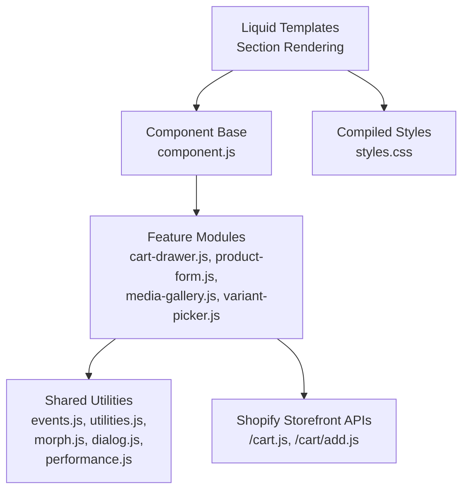
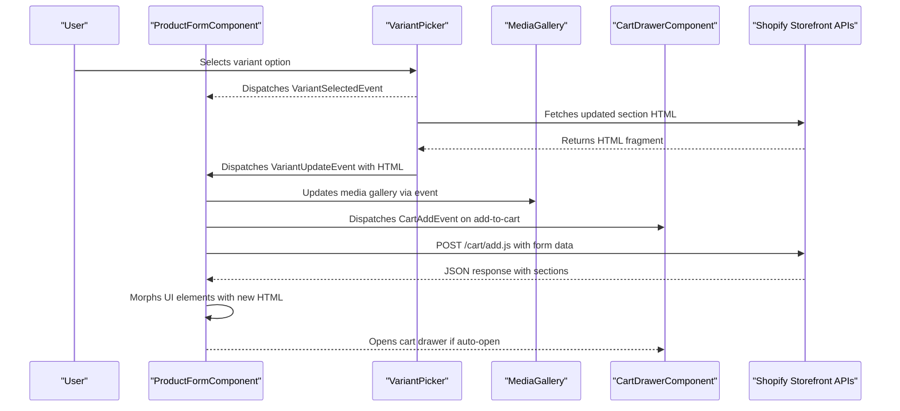
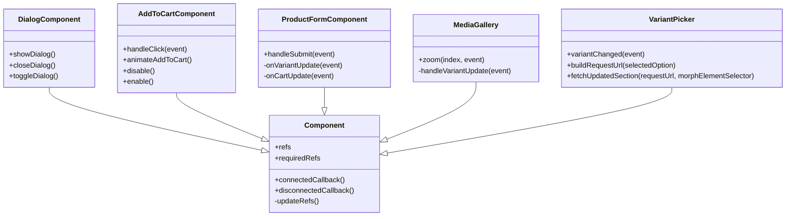
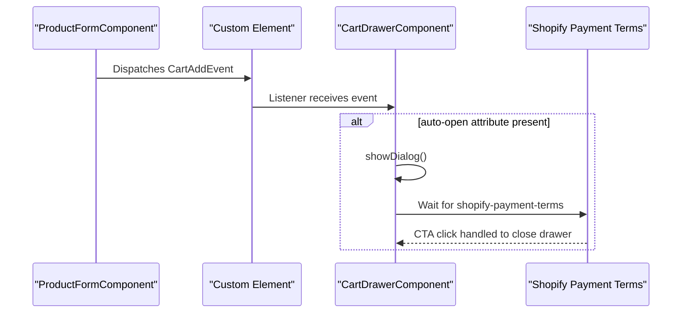
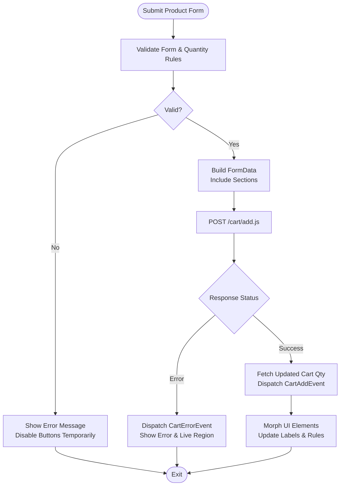
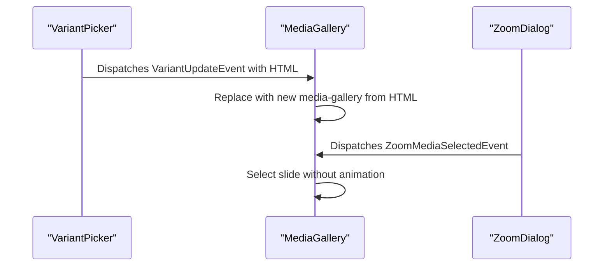
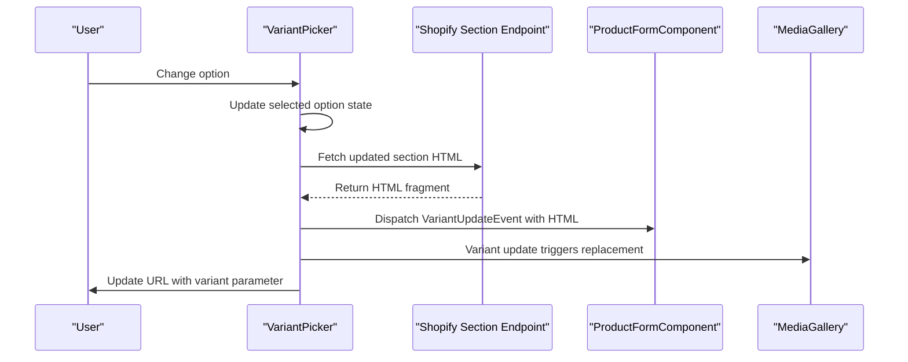
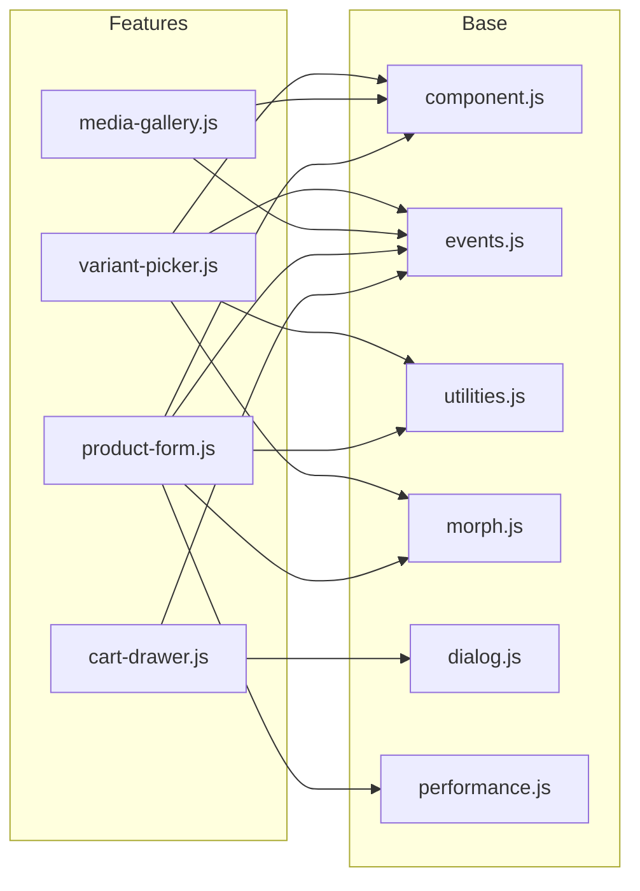

# Shopify Theme Customization

<cite>
**Referenced Files in This Document**
- [component.js](file://frontend/cdn/shop/t/38/assets/component.js)
- [events.js](file://frontend/cdn/shop/t/38/assets/events.js)
- [utilities.js](file://frontend/cdn/shop/t/38/assets/utilities.js)
- [performance.js](file://frontend/cdn/shop/t/38/assets/performance.js)
- [morph.js](file://frontend/cdn/shop/t/38/assets/morph.js)
- [dialog.js](file://frontend/cdn/shop/t/38/assets/dialog.js)
- [cart-drawer.js](file://frontend/cdn/shop/t/38/assets/cart-drawer.js)
- [product-form.js](file://frontend/cdn/shop/t/38/assets/product-form.js)
- [media-gallery.js](file://frontend/cdn/shop/t/38/assets/media-gallery.js)
- [variant-picker.js](file://frontend/cdn/shop/t/38/assets/variant-picker.js)
- [styles.css](file://frontend/cdn/shop/t/38/compiled_assets/styles.css)
</cite>

## Table of Contents
1. [Introduction](#introduction)
2. [Project Structure](#project-structure)
3. [Core Components](#core-components)
4. [Architecture Overview](#architecture-overview)
5. [Detailed Component Analysis](#detailed-component-analysis)
6. [Dependency Analysis](#dependency-analysis)
7. [Performance Considerations](#performance-considerations)
8. [Troubleshooting Guide](#troubleshooting-guide)
9. [Conclusion](#conclusion)
10. [Appendices](#appendices)

## Introduction
This document explains the Shopify theme customization layer that extends the base theme with custom functionality. It covers how static HTML structure integrates with Liquid templating via section rendering, and how custom JavaScript modules enhance default behavior for cart drawer, product form, media gallery, and variant picker. It also documents CSS organization through compiled assets, responsive design patterns, asset loading optimization, CDN caching strategies, and compatibility with Shopify’s storefront APIs.

## Project Structure
The customization layer is implemented as a set of modular JavaScript components under the theme’s assets directory, plus a single compiled stylesheet. The key directories and files are:
- Assets (JavaScript modules): component.js, events.js, utilities.js, performance.js, morph.js, dialog.js, and feature-specific modules like cart-drawer.js, product-form.js, media-gallery.js, variant-picker.js
- Compiled styles: styles.css
- These assets are served from the theme’s CDN path and referenced by Liquid templates rendered by Shopify sections.

**Diagram sources**
- [component.js:15-63](file://frontend/cdn/shop/t/38/assets/component.js#L15-L63)
- [events.js:1-12](file://frontend/cdn/shop/t/38/assets/events.js#L1-L12)
- [utilities.js:50-61](file://frontend/cdn/shop/t/38/assets/utilities.js#L50-L61)
- [morph.js:36-46](file://frontend/cdn/shop/t/38/assets/morph.js#L36-L46)
- [dialog.js:18-79](file://frontend/cdn/shop/t/38/assets/dialog.js#L18-L79)
- [product-form.js:383-395](file://frontend/cdn/shop/t/38/assets/product-form.js#L383-L395)
- [styles.css:1-120](file://frontend/cdn/shop/t/38/compiled_assets/styles.css#L1-L120)

**Section sources**
- [component.js:15-63](file://frontend/cdn/shop/t/38/assets/component.js#L15-L63)
- [styles.css:1-120](file://frontend/cdn/shop/t/38/compiled_assets/styles.css#L1-L120)

## Core Components
The foundation of the customization layer is a small set of shared primitives:
- Declarative shadow DOM and event delegation via a base Component class
- Centralized event bus for cross-component communication
- Utilities for fetch configuration, animation handling, and viewport utilities
- Morphing engine to update UI efficiently after server responses
- Dialog management for overlays and drawers
- Performance measurement hooks

These primitives are reused across feature modules to ensure consistency and maintainability.

**Section sources**
- [component.js:15-63](file://frontend/cdn/shop/t/38/assets/component.js#L15-L63)
- [events.js:1-142](file://frontend/cdn/shop/t/38/assets/events.js#L1-L142)
- [utilities.js:50-105](file://frontend/cdn/shop/t/38/assets/utilities.js#L50-L105)
- [morph.js:36-46](file://frontend/cdn/shop/t/38/assets/morph.js#L36-L46)
- [dialog.js:18-112](file://frontend/cdn/shop/t/38/assets/dialog.js#L18-L112)
- [performance.js:1-62](file://frontend/cdn/shop/t/38/assets/performance.js#L1-L62)

## Architecture Overview
The architecture follows a component-based pattern where each feature is encapsulated in a custom element. Components communicate via a centralized event system and use a morphing utility to reconcile DOM updates returned from Shopify’s section rendering. Data flows between the UI and Shopify’s storefront APIs using standardized fetch configurations.

**Diagram sources**
- [variant-picker.js:65-120](file://frontend/cdn/shop/t/38/assets/variant-picker.js#L65-L120)
- [variant-picker.js:254-298](file://frontend/cdn/shop/t/38/assets/variant-picker.js#L254-L298)
- [product-form.js:304-479](file://frontend/cdn/shop/t/38/assets/product-form.js#L304-L479)
- [media-gallery.js:21-61](file://frontend/cdn/shop/t/38/assets/media-gallery.js#L21-L61)
- [cart-drawer.js:13-49](file://frontend/cdn/shop/t/38/assets/cart-drawer.js#L13-L49)
- [events.js:13-75](file://frontend/cdn/shop/t/38/assets/events.js#L13-L75)

## Detailed Component Analysis

### Component Base and Event System
- Component base provides declarative shadow DOM support, automatic ref resolution, and global event delegation for common events. It ensures required refs exist and observes DOM changes to keep refs current.
- Events module defines a central event bus with typed events for variant selection/update, cart operations, media playback, quantity selector updates, discount updates, zoom media selection, and filtering.

**Diagram sources**
- [component.js:15-63](file://frontend/cdn/shop/t/38/assets/component.js#L15-L63)
- [dialog.js:18-112](file://frontend/cdn/shop/t/38/assets/dialog.js#L18-L112)
- [product-form.js:39-180](file://frontend/cdn/shop/t/38/assets/product-form.js#L39-L180)
- [product-form.js:204-678](file://frontend/cdn/shop/t/38/assets/product-form.js#L204-L678)
- [media-gallery.js:20-99](file://frontend/cdn/shop/t/38/assets/media-gallery.js#L20-L99)
- [variant-picker.js:27-120](file://frontend/cdn/shop/t/38/assets/variant-picker.js#L27-L120)

**Section sources**
- [component.js:15-63](file://frontend/cdn/shop/t/38/assets/component.js#L15-L63)
- [events.js:1-142](file://frontend/cdn/shop/t/38/assets/events.js#L1-L142)

### Cart Drawer Functionality
- The cart drawer is a dialog-based component that can auto-open when an item is added to the cart. It listens for cart add events and opens itself if configured. It also integrates with Shopify’s payment terms overlay to avoid overlapping dialogs.

**Diagram sources**
- [cart-drawer.js:13-49](file://frontend/cdn/shop/t/38/assets/cart-drawer.js#L13-L49)
- [events.js:37-49](file://frontend/cdn/shop/t/38/assets/events.js#L37-L49)

**Section sources**
- [cart-drawer.js:13-49](file://frontend/cdn/shop/t/38/assets/cart-drawer.js#L13-L49)

### Product Form Enhancements
- The product form handles validation, add-to-cart interactions, error messaging, accessibility announcements, and synchronization with cart state. It uses morphing to update parts of the UI based on server responses and coordinates with other components via events.

**Diagram sources**
- [product-form.js:304-479](file://frontend/cdn/shop/t/38/assets/product-form.js#L304-L479)
- [product-form.js:534-664](file://frontend/cdn/shop/t/38/assets/product-form.js#L534-L664)
- [morph.js:36-46](file://frontend/cdn/shop/t/38/assets/morph.js#L36-L46)

**Section sources**
- [product-form.js:304-479](file://frontend/cdn/shop/t/38/assets/product-form.js#L304-L479)
- [product-form.js:534-664](file://frontend/cdn/shop/t/38/assets/product-form.js#L534-L664)

### Media Gallery Improvements
- The media gallery listens for variant updates and replaces itself with new content from the server response. It also synchronizes with zoom dialogs and slideshow controls to keep the selected media consistent.

**Diagram sources**
- [media-gallery.js:21-61](file://frontend/cdn/shop/t/38/assets/media-gallery.js#L21-L61)
- [media-gallery.js:67-82](file://frontend/cdn/shop/t/38/assets/media-gallery.js#L67-L82)
- [events.js:114-122](file://frontend/cdn/shop/t/38/assets/events.js#L114-L122)

**Section sources**
- [media-gallery.js:21-99](file://frontend/cdn/shop/t/38/assets/media-gallery.js#L21-L99)

### Variant Picker Customizations
- The variant picker manages option selection, builds request URLs with context-aware parameters, aborts previous requests on rapid changes, and morphs either the entire main content or specific sections depending on context. It updates URL history for shareable variant states and supports combined listings.

**Diagram sources**
- [variant-picker.js:65-120](file://frontend/cdn/shop/t/38/assets/variant-picker.js#L65-L120)
- [variant-picker.js:207-247](file://frontend/cdn/shop/t/38/assets/variant-picker.js#L207-L247)
- [variant-picker.js:254-298](file://frontend/cdn/shop/t/38/assets/variant-picker.js#L254-L298)

**Section sources**
- [variant-picker.js:65-120](file://frontend/cdn/shop/t/38/assets/variant-picker.js#L65-L120)
- [variant-picker.js:207-298](file://frontend/cdn/shop/t/38/assets/variant-picker.js#L207-L298)

### CSS Organization and Responsive Design
- Styles are compiled into a single stylesheet and organized with CSS custom properties for theming and spacing. Responsive breakpoints are used extensively to adapt layouts for mobile and desktop. Grid and flexbox patterns define layout structures, while media queries adjust behavior at specific widths.

Key patterns observed:
- Use of CSS variables for alignment, gaps, colors, and typography
- Grid-based layouts for headers, footers, and sections
- Media queries targeting typical mobile (<750px) and desktop (>=750px) breakpoints
- Content visibility and contain hints for performance optimization

**Section sources**
- [styles.css:1-120](file://frontend/cdn/shop/t/38/compiled_assets/styles.css#L1-L120)
- [styles.css:326-420](file://frontend/cdn/shop/t/38/compiled_assets/styles.css#L326-L420)
- [styles.css:627-775](file://frontend/cdn/shop/t/38/compiled_assets/styles.css#L627-L775)

## Dependency Analysis
The components depend on shared modules for event handling, utilities, morphing, and dialog management. Feature modules coordinate through events rather than direct coupling, improving cohesion and reducing circular dependencies.

**Diagram sources**
- [cart-drawer.js:1-7](file://frontend/cdn/shop/t/38/assets/cart-drawer.js#L1-L7)
- [product-form.js:1-22](file://frontend/cdn/shop/t/38/assets/product-form.js#L1-L22)
- [media-gallery.js:1-9](file://frontend/cdn/shop/t/38/assets/media-gallery.js#L1-L9)
- [variant-picker.js:1-15](file://frontend/cdn/shop/t/38/assets/variant-picker.js#L1-L15)
- [component.js:15-63](file://frontend/cdn/shop/t/38/assets/component.js#L15-L63)
- [events.js:1-12](file://frontend/cdn/shop/t/38/assets/events.js#L1-L12)
- [utilities.js:50-105](file://frontend/cdn/shop/t/38/assets/utilities.js#L50-L105)
- [morph.js:36-46](file://frontend/cdn/shop/t/38/assets/morph.js#L36-L46)
- [dialog.js:18-79](file://frontend/cdn/shop/t/38/assets/dialog.js#L18-L79)
- [performance.js:1-62](file://frontend/cdn/shop/t/38/assets/performance.js#L1-L62)

**Section sources**
- [cart-drawer.js:1-7](file://frontend/cdn/shop/t/38/assets/cart-drawer.js#L1-L7)
- [product-form.js:1-22](file://frontend/cdn/shop/t/38/assets/product-form.js#L1-L22)
- [media-gallery.js:1-9](file://frontend/cdn/shop/t/38/assets/media-gallery.js#L1-L9)
- [variant-picker.js:1-15](file://frontend/cdn/shop/t/38/assets/variant-picker.js#L1-L15)

## Performance Considerations
- Efficient DOM updates: The morphing utility updates only necessary nodes and preserves attributes/state to minimize reflows and repaints.
- Animation handling: Utilities provide animation-end detection to sequence UI updates safely.
- Debounce and throttle: Dialog resizing and other frequent events are debounced to reduce work.
- View transitions: Optional view transition support improves perceived performance during page updates.
- Performance metrics: A dedicated performance module measures user actions and renders to help identify bottlenecks.
- Asset caching: Assets are served from Shopify’s CDN with versioned filenames, enabling long-term browser caching and efficient delivery.

Recommendations:
- Keep morph targets minimal to reduce diffing cost
- Avoid heavy synchronous work in event handlers; prefer requestIdleCallback or requestAnimationFrame
- Leverage CSS containment and content-visibility for offscreen sections
- Monitor performance marks and measures to detect regressions

[No sources needed since this section provides general guidance]

## Troubleshooting Guide
Common issues and resolutions:
- Missing required refs: Ensure all elements marked with ref attributes exist within the component’s root or shadow root. The base component will throw an error if required refs are absent.
- Stale DOM references: The component base observes mutations and updates refs automatically; if refs appear stale, verify that DOM changes occur within the expected roots.
- Event conflicts: If multiple components listen to the same event, ensure they handle source identifiers to avoid unintended side effects.
- Dialog scroll lock: When opening dialogs, body scroll is locked; closing restores scroll position. Verify that animations complete before restoring scroll.
- Network errors: For add-to-cart failures, check the error event payload and live region updates to inform users appropriately.

**Section sources**
- [component.js:53-57](file://frontend/cdn/shop/t/38/assets/component.js#L53-L57)
- [component.js:59-63](file://frontend/cdn/shop/t/38/assets/component.js#L59-L63)
- [dialog.js:64-112](file://frontend/cdn/shop/t/38/assets/dialog.js#L64-L112)
- [product-form.js:396-475](file://frontend/cdn/shop/t/38/assets/product-form.js#L396-L475)

## Conclusion
The theme customization layer is built around a robust component architecture that integrates seamlessly with Shopify’s Liquid templating and section rendering. Custom JavaScript modules extend core behaviors for cart interactions, product forms, media galleries, and variant selection while maintaining high performance and accessibility. The compiled CSS provides a responsive, themeable design system. By leveraging Shopify’s storefront APIs and CDN caching, the theme delivers fast, reliable shopping experiences.

[No sources needed since this section summarizes without analyzing specific files]

## Appendices

### Integration with Shopify Storefront APIs
- Add to cart: Uses POST to /cart/add.js with form data and accepts HTML responses to morph UI sections.
- Cart updates: Listens to cart update events and refreshes quantities and labels accordingly.
- Section rendering: Variant picker fetches updated sections and morphs targeted elements, preserving state and focus.

**Section sources**
- [product-form.js:383-395](file://frontend/cdn/shop/t/38/assets/product-form.js#L383-L395)
- [variant-picker.js:254-298](file://frontend/cdn/shop/t/38/assets/variant-picker.js#L254-L298)

### Asset Loading Optimization and CDN Caching
- Assets are hosted on Shopify’s CDN with versioned filenames, ensuring cache busting and long-lived browser caches.
- Compiled CSS reduces HTTP requests and enables efficient caching.
- Utilities include image preloading and deferred execution to improve perceived performance.

**Section sources**
- [utilities.js:232-235](file://frontend/cdn/shop/t/38/assets/utilities.js#L232-L235)
- [styles.css:1-120](file://frontend/cdn/shop/t/38/compiled_assets/styles.css#L1-L120)