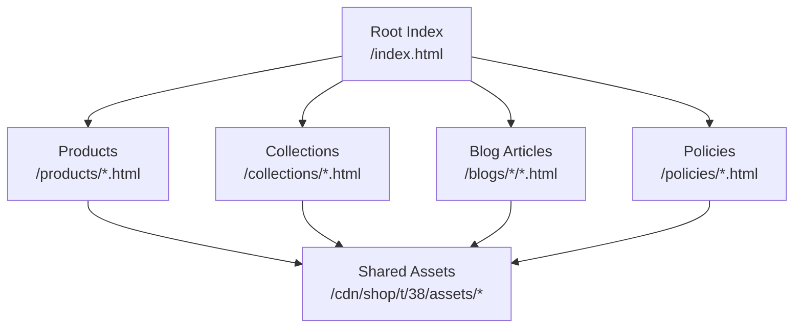
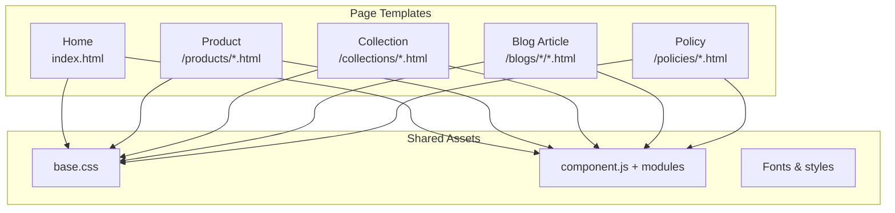
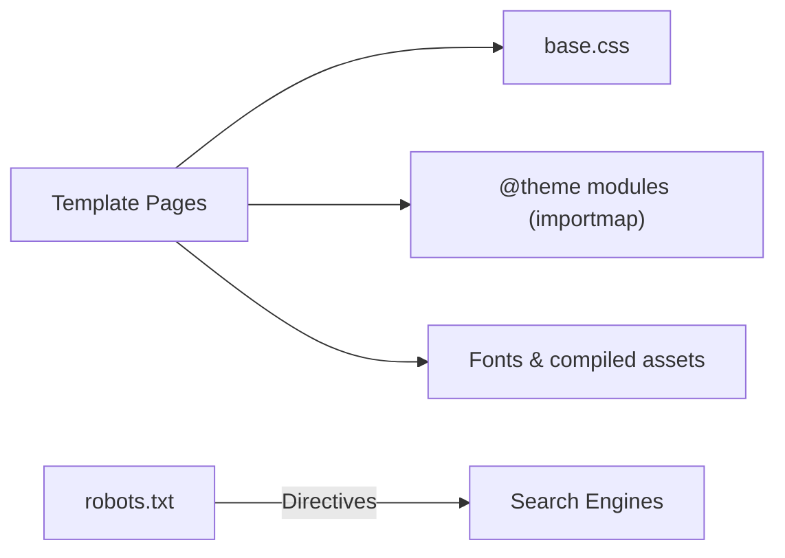

# Theme Structure and Templates

<cite>
**Referenced Files in This Document**
- [index.html](file://frontend/patchkraze.com/index.html)
- [3d-embroidered-patches.html](file://frontend/patchkraze.com/products/3d-embroidered-patches.html)
- [all.html](file://frontend/patchkraze.com/collections/all.html)
- [how-to-design-custom-patches-complete-guide-from-concept-to-production.html](file://frontend/patchkraze.com/blogs/patches/how-to-design-custom-patches-complete-guide-from-concept-to-production.html)
- [privacy-policy.html](file://frontend/patchkraze.com/policies/privacy-policy.html)
- [base.css](file://frontend/cdn/shop/t/38/assets/base.css)
- [component.js](file://frontend/cdn/shop/t/38/assets/component.js)
- [robots.txt](file://frontend/patchkraze.com/robots.txt)
</cite>

## Table of Contents
1. [Introduction](#introduction)
2. [Project Structure](#project-structure)
3. [Core Components](#core-components)
4. [Architecture Overview](#architecture-overview)
5. [Detailed Component Analysis](#detailed-component-analysis)
6. [Dependency Analysis](#dependency-analysis)
7. [Performance Considerations](#performance-considerations)
8. [Troubleshooting Guide](#troubleshooting-guide)
9. [Conclusion](#conclusion)

## Introduction
This document explains the static HTML structure and template organization used by the Shopify theme for Patch Kraft. It focuses on how pages are built with semantic HTML5 elements, SEO optimization techniques (meta tags, canonical URLs, Open Graph/Twitter cards), and accessibility considerations. It also details the layout patterns for product pages, collection pages, blog posts, and policy pages, along with navigation hierarchy, URL routing patterns, and content organization to support user experience and search engine visibility.

## Project Structure
The theme is organized as a set of static HTML templates under the site root, each representing a page type:
- Home page at the root index
- Product detail pages under /products
- Collection listing pages under /collections
- Blog articles under /blogs
- Policy pages under /policies
- Shared assets (CSS/JS) under /cdn/shop/t/38/assets

**Section sources**
- [index.html:1-100](file://frontend/patchkraze.com/index.html#L1-L100)
- [3d-embroidered-patches.html:1-120](file://frontend/patchkraze.com/products/3d-embroidered-patches.html#L1-L120)
- [all.html:1-120](file://frontend/patchkraze.com/collections/all.html#L1-L120)
- [how-to-design-custom-patches-complete-guide-from-concept-to-production.html:1-120](file://frontend/patchkraze.com/blogs/patches/how-to-design-custom-patches-complete-guide-from-concept-to-production.html#L1-L120)
- [privacy-policy.html:1-120](file://frontend/patchkraze.com/policies/privacy-policy.html#L1-L120)

## Core Components
- Semantic HTML5 structure: Each page uses a proper doctype, html lang attribute, meta charset, viewport, and structured head sections with SEO metadata. The main content area is wrapped in a semantic container that supports layout and transitions.
- SEO metadata: Pages include title, description, canonical link, Open Graph properties (site name, url, title, type, description, image), and Twitter card fields.
- Accessibility: Pages define a skip target via rel="expect" pointing to the main content region, use semantic roles where appropriate, and rely on consistent heading hierarchies.
- Shared UI components: JavaScript modules provide reusable behaviors such as dialogs, media galleries, variant pickers, quick add, and cart interactions. These are loaded via import maps and module preloads.

Key observations across templates:
- Consistent <head> block with SEO and social sharing tags
- Import map defining @theme scoped modules for component behavior
- Module preload hints for performance-critical scripts
- A Theme configuration object indicating the current template name and routes

**Section sources**
- [index.html:1-180](file://frontend/patchkraze.com/index.html#L1-L180)
- [3d-embroidered-patches.html:1-180](file://frontend/patchkraze.com/products/3d-embroidered-patches.html#L1-L180)
- [all.html:1-180](file://frontend/patchkraze.com/collections/all.html#L1-L180)
- [how-to-design-custom-patches-complete-guide-from-concept-to-production.html:1-180](file://frontend/patchkraze.com/blogs/patches/how-to-design-custom-patches-complete-guide-from-concept-to-production.html#L1-L180)
- [privacy-policy.html:1-180](file://frontend/patchkraze.com/policies/privacy-policy.html#L1-L180)

## Architecture Overview
The theme follows a page-per-template pattern with shared assets. Each page includes:
- A standardized head with SEO and social tags
- An import map for modular JS components
- Preloaded CSS and fonts for fast rendering
- A Theme configuration object that identifies the template and provides route endpoints for client-side features (cart, search)

**Diagram sources**
- [index.html:1-180](file://frontend/patchkraze.com/index.html#L1-L180)
- [3d-embroidered-patches.html:1-180](file://frontend/patchkraze.com/products/3d-embroidered-patches.html#L1-L180)
- [all.html:1-180](file://frontend/patchkraze.com/collections/all.html#L1-L180)
- [how-to-design-custom-patches-complete-guide-from-concept-to-production.html:1-180](file://frontend/patchkraze.com/blogs/patches/how-to-design-custom-patches-complete-guide-from-concept-to-production.html#L1-L180)
- [privacy-policy.html:1-180](file://frontend/patchkraze.com/policies/privacy-policy.html#L1-L180)
- [base.css:1-200](file://frontend/cdn/shop/t/38/assets/base.css#L1-L200)
- [component.js:1-139](file://frontend/cdn/shop/t/38/assets/component.js#L1-L139)

## Detailed Component Analysis

### Home Page Template (/index.html)
- Uses semantic HTML5 with a clear head section containing SEO and social tags.
- Declares an import map for modular JS components and preloads critical resources.
- Includes a Theme configuration object specifying the template name and routes for cart and search.

SEO highlights:
- Title and meta description tailored to the brand and value proposition
- Open Graph and Twitter card metadata for rich social previews
- Canonical URL set to the homepage

Accessibility highlights:
- Skip target configured to jump directly to main content
- Language attribute set for screen readers

**Section sources**
- [index.html:1-180](file://frontend/patchkraze.com/index.html#L1-L180)

### Product Detail Template (/products/*.html)
- Follows the same head structure with product-specific meta tags (Open Graph type set to product).
- Includes product-specific OG image and price metadata for rich previews.
- Loads additional product-related modules (variant picker, product form, media gallery, sticky add-to-cart, fly-to-cart).
- Theme configuration indicates a product template name and provides routes for cart operations.

SEO highlights:
- Unique title and description per product
- Canonical URL points to the specific product page
- Social sharing metadata optimized for product context

Accessibility highlights:
- Main content region with role attributes and transition flags for smooth navigation
- Focus management handled by shared focus utilities

**Section sources**
- [3d-embroidered-patches.html:1-180](file://frontend/patchkraze.com/products/3d-embroidered-patches.html#L1-L180)

### Collection Listing Template (/collections/*.html)
- Standardized head with collection-specific meta tags and canonical URL.
- Loads modules for paginated lists, product cards, and quick-add functionality.
- Theme configuration indicates a collection template name.

SEO highlights:
- Title and description reflect the collection scope
- Canonical URL prevents duplicate indexing issues

Accessibility highlights:
- Consistent main content wrapper and focus utilities ensure predictable keyboard navigation

**Section sources**
- [all.html:1-180](file://frontend/patchkraze.com/collections/all.html#L1-L180)

### Blog Article Template (/blogs/*/*.html)
- Head includes article-type Open Graph metadata and canonical URL for the article.
- Loads general modules plus content formatting utilities (RTE formatter).
- Theme configuration indicates an article template name.

SEO highlights:
- Title and description aligned with the article topic
- Canonical URL ensures single source of truth for indexing

Accessibility highlights:
- Semantic headings and content structure aid assistive technologies

**Section sources**
- [how-to-design-custom-patches-complete-guide-from-concept-to-production.html:1-180](file://frontend/patchkraze.com/blogs/patches/how-to-design-custom-patches-complete-guide-from-concept-to-production.html#L1-L180)

### Policy Template (/policies/*.html)
- Head includes policy-specific meta tags and canonical URL.
- Uses a policy container structure with a title and body region for legal content.
- Theme configuration may be empty or generic depending on policy handling.

SEO highlights:
- Title and description describe the policy page
- Canonical URL avoids duplicate content issues

Accessibility highlights:
- Clear heading hierarchy and semantic regions improve readability for screen readers

**Section sources**
- [privacy-policy.html:1-180](file://frontend/patchkraze.com/policies/privacy-policy.html#L1-L180)

### Shared Base Styles and Components
- base.css defines global resets, typography, hover effects, and responsive behaviors for cards and images.
- component.js provides a base class for declarative shadow DOM components, event delegation, and reference resolution, enabling reusable UI patterns across templates.

These shared assets ensure consistent styling and behavior across all page types.

**Section sources**
- [base.css:1-200](file://frontend/cdn/shop/t/38/assets/base.css#L1-L200)
- [component.js:1-139](file://frontend/cdn/shop/t/38/assets/component.js#L1-L139)

## Dependency Analysis
Each template depends on:
- Shared CSS (base.css) for visual consistency
- Shared JS modules via import maps for interactive features
- Fonts and compiled assets for performance and aesthetics

Crawl directives in robots.txt guide search engines away from sensitive or dynamic areas while allowing indexing of core content.

**Diagram sources**
- [base.css:1-200](file://frontend/cdn/shop/t/38/assets/base.css#L1-L200)
- [component.js:1-139](file://frontend/cdn/shop/t/38/assets/component.js#L1-L139)
- [robots.txt:17-63](file://frontend/patchkraze.com/robots.txt#L17-L63)

**Section sources**
- [robots.txt:17-63](file://frontend/patchkraze.com/robots.txt#L17-L63)

## Performance Considerations
- Resource preloading: Fonts and critical CSS/JS are preloaded to reduce render-blocking delays.
- Module preloads: Key modules like utilities, component, section renderer, and hydration are preloaded for faster interactivity.
- Efficient asset loading: Scripts are loaded with low fetch priority except where necessary, balancing initial load and interactivity.
- View transitions: Transition scripts are included to enhance perceived performance during navigation.

[No sources needed since this section provides general guidance]

## Troubleshooting Guide
Common issues and checks:
- Missing or incorrect canonical URLs: Verify each page’s canonical tag matches the intended URL to prevent duplicate content.
- Incomplete SEO metadata: Ensure title, description, and Open Graph/Twitter card tags are present and accurate per page type.
- Broken module imports: Confirm import map paths and module availability; check browser console for errors when modules fail to load.
- Focus and accessibility problems: Validate that the main content region has correct IDs and roles, and that skip targets work as expected.
- Robots.txt directives: Review disallow rules to ensure important pages remain crawlable while blocking sensitive areas.

**Section sources**
- [index.html:1-180](file://frontend/patchkraze.com/index.html#L1-L180)
- [3d-embroidered-patches.html:1-180](file://frontend/patchkraze.com/products/3d-embroidered-patches.html#L1-L180)
- [all.html:1-180](file://frontend/patchkraze.com/collections/all.html#L1-L180)
- [how-to-design-custom-patches-complete-guide-from-concept-to-production.html:1-180](file://frontend/patchkraze.com/blogs/patches/how-to-design-custom-patches-complete-guide-from-concept-to-production.html#L1-L180)
- [privacy-policy.html:1-180](file://frontend/patchkraze.com/policies/privacy-policy.html#L1-L180)
- [robots.txt:17-63](file://frontend/patchkraze.com/robots.txt#L17-L63)

## Conclusion
The theme employs a consistent, semantic HTML5 structure across all page types, with robust SEO metadata and accessibility practices. Shared assets and modular JavaScript enable reusable components and smooth interactions. URL routing follows standard Shopify conventions (/products, /collections, /blogs, /policies), and robots.txt guides crawlers appropriately. This organization supports optimal user experience and search engine visibility while maintaining maintainability and performance.