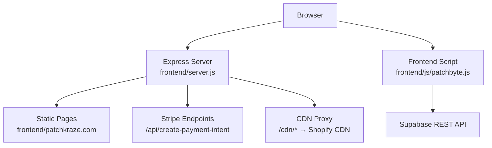

# Getting Started

<cite>
**Referenced Files in This Document**
- [package.json](file://package.json)
- [frontend/server.js](file://frontend/server.js)
- [api/index.js](file://api/index.js)
- [vercel.json](file://vercel.json)
- [netlify.toml](file://netlify.toml)
- [netlify-build.js](file://netlify-build.js)
- [migrate-tables.sql](file://migrate-tables.sql)
- [frontend/js/patchbyte.js](file://frontend/js/patchbyte.js)
</cite>

## Table of Contents
1. [Introduction](#introduction)
2. [Prerequisites](#prerequisites)
3. [Project Structure](#project-structure)
4. [Installation](#installation)
5. [Environment Setup](#environment-setup)
6. [Database Migration](#database-migration)
7. [Local Development](#local-development)
8. [Deployment](#deployment)
9. [Verification](#verification)
10. [Troubleshooting](#troubleshooting)
11. [Conclusion](#conclusion)

## Introduction
Patch-Byte is a static-site storefront that integrates with Stripe for payments and Supabase for cart, orders, and contact submissions. It serves HTML pages from the frontend directory and exposes a small Express server for payment intents and asset proxying. The project supports local development and can be deployed to Vercel or Netlify using the included configuration files.

## Prerequisites
- Node.js version 18 or newer (required by the project engines field).
- A Stripe account with API keys:
  - Secret key for server-side payment intent creation.
  - Publishable key exposed to the client via an endpoint.
- A Supabase project with tables for cart items, orders, order items, and contact submissions. Run the provided migration script to add required columns and enable permissive Row Level Security policies.
- A Shopify store (optional for CDN assets): The server proxies missing /cdn/* requests to Shopify’s CDN so theme assets load correctly.

**Section sources**
- [package.json:8-13](file://package.json#L8-L13)
- [frontend/server.js:6-9](file://frontend/server.js#L6-L9)
- [migrate-tables.sql:1-57](file://migrate-tables.sql#L1-L57)

## Project Structure
- Root package.json defines scripts and dependencies; start command runs the frontend server.
- frontend/server.js is the Express application serving static pages, handling Stripe endpoints, and proxying CDN assets.
- api/index.js re-exports the Express app for Vercel serverless functions.
- vercel.json configures Vercel functions and rewrites to route traffic through the API function.
- netlify.toml and netlify-build.js configure Netlify build steps and redirects/proxies for CDN assets.
- migrate-tables.sql contains SQL to update existing tables and set permissive RLS policies.
- frontend/js/patchbyte.js intercepts Shopify-style fetch calls to integrate cart operations with Supabase.

**Diagram sources**
- [frontend/server.js:17-65](file://frontend/server.js#L17-L65)
- [frontend/js/patchbyte.js:33-65](file://frontend/js/patchbyte.js#L33-L65)

**Section sources**
- [package.json:4-13](file://package.json#L4-L13)
- [frontend/server.js:11-14](file://frontend/server.js#L11-L14)
- [api/index.js:1-1](file://api/index.js#L1-L1)
- [vercel.json:1-12](file://vercel.json#L1-L12)
- [netlify.toml:1-165](file://netlify.toml#L1-L165)
- [netlify-build.js:1-28](file://netlify-build.js#L1-L28)
- [migrate-tables.sql:1-57](file://migrate-tables.sql#L1-L57)
- [frontend/js/patchbyte.js:1-65](file://frontend/js/patchbyte.js#L1-L65)

## Installation
1. Install dependencies at the repository root:
   - npm install
2. Start the local server:
   - npm start

The start script executes the Express server defined in the frontend directory.

**Section sources**
- [package.json:4-13](file://package.json#L4-L13)
- [frontend/server.js:11-12](file://frontend/server.js#L11-L12)

## Environment Setup
Create a .env file in the repository root with the following variables:
- STRIPE_SECRET_KEY: Your Stripe secret key for creating payment intents on the server.
- STRIPE_PUBLISHABLE_KEY: Your Stripe publishable key, exposed to the client via an endpoint.
- PORT: Optional; defaults to 3000 if not set.

Notes:
- The server loads .env only in local development; Vercel and Netlify inject environment variables at runtime.
- The server conditionally requires Stripe when the secret key is present.

**Section sources**
- [frontend/server.js:6-9](file://frontend/server.js#L6-L9)
- [frontend/server.js:17-44](file://frontend/server.js#L17-L44)

## Database Migration
Run the provided SQL in your Supabase project to update existing tables and enable permissive Row Level Security policies:
- Tables updated: cart_items, orders, order_items, contact_submissions
- Columns added include product details, pricing, shipping address, notes, totals, status, and contact fields.
- Policies allow anonymous inserts and reads for these tables.

Steps:
1. Open Supabase Dashboard → SQL Editor.
2. Paste the contents of migrate-tables.sql.
3. Execute the query.

This ensures the frontend JavaScript can persist cart items, orders, and contact submissions via Supabase REST.

**Section sources**
- [migrate-tables.sql:1-57](file://migrate-tables.sql#L1-L57)
- [frontend/js/patchbyte.js:33-65](file://frontend/js/patchbyte.js#L33-L65)

## Local Development
Start the development server:
- npm start

What happens:
- The Express server starts on port 3000 (or the configured PORT).
- Static pages under frontend/patchkraze.com are served.
- Stripe endpoints are available at /api/create-payment-intent and /api/stripe-config.
- Missing /cdn/* assets are proxied to Shopify’s CDN.

Access the site:
- http://localhost:3000

**Section sources**
- [frontend/server.js:11-12](file://frontend/server.js#L11-L12)
- [frontend/server.js:46-65](file://frontend/server.js#L46-L65)
- [frontend/server.js:117-122](file://frontend/server.js#L117-L122)

## Deployment

### Vercel
Configuration:
- vercel.json defines:
  - Functions: api/index.js includes frontend HTML, JS, and theme assets.
  - Rewrites: All routes are forwarded to the API function.

Steps:
1. Connect your repository to Vercel.
2. Add environment variables in Vercel settings:
   - STRIPE_SECRET_KEY
   - STRIPE_PUBLISHABLE_KEY
3. Deploy. Vercel will use the functions and rewrites as configured.

Notes:
- The API function exports the Express app, allowing serverless execution.

**Section sources**
- [vercel.json:1-12](file://vercel.json#L1-L12)
- [api/index.js:1-1](file://api/index.js#L1-L1)
- [frontend/server.js:113-114](file://frontend/server.js#L113-L114)

### Netlify
Configuration:
- netlify.toml sets:
  - Build command: node netlify-build.js
  - Publish directory: public
  - NODE_VERSION: 18
  - Redirects and CDN proxies for Shopify assets
- netlify-build.js copies HTML pages, theme assets, fonts, and patchbyte.js into public/.

Steps:
1. Connect your repository to Netlify.
2. Add environment variables in Netlify settings:
   - STRIPE_SECRET_KEY
   - STRIPE_PUBLISHABLE_KEY
3. Ensure NODE_VERSION is set to 18 in environment settings if not already enforced by netlify.toml.
4. Deploy. Netlify will run the build script and publish the public folder.

**Section sources**
- [netlify.toml:1-165](file://netlify.toml#L1-L165)
- [netlify-build.js:1-28](file://netlify-build.js#L1-L28)

## Verification
After setup, verify core functionality:
- Load the homepage and ensure pages render from frontend/patchkraze.com.
- Confirm CDN assets load (images, CSS, JS) via the server’s /cdn/* proxy or platform-specific redirects.
- Test Stripe integration:
  - Call /api/stripe-config to retrieve the publishable key.
  - Create a payment intent via POST /api/create-payment-intent with a valid amount.
- Validate Supabase integration:
  - Add an item to the cart and confirm it persists via Supabase REST.
  - Check that the cart badge updates based on stored items.

Expected behaviors:
- Successful responses from Stripe endpoints when keys are configured.
- 404 pages for missing routes with a home link fallback.
- CDN proxy returns content from Shopify when local files are absent.

**Section sources**
- [frontend/server.js:17-44](file://frontend/server.js#L17-L44)
- [frontend/server.js:46-65](file://frontend/server.js#L46-L65)
- [frontend/server.js:92-111](file://frontend/server.js#L92-L111)
- [frontend/js/patchbyte.js:67-111](file://frontend/js/patchbyte.js#L67-L111)

## Troubleshooting
Common issues and resolutions:
- Node version mismatch:
  - Ensure Node.js >= 18 is installed; the project specifies this in engines.
- Missing environment variables:
  - Verify STRIPE_SECRET_KEY and STRIPE_PUBLISHABLE_KEY are set locally or in your deployment platform.
  - On Vercel/Netlify, add them in the environment settings.
- Stripe errors:
  - If STRIPE_SECRET_KEY is not set, the server returns an error indicating Stripe is not configured.
  - Invalid amounts result in a 400 response; ensure amounts are positive integers representing cents.
- CDN assets not loading:
  - The server proxies /cdn/* to Shopify CDN; check network tab for 404s and ensure the proxy path is correct.
  - On Netlify, redirects and proxies are defined in netlify.toml; verify they match your asset paths.
- Supabase access denied:
  - Run migrate-tables.sql to add required columns and enable permissive RLS policies.
  - Ensure the Supabase anon key used by patchbyte.js has appropriate permissions.
- Port conflicts:
  - If port 3000 is in use, set PORT to another value in your environment.

**Section sources**
- [package.json:8-13](file://package.json#L8-L13)
- [frontend/server.js:6-9](file://frontend/server.js#L6-L9)
- [frontend/server.js:17-39](file://frontend/server.js#L17-L39)
- [frontend/server.js:50-65](file://frontend/server.js#L50-L65)
- [migrate-tables.sql:36-57](file://migrate-tables.sql#L36-L57)
- [frontend/js/patchbyte.js:10-17](file://frontend/js/patchbyte.js#L10-L17)

## Conclusion
You now have everything needed to set up, run, and deploy Patch-Byte locally and on Vercel or Netlify. Configure Stripe and Supabase, run the database migration, and verify integrations. Use the troubleshooting section to resolve common issues and ensure a smooth development and deployment experience.