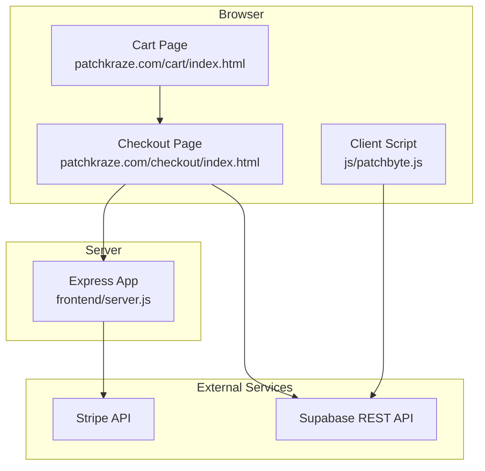
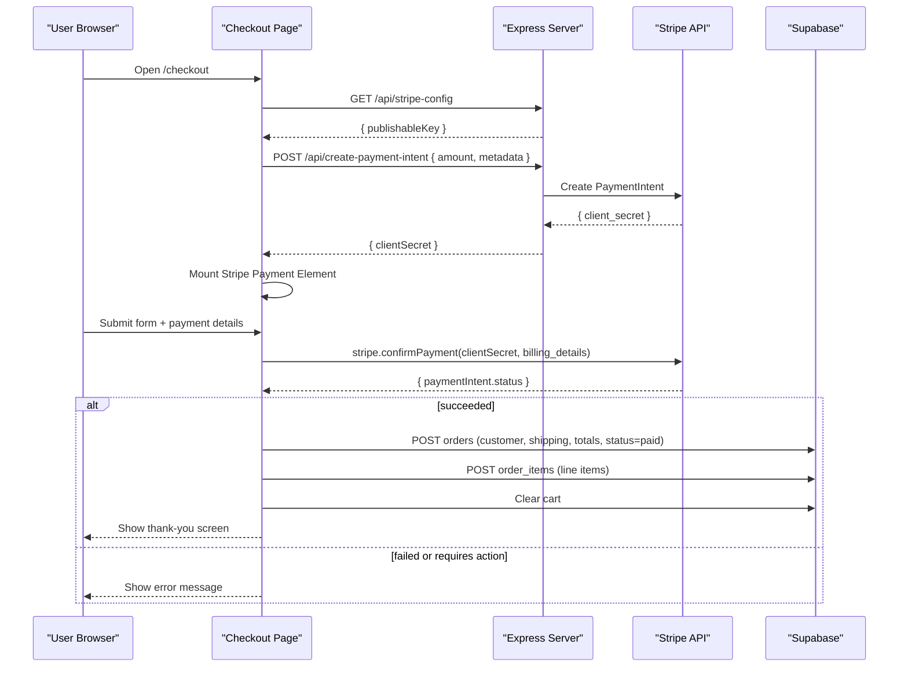
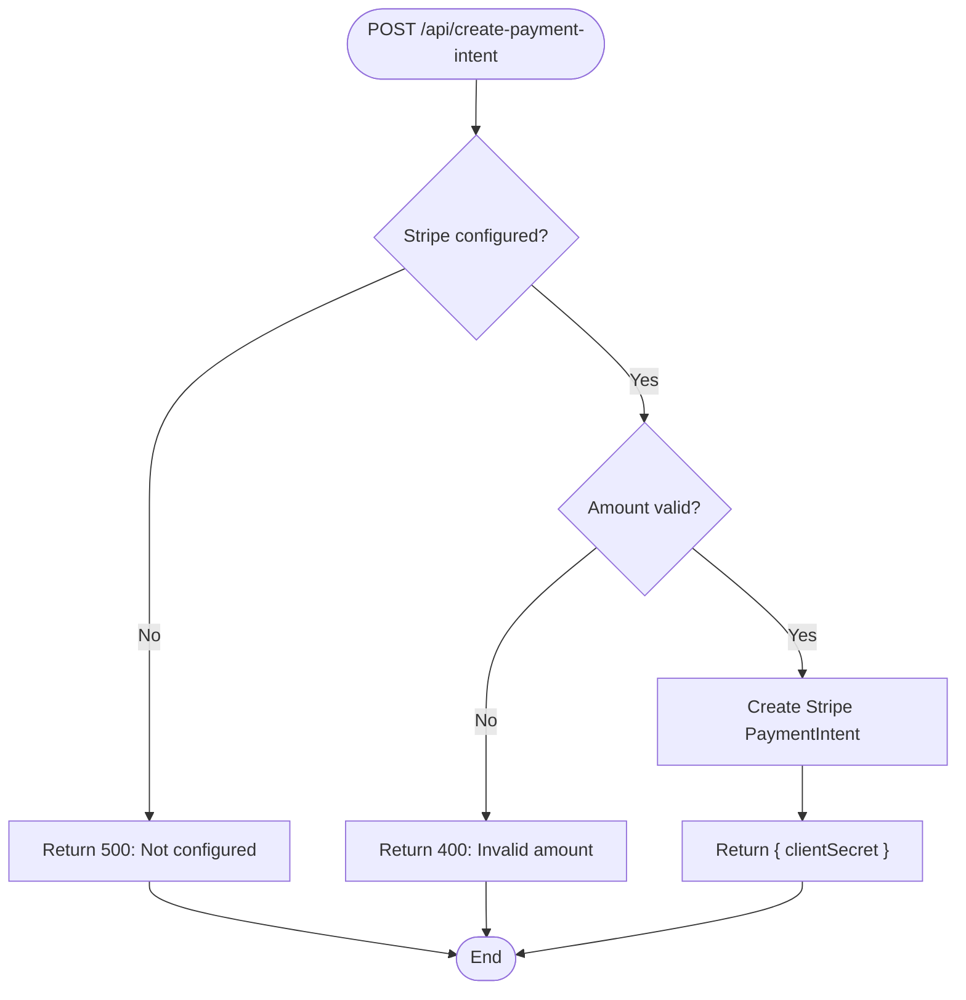
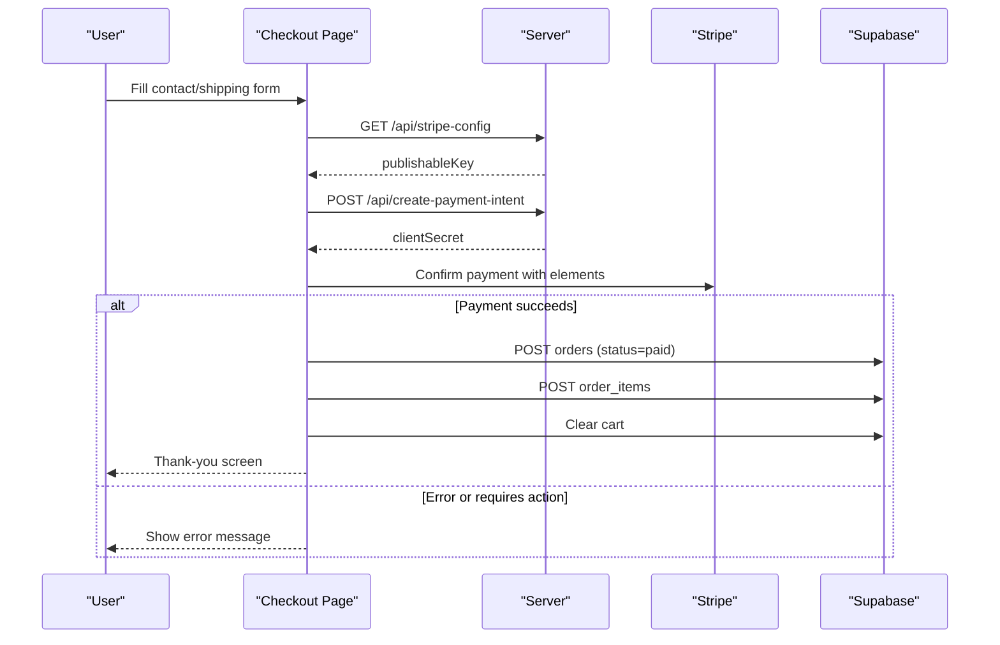
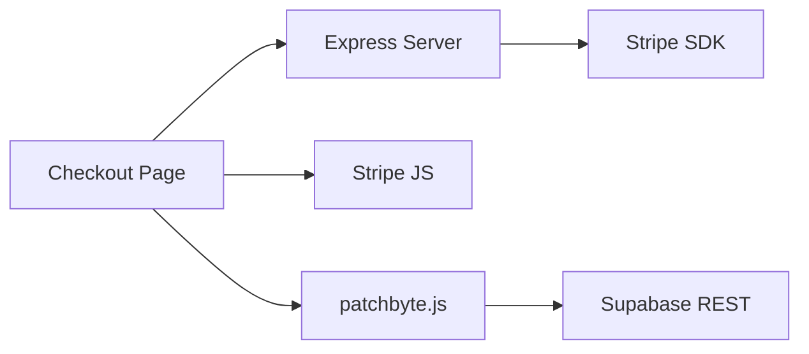
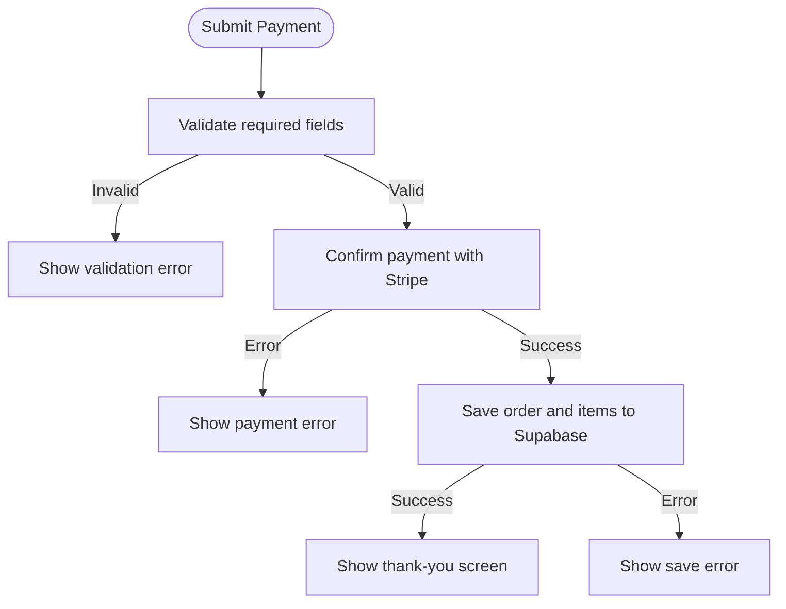

# Payment Processing

<cite>
**Referenced Files in This Document**
- [server.js](file://frontend/server.js)
- [index.html (Checkout)](file://frontend/patchkraze.com/checkout/index.html)
- [index.html (Cart)](file://frontend/patchkraze.com/cart/index.html)
- [patchbyte.js](file://frontend/js/patchbyte.js)
- [api/index.js](file://api/index.js)
</cite>

## Table of Contents
1. [Introduction](#introduction)
2. [Project Structure](#project-structure)
3. [Core Components](#core-components)
4. [Architecture Overview](#architecture-overview)
5. [Detailed Component Analysis](#detailed-component-analysis)
6. [Dependency Analysis](#dependency-analysis)
7. [Performance Considerations](#performance-considerations)
8. [Troubleshooting Guide](#troubleshooting-guide)
9. [Conclusion](#conclusion)
10. [Appendices](#appendices)

## Introduction
This document explains how the Patch-Byte e-commerce platform processes payments using Stripe. It covers the end-to-end checkout flow from cart to payment confirmation, client-server communication for payment intent creation, customer information and shipping address handling, error handling and user feedback, and security considerations including PCI compliance. The implementation uses a lightweight Express server to create Stripe Payment Intents and a browser-based checkout page that integrates Stripe Elements for secure card and wallet payments. Orders are persisted via Supabase through a client-side integration script.

## Project Structure
The payment processing spans a small set of focused files:
- Server endpoints for creating Payment Intents and exposing Stripe configuration
- Checkout UI that collects customer details, renders a Stripe Payment Element, and confirms payment
- Cart UI that displays items and navigates to checkout
- A client-side integration script that manages cart state and persists orders to Supabase

**Diagram sources**
- [server.js:17-44](file://frontend/server.js#L17-L44)
- [index.html (Checkout):200-212](file://frontend/patchkraze.com/checkout/index.html#L200-L212)
- [index.html (Checkout):289-323](file://frontend/patchkraze.com/checkout/index.html#L289-L323)
- [patchbyte.js:33-65](file://frontend/js/patchbyte.js#L33-L65)

**Section sources**
- [server.js:1-44](file://frontend/server.js#L1-L44)
- [index.html (Checkout):1-159](file://frontend/patchkraze.com/checkout/index.html#L1-L159)
- [index.html (Cart):1-93](file://frontend/patchkraze.com/cart/index.html#L1-L93)
- [patchbyte.js:1-65](file://frontend/js/patchbyte.js#L1-L65)

## Core Components
- Express server with Stripe integration:
  - POST /api/create-payment-intent: Creates a Stripe PaymentIntent with amount, currency, and metadata
  - GET /api/stripe-config: Returns the publishable key to the frontend
- Checkout page:
  - Collects contact and shipping information
  - Initializes Stripe Elements and mounts a Payment Element
  - Confirms payment and records order data on success
- Cart page:
  - Displays cart items, totals, and navigation to checkout
- Client script (patchbyte.js):
  - Manages session-scoped cart persistence via Supabase
  - Provides helpers to add/update/clear cart and post orders/order items

**Section sources**
- [server.js:17-44](file://frontend/server.js#L17-L44)
- [index.html (Checkout):200-212](file://frontend/patchkraze.com/checkout/index.html#L200-L212)
- [index.html (Checkout):289-323](file://frontend/patchkraze.com/checkout/index.html#L289-L323)
- [index.html (Cart):95-182](file://frontend/patchkraze.com/cart/index.html#L95-L182)
- [patchbyte.js:67-111](file://frontend/js/patchbyte.js#L67-L111)

## Architecture Overview
The payment flow is driven by the checkout page and the server’s Stripe endpoint. The client never handles raw card data; Stripe Elements securely collect payment details and return a tokenized result used to confirm a PaymentIntent created server-side.

**Diagram sources**
- [server.js:17-44](file://frontend/server.js#L17-L44)
- [index.html (Checkout):200-212](file://frontend/patchkraze.com/checkout/index.html#L200-L212)
- [index.html (Checkout):289-323](file://frontend/patchkraze.com/checkout/index.html#L289-L323)

## Detailed Component Analysis

### Server: Payment Intent Creation and Configuration
- Creates a PaymentIntent with:
  - Amount in cents (validated positive integer)
  - Currency set to USD
  - Automatic payment methods enabled
  - Metadata carrying session context
- Exposes the Stripe publishable key to the frontend
- Errors are logged and returned as JSON with appropriate HTTP status codes

**Diagram sources**
- [server.js:17-39](file://frontend/server.js#L17-L39)

**Section sources**
- [server.js:17-44](file://frontend/server.js#L17-L44)

### Checkout Page: Customer Information, Shipping Address, and Payment Confirmation
- Collects required fields: name, email, phone (optional), street, city, zip, country (optional), notes (optional)
- Validates required fields before submission
- Initializes Stripe Elements using the publishable key from the server and mounts a Payment Element
- Calls stripe.confirmPayment with billing details and a return URL
- On success, posts order and line items to Supabase, clears the cart, and shows a thank-you screen
- On failure, disables the submit button state and shows an error banner

**Diagram sources**
- [index.html (Checkout):200-212](file://frontend/patchkraze.com/checkout/index.html#L200-L212)
- [index.html (Checkout):289-323](file://frontend/patchkraze.com/checkout/index.html#L289-L323)

**Section sources**
- [index.html (Checkout):73-131](file://frontend/patchkraze.com/checkout/index.html#L73-L131)
- [index.html (Checkout):200-212](file://frontend/patchkraze.com/checkout/index.html#L200-L212)
- [index.html (Checkout):260-351](file://frontend/patchkraze.com/checkout/index.html#L260-L351)

### Cart Page: Item Management and Navigation
- Loads cart items from Supabase via the client script
- Renders product image, name, properties, quantity controls, and per-line totals
- Updates quantities or removes items by calling client helpers
- Displays total and a link to proceed to checkout

**Section sources**
- [index.html (Cart):95-182](file://frontend/patchkraze.com/cart/index.html#L95-L182)

### Client Script: Session, Cart, and Order Persistence
- Maintains a session ID stored in localStorage
- Provides functions to get/add/update/clear cart items and refresh badge counts
- Intercepts Shopify-style fetch calls to route cart operations to Supabase
- Exposes a public API for pages to interact with cart and Supabase

**Section sources**
- [patchbyte.js:19-65](file://frontend/js/patchbyte.js#L19-L65)
- [patchbyte.js:67-111](file://frontend/js/patchbyte.js#L67-L111)
- [patchbyte.js:138-163](file://frontend/js/patchbyte.js#L138-L163)
- [patchbyte.js:165-233](file://frontend/js/patchbyte.js#L165-L233)

## Dependency Analysis
- The checkout page depends on:
  - The Express server for Stripe configuration and PaymentIntent creation
  - Stripe JS library for secure payment collection and confirmation
  - The client script for cart retrieval and order persistence
- The server depends on:
  - Environment variables for Stripe keys
  - The Stripe SDK to create PaymentIntents
- The client script depends on:
  - Supabase REST API for cart and order storage

**Diagram sources**
- [server.js:1-10](file://frontend/server.js#L1-L10)
- [server.js:17-44](file://frontend/server.js#L17-L44)
- [index.html (Checkout):1-11](file://frontend/patchkraze.com/checkout/index.html#L1-L11)
- [index.html (Checkout):200-212](file://frontend/patchkraze.com/checkout/index.html#L200-L212)
- [patchbyte.js:33-65](file://frontend/js/patchbyte.js#L33-L65)

**Section sources**
- [server.js:1-44](file://frontend/server.js#L1-L44)
- [index.html (Checkout):1-11](file://frontend/patchkraze.com/checkout/index.html#L1-L11)
- [patchbyte.js:33-65](file://frontend/js/patchbyte.js#L33-L65)

## Performance Considerations
- Keep the PaymentIntent amount calculation on the server to avoid client-side tampering
- Use minimal network requests:
  - Fetch Stripe config once at checkout load
  - Create one PaymentIntent per checkout attempt
- Avoid heavy DOM manipulation during payment confirmation; disable the submit button immediately to prevent duplicate submissions
- Cache static assets and leverage CDN where possible (the server proxies Shopify CDN assets)

[No sources needed since this section provides general guidance]

## Troubleshooting Guide
Common issues and their handling in the codebase:
- Missing or invalid amount:
  - Server returns 400 with an error message when amount is missing or non-positive
- Stripe not configured:
  - Server returns 500 if Stripe secret key is not present
  - Frontend disables the pay button and shows an error if publishable key is missing
- Payment errors:
  - Frontend catches Stripe confirmation errors and displays them in an error banner
  - If paymentIntent status is not “succeeded,” an error is thrown and shown to the user
- Network or service failures:
  - Errors are caught and surfaced to the user with a retry-friendly message
  - Console logs include contextual tags for debugging

**Diagram sources**
- [index.html (Checkout):260-351](file://frontend/patchkraze.com/checkout/index.html#L260-L351)
- [server.js:17-39](file://frontend/server.js#L17-L39)

**Section sources**
- [server.js:17-39](file://frontend/server.js#L17-L39)
- [index.html (Checkout):260-351](file://frontend/patchkraze.com/checkout/index.html#L260-L351)

## Conclusion
The Patch-Byte platform implements a secure, streamlined payment flow using Stripe Payment Intents and Stripe Elements. The server creates PaymentIntents with validated amounts and exposes only the publishable key to the client. The checkout page collects customer and shipping information, confirms payment securely via Stripe, and persists order data to Supabase. Error handling is implemented at both client and server levels to provide clear user feedback. While no webhooks are currently implemented in this repository, the design supports future webhook-based reconciliation by storing payment_intent_id with orders.

[No sources needed since this section summarizes without analyzing specific files]

## Appendices

### Security Best Practices and PCI Compliance
- Never handle raw card numbers on your servers; use Stripe Elements to tokenize payment data
- Store only the minimum necessary data:
  - Customer name, email, phone, shipping address, order totals, and payment_intent_id
- Validate all inputs server-side (amount, currency, metadata)
- Use HTTPS for all endpoints and ensure environment variables are protected
- Log errors without sensitive data; mask or omit tokens and secrets in logs
- Consider implementing server-side webhooks to reconcile payment states asynchronously

[No sources needed since this section provides general guidance]

### Example Scenarios

- Payment Success
  - User fills contact and shipping fields
  - Checkout creates a PaymentIntent and mounts Stripe Elements
  - User completes payment; Stripe returns a succeeded status
  - Order and line items are saved to Supabase; cart is cleared; thank-you screen is shown

- Payment Failure
  - Validation fails: show inline error and prevent submission
  - Stripe confirmation fails: display error banner and re-enable the submit button
  - Saving order fails: show error and allow retry

- Requires Additional Action
  - If Stripe indicates additional authentication is required, the redirect behavior is handled by Stripe; ensure the return URL is correct and the client can resume the flow

[No sources needed since this section describes conceptual scenarios based on existing flows]