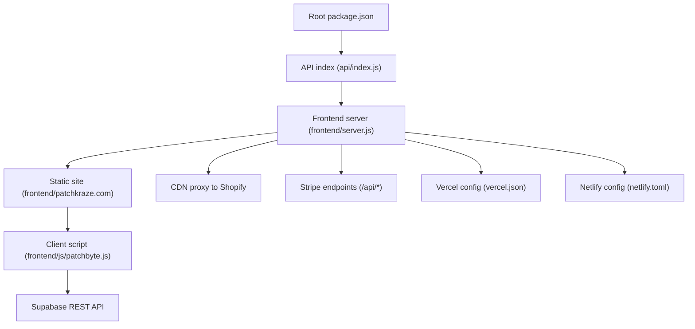
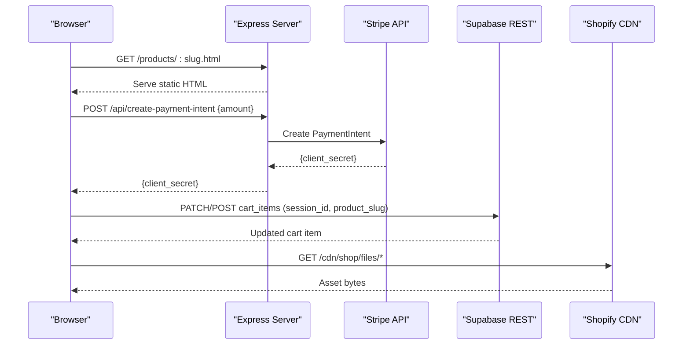
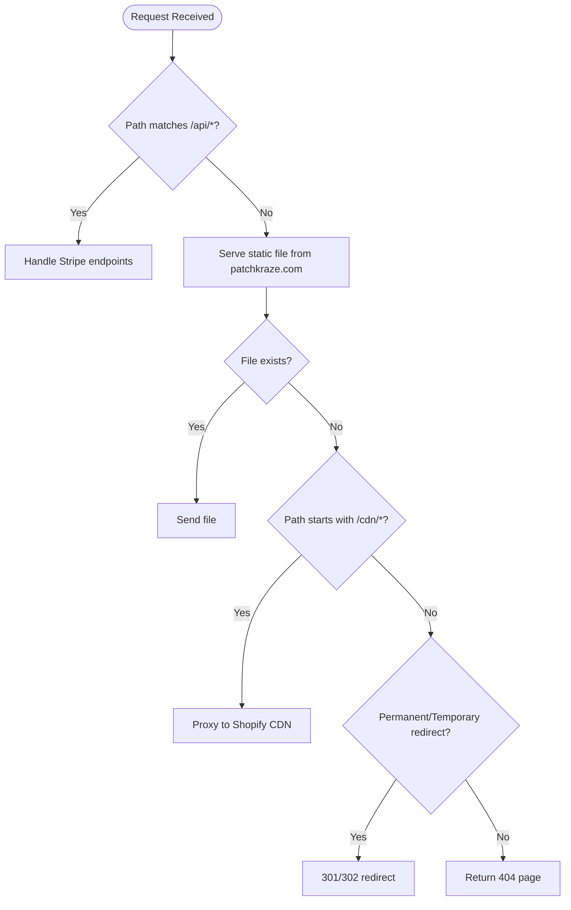
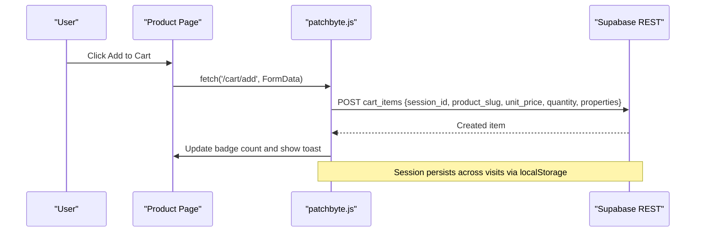
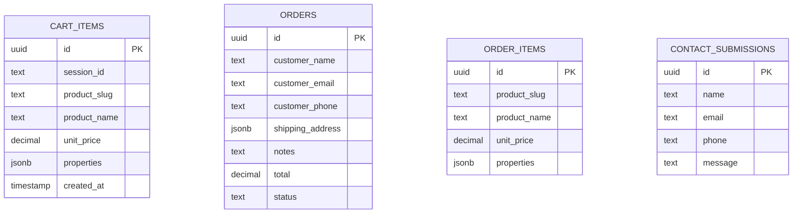
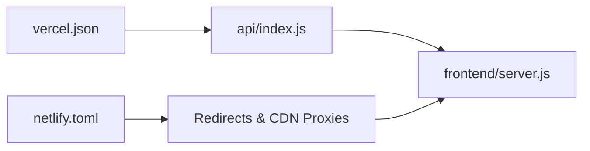
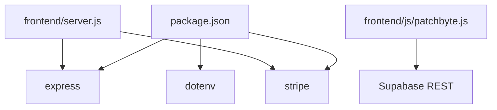

# Project Overview

<cite>
**Referenced Files in This Document**
- [package.json](file://package.json)
- [api/index.js](file://api/index.js)
- [frontend/server.js](file://frontend/server.js)
- [frontend/package.json](file://frontend/package.json)
- [frontend/js/patchbyte.js](file://frontend/js/patchbyte.js)
- [migrate-tables.sql](file://migrate-tables.sql)
- [vercel.json](file://vercel.json)
- [netlify.toml](file://netlify.toml)
</cite>

## Table of Contents
1. [Introduction](#introduction)
2. [Project Structure](#project-structure)
3. [Core Components](#core-components)
4. [Architecture Overview](#architecture-overview)
5. [Detailed Component Analysis](#detailed-component-analysis)
6. [Dependency Analysis](#dependency-analysis)
7. [Performance Considerations](#performance-considerations)
8. [Troubleshooting Guide](#troubleshooting-guide)
9. [Conclusion](#conclusion)

## Introduction
Patch-Byte is a hybrid e-commerce platform built for Patch Kraft’s embroidered patches and accessories. It combines a static, Shopify-style storefront with a lightweight Node.js server that serves pages, proxies CDN assets, and exposes secure payment endpoints. The project integrates:
- Node.js and Express.js to serve static content and API routes
- Stripe for secure payment processing via PaymentIntent
- Supabase as the backend database for persistent shopping cart, orders, and contact submissions
- Shopify integration through static HTML templates and CDN asset proxying

Key features include:
- Persistent shopping cart across sessions using Supabase
- Secure payment processing with Stripe on the server side
- Content management through Shopify-managed static pages and collections
- Clean URL routing and redirects for a smooth user experience

This overview explains how these pieces work together to deliver a fast, reliable storefront tailored to Patch Kraft’s product catalog.

## Project Structure
The repository organizes code into clear layers:
- Root package configuration and scripts
- API entrypoint for serverless deployment
- Frontend server serving static HTML and handling API routes
- Client-side script integrating Supabase and intercepting Shopify-style cart interactions
- Database migration definitions for Supabase tables
- Deployment configurations for Vercel and Netlify



**Diagram sources**
- [package.json:1-14](file://package.json#L1-L14)
- [api/index.js:1-1](file://api/index.js#L1-L1)
- [frontend/server.js:1-123](file://frontend/server.js#L1-L123)
- [frontend/js/patchbyte.js:1-345](file://frontend/js/patchbyte.js#L1-L345)
- [vercel.json:1-12](file://vercel.json#L1-L12)
- [netlify.toml:1-165](file://netlify.toml#L1-L165)

**Section sources**
- [package.json:1-14](file://package.json#L1-L14)
- [frontend/server.js:1-123](file://frontend/server.js#L1-L123)
- [vercel.json:1-12](file://vercel.json#L1-L12)
- [netlify.toml:1-165](file://netlify.toml#L1-L165)

## Core Components
- Server runtime and dependencies:
  - Express.js serves static files and API routes
  - Stripe SDK handles payment intent creation securely on the server
  - Dotenv loads environment variables locally
- Static site hosting:
  - HTML templates under frontend/patchkraze.com mirror Shopify structure (products, collections, blogs, policies)
  - Clean URL routing maps /products/foo to .html files
  - CDN proxy forwards requests to Shopify CDN for images and theme assets
- Client-side integration:
  - patchbyte.js intercepts Shopify-style fetch calls to persist cart items in Supabase
  - Maintains a session ID per browser and updates cart badge counts
  - Wires contact form submission to Supabase
- Database schema:
  - Supabase tables for cart_items, orders, order_items, and contact_submissions
  - Row Level Security policies allow anonymous access for cart and contact flows

**Section sources**
- [frontend/server.js:1-123](file://frontend/server.js#L1-L123)
- [frontend/js/patchbyte.js:1-345](file://frontend/js/patchbyte.js#L1-L345)
- [migrate-tables.sql:1-57](file://migrate-tables.sql#L1-L57)
- [package.json:1-14](file://package.json#L1-L14)

## Architecture Overview
Patch-Byte uses a hybrid architecture:
- Static frontend assets are served directly by an Express server or via CDN-based platforms (Vercel/Netlify)
- Dynamic operations (payments, cart persistence) are handled by serverless functions or server routes
- Shopify provides content and media; the server proxies CDN paths to ensure assets load correctly
- Supabase stores cart and contact data client-side via REST API, enabling persistent carts without user accounts



**Diagram sources**
- [frontend/server.js:17-44](file://frontend/server.js#L17-L44)
- [frontend/server.js:46-65](file://frontend/server.js#L46-L65)
- [frontend/js/patchbyte.js:67-111](file://frontend/js/patchbyte.js#L67-L111)
- [migrate-tables.sql:5-34](file://migrate-tables.sql#L5-L34)

## Detailed Component Analysis

### Express Server and Routing
Responsibilities:
- Load environment variables and initialize Stripe when secret key is present
- Serve static HTML from the patchkraze.com directory
- Proxy /cdn/* requests to Shopify CDN, preserving content types and caching headers
- Provide clean URL routing for products, collections, pages, blogs, and policies
- Handle permanent and temporary redirects for renamed or missing pages
- Expose secure Stripe endpoints for creating payment intents and retrieving publishable keys



**Diagram sources**
- [frontend/server.js:17-44](file://frontend/server.js#L17-L44)
- [frontend/server.js:46-65](file://frontend/server.js#L46-L65)
- [frontend/server.js:67-111](file://frontend/server.js#L67-L111)

**Section sources**
- [frontend/server.js:1-123](file://frontend/server.js#L1-L123)

### Client-Side Cart Integration (Supabase)
Responsibilities:
- Maintain a session ID stored in localStorage to identify each visitor’s cart
- Intercept Shopify-style fetch calls to /cart/add, /cart/change, and /cart.json
- Persist cart items in Supabase table cart_items with product details and properties
- Update UI badges and show toast notifications after adding items
- Wire contact forms to submit messages to Supabase



**Diagram sources**
- [frontend/js/patchbyte.js:19-35](file://frontend/js/patchbyte.js#L19-L35)
- [frontend/js/patchbyte.js:67-111](file://frontend/js/patchbyte.js#L67-L111)
- [frontend/js/patchbyte.js:138-163](file://frontend/js/patchbyte.js#L138-L163)
- [frontend/js/patchbyte.js:165-233](file://frontend/js/patchbyte.js#L165-L233)

**Section sources**
- [frontend/js/patchbyte.js:1-345](file://frontend/js/patchbyte.js#L1-L345)

### Payments with Stripe
Responsibilities:
- Create PaymentIntent on the server using amount and metadata
- Validate amounts and return client secret to the frontend for secure checkout
- Expose publishable key endpoint so the frontend can configure Stripe elements safely

```mermaid
sequenceDiagram
participant Frontend as "Checkout Page"
participant Server as "Express Server"
participant Stripe as "Stripe API"
Frontend->>Server : POST /api/create-payment-intent {amount, metadata}
Server->>Stripe : Create PaymentIntent
Stripe-->>Server : {client_secret}
Server-->>Frontend : {client_secret}
Note over Frontend,Server : Amount validated server-side; secrets never exposed to client
```

**Diagram sources**
- [frontend/server.js:17-44](file://frontend/server.js#L17-L44)

**Section sources**
- [frontend/server.js:17-44](file://frontend/server.js#L17-L44)

### Database Schema and Policies
Responsibilities:
- Define columns for cart items, orders, order items, and contact submissions
- Enable Row Level Security policies allowing anonymous inserts and reads where appropriate
- Support JSONB fields for flexible properties and shipping addresses



**Diagram sources**
- [migrate-tables.sql:5-34](file://migrate-tables.sql#L5-L34)
- [migrate-tables.sql:36-57](file://migrate-tables.sql#L36-L57)

**Section sources**
- [migrate-tables.sql:1-57](file://migrate-tables.sql#L1-L57)

### Deployment Configuration
- Vercel:
  - Rewrites all routes to api/index.js
  - Includes static assets and functions for serverless execution
- Netlify:
  - Build command runs a custom script
  - Publishes from public directory
  - Defines redirects for clean URLs, missing pages, and CDN proxies



**Diagram sources**
- [vercel.json:1-12](file://vercel.json#L1-L12)
- [netlify.toml:1-165](file://netlify.toml#L1-L165)
- [api/index.js:1-1](file://api/index.js#L1-L1)

**Section sources**
- [vercel.json:1-12](file://vercel.json#L1-L12)
- [netlify.toml:1-165](file://netlify.toml#L1-L165)
- [api/index.js:1-1](file://api/index.js#L1-L1)

## Dependency Analysis
- Runtime dependencies:
  - Express.js for HTTP server and middleware
  - Stripe SDK for server-side payment processing
  - dotenv for local environment variable loading
- Platform integrations:
  - Vercel rewrites route to api/index.js which delegates to frontend/server.js
  - Netlify build and redirects manage static site behavior and CDN proxies
- Client-side dependencies:
  - Native fetch intercepted by patchbyte.js to integrate with Supabase
  - No additional JS libraries required beyond native APIs



**Diagram sources**
- [package.json:1-14](file://package.json#L1-L14)
- [frontend/server.js:1-123](file://frontend/server.js#L1-L123)
- [frontend/js/patchbyte.js:1-345](file://frontend/js/patchbyte.js#L1-L345)

**Section sources**
- [package.json:1-14](file://package.json#L1-L14)
- [frontend/server.js:1-123](file://frontend/server.js#L1-L123)
- [frontend/js/patchbyte.js:1-345](file://frontend/js/patchbyte.js#L1-L345)

## Performance Considerations
- Static-first approach:
  - Serving HTML directly reduces server load and improves Time to First Byte
  - CDN proxy caches Shopify assets with cache headers for faster repeat loads
- Efficient cart operations:
  - Client-side interception avoids unnecessary server round-trips for cart UI updates
  - Supabase queries are scoped by session_id to minimize payload size
- Payment security and performance:
  - PaymentIntent creation happens server-side to protect secrets and validate amounts
  - Minimal network calls during checkout reduce latency
- Redirects and clean URLs:
  - Permanent redirects preserve SEO value and avoid 404 penalties
  - Netlify/Vercel-level redirects offload routing logic from the application

[No sources needed since this section provides general guidance]

## Troubleshooting Guide
Common issues and resolutions:
- Stripe not configured:
  - Ensure STRIPE_SECRET_KEY and STRIPE_PUBLISHABLE_KEY are set in environment variables
  - Verify /api/stripe-config returns a publishable key and /api/create-payment-intent validates amounts
- CDN assets not loading:
  - Confirm /cdn/* proxy routes are active and Shopify CDN URLs resolve
  - Check Netlify/Vercel redirects for /cdn paths if deployed on those platforms
- Cart not updating:
  - Verify Supabase tables exist and RLS policies allow anonymous access
  - Ensure patchbyte.js is injected and fetch interception is active
  - Check console for errors when calling Supabase REST endpoints
- Missing pages returning 404:
  - Review permanent and temporary redirect mappings
  - Confirm .html files exist for requested slugs or add redirects accordingly

**Section sources**
- [frontend/server.js:17-44](file://frontend/server.js#L17-L44)
- [frontend/server.js:46-65](file://frontend/server.js#L46-L65)
- [frontend/server.js:67-111](file://frontend/server.js#L67-L111)
- [frontend/js/patchbyte.js:138-163](file://frontend/js/patchbyte.js#L138-L163)
- [migrate-tables.sql:36-57](file://migrate-tables.sql#L36-L57)

## Conclusion
Patch-Byte delivers a robust, hybrid e-commerce solution tailored for Patch Kraft’s embroidered patches and accessories. By combining static Shopify-style pages with a lightweight Node.js server, secure Stripe payments, and Supabase-backed cart persistence, it achieves both performance and flexibility. The architecture supports clean URLs, efficient CDN usage, and scalable content management through Shopify while maintaining control over critical business logic like payments and cart state. This setup provides a solid foundation for growth, easy maintenance, and a seamless shopping experience for customers.

[No sources needed since this section summarizes without analyzing specific files]