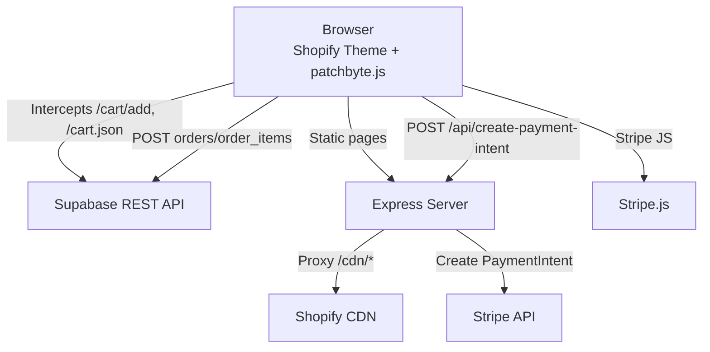
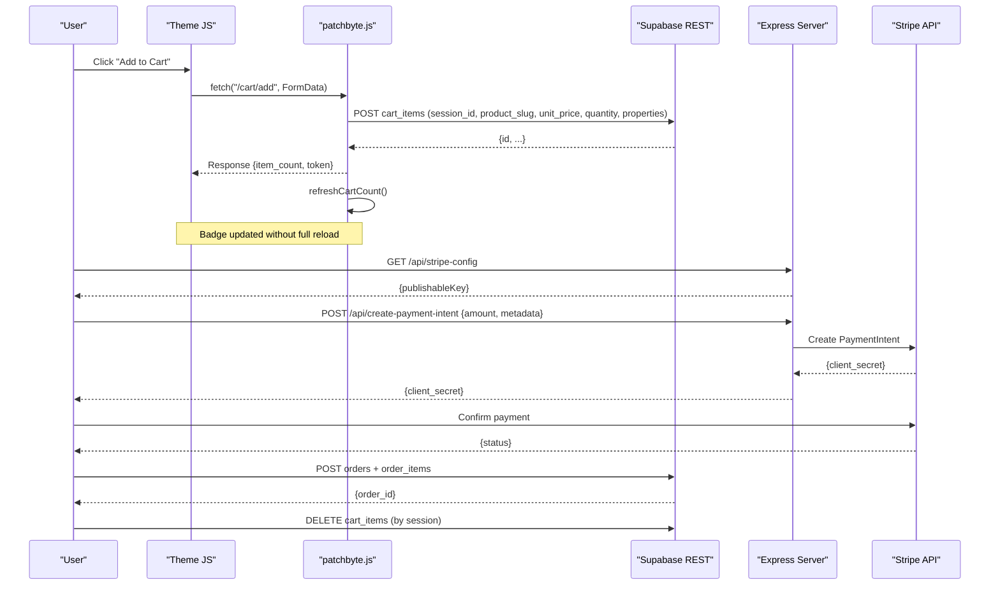
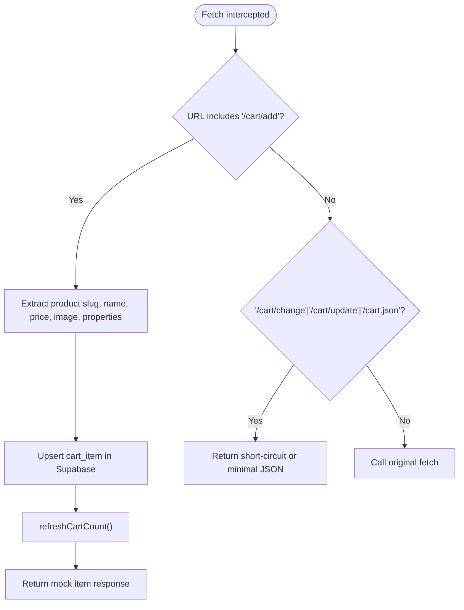
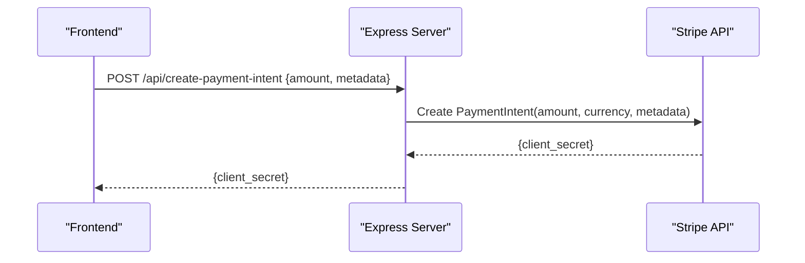
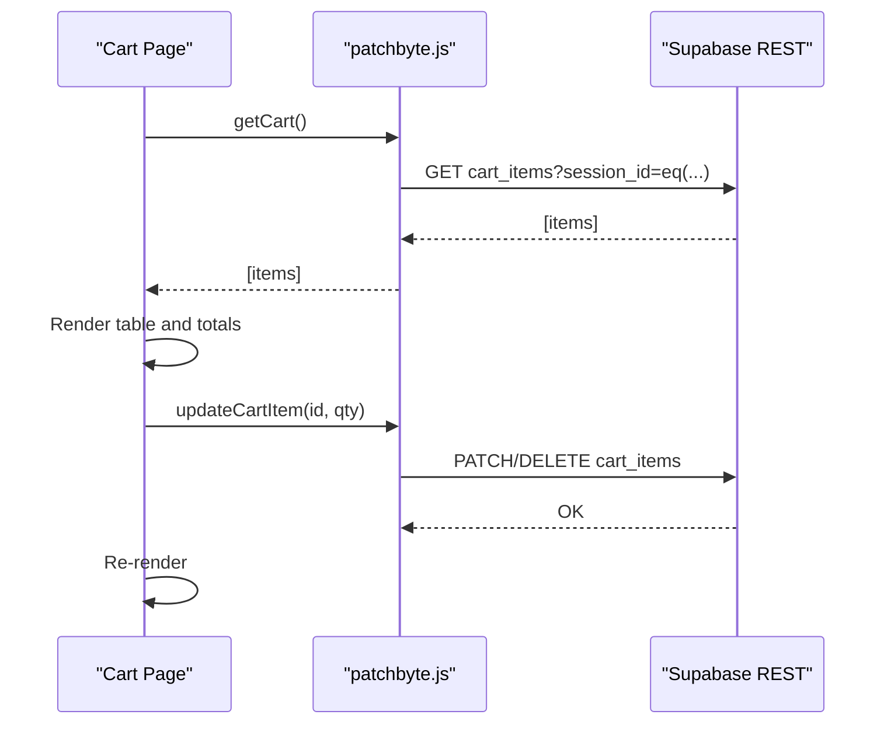
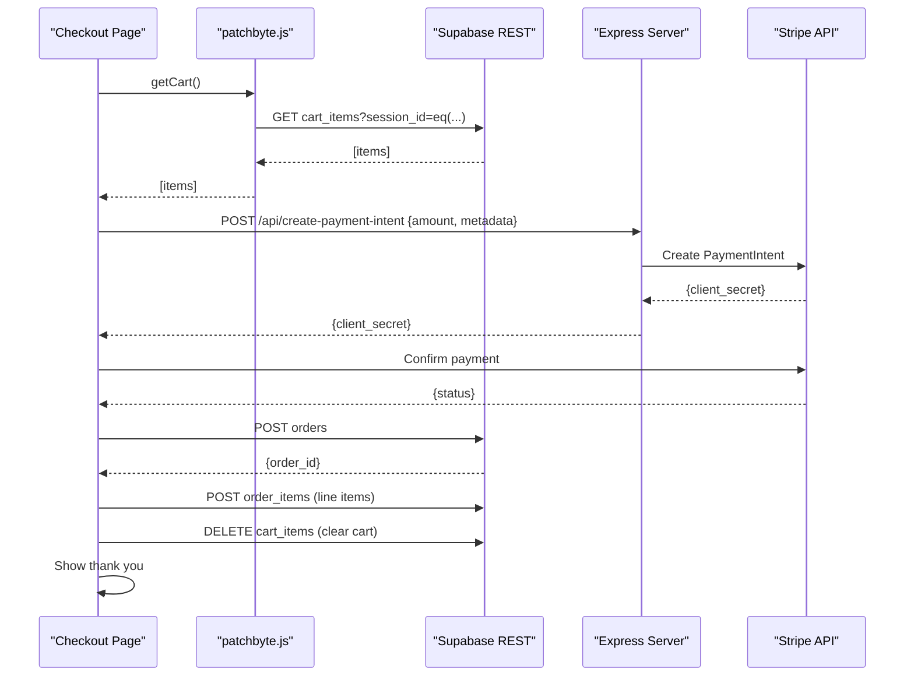
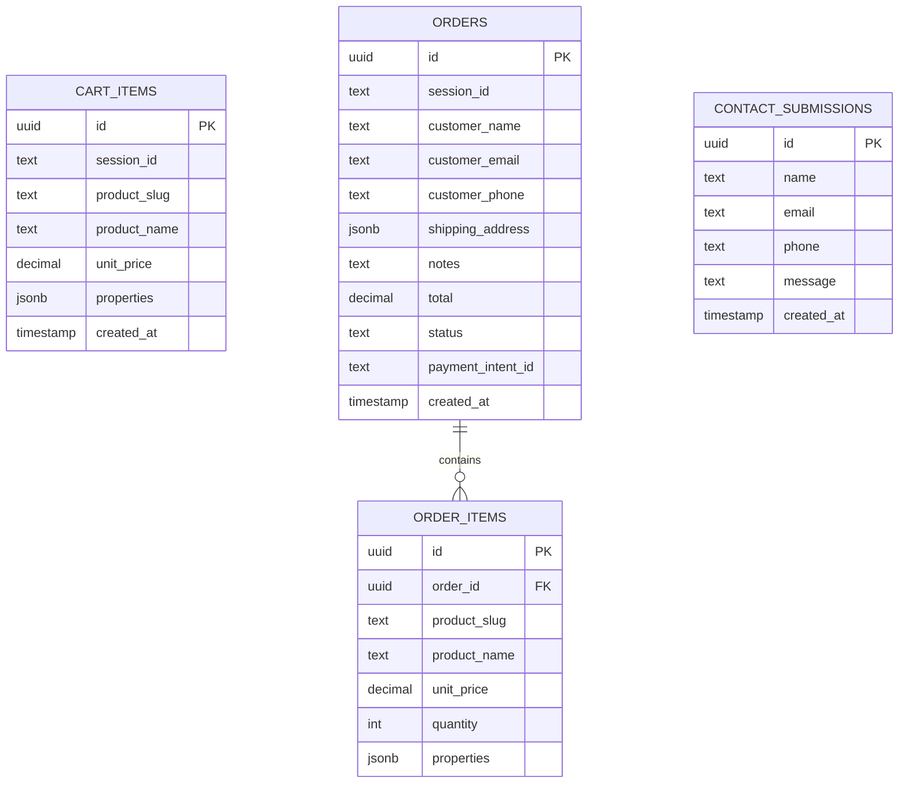
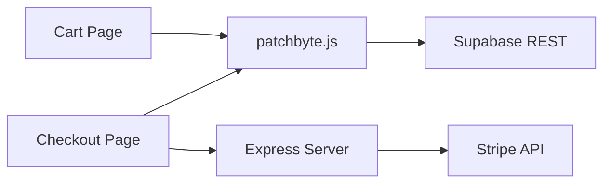

# Component Interactions

<cite>
**Referenced Files in This Document**
- [patchbyte.js](file://frontend/js/patchbyte.js)
- [server.js](file://frontend/server.js)
- [index.html (Cart)](file://frontend/patchkraze.com/cart/index.html)
- [index.html (Checkout)](file://frontend/patchkraze.com/checkout/index.html)
- [migrate-tables.sql](file://migrate-tables.sql)
</cite>

## Table of Contents
1. Introduction
2. Project Structure
3. Core Components
4. Architecture Overview
5. Detailed Component Analysis
6. Dependency Analysis
7. Performance Considerations
8. Troubleshooting Guide
9. Conclusion

## Introduction
This document explains how the Patch-Byte system integrates a Shopify storefront with a custom backend to manage cart state, checkout, and payments. The core idea is to intercept Shopify’s native fetch calls on the client side, route them to a Supabase-backed REST API, and coordinate with an Express server for payment processing via Stripe. Real-time updates are achieved by refreshing UI state after each mutation, while caching strategies minimize redundant network calls.

## Project Structure
The system consists of:
- A browser-side interception layer that overrides fetch to route cart operations to Supabase.
- An Express server that serves static pages, proxies CDN assets, and exposes payment endpoints.
- Frontend pages for Cart and Checkout that consume the interception layer and Stripe.
- A Supabase database schema defining cart items, orders, order items, and contact submissions.

**Diagram sources**
- [patchbyte.js:140-163](file://frontend/js/patchbyte.js#L140-L163)
- [server.js:17-44](file://frontend/server.js#L17-L44)
- [server.js:46-65](file://frontend/server.js#L46-L65)
- [index.html (Checkout):200-212](file://frontend/patchkraze.com/checkout/index.html#L200-L212)

**Section sources**
- [patchbyte.js:1-345](file://frontend/js/patchbyte.js#L1-L345)
- [server.js:1-123](file://frontend/server.js#L1-L123)
- [index.html (Cart):1-186](file://frontend/patchkraze.com/cart/index.html#L1-L186)
- [index.html (Checkout):1-358](file://frontend/patchkraze.com/checkout/index.html#L1-L358)
- [migrate-tables.sql:1-57](file://migrate-tables.sql#L1-L57)

## Core Components
- Client interception layer (patchbyte.js): Overrides fetch to intercept Shopify-style cart endpoints and persist cart data to Supabase. It also provides utilities for reading/writing cart and contact submissions, and refreshes UI badges.
- Express server (server.js): Serves static site content, proxies Shopify CDN assets, and exposes Stripe-related endpoints (/api/create-payment-intent, /api/stripe-config).
- Frontend pages:
  - Cart page: Loads cart from Supabase via the interception layer and allows quantity changes or removal.
  - Checkout page: Collects customer info, initializes Stripe Elements, creates a PaymentIntent via the server, confirms payment, then persists order and order items to Supabase and clears the cart.
- Database schema (migrate-tables.sql): Defines tables and Row Level Security policies for cart_items, orders, order_items, and contact_submissions.

**Section sources**
- [patchbyte.js:19-111](file://frontend/js/patchbyte.js#L19-L111)
- [server.js:17-44](file://frontend/server.js#L17-L44)
- [index.html (Cart):95-182](file://frontend/patchkraze.com/cart/index.html#L95-L182)
- [index.html (Checkout):161-354](file://frontend/patchkraze.com/checkout/index.html#L161-L354)
- [migrate-tables.sql:5-56](file://migrate-tables.sql#L5-L56)

## Architecture Overview
The architecture follows an event-driven pattern at the UI level and request/response patterns for persistence and payments:
- Add-to-cart flow: The theme triggers a fetch to /cart/add; patchbyte.js intercepts it, extracts product details, and writes to Supabase. The UI badge updates immediately.
- Cart view flow: The Cart page reads cart items from Supabase through the interception layer and renders them.
- Checkout flow: The Checkout page loads cart items, initializes Stripe, requests a PaymentIntent from the server, confirms payment, and persists order data to Supabase.

**Diagram sources**
- [patchbyte.js:140-163](file://frontend/js/patchbyte.js#L140-L163)
- [patchbyte.js:74-96](file://frontend/js/patchbyte.js#L74-L96)
- [patchbyte.js:115-136](file://frontend/js/patchbyte.js#L115-L136)
- [server.js:17-44](file://frontend/server.js#L17-L44)
- [index.html (Checkout):200-212](file://frontend/patchkraze.com/checkout/index.html#L200-L212)
- [index.html (Checkout):309-337](file://frontend/patchkraze.com/checkout/index.html#L309-L337)

## Detailed Component Analysis

### Client-Side Fetch Interception (patchbyte.js)
- Session management: Uses localStorage to maintain a per-browser session ID for cart isolation.
- Supabase helpers: Provides sbGet/sbPost/sbPatch/sbDelete wrappers around Supabase REST with proper headers.
- Cart CRUD:
  - getCart: Retrieves items for the current session.
  - addToCart: Upserts item by checking existing entries and either incrementing quantity or creating a new row.
  - updateCartItem: Updates or deletes based on quantity.
  - clearCart: Deletes all items for the session.
- Fetch override:
  - Intercepts /cart/add to persist to Supabase and return a minimal mock response expected by the theme.
  - Short-circuits /cart/change and /cart/update to avoid unnecessary calls.
  - Intercepts /cart.json to return a minimal structure including token and item_count.
- UI updates:
  - refreshCartCount recalculates total quantity and updates Shopify-style cart bubble elements and generic data attributes.
  - showCartToast provides immediate user feedback after adding an item.
  - wireCartIcon redirects cart icon clicks to /cart.

**Diagram sources**
- [patchbyte.js:140-163](file://frontend/js/patchbyte.js#L140-L163)
- [patchbyte.js:74-96](file://frontend/js/patchbyte.js#L74-L96)
- [patchbyte.js:115-136](file://frontend/js/patchbyte.js#L115-L136)

**Section sources**
- [patchbyte.js:19-111](file://frontend/js/patchbyte.js#L19-L111)
- [patchbyte.js:138-233](file://frontend/js/patchbyte.js#L138-L233)
- [patchbyte.js:235-328](file://frontend/js/patchbyte.js#L235-L328)

### Express Server (server.js)
- Static serving: Serves the static site under patchkraze.com and root frontend assets.
- CDN proxy: Proxies /cdn/* paths to Shopify CDN with appropriate cache headers.
- Payment endpoints:
  - /api/create-payment-intent: Validates amount, creates a Stripe PaymentIntent with automatic payment methods and metadata, returns clientSecret.
  - /api/stripe-config: Returns publishable key to the frontend.
- Redirects: Handles permanent and temporary redirects for moved or missing pages.

**Diagram sources**
- [server.js:17-44](file://frontend/server.js#L17-L44)

**Section sources**
- [server.js:1-123](file://frontend/server.js#L1-L123)

### Cart Page (index.html)
- Loads cart items using window.PatchByte.getCart().
- Renders items with images, properties, quantities, and totals.
- Allows increment/decrement and removal, calling window.PatchByte.updateCartItem and re-rendering.

**Diagram sources**
- [index.html (Cart):95-182](file://frontend/patchkraze.com/cart/index.html#L95-L182)
- [patchbyte.js:69-111](file://frontend/js/patchbyte.js#L69-L111)

**Section sources**
- [index.html (Cart):95-182](file://frontend/patchkraze.com/cart/index.html#L95-L182)
- [patchbyte.js:69-111](file://frontend/js/patchbyte.js#L69-L111)

### Checkout Page (index.html)
- Initializes Stripe by fetching publishable key from /api/stripe-config.
- Creates a PaymentIntent via /api/create-payment-intent with total cents and session metadata.
- Mounts Stripe Elements and confirms payment.
- On success, posts orders and order_items to Supabase, clears the cart, and shows a thank-you screen.

**Diagram sources**
- [index.html (Checkout):161-354](file://frontend/patchkraze.com/checkout/index.html#L161-L354)
- [server.js:17-44](file://frontend/server.js#L17-L44)
- [patchbyte.js:69-111](file://frontend/js/patchbyte.js#L69-L111)

**Section sources**
- [index.html (Checkout):161-354](file://frontend/patchkraze.com/checkout/index.html#L161-L354)

### Database Schema and Policies (migrate-tables.sql)
- Adds fields to cart_items, orders, order_items, and contact_submissions for product details, pricing, and customer information.
- Enables Row Level Security with permissive policies allowing anonymous access for these tables.

**Diagram sources**
- [migrate-tables.sql:5-56](file://migrate-tables.sql#L5-L56)

**Section sources**
- [migrate-tables.sql:5-56](file://migrate-tables.sql#L5-L56)

## Dependency Analysis
- patchbyte.js depends on:
  - Supabase REST API for cart and order persistence.
  - DOM APIs to update UI elements and intercept events.
- server.js depends on:
  - Stripe SDK for payment intent creation.
  - Filesystem for static asset serving and redirect logic.
- Frontend pages depend on:
  - patchbyte.js for cart operations and Supabase interactions.
  - Stripe.js for secure payment handling.

**Diagram sources**
- [patchbyte.js:140-163](file://frontend/js/patchbyte.js#L140-L163)
- [server.js:17-44](file://frontend/server.js#L17-L44)
- [index.html (Cart):95-182](file://frontend/patchkraze.com/cart/index.html#L95-L182)
- [index.html (Checkout):161-354](file://frontend/patchkraze.com/checkout/index.html#L161-L354)

**Section sources**
- [patchbyte.js:140-163](file://frontend/js/patchbyte.js#L140-L163)
- [server.js:17-44](file://frontend/server.js#L17-L44)
- [index.html (Cart):95-182](file://frontend/patchkraze.com/cart/index.html#L95-L182)
- [index.html (Checkout):161-354](file://frontend/patchkraze.com/checkout/index.html#L161-L354)

## Performance Considerations
- Minimal network calls:
  - Fetch interception avoids unnecessary calls to /cart/change and /cart/update by returning early responses.
  - /cart.json returns a lightweight payload with token and item_count to satisfy theme expectations without loading full cart data.
- Localized state:
  - Session-based cart isolation reduces cross-user interference and simplifies queries.
- UI responsiveness:
  - Immediate badge updates and toast notifications improve perceived performance.
- CDN proxy caching:
  - Proxying /cdn/* sets Cache-Control headers to reduce repeated downloads of theme assets.
- Error resilience:
  - Graceful fallbacks when Stripe is not configured or unavailable prevent blocking the UI.

[No sources needed since this section provides general guidance]

## Troubleshooting Guide
Common issues and resolutions:
- Add-to-cart fails:
  - Ensure patchbyte.js is loaded before theme scripts and that fetch is overridden.
  - Verify Supabase credentials and RLS policies allow inserts.
  - Check console for errors returned by Supabase or malformed product data extraction.
- Cart badge not updating:
  - Confirm refreshCartCount runs after mutations and that selectors for .cart-bubble__text-count exist.
- Checkout cannot initialize Stripe:
  - Verify /api/stripe-config returns a valid publishable key and that Stripe.js script is loaded.
  - If create-payment-intent fails, check server logs and environment variables for Stripe keys.
- Order not persisted:
  - After successful payment confirmation, ensure orders and order_items are posted to Supabase and cart cleared.
  - Validate RLS policies and required fields in orders/order_items.

**Section sources**
- [patchbyte.js:165-233](file://frontend/js/patchbyte.js#L165-L233)
- [patchbyte.js:115-136](file://frontend/js/patchbyte.js#L115-L136)
- [server.js:17-44](file://frontend/server.js#L17-L44)
- [index.html (Checkout):200-212](file://frontend/patchkraze.com/checkout/index.html#L200-L212)
- [index.html (Checkout):309-337](file://frontend/patchkraze.com/checkout/index.html#L309-L337)
- [migrate-tables.sql:36-56](file://migrate-tables.sql#L36-L56)

## Conclusion
The Patch-Byte system effectively decouples cart and checkout logic from Shopify by intercepting fetch calls and routing them to a Supabase-backed backend. The Express server centralizes payment processing with Stripe, while the frontend pages provide a seamless user experience with immediate feedback and robust error handling. This design enables flexible customization, improved performance, and reliable order processing across components.

[No sources needed since this section summarizes without analyzing specific files]