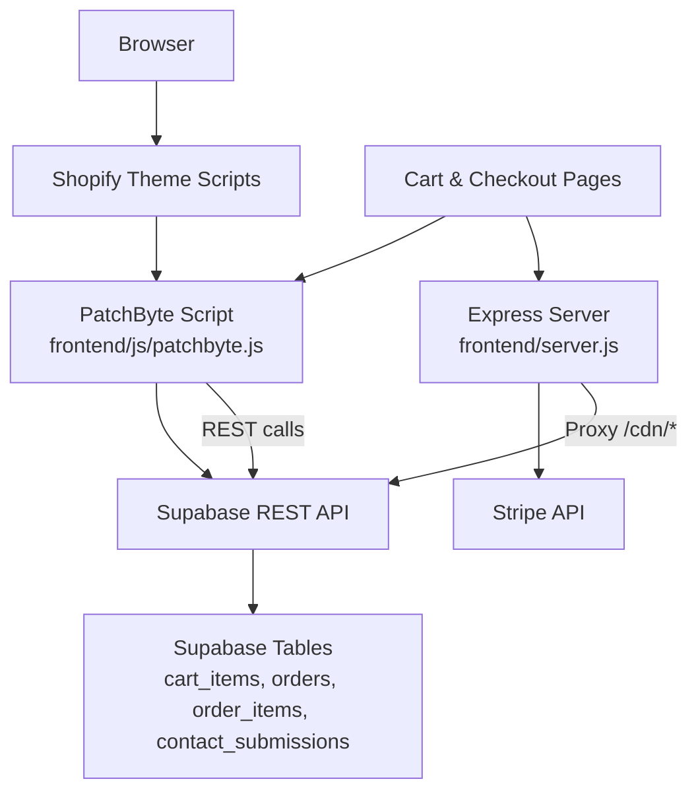
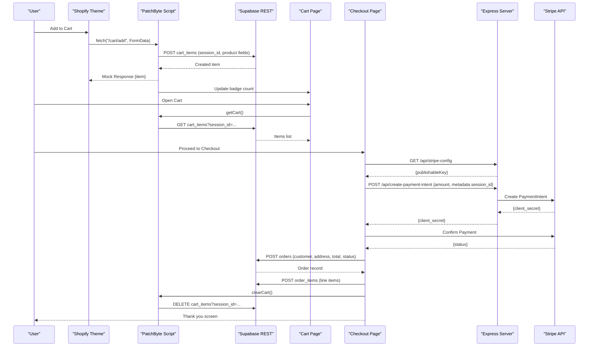
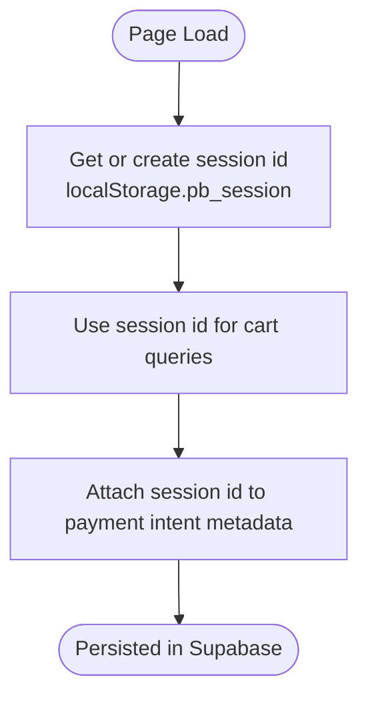
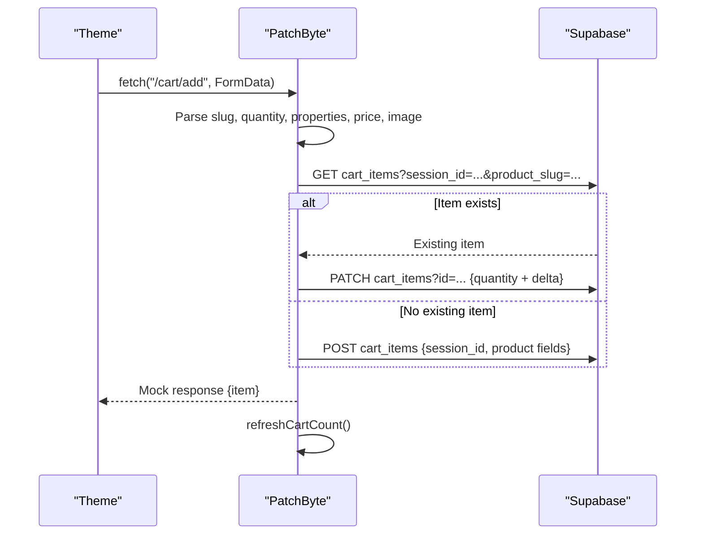
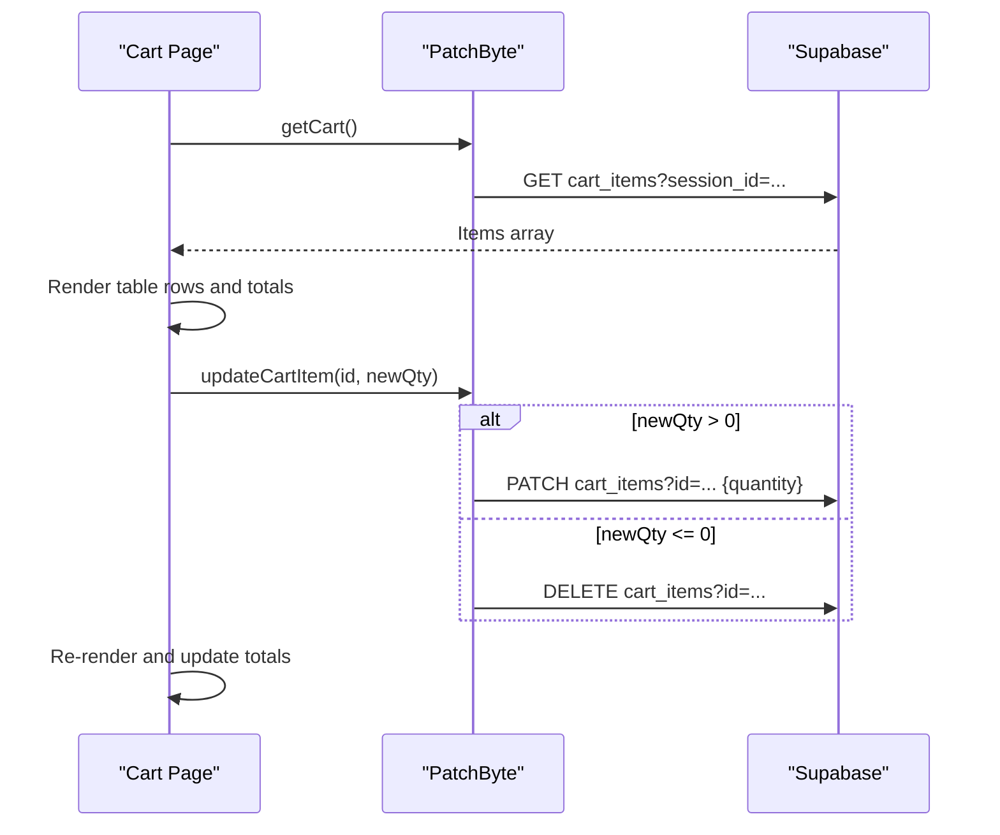
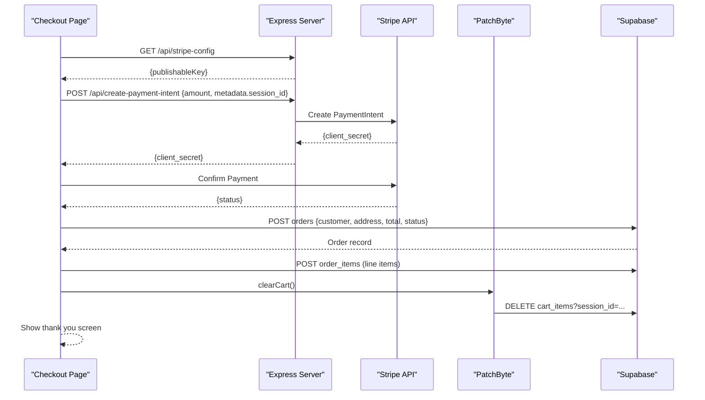
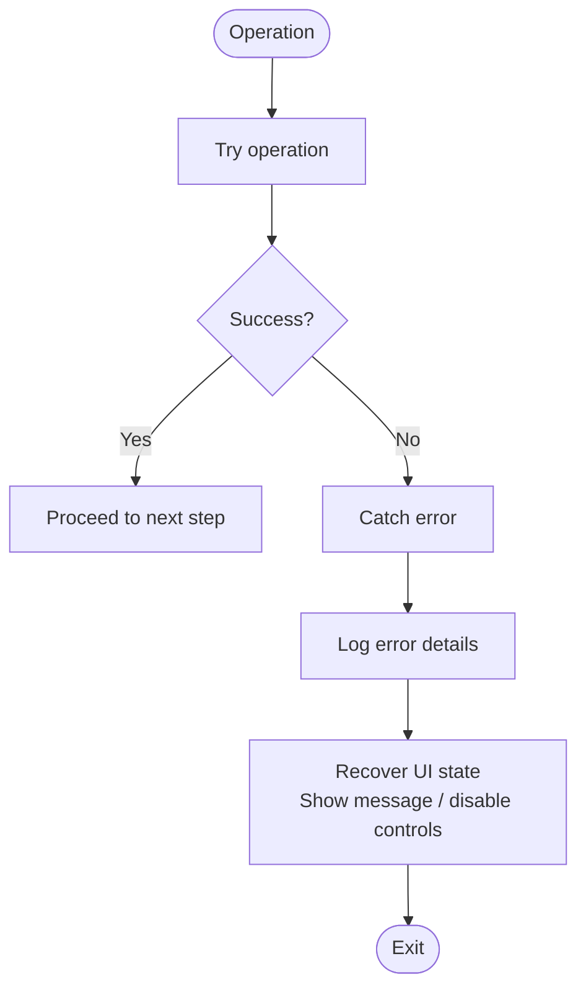
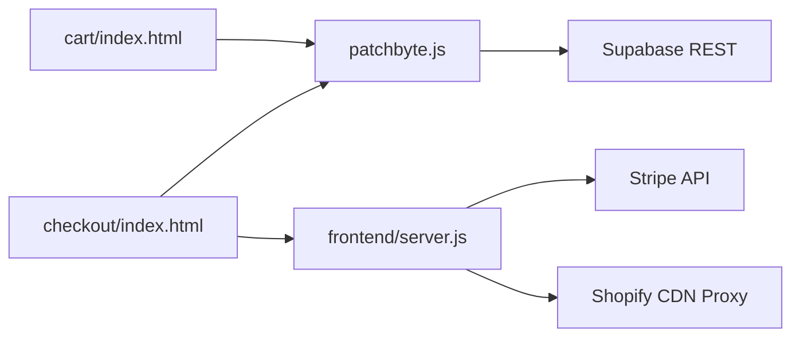

# Data Flow Patterns

<cite>
**Referenced Files in This Document**
- [patchbyte.js](file://frontend/js/patchbyte.js)
- [cart/index.html](file://frontend/patchkraze.com/cart/index.html)
- [checkout/index.html](file://frontend/patchkraze.com/checkout/index.html)
- [server.js](file://frontend/server.js)
- [index.js](file://api/index.js)
- [migrate-tables.sql](file://migrate-tables.sql)
</cite>

## Table of Contents
1. [Introduction](#introduction)
2. [Project Structure](#project-structure)
3. [Core Components](#core-components)
4. [Architecture Overview](#architecture-overview)
5. [Detailed Component Analysis](#detailed-component-analysis)
6. [Dependency Analysis](#dependency-analysis)
7. [Performance Considerations](#performance-considerations)
8. [Troubleshooting Guide](#troubleshooting-guide)
9. [Conclusion](#conclusion)

## Introduction
This document explains the end-to-end data flow patterns in the Patch-Byte system, tracing a customer’s journey from browsing products to completing checkout. It covers how product and cart data are captured, transformed, and persisted across client-side storage (localStorage), Supabase tables, and external services (Stripe). It also documents synchronous and asynchronous operations, error propagation and recovery strategies, and data consistency patterns used to maintain reliable state across components.

## Project Structure
The system is composed of:
- A browser-based integration layer that intercepts Shopify-style requests and routes them to Supabase for persistence.
- Static pages for Cart and Checkout that render UI and orchestrate user interactions.
- A lightweight server that serves static content, proxies CDN assets, and handles payment intent creation via Stripe.
- Database schema migrations defining tables for cart items, orders, order items, and contact submissions with row-level security policies.

**Diagram sources**
- [patchbyte.js:10-17](file://frontend/js/patchbyte.js#L10-L17)
- [patchbyte.js:140-163](file://frontend/js/patchbyte.js#L140-L163)
- [server.js:46-65](file://frontend/server.js#L46-L65)
- [server.js:17-44](file://frontend/server.js#L17-L44)
- [migrate-tables.sql:5-56](file://migrate-tables.sql#L5-L56)

**Section sources**
- [patchbyte.js:1-17](file://frontend/js/patchbyte.js#L1-L17)
- [server.js:1-16](file://frontend/server.js#L1-L16)
- [migrate-tables.sql:1-11](file://migrate-tables.sql#L1-L11)

## Core Components
- PatchByte script: Intercepts fetch calls, manages session identity, performs CRUD on cart items, updates UI badges, and exposes utilities to pages.
- Cart page: Loads cart items from Supabase, renders table rows, handles quantity changes, and computes totals.
- Checkout page: Validates form inputs, initializes Stripe Elements, creates a PaymentIntent via server, confirms payment, persists order and order items to Supabase, clears cart, and shows confirmation.
- Express server: Serves static files, proxies CDN assets, and provides endpoints for Stripe configuration and payment intent creation.
- Database schema: Defines tables and RLS policies enabling anonymous inserts/reads for cart and orders.

**Section sources**
- [patchbyte.js:19-111](file://frontend/js/patchbyte.js#L19-L111)
- [cart/index.html:95-182](file://frontend/patchkraze.com/cart/index.html#L95-L182)
- [checkout/index.html:161-354](file://frontend/patchkraze.com/checkout/index.html#L161-L354)
- [server.js:46-111](file://frontend/server.js#L46-L111)
- [migrate-tables.sql:5-56](file://migrate-tables.sql#L5-L56)

## Architecture Overview
The architecture uses a hybrid approach:
- Client-side interception adapts Shopify theme behavior to persist cart state in Supabase using a per-session identifier stored in localStorage.
- The server acts as a secure boundary for payment processing by creating Stripe PaymentIntents and exposing only necessary configuration to the frontend.
- Static pages provide rich UX while delegating data persistence and payment orchestration to backend services.

**Diagram sources**
- [patchbyte.js:140-233](file://frontend/js/patchbyte.js#L140-L233)
- [patchbyte.js:69-111](file://frontend/js/patchbyte.js#L69-L111)
- [cart/index.html:139-182](file://frontend/patchkraze.com/cart/index.html#L139-L182)
- [checkout/index.html:191-354](file://frontend/patchkraze.com/checkout/index.html#L191-L354)
- [server.js:17-44](file://frontend/server.js#L17-L44)

## Detailed Component Analysis

### Session Management and Persistence
- A unique session ID is generated or retrieved from localStorage and attached to all cart operations to isolate items per browser session.
- The session ID is passed into Stripe metadata during payment intent creation to correlate payments with sessions.

**Diagram sources**
- [patchbyte.js:21-29](file://frontend/js/patchbyte.js#L21-L29)
- [checkout/index.html:200-212](file://frontend/patchkraze.com/checkout/index.html#L200-L212)

**Section sources**
- [patchbyte.js:21-29](file://frontend/js/patchbyte.js#L21-L29)
- [checkout/index.html:200-212](file://frontend/patchkraze.com/checkout/index.html#L200-L212)

### Product Browsing to Cart Addition
- When a user adds an item, the script intercepts the Shopify-style add-to-cart request, extracts product details from the DOM (title, price, image), and stores them in Supabase under the current session.
- If the same product slug already exists in the cart for the session, the quantity is incremented; otherwise, a new cart item is created.
- The UI badge is updated asynchronously after each change.

**Diagram sources**
- [patchbyte.js:140-233](file://frontend/js/patchbyte.js#L140-L233)
- [patchbyte.js:69-96](file://frontend/js/patchbyte.js#L69-L96)

**Section sources**
- [patchbyte.js:140-233](file://frontend/js/patchbyte.js#L140-L233)
- [patchbyte.js:69-96](file://frontend/js/patchbyte.js#L69-L96)

### Cart Page Data Flow
- On load, the cart page retrieves items via PatchByte’s getCart, which queries Supabase filtered by session_id.
- The page renders items with images, properties, quantities, and line totals, and recalculates the overall total.
- Quantity increments/decrements trigger updateCartItem, which patches or deletes items accordingly and re-renders.

**Diagram sources**
- [cart/index.html:139-182](file://frontend/patchkraze.com/cart/index.html#L139-L182)
- [patchbyte.js:69-111](file://frontend/js/patchbyte.js#L69-L111)

**Section sources**
- [cart/index.html:139-182](file://frontend/patchkraze.com/cart/index.html#L139-L182)
- [patchbyte.js:69-111](file://frontend/js/patchbyte.js#L69-L111)

### Checkout and Payment Processing
- The checkout page validates required fields, initializes Stripe Elements using a publishable key fetched from the server, and creates a PaymentIntent with the computed total and session metadata.
- After confirming payment through Stripe, it persists the order and order items to Supabase, then clears the cart and displays a thank-you screen.

**Diagram sources**
- [checkout/index.html:191-354](file://frontend/patchkraze.com/checkout/index.html#L191-L354)
- [server.js:17-44](file://frontend/server.js#L17-L44)
- [patchbyte.js:107-111](file://frontend/js/patchbyte.js#L107-L111)

**Section sources**
- [checkout/index.html:191-354](file://frontend/patchkraze.com/checkout/index.html#L191-L354)
- [server.js:17-44](file://frontend/server.js#L17-L44)
- [patchbyte.js:107-111](file://frontend/js/patchbyte.js#L107-L111)

### Data Transformation Processes
- From product page to cart:
  - Extracts product slug from URL path.
  - Parses quantity from FormData.
  - Captures properties from FormData keys prefixed with “properties[”.
  - Derives unit price from live element or fallback meta tag.
  - Captures product image from media elements or Open Graph meta, normalizing malformed URLs.
- From cart to order:
  - Computes totals by summing unit_price × quantity.
  - Converts dollars to cents for Stripe amount.
  - Maps cart items to order_items with consistent fields.
- From server to Stripe:
  - Ensures amount is a positive integer in cents.
  - Attaches metadata including session_id for traceability.

**Section sources**
- [patchbyte.js:165-216](file://frontend/js/patchbyte.js#L165-L216)
- [checkout/index.html:225-226](file://frontend/patchkraze.com/checkout/index.html#L225-L226)
- [server.js:17-39](file://frontend/server.js#L17-L39)

### State Management Approach
- Client-side persistence:
  - Session identity stored in localStorage to associate cart items and payment metadata.
  - UI state managed locally within pages (loading, empty states, totals).
- Server-side storage:
  - Supabase tables store cart items, orders, order items, and contact submissions.
  - Row-level security policies allow anonymous access for these tables to support unauthenticated flows.

**Section sources**
- [patchbyte.js:21-29](file://frontend/js/patchbyte.js#L21-L29)
- [migrate-tables.sql:36-56](file://migrate-tables.sql#L36-L56)

### Error Propagation and Recovery
- Cart add errors:
  - Caught and logged; returns a mock error response to keep theme flow consistent.
- Contact form submission:
  - Disables submit button during send; restores state on failure; shows alert on error.
- Checkout errors:
  - Displays inline error messages; disables submit button until resolved; logs detailed errors.
- Stripe initialization:
  - Gracefully handles missing configuration; disables payment controls if unavailable.

**Diagram sources**
- [patchbyte.js:227-233](file://frontend/js/patchbyte.js#L227-L233)
- [patchbyte.js:251-261](file://frontend/js/patchbyte.js#L251-L261)
- [checkout/index.html:274-350](file://frontend/patchkraze.com/checkout/index.html#L274-L350)

**Section sources**
- [patchbyte.js:227-233](file://frontend/js/patchbyte.js#L227-L233)
- [patchbyte.js:251-261](file://frontend/js/patchbyte.js#L251-L261)
- [checkout/index.html:274-350](file://frontend/patchkraze.com/checkout/index.html#L274-L350)

### Data Consistency and Conflict Resolution
- Duplicate cart items:
  - Before adding, checks for existing item by session_id and product_slug; increments quantity instead of creating duplicates.
- Idempotency considerations:
  - Quantity updates use PATCH with explicit id match to avoid race conditions.
- Order integrity:
  - Orders and order items are created after successful payment confirmation; cart is cleared post-success to prevent double-processing.

**Section sources**
- [patchbyte.js:74-96](file://frontend/js/patchbyte.js#L74-L96)
- [checkout/index.html:309-338](file://frontend/patchkraze.com/checkout/index.html#L309-L338)

## Dependency Analysis
- Frontend dependencies:
  - PatchByte script depends on window.fetch being available and Supabase REST endpoint reachable.
  - Checkout page depends on Stripe SDK availability and server-provided configuration.
- Server dependencies:
  - Express serves static content and proxies CDN assets.
  - Stripe integration requires environment variables for secret and publishable keys.

**Diagram sources**
- [patchbyte.js:33-65](file://frontend/js/patchbyte.js#L33-L65)
- [server.js:46-65](file://frontend/server.js#L46-L65)
- [server.js:17-44](file://frontend/server.js#L17-L44)

**Section sources**
- [patchbyte.js:33-65](file://frontend/js/patchbyte.js#L33-L65)
- [server.js:46-65](file://frontend/server.js#L46-L65)
- [server.js:17-44](file://frontend/server.js#L17-L44)

## Performance Considerations
- Minimize network calls:
  - Batch UI updates after cart changes to reduce reflows.
  - Cache session ID in memory after first retrieval.
- Optimize image loading:
  - Use lazy loading attributes for product images in cart.
- Avoid blocking the main thread:
  - Defer heavy computations (e.g., totals) until needed.
- CDN proxy caching:
  - Set cache headers when proxying Shopify assets to improve performance.

[No sources needed since this section provides general guidance]

## Troubleshooting Guide
- Cart not updating:
  - Verify session ID exists in localStorage and matches Supabase records.
  - Check network tab for failed Supabase requests and inspect error responses.
- Checkout fails to initialize:
  - Ensure Stripe publishable key is returned by /api/stripe-config.
  - Confirm Stripe SDK loaded before initializing Elements.
- Payment succeeds but order not saved:
  - Inspect console for errors after confirmPayment.
  - Validate Supabase RLS policies allow inserts for orders and order_items.
- CDN assets not loading:
  - Confirm server proxy rules for /cdn/* paths and upstream Shopify CDN availability.

**Section sources**
- [patchbyte.js:21-29](file://frontend/js/patchbyte.js#L21-L29)
- [checkout/index.html:191-257](file://frontend/patchkraze.com/checkout/index.html#L191-L257)
- [server.js:46-65](file://frontend/server.js#L46-L65)
- [migrate-tables.sql:36-56](file://migrate-tables.sql#L36-L56)

## Conclusion
Patch-Byte integrates seamlessly with a Shopify-themed storefront by intercepting standard cart operations and persisting state in Supabase. The checkout flow leverages a minimal server to securely create Stripe PaymentIntents and finalize orders. Through careful data transformation, robust error handling, and clear separation of concerns, the system maintains data consistency and provides a smooth user experience from browsing to purchase completion.