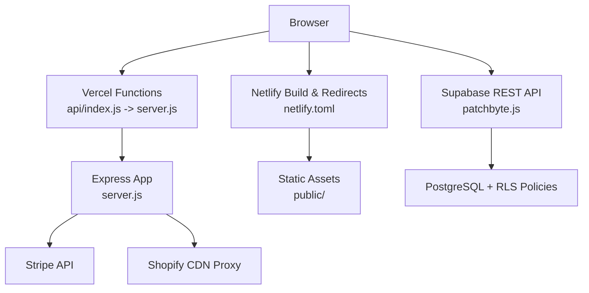
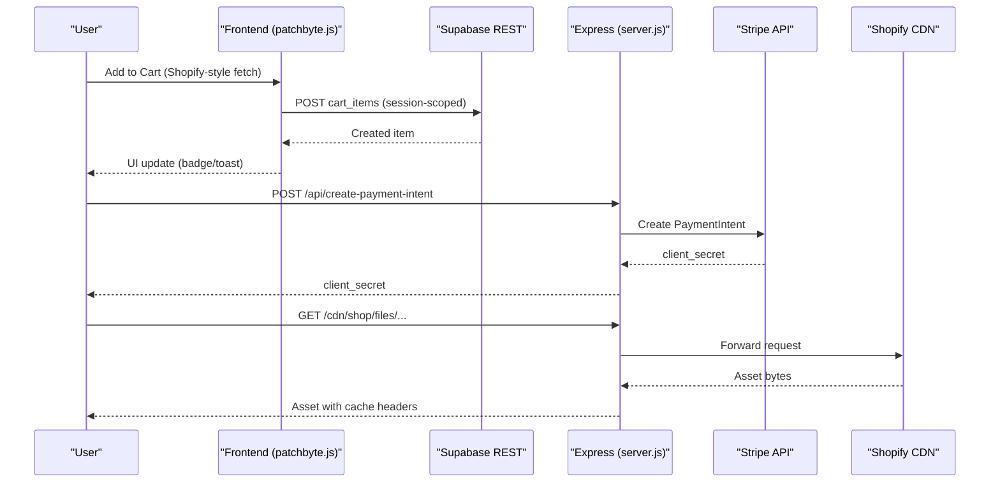
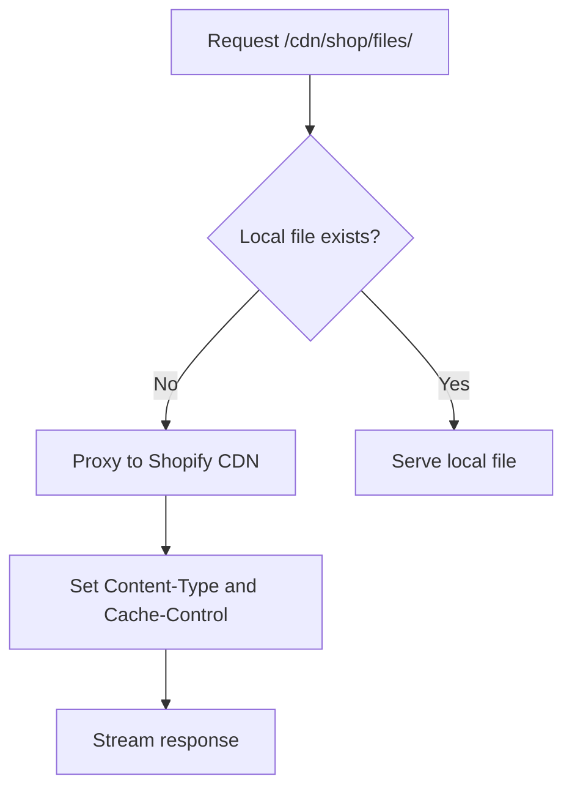
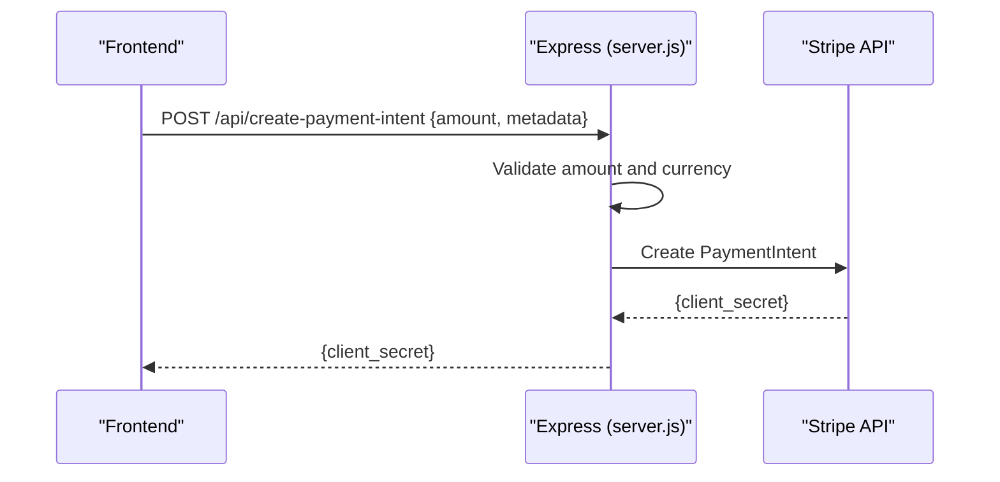
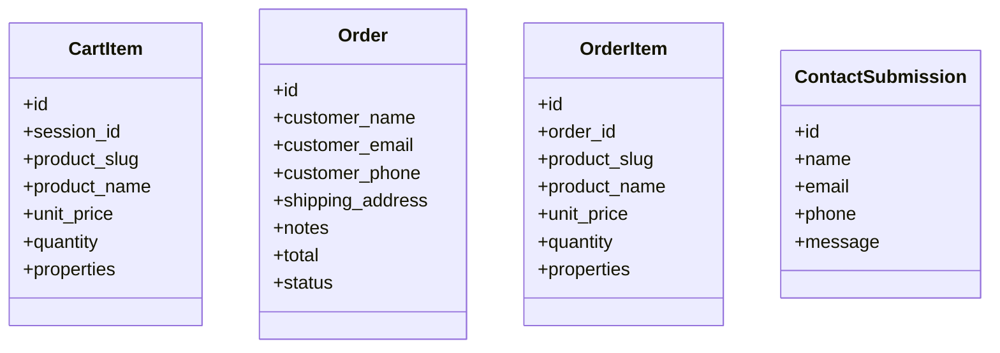
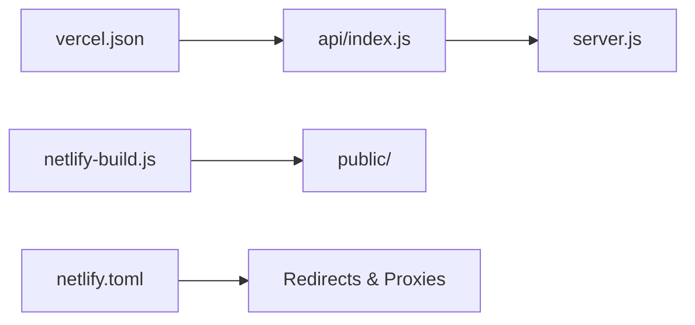
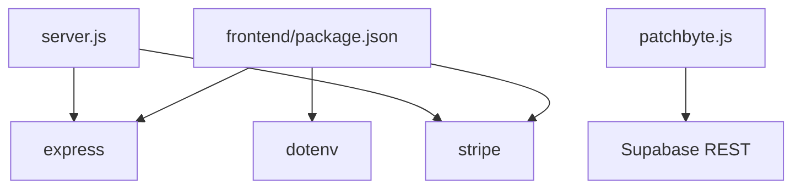

# Integration Architecture

<cite>
**Referenced Files in This Document**
- [server.js](file://frontend/server.js)
- [index.js](file://api/index.js)
- [patchbyte.js](file://frontend/js/patchbyte.js)
- [migrate-tables.sql](file://migrate-tables.sql)
- [netlify.toml](file://netlify.toml)
- [netlify-build.js](file://netlify-build.js)
- [vercel.json](file://vercel.json)
- [package.json](file://frontend/package.json)
</cite>

## Table of Contents
1. Introduction
2. Project Structure
3. Core Components
4. Architecture Overview
5. Detailed Component Analysis
6. Dependency Analysis
7. Performance Considerations
8. Troubleshooting Guide
9. Conclusion

## Introduction
This document describes the integration architecture that connects Patch-Byte with external services: Shopify (CDN assets and theme customization), Stripe (payments and webhooks), Supabase (database, row-level security, and real-time patterns), and deployment platforms Vercel and Netlify. It also covers authentication flows, API key management, rate limiting strategies, monitoring/logging approaches, fallback mechanisms, and service degradation handling.

## Project Structure
Patch-Byte is a static-first storefront served by an Express server for Node-based runtime features (Stripe endpoints, CDN proxying). The frontend includes Shopify theme assets and a client-side integration script that bridges Shopify-style interactions to Supabase. Deployment configurations exist for both Vercel and Netlify.

**Diagram sources**
- [server.js:17-65](file://frontend/server.js#L17-L65)
- [patchbyte.js:33-65](file://frontend/js/patchbyte.js#L33-L65)
- [netlify.toml:135-165](file://netlify.toml#L135-L165)
- [vercel.json:4-11](file://vercel.json#L4-L11)

**Section sources**
- [server.js:1-123](file://frontend/server.js#L1-L123)
- [netlify.toml:1-165](file://netlify.toml#L1-L165)
- [vercel.json:1-12](file://vercel.json#L1-L12)
- [patchbyte.js:1-345](file://frontend/js/patchbyte.js#L1-L345)

## Core Components
- Express server provides:
  - Stripe PaymentIntent creation endpoint and publishable key exposure
  - CDN proxy from /cdn/* to Shopify CDN
  - Clean URL routing and redirects for legacy paths
- Frontend integration script intercepts Shopify-style fetch calls to persist cart and contact submissions into Supabase via REST
- Database schema migrations define tables and enable Row-Level Security policies
- Deployment configs:
  - Vercel routes all requests through api/index.js to the Express app
  - Netlify builds static assets and defines redirects/proxies for CDN and clean URLs

**Section sources**
- [server.js:17-111](file://frontend/server.js#L17-L111)
- [patchbyte.js:67-163](file://frontend/js/patchbyte.js#L67-L163)
- [migrate-tables.sql:5-56](file://migrate-tables.sql#L5-L56)
- [vercel.json:4-11](file://vercel.json#L4-L11)
- [netlify.toml:1-165](file://netlify.toml#L1-L165)

## Architecture Overview
The system combines a static storefront with lightweight serverless functions for payments and asset proxying. Client-side logic integrates with Supabase for cart persistence and contact form submissions. CDN assets are proxied to Shopify’s CDN to avoid cross-origin issues and ensure consistent caching.

**Diagram sources**
- [patchbyte.js:140-163](file://frontend/js/patchbyte.js#L140-L163)
- [patchbyte.js:74-96](file://frontend/js/patchbyte.js#L74-L96)
- [server.js:17-44](file://frontend/server.js#L17-L44)
- [server.js:50-65](file://frontend/server.js#L50-L65)

## Detailed Component Analysis

### Shopify Integration Pattern (CDN Assets and Theme Customization)
- CDN Proxy: The server proxies /cdn/* requests to Shopify CDN, preserving content types and setting cache headers. This ensures theme assets load reliably across environments.
- Theme Assets: The build process copies theme assets and fonts into the published directory so they can be served locally or proxied depending on platform configuration.
- Clean URLs and Redirects: Both server and Netlify handle clean URLs and redirect legacy paths to new locations.

**Diagram sources**
- [server.js:50-65](file://frontend/server.js#L50-L65)
- [netlify.toml:135-165](file://netlify.toml#L135-L165)

**Section sources**
- [server.js:46-65](file://frontend/server.js#L46-L65)
- [netlify-build.js:16-27](file://netlify-build.js#L16-L27)
- [netlify.toml:135-165](file://netlify.toml#L135-L165)

### Stripe Payment Integration (Webhooks and Security)
- PaymentIntent Creation: The server exposes an endpoint to create PaymentIntent with amount validation and metadata support. It returns a client secret to the frontend.
- Publishable Key Exposure: A dedicated endpoint serves the publishable key to the frontend without exposing secrets.
- Webhooks: No webhook handler is present in this repository; implement webhook verification using the Stripe SDK and environment secrets on your hosting platform. Validate signatures and idempotently process events.
- Security Measures:
  - Store STRIPE_SECRET_KEY only in server-side environment variables
  - Validate amounts and currency server-side
  - Use HTTPS and restrict CORS if needed
  - Implement webhook signature verification before processing events

**Diagram sources**
- [server.js:17-44](file://frontend/server.js#L17-L44)

**Section sources**
- [server.js:17-44](file://frontend/server.js#L17-L44)

### Supabase Database Integration (Row-Level Security and Real-Time Patterns)
- Tables and Schema: Migrations add columns for cart items, orders, order items, and contact submissions.
- Row-Level Security: Policies allow anonymous access for read/write operations on these tables. For production, tighten policies to enforce session scoping and role-based access.
- Client Integration: The frontend script uses Supabase REST with an anon key and Authorization header to perform CRUD operations on cart_items and contact_submissions.
- Real-Time Subscriptions: While not implemented here, you can subscribe to changes on cart_items or orders using Supabase Realtime channels to update UI live.

**Diagram sources**
- [migrate-tables.sql:5-34](file://migrate-tables.sql#L5-L34)

**Section sources**
- [migrate-tables.sql:5-56](file://migrate-tables.sql#L5-L56)
- [patchbyte.js:33-65](file://frontend/js/patchbyte.js#L33-L65)

### Deployment Integrations (Vercel and Netlify)
- Vercel:
  - All requests route to api/index.js which requires the Express app
  - Function includes necessary HTML and theme assets
- Netlify:
  - Build script copies theme assets, fonts, and scripts into public/
  - Redirects map clean URLs and legacy paths
  - CDN proxies forward to Shopify CDN for images and assets

**Diagram sources**
- [vercel.json:4-11](file://vercel.json#L4-L11)
- [netlify-build.js:16-27](file://netlify-build.js#L16-L27)
- [netlify.toml:1-165](file://netlify.toml#L1-L165)

**Section sources**
- [vercel.json:1-12](file://vercel.json#L1-L12)
- [netlify-build.js:1-28](file://netlify-build.js#L1-L28)
- [netlify.toml:1-165](file://netlify.toml#L1-L165)

### Authentication Flows and API Key Management
- Supabase:
  - Uses an anon key with REST headers for client-side requests
  - Policies currently allow broad access; tighten per use case
- Stripe:
  - Secret key used server-side only
  - Publishable key exposed via a safe endpoint
- Environment Variables:
  - Load .env in local development
  - Configure secrets in Vercel/Netlify dashboards at deploy time

**Section sources**
- [patchbyte.js:10-17](file://frontend/js/patchbyte.js#L10-L17)
- [server.js:6-12](file://frontend/server.js#L6-L12)
- [server.js:41-44](file://frontend/server.js#L41-L44)

### Rate Limiting Strategies
- CDN Proxy:
  - Set cache headers to reduce repeated upstream requests
- Platform Limits:
  - Use Vercel/Netlify rate limits and edge caching where possible
- Application Level:
  - Add middleware to throttle repeated cart updates or contact submissions
  - Consider IP-based or token-based throttling for sensitive endpoints

[No sources needed since this section provides general guidance]

### Monitoring and Logging Approaches
- Server Logs:
  - Log Stripe errors and request outcomes for observability
- Frontend Errors:
  - Wrap Supabase calls with try/catch and log failures
- External Observability:
  - Integrate error tracking (e.g., Sentry) and metrics collection
  - For webhooks, log event IDs and processing results

**Section sources**
- [server.js:35-37](file://frontend/server.js#L35-L37)
- [patchbyte.js:227-232](file://frontend/js/patchbyte.js#L227-L232)

### Fallback Mechanisms and Service Degradation Handling
- CDN Failures:
  - If Shopify CDN is unreachable, return 404 or serve cached fallback assets
- Supabase Outages:
  - Gracefully degrade cart functionality; store additions in localStorage temporarily and retry when available
- Stripe Errors:
  - Return user-friendly messages and retry with exponential backoff

**Section sources**
- [server.js:60-65](file://frontend/server.js#L60-L65)
- [patchbyte.js:115-121](file://frontend/js/patchbyte.js#L115-L121)

## Dependency Analysis
Patch-Byte depends on Express for serverless functions, Stripe SDK for payments, and Supabase REST for data persistence. Deployment configs tie the application to Vercel and Netlify ecosystems.

**Diagram sources**
- [package.json:9-17](file://frontend/package.json#L9-L17)
- [server.js:1-12](file://frontend/server.js#L1-L12)
- [patchbyte.js:33-65](file://frontend/js/patchbyte.js#L33-L65)

**Section sources**
- [package.json:9-17](file://frontend/package.json#L9-L17)
- [server.js:1-12](file://frontend/server.js#L1-L12)
- [patchbyte.js:33-65](file://frontend/js/patchbyte.js#L33-L65)

## Performance Considerations
- CDN Caching:
  - Ensure proper cache-control headers for assets
- Minimize Requests:
  - Bundle and cache theme assets
- Database Queries:
  - Use selective queries and indexes on frequently accessed fields (e.g., session_id, product_slug)
- Edge Caching:
  - Leverage platform edge caches for static assets and API responses where appropriate

[No sources needed since this section provides general guidance]

## Troubleshooting Guide
- Stripe Endpoint Returns Error:
  - Verify STRIPE_SECRET_KEY is set and valid
  - Check amount formatting and currency
- CDN Proxy Not Serving Assets:
  - Confirm Shopify CDN path mapping and network connectivity
  - Inspect Content-Type and cache headers
- Supabase Writes Fail:
  - Validate anon key and permissions
  - Review RLS policies and table structure
- Netlify/Vercel Build Issues:
  - Ensure build script copies required assets
  - Check environment variables in platform dashboards

**Section sources**
- [server.js:17-44](file://frontend/server.js#L17-L44)
- [server.js:50-65](file://frontend/server.js#L50-L65)
- [patchbyte.js:237-263](file://frontend/js/patchbyte.js#L237-L263)
- [netlify-build.js:16-27](file://netlify-build.js#L16-L27)

## Conclusion
Patch-Byte integrates Shopify, Stripe, and Supabase with a minimal server layer and robust client-side logic. The architecture supports reliable CDN asset delivery, secure payment processing, and persistent shopping experiences via Supabase. Deployment configurations for Vercel and Netlify streamline builds and routing. To enhance resilience, consider tightening Supabase policies, adding webhook handlers, implementing rate limiting, and integrating comprehensive monitoring and fallback strategies.