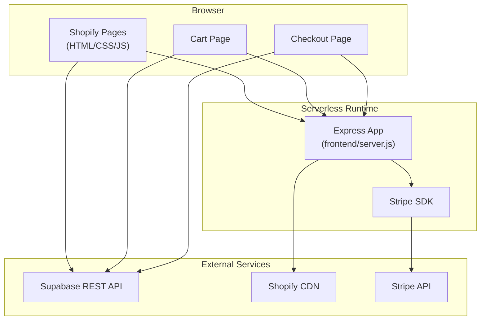
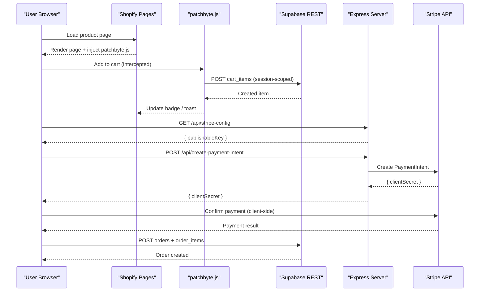
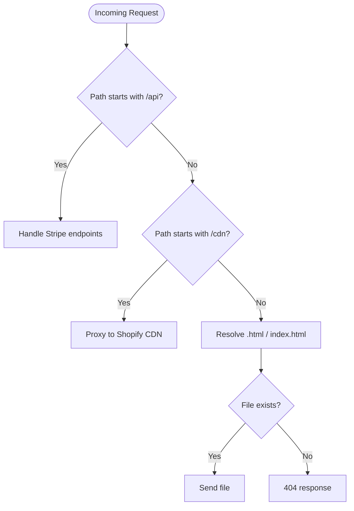
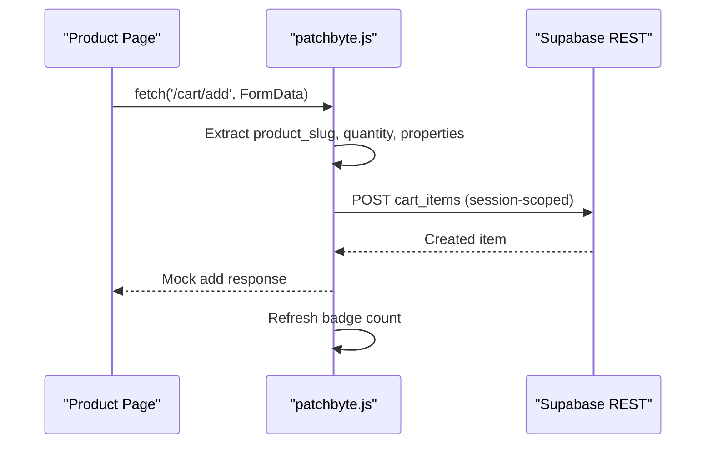
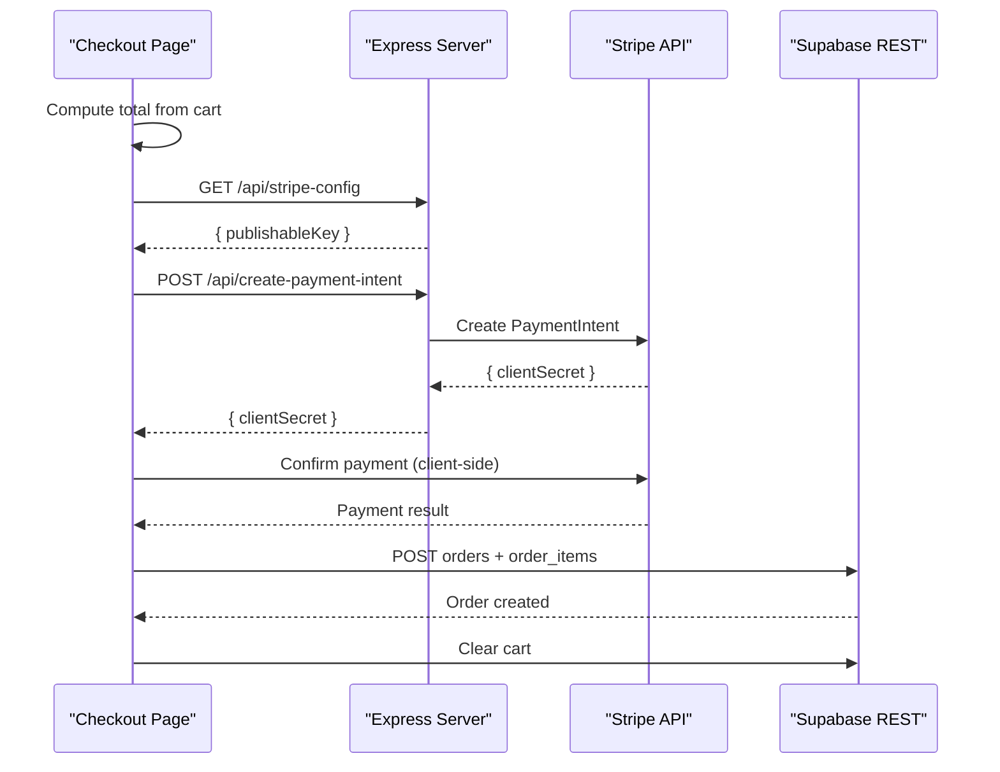
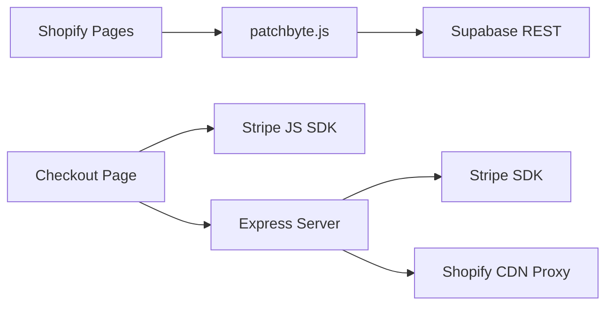

# Overall System Design

<cite>
**Referenced Files in This Document**
- [api/index.js](file://api/index.js)
- [frontend/server.js](file://frontend/server.js)
- [frontend/package.json](file://frontend/package.json)
- [package.json](file://package.json)
- [vercel.json](file://vercel.json)
- [netlify.toml](file://netlify.toml)
- [netlify-build.js](file://netlify-build.js)
- [frontend/js/patchbyte.js](file://frontend/js/patchbyte.js)
- [frontend/patchkraze.com/cart/index.html](file://frontend/patchkraze.com/cart/index.html)
- [frontend/patchkraze.com/checkout/index.html](file://frontend/patchkraze.com/checkout/index.html)
- [migrate-tables.sql](file://migrate-tables.sql)
</cite>

## Table of Contents
1. Introduction
2. Project Structure
3. Core Components
4. Architecture Overview
5. Detailed Component Analysis
6. Dependency Analysis
7. Performance Considerations
8. Troubleshooting Guide
9. Conclusion

## Introduction
This document describes the overall system design of the Patch-Byte e-commerce platform. It explains a hybrid architecture that combines a static Shopify frontend with custom Node.js backend services to deliver cart, checkout, and order persistence via Supabase, and secure payments via Stripe. The system is designed for serverless deployment on Vercel and Netlify, using clean URL routing, CDN proxying, and redirects to integrate seamlessly with Shopify-hosted assets.

## Project Structure
The repository separates concerns into:
- Static site assets under frontend/patchkraze.com (HTML pages, collections, blogs, policies)
- A lightweight Express server that serves static files, proxies Shopify CDN assets, handles payment intents, and routes clean URLs
- Client-side logic in frontend/js/patchbyte.js that intercepts Shopify-style fetch calls and persists cart and orders to Supabase
- Deployment configuration for Vercel and Netlify to serve the site and run serverless functions

**Diagram sources**
- [frontend/server.js:17-65](file://frontend/server.js#L17-L65)
- [frontend/js/patchbyte.js:19-72](file://frontend/js/patchbyte.js#L19-L72)
- [frontend/patchkraze.com/checkout/index.html:191-212](file://frontend/patchkraze.com/checkout/index.html#L191-L212)

**Section sources**
- [frontend/server.js:1-123](file://frontend/server.js#L1-L123)
- [frontend/package.json:1-19](file://frontend/package.json#L1-L19)
- [package.json:1-14](file://package.json#L1-L14)
- [vercel.json:1-12](file://vercel.json#L1-L12)
- [netlify.toml:1-165](file://netlify.toml#L1-L165)
- [netlify-build.js:1-28](file://netlify-build.js#L1-L28)

## Core Components
- Express server: Serves static HTML, proxies Shopify CDN assets, implements clean URL routing, and exposes payment endpoints.
- Client-side integration: Intercepts Shopify-style fetch calls to persist cart items to Supabase, updates UI badges, and wires contact forms.
- Payment flow: Checkout page requests a payment intent from the server, uses Stripe Elements to confirm payment, then records orders and line items in Supabase.
- Data layer: Supabase tables store cart items, orders, order items, and contact submissions; row-level security policies allow anonymous access for these flows.
- Deployment: Vercel rewrites all routes to a single function; Netlify builds and publishes static assets with redirects and CDN proxy rules.

**Section sources**
- [frontend/server.js:17-114](file://frontend/server.js#L17-L114)
- [frontend/js/patchbyte.js:19-163](file://frontend/js/patchbyte.js#L19-L163)
- [frontend/patchkraze.com/checkout/index.html:191-350](file://frontend/patchkraze.com/checkout/index.html#L191-L350)
- [migrate-tables.sql:1-57](file://migrate-tables.sql#L1-L57)
- [vercel.json:1-12](file://vercel.json#L1-L12)
- [netlify.toml:1-165](file://netlify.toml#L1-L165)

## Architecture Overview
The system follows a hybrid pattern:
- Frontend: Static HTML hosted by Shopify or served locally via Express. Assets are cached and proxied through a /cdn prefix when not present locally.
- Backend: Minimal Express app running as a serverless function on Vercel or as part of Netlify’s build/publish pipeline. It handles payment intents and asset proxying.
- Data: Supabase provides a REST API for cart and order persistence, accessed directly from the browser via client-side scripts.
- Payments: Stripe is integrated server-side to create PaymentIntents and client-side to collect payment details securely.

**Diagram sources**
- [frontend/js/patchbyte.js:138-163](file://frontend/js/patchbyte.js#L138-L163)
- [frontend/js/patchbyte.js:69-111](file://frontend/js/patchbyte.js#L69-L111)
- [frontend/server.js:17-44](file://frontend/server.js#L17-L44)
- [frontend/patchkraze.com/checkout/index.html:191-350](file://frontend/patchkraze.com/checkout/index.html#L191-L350)

## Detailed Component Analysis

### Express Server (frontend/server.js)
Responsibilities:
- Serve static HTML from the site root and theme assets
- Proxy Shopify CDN paths under /cdn to the real Shopify CDN
- Implement clean URL routing with permanent/temporary redirects
- Expose /api/stripe-config and /api/create-payment-intent for payments
- Export the app for Vercel serverless execution

**Diagram sources**
- [frontend/server.js:46-111](file://frontend/server.js#L46-L111)

**Section sources**
- [frontend/server.js:1-123](file://frontend/server.js#L1-L123)

### Client-Side Integration (frontend/js/patchbyte.js)
Responsibilities:
- Maintain a session ID in localStorage to scope cart items
- Intercept Shopify-style fetch calls for cart operations and return mock responses
- Persist cart items to Supabase via REST API
- Update cart badge counts and wire contact form submission
- Expose a public API for cart.html and checkout.html

**Diagram sources**
- [frontend/js/patchbyte.js:138-233](file://frontend/js/patchbyte.js#L138-L233)
- [frontend/js/patchbyte.js:69-111](file://frontend/js/patchbyte.js#L69-L111)

**Section sources**
- [frontend/js/patchbyte.js:1-345](file://frontend/js/patchbyte.js#L1-L345)

### Cart Page (frontend/patchkraze.com/cart/index.html)
Responsibilities:
- Load cart items via PatchByte API
- Render items with images, quantities, and totals
- Allow increment/decrement and removal of items
- Provide link to proceed to checkout

**Section sources**
- [frontend/patchkraze.com/cart/index.html:1-186](file://frontend/patchkraze.com/cart/index.html#L1-L186)

### Checkout Flow (frontend/patchkraze.com/checkout/index.html)
Responsibilities:
- Retrieve cart items and compute total
- Fetch Stripe publishable key from server
- Create a PaymentIntent via server endpoint
- Use Stripe Elements to confirm payment
- Record orders and order items in Supabase and clear cart

**Diagram sources**
- [frontend/patchkraze.com/checkout/index.html:191-350](file://frontend/patchkraze.com/checkout/index.html#L191-L350)
- [frontend/server.js:17-44](file://frontend/server.js#L17-L44)

**Section sources**
- [frontend/patchkraze.com/checkout/index.html:1-358](file://frontend/patchkraze.com/checkout/index.html#L1-L358)

### Database Schema and Security (migrate-tables.sql)
Responsibilities:
- Extend tables for cart items, orders, order items, and contact submissions
- Enable Row Level Security with permissive policies for anonymous access during development

Notes:
- Policies currently allow broad access; production should tighten RLS to restrict writes based on session_id and roles.

**Section sources**
- [migrate-tables.sql:1-57](file://migrate-tables.sql#L1-L57)

### Deployment Configuration

#### Vercel
- Rewrites all routes to a single serverless function entry point
- Includes only necessary static assets in the function bundle

**Section sources**
- [vercel.json:1-12](file://vercel.json#L1-L12)
- [api/index.js:1-1](file://api/index.js#L1-L1)

#### Netlify
- Build script copies static assets to public/, excluding large CDN folders
- Publishes static site with extensive redirects for clean URLs and legacy paths
- Proxies Shopify CDN paths to avoid external dependencies

**Section sources**
- [netlify-build.js:1-28](file://netlify-build.js#L1-L28)
- [netlify.toml:1-165](file://netlify.toml#L1-L165)

## Dependency Analysis
The system has clear boundaries:
- Frontend assets depend on patchbyte.js for cart and checkout behavior
- patchbyte.js depends on Supabase REST API for data persistence
- Checkout page depends on Stripe JS SDK and server endpoints for payment orchestration
- Express server depends on Stripe SDK and proxies Shopify CDN assets

**Diagram sources**
- [frontend/js/patchbyte.js:19-72](file://frontend/js/patchbyte.js#L19-L72)
- [frontend/patchkraze.com/checkout/index.html:191-350](file://frontend/patchkraze.com/checkout/index.html#L191-L350)
- [frontend/server.js:17-65](file://frontend/server.js#L17-L65)

**Section sources**
- [frontend/server.js:1-123](file://frontend/server.js#L1-L123)
- [frontend/js/patchbyte.js:1-345](file://frontend/js/patchbyte.js#L1-L345)
- [frontend/patchkraze.com/checkout/index.html:1-358](file://frontend/patchkraze.com/checkout/index.html#L1-L358)

## Performance Considerations
- Static assets: Serve from CDN where possible; use caching headers for CDN-proxied assets.
- Clean URLs: Resolve .html and index.html efficiently to minimize 404s.
- Client-side interception: Avoid unnecessary network calls by mocking Shopify cart endpoints.
- Supabase queries: Scope cart reads/writes by session_id to reduce payload size.
- Payment flow: Keep sensitive keys server-side; only expose publishable key to clients.

[No sources needed since this section provides general guidance]

## Troubleshooting Guide
Common issues and resolutions:
- Missing Stripe configuration: Ensure environment variables are set; the server returns an error if Stripe is not configured.
- CDN assets not loading: Verify /cdn/* proxy rules on Netlify or Express; ensure Shopify CDN URLs are correct.
- Cart not updating: Confirm patchbyte.js is loaded before DOMContentLoaded handlers; check Supabase RLS policies.
- Checkout fails to initialize: Validate Stripe publishable key retrieval and PaymentIntent creation; inspect errors in the console.

**Section sources**
- [frontend/server.js:17-44](file://frontend/server.js#L17-L44)
- [frontend/server.js:46-65](file://frontend/server.js#L46-L65)
- [migrate-tables.sql:36-57](file://migrate-tables.sql#L36-L57)
- [frontend/patchkraze.com/checkout/index.html:191-257](file://frontend/patchkraze.com/checkout/index.html#L191-L257)

## Conclusion
Patch-Byte combines a static Shopify frontend with a minimal Node.js server and Supabase-backed persistence to deliver a seamless shopping experience. The architecture emphasizes separation of concerns, secure payment handling, and flexible deployment across Vercel and Netlify. By leveraging fetch interception, session-based state, and robust CDN proxying, the platform scales well while maintaining simplicity and reliability.

[No sources needed since this section summarizes without analyzing specific files]