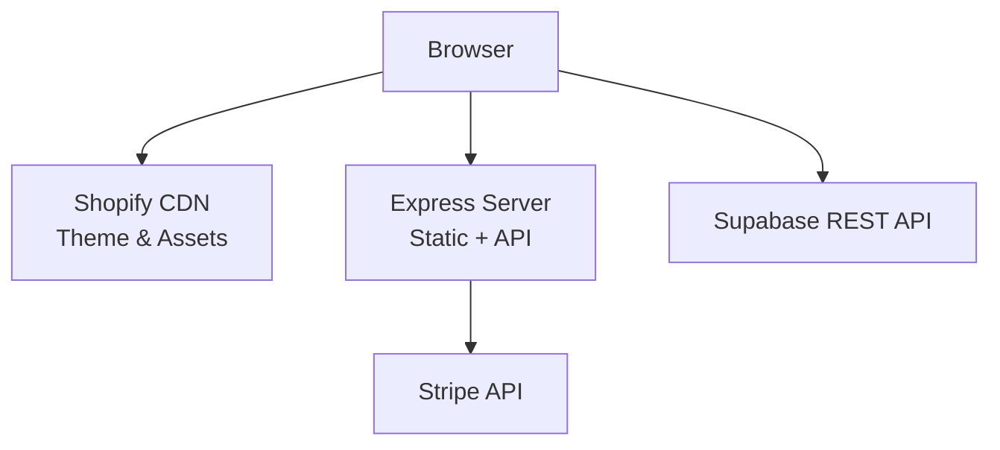
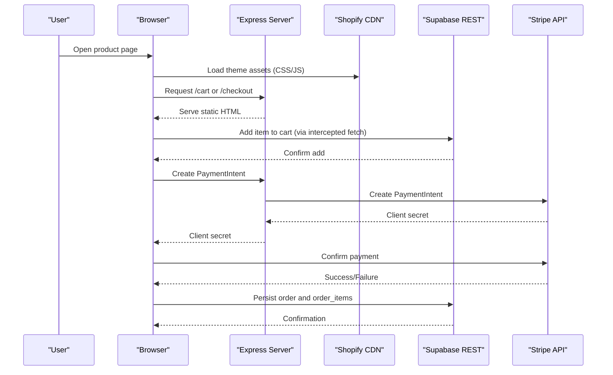
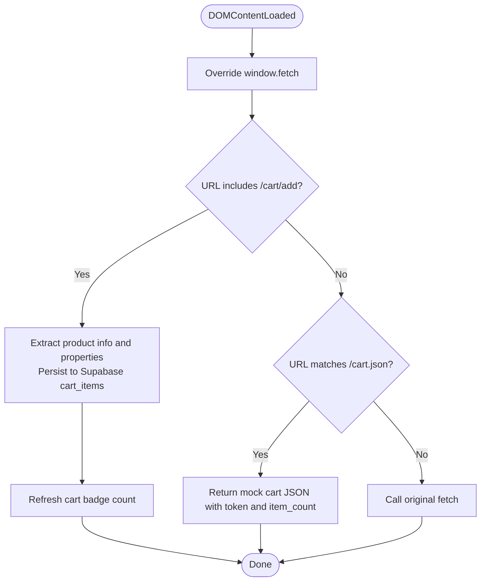
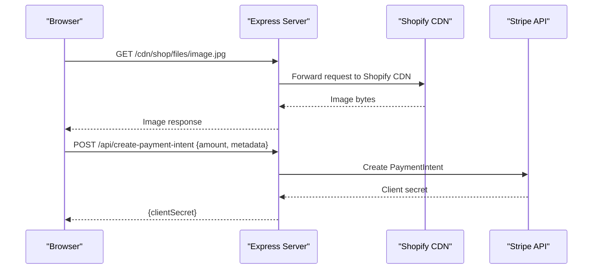
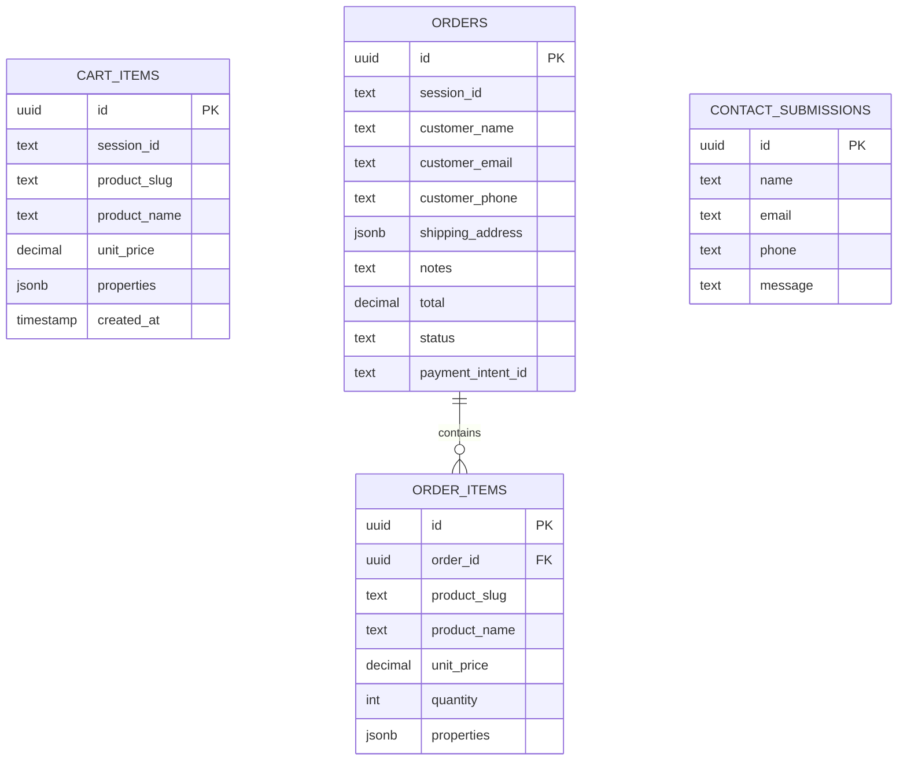
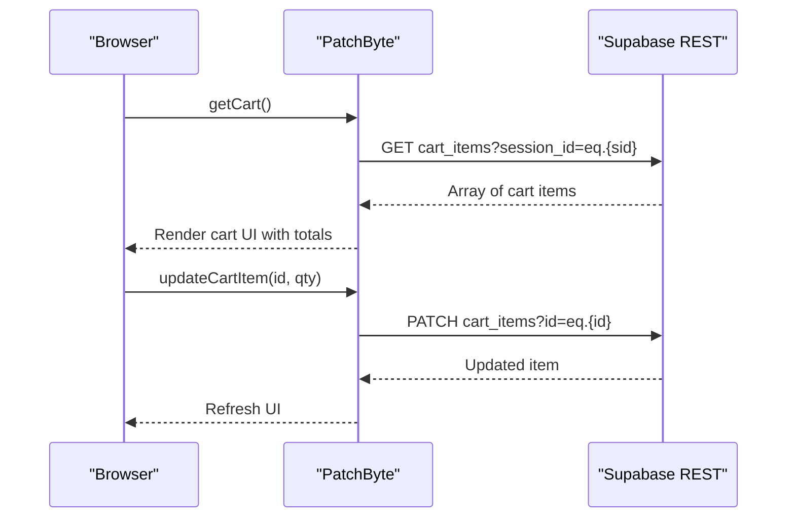
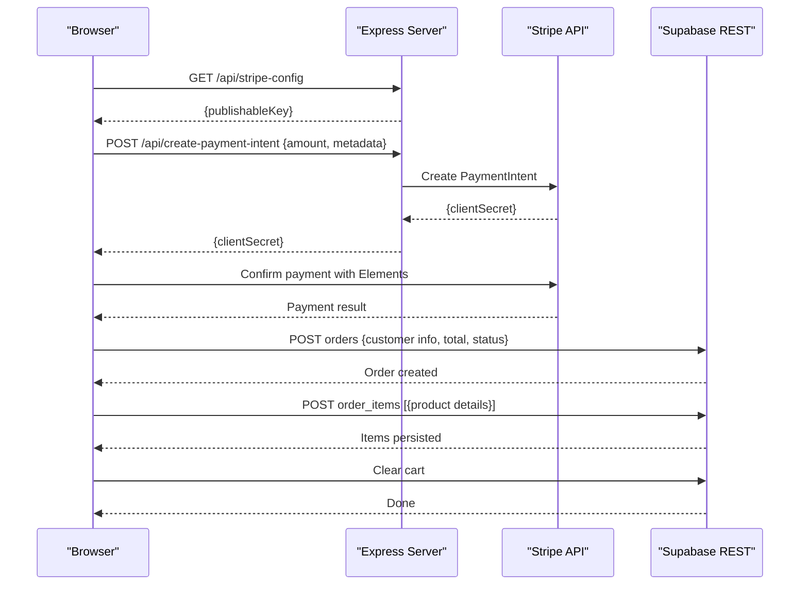
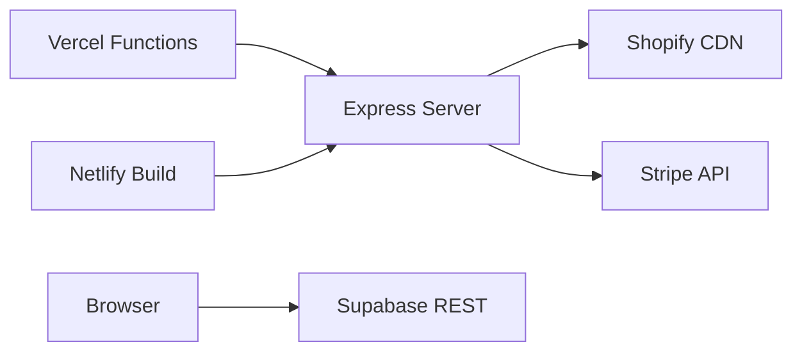

# System Architecture

<cite>
**Referenced Files in This Document**
- [patchbyte.js](file://frontend/js/patchbyte.js)
- [server.js](file://frontend/server.js)
- [index.js](file://api/index.js)
- [package.json](file://package.json)
- [migrate-tables.sql](file://migrate-tables.sql)
- [vercel.json](file://vercel.json)
- [netlify.toml](file://netlify.toml)
- [cart/index.html](file://frontend/patchkraze.com/cart/index.html)
- [checkout/index.html](file://frontend/patchkraze.com/checkout/index.html)
</cite>

## Table of Contents
1. Introduction
2. Project Structure
3. Core Components
4. Architecture Overview
5. Detailed Component Analysis
6. Dependency Analysis
7. Performance Considerations
8. Troubleshooting Guide
9. Conclusion

## Introduction
Patch-Byte is a hybrid e-commerce system that combines a static Shopify storefront with a custom Node.js backend and Supabase-backed persistence. The frontend renders product pages from the Shopify theme assets served via CDN, while PatchByte intercepts key browser-side interactions to persist cart state and orders in Supabase and process payments through Stripe. A lightweight Express server serves static content, proxies missing CDN assets back to Shopify, and exposes secure payment endpoints.

This architecture enables:
- Static site performance and reliability using Shopify’s CDN for theme assets and images.
- Custom cart and checkout flows powered by Supabase and Stripe without replacing Shopify’s rendering layer.
- Secure payment processing with server-side intent creation and client-side confirmation.

## Project Structure
The repository organizes code into three primary areas:
- Frontend static site (Shopify theme assets and custom HTML pages)
- Node.js Express server for routing, CDN proxying, and payment endpoints
- Supabase schema migration defining cart, order, and contact tables

**Diagram sources**
- [server.js:46-65](file://frontend/server.js#L46-L65)
- [patchbyte.js:33-65](file://frontend/js/patchbyte.js#L33-L65)
- [checkout/index.html:200-212](file://frontend/patchkraze.com/checkout/index.html#L200-L212)

**Section sources**
- [package.json:1-14](file://package.json#L1-L14)
- [vercel.json:1-12](file://vercel.json#L1-L12)
- [netlify.toml:1-165](file://netlify.toml#L1-L165)

## Core Components
- PatchByte script: Runs in the browser, intercepts fetch calls to emulate Shopify cart behavior, persists items to Supabase, and updates UI elements like cart badges and toasts.
- Express server: Serves static pages, proxies missing CDN assets to Shopify, and provides Stripe payment-intent endpoints.
- Supabase database: Stores cart items, orders, order items, and contact submissions with row-level security policies allowing anonymous access for public-facing operations.
- Stripe integration: Server creates PaymentIntent; client confirms payment via Stripe Elements and returns success state.

Key responsibilities:
- Cart persistence across sessions using a local session ID stored in localStorage.
- Fetch interception pattern to bridge Shopify’s expected cart endpoints with Supabase-backed logic.
- Secure payment flow with server-side secret management and client-side confirmation.

**Section sources**
- [patchbyte.js:19-65](file://frontend/js/patchbyte.js#L19-L65)
- [server.js:17-44](file://frontend/server.js#L17-L44)
- [migrate-tables.sql:5-57](file://migrate-tables.sql#L5-L57)

## Architecture Overview
The system uses a hybrid approach:
- Static Shopify theme assets are served directly from Shopify CDN for fast global delivery.
- The Express server acts as a thin layer to serve custom HTML pages and proxy missing CDN resources.
- PatchByte bridges Shopify’s frontend expectations with custom backend services by intercepting fetch calls and redirecting them to Supabase REST endpoints.
- Payments are processed via Stripe with server-side intent creation and client-side confirmation.

**Diagram sources**
- [patchbyte.js:138-163](file://frontend/js/patchbyte.js#L138-L163)
- [patchbyte.js:165-233](file://frontend/js/patchbyte.js#L165-L233)
- [server.js:17-44](file://frontend/server.js#L17-L44)
- [checkout/index.html:200-212](file://frontend/patchkraze.com/checkout/index.html#L200-L212)
- [checkout/index.html:286-337](file://frontend/patchkraze.com/checkout/index.html#L286-L337)

## Detailed Component Analysis

### PatchByte Script (Fetch Interception Pattern)
PatchByte injects itself into every page and overrides window.fetch to intercept Shopify-style cart requests. It maps these requests to Supabase REST endpoints, maintaining a per-session cart and updating UI elements accordingly.

Key behaviors:
- Session management: Generates or retrieves a session ID from localStorage to associate cart items with a user session.
- Fetch interception: Rewrites /cart/add, /cart/change, /cart/update, and /cart.json requests to use Supabase instead of Shopify’s backend.
- Cart CRUD: Adds, updates, deletes, and clears cart items in Supabase, then refreshes the cart badge count.
- Contact form submission: Submits contact messages to Supabase and replaces the form with a success message.
- Public API exposure: Exposes methods for other scripts to interact with cart and Supabase.

**Diagram sources**
- [patchbyte.js:138-163](file://frontend/js/patchbyte.js#L138-L163)
- [patchbyte.js:165-233](file://frontend/js/patchbyte.js#L165-L233)
- [patchbyte.js:115-136](file://frontend/js/patchbyte.js#L115-L136)

**Section sources**
- [patchbyte.js:19-65](file://frontend/js/patchbyte.js#L19-L65)
- [patchbyte.js:67-111](file://frontend/js/patchbyte.js#L67-L111)
- [patchbyte.js:138-163](file://frontend/js/patchbyte.js#L138-L163)
- [patchbyte.js:165-233](file://frontend/js/patchbyte.js#L165-L233)
- [patchbyte.js:235-263](file://frontend/js/patchbyte.js#L235-L263)
- [patchbyte.js:322-342](file://frontend/js/patchbyte.js#L322-L342)

### Express Server (Static Serving, CDN Proxy, Payment Endpoints)
The Express server serves the static site and handles critical integrations:
- Static file serving: Serves HTML pages from patchkraze.com directory and root assets.
- CDN proxy: Proxies missing /cdn/* paths back to Shopify CDN to ensure theme assets load correctly.
- Redirects: Implements permanent and temporary redirects for moved or renamed pages.
- Payment endpoints: Creates Stripe PaymentIntents securely on the server and exposes publishable keys to the client.

**Diagram sources**
- [server.js:46-65](file://frontend/server.js#L46-L65)
- [server.js:17-44](file://frontend/server.js#L17-L44)

**Section sources**
- [server.js:1-16](file://frontend/server.js#L1-L16)
- [server.js:17-44](file://frontend/server.js#L17-L44)
- [server.js:46-65](file://frontend/server.js#L46-L65)
- [server.js:67-111](file://frontend/server.js#L67-L111)

### Supabase Schema and Security
The Supabase schema defines tables for cart items, orders, order items, and contact submissions. Row-Level Security (RLS) policies allow anonymous access for public-facing operations, enabling the browser-based PatchByte script to interact directly with Supabase REST APIs.

Key aspects:
- Cart items include product details and properties captured during add-to-cart interception.
- Orders store customer information, shipping address, totals, and status.
- Order items link products to orders with pricing and properties.
- Contact submissions capture name, email, phone, and message.

**Diagram sources**
- [migrate-tables.sql:5-57](file://migrate-tables.sql#L5-L57)

**Section sources**
- [migrate-tables.sql:5-57](file://migrate-tables.sql#L5-L57)

### Cart Page Flow
The cart page loads items from Supabase via PatchByte’s public API, renders them in a table, calculates totals, and allows quantity updates or removal.

**Diagram sources**
- [cart/index.html:95-182](file://frontend/patchkraze.com/cart/index.html#L95-L182)
- [patchbyte.js:67-111](file://frontend/js/patchbyte.js#L67-L111)

**Section sources**
- [cart/index.html:95-182](file://frontend/patchkraze.com/cart/index.html#L95-L182)
- [patchbyte.js:67-111](file://frontend/js/patchbyte.js#L67-L111)

### Checkout Flow
The checkout page collects customer and shipping information, initializes Stripe Elements, creates a PaymentIntent via the server, confirms payment, and persists order data to Supabase.

**Diagram sources**
- [checkout/index.html:191-212](file://frontend/patchkraze.com/checkout/index.html#L191-L212)
- [checkout/index.html:286-337](file://frontend/patchkraze.com/checkout/index.html#L286-L337)
- [server.js:17-44](file://frontend/server.js#L17-L44)

**Section sources**
- [checkout/index.html:161-354](file://frontend/patchkraze.com/checkout/index.html#L161-L354)
- [server.js:17-44](file://frontend/server.js#L17-L44)

## Dependency Analysis
External dependencies and integration points:
- Shopify CDN: Provides theme assets and product images; proxied when not available locally.
- Supabase REST API: Used directly from the browser for cart and order persistence.
- Stripe API: Server-side intent creation and client-side payment confirmation.

Deployment configurations:
- Vercel: Routes all requests to the Express function and includes necessary files.
- Netlify: Uses build commands and redirects to serve static content and proxy CDN assets.

**Diagram sources**
- [vercel.json:1-12](file://vercel.json#L1-L12)
- [netlify.toml:1-165](file://netlify.toml#L1-L165)
- [server.js:46-65](file://frontend/server.js#L46-L65)

**Section sources**
- [vercel.json:1-12](file://vercel.json#L1-L12)
- [netlify.toml:1-165](file://netlify.toml#L1-L165)
- [package.json:1-14](file://package.json#L1-L14)

## Performance Considerations
- Static asset delivery via Shopify CDN ensures fast global loading of theme files and images.
- Express server proxies only missing assets, reducing unnecessary bandwidth usage.
- PatchByte minimizes network calls by caching session IDs locally and batching UI updates.
- Supabase RLS policies enable direct browser access, reducing server round-trips for cart operations.
- Stripe Elements runs client-side, minimizing server load during payment confirmation.

[No sources needed since this section provides general guidance]

## Troubleshooting Guide
Common issues and resolutions:
- Missing CDN assets: Ensure the Express server’s /cdn/* proxy is active and Shopify CDN URLs are correct.
- Cart not updating: Verify PatchByte’s fetch interception is active and Supabase RLS policies allow anonymous access.
- Payment failures: Check Stripe environment variables and ensure PaymentIntent creation succeeds before confirming payment.
- Contact form errors: Confirm Supabase contact_submissions table exists and RLS policies permit inserts.

**Section sources**
- [server.js:46-65](file://frontend/server.js#L46-L65)
- [patchbyte.js:138-163](file://frontend/js/patchbyte.js#L138-L163)
- [migrate-tables.sql:36-57](file://migrate-tables.sql#L36-L57)

## Conclusion
Patch-Byte delivers a robust hybrid e-commerce solution by combining Shopify’s static frontend with custom backend logic for cart persistence and payment processing. The fetch interception pattern seamlessly bridges Shopify’s expectations with Supabase-backed functionality, while the Express server provides secure payment endpoints and CDN proxying. This architecture balances performance, security, and extensibility, enabling scalable deployment across platforms like Vercel and Netlify.

[No sources needed since this section summarizes without analyzing specific files]