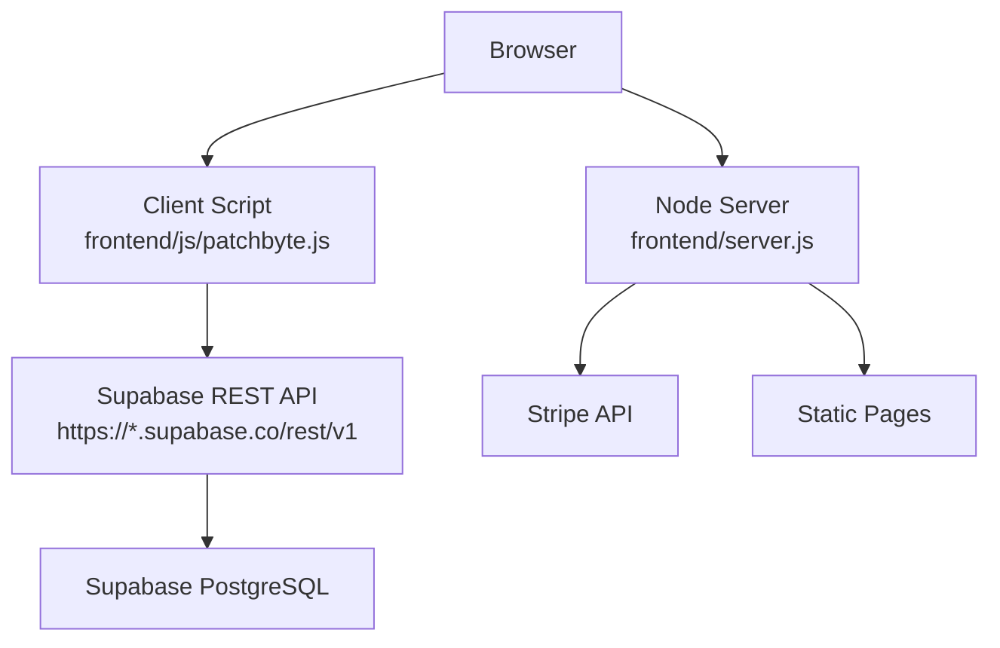
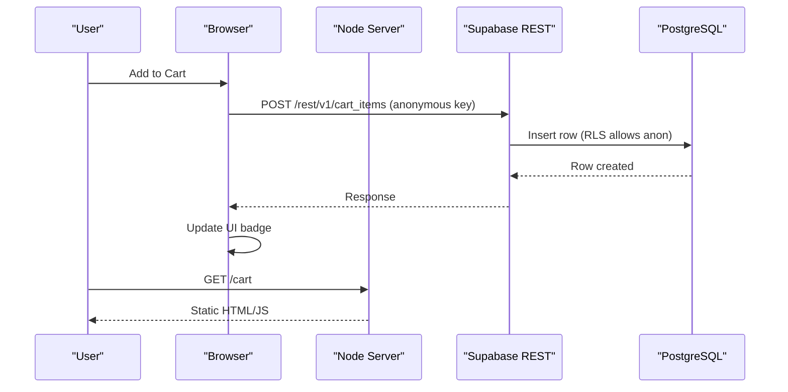
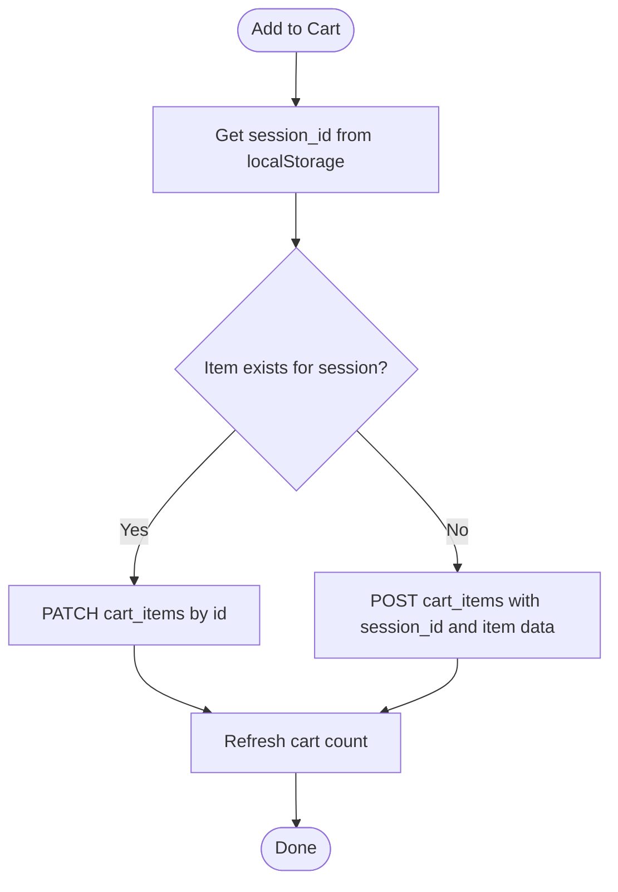
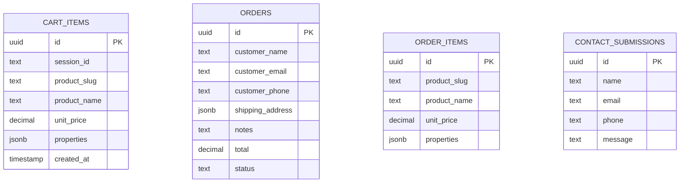
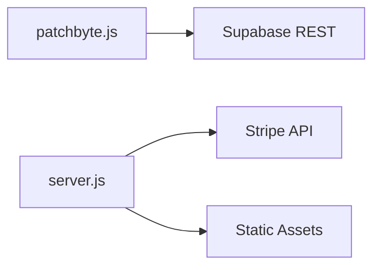

# Database Connectivity

<cite>
**Referenced Files in This Document**
- [patchbyte.js](file://frontend/js/patchbyte.js)
- [migrate-tables.sql](file://migrate-tables.sql)
- [server.js](file://frontend/server.js)
- [index.js](file://api/index.js)
- [package.json](file://package.json)
</cite>

## Table of Contents
1. [Introduction](#introduction)
2. [Project Structure](#project-structure)
3. [Core Components](#core-components)
4. [Architecture Overview](#architecture-overview)
5. [Detailed Component Analysis](#detailed-component-analysis)
6. [Dependency Analysis](#dependency-analysis)
7. [Performance Considerations](#performance-considerations)
8. [Troubleshooting Guide](#troubleshooting-guide)
9. [Conclusion](#conclusion)
10. [Appendices](#appendices)

## Introduction
This document provides comprehensive troubleshooting guidance for database connectivity issues in the Patch-Byte application, focusing on Supabase integration from the browser and server-side components. It covers authentication failures, network connectivity problems, firewall considerations, query performance debugging, connection pooling concerns, real-time subscription issues, schema migration errors, data integrity checks, row-level security (RLS) policy violations, monitoring strategies, backup and recovery procedures, and scaling considerations for high-traffic environments.

## Project Structure
Patch-Byte integrates with Supabase directly from the browser via a client-side script that calls the Supabase REST API. The Node.js server serves static content and payment-related endpoints but does not implement direct database connections to Supabase. Database schema and RLS policies are defined in a SQL migration file.

**Diagram sources**
- [patchbyte.js:10-17](file://frontend/js/patchbyte.js#L10-L17)
- [server.js:1-123](file://frontend/server.js#L1-L123)

**Section sources**
- [patchbyte.js:10-17](file://frontend/js/patchbyte.js#L10-L17)
- [server.js:1-123](file://frontend/server.js#L1-L123)
- [index.js:1-1](file://api/index.js#L1-L1)
- [package.json:1-14](file://package.json#L1-L14)

## Core Components
- Client-side Supabase integration: A JavaScript module intercepts Shopify-style cart operations and routes them to Supabase REST endpoints using an anonymous key. It manages session IDs stored in localStorage and performs CRUD operations on cart_items, orders, order_items, and contact_submissions tables.
- Schema and RLS: A SQL migration adds columns to existing tables and enables RLS with permissive policies for anonymous access.
- Server: An Express server serves static pages and handles Stripe payment intents; it does not connect to Supabase.

Key responsibilities:
- Authentication: Uses a public anonymous key configured in the client script.
- Data persistence: Writes cart items, contact submissions, and other entities via REST calls.
- Security: Applies RLS policies to allow anonymous inserts/reads as needed.

**Section sources**
- [patchbyte.js:10-17](file://frontend/js/patchbyte.js#L10-L17)
- [patchbyte.js:21-35](file://frontend/js/patchbyte.js#L21-L35)
- [patchbyte.js:69-111](file://frontend/js/patchbyte.js#L69-L111)
- [migrate-tables.sql:5-56](file://migrate-tables.sql#L5-L56)
- [server.js:17-44](file://frontend/server.js#L17-L44)

## Architecture Overview
The application uses a hybrid architecture:
- Frontend: Directly calls Supabase REST API for cart and contact features.
- Backend: Serves static assets and processes payments via Stripe; no direct database connection to Supabase.

**Diagram sources**
- [patchbyte.js:69-111](file://frontend/js/patchbyte.js#L69-L111)
- [migrate-tables.sql:36-56](file://migrate-tables.sql#L36-L56)
- [server.js:46-111](file://frontend/server.js#L46-L111)

## Detailed Component Analysis

### Client-Side Supabase Integration
- Connection details: The script defines the Supabase URL and an anonymous key used for all REST requests. Headers include apikey and Authorization Bearer tokens.
- Session management: A unique session ID is generated and persisted in localStorage to associate cart items with a user session.
- Operations:
  - Read cart items by session_id with ordering.
  - Create or update cart items based on product_slug within the same session.
  - Delete cart items by id or clear all items for a session.
  - Submit contact forms to contact_submissions.

**Diagram sources**
- [patchbyte.js:21-35](file://frontend/js/patchbyte.js#L21-L35)
- [patchbyte.js:69-111](file://frontend/js/patchbyte.js#L69-L111)

**Section sources**
- [patchbyte.js:10-17](file://frontend/js/patchbyte.js#L10-L17)
- [patchbyte.js:21-35](file://frontend/js/patchbyte.js#L21-L35)
- [patchbyte.js:69-111](file://frontend/js/patchbyte.js#L69-L111)
- [patchbyte.js:138-163](file://frontend/js/patchbyte.js#L138-L163)
- [patchbyte.js:165-233](file://frontend/js/patchbyte.js#L165-L233)
- [patchbyte.js:237-263](file://frontend/js/patchbyte.js#L237-L263)

### Schema and Row-Level Security
- Migration adds fields to cart_items, orders, order_items, and contact_submissions.
- RLS is enabled and permissive policies are created for anonymous users to insert/read rows.

**Diagram sources**
- [migrate-tables.sql:5-56](file://migrate-tables.sql#L5-L56)

**Section sources**
- [migrate-tables.sql:5-56](file://migrate-tables.sql#L5-L56)

### Server-Side Behavior
- The Express server serves static files and proxies CDN assets.
- Payment intent creation is handled via Stripe; no database connection to Supabase is implemented here.

**Section sources**
- [server.js:1-123](file://frontend/server.js#L1-L123)

## Dependency Analysis
- Client dependencies: None beyond standard fetch; relies on Supabase REST API.
- Server dependencies: Express, Stripe, dotenv for environment variables.
- External integrations: Supabase REST API, Stripe API, Shopify CDN proxy.

**Diagram sources**
- [patchbyte.js:10-17](file://frontend/js/patchbyte.js#L10-L17)
- [server.js:1-123](file://frontend/server.js#L1-L123)
- [package.json:9-13](file://package.json#L9-L13)

**Section sources**
- [package.json:9-13](file://package.json#L9-L13)
- [server.js:1-123](file://frontend/server.js#L1-L123)
- [patchbyte.js:10-17](file://frontend/js/patchbyte.js#L10-L17)

## Performance Considerations
- Query patterns: Cart reads filter by session_id and order by created_at; ensure indexes exist on session_id and created_at to optimize queries.
- Payload size: Avoid storing large images in JSONB properties; prefer external storage and store URLs only.
- Network latency: Batch operations where possible; minimize redundant reads by caching counts locally when appropriate.
- Error resilience: Implement retries with exponential backoff for transient network errors.

[No sources needed since this section provides general guidance]

## Troubleshooting Guide

### Authentication Failures
Symptoms:
- Requests return 401/403 or empty results.
- Errors indicate invalid or missing keys.

Checklist:
- Verify the anonymous key is correct and not expired.
- Ensure headers include both apikey and Authorization Bearer tokens.
- Confirm the Supabase project URL matches the configured endpoint.
- Validate RLS policies allow anonymous access for the intended operations.

Debug steps:
- Open browser DevTools Network tab and inspect request headers and responses.
- Test a simple GET to /rest/v1/<table> with the same headers to isolate configuration issues.
- Review RLS policies in Supabase dashboard to ensure they permit anonymous reads/writes as required.

**Section sources**
- [patchbyte.js:10-17](file://frontend/js/patchbyte.js#L10-L17)
- [migrate-tables.sql:36-56](file://migrate-tables.sql#L36-L56)

### Network Connectivity Issues
Symptoms:
- Timeouts or CORS errors when calling Supabase REST.
- Intermittent failures under certain networks.

Checklist:
- Confirm outbound HTTPS to *.supabase.co is allowed by firewalls/proxies.
- Ensure Content-Type is set to application/json.
- Validate that the browser can reach the Supabase domain.

Debug steps:
- Use curl or Postman to call the same REST endpoints with identical headers.
- Check for CSP or ad-blockers blocking requests.
- Inspect console for CORS errors and adjust Supabase CORS settings if necessary.

**Section sources**
- [patchbyte.js:10-17](file://frontend/js/patchbyte.js#L10-L17)

### Firewall Configuration Problems
Symptoms:
- Requests blocked by corporate or regional firewalls.
- Only specific ports/domains allowed.

Actions:
- Whitelist https://*.supabase.co and related domains.
- Allow outbound TCP 443 for HTTPS traffic.
- If behind a proxy, configure browser or system proxy settings accordingly.

[No sources needed since this section provides general guidance]

### Query Performance Issues
Symptoms:
- Slow cart loads or updates.
- High latency on read/write operations.

Optimization steps:
- Add indexes on frequently filtered columns such as session_id and created_at.
- Limit returned fields using select parameters where possible.
- Avoid heavy computations in the client; precompute values on the server if applicable.
- Monitor slow queries in Supabase logs and analyze execution plans.

**Section sources**
- [patchbyte.js:69-72](file://frontend/js/patchbyte.js#L69-L72)

### Connection Pooling Problems
Observation:
- The client uses direct HTTP calls to Supabase REST; there is no explicit connection pool in the frontend code.
- The server does not connect to Supabase; thus, no backend pooling is present.

Recommendations:
- For high concurrency, consider batching requests and implementing client-side retry logic.
- If moving logic to a backend service, use a proper database client with connection pooling.

**Section sources**
- [patchbyte.js:31-65](file://frontend/js/patchbyte.js#L31-L65)
- [server.js:1-123](file://frontend/server.js#L1-L123)

### Real-Time Subscription Failures
Note:
- The current implementation uses REST endpoints; real-time subscriptions are not implemented in the provided scripts.

If adding real-time features:
- Use Supabase’s real-time capabilities with proper auth roles and channel permissions.
- Handle reconnection and error states gracefully.

[No sources needed since this section provides general guidance]

### Schema Migration Errors
Symptoms:
- Missing columns cause runtime errors.
- Policy creation fails due to syntax or naming conflicts.

Resolution:
- Run the migration script in Supabase SQL Editor to add missing columns and create policies.
- Use IF NOT EXISTS patterns to avoid duplicate errors.
- Validate table structures after migration.

**Section sources**
- [migrate-tables.sql:5-56](file://migrate-tables.sql#L5-L56)

### Data Integrity Issues
Symptoms:
- Inconsistent cart quantities or missing fields.
- Invalid JSONB payloads.

Resolution:
- Enforce constraints at the database level (e.g., CHECK constraints).
- Validate inputs on the client before sending to Supabase.
- Normalize data formats (e.g., numeric types for prices).

**Section sources**
- [migrate-tables.sql:5-34](file://migrate-tables.sql#L5-L34)

### Row-Level Security Policy Violations
Symptoms:
- Permission denied errors on insert/update/delete.
- Unexpected empty results.

Resolution:
- Ensure RLS is enabled and policies match the intended access model.
- For anonymous access, verify policies allow operations for unauthenticated users.
- Test policies using Supabase SQL Editor with different roles.

**Section sources**
- [migrate-tables.sql:36-56](file://migrate-tables.sql#L36-L56)

### Monitoring Strategies
Recommended metrics:
- Request success/failure rates to Supabase REST.
- Latency percentiles for cart operations.
- Error categories (auth, network, validation).

Implementation ideas:
- Wrap fetch calls with timing and error tracking.
- Log anonymized metrics to a centralized logging service.
- Set up alerts for spikes in error rates or latency.

[No sources needed since this section provides general guidance]

### Backup and Recovery Procedures
Critical data:
- Orders, order_items, contact_submissions, and cart_items.

Procedures:
- Use Supabase backups and point-in-time recovery options.
- Export critical tables periodically via SQL dumps.
- Maintain versioned migrations to reconstruct schema reliably.
- Test restore procedures regularly.

[No sources needed since this section provides general guidance]

### Scaling Considerations and Load Balancing
Guidance:
- Offload heavy processing to a backend service if needed.
- Use CDN caching for static assets and images.
- Implement client-side retries and exponential backoff.
- Consider sharding or partitioning large tables if growth demands it.

[No sources needed since this section provides general guidance]

## Conclusion
Patch-Byte integrates with Supabase primarily through direct browser calls to the REST API, with schema and RLS managed via SQL migrations. Troubleshooting focuses on verifying authentication keys, network accessibility, RLS policies, and query optimization. While the server does not connect to Supabase, it supports payments via Stripe and serves static content. For robustness, adopt monitoring, retries, and regular backups, and plan for scaling as usage grows.

[No sources needed since this section summarizes without analyzing specific files]

## Appendices

### Quick Reference: Key Files and Roles
- Client integration: frontend/js/patchbyte.js
- Schema and RLS: migrate-tables.sql
- Server endpoints: frontend/server.js
- Entrypoint alias: api/index.js
- Dependencies: package.json

**Section sources**
- [patchbyte.js:10-17](file://frontend/js/patchbyte.js#L10-L17)
- [migrate-tables.sql:5-56](file://migrate-tables.sql#L5-L56)
- [server.js:1-123](file://frontend/server.js#L1-L123)
- [index.js:1-1](file://api/index.js#L1-L1)
- [package.json:1-14](file://package.json#L1-L14)