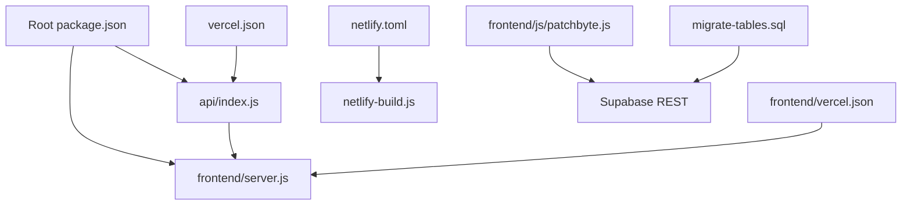
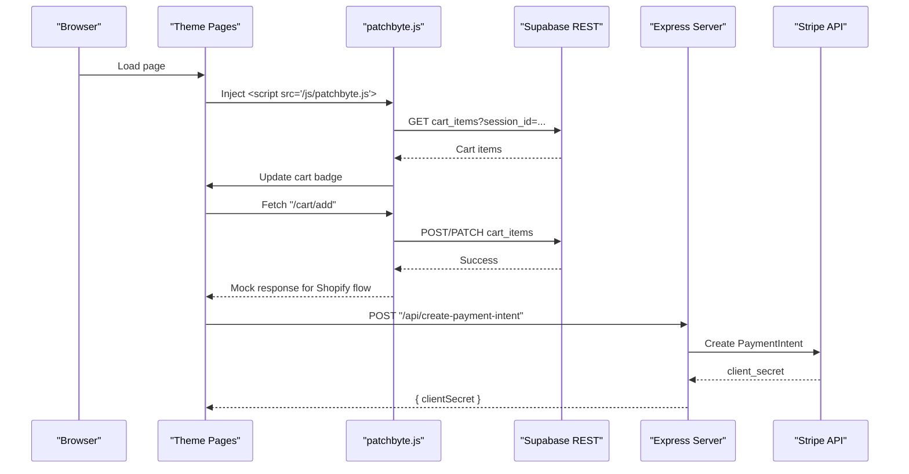
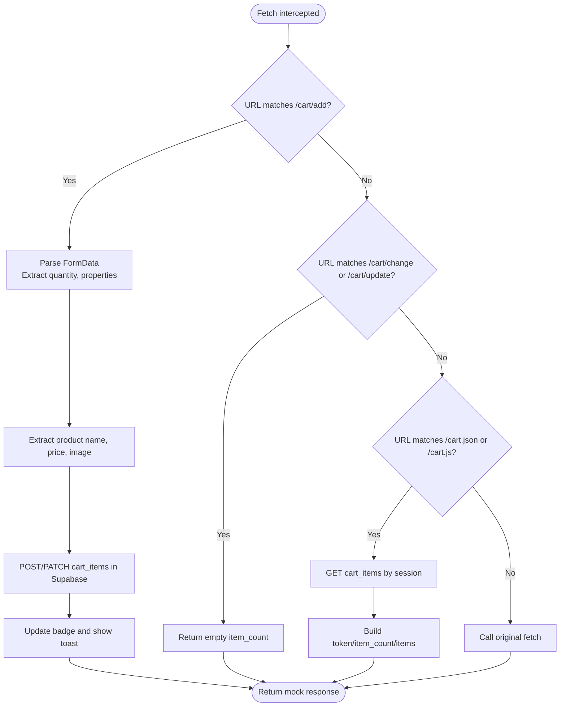
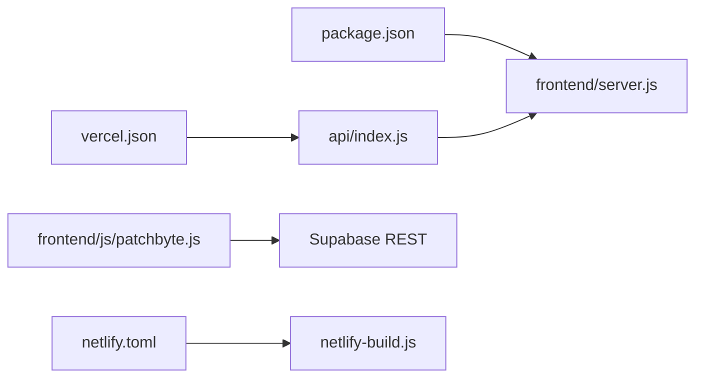

# Development Issues

<cite>
**Referenced Files in This Document**
- [package.json](file://package.json)
- [frontend/package.json](file://frontend/package.json)
- [api/index.js](file://api/index.js)
- [frontend/server.js](file://frontend/server.js)
- [frontend/vercel.json](file://frontend/vercel.json)
- [vercel.json](file://vercel.json)
- [netlify.toml](file://netlify.toml)
- [netlify-build.js](file://netlify-build.js)
- [migrate-tables.sql](file://migrate-tables.sql)
- [frontend/js/patchbyte.js](file://frontend/js/patchbyte.js)
- [frontend/start-server.bat](file://frontend/start-server.bat)
- [inject-patchbyte.ps1](file://inject-patchbyte.ps1)
- [download-images.ps1](file://download-images.ps1)
</cite>

## Table of Contents
1. Introduction
2. Project Structure
3. Core Components
4. Architecture Overview
5. Detailed Component Analysis
6. Dependency Analysis
7. Performance Considerations
8. Troubleshooting Guide
9. Conclusion
10. Appendices

## Introduction
This document provides a comprehensive guide to resolving development-related issues in the Patch-Byte application. It focuses on setup problems (Node.js version, dependency installation, environment variables), debugging techniques for the PatchByte integration layer (fetch interception and Supabase connectivity), local server startup failures (port conflicts, CORS), JavaScript module debugging (console, network inspection, stack traces), build process errors, asset compilation issues, static file serving problems, and IDE configuration tips to optimize your development workflow.

## Project Structure
The project is a static site served by an Express server with a small API surface for payments and CDN proxying. The frontend includes a client-side integration script that intercepts Shopify-style fetch calls and routes them to Supabase. Deployment configurations are provided for Vercel and Netlify.

**Diagram sources**
- [package.json:1-14](file://package.json#L1-L14)
- [api/index.js:1-1](file://api/index.js#L1-L1)
- [frontend/server.js:1-123](file://frontend/server.js#L1-L123)
- [frontend/vercel.json:1-20](file://frontend/vercel.json#L1-L20)
- [vercel.json:1-12](file://vercel.json#L1-L12)
- [netlify.toml:1-165](file://netlify.toml#L1-L165)
- [netlify-build.js:1-28](file://netlify-build.js#L1-L28)
- [frontend/js/patchbyte.js:1-345](file://frontend/js/patchbyte.js#L1-L345)
- [migrate-tables.sql:1-57](file://migrate-tables.sql#L1-L57)

**Section sources**
- [package.json:1-14](file://package.json#L1-L14)
- [frontend/package.json:1-19](file://frontend/package.json#L1-L19)
- [api/index.js:1-1](file://api/index.js#L1-L1)
- [frontend/server.js:1-123](file://frontend/server.js#L1-L123)
- [frontend/vercel.json:1-20](file://frontend/vercel.json#L1-L20)
- [vercel.json:1-12](file://vercel.json#L1-L12)
- [netlify.toml:1-165](file://netlify.toml#L1-L165)
- [netlify-build.js:1-28](file://netlify-build.js#L1-L28)

## Core Components
- Local server: Express app serves static HTML from the theme directory, proxies missing /cdn/* assets to Shopify CDN, and exposes payment endpoints.
- Client integration: patchbyte.js intercepts Shopify-style cart fetch calls, persists cart items to Supabase, updates UI badges, and handles contact form submissions.
- Database schema: SQL migration adds required columns and enables permissive Row Level Security policies for anonymous access.
- Deployment configs: Vercel rewrites route all requests to the API; Netlify builds a public folder and configures redirects and CDN proxies.

Key responsibilities:
- Server routes: create-payment-intent, stripe-config, static serving, /cdn/* proxy, clean URL routing.
- Client logic: session management, cart CRUD via Supabase REST, fetch interception, UI updates, contact form handling.
- Build/deploy: copy assets for Netlify, include files for Vercel functions, rewrite rules.

**Section sources**
- [frontend/server.js:1-123](file://frontend/server.js#L1-L123)
- [frontend/js/patchbyte.js:1-345](file://frontend/js/patchbyte.js#L1-L345)
- [migrate-tables.sql:1-57](file://migrate-tables.sql#L1-L57)
- [vercel.json:1-12](file://vercel.json#L1-L12)
- [netlify.toml:1-165](file://netlify.toml#L1-L165)
- [netlify-build.js:1-28](file://netlify-build.js#L1-L28)

## Architecture Overview
The runtime architecture consists of a browser loading the theme pages, injecting patchbyte.js early to intercept fetch calls, and communicating with Supabase for cart and contact data. The Express server runs locally or as a serverless function to serve static content and handle Stripe operations.

**Diagram sources**
- [frontend/js/patchbyte.js:1-345](file://frontend/js/patchbyte.js#L1-L345)
- [frontend/server.js:1-123](file://frontend/server.js#L1-L123)

## Detailed Component Analysis

### Local Server (Express)
Responsibilities:
- Serve static HTML and assets from the theme directory.
- Proxy missing /cdn/* resources to Shopify CDN.
- Provide Stripe endpoints for creating payment intents and exposing publishable keys.
- Route clean URLs to .html files or index.html fallbacks.

Common issues and fixes:
- Node.js version mismatch: Ensure Node >= 18 as specified in engines.
- Port conflicts: Change PORT env or stop conflicting processes.
- Static paths: Verify ROOT path points to the correct theme directory.
- CDN proxy: Confirm Shopify CDN URLs and headers are set correctly.

**Section sources**
- [frontend/server.js:1-123](file://frontend/server.js#L1-L123)
- [package.json:1-14](file://package.json#L1-L14)
- [frontend/package.json:1-19](file://frontend/package.json#L1-L19)

### PatchByte Integration Layer (Client Script)
Responsibilities:
- Intercept Shopify-style fetch calls (/cart/add, /cart/change, /cart/update, /cart.json).
- Persist cart state to Supabase using REST API with anon key and headers.
- Update cart badge and show toast notifications.
- Wire contact forms to submit to Supabase.

Debugging techniques:
- Console logging: Inspect logs prefixed with [PatchByte] for errors during add-to-cart or contact submission.
- Network tab: Verify intercepted requests and responses; confirm Supabase REST endpoint and headers.
- Session ID: Check localStorage pb_session to ensure consistent cart identity.
- Supabase RLS: Validate policies allow anonymous inserts/reads for cart_items and contact_submissions.

**Diagram sources**
- [frontend/js/patchbyte.js:138-163](file://frontend/js/patchbyte.js#L138-L163)
- [frontend/js/patchbyte.js:165-233](file://frontend/js/patchbyte.js#L165-L233)
- [frontend/js/patchbyte.js:69-111](file://frontend/js/patchbyte.js#L69-L111)

**Section sources**
- [frontend/js/patchbyte.js:1-345](file://frontend/js/patchbyte.js#L1-L345)
- [migrate-tables.sql:1-57](file://migrate-tables.sql#L1-L57)

### Database Migration and Policies
- Adds fields for product_slug, product_name, unit_price, properties to cart_items and order_items.
- Adds customer details, totals, status to orders.
- Adds name, email, phone, message to contact_submissions.
- Enables Row Level Security with permissive policies for anonymous users.

Troubleshooting:
- If Supabase returns permission errors, run the migration to ensure columns and policies exist.
- Verify anon key permissions match the policy definitions.

**Section sources**
- [migrate-tables.sql:1-57](file://migrate-tables.sql#L1-L57)

### Deployment Configurations
Vercel:
- Rewrites all routes to api/index.js which exports the Express app.
- Functions includeFiles restricts bundled assets to necessary HTML, JS, and theme assets.

Netlify:
- Build command copies theme HTML and assets into public/, excluding nested cdn folders.
- Redirects map clean URLs to .html files and proxy CDN paths to Shopify.

Common issues:
- Missing includeFiles or routes causing 404s on deployment.
- Build script not copying required assets to public/.

**Section sources**
- [vercel.json:1-12](file://vercel.json#L1-L12)
- [frontend/vercel.json:1-20](file://frontend/vercel.json#L1-L20)
- [netlify.toml:1-165](file://netlify.toml#L1-L165)
- [netlify-build.js:1-28](file://netlify-build.js#L1-L28)

## Dependency Analysis
- Node engine requirement: >= 18 across root and frontend packages.
- Dependencies: express, stripe, dotenv used by the server.
- API entrypoint re-exports the Express app for serverless environments.

Potential coupling:
- api/index.js depends on frontend/server.js.
- patchbyte.js depends on Supabase REST and DOM APIs.
- Deployment configs depend on file structure and included assets.

**Diagram sources**
- [package.json:1-14](file://package.json#L1-L14)
- [api/index.js:1-1](file://api/index.js#L1-L1)
- [frontend/server.js:1-123](file://frontend/server.js#L1-L123)
- [frontend/js/patchbyte.js:1-345](file://frontend/js/patchbyte.js#L1-L345)
- [vercel.json:1-12](file://vercel.json#L1-L12)
- [netlify.toml:1-165](file://netlify.toml#L1-L165)
- [netlify-build.js:1-28](file://netlify-build.js#L1-L28)

**Section sources**
- [package.json:1-14](file://package.json#L1-L14)
- [frontend/package.json:1-19](file://frontend/package.json#L1-L19)
- [api/index.js:1-1](file://api/index.js#L1-L1)

## Performance Considerations
- Minimize Supabase calls: Cache cart count locally when possible; batch updates where feasible.
- CDN proxy caching: The server sets cache headers for proxied assets; ensure upstream CDN supports caching.
- Avoid unnecessary DOM scans: Limit repeated queries for cart elements; debounce UI updates.
- Asset bundling: For production, consider pre-bundling theme assets to reduce request counts.

[No sources needed since this section provides general guidance]

## Troubleshooting Guide

### Setup Problems
- Node.js version compatibility
  - Symptom: Module load errors or syntax errors at startup.
  - Fix: Use Node >= 18 as defined in engines.
  - Section sources
    - [package.json:8-8](file://package.json#L8-L8)
    - [frontend/package.json:9-10](file://frontend/package.json#L9-L10)

- Dependency installation failures
  - Symptom: npm install fails due to native modules or outdated Node.
  - Fix: Upgrade Node to 18+, clear node_modules and lockfiles, reinstall.
  - Section sources
    - [package.json:9-13](file://package.json#L9-L13)
    - [frontend/package.json:13-17](file://frontend/package.json#L13-L17)

- Environment variable configuration errors
  - Symptom: Stripe endpoints return “not configured” or publishable key missing.
  - Fix: Ensure STRIPE_SECRET_KEY and STRIPE_PUBLISHABLE_KEY are set; verify dotenv loads .env in local dev.
  - Section sources
    - [frontend/server.js:6-9](file://frontend/server.js#L6-L9)
    - [frontend/server.js:18-44](file://frontend/server.js#L18-L44)

### PatchByte Integration Debugging
- Fetch interception issues
  - Symptoms: Add-to-cart does nothing; cart badge not updating; /cart.json returns empty items.
  - Techniques:
    - Open DevTools Console and look for [PatchByte] logs.
    - In Network tab, filter by /cart/add and verify intercepted requests.
    - Confirm localStorage contains pb_session.
    - Validate Supabase REST endpoint and headers (apikey, Authorization).
  - Section sources
    - [frontend/js/patchbyte.js:138-163](file://frontend/js/patchbyte.js#L138-L163)
    - [frontend/js/patchbyte.js:165-233](file://frontend/js/patchbyte.js#L165-L233)
    - [frontend/js/patchbyte.js:21-29](file://frontend/js/patchbyte.js#L21-L29)

- Supabase connection problems
  - Symptoms: 401/403 errors or empty results from cart_items/contact_submissions.
  - Fixes:
    - Run migrate-tables.sql to add columns and enable RLS policies.
    - Verify anon key has correct permissions.
    - Test direct REST calls to Supabase with the same headers.
  - Section sources
    - [migrate-tables.sql:1-57](file://migrate-tables.sql#L1-L57)
    - [frontend/js/patchbyte.js:13-17](file://frontend/js/patchbyte.js#L13-L17)

### Local Development Server Startup Failures
- Port conflicts
  - Symptom: Error binding to port 3000.
  - Fix: Set PORT env to another value or stop other processes using the port.
  - Section sources
    - [frontend/server.js:12-12](file://frontend/server.js#L12-L12)
    - [frontend/start-server.bat:1-9](file://frontend/start-server.bat#L1-L9)

- CORS configuration issues
  - Symptom: Cross-origin errors when calling backend endpoints from different origins.
  - Notes: The server currently does not configure CORS middleware; ensure same-origin requests or adjust server to allow cross-origin if needed.
  - Section sources
    - [frontend/server.js:1-16](file://frontend/server.js#L1-L16)

### JavaScript Modules Debugging
- Browser console debugging
  - Use console.log statements within patchbyte.js to trace execution paths.
  - Inspect window.PatchByte API methods exposed globally.
  - Section sources
    - [frontend/js/patchbyte.js:331-342](file://frontend/js/patchbyte.js#L331-L342)

- Network request inspection
  - Filter Network tab by /cart/add, /cart.json, and Supabase REST endpoints.
  - Verify request payloads and response shapes match expectations.
  - Section sources
    - [frontend/js/patchbyte.js:138-163](file://frontend/js/patchbyte.js#L138-L163)

- Error stack trace analysis
  - Look for [PatchByte] error logs indicating failed Supabase calls or DOM parsing issues.
  - Validate selectors used to extract product name, price, and image.
  - Section sources
    - [frontend/js/patchbyte.js:184-216](file://frontend/js/patchbyte.js#L184-L216)
    - [frontend/js/patchbyte.js:227-233](file://frontend/js/patchbyte.js#L227-L233)

### Build Process Errors and Asset Compilation
- Netlify build
  - Symptom: Missing assets or 404s after deploy.
  - Fix: Ensure netlify-build.js copies theme HTML and assets into public/; verify exclude patterns do not remove needed files.
  - Section sources
    - [netlify-build.js:1-28](file://netlify-build.js#L1-L28)
    - [netlify.toml:1-7](file://netlify.toml#L1-L7)

- Vercel functions
  - Symptom: Routes not found or missing includes.
  - Fix: Confirm vercel.json rewrites and includeFiles list cover required assets.
  - Section sources
    - [vercel.json:1-12](file://vercel.json#L1-L12)
    - [frontend/vercel.json:1-20](file://frontend/vercel.json#L1-L20)

### Static File Serving Problems
- Clean URL routing
  - Symptom: Accessing /products/foo returns 404.
  - Fix: Ensure .html files exist or index.html fallback is present; verify server’s candidate resolution logic.
  - Section sources
    - [frontend/server.js:92-111](file://frontend/server.js#L92-L111)

- CDN asset proxying
  - Symptom: Images or fonts not loading.
  - Fix: Confirm /cdn/* proxy maps to correct Shopify URLs; check remote availability and headers.
  - Section sources
    - [frontend/server.js:50-65](file://frontend/server.js#L50-L65)

### IDE Configuration Tips and Workflow Optimization
- Recommended setup
  - Use Node 18+ via nvm or similar tool.
  - Configure VS Code to lint JavaScript and format on save.
  - Set up launch configuration to start frontend/server.js with environment variables loaded from .env.
  - Enable breakpoints in patchbyte.js for client-side debugging.

- Scripts to streamline tasks
  - inject-patchbyte.ps1: Injects the PatchByte script tag into HTML pages for local testing.
  - download-images.ps1: Downloads missing images from Shopify CDN to local paths for offline development.
  - Section sources
    - [inject-patchbyte.ps1:1-23](file://inject-patchbyte.ps1#L1-L23)
    - [download-images.ps1:1-69](file://download-images.ps1#L1-L69)

## Conclusion
By aligning Node versions, ensuring environment variables are correctly set, and understanding how PatchByte intercepts fetch calls and communicates with Supabase, most development issues can be resolved quickly. Use the provided troubleshooting steps, deployment configurations, and scripts to streamline local development and deployment workflows. When encountering persistent issues, inspect console logs, network requests, and database policies to pinpoint root causes.

## Appendices

### Quick Reference: Common Commands and Checks
- Start local server:
  - Use npm start or run frontend/server.js directly.
  - Section sources
    - [package.json:4-7](file://package.json#L4-L7)
    - [frontend/server.js:116-122](file://frontend/server.js#L116-L122)

- Verify environment variables:
  - Check STRIPE_SECRET_KEY and STRIPE_PUBLISHABLE_KEY presence.
  - Section sources
    - [frontend/server.js:6-9](file://frontend/server.js#L6-L9)
    - [frontend/server.js:18-44](file://frontend/server.js#L18-L44)

- Validate Supabase tables and policies:
  - Run migrate-tables.sql in Supabase SQL Editor.
  - Section sources
    - [migrate-tables.sql:1-57](file://migrate-tables.sql#L1-L57)