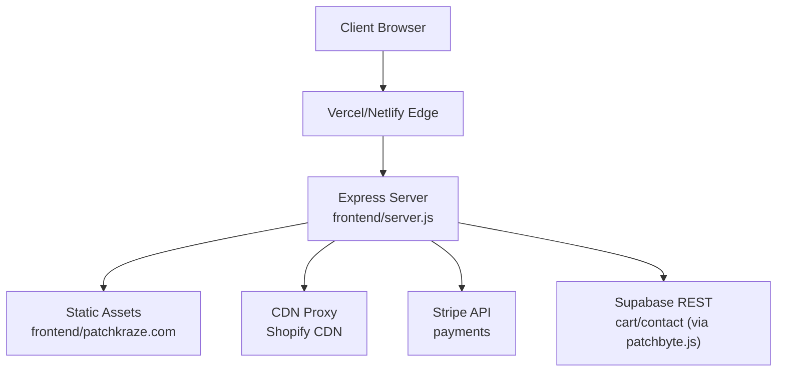
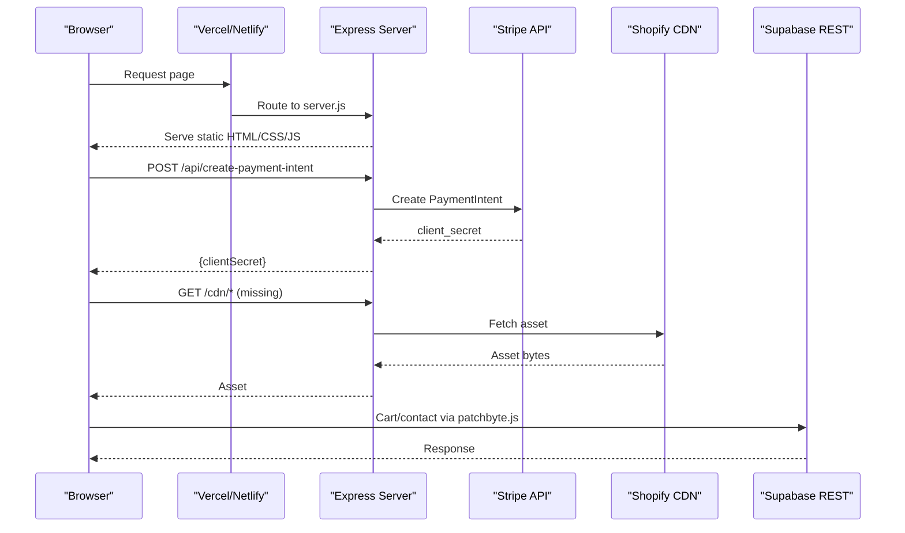
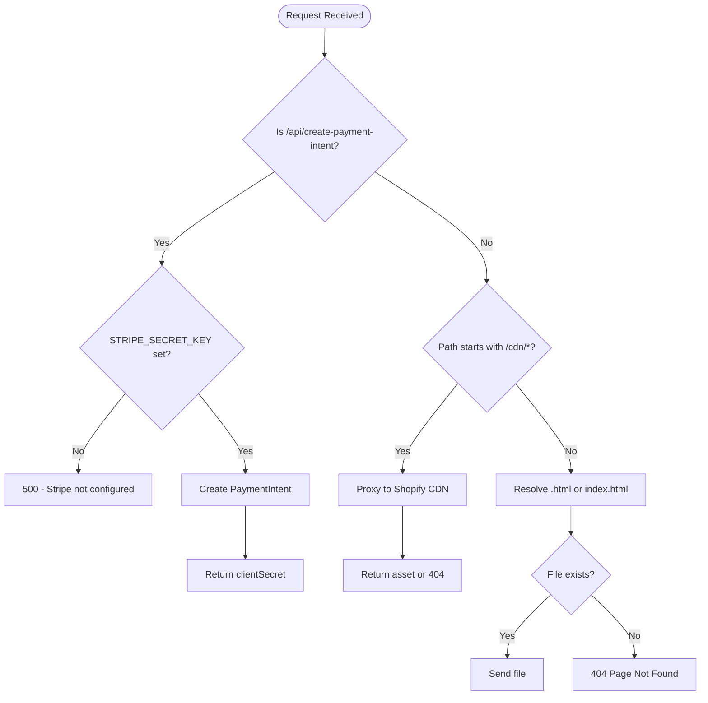
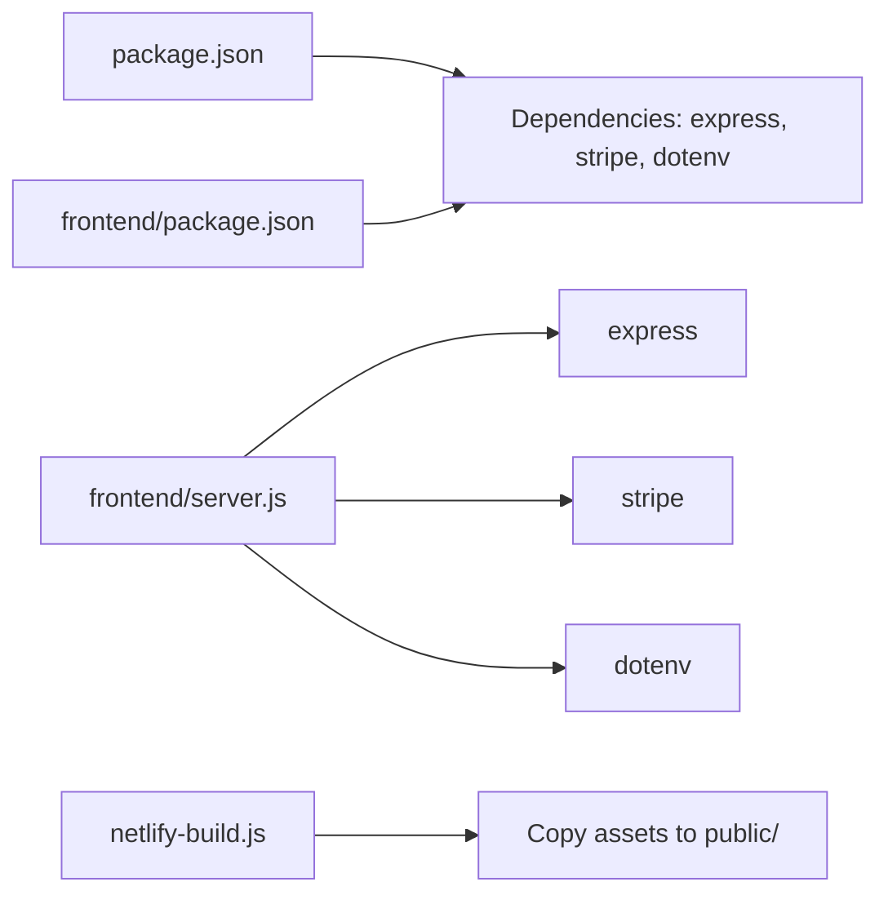

# Environment Configuration

<cite>
**Referenced Files in This Document**
- [package.json](file://package.json)
- [frontend/package.json](file://frontend/package.json)
- [vercel.json](file://vercel.json)
- [frontend/vercel.json](file://frontend/vercel.json)
- [netlify.toml](file://netlify.toml)
- [netlify-build.js](file://netlify-build.js)
- [api/index.js](file://api/index.js)
- [frontend/server.js](file://frontend/server.js)
- [frontend/js/patchbyte.js](file://frontend/js/patchbyte.js)
</cite>

## Table of Contents
1. Introduction
2. Project Structure
3. Core Components
4. Architecture Overview
5. Detailed Component Analysis
6. Dependency Analysis
7. Performance Considerations
8. Troubleshooting Guide
9. Conclusion
10. Appendices

## Introduction
This document provides comprehensive troubleshooting guidance for environment configuration issues across development, staging, and production deployments. It focuses on:
- Environment variable misconfigurations
- Deployment platform-specific settings (Vercel and Netlify)
- Third-party service integration errors (Stripe, Shopify CDN, Supabase)
- Build process issues and runtime environment mismatches
- SSL/TLS certificate problems, domain configuration issues, and DNS resolution failures
- Best practices for managing environment configurations, secrets, and validation
- Containerization and Docker-based deployment considerations

## Project Structure
The project is a Node.js Express server that serves static HTML assets from the frontend directory and proxies certain paths to Shopify’s CDN. Payments are handled via Stripe through a serverless endpoint. The site can be deployed to Vercel or Netlify with different build and routing strategies.

**Diagram sources**
- [frontend/server.js:1-123](file://frontend/server.js#L1-L123)
- [netlify.toml:1-165](file://netlify.toml#L1-L165)
- [vercel.json:1-12](file://vercel.json#L1-L12)
- [frontend/vercel.json:1-20](file://frontend/vercel.json#L1-L20)
- [frontend/js/patchbyte.js:1-345](file://frontend/js/patchbyte.js#L1-L345)

**Section sources**
- [package.json:1-14](file://package.json#L1-L14)
- [frontend/package.json:1-19](file://frontend/package.json#L1-L19)
- [vercel.json:1-12](file://vercel.json#L1-L12)
- [frontend/vercel.json:1-20](file://frontend/vercel.json#L1-L20)
- [netlify.toml:1-165](file://netlify.toml#L1-L165)
- [netlify-build.js:1-28](file://netlify-build.js#L1-L28)
- [api/index.js:1-1](file://api/index.js#L1-L1)
- [frontend/server.js:1-123](file://frontend/server.js#L1-L123)
- [frontend/js/patchbyte.js:1-345](file://frontend/js/patchbyte.js#L1-L345)

## Core Components
- Express server: Serves static pages, handles redirects, proxies CDN assets, and exposes Stripe endpoints.
- Vercel configuration: Routes all requests to the serverless function and includes required files.
- Netlify configuration: Defines build command, publish directory, redirects, and CDN proxy rules.
- Frontend script: Intercepts cart operations and contact form submissions to route them to Supabase.

Key responsibilities:
- Environment variables: PORT, STRIPE_SECRET_KEY, STRIPE_PUBLISHABLE_KEY.
- Static asset serving and clean URL handling.
- CDN proxying to Shopify for assets not present locally.
- Payment intent creation via Stripe.

**Section sources**
- [frontend/server.js:1-123](file://frontend/server.js#L1-L123)
- [vercel.json:1-12](file://vercel.json#L1-L12)
- [frontend/vercel.json:1-20](file://frontend/vercel.json#L1-L20)
- [netlify.toml:1-165](file://netlify.toml#L1-L165)
- [netlify-build.js:1-28](file://netlify-build.js#L1-L28)
- [frontend/js/patchbyte.js:1-345](file://frontend/js/patchbyte.js#L1-L345)

## Architecture Overview
The runtime architecture centers around an Express application that:
- Loads environment variables at startup
- Serves static content from the frontend directory
- Proxies missing CDN resources to Shopify
- Exposes Stripe payment endpoints
- Integrates with Supabase via a client-side script for cart and contact features

**Diagram sources**
- [frontend/server.js:17-44](file://frontend/server.js#L17-L44)
- [frontend/server.js:50-65](file://frontend/server.js#L50-L65)
- [frontend/js/patchbyte.js:33-65](file://frontend/js/patchbyte.js#L33-L65)
- [frontend/js/patchbyte.js:140-163](file://frontend/js/patchbyte.js#L140-L163)

## Detailed Component Analysis

### Express Server (frontend/server.js)
Responsibilities:
- Reads environment variables for Stripe and port
- Serves static files and handles clean URLs
- Proxies CDN requests to Shopify when assets are missing locally
- Creates Stripe PaymentIntents and exposes publishable key

Common pitfalls:
- Missing STRIPE_SECRET_KEY disables payments
- Incorrect PORT usage in containerized environments
- CDN proxy failures due to network or path issues

**Diagram sources**
- [frontend/server.js:17-44](file://frontend/server.js#L17-L44)
- [frontend/server.js:50-65](file://frontend/server.js#L50-L65)
- [frontend/server.js:92-111](file://frontend/server.js#L92-L111)

**Section sources**
- [frontend/server.js:1-123](file://frontend/server.js#L1-L123)

### Vercel Configuration
- Root vercel.json routes all requests to api/index.js which re-exports the Express app.
- Functions includeFiles ensures static assets are bundled into the serverless function.
- Rewrites direct all paths to the API handler.

Potential issues:
- Missing includeFiles entries cause 404s for HTML or theme assets.
- Conflicting routes if multiple vercel.json files exist; ensure consistent routing.

**Section sources**
- [vercel.json:1-12](file://vercel.json#L1-L12)
- [api/index.js:1-1](file://api/index.js#L1-L1)
- [frontend/vercel.json:1-20](file://frontend/vercel.json#L1-L20)

### Netlify Configuration
- Build command runs netlify-build.js to copy assets into public/.
- Redirects manage permanent/temporary moves and clean URLs.
- CDN proxies forward requests to Shopify for assets not included in the build.

Potential issues:
- Build script skips directories incorrectly leading to missing assets.
- Redirect precedence conflicts causing unexpected routing.
- CDN proxy force flags may override local assets unintentionally.

**Section sources**
- [netlify.toml:1-165](file://netlify.toml#L1-L165)
- [netlify-build.js:1-28](file://netlify-build.js#L1-L28)

### Frontend Integration (patchbyte.js)
- Injected script intercepts fetch calls to integrate with Supabase for cart and contact forms.
- Uses hardcoded Supabase URL and key; ensure these are appropriate for your environment.

Potential issues:
- Hardcoded credentials should be moved to environment variables or a secure config mechanism.
- Network errors or CORS restrictions can break cart/contact flows.

**Section sources**
- [frontend/js/patchbyte.js:1-345](file://frontend/js/patchbyte.js#L1-L345)

## Dependency Analysis
Runtime dependencies:
- express: HTTP server framework
- stripe: Payment processing
- dotenv: Local environment loading

Build-time dependencies:
- Node.js engines specified in package files
- Netlify build script copies assets

**Diagram sources**
- [package.json:1-14](file://package.json#L1-L14)
- [frontend/package.json:1-19](file://frontend/package.json#L1-L19)
- [frontend/server.js:1-12](file://frontend/server.js#L1-L12)
- [netlify-build.js:1-28](file://netlify-build.js#L1-L28)

**Section sources**
- [package.json:1-14](file://package.json#L1-L14)
- [frontend/package.json:1-19](file://frontend/package.json#L1-L19)
- [frontend/server.js:1-12](file://frontend/server.js#L1-L12)
- [netlify-build.js:1-28](file://netlify-build.js#L1-L28)

## Performance Considerations
- Prefer serving static assets directly from the platform’s edge cache where possible.
- Use CDN caching headers for proxied assets to reduce origin load.
- Minimize unnecessary redirects; prefer permanent redirects for moved content.
- Ensure Node.js engine versions match between local and deployment platforms.

[No sources needed since this section provides general guidance]

## Troubleshooting Guide

### Environment Variables
Symptoms:
- Payments fail with “Stripe is not configured”
- Publishable key missing in client responses
- Server listens on wrong port locally vs. platform

Checks:
- Verify STRIPE_SECRET_KEY and STRIPE_PUBLISHABLE_KEY are set in the deployment platform’s environment settings.
- Confirm PORT is respected by the platform; do not hardcode ports in production.
- For local development, ensure a .env file exists at the repository root and is loaded by the server.

References:
- [frontend/server.js:6-12](file://frontend/server.js#L6-L12)
- [frontend/server.js:17-44](file://frontend/server.js#L17-L44)

**Section sources**
- [frontend/server.js:6-12](file://frontend/server.js#L6-L12)
- [frontend/server.js:17-44](file://frontend/server.js#L17-L44)

### Vercel Deployment Failures
Common issues:
- Missing includeFiles entries result in 404s for HTML/theme assets.
- Routing conflicts between root vercel.json and frontend/vercel.json.
- Function bundle size too large due to unnecessary files.

Steps:
- Ensure includeFiles lists cover patchkraze.com HTML, robots.txt, js, and theme assets.
- Confirm rewrites route all paths to the API handler.
- Remove duplicate or conflicting vercel.json files; keep one canonical configuration.

References:
- [vercel.json:1-12](file://vercel.json#L1-L12)
- [frontend/vercel.json:1-20](file://frontend/vercel.json#L1-L20)
- [api/index.js:1-1](file://api/index.js#L1-L1)

**Section sources**
- [vercel.json:1-12](file://vercel.json#L1-L12)
- [frontend/vercel.json:1-20](file://frontend/vercel.json#L1-L20)
- [api/index.js:1-1](file://api/index.js#L1-L1)

### Netlify Deployment Failures
Common issues:
- Build script does not copy required assets to public/.
- Redirect precedence causes incorrect routing.
- CDN proxy rules conflict with local assets.

Steps:
- Verify netlify-build.js copies HTML, fonts, and theme assets into public/.
- Review redirect order; place specific redirects before generic ones.
- Use force flag judiciously to avoid overriding local assets unintentionally.

References:
- [netlify-build.js:1-28](file://netlify-build.js#L1-L28)
- [netlify.toml:1-165](file://netlify.toml#L1-L165)

**Section sources**
- [netlify-build.js:1-28](file://netlify-build.js#L1-L28)
- [netlify.toml:1-165](file://netlify.toml#L1-L165)

### Build Process Issues
Symptoms:
- Missing CSS/JS/fonts on deployed site
- Theme assets not included in bundle

Actions:
- Confirm build commands copy necessary directories.
- Validate that includeFiles patterns match actual file locations.
- Run builds locally using platform CLI to reproduce issues.

References:
- [netlify-build.js:1-28](file://netlify-build.js#L1-L28)
- [vercel.json:1-12](file://vercel.json#L1-L12)

**Section sources**
- [netlify-build.js:1-28](file://netlify-build.js#L1-L28)
- [vercel.json:1-12](file://vercel.json#L1-L12)

### Runtime Environment Mismatches
Symptoms:
- Different behavior between local and deployed environments
- Node version incompatibilities

Actions:
- Pin Node.js version in platform settings (e.g., NODE_VERSION).
- Align engines field in package.json with platform requirements.
- Test with the same Node version locally as in production.

References:
- [netlify.toml:5-7](file://netlify.toml#L5-L7)
- [package.json:8-8](file://package.json#L8-L8)
- [frontend/package.json:9-10](file://frontend/package.json#L9-L10)

**Section sources**
- [netlify.toml:5-7](file://netlify.toml#L5-L7)
- [package.json:8-8](file://package.json#L8-L8)
- [frontend/package.json:9-10](file://frontend/package.json#L9-L10)

### Third-Party Service Integration Errors

#### Stripe
Symptoms:
- Payment intent creation fails
- Publishable key missing

Actions:
- Set STRIPE_SECRET_KEY and STRIPE_PUBLISHABLE_KEY in deployment environment.
- Validate amount values passed to create-payment-intent.
- Inspect server logs for Stripe error messages.

References:
- [frontend/server.js:17-44](file://frontend/server.js#L17-L44)

**Section sources**
- [frontend/server.js:17-44](file://frontend/server.js#L17-L44)

#### Shopify CDN
Symptoms:
- Images or assets not loading
- 404s for /cdn/* paths

Actions:
- Ensure CDN proxy routes are active and correct.
- Verify network access to Shopify CDN from the deployment platform.
- Check that local assets are not being overridden by proxy rules.

References:
- [frontend/server.js:50-65](file://frontend/server.js#L50-L65)
- [netlify.toml:135-165](file://netlify.toml#L135-L165)

**Section sources**
- [frontend/server.js:50-65](file://frontend/server.js#L50-L65)
- [netlify.toml:135-165](file://netlify.toml#L135-L165)

#### Supabase (Cart/Contact)
Symptoms:
- Add-to-cart or contact form submission fails
- CORS or authentication errors

Actions:
- Verify Supabase URL and key are correct and permitted by RLS policies.
- Check browser console for network errors and CORS issues.
- Ensure the script is injected early enough to intercept fetch calls.

References:
- [frontend/js/patchbyte.js:10-17](file://frontend/js/patchbyte.js#L10-L17)
- [frontend/js/patchbyte.js:140-163](file://frontend/js/patchbyte.js#L140-L163)

**Section sources**
- [frontend/js/patchbyte.js:10-17](file://frontend/js/patchbyte.js#L10-L17)
- [frontend/js/patchbyte.js:140-163](file://frontend/js/patchbyte.js#L140-L163)

### SSL/TLS Certificate Problems
Symptoms:
- Mixed content warnings
- HTTPS errors in browser console

Actions:
- Ensure the deployment platform enforces HTTPS and has valid certificates.
- Avoid loading insecure resources over HTTP.
- Configure platform to redirect HTTP to HTTPS.

[No sources needed since this section provides general guidance]

### Domain Configuration and DNS Resolution
Symptoms:
- Site unreachable on custom domain
- DNS propagation delays

Actions:
- Verify DNS records point to the platform’s recommended addresses.
- Allow time for DNS propagation.
- Check platform domain settings and certificate issuance status.

[No sources needed since this section provides general guidance]

### Best Practices for Configuration Management
- Centralize environment variables in platform settings; avoid committing secrets to source control.
- Use consistent Node.js versions across environments.
- Validate critical environment variables at startup and log clear errors if missing.
- Keep build scripts deterministic and minimal.

[No sources needed since this section provides general guidance]

### Containerization and Docker-Based Deployments
Guidance:
- If containerizing, ensure the container uses the same Node.js version as specified in package.json.
- Mount or inject environment variables securely at runtime.
- Expose only the required port and ensure health checks target the Express server.
- Include only necessary files in the image to minimize size and improve cold start times.

[No sources needed since this section provides general guidance]

## Conclusion
Effective environment configuration requires careful alignment of platform settings, environment variables, build processes, and third-party integrations. By validating configurations per environment, leveraging platform-native capabilities (Vercel functions, Netlify redirects), and maintaining strict separation of secrets and assets, you can prevent common deployment failures and ensure reliable operation across development, staging, and production.

[No sources needed since this section summarizes without analyzing specific files]

## Appendices

### Quick Reference: Key Files and Roles
- frontend/server.js: Express server, Stripe endpoints, CDN proxy, static serving
- vercel.json: Vercel routing and function bundling
- frontend/vercel.json: Alternative Vercel configuration for frontend
- netlify.toml: Netlify build, redirects, and CDN proxies
- netlify-build.js: Asset copying during Netlify builds
- frontend/js/patchbyte.js: Client-side Supabase integration for cart and contact

**Section sources**
- [frontend/server.js:1-123](file://frontend/server.js#L1-L123)
- [vercel.json:1-12](file://vercel.json#L1-L12)
- [frontend/vercel.json:1-20](file://frontend/vercel.json#L1-L20)
- [netlify.toml:1-165](file://netlify.toml#L1-L165)
- [netlify-build.js:1-28](file://netlify-build.js#L1-L28)
- [frontend/js/patchbyte.js:1-345](file://frontend/js/patchbyte.js#L1-L345)