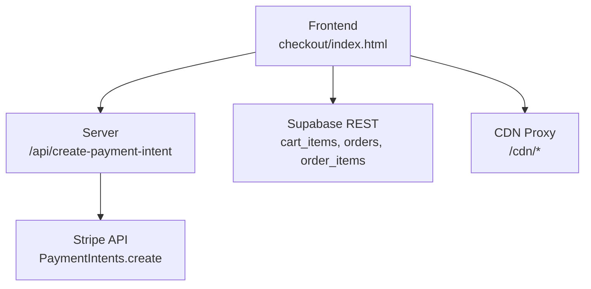
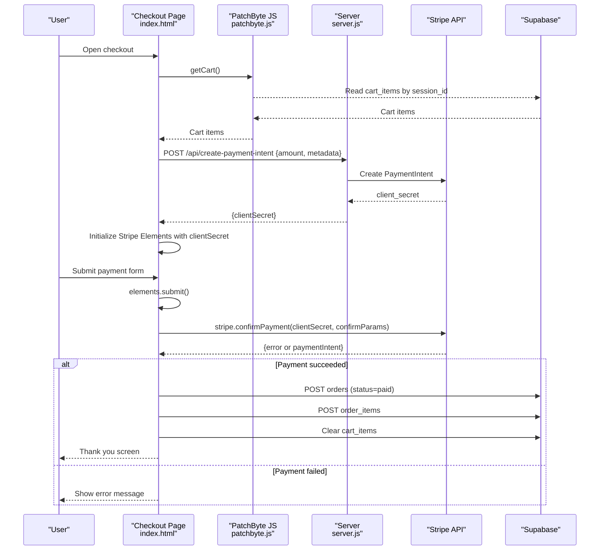
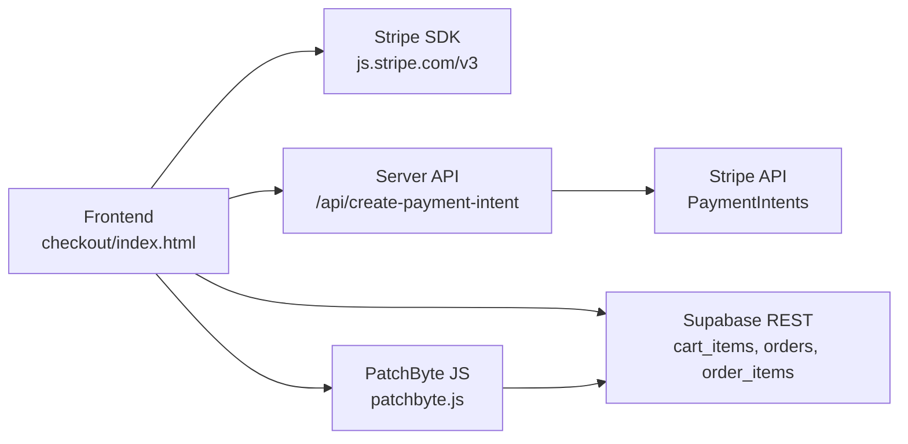

# Payment Processing Errors

<cite>
**Referenced Files in This Document**
- [server.js](file://frontend/server.js)
- [index.html](file://frontend/patchkraze.com/checkout/index.html)
- [patchbyte.js](file://frontend/js/patchbyte.js)
- [.env.example](file://.env.example)
- [migrate-tables.sql](file://migrate-tables.sql)
- [vercel.json](file://vercel.json)
</cite>

## Table of Contents
1. [Introduction](#introduction)
2. [Project Structure](#project-structure)
3. [Core Components](#core-components)
4. [Architecture Overview](#architecture-overview)
5. [Detailed Component Analysis](#detailed-component-analysis)
6. [Dependency Analysis](#dependency-analysis)
7. [Performance Considerations](#performance-considerations)
8. [Troubleshooting Guide](#troubleshooting-guide)
9. [Conclusion](#conclusion)
10. [Appendices](#appendices)

## Introduction
This document provides comprehensive troubleshooting guidance for payment processing issues in the Patch-Byte application. It focuses on Stripe integration problems (API key configuration, webhook endpoints, and payment intent creation), checkout flow debugging, session management errors, cart synchronization between frontend and backend, payment confirmation failures, order creation problems, and database transaction errors. It also includes testing strategies using Stripe test mode, monitoring techniques for success rates and error tracking, customer support workflows, and security considerations for handling sensitive payment data and PCI compliance.

## Project Structure
The payment system spans a small server, a checkout page, a client-side cart/session manager, and a Supabase-backed database schema:
- Server exposes Stripe-related endpoints and serves static assets.
- Checkout page initializes Stripe Elements, creates a PaymentIntent via the server, confirms payment, and persists orders to Supabase.
- Client script manages cart items, session IDs, and fetch interception to integrate with Supabase.
- Database migration defines tables and row-level security policies for cart, orders, and order items.
- Deployment configuration rewrites requests to the serverless function.

**Diagram sources**
- [server.js:17-44](file://frontend/server.js#L17-L44)
- [index.html:191-212](file://frontend/patchkraze.com/checkout/index.html#L191-L212)
- [index.html:260-351](file://frontend/patchkraze.com/checkout/index.html#L260-L351)
- [patchbyte.js:31-65](file://frontend/js/patchbyte.js#L31-L65)
- [migrate-tables.sql:5-56](file://migrate-tables.sql#L5-L56)

**Section sources**
- [server.js:1-48](file://frontend/server.js#L1-L48)
- [index.html:161-354](file://frontend/patchkraze.com/checkout/index.html#L161-L354)
- [patchbyte.js:1-65](file://frontend/js/patchbyte.js#L1-L65)
- [migrate-tables.sql:1-56](file://migrate-tables.sql#L1-L56)
- [vercel.json:1-12](file://vercel.json#L1-L12)

## Core Components
- Server endpoints:
  - POST /api/create-payment-intent: Creates a Stripe PaymentIntent with amount and metadata.
  - GET /api/stripe-config: Returns the publishable key to initialize Stripe Elements on the frontend.
- Frontend checkout:
  - Initializes Stripe Elements with a client secret from the server.
  - Submits payment via Stripe Elements and confirms payment.
  - Persists orders and order items to Supabase after successful payment.
- Cart and session:
  - Maintains a session ID in localStorage.
  - Intercepts Shopify-style cart calls and syncs items to Supabase.
  - Provides utilities to get, add, update, and clear cart items.

**Section sources**
- [server.js:17-44](file://frontend/server.js#L17-L44)
- [index.html:191-212](file://frontend/patchkraze.com/checkout/index.html#L191-L212)
- [index.html:260-351](file://frontend/patchkraze.com/checkout/index.html#L260-L351)
- [patchbyte.js:19-65](file://frontend/js/patchbyte.js#L19-L65)
- [patchbyte.js:67-111](file://frontend/js/patchbyte.js#L67-L111)

## Architecture Overview
The checkout flow involves multiple steps across frontend, server, Stripe, and Supabase. The following sequence diagram maps the actual code paths used during payment.

**Diagram sources**
- [index.html:191-212](file://frontend/patchkraze.com/checkout/index.html#L191-L212)
- [index.html:260-351](file://frontend/patchkraze.com/checkout/index.html#L260-L351)
- [server.js:17-44](file://frontend/server.js#L17-L44)
- [patchbyte.js:67-111](file://frontend/js/patchbyte.js#L67-L111)

## Detailed Component Analysis

### Stripe Integration: API Key Configuration Errors
Symptoms:
- Frontend cannot initialize Stripe Elements; button disabled; error shown that payment system is not configured.
- Server returns “Stripe is not configured on the server.” when creating PaymentIntent.

Root causes:
- Missing or invalid environment variables for Stripe keys.
- Publishable key not exposed by /api/stripe-config.
- Secret key missing on server prevents PaymentIntent creation.

Debugging steps:
- Verify environment variables are set in your hosting dashboard (Vercel/Netlify).
- Confirm /api/stripe-config returns a non-empty publishableKey.
- Ensure server logs show no “Stripe is not configured” response.

Resolution:
- Set STRIPE_SECRET_KEY and STRIPE_PUBLISHABLE_KEY in environment variables.
- Restart deployment if necessary.
- Use test keys during development to avoid real charges.

**Section sources**
- [server.js:6-9](file://frontend/server.js#L6-L9)
- [server.js:17-44](file://frontend/server.js#L17-L44)
- [index.html:191-212](file://frontend/patchkraze.com/checkout/index.html#L191-L212)
- [.env.example:1-8](file://.env.example#L1-L8)

### Webhook Endpoint Failures
Observation:
- No webhook endpoint is implemented in this repository. Orders are created directly after successful client-side confirmation.

Implications:
- If relying on webhooks for order reconciliation or async events, they will not be processed.
- For robustness, consider adding a webhook handler to confirm payments server-side and handle asynchronous states.

Recommendations:
- Add a webhook endpoint to verify signatures and process events like payment_intent.succeeded.
- Update order status based on webhook events rather than only client-side confirmation.

**Section sources**
- [server.js:17-44](file://frontend/server.js#L17-L44)
- [index.html:260-351](file://frontend/patchkraze.com/checkout/index.html#L260-L351)

### Payment Intent Creation Issues
Symptoms:
- Error responses from /api/create-payment-intent with messages such as “Invalid amount.”
- Network errors or timeouts when calling the endpoint.

Common causes:
- Invalid or zero/negative amount passed from frontend.
- Missing or invalid Stripe secret key on server.
- Network connectivity issues to Stripe API.

Debugging steps:
- Inspect network tab for request payload and response body.
- Check server logs for “[Stripe] create-payment-intent error”.
- Validate amount conversion to cents and ensure it is positive.

Resolution:
- Ensure frontend sends correct total in cents.
- Confirm server has valid STRIPE_SECRET_KEY.
- Retry with exponential backoff for transient network errors.

**Section sources**
- [server.js:17-39](file://frontend/server.js#L17-L39)
- [index.html:200-212](file://frontend/patchkraze.com/checkout/index.html#L200-L212)

### Checkout Flow Problems
Symptoms:
- “Payment form is not ready. Please wait or refresh.”
- “Could not load payment form.”
- Button remains disabled after initialization.

Likely causes:
- Stripe library not loaded or delayed.
- Missing publishable key from /api/stripe-config.
- Failed to create PaymentIntent or mount Elements.

Debugging steps:
- Wait for Stripe library before initializing Elements.
- Log errors from Stripe initialization and confirm clientSecret retrieval.
- Ensure DOM element #pb-payment-element exists before mounting.

Resolution:
- Improve loading guard for Stripe library.
- Provide user feedback and retry mechanism if initialization fails.
- Validate environment configuration for publishable key.

**Section sources**
- [index.html:181-212](file://frontend/patchkraze.com/checkout/index.html#L181-L212)
- [index.html:219-258](file://frontend/patchkraze.com/checkout/index.html#L219-L258)

### Session Management Errors
Symptoms:
- Cart appears empty at checkout despite adding items earlier.
- Orders created without linking to previous cart items.

Causes:
- Session ID not persisted or cleared unexpectedly.
- LocalStorage blocked or private browsing restrictions.
- Multiple tabs or browsers causing different sessions.

Debugging steps:
- Check localStorage for pb_session value.
- Verify PatchByte.getCart returns items for current session.
- Ensure cart operations use the same session ID consistently.

Resolution:
- Keep session ID stable per browser/storage context.
- Handle storage errors gracefully and inform users.
- Consider server-side session correlation for critical flows.

**Section sources**
- [patchbyte.js:19-29](file://frontend/js/patchbyte.js#L19-L29)
- [patchbyte.js:67-111](file://frontend/js/patchbyte.js#L67-L111)
- [index.html:220-236](file://frontend/patchkraze.com/checkout/index.html#L220-L236)

### Cart Synchronization Between Frontend and Backend
Symptoms:
- Items added via product pages do not appear in checkout.
- Badge count not updating.

Mechanism:
- patchbyte.js intercepts Shopify-style /cart/add calls and writes to Supabase cart_items table.
- Checkout reads cart_items via PatchByte.getCart and computes totals.

Debugging steps:
- Inspect intercepted fetch calls and Supabase responses.
- Verify cart_items rows include product_slug, unit_price, quantity.
- Confirm RLS policies allow anon inserts/reads.

Resolution:
- Ensure Supabase RLS policies permit anonymous access for cart operations.
- Validate field mappings and types in migrate-tables.sql.
- Add logging around cart operations to trace failures.

**Section sources**
- [patchbyte.js:138-163](file://frontend/js/patchbyte.js#L138-L163)
- [patchbyte.js:165-233](file://frontend/js/patchbyte.js#L165-L233)
- [migrate-tables.sql:5-41](file://migrate-tables.sql#L5-L41)

### Payment Confirmation Failures
Symptoms:
- “Payment not completed. Status: …”
- Order not created despite payment attempt.

Causes:
- elements.submit() returned an error.
- stripe.confirmPayment returned an error or non-succeeded status.
- Network interruption during confirmation.

Debugging steps:
- Capture and log submitError and confirmError messages.
- Inspect paymentIntent.status after confirmation.
- Check return_url behavior and redirect handling.

Resolution:
- Improve error messaging and retry options.
- Handle 3D Secure redirects appropriately.
- Persist partial state to recover from interruptions.

**Section sources**
- [index.html:286-307](file://frontend/patchkraze.com/checkout/index.html#L286-L307)

### Order Creation Problems
Symptoms:
- Orders not recorded in Supabase after successful payment.
- Order items missing or incorrect.

Causes:
- Supabase insert failed due to RLS or schema mismatch.
- Missing required fields in order payload.
- Network errors to Supabase.

Debugging steps:
- Validate Supabase URL and anon key usage in patchbyte.js.
- Check Supabase logs for insert errors.
- Ensure migrate-tables.sql applied correctly.

Resolution:
- Apply migrations and verify RLS policies.
- Add retries and detailed error reporting for order creation.
- Include idempotency keys to prevent duplicate orders.

**Section sources**
- [index.html:309-337](file://frontend/patchkraze.com/checkout/index.html#L309-L337)
- [migrate-tables.sql:12-27](file://migrate-tables.sql#L12-L27)
- [migrate-tables.sql:36-56](file://migrate-tables.sql#L36-L56)

### Database Transaction Errors
Symptoms:
- Inconsistent state between orders and order_items.
- Partial writes leading to orphaned records.

Considerations:
- Current implementation performs separate Supabase calls for orders and order_items.
- No explicit transaction wrapping is visible in the code.

Recommendations:
- Implement server-side orchestration to group order creation and item insertion atomically.
- Use idempotency keys and check for existing orders before inserting.
- Add compensating actions to clean up partial state on failure.

**Section sources**
- [index.html:309-337](file://frontend/patchkraze.com/checkout/index.html#L309-L337)

## Dependency Analysis
The payment flow depends on several components and external services. Understanding these relationships helps isolate failures quickly.

**Diagram sources**
- [index.html:10-11](file://frontend/patchkraze.com/checkout/index.html#L10-L11)
- [index.html:191-212](file://frontend/patchkraze.com/checkout/index.html#L191-L212)
- [server.js:17-44](file://frontend/server.js#L17-L44)
- [patchbyte.js:31-65](file://frontend/js/patchbyte.js#L31-L65)

**Section sources**
- [index.html:161-354](file://frontend/patchkraze.com/checkout/index.html#L161-L354)
- [server.js:1-48](file://frontend/server.js#L1-L48)
- [patchbyte.js:1-65](file://frontend/js/patchbyte.js#L1-L65)

## Performance Considerations
- Minimize round-trips by batching order and order_items creation server-side.
- Cache Stripe publishable key to reduce repeated config calls.
- Debounce cart updates to avoid excessive Supabase writes.
- Use efficient queries for cart retrieval and limit fields to needed columns.

[No sources needed since this section provides general guidance]

## Troubleshooting Guide

### Stripe API Key Configuration Errors
- Symptoms: Payment form disabled; server returns configuration error.
- Steps:
  - Verify environment variables for STRIPE_SECRET_KEY and STRIPE_PUBLISHABLE_KEY.
  - Call /api/stripe-config and confirm publishableKey is present.
  - Check server logs for missing Stripe instance.
- Resolution: Set keys in hosting dashboard; restart deployment; use test keys during development.

**Section sources**
- [server.js:6-9](file://frontend/server.js#L6-L9)
- [server.js:17-44](file://frontend/server.js#L17-L44)
- [index.html:191-212](file://frontend/patchkraze.com/checkout/index.html#L191-L212)
- [.env.example:1-8](file://.env.example#L1-L8)

### Webhook Endpoint Failures
- Observation: No webhook handler exists; orders created client-side.
- Impact: Asynchronous payment events not reconciled server-side.
- Action: Implement webhook verification and event processing; update order status based on events.

**Section sources**
- [server.js:17-44](file://frontend/server.js#L17-L44)
- [index.html:260-351](file://frontend/patchkraze.com/checkout/index.html#L260-L351)

### Payment Intent Creation Issues
- Symptoms: “Invalid amount.” or network errors.
- Steps:
  - Validate amount in cents and ensure positive value.
  - Confirm server has valid STRIPE_SECRET_KEY.
  - Inspect server logs for Stripe errors.
- Resolution: Fix amount calculation; ensure environment configuration; implement retries.

**Section sources**
- [server.js:17-39](file://frontend/server.js#L17-L39)
- [index.html:200-212](file://frontend/patchkraze.com/checkout/index.html#L200-L212)

### Checkout Flow Problems
- Symptoms: “Payment form is not ready”; initialization errors.
- Steps:
  - Ensure Stripe SDK loaded before initialization.
  - Retrieve publishable key from /api/stripe-config.
  - Mount Stripe Elements into #pb-payment-element.
- Resolution: Add loading guards; improve error messages; validate DOM readiness.

**Section sources**
- [index.html:181-212](file://frontend/patchkraze.com/checkout/index.html#L181-L212)
- [index.html:219-258](file://frontend/patchkraze.com/checkout/index.html#L219-L258)

### Session Management Errors
- Symptoms: Empty cart at checkout; inconsistent session.
- Steps:
  - Check localStorage for pb_session.
  - Verify PatchByte.getCart returns items for current session.
  - Ensure consistent session usage across tabs.
- Resolution: Stabilize session ID; handle storage errors; consider server-side correlation.

**Section sources**
- [patchbyte.js:19-29](file://frontend/js/patchbyte.js#L19-L29)
- [patchbyte.js:67-111](file://frontend/js/patchbyte.js#L67-L111)
- [index.html:220-236](file://frontend/patchkraze.com/checkout/index.html#L220-L236)

### Cart Synchronization Between Frontend and Backend
- Symptoms: Items not appearing in checkout; badge not updating.
- Steps:
  - Inspect intercepted fetch calls and Supabase responses.
  - Verify cart_items schema and RLS policies.
- Resolution: Apply migrations; ensure RLS allows anon access; add logging.

**Section sources**
- [patchbyte.js:138-163](file://frontend/js/patchbyte.js#L138-L163)
- [patchbyte.js:165-233](file://frontend/js/patchbyte.js#L165-L233)
- [migrate-tables.sql:5-41](file://migrate-tables.sql#L5-L41)

### Payment Confirmation Failures
- Symptoms: Non-succeeded paymentIntent; order not created.
- Steps:
  - Capture submitError and confirmError.
  - Inspect paymentIntent.status.
  - Handle 3D Secure redirects properly.
- Resolution: Improve error handling; add retry logic; persist partial state.

**Section sources**
- [index.html:286-307](file://frontend/patchkraze.com/checkout/index.html#L286-L307)

### Order Creation Problems
- Symptoms: Orders missing; order_items incomplete.
- Steps:
  - Validate Supabase credentials and RLS policies.
  - Check migrate-tables.sql application.
- Resolution: Apply migrations; add retries; include idempotency keys.

**Section sources**
- [index.html:309-337](file://frontend/patchkraze.com/checkout/index.html#L309-L337)
- [migrate-tables.sql:12-27](file://migrate-tables.sql#L12-L27)
- [migrate-tables.sql:36-56](file://migrate-tables.sql#L36-L56)

### Database Transaction Errors
- Symptoms: Orphaned records; inconsistent state.
- Steps:
  - Review order and order_items creation sequence.
- Resolution: Implement server-side atomic transactions; add compensating actions.

**Section sources**
- [index.html:309-337](file://frontend/patchkraze.com/checkout/index.html#L309-L337)

### Testing Strategies Using Stripe Test Mode and Sandbox
- Use Stripe test keys (pk_test_*, sk_test_*) in environment variables.
- Simulate payment methods provided by Stripe (e.g., test cards).
- Validate error scenarios (declined cards, 3D Secure) using test cases.
- Confirm order creation and cart clearing in test mode.

[No sources needed since this section provides general guidance]

### Monitoring Techniques for Success Rates, Error Tracking, and Support Workflows
- Track metrics:
  - PaymentIntent creation success/failure rates.
  - Stripe confirmation success/failure rates.
  - Order creation success/failure rates.
- Error tracking:
  - Log errors from server and frontend with context (session_id, amount, status).
  - Correlate errors with Stripe event IDs when available.
- Support workflows:
  - Provide order reference numbers to customers.
  - Enable lookup by session_id and email for manual reconciliation.

[No sources needed since this section provides general guidance]

### Security Considerations and PCI Compliance
- Do not handle raw card data on your servers; rely on Stripe Elements and PaymentMethods.
- Store minimal sensitive data; avoid logging card details or full PANs.
- Use HTTPS for all endpoints and enforce secure headers.
- Restrict environment variables and secrets to runtime environments only.
- Ensure RLS policies on Supabase are least-privilege and validated.

[No sources needed since this section provides general guidance]

## Conclusion
The Patch-Byte payment flow integrates Stripe Elements with a lightweight server and Supabase for cart and order persistence. Most issues stem from misconfiguration of environment variables, incomplete initialization of Stripe Elements, and inconsistencies between frontend cart state and backend storage. By validating API keys, ensuring proper session management, improving error handling, and implementing server-side transactional guarantees, you can significantly reduce payment failures and improve reliability. Adopting test mode, monitoring, and strong security practices will further stabilize the system and support effective customer service.

[No sources needed since this section summarizes without analyzing specific files]

## Appendices

### Environment Variables Reference
- STRIPE_SECRET_KEY: Server-side secret for Stripe API calls.
- STRIPE_PUBLISHABLE_KEY: Frontend key to initialize Stripe Elements.
- SUPABASE_URL and SUPABASE_ANON_KEY: Used by patchbyte.js to access Supabase REST API.

**Section sources**
- [.env.example:1-8](file://.env.example#L1-L8)

### Deployment Notes
- Vercel rewrites route to api/index.js which delegates to frontend/server.js.
- Static assets and HTML are served from patchkraze.com directory.

**Section sources**
- [vercel.json:1-12](file://vercel.json#L1-L12)
- [server.js:46-114](file://frontend/server.js#L46-L114)