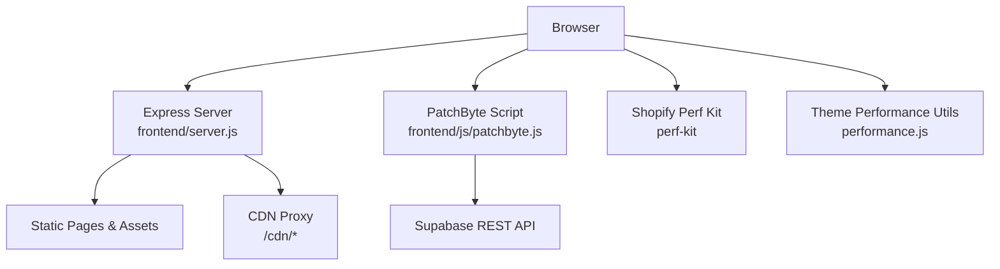
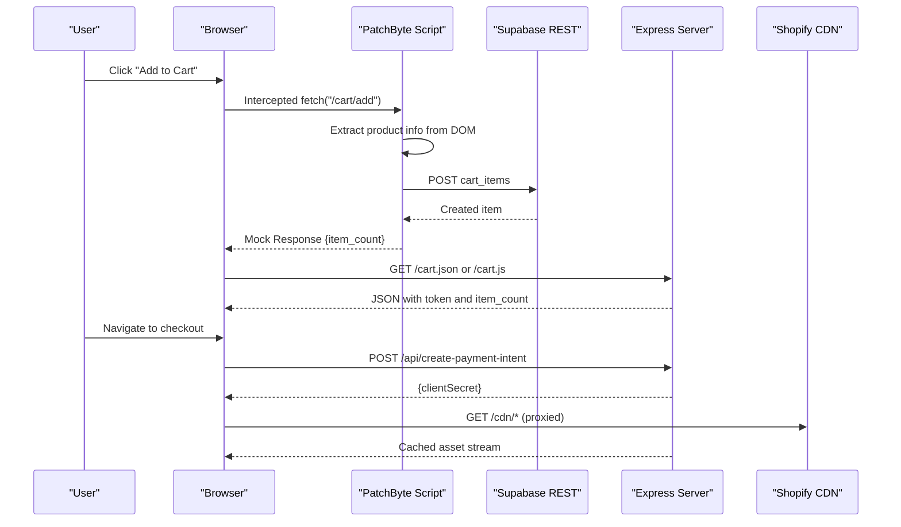
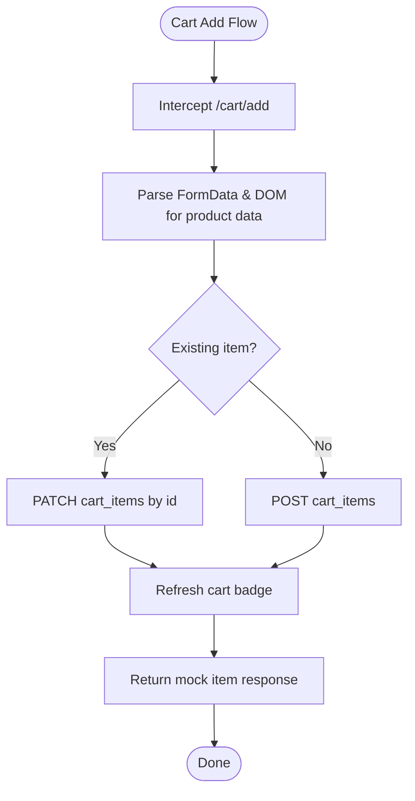
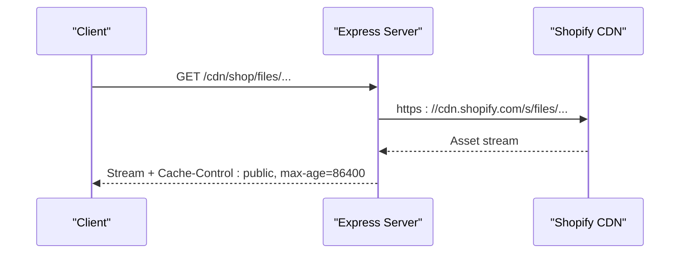
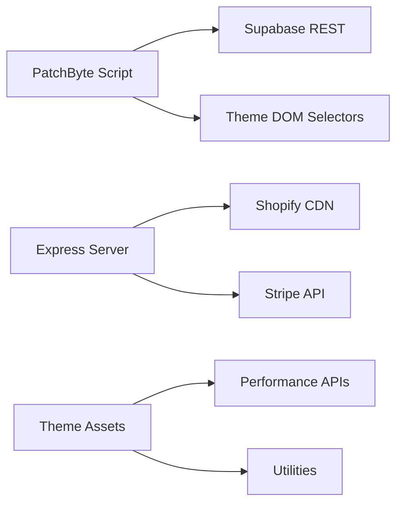

# Performance Optimization

<cite>
**Referenced Files in This Document**
- [patchbyte.js](file://frontend/js/patchbyte.js)
- [server.js](file://frontend/server.js)
- [performance.js](file://frontend/cdn/shop/t/38/assets/performance.js)
- [utilities.js](file://frontend/cdn/shop/t/38/assets/utilities.js)
- [component.js](file://frontend/cdn/shop/t/38/assets/component.js)
- [media.js](file://frontend/cdn/shop/t/38/assets/media.js)
- [product-card.js](file://frontend/cdn/shop/t/38/assets/product-card.js)
- [vercel.json](file://vercel.json)
- [netlify.toml](file://netlify.toml)
- [package.json](file://package.json)
</cite>

## Table of Contents
1. Introduction
2. Project Structure
3. Core Components
4. Architecture Overview
5. Detailed Component Analysis
6. Dependency Analysis
7. Performance Considerations
8. Troubleshooting Guide
9. Conclusion
10. Appendices

## Introduction
This document provides performance optimization and monitoring guidance for the Patch-Byte application. It focuses on profiling the PatchByte integration layer, server response times, and database queries; optimizing JavaScript bundle size and asset loading; improving CDN caching effectiveness; detecting memory leaks and tuning garbage collection; implementing robust monitoring; and planning load capacity. It also covers caching strategies, lazy loading, and progressive enhancement to improve user experience.

## Project Structure
The application consists of:
- A Node/Express server that serves static pages and proxies Shopify CDN assets
- A client-side PatchByte script that intercepts cart interactions and routes them to Supabase
- Theme assets with built-in performance utilities and components
- Platform configurations for Vercel and Netlify

**Diagram sources**
- [server.js:17-65](file://frontend/server.js#L17-L65)
- [patchbyte.js:31-65](file://frontend/js/patchbyte.js#L31-L65)
- [performance.js:1-62](file://frontend/cdn/shop/t/38/assets/performance.js#L1-L62)

**Section sources**
- [server.js:1-123](file://frontend/server.js#L1-L123)
- [vercel.json:1-12](file://vercel.json#L1-L12)
- [netlify.toml:1-165](file://netlify.toml#L1-L165)

## Core Components
- PatchByte integration layer (client): Intercepts fetch calls for cart operations, persists cart state to Supabase, updates UI badges, and wires contact forms.
- Express server: Serves static content, handles Stripe payment intent creation, and proxies Shopify CDN assets with cache headers.
- Theme performance utilities: Provides performance marks/measures, debouncing/throttling, idle scheduling, and view transitions helpers.
- Media and product components: Implement deferred media loading, variant handling, and image preloading strategies.

Key responsibilities:
- Minimize network requests by intercepting and batching where possible
- Ensure efficient DOM updates and event handling
- Use platform-native performance APIs for measurement
- Cache aggressively via CDN proxy and appropriate headers

**Section sources**
- [patchbyte.js:19-163](file://frontend/js/patchbyte.js#L19-L163)
- [server.js:17-65](file://frontend/server.js#L17-L65)
- [performance.js:1-62](file://frontend/cdn/shop/t/38/assets/performance.js#L1-L62)
- [utilities.js:62-82](file://frontend/cdn/shop/t/38/assets/utilities.js#L62-L82)
- [media.js:20-94](file://frontend/cdn/shop/t/38/assets/media.js#L20-L94)

## Architecture Overview
The runtime flow centers around three paths:
- Cart add/change/update interception by PatchByte, which reads product metadata from the page and persists to Supabase
- Server-side Stripe PaymentIntent creation and CDN asset proxying
- Theme-level performance measurement and resource scheduling

**Diagram sources**
- [patchbyte.js:140-163](file://frontend/js/patchbyte.js#L140-L163)
- [patchbyte.js:165-233](file://frontend/js/patchbyte.js#L165-L233)
- [server.js:17-44](file://frontend/server.js#L17-L44)
- [server.js:50-65](file://frontend/server.js#L50-L65)

## Detailed Component Analysis

### PatchByte Integration Layer
Responsibilities:
- Session management using localStorage
- Supabase REST helpers (GET/POST/PATCH/DELETE)
- Cart CRUD operations and badge updates
- Fetch interception for cart endpoints
- Contact form submission to Supabase
- Toast notifications and cart icon wiring

Performance considerations:
- Avoid unnecessary re-renders by updating only badge elements
- Use minimal payload for cart updates
- Handle errors silently for non-critical UI updates (badge refresh)
- Centralize headers and URL construction to reduce overhead

Optimization opportunities:
- Debounce rapid quantity changes if needed
- Batch multiple cart updates when possible
- Add request timing metrics using performance.mark/measure

Monitoring hooks:
- Wrap sbGet/sbPost/sbPatch/sbDelete with timing markers
- Track error rates per endpoint
- Log slow Supabase responses (>500ms)

**Diagram sources**
- [patchbyte.js:140-163](file://frontend/js/patchbyte.js#L140-L163)
- [patchbyte.js:165-233](file://frontend/js/patchbyte.js#L165-L233)
- [patchbyte.js:69-111](file://frontend/js/patchbyte.js#L69-L111)

**Section sources**
- [patchbyte.js:19-163](file://frontend/js/patchbyte.js#L19-L163)
- [patchbyte.js:165-233](file://frontend/js/patchbyte.js#L165-L233)
- [patchbyte.js:237-263](file://frontend/js/patchbyte.js#L237-L263)

### Express Server
Responsibilities:
- Serve static pages under patchkraze.com
- Proxy /cdn/* to Shopify CDN with cache headers
- Provide Stripe PaymentIntent endpoint and publishable key config
- Redirect legacy URLs and clean URLs

Performance considerations:
- Set Cache-Control for proxied assets to leverage browser caching
- Keep server logic lightweight; offload heavy work to edge/CDN
- Use streaming for large assets via pipe

Optimization opportunities:
- Add response time headers for observability
- Introduce rate limiting for sensitive endpoints
- Compress responses (gzip/br) at reverse proxy level

Monitoring hooks:
- Log request latency per route
- Track Stripe errors and invalid amounts
- Count CDN proxy misses vs hits

**Diagram sources**
- [server.js:50-65](file://frontend/server.js#L50-L65)

**Section sources**
- [server.js:17-44](file://frontend/server.js#L17-L44)
- [server.js:50-65](file://frontend/server.js#L50-L65)
- [server.js:67-111](file://frontend/server.js#L67-L111)

### Theme Performance Utilities
Capabilities:
- Create performance marks and measures for custom benchmarks
- Debounce and throttle utility functions
- Request idle/yield scheduling
- View transition helpers and reduced motion support
- Image preloading helper

Usage recommendations:
- Mark critical user journeys (e.g., cart add, checkout start)
- Throttle scroll/resize handlers
- Defer non-critical tasks with requestIdleCallback
- Respect prefers-reduced-motion for animations

**Section sources**
- [performance.js:1-62](file://frontend/cdn/shop/t/38/assets/performance.js#L1-L62)
- [utilities.js:62-82](file://frontend/cdn/shop/t/38/assets/utilities.js#L62-L82)
- [utilities.js:30-49](file://frontend/cdn/shop/t/38/assets/utilities.js#L30-L49)
- [utilities.js:232-235](file://frontend/cdn/shop/t/38/assets/utilities.js#L232-L235)

### Media and Product Components
- DeferredMedia loads media templates on demand, pauses/resumes playback, and cleans up listeners on disconnect
- ProductCard manages variant selection, image previews, and preloads next images to avoid flashes
- Both use component base class with lifecycle hooks and mutation observers

Optimization highlights:
- Lazy-load heavy media until interaction
- Preload next slide images to reduce perceived latency
- Clean up event listeners and abort controllers to prevent leaks

**Section sources**
- [media.js:20-94](file://frontend/cdn/shop/t/38/assets/media.js#L20-L94)
- [media.js:157-260](file://frontend/cdn/shop/t/38/assets/media.js#L157-L260)
- [product-card.js:101-118](file://frontend/cdn/shop/t/38/assets/product-card.js#L101-L118)
- [component.js:15-63](file://frontend/cdn/shop/t/38/assets/component.js#L15-L63)

## Dependency Analysis
- PatchByte depends on:
  - Browser APIs: fetch, localStorage, crypto.randomUUID
  - Supabase REST API (URL and key embedded in script)
  - DOM structure of Shopify theme for selectors
- Express server depends on:
  - Environment variables for Stripe keys
  - File system for static serving
  - Shopify CDN for asset proxying
- Theme assets depend on:
  - Native performance APIs
  - Optional Shopify features (Model Viewer, perf kit)

Potential coupling risks:
- Tight coupling to Shopify DOM classes may break with theme updates
- Hardcoded Supabase credentials in client script require careful rotation and least-privilege policies

Mitigations:
- Abstract selectors behind configuration or data attributes
- Validate environment variables and fail fast with clear errors
- Use feature detection and graceful degradation

**Section sources**
- [patchbyte.js:10-17](file://frontend/js/patchbyte.js#L10-L17)
- [patchbyte.js:140-163](file://frontend/js/patchbyte.js#L140-L163)
- [server.js:1-12](file://frontend/server.js#L1-L12)
- [server.js:17-44](file://frontend/server.js#L17-L44)

## Performance Considerations

### Profiling Techniques
- PatchByte integration layer:
  - Wrap Supabase calls with performance marks to measure latency
  - Instrument addToCart/updateCartItem flows to identify slow paths
  - Track error rates and payloads sizes
- Server response times:
  - Add response-time headers and log per-route durations
  - Monitor CDN proxy throughput and error rates
- Database queries:
  - Measure Supabase REST call durations and failure rates
  - Profile cart query patterns (e.g., repeated getCart calls)

Implementation pointers:
- Use performance.mark/measure around critical sections
- Emit metrics via analytics beacon or logging service
- Correlate frontend metrics with backend logs using correlation IDs

[No sources needed since this section provides general guidance]

### JavaScript Bundle Size Optimization
- Tree-shake unused code and prefer modular imports
- Defer non-critical scripts and use module loading strategically
- Remove redundant polyfills; rely on modern browsers where feasible
- Analyze vendor bundles and exclude unused features

[No sources needed since this section provides general guidance]

### Asset Loading Performance
- Leverage lazy loading for images and deferred media
- Preload critical resources and next-slide images
- Use responsive images and appropriate formats

Evidence in codebase:
- Deferred media component defers loading until interaction
- Product card preloads next preview image
- Utilities include preloadImage helper

**Section sources**
- [media.js:62-94](file://frontend/cdn/shop/t/38/assets/media.js#L62-L94)
- [product-card.js:101-118](file://frontend/cdn/shop/t/38/assets/product-card.js#L101-L118)
- [utilities.js:232-235](file://frontend/cdn/shop/t/38/assets/utilities.js#L232-L235)

### CDN Caching Effectiveness
- The server sets Cache-Control for proxied assets to enable browser caching
- Netlify/Vercel rewrites ensure consistent CDN access patterns
- Ensure immutable caching for hashed assets and versioned URLs

**Section sources**
- [server.js:50-65](file://frontend/server.js#L50-L65)
- [netlify.toml:135-165](file://netlify.toml#L135-L165)
- [vercel.json:4-11](file://vercel.json#L4-L11)

### Memory Leak Detection and Garbage Collection Tuning
- Ensure event listeners are removed on component disconnect
- Abort ongoing requests and cancel timers on cleanup
- Avoid long-lived closures capturing large DOM nodes

Evidence in codebase:
- Component base disconnects MutationObserver
- DeferredMedia uses AbortController and removes listeners on disconnect
- Product model cancels Model Viewer UI on pause/disconnect

**Section sources**
- [component.js:35-37](file://frontend/cdn/shop/t/38/assets/component.js#L35-L37)
- [media.js:39-42](file://frontend/cdn/shop/t/38/assets/media.js#L39-L42)
- [media.js:170-173](file://frontend/cdn/shop/t/38/assets/media.js#L170-L173)

### Resource Cleanup Procedures
- Disconnect observers and remove global event listeners
- Clear timeouts/intervals and abort fetches
- Release references to DOM nodes and large objects

**Section sources**
- [component.js:35-37](file://frontend/cdn/shop/t/38/assets/component.js#L35-L37)
- [media.js:39-42](file://frontend/cdn/shop/t/38/assets/media.js#L39-L42)

### Monitoring Tools and Techniques
- Frontend:
  - Use Performance Observer and Shopify Perf Kit for core web vitals
  - Add custom marks/measures for business-critical flows
- Backend:
  - Log request latencies and error rates
  - Track Stripe API success/failure and response times
- Database:
  - Monitor Supabase REST latency and error rates
  - Alert on high error rates or slow queries

[No sources needed since this section provides general guidance]

### Load Testing and Capacity Planning
- Simulate cart add/update bursts to validate Supabase limits and UI responsiveness
- Stress test Stripe PaymentIntent endpoint with realistic payloads
- Measure CDN proxy throughput and cache hit ratios
- Plan capacity based on peak concurrent users and average request sizes

[No sources needed since this section provides general guidance]

### Caching Strategies
- Client-side:
  - Cache session ID locally
  - Debounce frequent UI updates
- Server-side:
  - Set Cache-Control for CDN-proxied assets
  - Use redirects to minimize dynamic processing

**Section sources**
- [patchbyte.js:21-29](file://frontend/js/patchbyte.js#L21-L29)
- [server.js:50-65](file://frontend/server.js#L50-L65)

### Lazy Loading Implementations
- Defer media until user interaction
- Preload next images during hover or navigation
- Use intersection observers for below-the-fold content

**Section sources**
- [media.js:62-94](file://frontend/cdn/shop/t/38/assets/media.js#L62-L94)
- [product-card.js:101-118](file://frontend/cdn/shop/t/38/assets/product-card.js#L101-L118)

### Progressive Enhancement Techniques
- Gracefully degrade when features like view transitions are unavailable
- Respect reduced motion preferences
- Fallback to basic functionality when JS fails

**Section sources**
- [utilities.js:30-49](file://frontend/cdn/shop/t/38/assets/utilities.js#L30-L49)
- [utilities.js:83-86](file://frontend/cdn/shop/t/38/assets/utilities.js#L83-L86)

## Dependency Analysis

**Diagram sources**
- [patchbyte.js:31-65](file://frontend/js/patchbyte.js#L31-L65)
- [server.js:17-65](file://frontend/server.js#L17-L65)
- [performance.js:1-62](file://frontend/cdn/shop/t/38/assets/performance.js#L1-L62)

**Section sources**
- [patchbyte.js:31-65](file://frontend/js/patchbyte.js#L31-L65)
- [server.js:17-65](file://frontend/server.js#L17-L65)
- [performance.js:1-62](file://frontend/cdn/shop/t/38/assets/performance.js#L1-L62)

## Performance Considerations
- Prioritize measuring real-user metrics and correlating with backend logs
- Optimize first meaningful paint by deferring non-critical scripts
- Reduce main-thread work with requestIdleCallback and throttling
- Ensure CDN caching is effective for static assets and media

[No sources needed since this section provides general guidance]

## Troubleshooting Guide
Common issues and resolutions:
- Cart add failures:
  - Validate Supabase connectivity and permissions
  - Check DOM selectors for product metadata extraction
  - Inspect intercepted fetch payloads and responses
- Slow badge updates:
  - Ensure getCart is not called excessively
  - Debounce rapid quantity changes
- CDN proxy 404s:
  - Verify Shopify CDN paths and rewrite rules
  - Confirm Cache-Control headers are set
- Stripe errors:
  - Validate amount and currency
  - Check environment variables for keys

Diagnostic steps:
- Use browser DevTools Network panel to inspect timings
- Add performance marks around critical functions
- Log server-side errors with context (amount, metadata)

**Section sources**
- [patchbyte.js:165-233](file://frontend/js/patchbyte.js#L165-L233)
- [server.js:17-44](file://frontend/server.js#L17-L44)
- [server.js:50-65](file://frontend/server.js#L50-L65)

## Conclusion
The Patch-Byte application leverages a lightweight client-side integration layer, an Express server for payments and CDN proxying, and theme utilities for performance measurement and resource scheduling. By instrumenting key flows, optimizing asset delivery, enforcing caching, and implementing robust cleanup practices, you can achieve responsive user experiences and scalable performance. Continuous monitoring and load testing will help maintain reliability as traffic grows.

[No sources needed since this section summarizes without analyzing specific files]

## Appendices

### Configuration Summary
- Vercel function includes static HTML and theme assets; rewrites route all requests through the API handler
- Netlify defines redirects, clean URLs, and CDN proxies with force flags
- Package dependencies include Express, Stripe, and dotenv

**Section sources**
- [vercel.json:4-11](file://vercel.json#L4-L11)
- [netlify.toml:94-165](file://netlify.toml#L94-L165)
- [package.json:9-13](file://package.json#L9-L13)