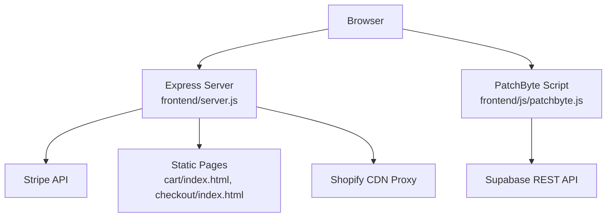
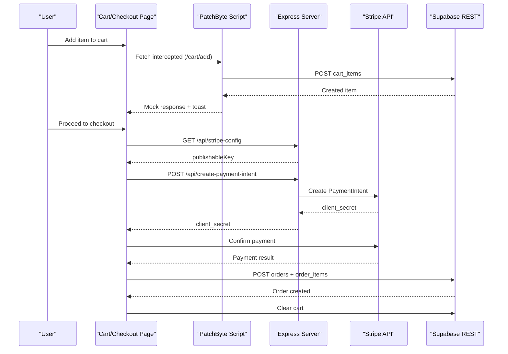
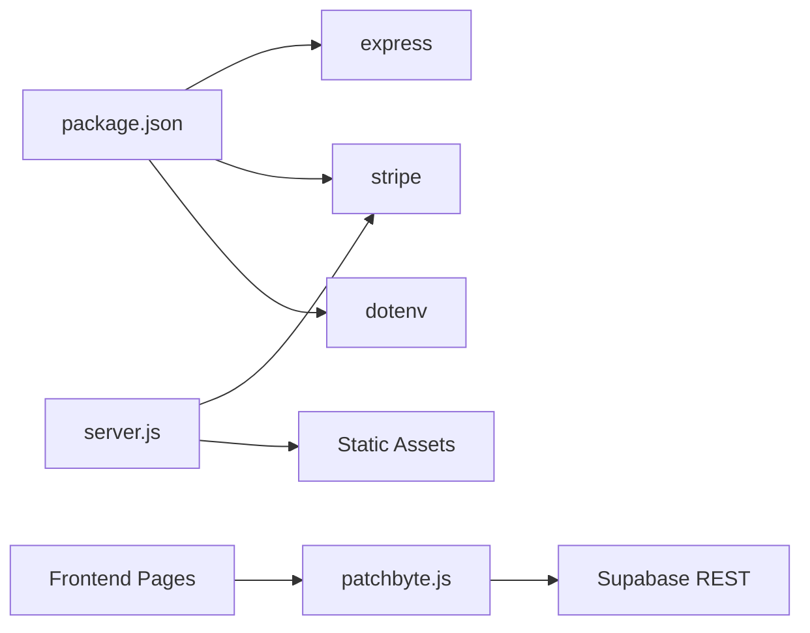

# Troubleshooting Guide

<cite>
**Referenced Files in This Document**
- [frontend/server.js](file://frontend/server.js)
- [api/index.js](file://api/index.js)
- [frontend/js/patchbyte.js](file://frontend/js/patchbyte.js)
- [frontend/patchkraze.com/cart/index.html](file://frontend/patchkraze.com/cart/index.html)
- [frontend/patchkraze.com/checkout/index.html](file://frontend/patchkraze.com/checkout/index.html)
- [migrate-tables.sql](file://migrate-tables.sql)
- [vercel.json](file://vercel.json)
- [netlify.toml](file://netlify.toml)
- [package.json](file://package.json)
- [frontend/package.json](file://frontend/package.json)
</cite>

## Table of Contents
1. [Introduction](#introduction)
2. [Project Structure](#project-structure)
3. [Core Components](#core-components)
4. [Architecture Overview](#architecture-overview)
5. [Detailed Component Analysis](#detailed-component-analysis)
6. [Dependency Analysis](#dependency-analysis)
7. [Performance Considerations](#performance-considerations)
8. [Troubleshooting Guide](#troubleshooting-guide)
9. [Conclusion](#conclusion)
10. [Appendices](#appendices)

## Introduction
This guide provides comprehensive troubleshooting for the Patch-Byte application across development, deployment, and production. It focuses on:
- Debugging the PatchByte integration layer (Supabase cart, contact submissions, and checkout flow)
- Diagnosing payment processing errors with Stripe
- Resolving database connectivity and schema issues
- Analyzing logs to identify performance bottlenecks and errors
- Fixing environment configuration, dependency conflicts, and third-party integrations
- Monitoring and alerting strategies for production
- Performance optimization techniques and memory leak detection
- Step-by-step resolution guides for frequently reported issues with before-and-after examples

## Project Structure
The application is a hybrid static site with a small Node server for payments and CDN proxying, plus a browser-side integration that intercepts Shopify-style cart calls and persists data to Supabase.

Key components:
- Server: Express app serving static pages, proxying Shopify CDN assets, and handling Stripe PaymentIntent creation
- Frontend integration: A script injected into pages that intercepts fetch calls to route cart operations to Supabase
- Static pages: Cart and Checkout UIs built as HTML with inline scripts
- Database: Supabase tables for cart items, orders, order items, and contact submissions
- Deployment configs: Vercel functions and Netlify redirects/proxies

**Diagram sources**
- [frontend/server.js:17-65](file://frontend/server.js#L17-L65)
- [frontend/js/patchbyte.js:33-65](file://frontend/js/patchbyte.js#L33-L65)
- [frontend/patchkraze.com/cart/index.html:95-182](file://frontend/patchkraze.com/cart/index.html#L95-L182)
- [frontend/patchkraze.com/checkout/index.html:161-354](file://frontend/patchkraze.com/checkout/index.html#L161-L354)

**Section sources**
- [frontend/server.js:1-123](file://frontend/server.js#L1-L123)
- [frontend/js/patchbyte.js:1-345](file://frontend/js/patchbyte.js#L1-L345)
- [frontend/patchkraze.com/cart/index.html:1-186](file://frontend/patchkraze.com/cart/index.html#L1-L186)
- [frontend/patchkraze.com/checkout/index.html:1-358](file://frontend/patchkraze.com/checkout/index.html#L1-L358)
- [vercel.json:1-12](file://vercel.json#L1-L12)
- [netlify.toml:1-165](file://netlify.toml#L1-L165)

## Core Components
- Express server: Serves static content, proxies Shopify CDN assets, exposes Stripe endpoints
- PatchByte script: Intercepts Shopify cart fetch calls, manages session, performs CRUD on Supabase tables, updates UI badges and toasts
- Cart page: Renders cart items from Supabase, handles quantity changes and removals
- Checkout page: Validates form, initializes Stripe Elements, creates PaymentIntent via server, confirms payment, records orders and order items in Supabase, clears cart

**Section sources**
- [frontend/server.js:17-44](file://frontend/server.js#L17-L44)
- [frontend/js/patchbyte.js:69-111](file://frontend/js/patchbyte.js#L69-L111)
- [frontend/patchkraze.com/cart/index.html:95-182](file://frontend/patchkraze.com/cart/index.html#L95-L182)
- [frontend/patchkraze.com/checkout/index.html:161-354](file://frontend/patchkraze.com/checkout/index.html#L161-L354)

## Architecture Overview
The system integrates three main layers:
- Browser layer: PatchByte script intercepts fetch calls and communicates with Supabase; Cart and Checkout pages render state and handle user interactions
- Server layer: Express serves static pages, proxies CDN assets, and creates Stripe PaymentIntents securely using server-side secret keys
- Data layer: Supabase stores cart items, orders, order items, and contact submissions with Row Level Security policies allowing anonymous access

**Diagram sources**
- [frontend/js/patchbyte.js:142-163](file://frontend/js/patchbyte.js#L142-L163)
- [frontend/js/patchbyte.js:165-233](file://frontend/js/patchbyte.js#L165-L233)
- [frontend/server.js:17-44](file://frontend/server.js#L17-L44)
- [frontend/patchkraze.com/checkout/index.html:191-212](file://frontend/patchkraze.com/checkout/index.html#L191-L212)
- [frontend/patchkraze.com/checkout/index.html:260-351](file://frontend/patchkraze.com/checkout/index.html#L260-L351)

## Detailed Component Analysis

### PatchByte Integration Layer
Responsibilities:
- Session management via localStorage
- Supabase REST helpers for GET, POST, PATCH, DELETE
- Intercept Shopify-style fetch calls to route cart add/update/list to Supabase
- Update cart badge counts and show toast notifications
- Wire contact forms to submit to Supabase

Common issues:
- Supabase URL or key misconfiguration causing network/auth failures
- CORS or RLS policy blocks preventing inserts/updates
- Missing product metadata extraction leading to empty cart items
- DOM selectors failing due to theme changes breaking badge/toast behavior

Debugging techniques:
- Open browser DevTools Console and Network tab to inspect requests to Supabase
- Verify headers include apikey and Authorization Bearer tokens
- Check localStorage for pb_session presence
- Validate Supabase RLS policies allow anon inserts/reads for cart_items and contact_submissions

Resolution steps:
- Ensure Supabase URL and anon key are correct in the script
- Run migration to add required columns and enable RLS policies
- Inspect DOM selectors used to extract product name, price, and image; update if theme changes
- Use console logs prefixed with [PatchByte] to trace execution paths

**Section sources**
- [frontend/js/patchbyte.js:21-65](file://frontend/js/patchbyte.js#L21-L65)
- [frontend/js/patchbyte.js:69-111](file://frontend/js/patchbyte.js#L69-L111)
- [frontend/js/patchbyte.js:142-163](file://frontend/js/patchbyte.js#L142-L163)
- [frontend/js/patchbyte.js:165-233](file://frontend/js/patchbyte.js#L165-L233)
- [frontend/js/patchbyte.js:237-263](file://frontend/js/patchbyte.js#L237-L263)
- [migrate-tables.sql:5-34](file://migrate-tables.sql#L5-L34)
- [migrate-tables.sql:36-57](file://migrate-tables.sql#L36-L57)

### Payment Processing with Stripe
Responsibilities:
- Server endpoint to create PaymentIntent with amount and metadata
- Frontend retrieves publishable key and initializes Stripe Elements
- Confirm payment with billing details and redirect behavior
- On success, record orders and order items in Supabase and clear cart

Common issues:
- Missing or invalid STRIPE_SECRET_KEY or STRIPE_PUBLISHABLE_KEY
- Invalid amount passed to PaymentIntent (must be positive integer cents)
- Stripe Elements not mounted or ready when submitting
- Payment confirmation errors (insufficient funds, card declined, 3D Secure required)
- Orders not recorded due to Supabase write failures

Debugging techniques:
- Check server logs for Stripe errors during PaymentIntent creation
- Validate frontend fetch responses from /api/stripe-config and /api/create-payment-intent
- Inspect Stripe Elements mount and confirmPayment flows in browser DevTools
- Verify Supabase writes for orders and order_items succeed

Resolution steps:
- Configure environment variables for Stripe keys
- Ensure amount is calculated correctly and converted to cents
- Wait for Stripe library to load before initialization
- Handle confirmPayment errors and display user-friendly messages
- Log and retry failed Supabase writes with appropriate error handling

**Section sources**
- [frontend/server.js:17-44](file://frontend/server.js#L17-L44)
- [frontend/patchkraze.com/checkout/index.html:191-212](file://frontend/patchkraze.com/checkout/index.html#L191-L212)
- [frontend/patchkraze.com/checkout/index.html:260-351](file://frontend/patchkraze.com/checkout/index.html#L260-L351)

### Database Connectivity and Schema
Responsibilities:
- Supabase tables for cart_items, orders, order_items, contact_submissions
- Migration adds required columns and enables RLS policies for anonymous access

Common issues:
- Missing columns causing insert failures
- RLS policies blocking anonymous writes
- Incorrect table names or query syntax in Supabase REST calls

Debugging techniques:
- Run migrations in Supabase SQL Editor
- Test queries directly in Supabase dashboard
- Inspect Network tab for 403/401 errors indicating auth/RLS issues

Resolution steps:
- Execute migrate-tables.sql to ensure schema alignment
- Verify RLS policies allow anon access for all operations
- Align Supabase REST endpoints with table names and query parameters used by PatchByte

**Section sources**
- [migrate-tables.sql:5-34](file://migrate-tables.sql#L5-L34)
- [migrate-tables.sql:36-57](file://migrate-tables.sql#L36-L57)
- [frontend/js/patchbyte.js:33-65](file://frontend/js/patchbyte.js#L33-L65)

### Environment Configuration and Deployment
Responsibilities:
- Express server loads .env for local development
- Vercel rewrites routes to API function
- Netlify configures build, redirects, and CDN proxies

Common issues:
- Missing environment variables in deployment platforms
- Route rewrites not matching expected paths
- CDN proxy rules not covering all asset paths

Debugging techniques:
- Check platform-specific environment variable injection
- Validate rewrites and redirects in vercel.json and netlify.toml
- Test CDN proxy paths in browser Network tab

Resolution steps:
- Set STRIPE_SECRET_KEY and STRIPE_PUBLISHABLE_KEY in deployment settings
- Ensure rewrites route all requests to the API function
- Update CDN proxy rules to match actual asset URLs

**Section sources**
- [frontend/server.js:6-12](file://frontend/server.js#L6-L12)
- [vercel.json:1-12](file://vercel.json#L1-L12)
- [netlify.toml:1-165](file://netlify.toml#L1-L165)

### Dependency Management
Responsibilities:
- Node dependencies for Express, Stripe, dotenv
- Engine constraints requiring Node >= 18

Common issues:
- Incompatible Node versions causing runtime errors
- Missing dependencies in deployment environments

Debugging techniques:
- Check package.json engines and dependencies
- Verify installed modules in node_modules
- Review platform build logs for dependency resolution failures

Resolution steps:
- Ensure runtime Node version meets minimum requirement
- Reinstall dependencies locally and in CI/CD pipelines
- Pin versions to avoid unexpected breaks

**Section sources**
- [package.json:1-14](file://package.json#L1-L14)
- [frontend/package.json:1-19](file://frontend/package.json#L1-L19)

## Dependency Analysis
The application has clear separation between server and client responsibilities:
- The server depends on Express, Stripe SDK, and dotenv
- The client depends on the PatchByte script and external libraries like Stripe JS
- Supabase is accessed via REST from the client without server mediation except for PaymentIntent creation

**Diagram sources**
- [package.json:9-13](file://package.json#L9-L13)
- [frontend/package.json:13-17](file://frontend/package.json#L13-L17)
- [frontend/js/patchbyte.js:33-65](file://frontend/js/patchbyte.js#L33-L65)
- [frontend/server.js:1-12](file://frontend/server.js#L1-L12)

**Section sources**
- [package.json:1-14](file://package.json#L1-L14)
- [frontend/package.json:1-19](file://frontend/package.json#L1-L19)
- [frontend/js/patchbyte.js:33-65](file://frontend/js/patchbyte.js#L33-L65)
- [frontend/server.js:1-12](file://frontend/server.js#L1-L12)

## Performance Considerations
- Minimize unnecessary Supabase reads by caching cart count locally where possible
- Debounce rapid quantity updates to reduce network calls
- Use efficient DOM selectors to avoid expensive queries
- Leverage CDN proxy caching headers for static assets
- Monitor Stripe API latency and implement retries with exponential backoff for transient errors
- Profile JavaScript execution in DevTools to identify long tasks blocking UI

[No sources needed since this section provides general guidance]

## Troubleshooting Guide

### Common Issues and Resolutions

#### Issue: Cart add fails silently
Symptoms:
- Item does not appear in cart badge or cart page
- No toast notification shown

Before:
- Supabase URL or key incorrect
- RLS policy blocking inserts
- DOM selectors unable to find product elements

After:
- Corrected Supabase credentials
- Enabled RLS policies for anon access
- Updated selectors to match current theme structure

Steps:
- Verify Supabase URL and anon key in patchbyte.js
- Run migrations to ensure columns exist and RLS policies are enabled
- Inspect Network tab for 403/401 errors
- Check console for [PatchByte] errors

**Section sources**
- [frontend/js/patchbyte.js:21-65](file://frontend/js/patchbyte.js#L21-L65)
- [frontend/js/patchbyte.js:165-233](file://frontend/js/patchbyte.js#L165-L233)
- [migrate-tables.sql:5-34](file://migrate-tables.sql#L5-L34)
- [migrate-tables.sql:36-57](file://migrate-tables.sql#L36-L57)

#### Issue: PaymentIntent creation returns error
Symptoms:
- Checkout shows “Could not initialize payment”
- Server logs contain Stripe errors

Before:
- Missing or invalid STRIPE_SECRET_KEY
- Amount not provided or invalid

After:
- Configured environment variables correctly
- Ensured amount is positive integer cents

Steps:
- Check server logs for Stripe errors
- Validate request payload includes valid amount
- Confirm environment variables are set in deployment platform

**Section sources**
- [frontend/server.js:17-44](file://frontend/server.js#L17-L44)
- [frontend/patchkraze.com/checkout/index.html:191-212](file://frontend/patchkraze.com/checkout/index.html#L191-L212)

#### Issue: Stripe Elements not mounting
Symptoms:
- Payment form not visible
- Submit button disabled

Before:
- Stripe library not loaded
- Publishable key missing

After:
- Stripe script loaded successfully
- Publishable key retrieved from server

Steps:
- Wait for Stripe library to load before initialization
- Retrieve publishable key from /api/stripe-config
- Inspect Network tab for successful script load

**Section sources**
- [frontend/patchkraze.com/checkout/index.html:181-198](file://frontend/patchkraze.com/checkout/index.html#L181-L198)
- [frontend/patchkraze.com/checkout/index.html:238-257](file://frontend/patchkraze.com/checkout/index.html#L238-L257)

#### Issue: Orders not recorded after payment
Symptoms:
- Payment succeeds but no order appears in Supabase

Before:
- Supabase write failed due to RLS or schema mismatch
- Error thrown during confirmPayment

After:
- Migrations executed successfully
- RLS policies allow anon writes
- Error handling displays user message

Steps:
- Verify Supabase writes for orders and order_items
- Check RLS policies and schema alignment
- Inspect console for [PatchByte] checkout errors

**Section sources**
- [frontend/patchkraze.com/checkout/index.html:309-351](file://frontend/patchkraze.com/checkout/index.html#L309-L351)
- [migrate-tables.sql:5-34](file://migrate-tables.sql#L5-L34)
- [migrate-tables.sql:36-57](file://migrate-tables.sql#L36-L57)

#### Issue: CDN assets not loading
Symptoms:
- Images and styles missing
- 404 errors in Network tab

Before:
- CDN proxy rules not covering requested paths
- Local files missing

After:
- Updated Netlify/Vercel redirects to proxy Shopify CDN paths
- Verified proxy responses in Network tab

Steps:
- Check netlify.toml and vercel.json for CDN proxy rules
- Ensure paths match actual asset URLs
- Test proxy endpoints manually

**Section sources**
- [netlify.toml:135-165](file://netlify.toml#L135-L165)
- [vercel.json:1-12](file://vercel.json#L1-L12)
- [frontend/server.js:50-65](file://frontend/server.js#L50-L65)

#### Issue: Contact form submission fails
Symptoms:
- Form submission shows error
- No entry in contact_submissions

Before:
- Supabase write blocked by RLS or schema mismatch
- Form fields not captured correctly

After:
- RLS policies enabled for anon access
- Columns added via migration
- Form wiring updated to capture fields

Steps:
- Verify form field names match expected attributes
- Check Supabase for contact_submissions entries
- Inspect console for [PatchByte] contact errors

**Section sources**
- [frontend/js/patchbyte.js:237-263](file://frontend/js/patchbyte.js#L237-L263)
- [migrate-tables.sql:29-34](file://migrate-tables.sql#L29-L34)
- [migrate-tables.sql:36-57](file://migrate-tables.sql#L36-L57)

### Diagnostic Tools and Log Analysis
- Browser DevTools Console: Look for [PatchByte] prefixed logs to trace integration flow
- Network Tab: Inspect requests to Supabase REST API and Stripe endpoints
- Server Logs: Review Stripe errors and request payloads for PaymentIntent creation
- Supabase Dashboard: Test queries and verify RLS policies

Techniques:
- Filter console logs by [PatchByte] to isolate integration events
- Capture full request/response cycles for failed operations
- Correlate timestamps across client and server logs

**Section sources**
- [frontend/js/patchbyte.js:227-233](file://frontend/js/patchbyte.js#L227-L233)
- [frontend/js/patchbyte.js:257-261](file://frontend/js/patchbyte.js#L257-L261)
- [frontend/server.js:35-38](file://frontend/server.js#L35-L38)
- [frontend/patchkraze.com/checkout/index.html:345-351](file://frontend/patchkraze.com/checkout/index.html#L345-L351)

### Monitoring and Alerting Strategies
- Implement structured logging for critical events (payment intent creation, confirmation, order creation)
- Set up alerts for high error rates in Stripe and Supabase operations
- Monitor CDN proxy success rates and latency
- Track cart abandonment and checkout conversion metrics

[No sources needed since this section provides general guidance]

### Performance Optimization Techniques
- Cache cart count locally to reduce repeated Supabase reads
- Debounce rapid UI interactions to minimize network calls
- Optimize DOM queries by using specific selectors and avoiding heavy traversals
- Enable CDN caching headers for static assets
- Profile JavaScript execution to identify long tasks

[No sources needed since this section provides general guidance]

### Memory Leak Detection
- Use Chrome DevTools Memory tab to take heap snapshots and compare allocations
- Look for retained references to large objects or event listeners not removed
- Avoid global state accumulation in long-running sessions
- Ensure temporary elements (like toasts) are properly removed after use

[No sources needed since this section provides general guidance]

### Step-by-Step Resolution Guides

#### Fixing Cart Badge Not Updating
Before:
- Badge count remains zero despite adding items
- No toast notification appears

After:
- Badge updates correctly
- Toast shows item added

Steps:
- Verify fetch interception for /cart/add
- Ensure Supabase insert succeeds
- Confirm refreshCartCount updates DOM elements

**Section sources**
- [frontend/js/patchbyte.js:142-163](file://frontend/js/patchbyte.js#L142-L163)
- [frontend/js/patchbyte.js:115-136](file://frontend/js/patchbyte.js#L115-L136)
- [frontend/js/patchbyte.js:165-233](file://frontend/js/patchbyte.js#L165-L233)

#### Resolving Payment Errors During Checkout
Before:
- Payment fails with generic error
- No order recorded

After:
- Payment succeeds
- Order and order items recorded

Steps:
- Validate Stripe keys and amount calculation
- Ensure Stripe Elements mounted and ready
- Handle confirmPayment errors and display messages
- Record orders and clear cart on success

**Section sources**
- [frontend/patchkraze.com/checkout/index.html:191-212](file://frontend/patchkraze.com/checkout/index.html#L191-L212)
- [frontend/patchkraze.com/checkout/index.html:260-351](file://frontend/patchkraze.com/checkout/index.html#L260-L351)

#### Restoring CDN Asset Loading
Before:
- Images and styles missing
- 404 errors in Network tab

After:
- Assets load correctly via CDN proxy

Steps:
- Update CDN proxy rules in netlify.toml or vercel.json
- Verify proxy responses in Network tab
- Ensure local fallbacks are in place

**Section sources**
- [netlify.toml:135-165](file://netlify.toml#L135-L165)
- [vercel.json:1-12](file://vercel.json#L1-L12)
- [frontend/server.js:50-65](file://frontend/server.js#L50-L65)

## Conclusion
This guide covered essential troubleshooting areas for the Patch-Byte application, including integration debugging, payment processing, database connectivity, environment configuration, and performance optimization. By following the diagnostic techniques and resolution steps outlined here, teams can efficiently identify and resolve issues across development, deployment, and production environments.

[No sources needed since this section summarizes without analyzing specific files]

## Appendices

### Quick Reference: Key Endpoints and Scripts
- Server endpoints:
  - POST /api/create-payment-intent
  - GET /api/stripe-config
- Frontend scripts:
  - /js/patchbyte.js
- Static pages:
  - /cart/index.html
  - /checkout/index.html

**Section sources**
- [frontend/server.js:17-44](file://frontend/server.js#L17-L44)
- [frontend/patchkraze.com/cart/index.html:95-182](file://frontend/patchkraze.com/cart/index.html#L95-L182)
- [frontend/patchkraze.com/checkout/index.html:161-354](file://frontend/patchkraze.com/checkout/index.html#L161-L354)